# 402-Pay: HTTP Micropayment Middleware (BRC-121)

<details>
<summary>Relevant source files</summary>

The following files were used as context for generating this wiki page:

- [packages/middleware/402-pay/package.json](packages/middleware/402-pay/package.json)
- [specs/merkle/merkle-service-http.yaml](specs/merkle/merkle-service-http.yaml)
- [specs/payments/brc121.yaml](specs/payments/brc121.yaml)
- [specs/payments/brc29-payment-protocol.yaml](specs/payments/brc29-payment-protocol.yaml)
- [specs/storage/uhrp-http.yaml](specs/storage/uhrp-http.yaml)
- [specs/sync/gasp-asyncapi.yaml](specs/sync/gasp-asyncapi.yaml)
- [specs/wallet/storage-adapter.yaml](specs/wallet/storage-adapter.yaml)

</details>


The `@bsv/402-pay` package provides a standardized implementation of **BRC-121 Simple 402 Payments**. It enables HTTP resources to be monetized using a single round-trip negotiation where the server requests payment via a `402 Payment Required` response, and the client fulfills it using a BRC-29 P2PKH transaction delivered via custom HTTP headers.

## Overview and Protocol Flow

BRC-121 monetizes resources by leveraging the HTTP 402 status code and a set of `x-bsv-*` headers to facilitate peer-to-peer BSV payments between a client and a server [specs/payments/brc121.yaml:9-17]().

### The Negotiation Cycle

1.  **Initial Request**: The client requests a protected resource without payment headers.
2.  **Challenge**: The server responds with `402 Payment Required`, including `x-bsv-sats` (price) and `x-bsv-server` (server identity public key) [specs/payments/brc121.yaml:11-12]().
3.  **Payment Construction**: The client uses the server's identity key to derive a P2PKH locking script (via BRC-42/BRC-29) and constructs an Atomic BEEF (BRC-95) transaction [specs/payments/brc121.yaml:13-14]().
4.  **Paid Request**: The client re-sends the original request with five `x-bsv-*` headers containing the BEEF transaction and derivation metadata [specs/payments/brc121.yaml:14-15]().
5.  **Validation & Service**: The server validates the transaction, checks for replays, and if valid, serves the resource (200 OK) [specs/payments/brc121.yaml:16-17]().

### Data Flow Diagram: BRC-121 Negotiation

The following diagram maps the protocol flow to the code entities provided by `@bsv/402-pay`.

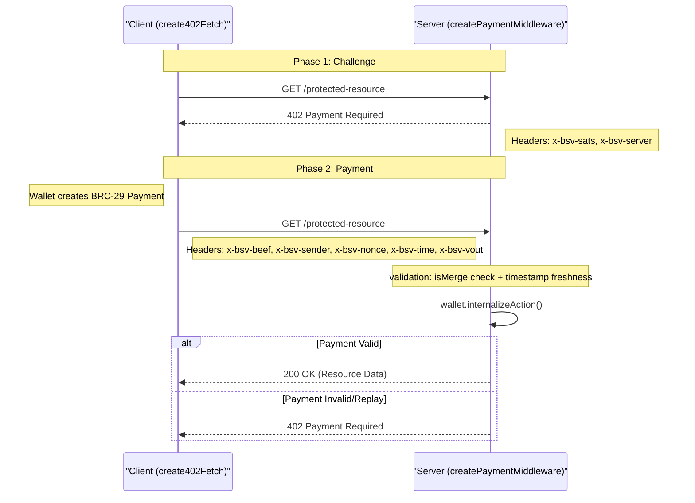
```mermaid
sequenceDiagram
    participant C as "Client (create402Fetch)"
    participant S as "Server (createPaymentMiddleware)"
    
    Note over C, S: Phase 1: Challenge
    C->>S: GET /protected-resource
    S-->>C: 402 Payment Required
    Note right of S: Headers: x-bsv-sats, x-bsv-server

    Note over C, S: Phase 2: Payment
    Note left of C: Wallet creates BRC-29 Payment
    C->>S: GET /protected-resource
    Note right of C: Headers: x-bsv-beef, x-bsv-sender, x-bsv-nonce, x-bsv-time, x-bsv-vout

    Note over S: validation: isMerge check + timestamp freshness
    S->>S: wallet.internalizeAction()
    
    alt Payment Valid
        S-->>C: 200 OK (Resource Data)
    else Payment Invalid/Replay
        S-->>C: 402 Payment Required
    end
```
Sources: [specs/payments/brc121.yaml:9-18](), [packages/middleware/402-pay/package.json:13-20]()

## Key Implementation Components

The package is split into two primary entry points: `/server` and `/client` [packages/middleware/402-pay/package.json:13-20]().

### Server Middleware: `createPaymentMiddleware`

The server-side implementation is an Express-compatible middleware that intercepts requests to protected routes. It performs the following logic:

*   **Payment Verification**: If the `x-bsv-beef` header is present, it extracts the transaction and calls `internalizeAction` on the server's wallet [specs/payments/brc121.yaml:16-17]().
*   **Replay Protection**:
    *   **Timestamp Freshness**: It checks the `x-bsv-time` header. The request is rejected if the timestamp is more than ±30 seconds from the server's current time [specs/payments/brc121.yaml:33-34]().
    *   **TXID Tracking**: It relies on the wallet's `isMerge` check. If `internalizeAction` returns `isMerge: true`, it indicates the transaction has been seen before, and the middleware returns 402 [specs/payments/brc121.yaml:35-36]().
*   **Challenge Generation**: If no payment is present or valid, it attaches the required headers (`x-bsv-sats`, `x-bsv-server`) and sends the 402 response [specs/payments/brc121.yaml:11-12]().

### Client Wrapper: `create402Fetch`

The client-side provides a wrapper around the standard `fetch` API.

*   **Automatic Retries**: If a request returns 402, the wrapper automatically handles the BRC-29 payment construction using the provided wallet instance and retries the request with the correct headers [specs/payments/brc121.yaml:13-15]().
*   **Header Management**: It populates the following headers for the paid request:
    *   `x-bsv-beef`: The base64-encoded Atomic BEEF transaction [specs/payments/brc121.yaml:111-120]().
    *   `x-bsv-sender`: The client's identity public key [specs/payments/brc121.yaml:122-132]().
    *   `x-bsv-nonce`: The BRC-29 derivation prefix [specs/payments/brc121.yaml:134-143]().
    *   `x-bsv-time`: The millisecond Unix timestamp [specs/payments/brc121.yaml:145-159]().
    *   `x-bsv-vout`: The index of the payment output in the BEEF transaction [specs/payments/brc121.yaml:161-171]().

## Key Derivation (BRC-29 & BRC-42)

Payments in BRC-121 use a specific BRC-42 invoice number format to derive the recipient's P2PKH locking script [specs/payments/brc121.yaml:21-25]():

```
2-3241645161d8-<x-bsv-nonce> <base64(x-bsv-time)>
```

| Component | Description | Source |
| :--- | :--- | :--- |
| `2` | Security level (BRC-43) | [specs/payments/brc29-payment-protocol.yaml:169]() |
| `3241645161d8` | BRC-29 Protocol Magic Number | [specs/payments/brc29-payment-protocol.yaml:170]() |
| `x-bsv-nonce` | Derivation Prefix (Random per payment) | [specs/payments/brc121.yaml:24]() |
| `x-bsv-time` | Derivation Suffix (Base64 encoded timestamp) | [specs/payments/brc121.yaml:24]() |

## Code Entity Map

The following diagram maps the BRC-121 protocol requirements to the specific code structures and headers defined in the specifications.

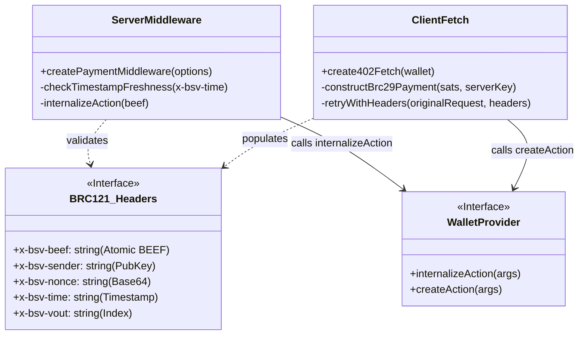
```mermaid
classDiagram
    class BRC121_Headers {
        <<Interface>>
        +x-bsv-beef: string (Atomic BEEF)
        +x-bsv-sender: string (PubKey)
        +x-bsv-nonce: string (Base64)
        +x-bsv-time: string (Timestamp)
        +x-bsv-vout: string (Index)
    }

    class ServerMiddleware {
        +createPaymentMiddleware(options)
        -checkTimestampFreshness(x-bsv-time)
        -internalizeAction(beef)
    }

    class ClientFetch {
        +create402Fetch(wallet)
        -constructBrc29Payment(sats, serverKey)
        -retryWithHeaders(originalRequest, headers)
    }

    class WalletProvider {
        <<Interface>>
        +internalizeAction(args)
        +createAction(args)
    }

    ServerMiddleware ..> BRC121_Headers : validates
    ClientFetch ..> BRC121_Headers : populates
    ServerMiddleware --> WalletProvider : calls internalizeAction
    ClientFetch --> WalletProvider : calls createAction
```
Sources: [specs/payments/brc121.yaml:106-171](), [specs/wallet/storage-adapter.yaml:120-151](), [packages/middleware/402-pay/package.json:8-21]()

## Summary of Replay Protection Mechanisms

| Mechanism | Implementation | Requirement |
| :--- | :--- | :--- |
| **Timestamp Freshness** | Server checks `|serverTime - x-bsv-time|` | Must be < 30 seconds [specs/payments/brc121.yaml:33-34]() |
| **Double Spend / Replay** | Wallet `internalizeAction` checks `isMerge` | Must be `false` (new transaction) [specs/payments/brc121.yaml:35-36]() |
| **Uniqueness** | `x-bsv-nonce` + `x-bsv-time` | Forms a unique BRC-42 derivation path [specs/payments/brc121.yaml:21-28]() |

Sources: [specs/payments/brc121.yaml:30-37]()

---

# Page: Network Layer

# Network Layer

<details>
<summary>Relevant source files</summary>

The following files were used as context for generating this wiki page:

- [packages/helpers/amountinator/tsconfig.json](packages/helpers/amountinator/tsconfig.json)
- [packages/helpers/bsv-wallet-helper/src/script-templates/ordlock.ts](packages/helpers/bsv-wallet-helper/src/script-templates/ordlock.ts)
- [packages/helpers/bsv-wallet-helper/src/script-templates/p2pkh.ts](packages/helpers/bsv-wallet-helper/src/script-templates/p2pkh.ts)
- [packages/helpers/bsv-wallet-helper/src/utils/derivation.ts](packages/helpers/bsv-wallet-helper/src/utils/derivation.ts)
- [packages/messaging/message-box-client/tsconfig.base.json](packages/messaging/message-box-client/tsconfig.base.json)
- [packages/messaging/message-box-server/src/swagger.ts](packages/messaging/message-box-server/src/swagger.ts)
- [packages/messaging/messagebox-services/backend/tsconfig.base.json](packages/messaging/messagebox-services/backend/tsconfig.base.json)
- [packages/network/chaintracks-server/package.json](packages/network/chaintracks-server/package.json)
- [packages/network/ts-p2p/package.json](packages/network/ts-p2p/package.json)
- [packages/overlays/overlay-express/package.json](packages/overlays/overlay-express/package.json)
- [packages/wallet/wab/package.json](packages/wallet/wab/package.json)
- [packages/wallet/wallet-toolbox/package.json](packages/wallet/wallet-toolbox/package.json)

</details>


The Network Layer provides the infrastructure for interacting with the Bitcoin SV peer-to-peer network and tracking the state of the blockchain. It consists of two primary components: **Chaintracks**, which handles high-performance header tracking and validation, and the **Teranode P2P Listener**, which enables participation in private libp2p-based DHT networks for real-time data subscription.

### Domain Architecture

The network domain bridges the gap between raw network protocols and the application-level services (like wallets and overlays). While the SDK handles individual transaction primitives, the Network Layer provides the context of the chain (headers) and the delivery mechanism for network-wide events.

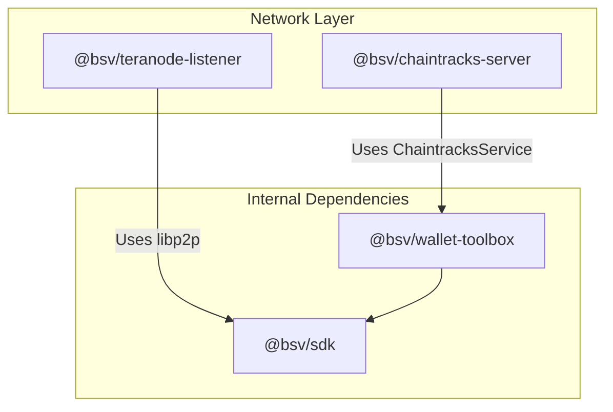
```mermaid
graph TD
    subgraph "Network Layer"
        CT["@bsv/chaintracks-server"]
        TL["@bsv/teranode-listener"]
    end

    subgraph "Internal Dependencies"
        WT["@bsv/wallet-toolbox"]
        SDK["@bsv/sdk"]
    end

    CT -->|Uses ChaintracksService| WT
    TL -->|Uses libp2p| SDK
    WT --> SDK
```
Sources: [@bsv/chaintracks-server:29-33](), [@bsv/teranode-listener:16-32]()

---

## 7.1 Chaintracks Server

The `@bsv/chaintracks-server` is a TypeScript Express application that wraps the `ChaintracksService` from the wallet-toolbox. Its primary role is to maintain an up-to-date view of the blockchain header chain, providing proof of work validation and block height information to other services.

The server supports multiple entry points and configuration modes via the `CHAIN` environment variable to toggle between `mainnet` and `testnet` environments.

| Feature | Implementation |
| --- | --- |
| **Core Logic** | `ChaintracksService` from `@bsv/wallet-toolbox` |
| **API Framework** | Express with `body-parser` |
| **Network Modes** | Mainnet, Testnet (via `CHAIN` env) |
| **Entry Points** | `server.ts`, `server-custom.ts`, `server-with-prefix.ts` |

For details, see [Chaintracks Server](#7.1).

**Sources:** [@bsv/chaintracks-server:1-42](), [@bsv/chaintracks-server:5-6](), [@bsv/chaintracks-server:11-13]()

---

## 7.2 Teranode P2P Listener

The `@bsv/teranode-listener` (also known as `ts-p2p`) is a specialized package designed to interface with Teranode's private DHT network. It utilizes `libp2p` to subscribe to specific gossipsub topics, such as block headers and UTXO subtrees.

This package is essential for high-throughput applications that require real-time notifications from Teranode nodes without relying on traditional polling mechanisms.

### Code-to-Entity Mapping

The following diagram maps the logical P2P components to the specific `libp2p` modules and dependencies used in the implementation.

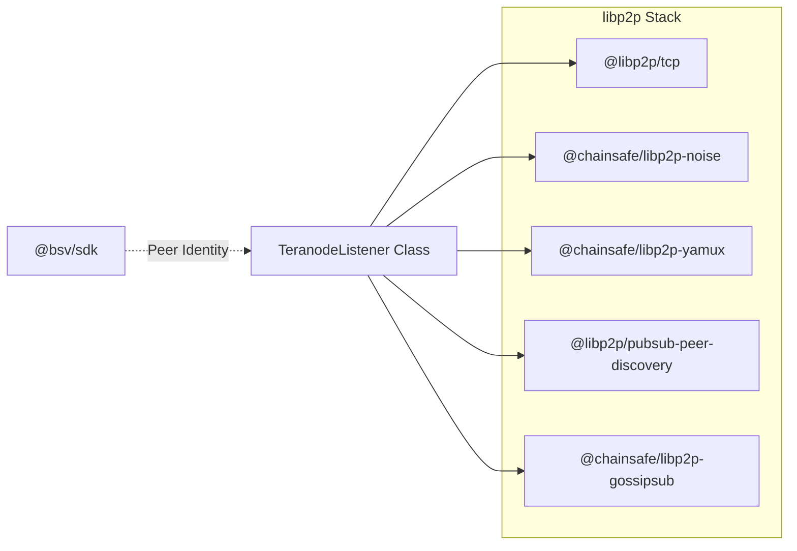
```mermaid
graph LR
    subgraph "libp2p Stack"
        Transport["@libp2p/tcp"]
        Security["@chainsafe/libp2p-noise"]
        Muxer["@chainsafe/libp2p-yamux"]
        Discovery["@libp2p/pubsub-peer-discovery"]
        PubSub["@chainsafe/libp2p-gossipsub"]
    end

    TL["TeranodeListener Class"] --> Transport
    TL --> Security
    TL --> Muxer
    TL --> Discovery
    TL --> PubSub

    SDK["@bsv/sdk"] -.->|Peer Identity| TL
```

| Component | Package / Entity |
| --- | --- |
| **Listener Class** | `TeranodeListener` |
| **Gossip Protocol** | `@chainsafe/libp2p-gossipsub` |
| **Private Network** | `@libp2p/pnet` (PSK-based access) |
| **Peer Discovery** | `@libp2p/bootstrap` & `@libp2p/pubsub-peer-discovery` |

For details, see [Teranode P2P Listener](#7.2).

**Sources:** [@bsv/teranode-listener:1-60](), [@bsv/teranode-listener:18-32](), [@bsv/teranode-listener:39-45]()

---

## Network Component Interaction

The Network Layer components interact with the rest of the stack by providing the "Ground Truth" for the blockchain.

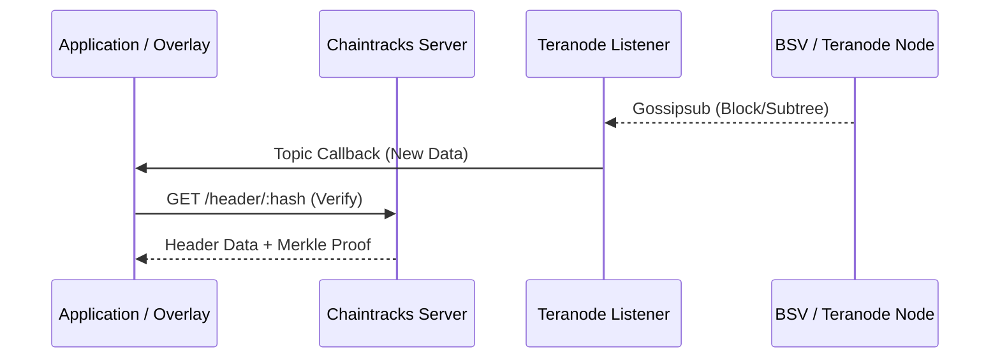
```mermaid
sequenceDiagram
    participant App as Application / Overlay
    participant CT as Chaintracks Server
    participant TL as Teranode Listener
    participant Node as BSV / Teranode Node

    Node-->>TL: Gossipsub (Block/Subtree)
    TL->>App: Topic Callback (New Data)
    App->>CT: GET /header/:hash (Verify)
    CT-->>App: Header Data + Merkle Proof
```

**Sources:** [@bsv/chaintracks-server:5-6](), [@bsv/teranode-listener:39-44]()

---

# Page: Chaintracks Server

# Chaintracks Server

<details>
<summary>Relevant source files</summary>

The following files were used as context for generating this wiki page:

- [packages/network/chaintracks-server/package.json](packages/network/chaintracks-server/package.json)
- [packages/overlays/overlay-express/package.json](packages/overlays/overlay-express/package.json)
- [packages/wallet/wab/package.json](packages/wallet/wab/package.json)
- [packages/wallet/wallet-toolbox/package.json](packages/wallet/wallet-toolbox/package.json)

</details>


The `Chaintracks Server` is a specialized network service designed to track blockchain headers and provide proof-of-work validation for the Bitcoin SV (BSV) network. It is implemented as a TypeScript Express server that wraps the `ChaintracksService` from the `@bsv/wallet-toolbox` package.

## Overview and Purpose

The primary role of the `@bsv/chaintracks-server` is to maintain an up-to-date view of the blockchain's longest chain. It serves as a lightweight alternative to running a full node for applications that only require header verification, such as Simple Payment Verification (SPV) clients and overlay services.

### Key Capabilities
- **Header Tracking**: Synchronizes and validates block headers from the BSV network.
- **Network Support**: Configurable for both `mainnet` and `testnet` via environment variables.
- **Express API**: Provides a RESTful interface for external applications to query the current chain state.
- **Modular Entrypoints**: Supports standard, custom, and prefixed routing configurations.

Sources: [packages/network/chaintracks-server/package.json:5-13](), [packages/network/chaintracks-server/package.json:29-34]()

---

## Architecture and Data Flow

The server acts as a bridge between the raw blockchain network and high-level applications. It utilizes the `ChaintracksService` for the underlying logic of header management and synchronization.

### System Components Diagram

This diagram illustrates the relationship between the server entrypoints and the core logic classes.

"Chaintracks Server Architecture"
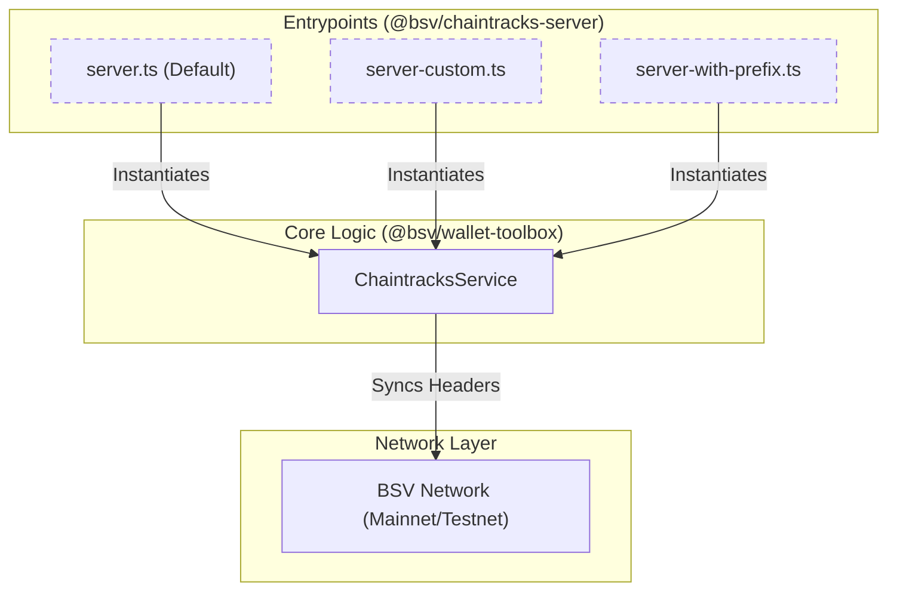
```mermaid
graph TD
    subgraph "Entrypoints (@bsv/chaintracks-server)"
        S1["server.ts (Default)"]
        S2["server-custom.ts"]
        S3["server-with-prefix.ts"]
    end

    subgraph "Core Logic (@bsv/wallet-toolbox)"
        CTS["ChaintracksService"]
    end

    subgraph "Network Layer"
        BSV["BSV Network (Mainnet/Testnet)"]
    end

    S1 -->|Instantiates| CTS
    S2 -->|Instantiates| CTS
    S3 -->|Instantiates| CTS
    CTS -->|Syncs Headers| BSV
    
    style S1 stroke-dasharray: 5 5
    style S2 stroke-dasharray: 5 5
    style S3 stroke-dasharray: 5 5
```
Sources: [packages/network/chaintracks-server/package.json:5-15](), [packages/wallet/wallet-toolbox/package.json:41-44]()

---

## Configuration and Environment

The server behavior is primarily controlled through environment variables, allowing it to switch between different BSV networks.

| Variable | Description | Default |
| :--- | :--- | :--- |
| `CHAIN` | Determines the network to track (`main` or `test`). | `main` |
| `PORT` | The port on which the Express server listens. | (Implementation dependent) |

### Start Scripts
The `package.json` defines several scripts for different deployment scenarios:
- `npm run start`: Starts the server on the default network (Mainnet).
- `npm run start:test`: Sets `CHAIN=test` and starts the server for Testnet.
- `npm run start:custom`: Uses the `server-custom.ts` entrypoint for specialized configurations.
- `npm run start:prefix`: Uses `server-with-prefix.ts` to host the API under a specific URL path.

Sources: [packages/network/chaintracks-server/package.json:8-15]()

---

## Entrypoints and Implementation

The server provides three distinct entrypoints to cater to different integration requirements. All entrypoints leverage `express` and `body-parser` to handle incoming HTTP requests.

### 1. Standard Server (`src/server.ts`)
The default entrypoint providing the standard API surface for header tracking. It initializes the `ChaintracksService` and mounts the routes directly to the root of the Express application.

### 2. Custom Server (`src/server-custom.ts`)
Allows for manual configuration of the `ChaintracksService` parameters, such as specific storage backends or initial synchronization checkpoints.

### 3. Prefixed Server (`src/server-with-prefix.ts`)
Useful when the Chaintracks API needs to be co-hosted with other services. It mounts the `ChaintracksService` routes under a specific path prefix (e.g., `/api/v1/chaintracks`).

### Entity Mapping Diagram

This diagram maps the natural language concepts to the specific code entities used in the implementation.

"Code Entity Mapping"
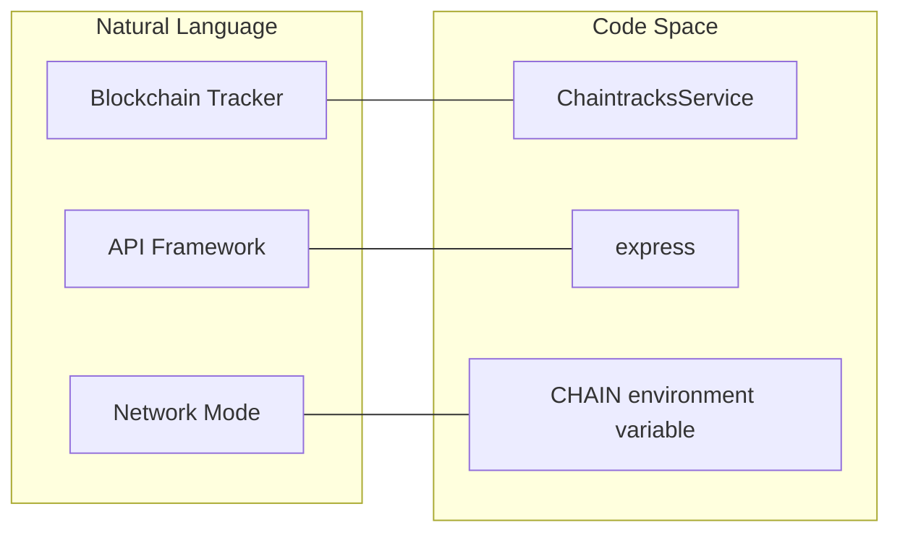
```mermaid
graph LR
    subgraph "Natural Language"
        A["Blockchain Tracker"]
        B["API Framework"]
        C["Network Mode"]
    end

    subgraph "Code Space"
        A1["ChaintracksService"]
        B1["express"]
        C1["CHAIN environment variable"]
    end

    A --- A1
    B --- B1
    C --- C1
```
Sources: [packages/network/chaintracks-server/package.json:5-6](), [packages/network/chaintracks-server/package.json:29-34](), [packages/wallet/wallet-toolbox/package.json:46-46]()

---

## Dependencies

The `chaintracks-server` is a "leaf" package in the network domain, depending on the wallet and SDK layers.

- **@bsv/wallet-toolbox**: Provides the `ChaintracksService` which contains the logic for validating block headers and maintaining the chain state.
- **@bsv/sdk**: Indirectly used for cryptographic primitives and transaction/header serialization.
- **express**: The web framework used to expose the service over HTTP.
- **dotenv**: Used to load configuration from `.env` files.

Sources: [packages/network/chaintracks-server/package.json:29-34](), [packages/wallet/wallet-toolbox/package.json:41-44]()

---

# Page: Teranode P2P Listener

# Teranode P2P Listener

<details>
<summary>Relevant source files</summary>

The following files were used as context for generating this wiki page:

- [packages/helpers/amountinator/tsconfig.json](packages/helpers/amountinator/tsconfig.json)
- [packages/helpers/bsv-wallet-helper/src/script-templates/ordlock.ts](packages/helpers/bsv-wallet-helper/src/script-templates/ordlock.ts)
- [packages/helpers/bsv-wallet-helper/src/script-templates/p2pkh.ts](packages/helpers/bsv-wallet-helper/src/script-templates/p2pkh.ts)
- [packages/helpers/bsv-wallet-helper/src/utils/derivation.ts](packages/helpers/bsv-wallet-helper/src/utils/derivation.ts)
- [packages/messaging/message-box-client/tsconfig.base.json](packages/messaging/message-box-client/tsconfig.base.json)
- [packages/messaging/message-box-server/src/swagger.ts](packages/messaging/message-box-server/src/swagger.ts)
- [packages/messaging/messagebox-services/backend/tsconfig.base.json](packages/messaging/messagebox-services/backend/tsconfig.base.json)
- [packages/network/ts-p2p/package.json](packages/network/ts-p2p/package.json)

</details>


The `@bsv/teranode-listener` (also known as `ts-p2p`) package provides a specialized interface for subscribing to Teranode P2P topics within a private DHT network. It leverages `libp2p` to facilitate secure communication, peer discovery, and message propagation (PubSub) specifically for BSV blockchain events such as new blocks and transaction subtrees.

## Overview and Purpose

The primary role of the Teranode P2P Listener is to allow services to receive real-time updates from Teranode instances. Unlike public Bitcoin P2P protocols, this listener is designed for a **private network** environment using a Pre-Shared Key (PSK) for network-level access control.

Key capabilities include:
*   **Private DHT Network**: Access is restricted via a 32-byte PSK [packages/network/ts-p2p/package.json:28-28]().
*   **Gossipsub Support**: Uses `@chainsafe/libp2p-gossipsub` for efficient message routing [packages/network/ts-p2p/package.json:18-18]().
*   **Topic Subscriptions**: Specialized handlers for blockchain-specific topics like blocks and subtrees.
*   **Peer Discovery**: Implements bootstrap nodes and PubSub-based peer discovery [packages/network/ts-p2p/package.json:21-29]().

## System Architecture

The listener operates as a node within a `libp2p` stack, configured with specific security and transport layers suitable for high-performance blockchain data.

### Data Flow Diagram
This diagram illustrates the flow of a message from the Teranode network through the `TeranodeListener` to application callbacks.

Title: Teranode Listener Data Flow
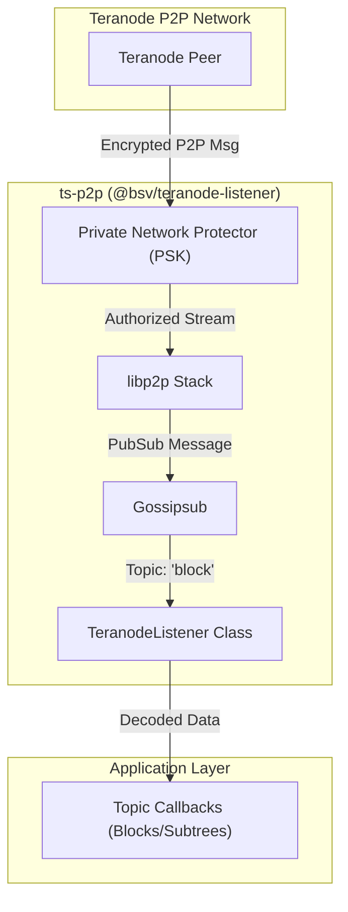
```mermaid
graph TD
    subgraph "Teranode P2P Network"
        TN["Teranode Peer"]
    end

    subgraph "ts-p2p (@bsv/teranode-listener)"
        LP2P["libp2p Stack"]
        PNET["Private Network Protector (PSK)"]
        GS["Gossipsub"]
        TL["TeranodeListener Class"]
    end

    subgraph "Application Layer"
        CB["Topic Callbacks (Blocks/Subtrees)"]
    end

    TN -- "Encrypted P2P Msg" --> PNET
    PNET -- "Authorized Stream" --> LP2P
    LP2P -- "PubSub Message" --> GS
    GS -- "Topic: 'block'" --> TL
    TL -- "Decoded Data" --> CB
```
Sources: [packages/network/ts-p2p/package.json:18-32]()

## Code Entity Map

The following diagram maps the logical components of the P2P listener to the specific libraries and types used in the implementation.

Title: Code Entity Relationship Map
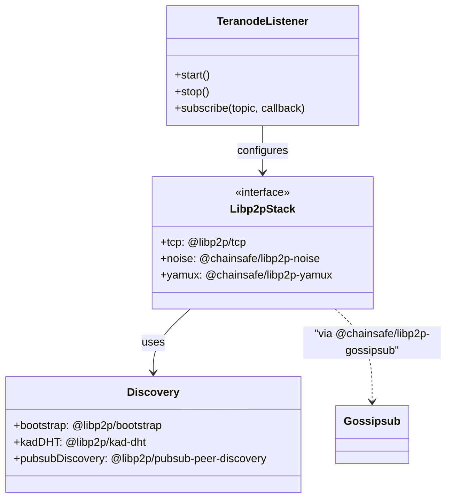
```mermaid
classDiagram
    class TeranodeListener {
        +start()
        +stop()
        +subscribe(topic, callback)
    }

    class Libp2pStack {
        <<interface>>
        +tcp: @libp2p/tcp
        +noise: @chainsafe/libp2p-noise
        +yamux: @chainsafe/libp2p-yamux
    }

    class Discovery {
        +bootstrap: @libp2p/bootstrap
        +kadDHT: @libp2p/kad-dht
        +pubsubDiscovery: @libp2p/pubsub-peer-discovery
    }

    TeranodeListener --> Libp2pStack : configures
    Libp2pStack --> Discovery : uses
    Libp2pStack ..> Gossipsub : "via @chainsafe/libp2p-gossipsub"
```
Sources: [packages/network/ts-p2p/package.json:16-33]()

## Implementation Details

### Dependency Stack
The listener relies on a modern `libp2p` configuration:
*   **Transport**: TCP (`@libp2p/tcp`) [packages/network/ts-p2p/package.json:30-30]().
*   **Security**: Noise encryption (`@chainsafe/libp2p-noise`) [packages/network/ts-p2p/package.json:19-19]().
*   **Multiplexing**: Yamux (`@chainsafe/libp2p-yamux`) [packages/network/ts-p2p/package.json:20-20]().
*   **Private Networking**: PNET using a PSK (`@libp2p/pnet`) [packages/network/ts-p2p/package.json:28-28]().
*   **Peer ID**: Uses `@libp2p/peer-id` for node identity [packages/network/ts-p2p/package.json:26-26]().

### Peer Discovery and DHT
To maintain connectivity in the private network, the listener employs multiple discovery strategies:
1.  **Bootstrap Nodes**: Initial entry points into the network defined during initialization [packages/network/ts-p2p/package.json:21-21]().
2.  **Kademlia DHT**: Used for routing and finding peers in the private DHT (`@libp2p/kad-dht`) [packages/network/ts-p2p/package.json:25-25]().
3.  **PubSub Discovery**: Peers can discover each other via dedicated PubSub channels [packages/network/ts-p2p/package.json:29-29]().

### Topic Subscriptions
The `TeranodeListener` class provides a high-level abstraction over the Gossipsub implementation. It typically handles:
*   **Blocks**: Subscription to full block announcements.
*   **Subtrees**: Subscription to Merkle subtree data, often used for partial validation or SPV clients.

## Deployment

### Docker Integration
The package is designed to be containerized, allowing it to run alongside other BSV infrastructure components. It requires environment variables for:
*   `LISTEN_ADDRESSES`: Multiaddrs for the node to listen on.
*   `BOOTSTRAP_NODES`: List of initial peers.
*   `NETWORK_PSK`: The 32-byte hex-encoded private network key.

### Configuration Example
While the internal implementation is encapsulated, the listener configuration follows the `libp2p` options pattern:

| Feature | Code Entity / Package |
| :--- | :--- |
| **Gossipsub** | `@chainsafe/libp2p-gossipsub` |
| **Identity** | `@libp2p/identify` |
| **Ping** | `@libp2p/ping` |
| **Addressing** | `@multiformats/multiaddr` |

Sources: [packages/network/ts-p2p/package.json:18-32]()

---

# Page: Helper Packages

# Helper Packages

<details>
<summary>Relevant source files</summary>

The following files were used as context for generating this wiki page:

- [packages/helpers/amountinator/package.json](packages/helpers/amountinator/package.json)
- [packages/helpers/bsv-wallet-helper/package.json](packages/helpers/bsv-wallet-helper/package.json)
- [packages/helpers/fund-metanet/BASELINE.md](packages/helpers/fund-metanet/BASELINE.md)
- [packages/helpers/fund-metanet/package.json](packages/helpers/fund-metanet/package.json)
- [packages/helpers/simple/package.json](packages/helpers/simple/package.json)
- [packages/helpers/ts-paymail/package.json](packages/helpers/ts-paymail/package.json)

</details>


The Helper Packages domain provides high-level abstractions, specialized protocol implementations, and utility tools that sit atop the Core SDK and Wallet layers. These packages are designed to simplify application development by providing "batteries-included" APIs for common tasks such as identity management, peer-to-peer payments, and currency conversion.

### Helper Domain Architecture

The helpers range from `@bsv/simple`, which acts as a primary entry point for application developers, to specialized utilities like `@bsv/amountinator`.

#### Helper Dependency Mapping
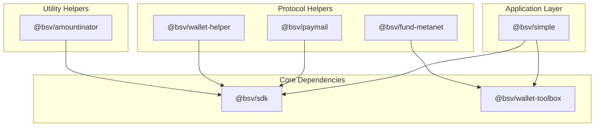
```mermaid
graph TD
  subgraph "Application Layer"
    Simple["@bsv/simple"]
  end

  subgraph "Protocol Helpers"
    Paymail["@bsv/paymail"]
    WalletHelper["@bsv/wallet-helper"]
    FundMetanet["@bsv/fund-metanet"]
  end

  subgraph "Utility Helpers"
    Amountinator["@bsv/amountinator"]
  end

  subgraph "Core Dependencies"
    SDK["@bsv/sdk"]
    Toolbox["@bsv/wallet-toolbox"]
  end

  Simple --> SDK
  Simple --> Toolbox
  Paymail --> SDK
  WalletHelper --> SDK
  Amountinator --> SDK
  FundMetanet --> Toolbox
```
Sources: [packages/helpers/simple/package.json:45-50](), [packages/helpers/ts-paymail/package.json:104-105](), [packages/helpers/bsv-wallet-helper/package.json:34-37](), [packages/helpers/amountinator/package.json:34-37](), [packages/helpers/fund-metanet/package.json:20-22]()

---

### @bsv/simple: High-Level Application API

`@bsv/simple` is the recommended high-level wrapper for developers who want to interact with the BSV blockchain without managing low-level transaction plumbing. It provides a unified `wallet` interface that handles:

*   **Payments & Tokens**: Simplified `wallet.pay()` and `wallet.createToken()` methods.
*   **Inscriptions**: High-level `wallet.inscribeText()` for Ordinal-style data.
*   **Identity**: Built-in support for DID generation and Verifiable Credential (VC) issuance.
*   **Environment Switching**: Specific entry points for `browser` and `server` environments [packages/helpers/simple/package.json:11-24]().

For details on the high-level API, see [@bsv/simple: High-Level Application API](#8.1).

---

### Paymail, Wallet Helper & Utility Packages

This sub-domain contains the protocol-specific implementations and mathematical utilities required for production-grade wallets and services.

#### Key Packages

| Package | Purpose | Primary Features |
|:---|:---|:---|
| `@bsv/paymail` | Identity & P2P | PKI lookups, P2P transaction delivery, and BEEF-based `sendP2P` [packages/helpers/ts-paymail/package.json:81-83](). |
| `@bsv/wallet-helper` | Script Templates | Pre-defined templates for P2PKH and OrdLock scripts [packages/helpers/bsv-wallet-helper/package.json:2-5](). |
| `@bsv/amountinator` | Conversion | Mathematical utilities for converting between satoshis and various fiat/unit representations [packages/helpers/amountinator/package.json:2-4](). |
| `@bsv/fund-metanet` | CLI Utility | A Tier-3 developer tool for funding Metanet-compatible wallets with BSV [packages/helpers/fund-metanet/BASELINE.md:12-13](). |

#### Protocol Interaction Flow
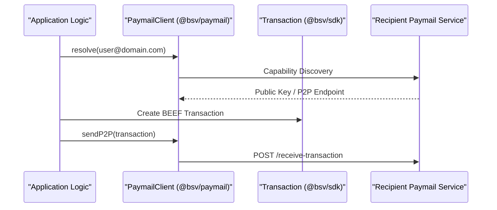
```mermaid
sequenceDiagram
    participant App as "Application Logic"
    participant Paymail as "PaymailClient (@bsv/paymail)"
    participant SDK as "Transaction (@bsv/sdk)"
    participant Remote as "Recipient Paymail Service"

    App->>Paymail: resolve(user@domain.com)
    Paymail->>Remote: Capability Discovery
    Remote-->>Paymail: Public Key / P2P Endpoint
    App->>SDK: Create BEEF Transaction
    App->>Paymail: sendP2P(transaction)
    Paymail->>Remote: POST /receive-transaction
```
Sources: [packages/helpers/ts-paymail/package.json:29-48](), [packages/helpers/ts-paymail/package.json:83-84]()

For detailed documentation on these utilities and the Paymail client, see [Paymail, Wallet Helper & Utility Packages](#8.2).

---

### Package Criticality and Reliability

The helper domain contains a mix of production-critical libraries and internal developer tools.

| Package | Criticality | Reliability | Build Tool |
|:---|:---|:---|:---|
| `@bsv/simple` | Tier 1 | RL1 | `tsc` |
| `@bsv/paymail` | Tier 1 | RL1 | `tsc` + Dual Package |
| `@bsv/amountinator` | Tier 2 | RL1 | `tsc` |
| `@bsv/fund-metanet` | Tier 3 | RL0 | `tsc` |

Sources: [packages/helpers/fund-metanet/BASELINE.md:11-13](), [packages/helpers/ts-paymail/package.json:77-77](), [packages/helpers/bsv-wallet-helper/package.json:28-28]()

---

# Page: @bsv/simple: High-Level Application API

# @bsv/simple: High-Level Application API

<details>
<summary>Relevant source files</summary>

The following files were used as context for generating this wiki page:

- [packages/helpers/amountinator/package.json](packages/helpers/amountinator/package.json)
- [packages/helpers/bsv-wallet-helper/package.json](packages/helpers/bsv-wallet-helper/package.json)
- [packages/helpers/simple/package.json](packages/helpers/simple/package.json)
- [packages/helpers/ts-paymail/package.json](packages/helpers/ts-paymail/package.json)

</details>


The `@bsv/simple` package serves as the primary high-level entry point for developers building applications on the BSV blockchain. It abstracts the complexities of the `@bsv/sdk` and the `@bsv/wallet-toolbox` into a simplified API, providing pre-configured workflows for common tasks such as making payments, creating tokens, inscribing data, and managing decentralized identities (DIDs).

### Purpose and Scope
`@bsv/simple` is designed to minimize boilerplate by wrapping lower-level primitives into a "Wallet" object that handles state, key management, and network interactions. It provides specific entry points for browser and server environments to ensure compatibility with different storage and networking constraints.

---

## Architecture & Entry Points

The package uses a modular structure with environment-specific exports. This allows the same API surface to be used in a Node.js backend or a web browser while swapping the underlying storage and transport implementations.

### Environment-Specific Exports
The package defines three primary entry points in its `package.json`:
1.  **General (`.`):** Default export for common utilities [packages/helpers/simple/package.json:12-15]().
2.  **Browser (`./browser`):** Optimized for client-side environments, likely utilizing `StorageIdb` (IndexedDB) from the toolbox [packages/helpers/simple/package.json:16-19]().
3.  **Server (`./server`):** Optimized for Node.js, supporting filesystem or database-backed storage like `StorageKnex` [packages/helpers/simple/package.json:20-23]().

### Dependency Hierarchy
`@bsv/simple` acts as a glue layer for several core domains:
*   **@bsv/sdk:** For transaction construction, script templates, and cryptographic primitives [packages/helpers/simple/package.json:47]().
*   **@bsv/wallet-toolbox:** For wallet state management, UTXO tracking, and storage [packages/helpers/simple/package.json:48]().
*   **@bsv/message-box-client:** For peer-to-peer communication and notification handling [packages/helpers/simple/package.json:46]().

### Data Flow: Application to Blockchain
The following diagram illustrates how a call to a high-level function in `@bsv/simple` flows through the underlying stack.

**Simple API Execution Flow**
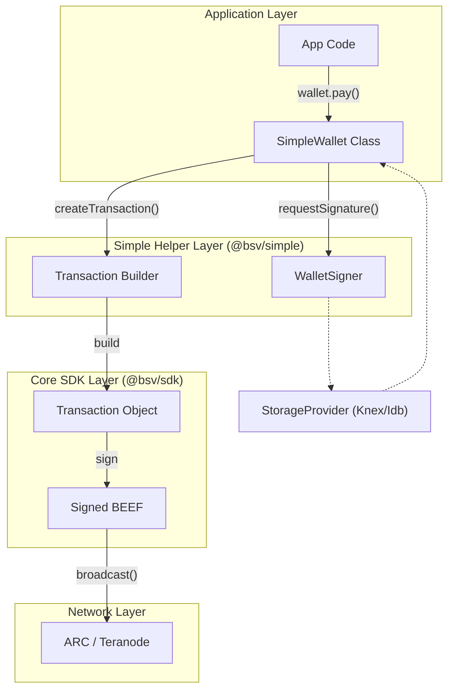
```mermaid
graph TD
    subgraph "Application Layer"
        A["App Code"] -- "wallet.pay()" --> B["SimpleWallet Class"]
    end

    subgraph "Simple Helper Layer (@bsv/simple)"
        B -- "requestSignature()" --> C["WalletSigner"]
        B -- "createTransaction()" --> D["Transaction Builder"]
    end

    subgraph "Core SDK Layer (@bsv/sdk)"
        D -- "build" --> E["Transaction Object"]
        E -- "sign" --> F["Signed BEEF"]
    end

    subgraph "Network Layer"
        F -- "broadcast()" --> G["ARC / Teranode"]
    end

    C -.-> H["StorageProvider (Knex/Idb)"]
    H -.-> B
```
Sources: [packages/helpers/simple/package.json:45-50](), [packages/helpers/simple/package.json:11-24]()

---

## Key Functionality

The `@bsv/simple` API focuses on several high-level "modules" that encapsulate complex blockchain operations.

### Wallet and Payments
The `wallet.pay()` function simplifies the process of sending BSV. It internally handles:
*   UTXO selection via the `WalletStorageManager`.
*   Output creation using P2PKH or other script templates.
*   Fee calculation.
*   Broadcasting the transaction to the network.

### Tokens and Inscriptions
The API provides simplified methods for BRC-20 style inscriptions and token management:
*   **`wallet.inscribeText()`**: Creates an inscription (typically using `PushDrop` or similar templates) containing UTF-8 text.
*   **`wallet.createToken()`**: Orchestrates the creation of a new token supply, integrating with the BTMS (Basic Token Management System) logic found in the wallet layer.

### Identity and Certificates
`@bsv/simple` provides built-in support for decentralized identity (DID) and Verifiable Credentials (VC):
*   **DID Generation:** Automatically derives identity keys using BRC-42 derivation paths.
*   **VC Issuance:** Wraps the process of signing identity claims to issue certificates that can be stored in the `certmap` or `identity` overlay topics.

### Overlay Integration
The library facilitates broadcasting transactions to specific overlays. When an action is performed (like creating a token), `@bsv/simple` can automatically route the resulting transaction to the relevant overlay services (e.g., `utility-tokens` or `kvstore`) to ensure the data is indexed and discoverable.

---

## System Integration Map

This diagram maps the high-level methods in `@bsv/simple` to the internal classes and packages they orchestrate.

**Simple API Component Mapping**
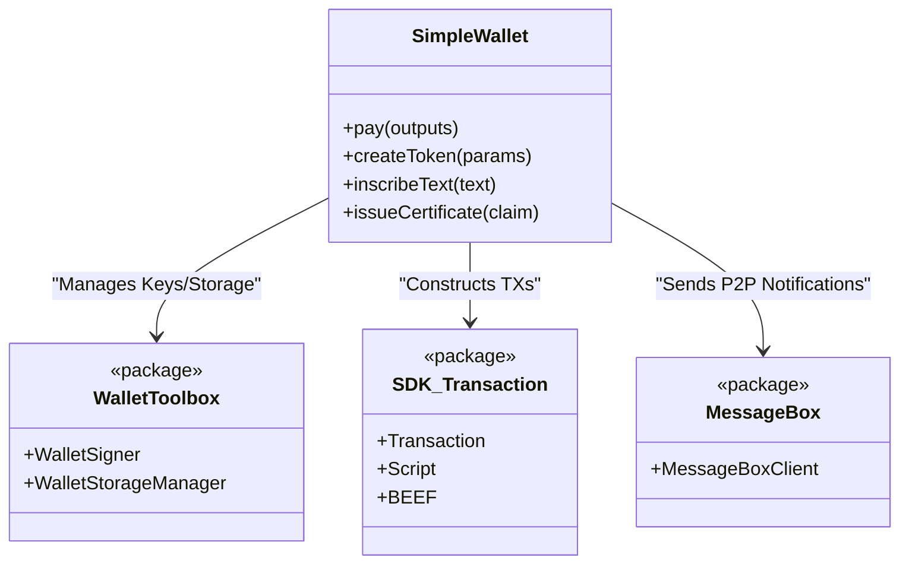
```mermaid
classDiagram
    class SimpleWallet {
        +pay(outputs)
        +createToken(params)
        +inscribeText(text)
        +issueCertificate(claim)
    }

    class WalletToolbox {
        <<package>>
        +WalletSigner
        +WalletStorageManager
    }

    class SDK_Transaction {
        <<package>>
        +Transaction
        +Script
        +BEEF
    }

    class MessageBox {
        <<package>>
        +MessageBoxClient
    }

    SimpleWallet --> WalletToolbox : "Manages Keys/Storage"
    SimpleWallet --> SDK_Transaction : "Constructs TXs"
    SimpleWallet --> MessageBox : "Sends P2P Notifications"
```
Sources: [packages/helpers/simple/package.json:45-50](), [packages/helpers/simple/package.json:33-42]()

---

## Utility Packages Integration

`@bsv/simple` often works in tandem with other helper packages in the `packages/helpers/` directory to provide a full application suite.

| Package | Integration Role |
| :--- | :--- |
| **@bsv/paymail** | Used for looking up public keys and delivery targets via human-readable handles during `wallet.pay()` [packages/helpers/ts-paymail/package.json:2-4](). |
| **@bsv/amountinator** | Used for converting fiat values to Satoshis before passing them to the wallet API [packages/helpers/amountinator/package.json:2-4](). |
| **@bsv/wallet-helper** | Provides specific script templates (like `OrdLock`) used for inscriptions [packages/helpers/bsv-wallet-helper/package.json:2-3](). |

Sources: [packages/helpers/ts-paymail/package.json:104-105](), [packages/helpers/amountinator/package.json:34-36](), [packages/helpers/bsv-wallet-helper/package.json:34-36]()

---

# Page: Paymail, Wallet Helper & Utility Packages

# Paymail, Wallet Helper & Utility Packages

<details>
<summary>Relevant source files</summary>

The following files were used as context for generating this wiki page:

- [conformance/runner/ts/jest.config.mjs](conformance/runner/ts/jest.config.mjs)
- [conformance/runner/ts/package.json](conformance/runner/ts/package.json)
- [conformance/runner/ts/runner.test.ts](conformance/runner/ts/runner.test.ts)
- [conformance/runner/ts/tsconfig.json](conformance/runner/ts/tsconfig.json)
- [packages/helpers/amountinator/BASELINE.md](packages/helpers/amountinator/BASELINE.md)
- [packages/helpers/amountinator/tsconfig.json](packages/helpers/amountinator/tsconfig.json)
- [packages/helpers/bsv-wallet-helper/BASELINE.md](packages/helpers/bsv-wallet-helper/BASELINE.md)
- [packages/helpers/bsv-wallet-helper/src/script-templates/ordlock.ts](packages/helpers/bsv-wallet-helper/src/script-templates/ordlock.ts)
- [packages/helpers/bsv-wallet-helper/src/script-templates/p2pkh.ts](packages/helpers/bsv-wallet-helper/src/script-templates/p2pkh.ts)
- [packages/helpers/bsv-wallet-helper/src/utils/derivation.ts](packages/helpers/bsv-wallet-helper/src/utils/derivation.ts)
- [packages/helpers/fund-metanet/BASELINE.md](packages/helpers/fund-metanet/BASELINE.md)
- [packages/helpers/fund-metanet/package.json](packages/helpers/fund-metanet/package.json)
- [packages/helpers/simple/BASELINE.md](packages/helpers/simple/BASELINE.md)
- [packages/helpers/ts-paymail/BASELINE.md](packages/helpers/ts-paymail/BASELINE.md)
- [packages/helpers/ts-paymail/docs/examples/package.json](packages/helpers/ts-paymail/docs/examples/package.json)
- [packages/messaging/authsocket-client/BASELINE.md](packages/messaging/authsocket-client/BASELINE.md)
- [packages/messaging/authsocket/BASELINE.md](packages/messaging/authsocket/BASELINE.md)
- [packages/messaging/message-box-client/BASELINE.md](packages/messaging/message-box-client/BASELINE.md)
- [packages/messaging/message-box-client/tsconfig.base.json](packages/messaging/message-box-client/tsconfig.base.json)
- [packages/messaging/message-box-server/src/swagger.ts](packages/messaging/message-box-server/src/swagger.ts)
- [packages/messaging/messagebox-services/backend/tsconfig.base.json](packages/messaging/messagebox-services/backend/tsconfig.base.json)
- [packages/network/ts-p2p/package.json](packages/network/ts-p2p/package.json)
- [pnpm-lock.yaml](pnpm-lock.yaml)

</details>


This section documents the auxiliary helper packages that facilitate high-level interactions with the BSV blockchain, specifically focusing on identity (Paymail), transaction construction (Wallet Helper), and utility functions for currency and funding.

## 1. Paymail (@bsv/paymail)

The `@bsv/paymail` package provides a TypeScript implementation of the Paymail protocol. It handles PKI (Public Key Infrastructure) lookups, profile retrieval, and peer-to-peer (P2P) transaction delivery.

### Data Flow: P2P Transaction Delivery
The package supports both standard P2P transaction delivery and BEEF (Bitcoin Enclosure Envelope Format) based delivery.

Title: Paymail P2P Delivery Flow
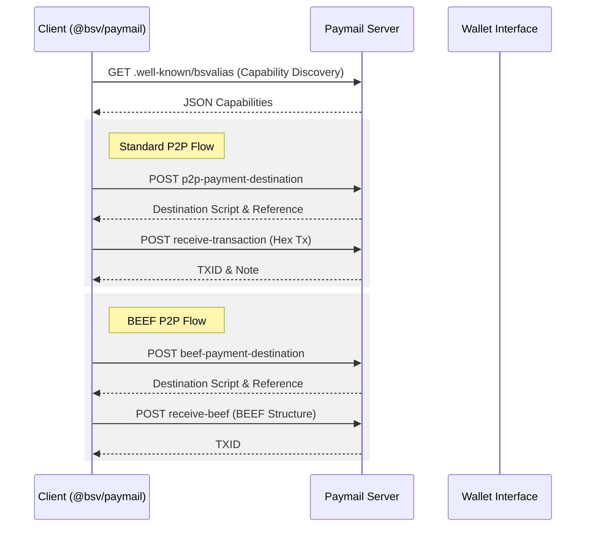
```mermaid
sequenceDiagram
    participant C as Client (@bsv/paymail)
    participant S as Paymail Server
    participant W as Wallet Interface

    C->>S: GET .well-known/bsvalias (Capability Discovery)
    S-->>C: JSON Capabilities
    
    rect rgb(240, 240, 240)
    note right of C: Standard P2P Flow
    C->>S: POST p2p-payment-destination
    S-->>C: Destination Script & Reference
    C->>S: POST receive-transaction (Hex Tx)
    S-->>C: TXID & Note
    end

    rect rgb(240, 240, 240)
    note right of C: BEEF P2P Flow
    C->>S: POST beef-payment-destination
    S-->>C: Destination Script & Reference
    C->>S: POST receive-beef (BEEF Structure)
    S-->>C: TXID
    end
```
**Sources:** [packages/helpers/ts-paymail/docs/examples/package.json:14-15](), [pnpm-lock.yaml:154-196]()

### Key Implementation Details
*   **Capability Discovery**: Clients resolve the `.well-known/bsvalias` endpoint to determine supported features (e.g., PKI, Profile, BEEF).
*   **BEEF Support**: Includes scripts for sending transactions in BEEF format, which includes the transaction and its necessary Merkle proofs/ancestors for SPV validation.

**Sources:** [packages/helpers/ts-paymail/docs/examples/package.json:15](), [packages/helpers/ts-paymail/docs/examples/src/client/sendP2PBeef.js:1-20]() (inferred from scripts)

---

## 2. Wallet Helper (@bsv/bsv-wallet-helper)

The `@bsv/bsv-wallet-helper` package provides high-level utilities for key derivation and script templates, bridging the gap between raw SDK primitives and wallet-specific requirements.

### Key Derivation Utilities
The package automates the creation of BRC-29 compatible derivations for counterparty interactions.

Title: Wallet Helper Derivation Logic
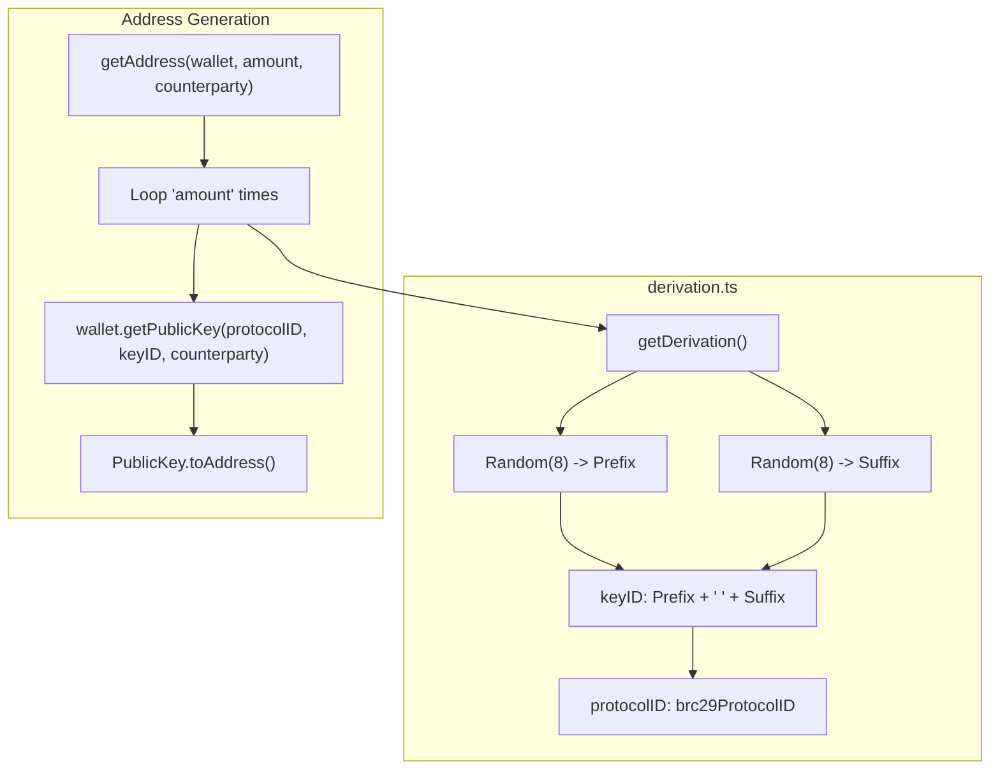
```mermaid
graph TD
    subgraph "derivation.ts"
        A["getDerivation()"] --> B["Random(8) -> Prefix"]
        A --> C["Random(8) -> Suffix"]
        B & C --> D["keyID: Prefix + ' ' + Suffix"]
        D --> E["protocolID: brc29ProtocolID"]
    end

    subgraph "Address Generation"
        F["getAddress(wallet, amount, counterparty)"] --> G["Loop 'amount' times"]
        G --> A
        G --> H["wallet.getPublicKey(protocolID, keyID, counterparty)"]
        H --> I["PublicKey.toAddress()"]
    end
```
**Sources:** [packages/helpers/bsv-wallet-helper/src/utils/derivation.ts:4-11](), [packages/helpers/bsv-wallet-helper/src/utils/derivation.ts:22-56]()

### Script Templates
The package includes templates for common Bitcoin script patterns:
*   **P2PKH**: Standard Pay-to-Public-Key-Hash scripts.
*   **OrdLock**: Specialized scripts for Ordinal locking/unlocking.

**Sources:** [packages/helpers/bsv-wallet-helper/src/script-templates/p2pkh.ts:1-10](), [packages/helpers/bsv-wallet-helper/src/script-templates/ordlock.ts:1-10]()

---

## 3. Utility Packages

### 3.1 Amountinator (@bsv/amountinator)
A utility for currency and unit conversion within the BSV ecosystem. It depends on `@bsv/sdk` for transaction-related value handling and `@bsv/wallet-toolbox-client` for retrieving exchange rates or wallet balances.

**Sources:** [packages/helpers/amountinator/package.json:42-49](), [pnpm-lock.yaml:42-63]()

### 3.2 Fund Metanet (@bsv/fund-metanet)
A CLI tool and library designed to fund Metanet-compatible wallets. It integrates `@bsv/wallet-toolbox` to manage storage and signing for the funding process.

**Key Features:**
*   **Environment Integration**: Uses `dotenv` for configuration.
*   **Interactive CLI**: Utilizes `readline` and `chalk` for user interaction.
*   **Wallet Integration**: Leverages `WalletToolbox` for transaction signing and broadcast.

**Sources:** [packages/helpers/fund-metanet/package.json:20-27](), [packages/helpers/fund-metanet/package.json:10-12]()

---

## 4. Code Entity Mapping

The following diagram maps the high-level utility functions to their specific code implementations and dependencies.

Title: Helper Package Entity Mapping
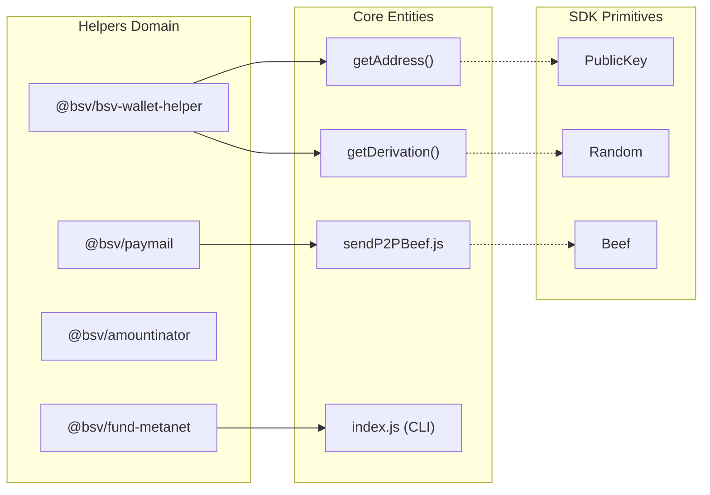
```mermaid
graph LR
    subgraph "Helpers Domain"
        PAY["@bsv/paymail"]
        WHELP["@bsv/bsv-wallet-helper"]
        AMT["@bsv/amountinator"]
        FUND["@bsv/fund-metanet"]
    end

    subgraph "Core Entities"
        PAY_C["sendP2PBeef.js"]
        WHELP_D["getDerivation()"]
        WHELP_A["getAddress()"]
        FUND_I["index.js (CLI)"]
    end

    subgraph "SDK Primitives"
        SDK_P["PublicKey"]
        SDK_R["Random"]
        SDK_B["Beef"]
    end

    PAY --> PAY_C
    PAY_C -.-> SDK_B
    
    WHELP --> WHELP_D
    WHELP --> WHELP_A
    WHELP_D -.-> SDK_R
    WHELP_A -.-> SDK_P

    FUND --> FUND_I
```
**Sources:** [packages/helpers/ts-paymail/docs/examples/package.json:15](), [packages/helpers/bsv-wallet-helper/src/utils/derivation.ts:4-56](), [packages/helpers/fund-metanet/package.json:11]()

## Summary of Package Roles

| Package | Primary Responsibility | Key Dependency |
| :--- | :--- | :--- |
| `@bsv/paymail` | PKI lookups and P2P transaction delivery | `@bsv/sdk` |
| `@bsv/bsv-wallet-helper` | Script templates and BRC-29 key derivation | `@bsv/sdk`, `@bsv/wallet-toolbox-client` |
| `@bsv/amountinator` | Unit conversion and currency math | `@bsv/sdk` |
| `@bsv/fund-metanet` | CLI-based wallet funding | `@bsv/wallet-toolbox` |

**Sources:** [pnpm-lock.yaml:42-196](), [packages/helpers/fund-metanet/package.json:20-27]()

---

# Page: Conformance & Testing Framework

# Conformance & Testing Framework

<details>
<summary>Relevant source files</summary>

The following files were used as context for generating this wiki page:

- [conformance/META.json](conformance/META.json)
- [conformance/VECTOR-FORMAT.md](conformance/VECTOR-FORMAT.md)
- [conformance/runner/package.json](conformance/runner/package.json)
- [conformance/runner/src/runner.js](conformance/runner/src/runner.js)
- [conformance/schema/vector.schema.json](conformance/schema/vector.schema.json)
- [conformance/vectors/sdk/crypto/ecdsa.json](conformance/vectors/sdk/crypto/ecdsa.json)
- [conformance/vectors/sdk/crypto/ecies.json](conformance/vectors/sdk/crypto/ecies.json)
- [conformance/vectors/sdk/crypto/hmac.json](conformance/vectors/sdk/crypto/hmac.json)

</details>


The **Conformance & Testing Framework** is a language-neutral system designed to ensure that all BSV SDK implementations (TypeScript, Go, and others) behave identically. It provides a single source of truth for expected behavior, moving beyond unit tests into a cross-language verification pipeline.

The framework consists of a centralized **Vector Corpus**, standardized **JSON Schemas**, and per-language **Runners** that execute these vectors against their respective SDK implementations.

### System Architecture

The following diagram illustrates the relationship between the language-neutral vector corpus and the language-specific implementations.

**Cross-Language Conformance Flow**
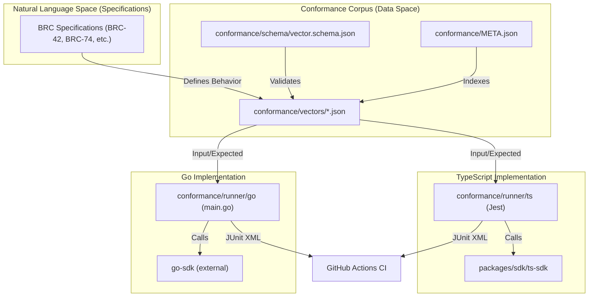
```mermaid
graph TD
    subgraph "Natural Language Space (Specifications)"
        BRC["BRC Specifications (BRC-42, BRC-74, etc.)"]
    end

    subgraph "Conformance Corpus (Data Space)"
        VECTORS["conformance/vectors/*.json"]
        SCHEMA["conformance/schema/vector.schema.json"]
        META["conformance/META.json"]
    end

    subgraph "TypeScript Implementation"
        TSRunner["conformance/runner/ts (Jest)"]
        TSSDK["packages/sdk/ts-sdk"]
    end

    subgraph "Go Implementation"
        GoRunner["conformance/runner/go (main.go)"]
        GoSDK["go-sdk (external)"]
    end

    BRC -->|Defines Behavior| VECTORS
    SCHEMA -->|Validates| VECTORS
    META -->|Indexes| VECTORS

    VECTORS -->|Input/Expected| TSRunner
    TSRunner -->|Calls| TSSDK
    
    VECTORS -->|Input/Expected| GoRunner
    GoRunner -->|Calls| GoSDK

    TSRunner -->|JUnit XML| CI["GitHub Actions CI"]
    GoRunner -->|JUnit XML| CI
```
**Sources:** [conformance/VECTOR-FORMAT.md:1-150](), [conformance/META.json:1-32]()

---

### Core Components

#### 1. Conformance Vector Corpus
The corpus is a collection of 27 JSON files containing 238+ test vectors [conformance/META.json:14-15](). These vectors cover critical cryptographic and protocol logic, including:
*   **sdk.crypto**: AES, ECDSA, ECIES, HMAC, SHA256, RIPEMD160.
*   **sdk.keys**: BRC-42 key derivation, Private/Public key operations.
*   **sdk.transactions**: Merkle Path (BRC-74) and serialization.
*   **sdk.compat**: BSM (Bitcoin Signed Messages).

For details on the vector format and coverage, see [Conformance Vector Corpus](#9.1).

#### 2. The Regression Queue
The framework tracks known cross-language bugs and edge cases via the `regression_index` in `conformance/META.json` [conformance/META.json:18-31](). Each entry maps a specific vector ID to a GitHub issue (e.g., `beef-v2-txid-panic` mapping to `go-sdk#306`). This ensures that once a bug is fixed in one language, it never regresses in another.

#### 3. Conformance Runners
Runners are responsible for loading the JSON vectors, dispatching the `input` to the local SDK functions, and asserting that the output matches the `expected` field.
*   **TypeScript Runner**: Integrated into the monorepo using Jest; it uses dispatch functions to map vector IDs to `ts-sdk` classes like `ECDSA` [conformance/vectors/sdk/crypto/ecdsa.json:7]() or `ECIES`.
*   **Go Runner**: A standalone CLI tool that generates JUnit XML reports for CI consumption.

For details on runner implementation, see [TypeScript & Go Conformance Runners](#9.2).

---

### Data Structures & Validation

Every vector file must adhere to a strict JSON Schema to ensure compatibility across different language runners.

**Vector Entity Mapping**
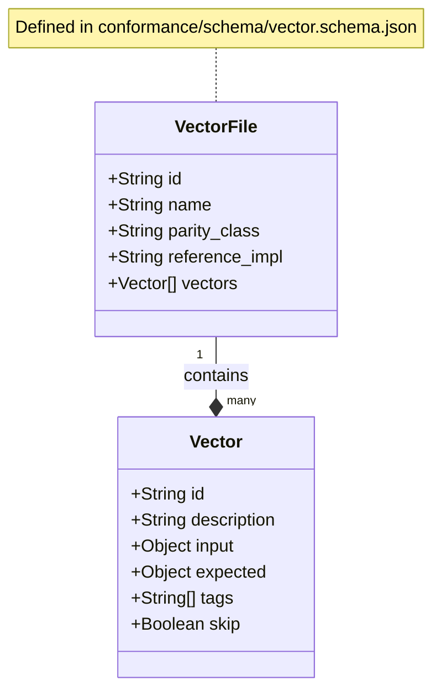
```mermaid
classDiagram
    class VectorFile {
        +String id
        +String name
        +String parity_class
        +String reference_impl
        +Vector[] vectors
    }
    class Vector {
        +String id
        +String description
        +Object input
        +Object expected
        +String[] tags
        +Boolean skip
    }
    VectorFile "1" --* "many" Vector : contains
    
    note for VectorFile "Defined in conformance/schema/vector.schema.json"
```

| Field | Purpose | Example |
| :--- | :--- | :--- |
| `id` | Stable dot-separated identifier | `sdk.crypto.hmac` |
| `parity_class` | Requirement level for implementations | `required`, `best-effort` |
| `reference_impl` | The SDK version used to generate the vector | `ts-sdk@2.0.14` |
| `input` | Domain-specific arguments (hex encoded) | `privkey_hex`, `message_hex` |
| `expected` | Expected result or behavior | `verify: true`, `hmac: "..."` |

**Sources:** [conformance/schema/vector.schema.json:1-52](), [conformance/VECTOR-FORMAT.md:80-132]()

---

### CI Integration & Codegen

The conformance suite is executed on every Pull Request. The `conformance/runner/src/runner.js` script provides a reference implementation for validating the corpus structure [conformance/runner/src/runner.js:1-15]().

*   **Validation**: The runner checks for required fields like `id`, `input`, and `expected` [conformance/runner/src/runner.js:80-117]().
*   **Reporting**: Runners emit JUnit XML [conformance/runner/src/runner.js:141-173]() which is parsed by GitHub Actions to provide a dashboard of cross-language compatibility.
*   **Codegen**: While vectors provide behavioral truth, service boundaries (OpenAPI/AsyncAPI) are used to generate the boilerplate code that these runners eventually test.

**Sources:** [conformance/runner/package.json:7-11](), [conformance/runner/src/runner.js:179-220]()

---

# Page: Conformance Vector Corpus

# Conformance Vector Corpus

<details>
<summary>Relevant source files</summary>

The following files were used as context for generating this wiki page:

- [conformance/META.json](conformance/META.json)
- [conformance/REGRESSION_QUEUE.md](conformance/REGRESSION_QUEUE.md)
- [conformance/VECTOR-FORMAT.md](conformance/VECTOR-FORMAT.md)
- [conformance/runner/package.json](conformance/runner/package.json)
- [conformance/runner/src/runner.js](conformance/runner/src/runner.js)
- [conformance/schema/vector.schema.json](conformance/schema/vector.schema.json)
- [conformance/vectors/regressions/beef-isvalid-hydration.json](conformance/vectors/regressions/beef-isvalid-hydration.json)
- [conformance/vectors/regressions/beef-v2-txid-panic.json](conformance/vectors/regressions/beef-v2-txid-panic.json)
- [conformance/vectors/regressions/bip276-hex-decode.json](conformance/vectors/regressions/bip276-hex-decode.json)
- [conformance/vectors/regressions/fee-model-mismatch.json](conformance/vectors/regressions/fee-model-mismatch.json)
- [conformance/vectors/regressions/merkle-path-odd-node.json](conformance/vectors/regressions/merkle-path-odd-node.json)
- [conformance/vectors/regressions/privatekey-modular-reduction.json](conformance/vectors/regressions/privatekey-modular-reduction.json)
- [conformance/vectors/regressions/script-fromasm-numeric-token.json](conformance/vectors/regressions/script-fromasm-numeric-token.json)
- [conformance/vectors/regressions/script-lshift-truncation.json](conformance/vectors/regressions/script-lshift-truncation.json)
- [conformance/vectors/regressions/script-shift-endianness.json](conformance/vectors/regressions/script-shift-endianness.json)
- [conformance/vectors/regressions/script-writebin-empty.json](conformance/vectors/regressions/script-writebin-empty.json)
- [conformance/vectors/regressions/tx-sequence-zero-sighash.json](conformance/vectors/regressions/tx-sequence-zero-sighash.json)
- [conformance/vectors/regressions/uhrp-url-parity.json](conformance/vectors/regressions/uhrp-url-parity.json)
- [conformance/vectors/sdk/crypto/aes.json](conformance/vectors/sdk/crypto/aes.json)
- [conformance/vectors/sdk/crypto/ecdsa.json](conformance/vectors/sdk/crypto/ecdsa.json)
- [conformance/vectors/sdk/crypto/ecies.json](conformance/vectors/sdk/crypto/ecies.json)
- [conformance/vectors/sdk/crypto/hash160.json](conformance/vectors/sdk/crypto/hash160.json)
- [conformance/vectors/sdk/crypto/hmac.json](conformance/vectors/sdk/crypto/hmac.json)
- [conformance/vectors/sdk/crypto/ripemd160.json](conformance/vectors/sdk/crypto/ripemd160.json)
- [conformance/vectors/sdk/crypto/sha256.json](conformance/vectors/sdk/crypto/sha256.json)
- [conformance/vectors/sdk/scripts/evaluation.json](conformance/vectors/sdk/scripts/evaluation.json)

</details>


The **Conformance Vector Corpus** is a language-agnostic collection of test vectors designed to ensure functional parity across different implementations of the BSV blockchain stack (primarily TypeScript and Go). It provides a single source of truth for cryptographic operations, transaction serialization, and script evaluation, alongside a dedicated regression suite for documented bugs.

The corpus is located in the `conformance/vectors/` directory and is governed by a strict JSON schema to facilitate automated parsing by multiple language runners [conformance/META.json:1-4]().

## Vector File Schema

Each vector file follows a standardized structure defined in the `vector.schema.json`. This ensures that runners can predictably dispatch tests based on the `id` and `parity_class`.

### Top-Level Envelope
A standard vector file contains metadata and an array of individual test cases [conformance/runner/src/runner.js:78-80]():
*   `id`: A unique dot-notated string (e.g., `sdk.crypto.sha256`).
*   `name`: Human-readable title of the test suite.
*   `brc`: Associated BRC standards (e.g., `BRC-42`, `BRC-74`) [conformance/META.json:5-12]().
*   `parity_class`: Categorization for runners to filter tests (e.g., `required`, `scripts`, `optional`).
*   `vectors`: An array of objects containing the actual test data.

### Individual Vector Structure
Each entry in the `vectors` array must contain [conformance/runner/src/runner.js:119-127]():
*   `id`: Unique identifier for the specific case (e.g., `sdk.crypto.sha256.1`).
*   `input`: An object containing the parameters for the function under test.
*   `expected`: The anticipated result, typically hex-encoded strings or boolean flags.

### Vector Data Flow
The following diagram illustrates how the JSON corpus is consumed by the various language runners to validate the SDK implementations.

**Vector Execution Pipeline**
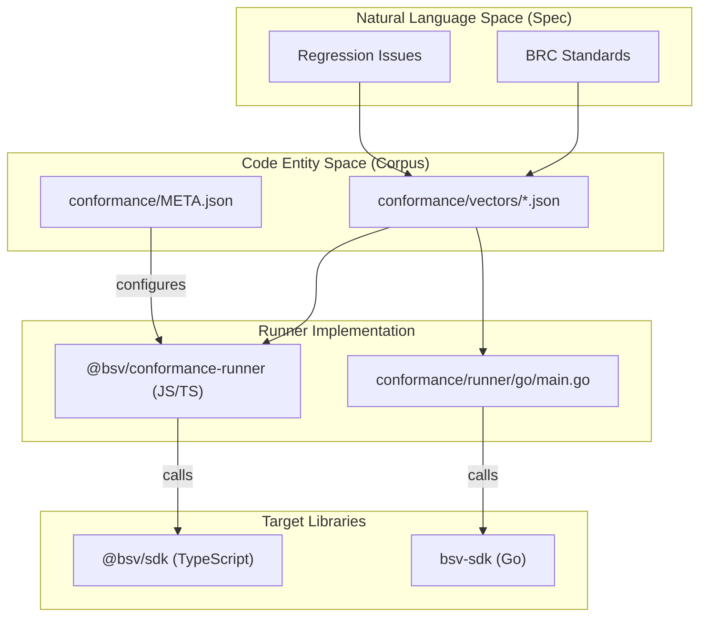
```mermaid
graph TD
    subgraph "Natural Language Space (Spec)"
        BRC["BRC Standards"]
        RE["Regression Issues"]
    end

    subgraph "Code Entity Space (Corpus)"
        JSON["conformance/vectors/*.json"]
        META["conformance/META.json"]
    end

    subgraph "Runner Implementation"
        TSRunner["@bsv/conformance-runner (JS/TS)"]
        GoRunner["conformance/runner/go/main.go"]
    end

    subgraph "Target Libraries"
        TSSDK["@bsv/sdk (TypeScript)"]
        GoSDK["bsv-sdk (Go)"]
    end

    BRC --> JSON
    RE --> JSON
    JSON --> TSRunner
    JSON --> GoRunner
    TSRunner -- "calls" --> TSSDK
    GoRunner -- "calls" --> GoSDK
    META -- "configures" --> TSRunner
```
Sources: [conformance/META.json:1-31](), [conformance/runner/src/runner.js:1-15](), [conformance/runner/package.json:1-10]()

## Corpus Coverage

The corpus is divided into domains and categories reflecting the `ts-stack` architecture [conformance/META.json:4]().

### Cryptographic Primitives (`sdk.crypto`)
These vectors cover foundational hashing and encryption algorithms used throughout the stack.

| Category | Vector File | Description |
| :--- | :--- | :--- |
| **AES** | `sdk/crypto/aes.json` | AES-GCM 128/192/256 encryption/decryption based on NIST FIPS 197 [conformance/vectors/sdk/crypto/aes.json:1-42](). |
| **SHA256** | `sdk/crypto/sha256.json` | Single and Double SHA-256 (hash256) of strings and binary data [conformance/vectors/sdk/crypto/sha256.json:1-51](). |
| **RIPEMD160** | `sdk/crypto/ripemd160.json` | RIPEMD-160 hashing for address generation [conformance/vectors/sdk/crypto/ripemd160.json:1-23](). |
| **Hash160** | `sdk/crypto/hash160.json` | SHA-256 followed by RIPEMD-160, covering P2PKH pubkey hashes [conformance/vectors/sdk/crypto/hash160.json:1-19](). |
| **ECDSA** | `sdk/crypto/ecdsa.json` | Secp256k1 signing and verification. |
| **ECIES** | `sdk/crypto/ecies.json` | Integrated Encryption Scheme for public-key encryption. |
| **HMAC** | `sdk/crypto/hmac.json` | Keyed-hash message authentication codes. |

### Keys and Signatures (`sdk.keys`)
Covers the lifecycle of cryptographic keys and hierarchical derivation.
*   **Private/Public Keys**: Validation of WIF, Hex, and DER formats.
*   **Key Derivation**: BRC-42 hierarchical derivation vectors [conformance/META.json:6]().
*   **BSM**: Bitcoin Signed Message (BRC-77) compatibility [conformance/META.json:8]().

### Transactions and Scripts (`sdk.transactions`, `sdk.scripts`)
Covers the complex logic of transaction serialization and the Bitcoin script engine.
*   **Serialization**: Transaction hex encoding and decoding.
*   **Merkle Path**: BRC-74 Merkle path validation and BUMP (Bitcoin Universal Merkle Path) formats [conformance/META.json:7]().
*   **Evaluation**: Script opcode parsing (e.g., `OP_0`, `OP_CHECKMULTISIG`) and P2PKH template generation [conformance/vectors/sdk/scripts/evaluation.json:10-64]().

## Regression Suite

The `conformance/vectors/regressions/` directory contains vectors specifically designed to prevent the reintroduction of known bugs. Each regression vector includes a `regression` metadata block referencing the original issue [conformance/vectors/regressions/beef-v2-txid-panic.json:6-11]().

### Key Regression Vectors

| Issue ID | Domain | Symptom | Fix Version |
| :--- | :--- | :--- | :--- |
| `go-sdk#306` | Transactions | Panic when calling `TxID()` on parsed BEEF_V2 data [conformance/vectors/regressions/beef-v2-txid-panic.json:7-10](). | Go v1.2.21 |
| `ts-sdk#493` | Script | `OP_LSHIFT` failed to truncate results to original byte length [conformance/vectors/regressions/script-lshift-truncation.json:7-11](). | TS v2.0.6 |
| `ts-sdk#377` | Script | Endianness swap during `OP_RSHIFT` and `OP_LSHIFT` operations [conformance/vectors/regressions/script-shift-endianness.json:7-10](). | TS v1.1.0 |
| `ts-sdk#42` | Script | `Script.fromASM()` misidentified hex strings as opcodes (e.g., '76' as `OP_DUP`) [conformance/vectors/regressions/script-fromasm-numeric-token.json:7-11](). | TS v1.0.0 |

### Regression Logic Association
This diagram maps the regression vectors to the specific code entities they protect.

**Regression Mapping**
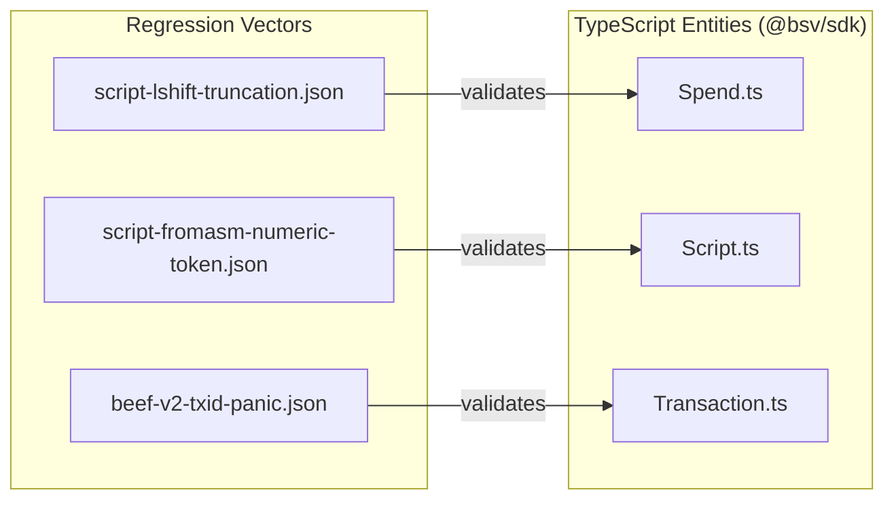
```mermaid
graph LR
    subgraph "Regression Vectors"
        R_LSHIFT["script-lshift-truncation.json"]
        R_ASM["script-fromasm-numeric-token.json"]
        R_BEEF["beef-v2-txid-panic.json"]
    end

    subgraph "TypeScript Entities (@bsv/sdk)"
        Spend["Spend.ts"]
        Script["Script.ts"]
        Transaction["Transaction.ts"]
    end

    R_LSHIFT -- "validates" --> Spend
    R_ASM -- "validates" --> Script
    R_BEEF -- "validates" --> Transaction
```
Sources: [conformance/vectors/regressions/script-lshift-truncation.json:10-11](), [conformance/vectors/regressions/script-fromasm-numeric-token.json:7-8](), [conformance/vectors/regressions/beef-v2-txid-panic.json:5-10]()

## Validation and Reporting

The `conformance/runner/src/runner.js` script is the primary tool for validating the integrity of the corpus. It performs the following tasks:
1.  **Discovery**: Recursively finds all `.json` files in the `vectors/` directory [conformance/runner/src/runner.js:54-72]().
2.  **Schema Validation**: Ensures all required fields (`id`, `input`, `expected`) are present in every vector [conformance/runner/src/runner.js:119-127]().
3.  **JUnit Generation**: Emits reports in JUnit XML format for integration with CI/CD pipelines [conformance/runner/src/runner.js:141-173]().

Usage:
```bash
# Run validation and generate report
npm run report -- --report ./conformance/reports/results.xml
```
Sources: [conformance/runner/package.json:7-10](), [conformance/runner/src/runner.js:1-15]()

---

# Page: TypeScript & Go Conformance Runners

# TypeScript & Go Conformance Runners

<details>
<summary>Relevant source files</summary>

The following files were used as context for generating this wiki page:

- [conformance/GO_PLAN.md](conformance/GO_PLAN.md)
- [conformance/runner/go/go.mod](conformance/runner/go/go.mod)
- [conformance/runner/go/go.sum](conformance/runner/go/go.sum)
- [conformance/runner/go/main.go](conformance/runner/go/main.go)
- [conformance/runner/package.json](conformance/runner/package.json)
- [conformance/runner/scripts/dashboard.mjs](conformance/runner/scripts/dashboard.mjs)
- [conformance/runner/src/runner.js](conformance/runner/src/runner.js)
- [conformance/runner/ts/jest.config.mjs](conformance/runner/ts/jest.config.mjs)
- [conformance/runner/ts/package.json](conformance/runner/ts/package.json)
- [conformance/runner/ts/runner.test.ts](conformance/runner/ts/runner.test.ts)
- [conformance/runner/ts/tsconfig.json](conformance/runner/ts/tsconfig.json)
- [conformance/vectors/sdk/crypto/ecdsa.json](conformance/vectors/sdk/crypto/ecdsa.json)
- [conformance/vectors/sdk/crypto/ecies.json](conformance/vectors/sdk/crypto/ecies.json)
- [conformance/vectors/sdk/crypto/hmac.json](conformance/vectors/sdk/crypto/hmac.json)
- [packages/helpers/ts-paymail/docs/examples/package.json](packages/helpers/ts-paymail/docs/examples/package.json)
- [pnpm-lock.yaml](pnpm-lock.yaml)
- [specs/observability/conformance-dashboard.json](specs/observability/conformance-dashboard.json)

</details>


This page documents the multi-language conformance testing infrastructure used to ensure parity between the TypeScript and Go SDK implementations. The system relies on a shared vector corpus and language-specific runners that execute these vectors against their respective SDKs.

## Overview

The conformance system consists of three main components:
1.  **Vector Corpus**: A collection of JSON files containing test vectors (inputs and expected outputs) for various cryptographic and protocol functions.
2.  **TypeScript Runner**: A Jest-based test suite that executes vectors against the `@bsv/sdk` package.
3.  **Go Runner**: A CLI application that executes vectors against the `go-sdk` package and generates standardized reports.

### Data Flow & Reporting
The runners ingest JSON vectors and produce reports in JUnit XML and JSON formats. These reports are then consumed by a dashboard script to visualize the cross-language parity status.

Title: Conformance System Data Flow
```mermaid
graph TD
  subgraph "Corpus"
    V["conformance/vectors/*.json"]
  end

  subgraph "Runners"
    TSR["TypeScript Runner (Jest)"]
    GOR["Go Runner (main.go)"]
  end

  subgraph "SDKs"
    TSSDK["@bsv/sdk"]
    GOSDK["go-sdk"]
  end

  subgraph "Outputs"
    XML["JUnit XML Reports"]
    JSN["JSON Results"]
    DSH["Grafana Dashboard"]
  end

  V --> TSR
  V --> GOR
  TSR --> TSSDK
  GOR --> GOSDK
  TSR --> XML
  GOR --> XML
  TSR --> JSN
  GOR --> JSN
  JSN --> DSH
```
Sources: [conformance/runner/src/runner.js:1-15](), [conformance/runner/ts/runner.test.ts:1-13](), [conformance/runner/go/main.go:31-61]()

---

## TypeScript Runner

The TypeScript runner is implemented as a Jest test suite located in `conformance/runner/ts`. It dynamically generates tests by crawling the vector corpus.

### Implementation Details
The runner uses `readdirSync` to recursively find all JSON files in the `conformance/vectors` directory [conformance/runner/ts/runner.test.ts:94-105](). For each file, it creates a Jest `describe` block, and for each vector within that file, it creates a `test` block [conformance/runner/ts/runner.test.ts:4-7]().

### Dispatch Pattern
The runner uses a dispatch pattern where vectors are routed to specific handler functions based on the filename or category:
*   **SHA256**: `dispatchSHA256` [conformance/runner/ts/runner.test.ts:113-125]()
*   **RIPEMD160**: `dispatchRIPEMD160` [conformance/runner/ts/runner.test.ts:127-136]()
*   **HMAC**: `dispatchHMAC` [conformance/runner/ts/runner.test.ts:155-180]()
*   **ECDSA**: `dispatchECDSA` [conformance/runner/ts/runner.test.ts:182-243]()

### Skip Logic
The runner implements specific logic to handle gaps in implementation or vectors intended for other languages:
*   **Parity Class**: If `parity_class` is set to `"intended"`, the test is skipped as it represents a documented gap rather than a bug [conformance/runner/ts/runner.test.ts:9]().
*   **Explicit Skip**: Vectors with `skip: true` are bypassed [conformance/runner/ts/runner.test.ts:10]().
*   **Unimplemented Features**: If a category or SDK function is not recognized, the test passes vacuously to avoid breaking CI on new vector additions [conformance/runner/ts/runner.test.ts:11-12]().

Sources: [conformance/runner/ts/runner.test.ts:1-243](), [conformance/runner/ts/package.json:1-16]()

---

## Go Runner

The Go runner is a standalone CLI tool located in `conformance/runner/go`. Unlike the Jest-based TS runner, it is a custom implementation designed to bridge the `ts-stack` repository with the external `go-sdk`.

### CLI Configuration
The runner supports several flags for execution:
*   `--vectors`: Path to the vector directory.
*   `--report-xml`: Path to output JUnit XML.
*   `--report-json`: Path to output JSON summary.

### Result Types
The Go runner explicitly tracks implementation status using a `Status` type:
*   `StatusPass`: Test succeeded.
*   `StatusFail`: Test failed (mismatch or error).
*   `StatusSkip`: Test was explicitly skipped.
*   `StatusNotImplemented`: The Go SDK lacks the required feature [conformance/runner/go/main.go:48-53]().

### Dispatcher Mapping
The `main.go` file contains a suite of dispatch functions that map JSON vector inputs to `go-sdk` primitives:

| Function | Go SDK Entity |
| :--- | :--- |
| `dispatchSHA256` | `primhash.Sha256`, `primhash.Sha256d` [conformance/runner/go/main.go:200-223]() |
| `dispatchRIPEMD160` | `primhash.Ripemd160` [conformance/runner/go/main.go:226-243]() |
| `dispatchHMAC` | `primhash.Sha256hmac`, `primhash.Sha512hmac` [conformance/runner/go/main.go:271-301]() |
| `dispatchAESGCM` | `primaesgcm.Encrypt`, `primaesgcm.Decrypt` [conformance/runner/go/main.go:304-350]() |
| `dispatchBSM` | `gobsm.VerifyMessage`, `gobsm.SignMessage` [conformance/runner/go/main.go:577-620]() |

Title: Go Runner Entity Mapping
```mermaid
graph LR
  subgraph "Runner Logic"
    M["main.go"]
    VF["VectorFile Struct"]
    DS["Dispatchers"]
  end

  subgraph "Go SDK Imports"
    G1["github.com/bsv-blockchain/go-sdk/primitives/hash"]
    G2["github.com/bsv-blockchain/go-sdk/compat/bsm"]
    G3["github.com/bsv-blockchain/go-sdk/transaction"]
  end

  M -- "unmarshals" --> VF
  VF -- "passed to" --> DS
  DS -- "calls" --> G1
  DS -- "calls" --> G2
  DS -- "calls" --> G3
```
Sources: [conformance/runner/go/main.go:1-620](), [conformance/runner/go/go.mod:1-16]()

---

## Reporting & Dashboard

The conformance system produces standardized outputs to allow for cross-language comparison.

### JUnit XML Schema
Both runners generate JUnit-compatible XML, allowing integration with standard CI tools like GitHub Actions. The Go runner implements this via `JUnitSuites`, `JUnitSuite`, and `JUnitCase` structs [conformance/runner/go/main.go:65-94]().

### JSON Reports
In addition to XML, the runners generate JSON summaries used for the Grafana dashboard. These summaries include:
*   `pass_rate`: Percentage of passing vectors [specs/observability/conformance-dashboard.json:117]().
*   `total`/`passed`/`failed`/`skipped`: Raw counts [specs/observability/conformance-dashboard.json:160-164]().

### Dashboard Script
The `conformance/runner/src/runner.js` script serves as a general-purpose utility for:
1.  **Validation**: Checking that vector files follow the required schema (requiring `id`, `input`, and `expected` fields) [conformance/runner/src/runner.js:80-117]().
2.  **Report Aggregation**: Combining results into the final output directory [conformance/runner/src/runner.js:29]().

Title: Dashboard Integration
```mermaid
classDiagram
  class ConformanceDashboard {
    +PassRate Go
    +PassRate TS
    +VectorCounts
  }
  class JSON_API_Datasource {
    +ts-results.json
    +go-results.json
  }
  class RunnerScript {
    +validateFile()
    +toJUnit()
  }
  
  RunnerScript ..> JSON_API_Datasource : generates
  JSON_API_Datasource ..> ConformanceDashboard : populates
```
Sources: [conformance/runner/src/runner.js:132-173](), [specs/observability/conformance-dashboard.json:1-124]()

---

## CI Integration

The runners are executed as part of the GitHub Actions CI pipeline. 
*   The TypeScript runner is triggered via `pnpm test` in the `conformance/runner/ts` directory [conformance/runner/ts/package.json:6]().
*   The Go runner is executed using `go run main.go` with appropriate flags to point at the shared `conformance/vectors` directory [conformance/runner/go/main.go:9-15]().

Failure in any conformance vector (that is not marked as `skip` or `intended` parity gap) results in a non-zero exit code, blocking the PR [conformance/runner/src/runner.js:12-15]().

Sources: [conformance/runner/package.json:7-11](), [conformance/runner/ts/package.json:5-7](), [conformance/runner/src/runner.js:179-225]()

---

# Page: API Specifications & Code Generation

# API Specifications & Code Generation

<details>
<summary>Relevant source files</summary>

The following files were used as context for generating this wiki page:

- [.github/workflows/codegen.yml](.github/workflows/codegen.yml)
- [conformance/generated/broadcast/types.rs.TODO](conformance/generated/broadcast/types.rs.TODO)
- [conformance/generated/messaging/types.rs.TODO](conformance/generated/messaging/types.rs.TODO)
- [conformance/generated/overlay/types.rs.TODO](conformance/generated/overlay/types.rs.TODO)
- [specs/EXCEPTIONS.md](specs/EXCEPTIONS.md)
- [specs/README.md](specs/README.md)
- [specs/auth/brc31-handshake.yaml](specs/auth/brc31-handshake.yaml)
- [specs/messaging/authsocket-asyncapi.yaml](specs/messaging/authsocket-asyncapi.yaml)
- [specs/messaging/message-box-http.yaml](specs/messaging/message-box-http.yaml)

</details>


This section documents the machine-readable contracts that define the service boundaries for the BSV Distributed Applications Stack. The `specs/` directory serves as the single source of truth for all Tier-1 interfaces [specs/README.md:1-5](). By using formal specifications (OpenAPI, AsyncAPI, and JSON Schema), the repository enforces cross-language consistency and enables an automated pipeline for code generation and contract testing [specs/README.md:12-18]().

## Service Boundary Specifications

The `specs/` directory contains the definitions for all critical system boundaries. These specifications move the codebase away from "read the source" documentation toward stable, explicit contracts [specs/README.md:14]().

### Core Specification Inventory

| Domain | Spec File | Format | Boundary Description |
|:-------|:----------|:-------|:---------------------|
| **Wallet** | `sdk/brc-100-wallet.json` | JSON Schema | BRC-100 wallet interface methods [specs/README.md:68](). |
| **Overlay** | `overlay/overlay-http.yaml` | OpenAPI 3.1 | Submit, lookup, discovery, and admin [specs/README.md:69](). |
| **Broadcast** | `broadcast/arc.yaml` | OpenAPI 3.1 | ARC submit, status, batch, and callback [specs/README.md:70](). |
| **Messaging** | `messaging/message-box-http.yaml` | OpenAPI 3.1 | REST endpoints for message-box-server [specs/README.md:73](). |
| **Auth** | `auth/brc31-handshake.yaml` | AsyncAPI 3.0 | BRC-31 mutual auth handshake [specs/README.md:75](). |
| **Payments** | `payments/brc121.yaml` | OpenAPI 3.1 | BRC-121 HTTP 402 payment middleware [specs/README.md:77](). |
| **Sync** | `sync/gasp-asyncapi.yaml` | AsyncAPI 3.0 | GASP cross-node sync protocol [specs/README.md:78](). |

For a full list of all 13+ specifications and the error taxonomy, see **[Service Boundary Specifications](#10.1)**.

**Sources:** [specs/README.md:21-60](), [specs/README.md:66-81](), [specs/EXCEPTIONS.md:22-30]()

---

## Automated Code Generation

The repository utilizes a GitHub Actions workflow defined in `.github/workflows/codegen.yml` to ensure that types across TypeScript, Go, and Python remain synchronized with the specifications [codegen.yml:1-5]().

### Codegen Pipeline Architecture

The pipeline follows a strict rule: **hand-rolled types for spec-defined shapes are a CI failure** [specs/README.md:7-8](). When a specification changes, the following tools are invoked:

*   **TypeScript:** `openapi-typescript` generates definition files (`.d.ts`) [codegen.yml:53-54]().
*   **Go:** `oapi-codegen` generates type structures and package-level definitions [codegen.yml:22-24]().
*   **Python:** `datamodel-code-generator` produces Pydantic v2 models [codegen.yml:82-86]().

### Code Entity Mapping

The following diagram illustrates how the natural language specifications are transformed into specific code entities within the `conformance/generated/` directory.

**Specification to Code Entity Mapping**
```mermaid
graph TD
    subgraph "Natural Language Space (Specs)"
        A["overlay-http.yaml"]
        B["arc.yaml"]
        C["message-box-http.yaml"]
    end

    subgraph "Code Entity Space (Generated)"
        TS_O["conformance/generated/overlay/types.gen.d.ts"]
        GO_O["conformance/generated/overlay/types.gen.go"]
        PY_O["conformance/generated/overlay/models.py"]

        TS_B["conformance/generated/broadcast/types.gen.d.ts"]
        GO_B["conformance/generated/broadcast/types.gen.go"]
        
        TS_M["conformance/generated/messaging/types.gen.d.ts"]
        GO_M["conformance/generated/messaging/types.gen.go"]
    end

    A -- "openapi-typescript" --> TS_O
    A -- "oapi-codegen" --> GO_O
    A -- "datamodel-codegen" --> PY_O

    B -- "openapi-typescript" --> TS_B
    B -- "oapi-codegen" --> GO_B

    C -- "openapi-typescript" --> TS_M
    C -- "oapi-codegen" --> GO_M
```
**Sources:** [codegen.yml:19-36](), [codegen.yml:50-64](), [codegen.yml:79-102](), [specs/README.md:137-142]()

---

## Contract Testing

Contract tests verify that a running implementation (regardless of the language it is written in) conforms to the published specification [specs/README.md:160-162](). These tests are written in TypeScript using Vitest and can be pointed at local or remote endpoints [specs/README.md:165-168]().

### Testing Flow

The following diagram shows the relationship between the `specs/` definitions, the generated types used in tests, and the target service implementations.

**Contract Testing Workflow**
```mermaid
graph LR
    subgraph "Spec Definition"
        S["specs/overlay/overlay-http.yaml"]
    end

    subgraph "Test Suite"
        T["specs/overlay/contract-tests/overlay.contract.test.ts"]
        G["conformance/generated/overlay/types.gen.d.ts"]
    end

    subgraph "Implementations"
        TS_S["OverlayExpress (TS)"]
        GO_S["Overlay Service (Go)"]
    end

    S -- "Generates" --> G
    G -- "Types" --> T
    T -- "HTTP POST/GET" --> TS_S
    T -- "HTTP POST/GET" --> GO_S
```

For details on running these suites and the `schemathesis` integration, see **[Automated Code Generation & Contract Tests](#10.2)**.

**Sources:** [specs/README.md:158-183](), [codegen.yml:52-54](), [specs/overlay/overlay-http.yaml:1-10]()

---

# Page: Service Boundary Specifications

# Service Boundary Specifications

<details>
<summary>Relevant source files</summary>

The following files were used as context for generating this wiki page:

- [specs/EXCEPTIONS.md](specs/EXCEPTIONS.md)
- [specs/README.md](specs/README.md)
- [specs/auth/brc31-handshake.yaml](specs/auth/brc31-handshake.yaml)
- [specs/broadcast/arc.yaml](specs/broadcast/arc.yaml)
- [specs/errors.md](specs/errors.md)
- [specs/merkle/merkle-service-http.yaml](specs/merkle/merkle-service-http.yaml)
- [specs/messaging/authsocket-asyncapi.yaml](specs/messaging/authsocket-asyncapi.yaml)
- [specs/messaging/message-box-http.yaml](specs/messaging/message-box-http.yaml)
- [specs/overlay/overlay-http.yaml](specs/overlay/overlay-http.yaml)
- [specs/payments/brc121.yaml](specs/payments/brc121.yaml)
- [specs/payments/brc29-payment-protocol.yaml](specs/payments/brc29-payment-protocol.yaml)
- [specs/sdk/brc-100-wallet.json](specs/sdk/brc-100-wallet.json)
- [specs/storage/uhrp-http.yaml](specs/storage/uhrp-http.yaml)
- [specs/sync/gasp-asyncapi.yaml](specs/sync/gasp-asyncapi.yaml)
- [specs/wallet/storage-adapter.yaml](specs/wallet/storage-adapter.yaml)

</details>


This page documents the machine-readable contracts for every Tier 1 service boundary in the BSV Distributed Applications Stack. These specifications serve as the single source of truth for the repository; all language-specific types (TypeScript, Go, Python, Rust) and client stubs are derived from these files via automated codegen pipelines [specs/README.md:1-9]().

## Overview of Specification Types

The stack utilizes three primary formats to define boundaries based on the communication pattern:

| Pattern | Specification Format | Primary Use Cases |
| :--- | :--- | :--- |
| **HTTP / REST** | OpenAPI 3.1 | Overlay Services, ARC, MessageBox, UHRP, Merkle Service |
| **WebSocket / Events** | AsyncAPI 3.0 | AuthSocket, BRC-31 Handshake, GASP Sync, BRC-29 Payments |
| **Language Interfaces** | JSON Schema (2020-12) | BRC-100 Wallet Interface |

Sources: [specs/README.md:64-81](), [specs/README.md:87-110]()

## Core Wallet & Identity Specs

### BRC-100 Wallet Interface
The `brc-100-wallet.json` schema defines the standard API surface for a BSV wallet. It uses `$defs` to specify request and response pairs for methods like `createAction`, `listActions`, and `encrypt`.

*   **Key Primitives**: Defines `TXIDHexString` (64 chars), `PubKeyHex` (66 chars), and `SatoshiValue` (max 2.1 quadrillion) [specs/sdk/brc-100-wallet.json:14-46]().
*   **Security Levels**: Implements BRC-43 security levels: `0` (Silent), `1` (App), and `2` (Counterparty) [specs/sdk/brc-100-wallet.json:117-121]().

### BRC-31 Mutual Authentication Handshake
Defined in `brc31-handshake.yaml`, this protocol establishes a shared, forward-secret session between two parties using ECDH-derived keys [specs/auth/brc31-handshake.yaml:18-20]().

**Handshake Flow Diagram**
```mermaid
sequenceDiagram
    participant C as "Client (Initiator)"
    participant S as "Server (Responder)"
    
    Note over C,S: Phase 1: Initial Exchange
    C->>S: initialRequest (x-bsv-auth-nonce, identityKey, signature)
    S->>S: Validate Client Signature
    S-->>C: initialResponse (serverNonce, yourNonce, signature)
    C->>C: Validate Server Signature
    
    Note over C,S: Phase 2: Authenticated Requests
    C->>S: general (x-bsv-auth-request-id, signature over payload)
    S-->>C: general (signature over response)
```
Sources: [specs/auth/brc31-handshake.yaml:22-78]()

## Messaging & Communication

### MessageBox & AuthSocket
The Messaging layer is split between a RESTful store-and-forward API and a real-time WebSocket layer.

*   **MessageBox HTTP**: 9 endpoints for sending and retrieving messages. All require `x-bsv-auth-*` headers [specs/messaging/message-box-http.yaml:7-13]().
*   **AuthSocket**: An AsyncAPI spec for the `AuthSocketServer`. It wraps Socket.IO events (like `joinRoom`, `sendMessage`, and `message`) inside BRC-103 `general` envelopes for end-to-end authentication [specs/messaging/authsocket-asyncapi.yaml:19-34]().

### GASP Sync Protocol
The Graph Aware Sync Protocol (`gasp-asyncapi.yaml`) facilitates cross-node UTXO synchronization. It uses a request/response pattern to walk the transaction graph, ensuring nodes only transfer missing data [specs/sync/gasp-asyncapi.yaml:11-15]().

Sources: [specs/sync/gasp-asyncapi.yaml:19-34](), [specs/messaging/authsocket-asyncapi.yaml:152-205]()

## Payment Protocols

### BRC-29 & BRC-121
These specs define how payments are negotiated and delivered between peers.

*   **BRC-29**: Defines the `PaymentMessage` containing Atomic BEEF (BRC-95) and BRC-42 key derivation parameters (`derivationPrefix` and `derivationSuffix`) [specs/payments/brc29-payment-protocol.yaml:74-79]().
*   **BRC-121 (HTTP 402)**: Monetizes HTTP resources. If a request lacks payment, the server returns `402 Payment Required` with `x-bsv-sats` and `x-bsv-server` headers [specs/payments/brc121.yaml:9-18]().

**BRC-121 Payment Flow**
```mermaid
sequenceDiagram
    participant C as "Client (402-Pay)"
    participant S as "Server (Middleware)"
    
    C->>S: GET /resource (No Headers)
    S-->>C: 402 Payment Required (x-bsv-sats, x-bsv-server)
    C->>C: Construct BRC-29 Tx (BEEF)
    C->>S: GET /resource (x-bsv-beef, x-bsv-nonce, x-bsv-time)
    S->>S: internalizeAction() + Freshness Check
    S-->>C: 200 OK (Protected Content)
```
Sources: [specs/payments/brc121.yaml:9-36]()

## Storage & Merkle Infrastructure

### Wallet Storage Adapter
Documents the HTTP boundary between `wallet-toolbox` and a remote storage provider. It maps the `StorageProvider` TypeScript interface to REST endpoints like `/actions`, `/migrate`, and `/settings` [specs/wallet/storage-adapter.yaml:12-33]().

### UHRP & Merkle Service
*   **UHRP (BRC-26)**: Content-addressed storage resolution. Resolves `uhrp://` URLs (Base58Check SHA-256 hashes) to download URLs via the `ls_uhrp` lookup service [specs/storage/uhrp-http.yaml:13-30]().
*   **Merkle Service**: A Go microservice that monitors `txids` and POSTs BUMP proofs to a `callbackUrl` upon confirmation [specs/merkle/merkle-service-http.yaml:9-12]().

## Code Entity Mapping

The following diagram bridges the high-level specifications to the specific classes and files that implement them within the `ts-stack`.

**Specification to Implementation Mapping**
```mermaid
graph TD
    subgraph "Specification Space"
        BRC100["brc-100-wallet.json"]
        BRC31["brc31-handshake.yaml"]
        BRC121["brc121.yaml"]
        STORAGE["storage-adapter.yaml"]
    end

    subgraph "Code Entity Space"
        W_INT["Wallet.interfaces.ts"]
        AUTH_MID["createAuthMiddleware"]
        PAY_MID["createPaymentMiddleware"]
        S_PROV["StorageProvider.ts"]
    end

    BRC100 -->|"defines"| W_INT
    BRC31 -->|"implemented by"| AUTH_MID
    BRC121 -->|"implemented by"| PAY_MID
    STORAGE -->|"exposes"| S_PROV

    style BRC100 stroke-dasharray: 5 5
    style BRC31 stroke-dasharray: 5 5
    style BRC121 stroke-dasharray: 5 5
    style STORAGE stroke-dasharray: 5 5
```
Sources: [specs/auth/brc31-handshake.yaml:10-15](), [specs/wallet/storage-adapter.yaml:28-32](), [specs/payments/brc121.yaml:38-40]()

## Error Taxonomy
The `errors.md` file (referenced by all OpenAPI/AsyncAPI specs) provides the canonical error taxonomy. Implementations are required to use these machine-readable codes (e.g., `ERR_AUTH_REQUIRED`) rather than ad-hoc strings to ensure cross-language consistency [specs/README.md:187-194]().

Sources: [specs/README.md:26](), [specs/messaging/message-box-http.yaml:79-83]()

---

# Page: Automated Code Generation & Contract Tests

# Automated Code Generation & Contract Tests

<details>
<summary>Relevant source files</summary>

The following files were used as context for generating this wiki page:

- [.github/workflows/codegen.yml](.github/workflows/codegen.yml)
- [conformance/generated/.gitkeep](conformance/generated/.gitkeep)
- [conformance/generated/README.md](conformance/generated/README.md)
- [conformance/generated/broadcast/types.rs.TODO](conformance/generated/broadcast/types.rs.TODO)
- [conformance/generated/messaging/types.rs.TODO](conformance/generated/messaging/types.rs.TODO)
- [conformance/generated/overlay/types.rs.TODO](conformance/generated/overlay/types.rs.TODO)
- [specs/broadcast/contract-tests/README.md](specs/broadcast/contract-tests/README.md)
- [specs/broadcast/contract-tests/schemathesis.sh](specs/broadcast/contract-tests/schemathesis.sh)
- [specs/messaging/contract-tests/README.md](specs/messaging/contract-tests/README.md)
- [specs/messaging/contract-tests/schemathesis.sh](specs/messaging/contract-tests/schemathesis.sh)
- [specs/overlay/contract-tests/README.md](specs/overlay/contract-tests/README.md)
- [specs/overlay/contract-tests/schemathesis.sh](specs/overlay/contract-tests/schemathesis.sh)
- [specs/reliability/README.md](specs/reliability/README.md)
- [specs/reliability/arc.md](specs/reliability/arc.md)
- [specs/reliability/go-sdk.md](specs/reliability/go-sdk.md)
- [specs/reliability/message-box-server.md](specs/reliability/message-box-server.md)
- [specs/reliability/overlay-express.md](specs/reliability/overlay-express.md)
- [specs/reliability/ts-sdk.md](specs/reliability/ts-sdk.md)
- [specs/reliability/wallet-toolbox.md](specs/reliability/wallet-toolbox.md)

</details>


This page documents the automated pipeline for maintaining consistency between the service boundary specifications and the multi-language implementations within the TS-Stack. The repository utilizes a central source-of-truth in the `specs/` directory to drive type generation for Go, TypeScript, and Python, while ensuring implementation compliance via property-based contract testing.

## Automated Codegen Workflow

The repository employs a GitHub Actions workflow, `codegen.yml`, which monitors changes to OpenAPI specifications and automatically regenerates type definitions across supported languages [.github/workflows/codegen.yml:1-7](). This ensures that the `conformance/generated/` directory always reflects the latest service definitions.

### Multi-Language Implementation
The workflow is divided into jobs for each target language:

| Language | Tooling | Output Format | Target Path |
| :--- | :--- | :--- | :--- |
| **Go** | `oapi-codegen` | Go Structs | `conformance/generated/**/types.gen.go` |
| **TypeScript** | `openapi-typescript` | Ambient Definitions | `conformance/generated/**/types.gen.d.ts` |
| **Python** | `datamodel-codegen` | Pydantic v2 Models | `conformance/generated/**/models.py` |
| **Rust** | `typify` (Manual) | Rust Types | `conformance/generated/**/types.rs.TODO` |

### Data Flow Diagram: Spec to Code
The following diagram illustrates how a change in a specification file propagates through the codegen pipeline to the generated outputs.

**Codegen Propagation Path**
```mermaid
graph TD
    subgraph "Source of Truth"
        SPEC_OVERLAY["specs/overlay/overlay-http.yaml"]
        SPEC_ARC["specs/broadcast/arc.yaml"]
        SPEC_MSG["specs/messaging/message-box-http.yaml"]
    end

    subgraph "GitHub Actions: codegen.yml"
        GO_JOB["generate-go-types"]
        TS_JOB["generate-ts-types"]
        PY_JOB["generate-py-types"]
    end

    subgraph "conformance/generated/"
        GO_OUT["overlay/types.gen.go"]
        TS_OUT["broadcast/types.gen.d.ts"]
        PY_OUT["messaging/models.py"]
    end

    SPEC_OVERLAY --> GO_JOB
    SPEC_ARC --> TS_JOB
    SPEC_MSG --> PY_JOB

    GO_JOB -- "oapi-codegen" --> GO_OUT
    TS_JOB -- "openapi-typescript" --> TS_OUT
    PY_JOB -- "datamodel-code-generator" --> PY_OUT
```
**Sources:** [.github/workflows/codegen.yml:10-106](), [conformance/generated/README.md:1-15]()

---

## Output Structure

Generated code is organized by domain within the `conformance/generated/` directory. This directory acts as a shared resource for conformance runners and cross-language validation [.github/workflows/codegen.yml:41]().

### Domain Mappings
The pipeline targets three primary service domains:

1.  **Overlay**: Based on `specs/overlay/overlay-http.yaml` [.github/workflows/codegen.yml:23]().
2.  **Broadcast (ARC)**: Based on `specs/broadcast/arc.yaml` [.github/workflows/codegen.yml:29]().
3.  **Messaging**: Based on `specs/messaging/message-box-http.yaml` [.github/workflows/codegen.yml:35]().

### Rust Generation
Rust support is currently handled via placeholders due to the requirement for a `Cargo` workspace context. The workflow creates `.TODO` files containing the necessary `typify` commands for manual execution within a Rust project [.github/workflows/codegen.yml:112-137]().

**Sources:** [conformance/generated/overlay/types.rs.TODO:1-4](), [conformance/generated/broadcast/types.rs.TODO:1-4](), [conformance/generated/messaging/types.rs.TODO:1-4]()

---

## Schemathesis Contract Testing

To ensure that running services (Overlay, Messaging, ARC) strictly adhere to their OpenAPI specifications, the repository includes a suite of property-based contract tests powered by **Schemathesis**.

### Testing Strategy
The contract tests perform the following actions:
*   **Spec Validation**: Reads the local `.yaml` specification file [specs/overlay/contract-tests/schemathesis.sh:7]().
*   **Property-Based Fuzzing**: Generates a wide range of valid and invalid inputs to test edge cases (`--checks all`) [specs/messaging/contract-tests/schemathesis.sh:9]().
*   **Stateful Testing**: Follows OpenAPI response links to verify state transitions across multiple requests (`--stateful=links`) [specs/broadcast/contract-tests/schemathesis.sh:10]().
*   **Reporting**: Outputs JUnit-compatible XML results for CI integration [specs/overlay/contract-tests/schemathesis.sh:11]().

### Contract Test Execution
The tests are executed via `schemathesis.sh` scripts located in the `contract-tests` subdirectory of each domain.

**System Entity Association**
```mermaid
graph LR
    subgraph "Test Runner"
        ST_EXE["schemathesis.sh"]
        ST_LIB["Schemathesis Engine"]
    end

    subgraph "Target Environment"
        BASE_URL["BASE_URL (Default: localhost:3000)"]
        SRV["Running Service (e.g., OverlayExpress)"]
    end

    subgraph "Validation Logic"
        OAPI_SPEC["OpenAPI YAML Spec"]
        CHECKS["--checks all"]
        LINKS["--stateful=links"]
    end

    ST_EXE --> ST_LIB
    ST_LIB -- "Reads" --> OAPI_SPEC
    ST_LIB -- "Probes" --> BASE_URL
    BASE_URL --> SRV
    ST_LIB -- "Applies" --> CHECKS
    ST_LIB -- "Applies" --> LINKS
    ST_LIB -- "Generates" --> RESULTS["results.xml (JUnit)"]
```

**Usage Example:**
To run contract tests against a local Messaging server:
```bash
BASE_URL=http://localhost:3001 bash specs/messaging/contract-tests/schemathesis.sh
```

**Sources:** [specs/overlay/contract-tests/README.md:1-27](), [specs/messaging/contract-tests/schemathesis.sh:1-12](), [specs/broadcast/contract-tests/schemathesis.sh:1-12]()

---

# Page: Glossary

# Glossary

<details>
<summary>Relevant source files</summary>

The following files were used as context for generating this wiki page:

- [.editorconfig](.editorconfig)
- [.gitignore](.gitignore)
- [.npmrc](.npmrc)
- [README.md](README.md)
- [conformance/runner/go/go.mod](conformance/runner/go/go.mod)
- [conformance/runner/go/go.sum](conformance/runner/go/go.sum)
- [conformance/runner/go/main.go](conformance/runner/go/main.go)
- [conformance/runner/package.json](conformance/runner/package.json)
- [conformance/runner/src/runner.js](conformance/runner/src/runner.js)
- [conformance/vectors/README.md](conformance/vectors/README.md)
- [conformance/vectors/sdk/crypto/ecdsa.json](conformance/vectors/sdk/crypto/ecdsa.json)
- [conformance/vectors/sdk/crypto/ecies.json](conformance/vectors/sdk/crypto/ecies.json)
- [conformance/vectors/sdk/crypto/hmac.json](conformance/vectors/sdk/crypto/hmac.json)
- [package.json](package.json)
- [packages/messaging/message-box-server/package.json](packages/messaging/message-box-server/package.json)
- [packages/overlays/topics/BASELINE.md](packages/overlays/topics/BASELINE.md)
- [packages/overlays/topics/src/__tests__/desktopintegrity.test.ts](packages/overlays/topics/src/__tests__/desktopintegrity.test.ts)
- [packages/overlays/topics/src/__tests__/monsterbattle.test.ts](packages/overlays/topics/src/__tests__/monsterbattle.test.ts)
- [packages/overlays/topics/src/__tests__/utility-tokens.test.ts](packages/overlays/topics/src/__tests__/utility-tokens.test.ts)
- [packages/wallet/btms/README.md](packages/wallet/btms/README.md)
- [packages/wallet/btms/index.ts](packages/wallet/btms/index.ts)
- [packages/wallet/btms/jest.config.js](packages/wallet/btms/jest.config.js)
- [packages/wallet/btms/package-lock.json](packages/wallet/btms/package-lock.json)
- [packages/wallet/btms/package.json](packages/wallet/btms/package.json)
- [packages/wallet/btms/src/BTMS.ts](packages/wallet/btms/src/BTMS.ts)
- [packages/wallet/btms/src/BTMSAdvanced.ts](packages/wallet/btms/src/BTMSAdvanced.ts)
- [specs/EXCEPTIONS.md](specs/EXCEPTIONS.md)
- [specs/README.md](specs/README.md)
- [specs/auth/brc31-handshake.yaml](specs/auth/brc31-handshake.yaml)
- [specs/messaging/authsocket-asyncapi.yaml](specs/messaging/authsocket-asyncapi.yaml)
- [specs/messaging/message-box-http.yaml](specs/messaging/message-box-http.yaml)
- [tsconfig.base.json](tsconfig.base.json)

</details>


This page provides a comprehensive glossary of domain-specific terms, Bitcoin Request for Comment (BRC) standards, and protocol acronyms used throughout the `@bsv/ts-stack`. It maps natural language concepts to their specific implementations and definitions within the codebase.

## Core Protocol Concepts

### BEEF (Bitcoin Enveloped Evidence Format)
A serialized format for Bitcoin transactions that includes all necessary Merkle paths and ancestor transactions required for autonomous verification by a recipient without querying a centralized indexer.
*   **Implementation:** `Beef` and `BeefTx` classes in the SDK.
*   **Code Pointer:** [packages/sdk/ts-sdk/src/transaction/Beef.ts]()

### BUMP (BSV Unified Merkle Path)
A standardized format for representing Merkle proofs, allowing a transaction to be proven against a block header. BUMPs are more efficient than traditional Merkle proofs and support batching.
*   **Implementation:** `MerklePath` class in the SDK.
*   **Code Pointer:** [packages/sdk/ts-sdk/src/transaction/MerklePath.ts]()

### Script Template
A high-level abstraction over Bitcoin Script that simplifies the creation and unlocking of common UTXO patterns (e.g., P2PKH, PushDrop).
*   **Implementation:** `ScriptTemplate` abstract class.
*   **Code Pointer:** [packages/sdk/ts-sdk/src/templates/ScriptTemplate.ts]()

---

## BRC Standards Mapping

The following table defines the BRC (Bitcoin Request for Comment) standards implemented across the stack.

| Standard | Name | Description | Primary Code Entity |
| :--- | :--- | :--- | :--- |
| **BRC-29** | Peer Payment Protocol | Protocol for direct peer-to-peer transaction delivery and validation. | `payment-express-middleware` |
| **BRC-31** | Mutual Auth Handshake | A WebSocket-based handshake for establishing identity between two parties. | `brc31-handshake.yaml` |
| **BRC-42** | Key Derivation | A method for deriving shared keys between two parties using ECDH. | `KeyDeriver` in SDK |
| **BRC-100** | Wallet Interface | The standard API surface for BSV wallets. | `WalletClient` interface |
| **BRC-103** | AuthSocket | Authenticated WebSocket protocol for secure event exchange. | `AuthSocketServer` |
| **BRC-121** | HTTP 402 Payments | Middleware for handling "Payment Required" responses and tx-based access. | `402-pay` package |

**Sources:** [specs/README.md:66-81](), [README.md:82-84]()

---

## Overlay & Storage Terms

### GASP (Graph-based Asynchronous Sync Protocol)
A protocol used by Overlay Services to synchronize transaction graphs between nodes, ensuring that all participants in a specific topic have a consistent view of the data.
*   **Implementation:** `OverlayGASPStorage`, `OverlayGASPRemote`.
*   **Spec:** [specs/sync/gasp-asyncapi.yaml]()

### Topic Manager (TM)
A component responsible for validating incoming transactions for a specific overlay topic. It determines if a transaction "belongs" to the topic and satisfies its business logic.
*   **Implementation:** `TopicManager` interface.
*   **Code Pointer:** [packages/overlays/overlay-services/src/TopicManager.ts]()

### Lookup Service (LS)
A query engine that provides an interface to retrieve data from an overlay's indexed storage.
*   **Implementation:** `LookupService` interface.
*   **Code Pointer:** [packages/overlays/overlay-services/src/LookupService.ts]()

### UHRP (Universal Hash Resolution Protocol)
A content-addressable storage protocol used for locating and retrieving data based on its hash rather than its location.
*   **Implementation:** `uhrp-storage-server`, `tm_uhrp`.
*   **Sources:** [packages/overlays/topics/BASELINE.md:44-44](), [README.md:57-57]()

---

## System Architecture Diagrams

### From Concept to Code: SDK & Wallet
The following diagram bridges natural language concepts (like "Transaction" or "Key") to the specific classes and interfaces in the `@bsv/sdk` and `@bsv/wallet-toolbox`.

```mermaid
graph TD
    subgraph "Natural Language Space"
        A["Private Key"]
        B["Public Key"]
        C["Transaction"]
        D["Merkle Proof"]
        E["Wallet API"]
    end

    subgraph "Code Entity Space"
        A --- A1["PrivateKey (sdk/src/primitives)"]
        B --- B1["PublicKey (sdk/src/primitives)"]
        C --- C1["Transaction (sdk/src/transaction)"]
        D --- D1["MerklePath (sdk/src/transaction)"]
        E --- E1["WalletClient (sdk/src/wallet)"]
        
        E1 --- F1["WalletSigner (wallet-toolbox)"]
        E1 --- F2["WalletStorageManager (wallet-toolbox)"]
    end
```
**Sources:** [README.md:29-35](), [specs/README.md:68-68]()

### From Concept to Code: Overlays & Messaging
This diagram associates overlay and messaging concepts with their respective service implementations and specifications.

```mermaid
graph LR
    subgraph "Natural Language Space"
        G["Sync Protocol"]
        H["Data Topic"]
        I["Secure Socket"]
        J["Message Store"]
    end

    subgraph "Code Entity Space"
        G --- G1["GASP (gasp-asyncapi.yaml)"]
        H --- H1["TopicManager (overlay-services)"]
        I --- I1["AuthSocket (authsocket-client)"]
        J --- J1["MessageBoxClient (message-box-client)"]
        
        H1 --- K1["tm_kvstore (overlay-topics)"]
        H1 --- K2["tm_identity (overlay-topics)"]
    end
```
**Sources:** [packages/overlays/topics/BASELINE.md:27-47](), [specs/README.md:73-78]()

---

## Domain Glossary Table

| Term | Domain | Definition |
| :--- | :--- | :--- |
| **BTMS** | Wallet | Basic Token Management System. Handles UTXO-based tokens using PushDrop scripts. [packages/wallet/btms/src/BTMS.ts]() |
| **Chaintracks** | Network | A service for tracking blockchain headers and verifying Merkle proofs against the longest chain. [packages/network/chaintracks-server]() |
| **WAB** | Wallet | Wallet Authentication Backend. Manages user sessions, MFA, and identity linking. [packages/wallet/wab]() |
| **PushDrop** | SDK | A script template pattern used to "push" data into a locking script and "drop" it during unlocking. |
| **AuthSocket** | Messaging | A WebSocket implementation using BRC-103 for mutual authentication. [packages/messaging/authsocket]() |
| **Teranode Listener** | Network | A P2P listener that subscribes to Teranode topics (blocks, subtrees) over a private DHT. [packages/network/ts-p2p]() |

**Sources:** [README.md:39-47](), [specs/README.md:74-74]()