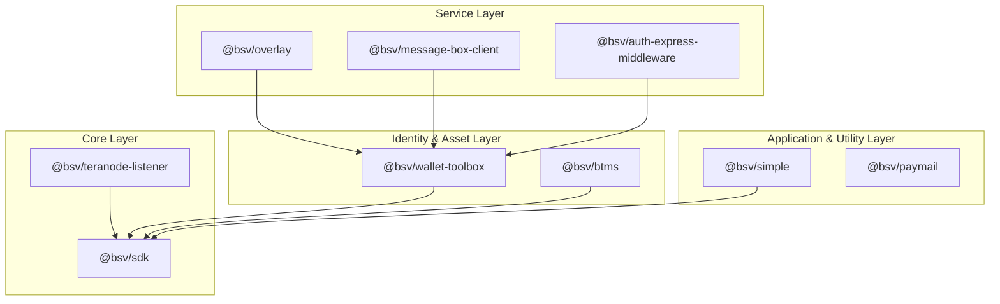

# Page: Overview

# Overview

<details>
<summary>Relevant source files</summary>

The following files were used as context for generating this wiki page:

- [.github/CODEOWNERS](.github/CODEOWNERS)
- [.gitignore](.gitignore)
- [README.md](README.md)
- [RELIABILITY.md](RELIABILITY.md)
- [package.json](package.json)
- [pnpm-workspace.yaml](pnpm-workspace.yaml)
- [tsconfig.base.json](tsconfig.base.json)

</details>


The `@bsv/ts-stack` is a comprehensive TypeScript monorepo containing the production-grade software stack for the BSV blockchain. It spans the entire lifecycle of blockchain interaction, from low-level cryptographic primitives and transaction construction to high-level wallet services, overlay networks, and authenticated messaging protocols [README.md:1-4]().

The repository is organized into seven functional domains, comprising over 40 packages [README.md:7-20](). It utilizes a strictly enforced inward dependency flow to ensure architectural stability and modularity.

### Domain Architecture

The stack is structured hierarchically. Packages in higher-level domains depend on lower-level domains, with the Core SDK serving as the foundational layer for the entire ecosystem.

| Domain | Purpose | Key Packages |
|--------|---------|--------------|
| **SDK** | Foundational primitives, transactions, and scripts. | `@bsv/sdk`, `@bsv/templates` |
| **Network** | Blockchain synchronization and P2P networking. | `@bsv/teranode-listener`, `@bsv/chaintracks-server` |
| **Wallet** | Identity, key management, and token logic. | `@bsv/wallet-toolbox`, `@bsv/btms`, `@bsv/wab-server` |
| **Overlays** | Specialized data indexing and lookup services. | `@bsv/overlay`, `@bsv/gasp`, `@bsv/overlay-topics` |
| **Messaging** | Store-and-forward and real-time communication. | `@bsv/message-box-client`, `@bsv/authsocket` |
| **Middleware** | Express.js integrations for auth and payments. | `@bsv/auth-express-middleware`, `@bsv/402-pay` |
| **Helpers** | High-level application APIs and utilities. | `@bsv/simple`, `@bsv/paymail` |

**Sources:** [README.md:7-94](), [README.md:152-162]()

### Dependency Hierarchy

The following diagram illustrates the "Code Entity Space" mapping of packages to their architectural layers and the directional flow of dependencies.

**System Dependency Flow**

**Sources:** [README.md:154-162]()

### Criticality Tiers & Reliability

The monorepo classifies packages into **Criticality Tiers** to prioritize engineering investment and reliability guarantees [RELIABILITY.md:14-16]().

*   **Tier 0 (Core Protocol):** Failure breaks the entire stack. Example: `@bsv/sdk` [RELIABILITY.md:20]().
*   **Tier 1 (Critical Services):** Failure breaks multiple consumers. Examples: `@bsv/wallet-toolbox`, `@bsv/overlay-services` [RELIABILITY.md:21]().
*   **Tier 2 (Important):** Failure degrades a single domain. Example: `@bsv/message-box-server` [RELIABILITY.md:22]().

Each package tracks its state via **Reliability Levels (RL)**, ranging from RL0 (Untested) to RL5 (Hardened) [RELIABILITY.md:5-12]().

### Monorepo Management

The stack uses `pnpm` workspaces to manage cross-package dependencies and shared configuration [pnpm-workspace.yaml:1-7]().

*   **Build System:** Uses a shared `tsconfig.base.json` for consistent compilation across ESM and CJS targets [tsconfig.base.json:1-21]().
*   **Version Alignment:** Custom scripts `sync-versions.mjs` and `check-versions.mjs` ensure that internal dependencies remain synchronized across the 40+ packages [package.json:10-11]().
*   **Conformance:** A cross-language conformance suite (TypeScript and Go) validates the SDK against a shared vector corpus [package.json:12]().

For details on the workspace layout and dependency flow, see [Repository Structure & Monorepo Setup](#1.1).

### CI/CD and Release Pipeline

The repository implements a robust CI/CD pipeline via GitHub Actions:
1.  **Continuous Integration:** Validates every PR with build, lint, and test jobs across the entire workspace [package.json:6-8]().
2.  **Conformance Testing:** Runs the `@bsv/sdk` against cryptographic and transaction vectors [package.json:12]().
3.  **Automated Releases:** Publishes packages to npm using OIDC-based authentication triggered by git tags.

For details on the automation workflows, see [CI/CD, Release & Versioning](#1.2).

### Code-to-Domain Mapping

This diagram bridges the natural language domains to specific entry-point packages and directories within the codebase.

**Domain to Code Entity Mapping**
```mermaid
graph LR
  subgraph "Domain: SDK"
    SDK_DIR["packages/sdk/ts-sdk"]
    TEMPLATES_DIR["packages/sdk/ts-templates"]
  end

  subgraph "Domain: Wallet"
    WT_DIR["packages/wallet/wallet-toolbox"]
    WAB_DIR["packages/wallet/wab"]
  end

  subgraph "Domain: Overlays"
    OV_DIR["packages/overlays/overlay-services"]
    TOPICS_DIR["packages/overlays/topics"]
  end

  subgraph "Domain: Messaging"
    MB_DIR["packages/messaging/message-box-client"]
    AS_DIR["packages/messaging/authsocket"]
  end

  SDK_DIR --- "@bsv/sdk"
  WT_DIR --- "@bsv/wallet-toolbox"
  OV_DIR --- "@bsv/overlay"
  MB_DIR --- "@bsv/message-box-client"
```
**Sources:** [README.md:26-78]()

---