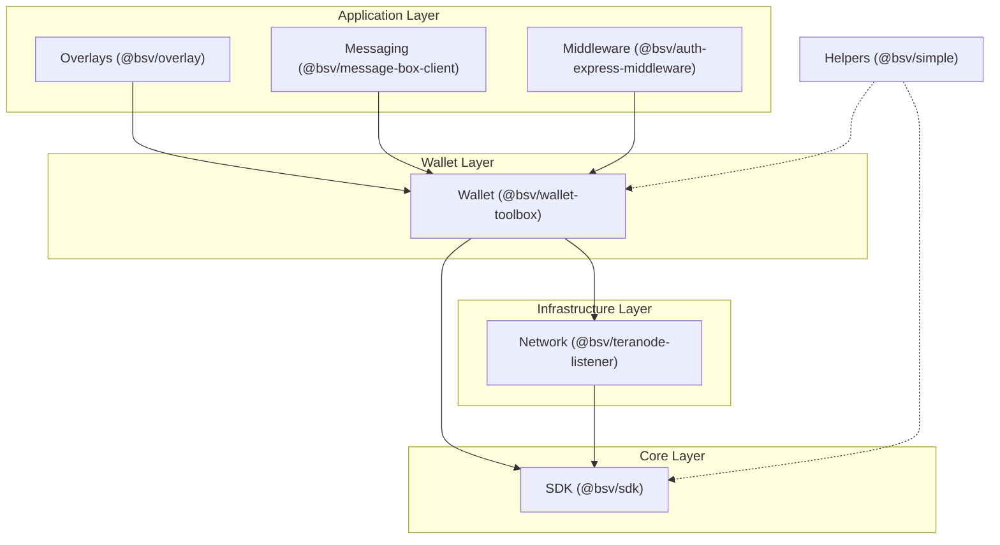
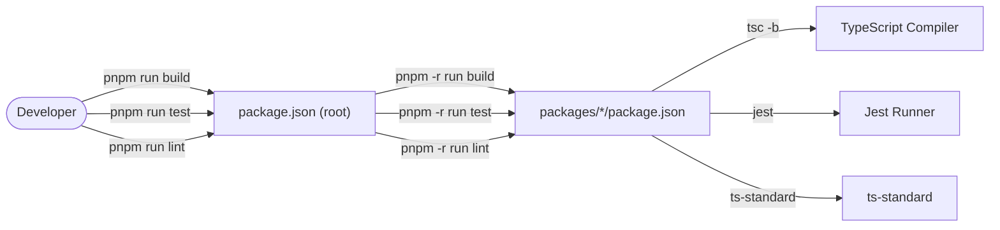

# Page: Repository Structure & Monorepo Setup

# Repository Structure & Monorepo Setup

Relevant source files

The following files were used as context for generating this wiki page:

- [.editorconfig](https://github.com/bsv-blockchain/ts-stack/blob/main/.editorconfig)
- [.gitignore](https://github.com/bsv-blockchain/ts-stack/blob/main/.gitignore)
- [.npmrc](https://github.com/bsv-blockchain/ts-stack/blob/main/.npmrc)
- [README.md](https://github.com/bsv-blockchain/ts-stack/blob/main/README.md)
- [conformance/vectors/README.md](https://github.com/bsv-blockchain/ts-stack/blob/main/conformance/vectors/README.md)
- [package.json](https://github.com/bsv-blockchain/ts-stack/blob/main/package.json)
- [packages/messaging/message-box-server/package.json](https://github.com/bsv-blockchain/ts-stack/blob/main/packages/messaging/message-box-server/package.json)
- [packages/wallet/btms/package.json](https://github.com/bsv-blockchain/ts-stack/blob/main/packages/wallet/btms/package.json)
- [pnpm-workspace.yaml](https://github.com/bsv-blockchain/ts-stack/blob/main/pnpm-workspace.yaml)
- [scripts/check-versions.mjs](https://github.com/bsv-blockchain/ts-stack/blob/main/scripts/check-versions.mjs)
- [scripts/sync-versions.mjs](https://github.com/bsv-blockchain/ts-stack/blob/main/scripts/sync-versions.mjs)
- [tsconfig.base.json](https://github.com/bsv-blockchain/ts-stack/blob/main/tsconfig.base.json)

The `ts-stack` repository is a unified monorepo containing all production TypeScript packages for the BSV blockchain stack. It is organized into seven functional domains, utilizing `pnpm` workspaces to manage a dependency graph that flows inward toward the core SDK.

### Monorepo Layout & Workspaces

The repository uses a `pnpm` workspace configuration to manage 41 packages plus a conformance runner. The workspace boundaries are defined in `pnpm-workspace.yaml`, which includes all subdirectories under `packages/` while excluding build artifacts like `dist` or `out` [pnpm-workspace.yaml:1-7](https://github.com/bsv-blockchain/ts-stack/blob/main/pnpm-workspace.yaml#L1-L7).

#### Workspace Configuration
- **Package Manager**: `pnpm` version 9.0.0 is required, enforced via `package.json` [package.json:16-18](https://github.com/bsv-blockchain/ts-stack/blob/main/package.json#L16-L18).
- **Node Version**: Minimum requirement of Node.js 20 [package.json:15](https://github.com/bsv-blockchain/ts-stack/blob/main/package.json#L15).
- **Dependency Overrides**: The root `package.json` forces specific versions of `jest-environment-node` and `jest-mock` to ensure testing consistency across all packages [package.json:19-24](https://github.com/bsv-blockchain/ts-stack/blob/main/package.json#L19-L24).

### Functional Domains

The codebase is partitioned into seven domains, each residing in its own subdirectory under `packages/`.

| Domain | Path | Description |
|--------|------|-------------|
| **SDK** | `packages/sdk/` | Foundational primitives and transaction logic. |
| **Wallet** | `packages/wallet/` | Wallet logic, storage, and authentication backends. |
| **Network** | `packages/network/` | Blockchain header tracking and P2P networking. |
| **Overlays** | `packages/overlays/` | Overlay service engines and canonical topic implementations. |
| **Messaging** | `packages/messaging/` | Peer-to-peer messaging and authenticated sockets. |
| **Middleware** | `packages/middleware/` | Express.js middleware for auth and payments. |
| **Helpers** | `packages/helpers/` | High-level APIs and utility packages. |

**Sources:** [README.md:7-18](https://github.com/bsv-blockchain/ts-stack/blob/main/README.md#L7-L18), [README.md:26-94](https://github.com/bsv-blockchain/ts-stack/blob/main/README.md#L26-L94)

### Dependency Hierarchy

The architecture enforces a strict inward dependency flow. Higher-level services (Overlays, Messaging, Middleware) depend on the Wallet layer, which depends on the Network and SDK layers.

#### Inward Flow Diagram
This diagram illustrates the directional flow of dependencies across the monorepo domains.

**Sources:** [README.md:150-162](https://github.com/bsv-blockchain/ts-stack/blob/main/README.md#L150-L162)

### Shared Configuration & Tooling

The monorepo maintains consistency through shared configuration files and centralized scripts.

#### TypeScript Configuration
A root `tsconfig.base.json` provides the foundation for all package-specific TypeScript configurations. It defines:
- **Module System**: `NodeNext` for modern ESM support [tsconfig.base.json:4-6](https://github.com/bsv-blockchain/ts-stack/blob/main/tsconfig.base.json#L4-L6).
- **Target**: `esnext` for modern JavaScript features [tsconfig.base.json:5](https://github.com/bsv-blockchain/ts-stack/blob/main/tsconfig.base.json#L5).
- **Strictness**: `strict` is set to `false` at the base level, though individual packages may override this [tsconfig.base.json:8](https://github.com/bsv-blockchain/ts-stack/blob/main/tsconfig.base.json#L8).
- **Features**: Enables `sourceMap`, `experimentalDecorators`, and `emitDecoratorMetadata` for advanced SDK and Wallet features [tsconfig.base.json:15-17](https://github.com/bsv-blockchain/ts-stack/blob/main/tsconfig.base.json#L15-L17).

#### Version Management
Because packages are often released together, maintaining version alignment is critical. Two scripts manage this:
- **`check-versions.mjs`**: Iterates through all packages and identifies cross-package dependencies that do not match the current workspace versions [scripts/check-versions.mjs:42-53](https://github.com/bsv-blockchain/ts-stack/blob/main/scripts/check-versions.mjs#L42-L53).
- **`sync-versions.mjs`**: Automatically updates `package.json` files to align cross-references to the latest versions found in the workspace [scripts/sync-versions.mjs:54-67](https://github.com/bsv-blockchain/ts-stack/blob/main/scripts/sync-versions.mjs#L54-L67).

**Sources:** [tsconfig.base.json:1-21](https://github.com/bsv-blockchain/ts-stack/blob/main/tsconfig.base.json#L1-L21), [package.json:10-11](https://github.com/bsv-blockchain/ts-stack/blob/main/package.json#L10-L11), [scripts/check-versions.mjs:1-62](https://github.com/bsv-blockchain/ts-stack/blob/main/scripts/check-versions.mjs#L1-L62), [scripts/sync-versions.mjs:1-75](https://github.com/bsv-blockchain/ts-stack/blob/main/scripts/sync-versions.mjs#L1-L75)

### Development Lifecycle

The monorepo provides a unified interface for standard development tasks from the root directory.

#### Common Commands
| Task | Command | Implementation |
|------|---------|----------------|
| **Install** | `pnpm install` | Installs all workspace dependencies [README.md:107-108](https://github.com/bsv-blockchain/ts-stack/blob/main/README.md#L107-L108). |
| **Build** | `pnpm run build` | Runs `pnpm -r run build` across all packages [package.json:6](https://github.com/bsv-blockchain/ts-stack/blob/main/package.json#L6). |
| **Test** | `pnpm run test` | Executes tests in all packages using Jest [package.json:7](https://github.com/bsv-blockchain/ts-stack/blob/main/package.json#L7). |
| **Lint** | `pnpm run lint` | Runs `ts-standard` across the repo [package.json:8](https://github.com/bsv-blockchain/ts-stack/blob/main/package.json#L8). |
| **Conformance** | `pnpm conformance` | Runs the cross-language conformance runner [package.json:12](https://github.com/bsv-blockchain/ts-stack/blob/main/package.json#L12). |

#### Building and Testing Entity Space
This diagram maps high-level developer actions to the specific scripts and tools utilized in the monorepo.

**Sources:** [package.json:5-13](https://github.com/bsv-blockchain/ts-stack/blob/main/package.json#L5-L13), [packages/wallet/btms/package.json:20-25](https://github.com/bsv-blockchain/ts-stack/blob/main/packages/wallet/btms/package.json#L20-L25), [packages/messaging/message-box-server/package.json:7-18](https://github.com/bsv-blockchain/ts-stack/blob/main/packages/messaging/message-box-server/package.json#L7-L18)

### Package Metadata & Exports
Each package within the monorepo typically follows a standard structure for exports and builds, favoring ESM. For example, `@bsv/btms` defines its entry point in `dist/esm/src/index.js` and provides types in `dist/types/src/index.d.ts` [packages/wallet/btms/package.json:6-7](https://github.com/bsv-blockchain/ts-stack/blob/main/packages/wallet/btms/package.json#L6-L7).

**Sources:** [packages/wallet/btms/package.json:1-55](https://github.com/bsv-blockchain/ts-stack/blob/main/packages/wallet/btms/package.json#L1-L55)

---