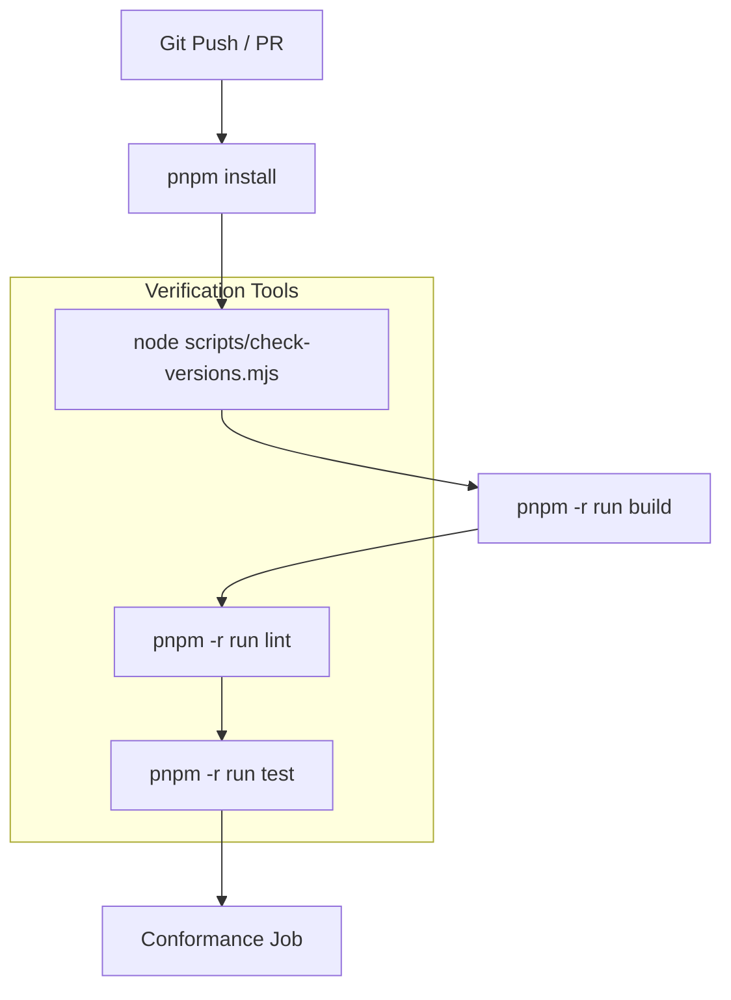
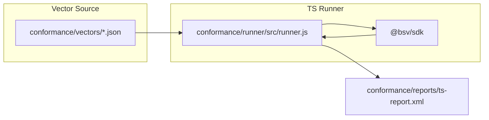
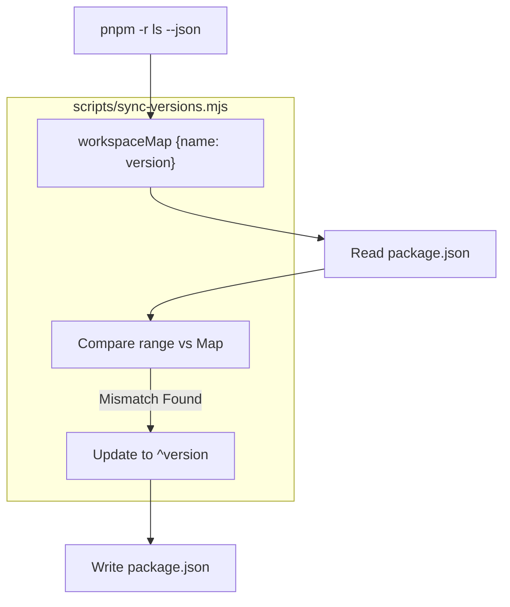

# Page: CI/CD, Release & Versioning

# CI/CD, Release & Versioning

Relevant source files

The following files were used as context for generating this wiki page:

- [.github/dependabot.yml](.github/dependabot.yml)
- [.github/workflows/ci.yml](.github/workflows/ci.yml)
- [.github/workflows/conformance.yml](.github/workflows/conformance.yml)
- [.github/workflows/release.yml](.github/workflows/release.yml)
- [scripts/check-versions.mjs](scripts/check-versions.mjs)
- [scripts/sync-versions.mjs](scripts/sync-versions.mjs)

This page documents the automation pipelines, version management strategies, and release procedures for the `@bsv/ts-stack` monorepo. The repository utilizes GitHub Actions for continuous integration, a custom conformance testing suite to ensure cross-language parity, and OIDC-based npm publishing for secure releases.

## Continuous Integration (CI)

The CI pipeline is triggered on every push to `main` and on all pull requests targeting `main` [ .github/workflows/ci.yml:3-7 ](). It ensures code quality through a sequence of validation, building, and testing across the entire workspace.

### Build and Test Workflow
The `build-and-test` job executes on `ubuntu-latest` using Node.js 20.x [ .github/workflows/ci.yml:10-15 ]().

1.  **Dependency Installation**: Uses `pnpm install --frozen-lockfile` to ensure reproducible builds [ .github/workflows/ci.yml:29 ]().
2.  **Version Consistency**: Runs `node scripts/check-versions.mjs` to verify that internal workspace dependencies are correctly synchronized [ .github/workflows/ci.yml:32 ]().
3.  **Monorepo Build**: Builds all packages in the workspace, specifically excluding non-production or specialized deployment packages like `@bsv/messagebox-services` and `example-paymail` [ .github/workflows/ci.yml:37 ]().
4.  **Linting**: Executes `pnpm -r run lint` across all packages [ .github/workflows/ci.yml:41 ]().
5.  **Unit Testing**: Runs `pnpm -r run test` to execute Jest/Vitest suites in every package [ .github/workflows/ci.yml:44 ]().

### CI Process Flow

The following diagram illustrates the data flow and execution order of the CI pipeline.

**CI Pipeline Execution Flow**

Sources: [ .github/workflows/ci.yml:1-45 ](), [ scripts/check-versions.mjs:1-10 ]()

## Conformance Testing

The conformance suite ensures that the TypeScript implementation of cryptographic and transaction primitives remains compatible with other SDK implementations (e.g., Go).

### Conformance Job Structure
The conformance job runs after `build-and-test` completes [ .github/workflows/ci.yml:46-49 ](). It uses a specialized runner located in `conformance/runner` [ .github/workflows/ci.yml:62 ]().

*   **Validation**: Validates the JSON structure of the conformance vectors [ .github/workflows/ci.yml:62 ]().
*   **Execution**: Runs the vectors against the TS SDK and generates a JUnit-style XML report (`ts-report.xml`) [ .github/workflows/ci.yml:65 ]().
*   **Artifacts**: Publishes the `conformance-vectors` to GitHub Artifacts for 90 days, allowing downstream SDKs to fetch the latest vectors for their own CI [ .github/workflows/ci.yml:77-83 ]().

**Conformance System Architecture**

Sources: [ .github/workflows/ci.yml:46-84 ](), [ .github/workflows/conformance.yml:24-30 ]()

## Release Pipeline

Releases are triggered by Git tags following the pattern `*/v*` (for specific package releases) or `v*` (for monorepo-wide releases) [ .github/workflows/release.yml:4-7 ]().

### OIDC-Based Publishing
The release workflow uses GitHub's OpenID Connect (OIDC) to authenticate with npm, eliminating the need for long-lived `NPM_TOKEN` secrets [ .github/workflows/release.yml:34-36 ]().

1.  **Permissions**: The job requires `id-token: write` to generate the OIDC token and `contents: read` to access the source [ .github/workflows/release.yml:12-14 ]().
2.  **Filtering**: It uses `pnpm -r --filter='...[origin/main]' publish` to identify and publish only the packages that have changed relative to the `main` branch [ .github/workflows/release.yml:41 ]().
3.  **Provenance**: The `--provenance` flag is used during publishing to provide a verifiable link between the npm package and the GitHub Actions run that created it [ .github/workflows/release.yml:41 ]().

Sources: [ .github/workflows/release.yml:1-42 ]()

## Versioning & Dependency Management

The monorepo maintains internal consistency through a set of scripts that manage cross-package version references.

### Version Synchronization Scripts
Because Dependabot is configured to ignore `@bsv/*` workspace packages to avoid noise [ .github/dependabot.yml:12-13, 21-39 ](), version synchronization is handled manually or via CI checks.

| Script | File Path | Purpose |
| :--- | :--- | :--- |
| `check-versions` | `scripts/check-versions.mjs` | Scans all `package.json` files and exits with code 1 if an internal dependency range (e.g., `^1.0.0`) does not match the actual version of the package in the workspace [ scripts/check-versions.mjs:32-61 ](). |
| `sync-versions` | `scripts/sync-versions.mjs` | Automatically updates all internal `dependencies`, `devDependencies`, and `peerDependencies` to match the current workspace versions [ scripts/sync-versions.mjs:54-72 ](). |

### Version Management Logic
The `sync-versions.mjs` script performs the following operations:
1.  Executes `pnpm -r ls --json` to build a map of package names to their current versions [ scripts/sync-versions.mjs:26-35 ]().
2.  Iterates through every `package.json` in the workspace [ scripts/sync-versions.mjs:42-51 ]().
3.  Updates version ranges to `^${currentVersion}` unless the range is explicitly set to `workspace:*` [ scripts/sync-versions.mjs:59-67 ]().

**Versioning Utility Flow**

Sources: [ scripts/check-versions.mjs:1-62 ](), [ scripts/sync-versions.mjs:1-75 ](), [ .github/dependabot.yml:1-44 ]()

---