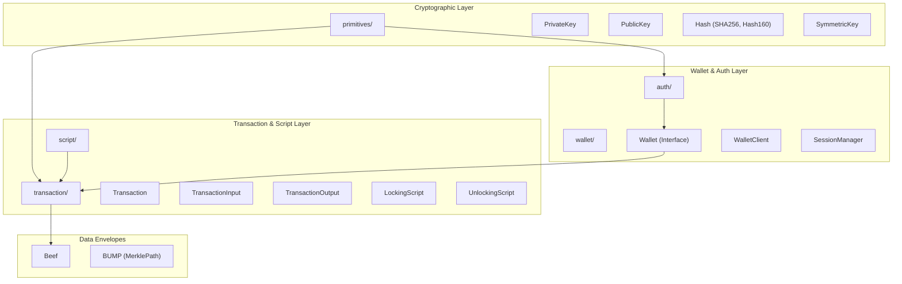

# Page: Core SDK (@bsv/sdk)

# Core SDK (@bsv/sdk)

Relevant source files

The following files were used as context for generating this wiki page:

- [packages/middleware/auth-express-middleware/BASELINE.md](https://github.com/bsv-blockchain/ts-stack/blob/main/packages/middleware/auth-express-middleware/BASELINE.md)
- [packages/overlays/overlay-services/BASELINE.md](https://github.com/bsv-blockchain/ts-stack/blob/main/packages/overlays/overlay-services/BASELINE.md)
- [packages/sdk/ts-sdk/BASELINE.md](https://github.com/bsv-blockchain/ts-stack/blob/main/packages/sdk/ts-sdk/BASELINE.md)
- [packages/sdk/ts-sdk/BENCHMARK.md](https://github.com/bsv-blockchain/ts-stack/blob/main/packages/sdk/ts-sdk/BENCHMARK.md)
- [packages/sdk/ts-templates/package.json](https://github.com/bsv-blockchain/ts-stack/blob/main/packages/sdk/ts-templates/package.json)
- [packages/wallet/wallet-toolbox/BASELINE.md](https://github.com/bsv-blockchain/ts-stack/blob/main/packages/wallet/wallet-toolbox/BASELINE.md)

The `@bsv/sdk` package is the **Tier-0** foundational library for the entire TS-Stack. It provides the core protocol implementation, cryptographic primitives, and transaction handling logic that all other packages depend on. It is designed with zero production dependencies to ensure maximum portability and security.

[packages/sdk/ts-sdk/BASELINE.md:13-13](https://github.com/bsv-blockchain/ts-stack/blob/main/packages/sdk/ts-sdk/BASELINE.md#L13-L13)
[packages/sdk/ts-sdk/BASELINE.md:52-52](https://github.com/bsv-blockchain/ts-stack/blob/main/packages/sdk/ts-sdk/BASELINE.md#L52-L52)

### System Architecture Overview

The SDK is organized into several specialized subsystems that handle different layers of the Bitcoin SV protocol. The following diagram illustrates how these subsystems relate to one another and their primary code entities.

**SDK Subsystem Mapping**

Sources: [packages/sdk/ts-sdk/BENCHMARK.md:12-29](https://github.com/bsv-blockchain/ts-stack/blob/main/packages/sdk/ts-sdk/BENCHMARK.md#L12-L29), [packages/sdk/ts-sdk/BASELINE.md:9-13](https://github.com/bsv-blockchain/ts-stack/blob/main/packages/sdk/ts-sdk/BASELINE.md#L9-L13)

---

## Cryptographic Primitives
The `src/primitives` directory contains the low-level building blocks for all Bitcoin operations. This includes elliptic curve cryptography (ECDSA and Schnorr), hashing algorithms, and key management.

*   **Key Management**: Classes for `PrivateKey` and `PublicKey` management, including BRC-42 child key derivation.
*   **Hashing**: Optimized implementations of `SHA256`, `RIPEMD160`, and `Hash160`.
*   **Signatures**: `ECDSA` for standard transactions and `Schnorr` for authentication protocols.

For details, see [Cryptographic Primitives](05-Cryptographic-Primitives.md).

Sources: [packages/sdk/ts-sdk/BENCHMARK.md:12-17](https://github.com/bsv-blockchain/ts-stack/blob/main/packages/sdk/ts-sdk/BENCHMARK.md#L12-L17), [packages/sdk/ts-sdk/BENCHMARK.md:27-29](https://github.com/bsv-blockchain/ts-stack/blob/main/packages/sdk/ts-sdk/BENCHMARK.md#L27-L29)

---

## Transactions, Scripts & BEEF
This subsystem handles the construction, serialization, and validation of Bitcoin transactions. It introduces the `Beef` (Bitcoin Envelope Entity Format) for simplified SPV proof propagation.

*   **Transaction Engine**: The `Transaction` class handles serialization (`toBinary`, `toHex`) and ID computation.
*   **Scripting**: Support for `LockingScript` and `UnlockingScript` assembly and evaluation via the `Spend` class.
*   **SPV Proofs**: `MerklePath` and `BUMP` formats for verifying transaction inclusion without a full node.

For details, see [Transactions, Scripts & BEEF](06-Transactions--Scripts---BEEF.md).

Sources: [packages/sdk/ts-sdk/BENCHMARK.md:18-21](https://github.com/bsv-blockchain/ts-stack/blob/main/packages/sdk/ts-sdk/BENCHMARK.md#L18-L21), [packages/sdk/ts-sdk/BENCHMARK.md:24-26](https://github.com/bsv-blockchain/ts-stack/blob/main/packages/sdk/ts-sdk/BENCHMARK.md#L24-L26)

---

## Wallet Interface & Auth Layer
The SDK defines the standard interface for wallets (BRC-100) and the mutual authentication protocols (BRC-103) used by the stack.

*   **Wallet Interfaces**: Defines the `Wallet` and `WalletClient` interfaces that higher-level packages like `@bsv/wallet-toolbox` implement.
*   **Authentication**: The `SessionManager` and `Peer` classes in `src/auth` handle the BRC-103 handshake for secure service communication.

For details, see [Wallet Interface & Auth Layer (BRC-100 / BRC-103)](07-Wallet-Interface---Auth-Layer--BRC-100---BRC-103.md).

Sources: [packages/wallet/wallet-toolbox/BASELINE.md:50-50](https://github.com/bsv-blockchain/ts-stack/blob/main/packages/wallet/wallet-toolbox/BASELINE.md#L50-L50), [packages/middleware/auth-express-middleware/BASELINE.md:11-13](https://github.com/bsv-blockchain/ts-stack/blob/main/packages/middleware/auth-express-middleware/BASELINE.md#L11-L13)

---

## Script Templates & Compat Layer
While the core SDK provides raw script capabilities, complex templates and legacy compatibility are handled through specialized modules and the `@bsv/templates` package.

*   **Standard Templates**: P2PKH, PushDrop, and other common script patterns.
*   **Compatibility**: Support for Bitcoin Signed Messages (BSM) and ECIES encryption via the compat layer.
*   **Overlay Tools**: Utilities for integrating scripts with overlay services and KV stores.

For details, see [Script Templates & Compat Layer](08-Script-Templates---Compat-Layer.md).

Sources: [packages/sdk/ts-templates/package.json:2-5](https://github.com/bsv-blockchain/ts-stack/blob/main/packages/sdk/ts-templates/package.json#L2-L5), [packages/sdk/ts-sdk/BENCHMARK.md:22-23](https://github.com/bsv-blockchain/ts-stack/blob/main/packages/sdk/ts-sdk/BENCHMARK.md#L22-L23)

---

## Performance Baselines
As a Tier-0 package, performance is critical. The SDK monitors "Hot Paths" to prevent regressions in core operations.

| Operation | Code Entity | Path |
| :--- | :--- | :--- |
| **Signing** | `ECDSA.sign` | [src/primitives/ECDSA.ts](https://github.com/bsv-blockchain/ts-stack/blob/main/src/primitives/ECDSA.ts) |
| **Key Derivation** | `PrivateKey.deriveChild` | [src/primitives/PrivateKey.ts](https://github.com/bsv-blockchain/ts-stack/blob/main/src/primitives/PrivateKey.ts) |
| **Serialization** | `Transaction.toBinary` | [src/transaction/Transaction.ts](https://github.com/bsv-blockchain/ts-stack/blob/main/src/transaction/Transaction.ts) |
| **Validation** | `Spend.validate` | [src/script/Spend.ts](https://github.com/bsv-blockchain/ts-stack/blob/main/src/script/Spend.ts) |
| **Hashing** | `sha256` | [src/primitives/Hash.ts](https://github.com/bsv-blockchain/ts-stack/blob/main/src/primitives/Hash.ts) |

Sources: [packages/sdk/ts-sdk/BENCHMARK.md:10-29](https://github.com/bsv-blockchain/ts-stack/blob/main/packages/sdk/ts-sdk/BENCHMARK.md#L10-L29)

---