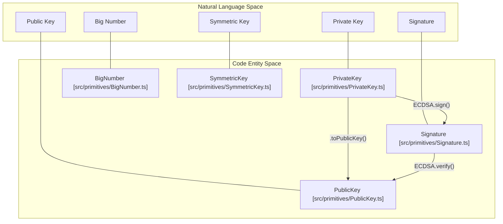
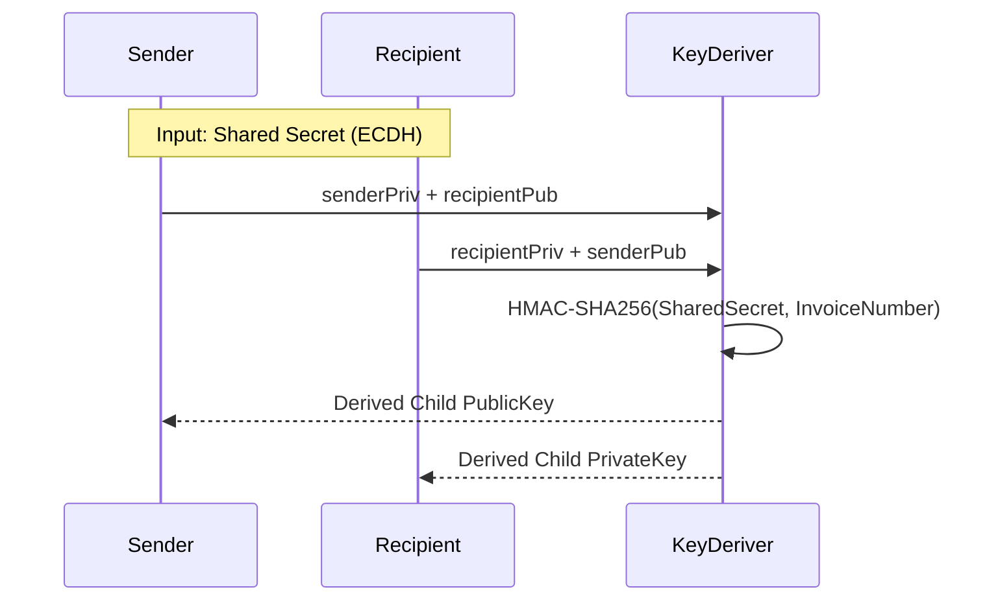

# Page: Cryptographic Primitives

# Cryptographic Primitives

Relevant source files

The following files were used as context for generating this wiki page:

- [conformance/runner/go/.gitignore](https://github.com/bsv-blockchain/ts-stack/blob/main/conformance/runner/go/.gitignore)
- [conformance/runner/go/README.md](https://github.com/bsv-blockchain/ts-stack/blob/main/conformance/runner/go/README.md)
- [conformance/runner/package.json](https://github.com/bsv-blockchain/ts-stack/blob/main/conformance/runner/package.json)
- [conformance/runner/src/runner.js](https://github.com/bsv-blockchain/ts-stack/blob/main/conformance/runner/src/runner.js)
- [conformance/vectors/sdk/compat/bsm.json](https://github.com/bsv-blockchain/ts-stack/blob/main/conformance/vectors/sdk/compat/bsm.json)
- [conformance/vectors/sdk/crypto/aes.json](https://github.com/bsv-blockchain/ts-stack/blob/main/conformance/vectors/sdk/crypto/aes.json)
- [conformance/vectors/sdk/crypto/ecdsa.json](https://github.com/bsv-blockchain/ts-stack/blob/main/conformance/vectors/sdk/crypto/ecdsa.json)
- [conformance/vectors/sdk/crypto/ecies.json](https://github.com/bsv-blockchain/ts-stack/blob/main/conformance/vectors/sdk/crypto/ecies.json)
- [conformance/vectors/sdk/crypto/hash160.json](https://github.com/bsv-blockchain/ts-stack/blob/main/conformance/vectors/sdk/crypto/hash160.json)
- [conformance/vectors/sdk/crypto/hmac.json](https://github.com/bsv-blockchain/ts-stack/blob/main/conformance/vectors/sdk/crypto/hmac.json)
- [conformance/vectors/sdk/crypto/ripemd160.json](https://github.com/bsv-blockchain/ts-stack/blob/main/conformance/vectors/sdk/crypto/ripemd160.json)
- [conformance/vectors/sdk/crypto/sha256.json](https://github.com/bsv-blockchain/ts-stack/blob/main/conformance/vectors/sdk/crypto/sha256.json)
- [conformance/vectors/sdk/crypto/signature.json](https://github.com/bsv-blockchain/ts-stack/blob/main/conformance/vectors/sdk/crypto/signature.json)
- [conformance/vectors/sdk/keys/key-derivation.json](https://github.com/bsv-blockchain/ts-stack/blob/main/conformance/vectors/sdk/keys/key-derivation.json)
- [conformance/vectors/sdk/keys/private-key.json](https://github.com/bsv-blockchain/ts-stack/blob/main/conformance/vectors/sdk/keys/private-key.json)
- [conformance/vectors/sdk/keys/public-key.json](https://github.com/bsv-blockchain/ts-stack/blob/main/conformance/vectors/sdk/keys/public-key.json)

The cryptographic primitives in the `@bsv/sdk` provide the foundational building blocks for Bitcoin SV operations, including elliptic curve cryptography (ECDSA and Schnorr), hashing, symmetric encryption, and secure key derivation. These primitives are implemented in `packages/sdk/ts-sdk/src/primitives` and are designed to be constant-time where applicable, conforming to strict security standards.

## Core Entities and Data Flow

The cryptographic system bridges mathematical concepts (scalars, points) with Bitcoin-specific encodings (WIF, DER, Compact Signatures).

### Entity Mapping
The following diagram maps natural language cryptographic concepts to the specific TypeScript classes and files within the SDK.

**Diagram: Cryptographic Entity Mapping**

**Sources:** [conformance/vectors/sdk/keys/private-key.json:7-7](https://github.com/bsv-blockchain/ts-stack/blob/main/conformance/vectors/sdk/keys/private-key.json#L7-L7), [conformance/vectors/sdk/keys/public-key.json:7-7](https://github.com/bsv-blockchain/ts-stack/blob/main/conformance/vectors/sdk/keys/public-key.json#L7-L7), [conformance/vectors/sdk/crypto/ecdsa.json:7-7](https://github.com/bsv-blockchain/ts-stack/blob/main/conformance/vectors/sdk/crypto/ecdsa.json#L7-L7)

---

## BigNumber and Arithmetic
The `BigNumber` class provides arbitrary-precision integer arithmetic required for elliptic curve operations. It handles modular reduction and scalar operations essential for `secp256k1`.

*   **Implementation:** Used extensively in `ECDSA` and `Schnorr` for scalar multiplication and signature generation.
*   **Boundary Cases:** Includes support for zero and values up to the curve order $n$.

**Sources:** [conformance/vectors/sdk/crypto/ecdsa.json:115-140](https://github.com/bsv-blockchain/ts-stack/blob/main/conformance/vectors/sdk/crypto/ecdsa.json#L115-L140)

---

## Hashing Primitives
The SDK provides several hashing algorithms commonly used in the Bitcoin protocol.

| Algorithm | Description | Common Usage |
| :--- | :--- | :--- |
| `SHA256` | Single SHA-256 hash. | Transaction hashing, Merkle trees. |
| `Hash256` | Double SHA-256 (`SHA256(SHA256(m))`). | TxID calculation, Block headers. |
| `RIPEMD160` | 160-bit hash. | Address generation. |
| `Hash160` | `RIPEMD160(SHA256(m))`. | P2PKH locking scripts. |
| `HMAC` | Hash-based Message Authentication Code. | Key derivation (BIP-32), BRC-42. |

**Sources:** [conformance/vectors/sdk/crypto/sha256.json:3-8](https://github.com/bsv-blockchain/ts-stack/blob/main/conformance/vectors/sdk/crypto/sha256.json#L3-L8), [conformance/vectors/sdk/crypto/ripemd160.json:3-8](https://github.com/bsv-blockchain/ts-stack/blob/main/conformance/vectors/sdk/crypto/ripemd160.json#L3-L8), [conformance/vectors/sdk/crypto/hash160.json:3-8](https://github.com/bsv-blockchain/ts-stack/blob/main/conformance/vectors/sdk/crypto/hash160.json#L3-L8), [conformance/vectors/sdk/crypto/hmac.json:3-8](https://github.com/bsv-blockchain/ts-stack/blob/main/conformance/vectors/sdk/crypto/hmac.json#L3-L8)

---

## Elliptic Curve Cryptography (secp256k1)

### ECDSA (Elliptic Curve Digital Signature Algorithm)
The `ECDSA` implementation supports signing and verification with the following features:
*   **Deterministic DRBG:** Uses RFC 6979 for deterministic $k$ generation to prevent nonce reuse [conformance/vectors/sdk/crypto/ecdsa.json:12-24](https://github.com/bsv-blockchain/ts-stack/blob/main/conformance/vectors/sdk/crypto/ecdsa.json#L12-L24).
*   **Low-S Normalization:** Ensures signatures use the lower $s$ value to prevent malleability [conformance/vectors/sdk/crypto/ecdsa.json:71-84](https://github.com/bsv-blockchain/ts-stack/blob/main/conformance/vectors/sdk/crypto/ecdsa.json#L71-L84).
*   **Point at Infinity Protection:** Explicitly rejects the point at infinity as a valid public key [conformance/vectors/sdk/crypto/ecdsa.json:185-197](https://github.com/bsv-blockchain/ts-stack/blob/main/conformance/vectors/sdk/crypto/ecdsa.json#L185-L197).

### Schnorr Signatures
Implemented for use in modern BSV smart contracts and BRC-standardized authentication.

### Key Management
*   **PrivateKey:** Supports WIF (Wallet Import Format) decoding and encoding [conformance/vectors/sdk/keys/private-key.json:59-69](https://github.com/bsv-blockchain/ts-stack/blob/main/conformance/vectors/sdk/keys/private-key.json#L59-L69).
*   **PublicKey:** Supports both compressed (33 bytes) and uncompressed (65 bytes) formats [conformance/vectors/sdk/keys/public-key.json:10-40](https://github.com/bsv-blockchain/ts-stack/blob/main/conformance/vectors/sdk/keys/public-key.json#L10-L40).

**Sources:** [conformance/vectors/sdk/crypto/ecdsa.json:1-10](https://github.com/bsv-blockchain/ts-stack/blob/main/conformance/vectors/sdk/crypto/ecdsa.json#L1-L10), [conformance/vectors/sdk/keys/private-key.json:1-9](https://github.com/bsv-blockchain/ts-stack/blob/main/conformance/vectors/sdk/keys/private-key.json#L1-L9)

---

## Symmetric Encryption (AES-GCM)
The `AESGCM` and `SymmetricKey` classes provide authenticated encryption.
*   **Algorithm:** AES-GCM (Galois/Counter Mode).
*   **Key Sizes:** Supports 128-bit, 192-bit, and 256-bit keys [conformance/vectors/sdk/crypto/aes.json:11-42](https://github.com/bsv-blockchain/ts-stack/blob/main/conformance/vectors/sdk/crypto/aes.json#L11-L42).
*   **Authentication:** Produces a 16-byte authentication tag to ensure data integrity [conformance/vectors/sdk/crypto/aes.json:52-55](https://github.com/bsv-blockchain/ts-stack/blob/main/conformance/vectors/sdk/crypto/aes.json#L52-L55).

**Sources:** [conformance/vectors/sdk/crypto/aes.json:1-9](https://github.com/bsv-blockchain/ts-stack/blob/main/conformance/vectors/sdk/crypto/aes.json#L1-L9)

---

## Key Derivation (BRC-42)
BRC-42 defines a method for deriving child keys for specific invoices or payments without exposing the master private key.

**Data Flow: BRC-42 Child Key Derivation**

The derivation uses the recipient's private key, the sender's public key, and an `invoiceNumber` (string or buffer) to produce a unique child key [conformance/vectors/sdk/keys/private-key.json:83-146](https://github.com/bsv-blockchain/ts-stack/blob/main/conformance/vectors/sdk/keys/private-key.json#L83-L146).

**Sources:** [conformance/vectors/sdk/keys/private-key.json:83-89](https://github.com/bsv-blockchain/ts-stack/blob/main/conformance/vectors/sdk/keys/private-key.json#L83-L89), [conformance/vectors/sdk/keys/key-derivation.json:1-10](https://github.com/bsv-blockchain/ts-stack/blob/main/conformance/vectors/sdk/keys/key-derivation.json#L1-L10)

---

## Conformance and Verification
All cryptographic primitives are validated against a cross-language conformance suite. This ensures that the TypeScript implementation matches the behavior of reference implementations (e.g., NIST vectors, RFC vectors).

*   **Vector Runner:** The `conformance-runner` executes tests against JSON-defined vectors [conformance/runner/src/runner.js:1-15](https://github.com/bsv-blockchain/ts-stack/blob/main/conformance/runner/src/runner.js#L1-L15).
*   **Parity Classes:** Tests are categorized as `required`, `crypto`, or `best-effort` to ensure core functionality is never compromised [conformance/vectors/sdk/crypto/ecdsa.json:8-8](https://github.com/bsv-blockchain/ts-stack/blob/main/conformance/vectors/sdk/crypto/ecdsa.json#L8-L8).

**Sources:** [conformance/runner/package.json:1-10](https://github.com/bsv-blockchain/ts-stack/blob/main/conformance/runner/package.json#L1-L10), [conformance/runner/src/runner.js:78-81](https://github.com/bsv-blockchain/ts-stack/blob/main/conformance/runner/src/runner.js#L78-L81)

---