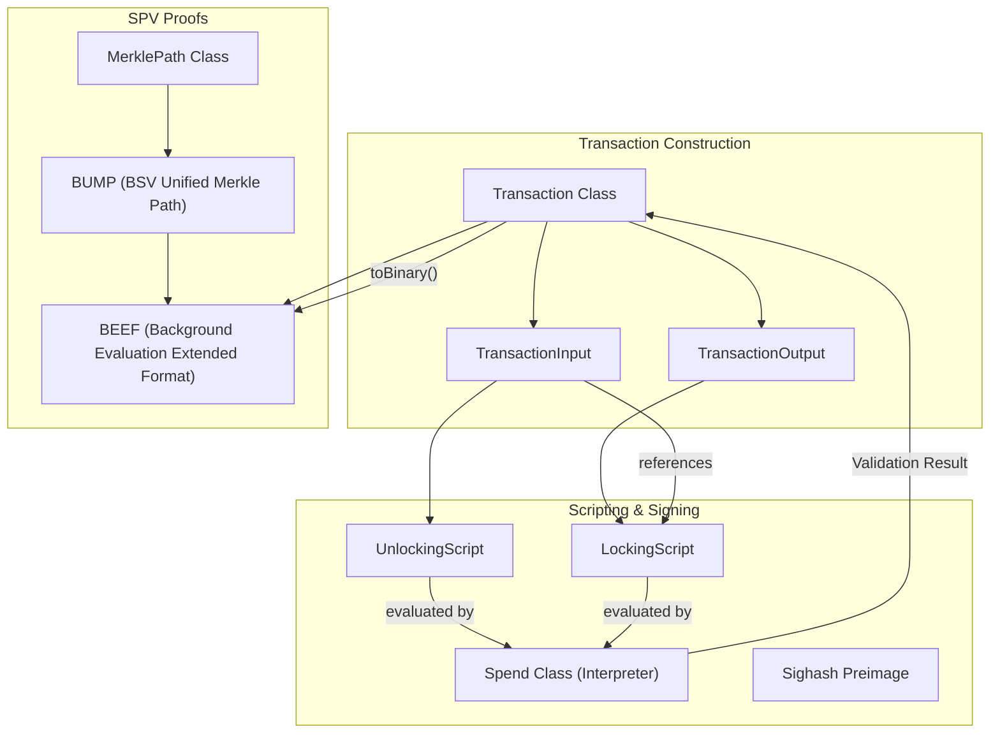

# Page: Transactions, Scripts & BEEF

# Transactions, Scripts & BEEF

Relevant source files

The following files were used as context for generating this wiki page:

- [conformance/REGRESSION_QUEUE.md](https://github.com/bsv-blockchain/ts-stack/blob/main/conformance/REGRESSION_QUEUE.md)
- [conformance/vectors/regressions/beef-isvalid-hydration.json](https://github.com/bsv-blockchain/ts-stack/blob/main/conformance/vectors/regressions/beef-isvalid-hydration.json)
- [conformance/vectors/regressions/beef-v2-txid-panic.json](https://github.com/bsv-blockchain/ts-stack/blob/main/conformance/vectors/regressions/beef-v2-txid-panic.json)
- [conformance/vectors/regressions/bip276-hex-decode.json](https://github.com/bsv-blockchain/ts-stack/blob/main/conformance/vectors/regressions/bip276-hex-decode.json)
- [conformance/vectors/regressions/fee-model-mismatch.json](https://github.com/bsv-blockchain/ts-stack/blob/main/conformance/vectors/regressions/fee-model-mismatch.json)
- [conformance/vectors/regressions/merkle-path-odd-node.json](https://github.com/bsv-blockchain/ts-stack/blob/main/conformance/vectors/regressions/merkle-path-odd-node.json)
- [conformance/vectors/regressions/privatekey-modular-reduction.json](https://github.com/bsv-blockchain/ts-stack/blob/main/conformance/vectors/regressions/privatekey-modular-reduction.json)
- [conformance/vectors/regressions/script-fromasm-numeric-token.json](https://github.com/bsv-blockchain/ts-stack/blob/main/conformance/vectors/regressions/script-fromasm-numeric-token.json)
- [conformance/vectors/regressions/script-lshift-truncation.json](https://github.com/bsv-blockchain/ts-stack/blob/main/conformance/vectors/regressions/script-lshift-truncation.json)
- [conformance/vectors/regressions/script-shift-endianness.json](https://github.com/bsv-blockchain/ts-stack/blob/main/conformance/vectors/regressions/script-shift-endianness.json)
- [conformance/vectors/regressions/script-writebin-empty.json](https://github.com/bsv-blockchain/ts-stack/blob/main/conformance/vectors/regressions/script-writebin-empty.json)
- [conformance/vectors/regressions/tx-sequence-zero-sighash.json](https://github.com/bsv-blockchain/ts-stack/blob/main/conformance/vectors/regressions/tx-sequence-zero-sighash.json)
- [conformance/vectors/regressions/uhrp-url-parity.json](https://github.com/bsv-blockchain/ts-stack/blob/main/conformance/vectors/regressions/uhrp-url-parity.json)
- [conformance/vectors/sdk/scripts/evaluation.json](https://github.com/bsv-blockchain/ts-stack/blob/main/conformance/vectors/sdk/scripts/evaluation.json)
- [conformance/vectors/sdk/transactions/merkle-path.json](https://github.com/bsv-blockchain/ts-stack/blob/main/conformance/vectors/sdk/transactions/merkle-path.json)
- [conformance/vectors/sdk/transactions/serialization.json](https://github.com/bsv-blockchain/ts-stack/blob/main/conformance/vectors/sdk/transactions/serialization.json)

This page documents the core transaction and script primitives within the `@bsv/sdk`. It covers the lifecycle of a Bitcoin transaction from construction and script evaluation to advanced SPV (Simplified Payment Verification) formats like BEEF and BUMP.

## Transaction Architecture

The SDK represents Bitcoin transactions through a hierarchy of classes that manage serialization, hashing, and validation. A `Transaction` is composed of `TransactionInput` and `TransactionOutput` objects.

### Core Classes

| Class | Responsibility | Key Methods |
| :--- | :--- | :--- |
| `Transaction` | Top-level container for version, inputs, outputs, and locktime. | `toBinary()`, `hash()`, `id()`, `fee()`, `verify()` |
| `TransactionInput` | References a UTXO and contains the unlocking script. | `toBinary()`, `setUnlockingScript()` |
| `TransactionOutput` | Defines the value (satoshis) and the locking script. | `toBinary()`, `setLockingScript()` |

### Data Flow: Transaction Construction to Broadcast

The following diagram illustrates how a transaction is built, signed, and validated before being converted into a BEEF (Background Evaluation Extended Format) structure for efficient propagation.

**Transaction & BEEF Data Flow**

Sources: `conformance/vectors/sdk/transactions/serialization.json:1-10`(), `conformance/vectors/sdk/transactions/merkle-path.json:1-10`()

## Script Engine

The SDK includes a comprehensive Bitcoin Script implementation, featuring a parser, encoder, and an off-chain execution interpreter (`Spend`).

### Script Components
*   **LockingScript / UnlockingScript**: Specialized subclasses of `Script` that handle the logic for securing and redeeming satoshis.
*   **ScriptTemplate**: An abstraction (e.g., P2PKH) used to generate standard scripts and estimate their sizes for fee calculation.
*   **Spend**: The off-chain interpreter used to verify that an `UnlockingScript` satisfies a `LockingScript`.

### Script Evaluation & Regression Fixes
The interpreter ensures parity with BSV node behavior, including specific handling for edge cases identified through regression testing:
*   **Shift Operations**: `OP_LSHIFT` and `OP_RSHIFT` must truncate results to the original byte length and preserve input endianness [conformance/vectors/regressions/script-lshift-truncation.json:5-11](https://github.com/bsv-blockchain/ts-stack/blob/main/conformance/vectors/regressions/script-lshift-truncation.json#L5-L11), [conformance/vectors/regressions/script-shift-endianness.json:5-11](https://github.com/bsv-blockchain/ts-stack/blob/main/conformance/vectors/regressions/script-shift-endianness.json#L5-L11).
*   **ASM Parsing**: `Script.fromASM()` treats bare hex strings (like '76') as data pushes rather than opcodes when they appear in a data context [conformance/vectors/regressions/script-fromasm-numeric-token.json:5-11](https://github.com/bsv-blockchain/ts-stack/blob/main/conformance/vectors/regressions/script-fromasm-numeric-token.json#L5-L11).
*   **Empty Pushes**: `writeBin([])` correctly produces an `OP_0` (0x00) rather than an empty string [conformance/vectors/regressions/script-writebin-empty.json:5-11](https://github.com/bsv-blockchain/ts-stack/blob/main/conformance/vectors/regressions/script-writebin-empty.json#L5-L11).

Sources: `conformance/vectors/sdk/scripts/evaluation.json:7-19`(), `conformance/vectors/regressions/script-lshift-truncation.json:12-27`(), `conformance/vectors/regressions/script-fromasm-numeric-token.json:12-25`()

## BEEF & BUMP Formats

BEEF (Background Evaluation Extended Format) is the standard for passing transactions along with their full provenance and SPV proofs.

### BUMP (BSV Unified Merkle Path)
BUMP provides a compact way to represent Merkle paths. The `MerklePath` class handles the computation of missing hashes, especially in trees with an odd number of nodes where duplication logic is critical [conformance/vectors/regressions/merkle-path-odd-node.json:5-11](https://github.com/bsv-blockchain/ts-stack/blob/main/conformance/vectors/regressions/merkle-path-odd-node.json#L5-L11).

### BEEF Structure
A BEEF payload typically contains:
1.  **Version/Magic Number**: Identifies the BEEF version (e.g., `BEEF_V1`, `BEEF_V2`).
2.  **BUMPs**: A list of Merkle proofs for transactions in the graph.
3.  **Transactions**: The actual transaction data.

**BEEF Class Logic**
The `Beef` class manages the hydration of source transactions. When `Beef.IsValid(true)` is called, it must back-link `input.SourceTransaction` pointers from its internal transactions map to ensure the full graph can be validated [conformance/vectors/regressions/beef-isvalid-hydration.json:5-11](https://github.com/bsv-blockchain/ts-stack/blob/main/conformance/vectors/regressions/beef-isvalid-hydration.json#L5-L11).

| Feature | BEEF V1 | BEEF V2 |
| :--- | :--- | :--- |
| Magic Number | `0x0100beef` | `0x0200beef` |
| Primary Use | Standard SPV propagation | Advanced transaction graphs |
| Implementation | `Beef.ts` | `Beef.ts` |

Sources: `conformance/vectors/regressions/beef-v2-txid-panic.json:17-26`(), `conformance/vectors/regressions/beef-isvalid-hydration.json:12-26`(), `conformance/vectors/regressions/merkle-path-odd-node.json:12-25`()

## Fees, Broadcasters & Trackers

### Fee Models
The SDK implements the standard BSV node fee formula:
`fee = floor(size_bytes * satoshis_per_kb / 1000)`
A minimum of 1 satoshi is applied for any non-zero transaction size when the rate is positive [conformance/vectors/regressions/fee-model-mismatch.json:5-11](https://github.com/bsv-blockchain/ts-stack/blob/main/conformance/vectors/regressions/fee-model-mismatch.json#L5-L11).

### Broadcasters & Chain Trackers
*   **Broadcasters**: Interfaces (like ARC) used to submit transactions to the network.
*   **Chain Trackers**: Components (like `Chaintracks`) that monitor the blockchain for header updates and transaction inclusions to maintain the validity of SPV proofs.

### Sequence Numbers & Sighash
A critical fix in the SDK ensures that if an input is constructed with `sequence = 0`, the `Sighash` preimage correctly uses `0x00000000` rather than defaulting to `0xFFFFFFFF`, which would invalidate the signature [conformance/vectors/regressions/tx-sequence-zero-sighash.json:5-11](https://github.com/bsv-blockchain/ts-stack/blob/main/conformance/vectors/regressions/tx-sequence-zero-sighash.json#L5-L11).

Sources: `conformance/vectors/regressions/fee-model-mismatch.json:13-27`(), `conformance/vectors/regressions/tx-sequence-zero-sighash.json:12-28`()

---