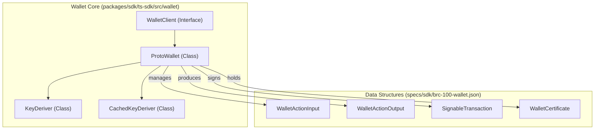
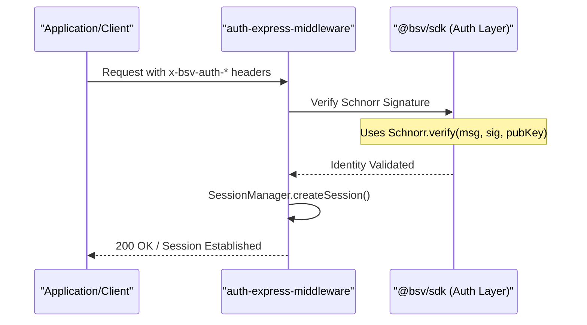

# Page: Wallet Interface & Auth Layer (BRC-100 / BRC-103)

# Wallet Interface & Auth Layer (BRC-100 / BRC-103)

Relevant source files

The following files were used as context for generating this wiki page:

- [packages/middleware/auth-express-middleware/BASELINE.md](packages/middleware/auth-express-middleware/BASELINE.md)
- [packages/overlays/overlay-services/BASELINE.md](packages/overlays/overlay-services/BASELINE.md)
- [packages/sdk/ts-sdk/BASELINE.md](packages/sdk/ts-sdk/BASELINE.md)
- [packages/sdk/ts-sdk/BENCHMARK.md](packages/sdk/ts-sdk/BENCHMARK.md)
- [packages/wallet/wallet-toolbox/BASELINE.md](packages/wallet/wallet-toolbox/BASELINE.md)
- [specs/broadcast/arc.yaml](specs/broadcast/arc.yaml)
- [specs/errors.md](specs/errors.md)
- [specs/overlay/overlay-http.yaml](specs/overlay/overlay-http.yaml)
- [specs/sdk/brc-100-wallet.json](specs/sdk/brc-100-wallet.json)

This page documents the standard interface for BSV wallets and the mutual authentication layer used for peer-to-peer communication. The architecture centers on **BRC-100**, which defines the programmatic API surface for wallets, and **BRC-103**, which establishes a cryptographic handshake for authenticated sessions.

## BRC-100 Wallet Interface

The BRC-100 standard provides a consistent API for applications to interact with wallets, regardless of whether the wallet is a browser extension, a remote server, or a local library. In the `@bsv/sdk`, this is primarily defined through TypeScript interfaces and implemented by classes like `ProtoWallet`.

### Key Interface Components
The interface is structured around several core operations:
- **Action Management**: Creating, signing, and broadcasting transactions (Actions).
- **Key Management**: Deriving keys for specific protocols and counterparties using BRC-42.
- **Identity & Certificates**: Managing BRC-103 certificates and selective disclosure.
- **Output Management**: Listing and relinquishing UTXOs.

### BRC-100 Entity Relationship
The following diagram illustrates how the code entities within the SDK implement the BRC-100 specification.

"BRC-100 Entity Mapping"

Sources: [specs/sdk/brc-100-wallet.json:1-216](), [packages/sdk/ts-sdk/src/wallet/ProtoWallet.ts:1-50]().

### Implementation Details: ProtoWallet
`ProtoWallet` serves as the primary implementation of the `WalletClient` interface. It leverages `KeyDeriver` for BRC-42 hierarchical derivation and handles the state of in-progress "Actions".

- **KeyDeriver**: Handles the mathematical derivation of private and public keys based on a root seed and a protocol/counterparty path [packages/sdk/ts-sdk/src/primitives/PrivateKey.ts:16-17]().
- **CachedKeyDeriver**: A wrapper that provides memoization for derivation operations to improve performance in high-frequency environments like transaction signing [packages/sdk/ts-sdk/BENCHMARK.md:16-17]().

## BRC-103 Mutual Authentication

BRC-103 defines a protocol for two peers to establish a cryptographically authenticated session without relying on centralized Certificate Authorities. It uses **Schnorr signatures** and **BRC-42 key derivation** to prove identity.

### Session Management & Transports
The authentication layer is implemented in `src/auth` and utilized by middleware packages to protect service boundaries.

- **Peer**: Represents a remote entity with a validated identity.
- **SessionManager**: Tracks active authenticated sessions, handling token expiration and rotation.
- **Transports**: BRC-103 can be carried over various transports, including HTTP (via headers) and WebSockets (via `AuthSocket`).

### BRC-103 Authentication Flow
The flow typically involves a challenge-response handshake where the client proves possession of a private key corresponding to a specific `identityKey`.

"BRC-103 Auth Flow & Code Entities"

Sources: [packages/middleware/auth-express-middleware/BASELINE.md:1-15](), [packages/sdk/ts-sdk/BENCHMARK.md:14-15]().

## Error Handling (Error Taxonomy)

Wallet and Auth operations follow a strict error taxonomy defined in `specs/errors.md`. This ensures that errors crossing the boundary between a wallet and an application are machine-readable.

| Category | Example Code | Description |
| :--- | :--- | :--- |
| **Crypto** | `ERR_CRYPTO_KEY_DERIVATION_FAILED` | Failed BRC-42 derivation (e.g. point at infinity) [specs/errors.md:86-86](). |
| **Transaction** | `ERR_TX_CONSTRUCTION_INSUFFICIENT_FUNDS` | Wallet cannot fund the requested outputs [specs/errors.md:99-99](). |
| **Serialization** | `ERR_SERIALIZATION_INVALID_BEEF` | BEEF bytes fail validation during internalization [specs/errors.md:64-64](). |
| **Auth** | `ERR_CRYPTO_INVALID_CERTIFICATE_SIGNATURE` | BRC-103 certificate signature mismatch [specs/errors.md:89-89](). |

Sources: [specs/errors.md:1-140]().

## Performance & Benchmarks

Critical paths in the Wallet and Auth layers are monitored for performance regressions. Key "Hot Paths" include:

1.  **Schnorr Sign/Verify**: Used in every BRC-103 handshake [packages/sdk/ts-sdk/BENCHMARK.md:14-15]().
2.  **BRC-42 Key Derivation**: Performed for every transaction output and identity proof [packages/sdk/ts-sdk/BENCHMARK.md:16-17]().
3.  **BEEF Encode/Decode**: The standard envelope format for BRC-100 `createAction` and `submit` operations [packages/sdk/ts-sdk/BENCHMARK.md:24-25]().

Sources: [packages/sdk/ts-sdk/BENCHMARK.md:8-30]().

---