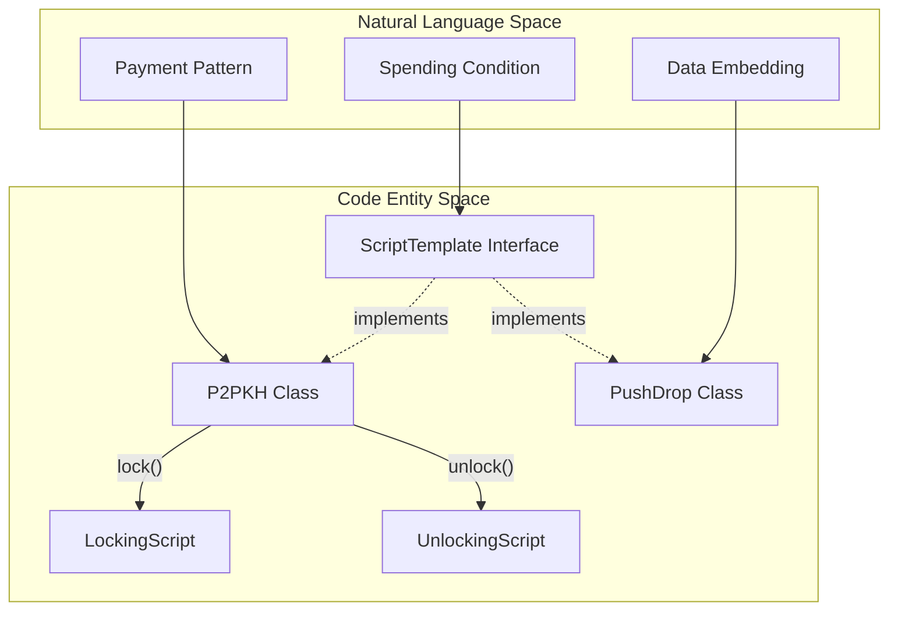
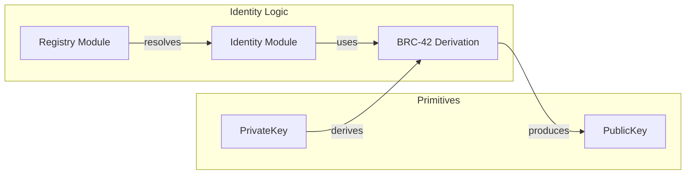

# Page: Script Templates & Compat Layer

# Script Templates & Compat Layer

Relevant source files

The following files were used as context for generating this wiki page:

- [conformance/runner/go/.gitignore](conformance/runner/go/.gitignore)
- [conformance/runner/go/README.md](conformance/runner/go/README.md)
- [conformance/vectors/sdk/compat/bsm.json](conformance/vectors/sdk/compat/bsm.json)
- [conformance/vectors/sdk/crypto/signature.json](conformance/vectors/sdk/crypto/signature.json)
- [conformance/vectors/sdk/keys/private-key.json](conformance/vectors/sdk/keys/private-key.json)
- [packages/sdk/ts-templates/package.json](packages/sdk/ts-templates/package.json)

This section covers the higher-level script abstractions and compatibility modules within the BSV SDK ecosystem. It focuses on `@bsv/templates` for standard script patterns, the `compat` layer for legacy standards (BSM, ECIES, BIP276), and specialized SDK modules for identity and data storage.

## Script Templates (@bsv/templates)

The `@bsv/templates` package provides concrete implementations of the `ScriptTemplate` interface defined in the core SDK [packages/sdk/ts-sdk/src/transaction/ScriptTemplate.ts](). These templates simplify the creation of complex locking and unlocking scripts by abstracting opcode sequences into functional classes.

### P2PKH (Pay-to-PublicKey-Hash)
The most common script template, implementing the standard Bitcoin payment pattern. It handles the generation of the locking script from an address or public key and the creation of the unlocking script using a private key signature.

### PushDrop
A specialized template used for data embedding and token protocols (like BTMS). It allows "pushing" data onto the stack and "dropping" it before executing a standard P2PKH or other spend condition.

### Data Flow: Script Generation
The following diagram illustrates how a `ScriptTemplate` interacts with the `Transaction` builder to produce valid scripts.

**Script Template Entity Mapping**

Sources: [packages/sdk/ts-templates/package.json:2-5](), [packages/sdk/ts-templates/package.json:63-65]()

---

## Compatibility Layer

The `compat` directory in the SDK provides implementations for legacy or cross-platform standards that do not strictly follow the core BRC-42 derivation or BEEF transaction formats but are essential for interoperability.

### Bitcoin Signed Messages (BSM)
BSM (BRC-77) is used for proving ownership of a private key by signing a human-readable string.
- **Key Function:** `BSM.sign(message, privKey)` creates a compact signature [conformance/vectors/sdk/compat/bsm.json:59-73]().
- **Verification:** `BSM.verify(message, signature, pubKey)` validates the signature against the message [conformance/vectors/sdk/compat/bsm.json:91-103]().
- **Magic Hash:** BSM prepends a specific prefix (`"\x18Bitcoin Signed Message:\n"`) to prevent "signature reuse" attacks where a message signature could be mistaken for a transaction signature [conformance/vectors/sdk/compat/bsm.json:11-21]().

### ECIES (Elliptic Curve Integrated Encryption Scheme)
Used for asymmetric encryption. It allows a sender to encrypt data using a recipient's public key, which only the recipient can decrypt with their private key.

### BIP276
A standard for prefixing and checksumming arbitrary data (like scripts or signatures) for human-readable transport, often used for sharing templates or specialized transaction data.

**Compatibility Layer Implementation**
| Standard | Implementation Class | Primary Purpose | Vector Reference |
| :--- | :--- | :--- | :--- |
| BRC-77 | `BSM` | Message Signing | `sdk.compat.bsm` |
| ECIES | `ECIES` | Asymmetric Encryption | N/A |
| BIP276 | `BIP276` | Data Encoding | N/A |

Sources: [conformance/vectors/sdk/compat/bsm.json:1-8](), [conformance/vectors/sdk/compat/bsm.json:121-135]()

---

## SDK Overlay Tools & Specialized Modules

Beyond transactions, the SDK contains modules for managing identity, registries, and key-value stores within the BSV ecosystem.

### Identity & Registry
- **Identity:** Manages BRC-42 based identities and their association with public keys.
- **Registry:** Provides mechanisms for looking up service endpoints or metadata associated with an identity.

### KVStore (Key-Value Store)
A simplified interface for persisting data to the blockchain using script-based storage patterns. It abstracts the process of creating transactions that represent "Put" or "Delete" operations on a decentralized key-value map.

### Data Flow: Identity and Keys
This diagram shows the relationship between cryptographic primitives and high-level identity modules.

**Identity System Mapping**

Sources: [conformance/vectors/sdk/keys/private-key.json:83-94](), [conformance/vectors/sdk/keys/private-key.json:1-7]()

---

## Conformance & Validation

The `compat` and `template` layers are validated through the conformance suite to ensure parity between TypeScript and other implementations (like Go).

- **Signature Encodings:** Validates DER and Compact signature formats used by BSM and transaction templates [conformance/vectors/sdk/crypto/signature.json:1-8]().
- **Key Derivation:** Ensures that BRC-42 child keys are derived consistently across environments, which is critical for identity and registry modules [conformance/vectors/sdk/keys/private-key.json:83-146]().

Sources: [conformance/vectors/sdk/crypto/signature.json:9-25](), [conformance/vectors/sdk/compat/bsm.json:121-135]()

---