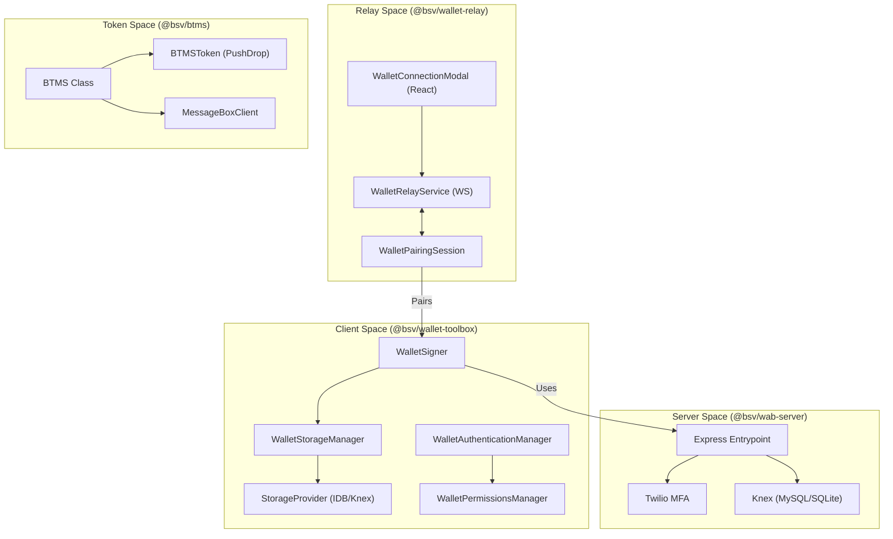
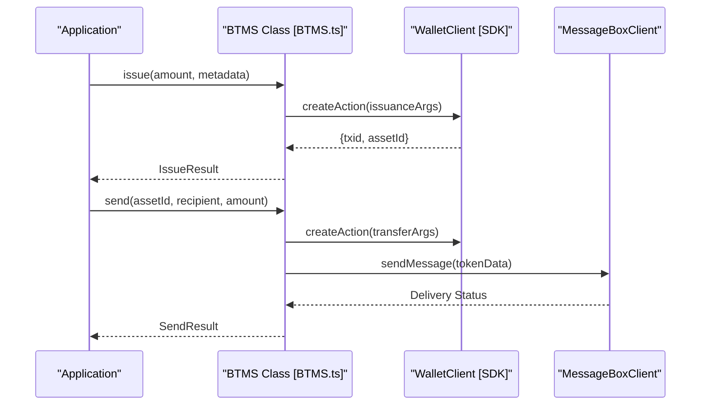

# Page: Wallet Layer

# Wallet Layer

Relevant source files

The following files were used as context for generating this wiki page:

- [packages/network/chaintracks-server/package.json](https://github.com/bsv-blockchain/ts-stack/blob/main/packages/network/chaintracks-server/package.json)
- [packages/overlays/overlay-express/package.json](https://github.com/bsv-blockchain/ts-stack/blob/main/packages/overlays/overlay-express/package.json)
- [packages/wallet/btms/README.md](https://github.com/bsv-blockchain/ts-stack/blob/main/packages/wallet/btms/README.md)
- [packages/wallet/btms/index.ts](https://github.com/bsv-blockchain/ts-stack/blob/main/packages/wallet/btms/index.ts)
- [packages/wallet/btms/jest.config.js](https://github.com/bsv-blockchain/ts-stack/blob/main/packages/wallet/btms/jest.config.js)
- [packages/wallet/btms/package-lock.json](https://github.com/bsv-blockchain/ts-stack/blob/main/packages/wallet/btms/package-lock.json)
- [packages/wallet/btms/src/BTMS.ts](https://github.com/bsv-blockchain/ts-stack/blob/main/packages/wallet/btms/src/BTMS.ts)
- [packages/wallet/btms/src/BTMSAdvanced.ts](https://github.com/bsv-blockchain/ts-stack/blob/main/packages/wallet/btms/src/BTMSAdvanced.ts)
- [packages/wallet/ts-wallet-relay/package.json](https://github.com/bsv-blockchain/ts-stack/blob/main/packages/wallet/ts-wallet-relay/package.json)
- [packages/wallet/wab/package.json](https://github.com/bsv-blockchain/ts-stack/blob/main/packages/wallet/wab/package.json)
- [packages/wallet/wallet-toolbox/package.json](https://github.com/bsv-blockchain/ts-stack/blob/main/packages/wallet/wallet-toolbox/package.json)

The Wallet Layer provides a comprehensive suite of packages for building, managing, and authenticating BSV wallets. It implements the **BRC-100** standard for wallet interfaces and provides reference implementations for storage, signing, and specialized token management.

## System Architecture

The Wallet Layer bridges the low-level cryptographic primitives of the SDK with high-level application requirements like mobile pairing, multi-factor authentication, and UTXO-based token lifecycles.

### Code Entity Mapping
The following diagram illustrates the relationship between key classes and their roles in the Wallet Layer.

Sources: [packages/wallet/wallet-toolbox/package.json:2-4](https://github.com/bsv-blockchain/ts-stack/blob/main/packages/wallet/wallet-toolbox/package.json#L2-L4), [packages/wallet/wab/package.json:2-5](https://github.com/bsv-blockchain/ts-stack/blob/main/packages/wallet/wab/package.json#L2-L5), [packages/wallet/ts-wallet-relay/package.json:2-4](https://github.com/bsv-blockchain/ts-stack/blob/main/packages/wallet/ts-wallet-relay/package.json#L2-L4), [packages/wallet/btms/src/BTMS.ts:98-120](https://github.com/bsv-blockchain/ts-stack/blob/main/packages/wallet/btms/src/BTMS.ts#L98-L120)

---

## Component Overview

### [wallet-toolbox: Storage, Signer & Wallet Manager](10-wallet-toolbox--Storage--Signer---Wallet-Manager.md)
The `@bsv/wallet-toolbox` package is the core implementation of a BRC-100 conforming wallet. It provides the `WalletSigner` for transaction signing and `WalletStorageManager` for managing keys and UTXOs. It supports multiple storage backends via `StorageKnex` (server/desktop) and `StorageIdb` (browser).

*   **Key Entities:** `WalletSigner`, `WalletStorageManager`, `WalletAuthenticationManager`.
*   **Build Targets:** Optimized builds for web, mobile, and server environments.
*   **For details, see [wallet-toolbox: Storage, Signer & Wallet Manager](10-wallet-toolbox--Storage--Signer---Wallet-Manager.md).**

Sources: [packages/wallet/wallet-toolbox/package.json:41-52](https://github.com/bsv-blockchain/ts-stack/blob/main/packages/wallet/wallet-toolbox/package.json#L41-L52), [packages/wallet/wallet-toolbox/package.json:2-4](https://github.com/bsv-blockchain/ts-stack/blob/main/packages/wallet/wallet-toolbox/package.json#L2-L4)

### [WAB: Wallet Authentication Backend](11-WAB--Wallet-Authentication-Backend.md)
The `@bsv/wab-server` (Wallet Authentication Backend) provides a secure Express-based environment for identity verification. It integrates with Twilio for multi-factor authentication (MFA) and uses Knex for flexible persistence across MySQL and SQLite.

*   **Key Entities:** Express server entrypoint, MFA handlers, Knex migrations.
*   **Integration:** Works alongside `wallet-toolbox` to verify user identities.
*   **For details, see [WAB: Wallet Authentication Backend](11-WAB--Wallet-Authentication-Backend.md).**

Sources: [packages/wallet/wab/package.json:15-26](https://github.com/bsv-blockchain/ts-stack/blob/main/packages/wallet/wab/package.json#L15-L26), [packages/wallet/wab/package.json:2-5](https://github.com/bsv-blockchain/ts-stack/blob/main/packages/wallet/wab/package.json#L2-L5)

### [Wallet Relay & Mobile Pairing](12-Wallet-Relay---Mobile-Pairing.md)
The `@bsv/wallet-relay` package facilitates secure, encrypted communication between a desktop/web application and a mobile wallet. It uses a WebSocket-based relay to handle QR-code pairing and session management.

*   **Key Entities:** `WalletRelayService`, `WalletPairingSession`, `useWalletRelayClient`.
*   **Frontend:** Includes a `WalletConnectionModal` React component for easy integration.
*   **For details, see [Wallet Relay & Mobile Pairing](12-Wallet-Relay---Mobile-Pairing.md).**

Sources: [packages/wallet/ts-wallet-relay/package.json:6-22](https://github.com/bsv-blockchain/ts-stack/blob/main/packages/wallet/ts-wallet-relay/package.json#L6-L22), [packages/wallet/ts-wallet-relay/package.json:40-46](https://github.com/bsv-blockchain/ts-stack/blob/main/packages/wallet/ts-wallet-relay/package.json#L40-L46)

### [BTMS: Token Management System](13-BTMS--Token-Management-System.md)
The `@bsv/btms` (Basic Token Management System) provides a high-level API for managing UTXO-based tokens. It uses **PushDrop** scripts to encode token metadata and amounts directly into transaction outputs.

*   **Key Entities:** `BTMS` class, `BTMSToken` (low-level encoding), `BTMSAdvanced` (privacy features).
*   **Protocol:** Implements a 3-field PushDrop format (Asset ID, Amount, Metadata).
*   **For details, see [BTMS: Token Management System](13-BTMS--Token-Management-System.md).**

Sources: [packages/wallet/btms/src/BTMS.ts:98-134](https://github.com/bsv-blockchain/ts-stack/blob/main/packages/wallet/btms/src/BTMS.ts#L98-L134), [packages/wallet/btms/README.md:78-87](https://github.com/bsv-blockchain/ts-stack/blob/main/packages/wallet/btms/README.md#L78-L87)

---

## Supporting Services

The Wallet Layer is supported by specialized network services that provide blockchain context and message delivery.

| Package | Purpose | Code Pointer |
| :--- | :--- | :--- |
| `@bsv/chaintracks-server` | Tracks blockchain headers for SPV validation. | [packages/network/chaintracks-server/package.json:5-6](https://github.com/bsv-blockchain/ts-stack/blob/main/packages/network/chaintracks-server/package.json#L5-L6) |
| `@bsv/message-box-client` | Asynchronous delivery of tokens and payment requests. | [packages/wallet/btms/src/BTMS.ts:38-43](https://github.com/bsv-blockchain/ts-stack/blob/main/packages/wallet/btms/src/BTMS.ts#L38-L43) |
| `@bsv/auth-express-middleware` | BRC-103 mutual authentication for wallet services. | [packages/wallet/wallet-toolbox/package.json:42](https://github.com/bsv-blockchain/ts-stack/blob/main/packages/wallet/wallet-toolbox/package.json#L42) |

### Service Interaction Diagram
This diagram shows how the `BTMS` class interacts with other services to issue and send tokens.

Sources: [packages/wallet/btms/src/BTMS.ts:161-230](https://github.com/bsv-blockchain/ts-stack/blob/main/packages/wallet/btms/src/BTMS.ts#L161-L230), [packages/wallet/btms/README.md:57-61](https://github.com/bsv-blockchain/ts-stack/blob/main/packages/wallet/btms/README.md#L57-L61)

---