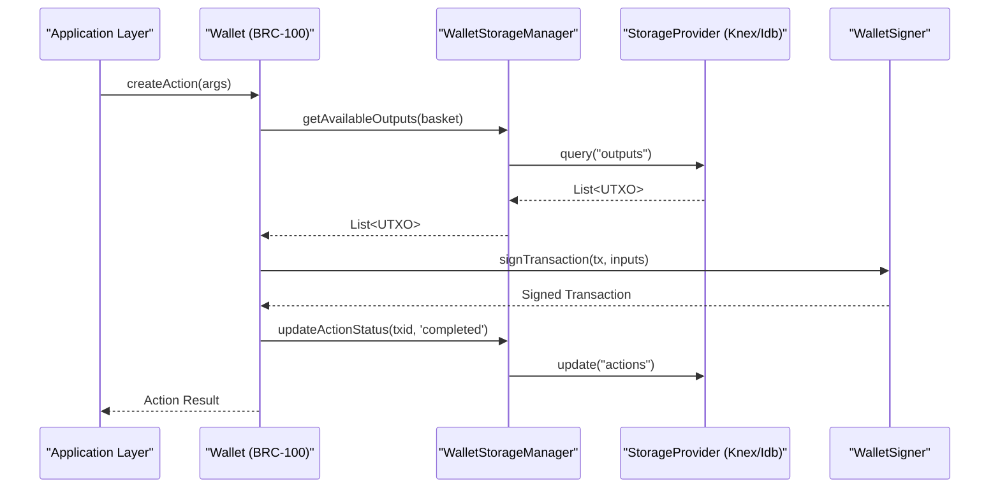
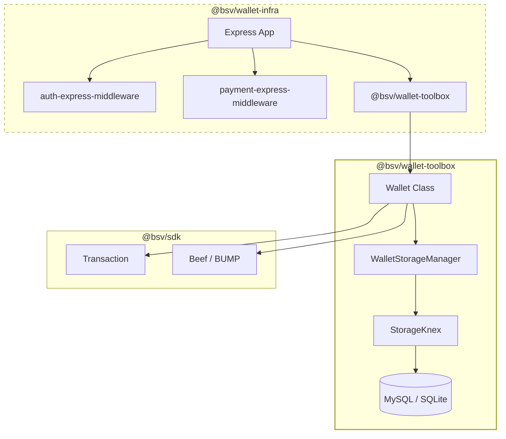

# Page: wallet-toolbox: Storage, Signer & Wallet Manager

# wallet-toolbox: Storage, Signer & Wallet Manager

Relevant source files

The following files were used as context for generating this wiki page:

- [packages/network/chaintracks-server/package.json](packages/network/chaintracks-server/package.json)
- [packages/overlays/overlay-express-examples/package.json](packages/overlays/overlay-express-examples/package.json)
- [packages/overlays/overlay-express/package.json](packages/overlays/overlay-express/package.json)
- [packages/wallet/wab/package.json](packages/wallet/wab/package.json)
- [packages/wallet/wallet-infra/package.json](packages/wallet/wallet-infra/package.json)
- [packages/wallet/wallet-toolbox-examples/package.json](packages/wallet/wallet-toolbox-examples/package.json)
- [packages/wallet/wallet-toolbox-examples/src/internalizeWalletPayment.ts](packages/wallet/wallet-toolbox-examples/src/internalizeWalletPayment.ts)
- [packages/wallet/wallet-toolbox-examples/src/janitor.ts](packages/wallet/wallet-toolbox-examples/src/janitor.ts)
- [packages/wallet/wallet-toolbox-examples/src/listChange.ts](packages/wallet/wallet-toolbox-examples/src/listChange.ts)
- [packages/wallet/wallet-toolbox/client/package.json](packages/wallet/wallet-toolbox/client/package.json)
- [packages/wallet/wallet-toolbox/mobile/package.json](packages/wallet/wallet-toolbox/mobile/package.json)
- [packages/wallet/wallet-toolbox/package.json](packages/wallet/wallet-toolbox/package.json)
- [packages/wallet/wallet-toolbox/src/storage/schema/entities/__tests/CertificateFieldTests.test.ts](packages/wallet/wallet-toolbox/src/storage/schema/entities/__tests/CertificateFieldTests.test.ts)
- [packages/wallet/wallet-toolbox/src/storage/schema/entities/__tests/usersTests.test.ts](packages/wallet/wallet-toolbox/src/storage/schema/entities/__tests/usersTests.test.ts)

The `@bsv/wallet-toolbox` package provides a high-performance, BRC-100 conforming implementation of a Bitcoin SV wallet. It serves as the reference implementation for wallet logic within the TS-Stack, handling the complexities of UTXO management, transaction signing, and persistent storage across multiple environments (Server, Browser, and Mobile).

## Overview & Multi-Target Builds

The toolbox is designed to be environment-agnostic while providing specialized entry points for different platforms. It leverages a modular architecture where storage and signing logic are decoupled from the core wallet state management.

| Target | Package / Entry Point | Primary Technologies |
| :--- | :--- | :--- |
| **All (Server)** | `@bsv/wallet-toolbox` | Node.js, Knex, MySQL, SQLite [packages/wallet/wallet-toolbox/package.json:2-52]() |
| **Client (Web)** | `@bsv/wallet-toolbox-client` | IndexedDB (idb), Web Crypto [packages/overlays/overlay-express/package.json:73-73]() |
| **Mobile** | `@bsv/wallet-toolbox-mobile` | React Native / SQLite [packages/wallet/wallet-toolbox/mobile/package.json:1-10]() |

Sources: [packages/wallet/wallet-toolbox/package.json:1-73](), [packages/overlays/overlay-express/package.json:68-80]()

## Core Architecture & Data Flow

The system revolves around three primary pillars: `WalletSigner`, `WalletStorageManager`, and the `Wallet` itself.

### Wallet System Interaction Diagram
This diagram illustrates how the toolbox components interact to process a transaction.

Sources: [packages/wallet/wallet-toolbox/src/storage/schema/entities/__tests/usersTests.test.ts:84-113](), [packages/wallet/wallet-toolbox-examples/src/internalizeWalletPayment.ts:45-64]()

## WalletStorageManager & Storage Providers

The `WalletStorageManager` abstracts the underlying database. It supports multiple `StorageProvider` implementations, allowing the same wallet logic to run on a server using MySQL or in a browser using IndexedDB.

### Key Entities
The storage layer manages several BRC-100 compliant entities:
- **EntityUser**: Manages identity keys and user-specific settings [packages/wallet/wallet-toolbox/src/storage/schema/entities/__tests/usersTests.test.ts:33-42]().
- **EntityCertificate**: Stores BRC-116/BRC-117 identity certificates [packages/wallet/wallet-toolbox/src/storage/schema/entities/__tests/CertificateFieldTests.test.ts:35-47]().
- **EntityCertificateField**: Individual fields within a certificate, supporting master key encryption [packages/wallet/wallet-toolbox/src/storage/schema/entities/__tests/CertificateFieldTests.test.ts:52-61]().

### Implementation Details
- **StorageKnex**: Uses the Knex.js query builder to support PostgreSQL, MySQL, and SQLite. Used primarily in `@bsv/wallet-infra` and `@bsv/wab-server` [packages/wallet/wallet-infra/package.json:38-47]().
- **StorageIdb**: A browser-based provider utilizing the `idb` wrapper for IndexedDB [packages/wallet/wallet-toolbox/package.json:48-48]().
- **Sync Layer**: The `SyncMap` and `createSyncMap` functions allow for reconciling data between different storage instances, essential for multi-device synchronization [packages/wallet/wallet-toolbox/src/storage/schema/entities/__tests/usersTests.test.ts:107-110]().

Sources: [packages/wallet/wallet-toolbox/src/storage/schema/entities/__tests/usersTests.test.ts:1-208](), [packages/wallet/wallet-toolbox/src/storage/schema/entities/__tests/CertificateFieldTests.test.ts:1-154](), [packages/wallet/wallet-infra/package.json:38-47]()

## WalletSigner & Authentication

The `WalletSigner` is responsible for all cryptographic operations. It handles BRC-42 key derivation and transaction signing without exposing the root private key to the rest of the application.

- **Internalization**: The `internalizeAction` function allows a wallet to ingest external outputs (like BRC-29 payments) by deriving the correct keys from a `paymentRemittance` [packages/wallet/wallet-toolbox-examples/src/internalizeWalletPayment.ts:49-64]().
- **WalletAuthenticationManager**: Manages BRC-103 mutual authentication sessions, ensuring that only authorized peers can request signatures or view balances.

Sources: [packages/wallet/wallet-toolbox-examples/src/internalizeWalletPayment.ts:33-69](), [packages/wallet/wallet-toolbox/package.json:42-44]()

## Wallet-Infra Reference Deployment

The `@bsv/wallet-infra` package is a reference implementation of a UTXO Management Server. It combines the `wallet-toolbox` with Express middleware to provide a scalable wallet backend.

### Component Association Diagram
This diagram maps the high-level infrastructure components to their specific code entities.

Sources: [packages/wallet/wallet-infra/package.json:38-47](), [packages/wallet/wallet-toolbox/package.json:42-49]()

### Key Features in Infrastructure
- **ChaintracksService**: A service within the toolbox used by `@bsv/chaintracks-server` to monitor blockchain headers and validate Merkle paths [packages/network/chaintracks-server/package.json:5-33]().
- **Janitor & Maintenance**: Tools like `janitorOnIdentity` are used to find and release unspendable or invalid change outputs, ensuring the UTXO set remains clean [packages/wallet/wallet-toolbox-examples/src/janitor.ts:15-50]().
- **Output Listing**: Advanced filtering via `listOutputs` allows applications to query specific "baskets" of UTXOs (e.g., `specOpInvalidChange`) [packages/wallet/wallet-toolbox-examples/src/janitor.ts:25-25]().

Sources: [packages/network/chaintracks-server/package.json:1-42](), [packages/wallet/wallet-toolbox-examples/src/janitor.ts:1-172](), [packages/wallet/wallet-toolbox-examples/src/listChange.ts:14-47]()

---