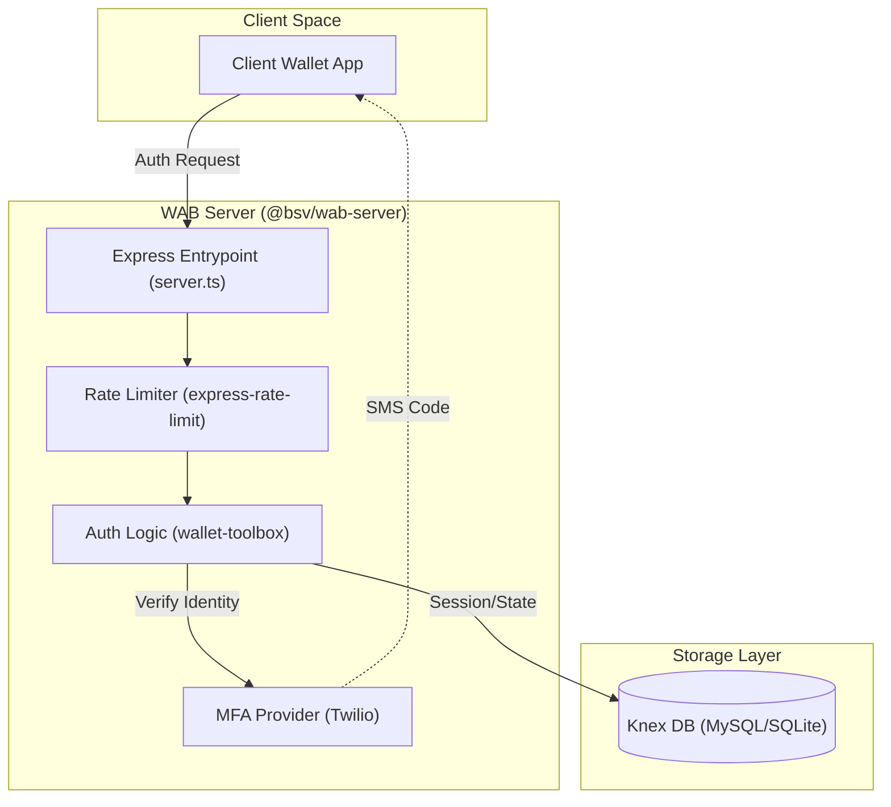
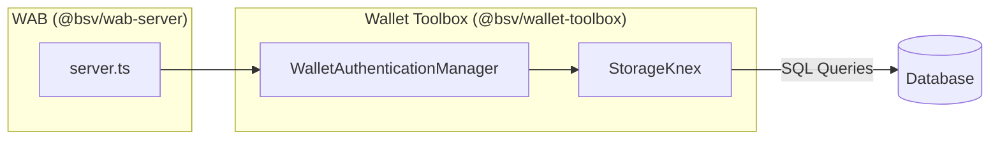

# Page: WAB: Wallet Authentication Backend

# WAB: Wallet Authentication Backend

Relevant source files

The following files were used as context for generating this wiki page:

- [packages/network/chaintracks-server/package.json](packages/network/chaintracks-server/package.json)
- [packages/overlays/overlay-express/package.json](packages/overlays/overlay-express/package.json)
- [packages/wallet/wab/package.json](packages/wallet/wab/package.json)
- [packages/wallet/wallet-toolbox/package.json](packages/wallet/wallet-toolbox/package.json)

The Wallet Authentication Backend (WAB) is a specialized Express-based service within the `@bsv/ts-stack` designed to facilitate secure identity verification and multi-factor authentication (MFA) for Bitcoin SV wallets. It serves as the bridge between a user's physical identity (via SMS/Twilio) and their cryptographic identity managed by the `wallet-toolbox`.

## Overview and Purpose

WAB provides a centralized service for managing user authentication state, rate limiting, and MFA challenges. It integrates deeply with the `wallet-toolbox` to handle identity verification logic while providing a robust server-side implementation for production environments.

### Key Capabilities:
*   **Multi-Factor Authentication:** Built-in support for Twilio-based SMS verification codes [packages/wallet/wab/package.json:25-25]().
*   **Database Persistence:** Flexible storage using Knex.js, supporting MySQL and SQLite for managing sessions and migration state [packages/wallet/wab/package.json:22-24]().
*   **Rate Limiting:** Integrated protection against brute-force attacks on MFA endpoints [packages/wallet/wab/package.json:20-20]().
*   **Wallet Integration:** Direct dependency on `@bsv/wallet-toolbox` for BRC-100 compliant wallet operations [packages/wallet/wab/package.json:17-17]().

---

## System Architecture

WAB operates as a middleware-heavy Express server. It sits between the client-side wallet applications and the broader BSV ecosystem services.

### Logic Flow: Code to Entity Mapping

The following diagram illustrates how the WAB server components interact to process authentication requests.

**WAB Authentication Data Flow**

Sources: [packages/wallet/wab/package.json:5-26](), [packages/wallet/wab/package.json:8-9]()

---

## Implementation Details

### Server Entrypoint and Middleware
The WAB server is initialized via `src/server.ts` [packages/wallet/wab/package.json:9-9](). It utilizes `body-parser` for JSON payload handling and `dotenv` for environment configuration.

| Component | Package / Tool | Purpose |
| :--- | :--- | :--- |
| **Server Framework** | `express` | Handles HTTP routing and lifecycle [packages/wallet/wab/package.json:19-19]() |
| **Security** | `express-rate-limit` | Prevents credential stuffing and MFA exhaustion [packages/wallet/wab/package.json:20-20]() |
| **Data Integrity** | `json-stable-stringify` | Ensures consistent hashing of identity objects [packages/wallet/wab/package.json:21-21]() |

### Persistence and Migrations
WAB uses `knex` to manage its relational schema. This allows for seamless transitions between development (SQLite) and production (MySQL) environments.

*   **Migrations:** Managed via `knexfile.ts` using the `migrate:latest` command [packages/wallet/wab/package.json:11-11]().
*   **Drivers:** Supports `mysql2` for high-concurrency production deployments and `sqlite3` for local testing or lightweight instances [packages/wallet/wab/package.json:23-24]().

### Integration with Wallet Toolbox
WAB is not a standalone wallet; it is a backend for the `@bsv/wallet-toolbox`. It specifically leverages the `WalletAuthenticationManager` and `StorageKnex` components from the toolbox to enforce BRC-100 standards.

**Component Interaction**

Sources: [packages/wallet/wab/package.json:17-17](), [packages/wallet/wallet-toolbox/package.json:4-4](), [packages/wallet/wallet-toolbox/package.json:49-50]()

---

## Development and Deployment

### Scripts
The package defines several lifecycle scripts for development and production:

*   **`npm run dev`**: Starts the server using `ts-node-dev` with hot-reloading [packages/wallet/wab/package.json:9-9]().
*   **`npm run build`**: Compiles TypeScript source to the `dist/` directory [packages/wallet/wab/package.json:10-10]().
*   **`npm run migrate`**: Runs database schema updates [packages/wallet/wab/package.json:11-11]().
*   **`npm run test`**: Executes the Jest test suite [packages/wallet/wab/package.json:12-12]().

### Configuration
Environment variables (via `.env`) are used to configure:
1.  **Twilio Credentials**: SID, Auth Token, and Verify Service ID for SMS MFA.
2.  **Database Connection**: Connection strings for MySQL or file paths for SQLite.
3.  **Rate Limits**: Thresholds for API request throttling.

Sources: [packages/wallet/wab/package.json:7-14](), [packages/wallet/wab/package.json:18-18]()

---