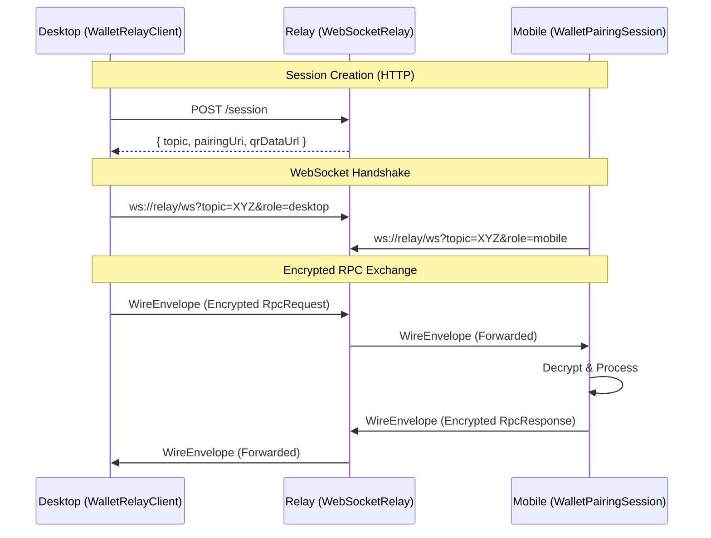
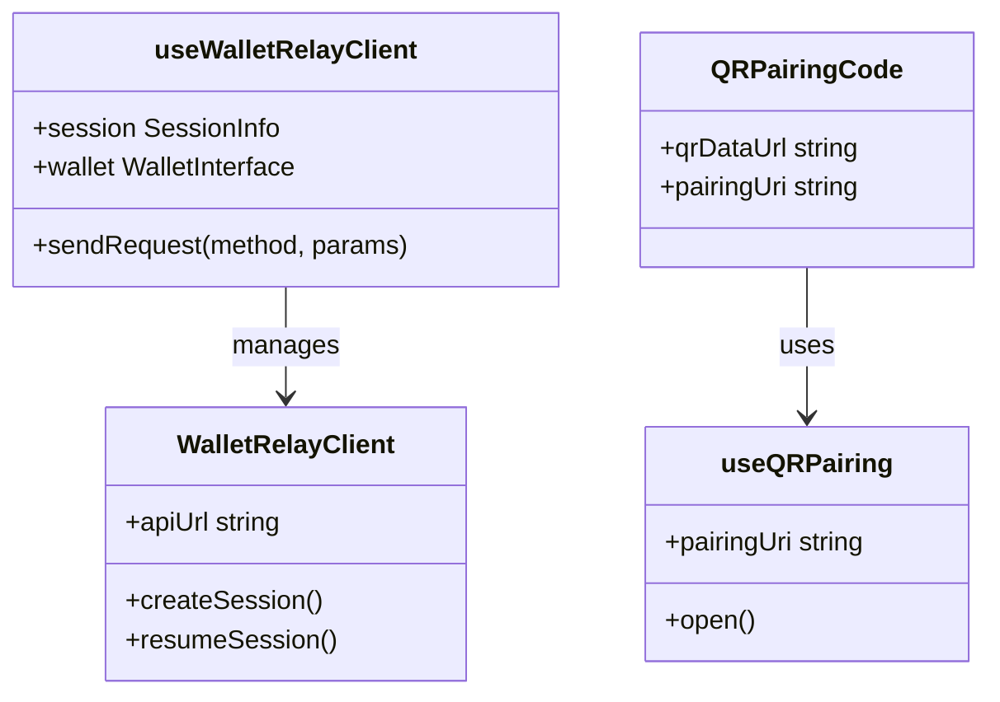

# Page: Wallet Relay & Mobile Pairing

# Wallet Relay & Mobile Pairing

Relevant source files

The following files were used as context for generating this wiki page:

- [packages/messaging/messagebox-services/backend/package-lock.json](https://github.com/bsv-blockchain/ts-stack/blob/main/packages/messaging/messagebox-services/backend/package-lock.json)
- [packages/wallet/ts-wallet-relay/dist/client.cjs.map](https://github.com/bsv-blockchain/ts-stack/blob/main/packages/wallet/ts-wallet-relay/dist/client.cjs.map)
- [packages/wallet/ts-wallet-relay/dist/client.js.map](https://github.com/bsv-blockchain/ts-stack/blob/main/packages/wallet/ts-wallet-relay/dist/client.js.map)
- [packages/wallet/ts-wallet-relay/dist/index.cjs.map](https://github.com/bsv-blockchain/ts-stack/blob/main/packages/wallet/ts-wallet-relay/dist/index.cjs.map)
- [packages/wallet/ts-wallet-relay/dist/index.js.map](https://github.com/bsv-blockchain/ts-stack/blob/main/packages/wallet/ts-wallet-relay/dist/index.js.map)
- [packages/wallet/ts-wallet-relay/dist/react.cjs.map](https://github.com/bsv-blockchain/ts-stack/blob/main/packages/wallet/ts-wallet-relay/dist/react.cjs.map)
- [packages/wallet/ts-wallet-relay/dist/react.js.map](https://github.com/bsv-blockchain/ts-stack/blob/main/packages/wallet/ts-wallet-relay/dist/react.js.map)
- [packages/wallet/ts-wallet-relay/package.json](https://github.com/bsv-blockchain/ts-stack/blob/main/packages/wallet/ts-wallet-relay/package.json)

The `@bsv/wallet-relay` package provides a secure, encrypted communication bridge between a desktop application (the "Client") and a mobile wallet (the "Peer"). It enables mobile-first wallet interaction on desktop sites using QR-code-based pairing and encrypted WebSocket communication.

## System Architecture

The system consists of three primary components:
1.  **WalletRelayService (Backend):** A Node.js service that manages sessions and provides a WebSocket relay.
2.  **WalletRelayClient (Desktop/Web):** A client library (with React hooks) for desktop applications to request a session and send RPC commands.
3.  **WalletPairingSession (Mobile):** A client library for mobile wallets to connect to the relay, decrypt requests, and provide responses.

### Data Flow & Encryption
All communication between the desktop and mobile is end-to-end encrypted using the `@bsv/sdk` encryption primitives. The relay server acts as a blind mailbox; it routes `WireEnvelope` objects but cannot read the `ciphertext` inside them.

Title: Wallet Relay Communication Flow

Sources: `[packages/wallet/ts-wallet-relay/dist/index.js.map:1-1](https://github.com/bsv-blockchain/ts-stack/blob/main/packages/wallet/ts-wallet-relay/dist/index.js.map#L1-L1)`, `[packages/wallet/ts-wallet-relay/dist/client.js.map:1-1](https://github.com/bsv-blockchain/ts-stack/blob/main/packages/wallet/ts-wallet-relay/dist/client.js.map#L1-L1)`

---

## Backend: WalletRelayService

The `WalletRelayService` is the entry point for the server-side implementation. It coordinates session management via `QRSessionManager` and message routing via `WebSocketRelay`.

### Key Components
-   **`WebSocketRelay`**: Manages raw WebSocket connections, heartbeats, and message buffering for disconnected clients `[packages/wallet/ts-wallet-relay/dist/index.js.map:39-40](https://github.com/bsv-blockchain/ts-stack/blob/main/packages/wallet/ts-wallet-relay/dist/index.js.map#L39-L40)`.
-   **`QRSessionManager`**: Handles the lifecycle of pairing sessions, including generating the `pairingUri` and QR codes `[packages/wallet/ts-wallet-relay/dist/index.js.map:1-1](https://github.com/bsv-blockchain/ts-stack/blob/main/packages/wallet/ts-wallet-relay/dist/index.js.map#L1-L1)`.
-   **`WalletRequestHandler`**: An Express-compatible handler for the `/session` and `/session/:topic` HTTP endpoints `[packages/wallet/ts-wallet-relay/dist/index.js.map:1-1](https://github.com/bsv-blockchain/ts-stack/blob/main/packages/wallet/ts-wallet-relay/dist/index.js.map#L1-L1)`.

### WebSocket Relay Logic
The relay uses a `TopicEntry` to track the two halves of a pairing. If one side is disconnected when a message arrives, the relay buffers the message (up to `BUFFER_MAX_PER_TOPIC`) for `BUFFER_TTL_MS` (60 seconds) `[packages/wallet/ts-wallet-relay/dist/index.js.map:5-7](https://github.com/bsv-blockchain/ts-stack/blob/main/packages/wallet/ts-wallet-relay/dist/index.js.map#L5-L7)`.

| Feature | Implementation Detail |
| :--- | :--- |
| **Heartbeat** | Every 30s (`HEARTBEAT_INTERVAL_MS`) to keep connections alive `[packages/wallet/ts-wallet-relay/dist/index.js.map:5-5](https://github.com/bsv-blockchain/ts-stack/blob/main/packages/wallet/ts-wallet-relay/dist/index.js.map#L5-L5)`. |
| **Role Validation** | Rejects connections missing `topic` or `role` (desktop/mobile) `[packages/wallet/ts-wallet-relay/dist/index.js.map:135-145](https://github.com/bsv-blockchain/ts-stack/blob/main/packages/wallet/ts-wallet-relay/dist/index.js.map#L135-L145)`. |
| **Origin Security** | Validates `Origin` headers for `role=desktop` browser clients `[packages/wallet/ts-wallet-relay/dist/index.js.map:150-155](https://github.com/bsv-blockchain/ts-stack/blob/main/packages/wallet/ts-wallet-relay/dist/index.js.map#L150-L155)`. |

Sources: `[packages/wallet/ts-wallet-relay/dist/index.js.map:1-170](https://github.com/bsv-blockchain/ts-stack/blob/main/packages/wallet/ts-wallet-relay/dist/index.js.map#L1-L170)`

---

## Mobile: WalletPairingSession

The `WalletPairingSession` class is used by mobile wallets to fulfill requests from a paired desktop client. It manages the mobile-side WebSocket connection and handles the decryption of RPC requests.

### Implementation Details
-   **`connect()`**: Establishes the WebSocket connection with `role=mobile` `[packages/wallet/ts-wallet-relay/dist/client.js.map:84-84](https://github.com/bsv-blockchain/ts-stack/blob/main/packages/wallet/ts-wallet-relay/dist/client.js.map#L84-L84)`.
-   **`onRequest(handler)`**: Registers a callback to process decrypted RPC methods (e.g., `getPublicKey`, `signAction`) `[packages/wallet/ts-wallet-relay/dist/client.js.map:127-130](https://github.com/bsv-blockchain/ts-stack/blob/main/packages/wallet/ts-wallet-relay/dist/client.js.map#L127-L130)`.
-   **Replay Protection**: Tracks a sequence number (`_lastSeq`) to prevent message replay attacks `[packages/wallet/ts-wallet-relay/dist/client.js.map:87-87](https://github.com/bsv-blockchain/ts-stack/blob/main/packages/wallet/ts-wallet-relay/dist/client.js.map#L87-L87)`.

### Method Handling
The session distinguishes between methods that require user interaction and those that can be auto-approved:
-   **`DEFAULT_IMPLEMENTED_METHODS`**: The standard set of BRC-100 methods supported by the BSV mobile ecosystem `[packages/wallet/ts-wallet-relay/dist/client.js.map:11-16](https://github.com/bsv-blockchain/ts-stack/blob/main/packages/wallet/ts-wallet-relay/dist/client.js.map#L11-L16)`.
-   **`DEFAULT_AUTO_APPROVE_METHODS`**: Includes `getPublicKey` by default `[packages/wallet/ts-wallet-relay/dist/client.js.map:22-22](https://github.com/bsv-blockchain/ts-stack/blob/main/packages/wallet/ts-wallet-relay/dist/client.js.map#L22-L22)`.

Sources: `[packages/wallet/ts-wallet-relay/dist/client.js.map:1-135](https://github.com/bsv-blockchain/ts-stack/blob/main/packages/wallet/ts-wallet-relay/dist/client.js.map#L1-L135)`

---

## Frontend: React Integration

For web applications, the package provides high-level React hooks and components to manage the pairing UI and client state.

### useWalletRelayClient
This hook manages the `WalletRelayClient` instance and exposes the session state.

-   **`session`**: Contains the current connection status (`idle`, `connecting`, `connected`, `disconnected`) and pairing metadata `[packages/wallet/ts-wallet-relay/dist/react.js.map:30-30](https://github.com/bsv-blockchain/ts-stack/blob/main/packages/wallet/ts-wallet-relay/dist/react.js.map#L30-L30)`.
-   **`sendRequest(method, params)`**: Sends an encrypted RPC request to the mobile wallet `[packages/wallet/ts-wallet-relay/dist/react.js.map:61-64](https://github.com/bsv-blockchain/ts-stack/blob/main/packages/wallet/ts-wallet-relay/dist/react.js.map#L61-L64)`.
-   **`wallet`**: A proxy object that implements the `WalletInterface`, allowing the app to call `wallet.getPublicKey()` directly when connected `[packages/wallet/ts-wallet-relay/dist/react.js.map:85-87](https://github.com/bsv-blockchain/ts-stack/blob/main/packages/wallet/ts-wallet-relay/dist/react.js.map#L85-L87)`.

### UI Components
-   **`WalletConnectionModal`**: A pre-built modal that displays the QR code and connection status `[packages/wallet/ts-wallet-relay/dist/react.cjs.map:15-16](https://github.com/bsv-blockchain/ts-stack/blob/main/packages/wallet/ts-wallet-relay/dist/react.cjs.map#L15-L16)`.
-   **`QRPairingCode`**: A tappable QR code component. On mobile browsers, tapping it triggers the `wallet://pair` deeplink `[packages/wallet/ts-wallet-relay/dist/react.js.map:32-38](https://github.com/bsv-blockchain/ts-stack/blob/main/packages/wallet/ts-wallet-relay/dist/react.js.map#L32-L38)`.

Title: React Component to Code Entity Mapping

Sources: `[packages/wallet/ts-wallet-relay/dist/react.js.map:1-90](https://github.com/bsv-blockchain/ts-stack/blob/main/packages/wallet/ts-wallet-relay/dist/react.js.map#L1-L90)`, `[packages/wallet/ts-wallet-relay/dist/react.cjs.map:1-75](https://github.com/bsv-blockchain/ts-stack/blob/main/packages/wallet/ts-wallet-relay/dist/react.cjs.map#L1-L75)`

---

## Session Lifecycle

The session lifecycle ensures that connections can be resumed after network interruptions without re-scanning a QR code.

1.  **Initialization**: Desktop calls `createSession()` on the relay. The relay returns a `topic` and a `token`.
2.  **Pairing**: Mobile scans the QR code containing the `pairingUri` (which includes the topic and encryption parameters).
3.  **Connection**: Both sides connect to the WebSocket relay.
4.  **Persistence**: The `WalletRelayClient` can persist session tokens in `localStorage` `[packages/wallet/ts-wallet-relay/dist/react.js.map:42-51](https://github.com/bsv-blockchain/ts-stack/blob/main/packages/wallet/ts-wallet-relay/dist/react.js.map#L42-L51)`.
5.  **Resumption**: Upon page reload, `resumeSession()` attempts to reconnect to the existing topic using the stored token `[packages/wallet/ts-wallet-relay/dist/react.js.map:73-76](https://github.com/bsv-blockchain/ts-stack/blob/main/packages/wallet/ts-wallet-relay/dist/react.js.map#L73-L76)`.

### Wire Envelope Structure
Messages sent over the relay are wrapped in a `WireEnvelope`:
-   `topic`: The session identifier.
-   `ciphertext`: The encrypted `RpcRequest` or `RpcResponse`.
-   `seq`: Sequence number for ordering and replay protection.

Sources: `[packages/wallet/ts-wallet-relay/dist/index.js.map:1-25](https://github.com/bsv-blockchain/ts-stack/blob/main/packages/wallet/ts-wallet-relay/dist/index.js.map#L1-L25)`, `[packages/wallet/ts-wallet-relay/dist/react.js.map:70-80](https://github.com/bsv-blockchain/ts-stack/blob/main/packages/wallet/ts-wallet-relay/dist/react.js.map#L70-L80)`

---