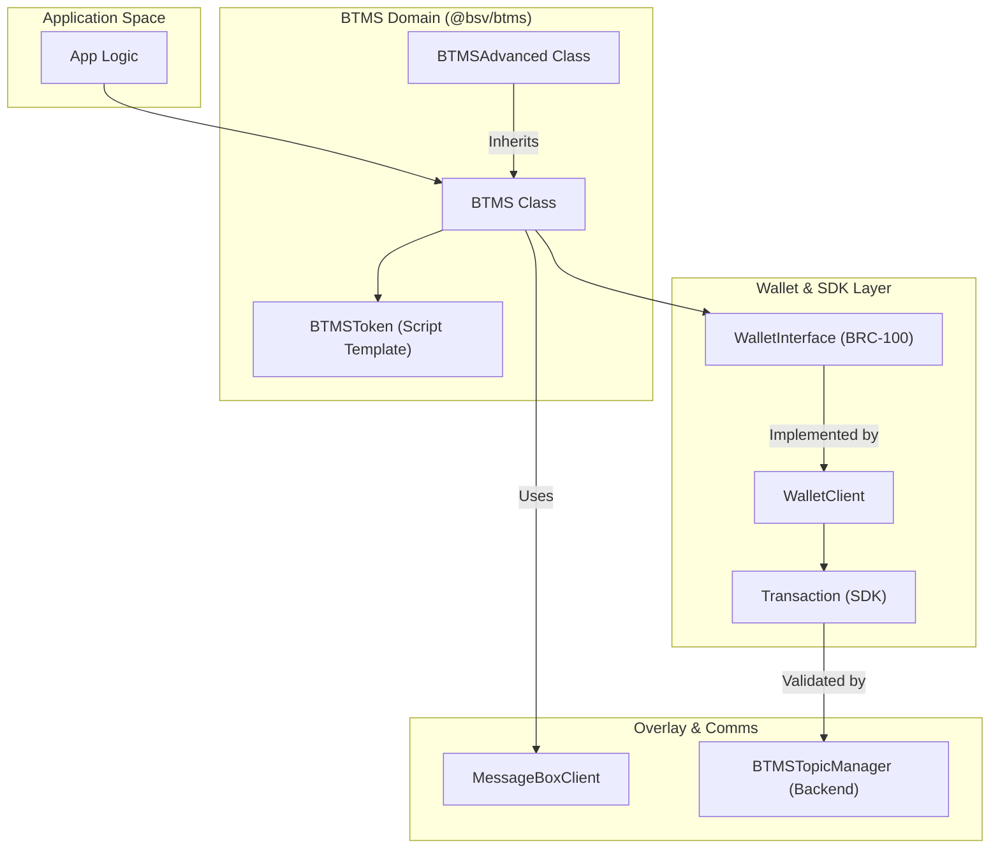
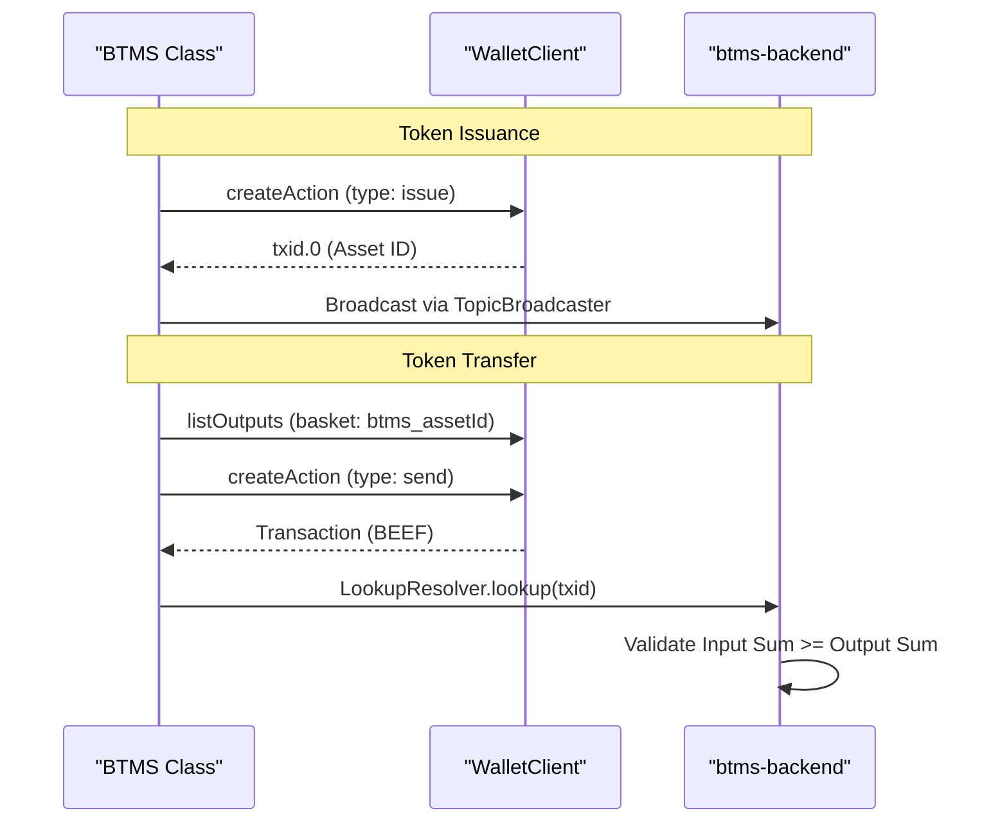

# Page: BTMS: Token Management System

# BTMS: Token Management System

Relevant source files

The following files were used as context for generating this wiki page:

- [.editorconfig](.editorconfig)
- [.npmrc](.npmrc)
- [conformance/vectors/README.md](conformance/vectors/README.md)
- [packages/messaging/message-box-server/package.json](packages/messaging/message-box-server/package.json)
- [packages/overlays/btms-backend/package.json](packages/overlays/btms-backend/package.json)
- [packages/wallet/btms-permission-module/package.json](packages/wallet/btms-permission-module/package.json)
- [packages/wallet/btms/README.md](packages/wallet/btms/README.md)
- [packages/wallet/btms/index.ts](packages/wallet/btms/index.ts)
- [packages/wallet/btms/jest.config.js](packages/wallet/btms/jest.config.js)
- [packages/wallet/btms/package-lock.json](packages/wallet/btms/package-lock.json)
- [packages/wallet/btms/package.json](packages/wallet/btms/package.json)
- [packages/wallet/btms/src/BTMS.ts](packages/wallet/btms/src/BTMS.ts)
- [packages/wallet/btms/src/BTMSAdvanced.ts](packages/wallet/btms/src/BTMSAdvanced.ts)

The **Basic Token Management System (BTMS)** is a modular, UTXO-based token protocol designed for the Bitcoin SV (BSV) blockchain. It provides a standardized way to issue, transfer, and manage fungible tokens using **PushDrop** scripts and overlay networks. BTMS is architected to integrate seamlessly with BRC-100 compliant wallets and uses a 3-field script format that aligns with specialized overlay topic managers for validation.

## Architecture & Data Flow

BTMS operates by embedding token logic within Bitcoin transaction outputs. The system is divided into high-level management classes, low-level script templates, and backend overlay services for state tracking.

### BTMS Component Relationships

The following diagram illustrates how the BTMS classes interact with the core SDK and external messaging layers.

**BTMS Entity Mapping**

**Sources:** [packages/wallet/btms/src/BTMS.ts:98-120](), [packages/wallet/btms/README.md:34-43](), [packages/wallet/btms/package.json:51-53]()

## Core Classes

### BTMS Class
The `BTMS` class is the primary entry point for developers. It provides high-level methods for token lifecycle management, abstracting away the complexities of UTXO selection and script construction [packages/wallet/btms/src/BTMS.ts:4-9]().

*   **`issue(amount, metadata)`**: Creates a new token. It uses a random derivation key for privacy and marks the output with an `ISSUE` marker [packages/wallet/btms/src/BTMS.ts:161-212]().
*   **`send(assetId, recipient, amount)`**: Handles UTXO selection from the wallet's BTMS basket, constructs the transfer transaction, and optionally delivers the BEEF (Bitcoin Envelope Entity Format) to the recipient via a `CommsLayer` [packages/wallet/btms/README.md:143-161]().
*   **`accept(payment)`**: Processes incoming tokens received via messaging layers and internalizes them into the wallet's local storage [packages/wallet/btms/README.md:163-174]().
*   **`getBalance(assetId)`**: Aggregates UTXOs in the specific asset's basket to return a total balance [packages/wallet/btms/README.md:195-202]().

**Sources:** [packages/wallet/btms/src/BTMS.ts:98-223](), [packages/wallet/btms/README.md:100-211]()

### BTMSToken (Script Template)
This class handles the encoding and decoding of the 3-field PushDrop script used by BTMS.

| Field | Description | Code Reference |
| :--- | :--- | :--- |
| **0: Asset ID** | The canonical ID (`txid.vout`) or `"ISSUE"` marker. | [packages/wallet/btms/README.md:80-84]() |
| **1: Amount** | UTF-8 string representing a positive integer. | [packages/wallet/btms/README.md:85]() |
| **2: Metadata** | Optional JSON string containing token details (name, symbol, icon). | [packages/wallet/btms/README.md:86]() |

**Sources:** [packages/wallet/btms/src/BTMSToken.js:1-50](), [packages/wallet/btms/README.md:78-87]()

## Token Lifecycle Logic

The lifecycle of a BTMS token is governed by the `BTMSTopicManager` in the overlay backend. This manager ensures that tokens cannot be "minted" out of thin air after the initial issuance.

**Token Transaction Flow**

**Sources:** [packages/wallet/btms/src/BTMS.ts:161-225](), [packages/wallet/btms/README.md:88-97]()

## Integration Modules

### btms-permission-module
The `@bsv/btms-permission-module` is a specialized package for integrating BTMS into BRC-100 wallets (like the `wallet-toolbox`). It allows the wallet to handle BTMS-specific requests while maintaining security boundaries [packages/wallet/btms-permission-module/package.json:2-4]().

*   **Dependencies**: Requires `@bsv/sdk`, `@bsv/btms`, and `@bsv/wallet-toolbox-client` [packages/wallet/btms-permission-module/package.json:26-30]().

### btms-backend (Overlay)
The `@bsv/btms-backend` package implements the server-side logic for the BTMS overlay. It uses the `@bsv/overlay` engine to track the state of every BTMS UTXO [packages/overlays/btms-backend/package.json:2-6]().

*   **Topic Manager**: Implements validation rules (e.g., ensuring metadata consistency across transfers) [packages/wallet/btms/README.md:93-97]().
*   **Storage**: Typically uses MongoDB to index token outputs for fast lookup by `assetId` or owner [packages/overlays/btms-backend/package.json:52]().

**Sources:** [packages/wallet/btms-permission-module/package.json:1-37](), [packages/overlays/btms-backend/package.json:1-54]()

## Implementation Details

### Asset ID Computation
The canonical Asset ID is derived from the transaction ID and output index of the issuance transaction.
*   **Function**: `BTMSToken.computeAssetId(txid, vout)`
*   **Format**: `<32-byte-hex-txid>.<output-index>` (e.g., `abc123...def.0`)

**Sources:** [packages/wallet/btms/src/BTMS.ts:222](), [packages/wallet/btms/README.md:241-244]()

### Basket Management
BTMS uses the `wallet-toolbox` basket system to organize UTXOs.
*   **Basket Name**: `p btms <assetId>`
*   **Labels**: BTMS transactions are tagged with labels such as `btms_type_issue`, `btms_direction_incoming`, and `btms_counterparty_<pubkey>` for efficient filtering in the UI [packages/wallet/btms/src/BTMS.ts:183-205]().

**Sources:** [packages/wallet/btms/src/BTMS.ts:161-225]()

---