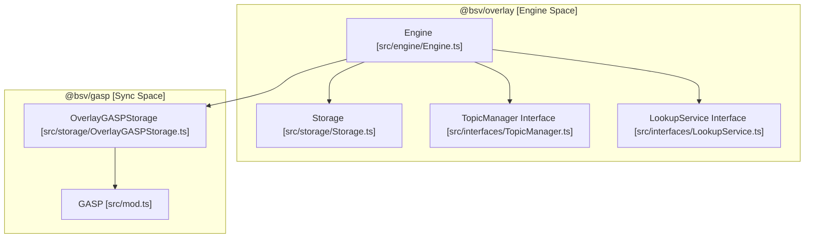
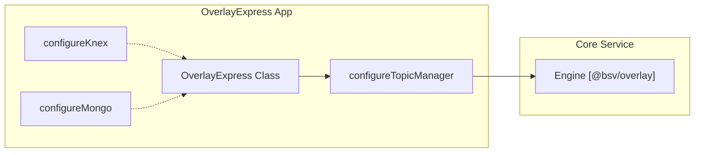

# Page: Overlay Services

# Overlay Services

Relevant source files

The following files were used as context for generating this wiki page:

- [packages/overlays/gasp-core/package.json](packages/overlays/gasp-core/package.json)
- [packages/overlays/overlay-discovery-services/package.json](packages/overlays/overlay-discovery-services/package.json)
- [packages/overlays/overlay-services/package.json](packages/overlays/overlay-services/package.json)

Overlay Services provide a decentralized, topic-based indexing and storage layer for the BSV blockchain. While the base blockchain layer handles transaction validation and ordering, Overlay Services allow applications to define custom data schemas (topics) and synchronization rules. This domain encompasses the core engine for processing transactions, the Graph Aware Sync Protocol (GASP) for peer-to-peer data exchange, and a framework for deploying these services as web applications.

### System Overview

The overlay architecture is built on a modular pattern where a central **Engine** coordinates between transaction storage, topic-specific logic (**TopicManagers**), and external data lookups (**LookupServices**).

| Component | Package | Role |
|-----------|---------|------|
| **Core Engine** | `@bsv/overlay` | Orchestrates transaction ingestion, validation, and storage. |
| **Sync Protocol** | `@bsv/gasp` | Handles peer-to-peer synchronization of transaction graphs. |
| **Deployment** | `@bsv/overlay-express` | Express.js framework for hosting overlay services. |
| **Topics** | `@bsv/overlay-topics` | Canonical library of predefined topic implementations (e.g., Identity, UHRP). |
| **Discovery** | `@bsv/overlay-discovery-services` | Services for locating and advertising overlay nodes. |

### Core Architecture: Engine & GASP

The `Engine` class in `@bsv/overlay` is the primary entry point for overlay operations. It manages the lifecycle of transactions as they are submitted to the network, ensuring they are stored and passed to the relevant `TopicManager` for indexing. The system utilizes GASP (Graph Aware Sync Protocol) to synchronize state between nodes without requiring a central coordinator.

For details, see [Overlay Services Engine & GASP Sync](#4.1).

#### Logic Flow Diagram
This diagram illustrates the relationship between the core `Engine` and its supporting interfaces.

**Sources:** [packages/overlays/overlay-services/package.json:1-81](), [packages/overlays/gasp-core/package.json:1-66]()

---

### Overlay Express & Deployment Framework

`@bsv/overlay-express` provides a standardized way to deploy overlay services as HTTP servers. It includes helpers to configure database backends (Knex for SQL or MongoDB) and automatically wires up the Engine with Express routes. This allows developers to focus on topic logic while the framework handles the boilerplate of networking and persistence.

For details, see [Overlay Express & Deployment](#4.2).

#### Deployment Components
The framework bridges high-level configuration to the underlying Engine.

**Sources:** [packages/overlays/overlay-services/package.json:75-79]()

---

### Canonical Topic Library (@bsv/overlay-topics)

The `@bsv/overlay-topics` package contains the "standard library" of BSV overlay topics. Each topic defines how specific transaction types should be parsed and indexed. Notable topics include:

*   **UHRP (Universal Hash Registry Protocol):** A storage server implementation for content-addressed data.
*   **Identity & DID:** Topics for managing BRC-42 based identities and decentralized identifiers.
*   **KVStore:** A simple key-value store built on top of the blockchain.
*   **Basketmap/Protomap:** Advanced mapping topics for complex data structures.

Each topic implementation typically follows a pattern of providing a `TopicManager` for validation and a `LookupService` for querying the indexed data.

For details, see [Canonical Topic Library (@bsv/overlay-topics)](#4.3).

---

### Discovery and Storage
The ecosystem is rounded out by `@bsv/overlay-discovery-services`, which facilitates node discovery via SHIP (Service Host Identity Protocol) and SLAP (Service Location Advertisement Protocol). This ensures that overlay nodes can find peers interested in the same topics.

| Feature | Description |
|---------|-------------|
| **SHIP/SLAP** | Protocols used by the Engine to advertise its presence and the topics it supports. |
| **UHRP Storage** | Specialized storage handling for large blobs associated with overlay transactions. |
| **Multi-DB Support** | Storage abstractions allowing the use of Knex (Postgres/SQLite/MySQL) or MongoDB. |

**Sources:** [packages/overlays/overlay-discovery-services/package.json:1-71](), [packages/overlays/overlay-services/package.json:27-36]()

---