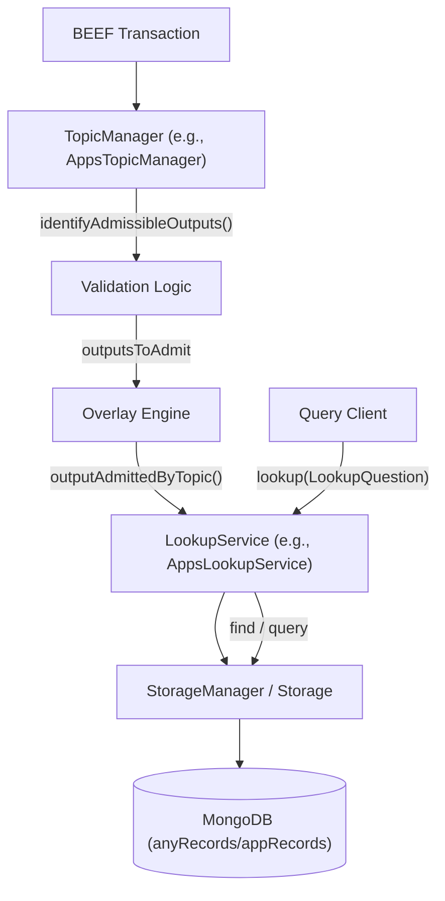
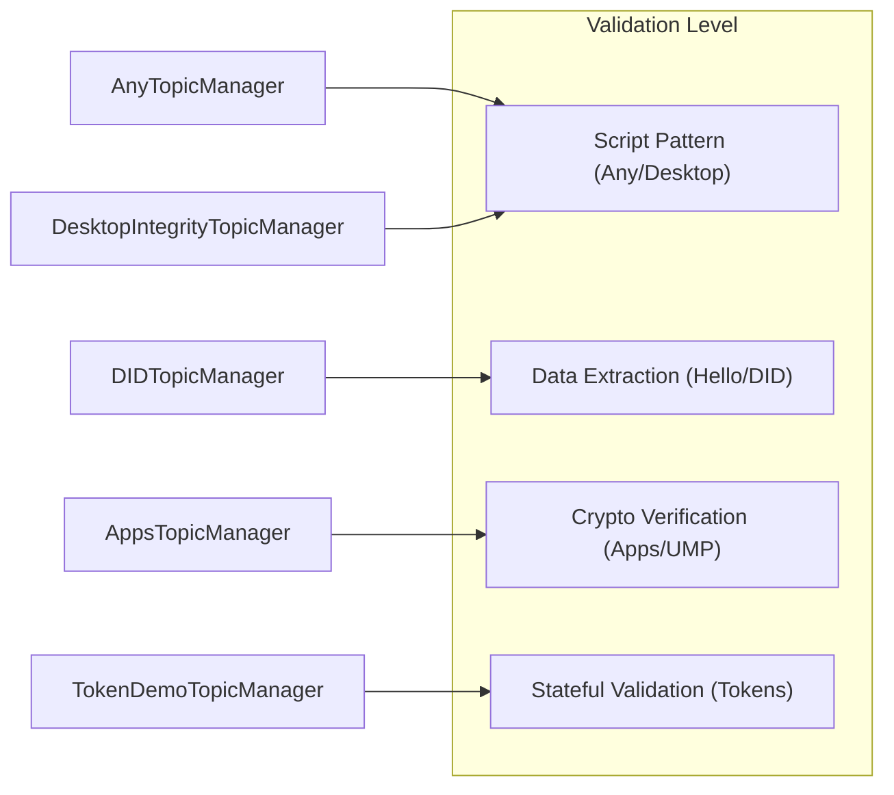

# Page: Canonical Topic Library (@bsv/overlay-topics)

# Canonical Topic Library (@bsv/overlay-topics)

<details>
<summary>Relevant source files</summary>

The following files were used as context for generating this wiki page:

- [packages/overlays/did-client/package.json](packages/overlays/did-client/package.json)
- [packages/overlays/topics/BASELINE.md](packages/overlays/topics/BASELINE.md)
- [packages/overlays/topics/jest.config.js](packages/overlays/topics/jest.config.js)
- [packages/overlays/topics/package.json](packages/overlays/topics/package.json)
- [packages/overlays/topics/src/__tests__/any.test.ts](packages/overlays/topics/src/__tests__/any.test.ts)
- [packages/overlays/topics/src/__tests__/apps.test.ts](packages/overlays/topics/src/__tests__/apps.test.ts)
- [packages/overlays/topics/src/__tests__/basketmap.test.ts](packages/overlays/topics/src/__tests__/basketmap.test.ts)
- [packages/overlays/topics/src/__tests__/certmap.test.ts](packages/overlays/topics/src/__tests__/certmap.test.ts)
- [packages/overlays/topics/src/__tests__/desktopintegrity.test.ts](packages/overlays/topics/src/__tests__/desktopintegrity.test.ts)
- [packages/overlays/topics/src/__tests__/did.test.ts](packages/overlays/topics/src/__tests__/did.test.ts)
- [packages/overlays/topics/src/__tests__/fractionalize.test.ts](packages/overlays/topics/src/__tests__/fractionalize.test.ts)
- [packages/overlays/topics/src/__tests__/hello.test.ts](packages/overlays/topics/src/__tests__/hello.test.ts)
- [packages/overlays/topics/src/__tests__/identity.test.ts](packages/overlays/topics/src/__tests__/identity.test.ts)
- [packages/overlays/topics/src/__tests__/kvstore.test.ts](packages/overlays/topics/src/__tests__/kvstore.test.ts)
- [packages/overlays/topics/src/__tests__/message-box.test.ts](packages/overlays/topics/src/__tests__/message-box.test.ts)
- [packages/overlays/topics/src/__tests__/monsterbattle.test.ts](packages/overlays/topics/src/__tests__/monsterbattle.test.ts)
- [packages/overlays/topics/src/__tests__/protomap.test.ts](packages/overlays/topics/src/__tests__/protomap.test.ts)
- [packages/overlays/topics/src/__tests__/slackthreads.test.ts](packages/overlays/topics/src/__tests__/slackthreads.test.ts)
- [packages/overlays/topics/src/__tests__/supplychain.test.ts](packages/overlays/topics/src/__tests__/supplychain.test.ts)
- [packages/overlays/topics/src/__tests__/uhrp.test.ts](packages/overlays/topics/src/__tests__/uhrp.test.ts)
- [packages/overlays/topics/src/__tests__/ump.test.ts](packages/overlays/topics/src/__tests__/ump.test.ts)
- [packages/overlays/topics/src/__tests__/utility-tokens.test.ts](packages/overlays/topics/src/__tests__/utility-tokens.test.ts)
- [packages/overlays/topics/src/__tests__/walletconfig.test.ts](packages/overlays/topics/src/__tests__/walletconfig.test.ts)
- [packages/overlays/topics/src/any/AnyLookupService.ts](packages/overlays/topics/src/any/AnyLookupService.ts)
- [packages/overlays/topics/src/any/AnyStorage.ts](packages/overlays/topics/src/any/AnyStorage.ts)
- [packages/overlays/topics/src/any/AnyTopicManager.ts](packages/overlays/topics/src/any/AnyTopicManager.ts)
- [packages/overlays/topics/src/any/types.ts](packages/overlays/topics/src/any/types.ts)
- [packages/overlays/topics/src/apps/AppsLookupService.ts](packages/overlays/topics/src/apps/AppsLookupService.ts)
- [packages/overlays/topics/src/apps/AppsStorageManager.ts](packages/overlays/topics/src/apps/AppsStorageManager.ts)
- [packages/overlays/topics/src/apps/AppsTopicManager.ts](packages/overlays/topics/src/apps/AppsTopicManager.ts)
- [packages/overlays/topics/src/apps/isTokenSignatureCorrectlyLinked.ts](packages/overlays/topics/src/apps/isTokenSignatureCorrectlyLinked.ts)
- [packages/overlays/topics/src/apps/types.ts](packages/overlays/topics/src/apps/types.ts)
- [packages/overlays/topics/src/basketmap/BasketMapLookupService.ts](packages/overlays/topics/src/basketmap/BasketMapLookupService.ts)
- [packages/overlays/topics/src/index.ts](packages/overlays/topics/src/index.ts)

</details>


The `@bsv/overlay-topics` package serves as the central repository for canonical topic definitions within the BSV Overlay Network ecosystem [packages/overlays/topics/BASELINE.md:1-4](). It provides 19 standardized topic pairs, each consisting of a `TopicManager` for transaction validation and admission, and a `LookupService` for querying the resulting data [packages/overlays/topics/BASELINE.md:27-47]().

This library implements the Tier-2 overlay infrastructure, ensuring that different overlay nodes can agree on the validity rules for specific application domains, such as identity, digital identifiers (DIDs), or token systems [packages/overlays/topics/BASELINE.md:3-4]().

## System Architecture

The package follows a strict architectural pattern where each topic is encapsulated into three primary components:
1.  **TopicManager (TM):** Responsible for parsing BEEF transactions and identifying which outputs meet the topic's specific script or data requirements [packages/overlays/topics/src/any/AnyTopicManager.ts:1-10]().
2.  **LookupService (LS):** Provides an interface for applications to query the data indexed from admitted outputs [packages/overlays/topics/src/any/AnyLookupService.ts:1-15]().
3.  **Storage/StorageManager:** Handles the persistence layer, typically using MongoDB, to store admitted records and metadata [packages/overlays/topics/src/any/AnyStorage.ts:1-10]().

### Data Flow and Entity Mapping

The following diagram illustrates how a transaction moves from raw BEEF format into a queryable state via the Topic Library components.

**Transaction Admission to Lookup Flow**

*Sources: [packages/overlays/topics/src/__tests__/any.test.ts:106-131](), [packages/overlays/topics/src/any/AnyTopicManager.ts:1-20]()*

## Canonical Topics Reference

The library provides the following 19 built-in topics. Each topic is identified by a unique ID for both its Manager and its Lookup Service [packages/overlays/topics/BASELINE.md:27-47]().

| Topic | TopicManager ID | LookupService ID | Validation Pattern |
| :--- | :--- | :--- | :--- |
| **any** | `tm_anytx` | `ls_anytx` | Admits every output from any valid transaction [packages/overlays/topics/src/__tests__/any.test.ts:4-5](). |
| **apps** | `tm_apps` | `ls_apps` | Validates Metanet App metadata signed by a publisher [packages/overlays/topics/src/__tests__/apps.test.ts:4-10](). |
| **did** | `tm_did` | `ls_did` | Validates BRC-42 DIDs (serialNumber + signature) [packages/overlays/topics/src/__tests__/did.test.ts:4-9](). |
| **identity** | `tm_identity` | `ls_identity` | Manages identity-services records [packages/overlays/topics/BASELINE.md:53](). |
| **kvstore** | `tm_kvstore` | `ls_kvstore` | Key-Value store with history/pagination [packages/overlays/topics/BASELINE.md:56](). |
| **uhrp** | `tm_uhrp` | `ls_uhrp` | Universal Hash Resolution Protocol records [packages/overlays/topics/BASELINE.md:44](). |
| **ump** | `tm_users` | `ls_users` | User Management Protocol (v3 token support) [packages/overlays/topics/src/__tests__/ump.test.ts:4-11](). |
| **hello** | `tm_helloworld` | `ls_helloworld` | PushDrop message (min 2 chars) + signature [packages/overlays/topics/src/__tests__/hello.test.ts:4-7](). |
| **utility-tokens** | `tm_tokendemo` | `ls_tokendemo` | PushDrop-based token minting and transfers [packages/overlays/topics/src/__tests__/utility-tokens.test.ts:4-9](). |

*Sources: [packages/overlays/topics/BASELINE.md:27-47](), [packages/overlays/topics/src/__tests__/any.test.ts:4-5](), [packages/overlays/topics/src/__tests__/apps.test.ts:4-10]()*

## Implementation Details

### TopicManager Pattern
Every TopicManager must implement `identifyAdmissibleOutputs`. For example, `DesktopIntegrityTopicManager` validates that an output is a bare data carrier (OP_FALSE OP_RETURN) [packages/overlays/topics/src/__tests__/desktopintegrity.test.ts:4-10]().

```typescript
// Conceptual logic for DesktopIntegrityTopicManager
// chunks.length === 2 && chunks[0].op === 0x00 && chunks[1].op === 0x6a
```
*Sources: [packages/overlays/topics/src/__tests__/desktopintegrity.test.ts:4-11]()*

### Validation Strategies

The library employs several validation strategies depending on the topic:

1.  **Simple Script Matching:** `DesktopIntegrity` checks for specific opcodes [packages/overlays/topics/src/__tests__/desktopintegrity.test.ts:44-49]().
2.  **PushDrop Decoding:** `DIDTopicManager` and `AppsTopicManager` use `PushDrop.decode` to extract fields and verify cryptographic signatures [packages/overlays/topics/src/__tests__/did.test.ts:4-7](), [packages/overlays/topics/src/__tests__/apps.test.ts:4-10]().
3.  **JSON Schema Validation:** `AppsTopicManager` parses a data field as JSON and ensures required fields (version, name, domain, etc.) are present [packages/overlays/topics/src/__tests__/apps.test.ts:7-9]().
4.  **Complex State Machines:** `TokenDemoTopicManager` (utility-tokens) tracks `tokenId` and ensures balance consistency for transfers, while allowing `___mint___` operations to bypass balance checks [packages/overlays/topics/src/__tests__/utility-tokens.test.ts:11-21]().

**Validation Complexity Mapping**

*Sources: [packages/overlays/topics/src/__tests__/any.test.ts:4-5](), [packages/overlays/topics/src/__tests__/apps.test.ts:4-10](), [packages/overlays/topics/src/__tests__/utility-tokens.test.ts:4-21]()*

### Storage and Lookup
Most lookup services utilize a `Storage` class that interacts with a MongoDB collection. For example, `AnyLookupService` uses `AnyStorage` to manage `anyRecords` [packages/overlays/topics/src/__tests__/any.test.ts:94-103]().

*   **outputAdmittedByTopic:** Triggered by the engine when a transaction is finalized. It persists the output data [packages/overlays/topics/src/__tests__/any.test.ts:116-117]().
*   **outputEvicted:** Handles reorganizations or double-spends by removing records [packages/overlays/topics/src/__tests__/any.test.ts:172]().
*   **lookup:** Executes queries against the underlying MongoDB collection based on a `LookupQuestion` [packages/overlays/topics/src/__tests__/any.test.ts:118-122]().

## Integration and Testing
The package includes an extensive test suite using `mongodb-memory-server` to verify that each `LookupService` correctly indexes and retrieves data [packages/overlays/topics/src/__tests__/any.test.ts:9-10](), [packages/overlays/topics/src/__tests__/hello.test.ts:18-19]().

*   **Test Suites:** 19 passing suites covering all canonical topic pairs [packages/overlays/topics/BASELINE.md:13]().
*   **Coverage:** Includes TopicManager admission rules and LookupService query logic [packages/overlays/topics/BASELINE.md:17-23]().

*Sources: [packages/overlays/topics/package.json:20-32](), [packages/overlays/topics/BASELINE.md:13-23]()*

---