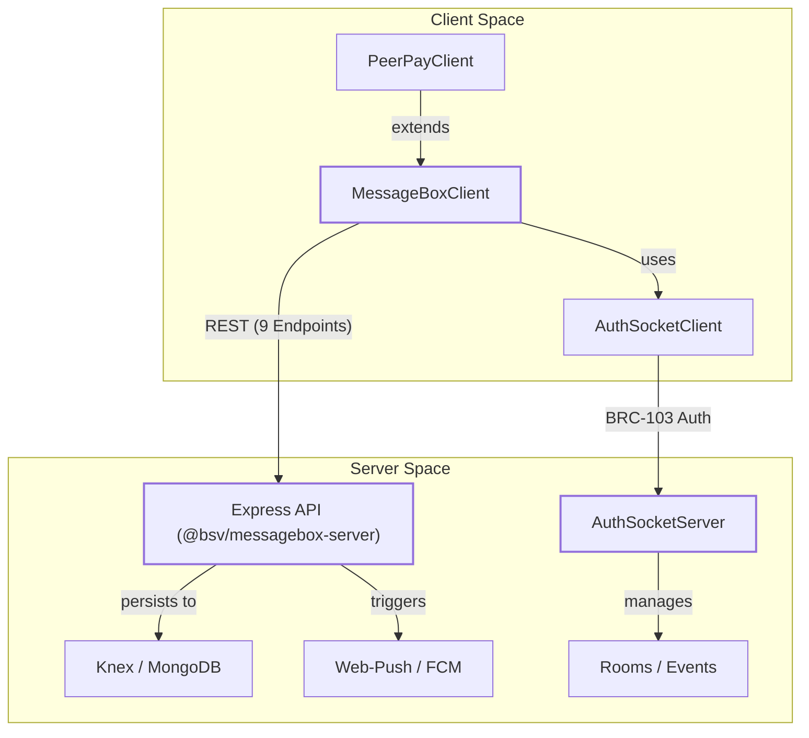
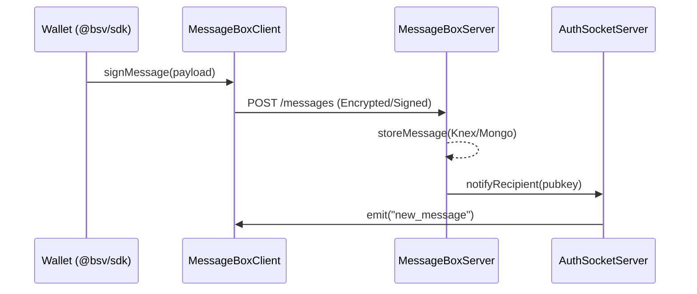

# Page: Messaging Layer

# Messaging Layer

Relevant source files

The following files were used as context for generating this wiki page:

- [.editorconfig](.editorconfig)
- [.npmrc](.npmrc)
- [conformance/vectors/README.md](conformance/vectors/README.md)
- [packages/messaging/authsocket-client/package.json](packages/messaging/authsocket-client/package.json)
- [packages/messaging/authsocket/package.json](packages/messaging/authsocket/package.json)
- [packages/messaging/message-box-client/package.json](packages/messaging/message-box-client/package.json)
- [packages/messaging/message-box-server/package.json](packages/messaging/message-box-server/package.json)
- [packages/messaging/messagebox-services/backend/package.json](packages/messaging/messagebox-services/backend/package.json)
- [packages/middleware/auth-express-middleware/package.json](packages/middleware/auth-express-middleware/package.json)
- [packages/middleware/payment-express-middleware/package.json](packages/middleware/payment-express-middleware/package.json)
- [packages/wallet/btms/package.json](packages/wallet/btms/package.json)

The Messaging Layer provides the infrastructure for secure, peer-to-peer communication and store-and-forward message delivery within the BSV ecosystem. It consists of the **MessageBox** system for asynchronous delivery and **AuthSocket** for real-time, mutually authenticated communication.

## System Overview

The messaging domain is divided into client-side SDKs, server-side implementations, and deployment-ready services. These components facilitate BRC-103 authenticated handshakes and encrypted message exchange between users, wallets, and overlay services.

### Messaging Domain Components

| Component | Package | Role |
|-----------|---------|------|
| **MessageBox Client** | `@bsv/message-box-client` | Client SDK for interacting with MessageBox servers and PeerPay. |
| **MessageBox Server** | `@bsv/messagebox-server` | Express-based server providing store-and-forward logic and notifications. |
| **AuthSocket Server** | `@bsv/authsocket` | Server-side implementation of mutually authenticated WebSockets. |
| **AuthSocket Client** | `@bsv/authsocket-client` | Client-side implementation for real-time authenticated events. |
| **Backend Service** | `messagebox-services/backend` | Reference deployment for application-specific messaging logic. |

### Messaging Architecture

The following diagram illustrates the relationship between the core messaging entities and their implementation in the codebase.

**Diagram: Messaging Entity Mapping**

Sources: [`packages/messaging/message-box-client/package.json:2-87`](), [`packages/messaging/message-box-server/package.json:2-80`](), [`packages/messaging/authsocket/package.json:2-59`]()

---

## MessageBox: Store-and-Forward System

MessageBox is a reliable messaging system designed for scenarios where the recipient may be offline. It follows a "mailbox" metaphor where messages are stored on a server until retrieved by the authenticated owner.

### MessageBox Client & Server
The `@bsv/message-box-client` provides the `MessageBoxClient` class for interacting with the 9 standard REST endpoints defined in the message-box specification [`packages/messaging/message-box-client/package.json:15-15`](). It includes `PeerPayClient` for handling payment-related messaging workflows.

The `@bsv/messagebox-server` is a reference implementation using Express [`packages/messaging/message-box-server/package.json:71-71`](). It supports multiple persistence layers via Knex (SQL) or MongoDB [`packages/messaging/message-box-server/package.json:73-74`]() and integrates Firebase Cloud Messaging (FCM) or Web-Push for real-time notifications to mobile or web clients [`packages/messaging/message-box-server/package.json:72-79`]().

For details, see [MessageBox Client & Server](#5.1).

---

## AuthSocket: Authenticated WebSockets

AuthSocket implements the BRC-103 protocol over Socket.IO to provide a mutually authenticated, real-time communication channel.

### Mutual Authentication
Unlike standard WebSockets, AuthSocket requires both the client and server to prove possession of private keys during the connection handshake. This is handled by the `AuthSocketServer` in `@bsv/authsocket` [`packages/messaging/authsocket/package.json:7-7`]() and the corresponding client in `@bsv/authsocket-client` [`packages/messaging/authsocket-client/package.json:7-7`]().

### Event Exchange
Once authenticated, the protocol allows for:
- **Room Management**: Organizing connections into secure groups.
- **Signed Events**: Every event exchanged can be cryptographically verified using the `@bsv/sdk` primitives [`packages/messaging/authsocket/package.json:57-57`]().
- **Integration**: Works seamlessly with the BRC-31 handshake for initial session establishment.

For details, see [AuthSocket: Authenticated WebSocket Protocol](#5.2).

---

## Integration and Deployment

The `messagebox-services` directory contains reference implementations for deploying these messaging components in production environments.

**Diagram: Messaging Interaction Flow**

Sources: [`packages/messaging/messagebox-services/backend/package.json:47-51`]()

### Backend Services
The `@bsv/backend` package within `messagebox-services` acts as a coordinator, integrating the messaging layer with the `@bsv/overlay` services [`packages/messaging/messagebox-services/backend/package.json:47-47`](). It utilizes Knex for relational data management and the BSV SDK for signature verification [`packages/messaging/messagebox-services/backend/package.json:48-49`]().

Sources: [`packages/messaging/messagebox-services/backend/package.json:2-51`]()

---