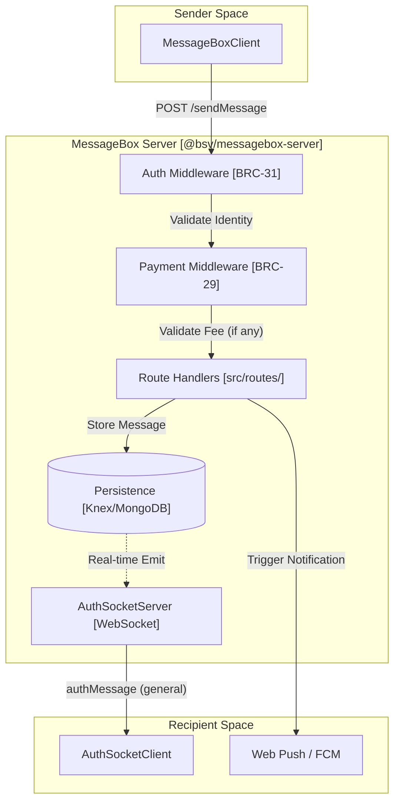
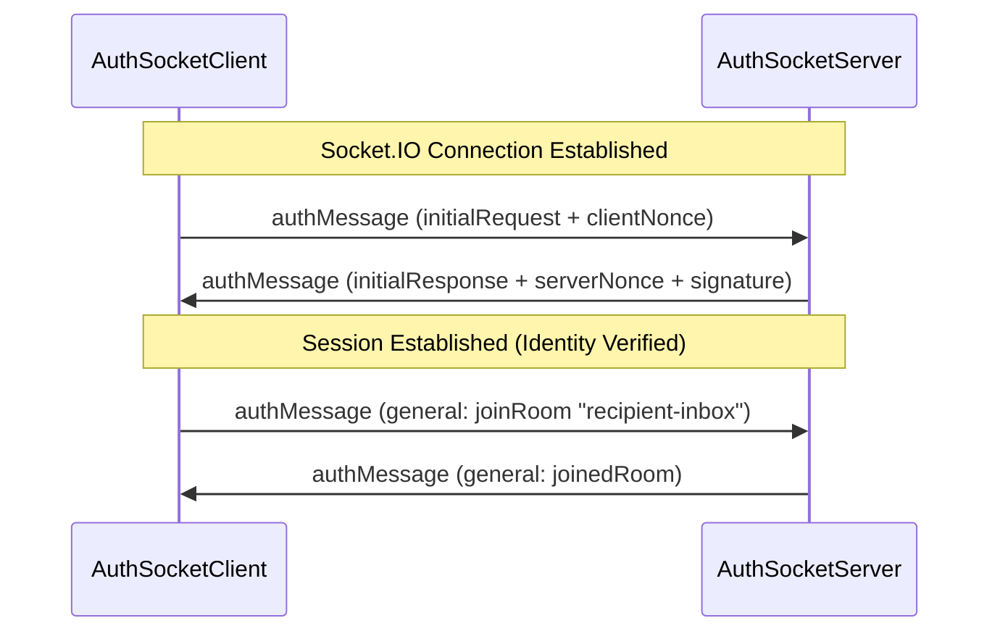

# Page: MessageBox Client & Server

# MessageBox Client & Server

<details>
<summary>Relevant source files</summary>

The following files were used as context for generating this wiki page:

- [.editorconfig](https://github.com/bsv-blockchain/ts-stack/blob/main/.editorconfig)
- [.npmrc](https://github.com/bsv-blockchain/ts-stack/blob/main/.npmrc)
- [conformance/vectors/README.md](https://github.com/bsv-blockchain/ts-stack/blob/main/conformance/vectors/README.md)
- [packages/messaging/authsocket-client/package.json](https://github.com/bsv-blockchain/ts-stack/blob/main/packages/messaging/authsocket-client/package.json)
- [packages/messaging/authsocket/package.json](https://github.com/bsv-blockchain/ts-stack/blob/main/packages/messaging/authsocket/package.json)
- [packages/messaging/message-box-client/package.json](https://github.com/bsv-blockchain/ts-stack/blob/main/packages/messaging/message-box-client/package.json)
- [packages/messaging/message-box-server/package.json](https://github.com/bsv-blockchain/ts-stack/blob/main/packages/messaging/message-box-server/package.json)
- [packages/messaging/messagebox-services/backend/package.json](https://github.com/bsv-blockchain/ts-stack/blob/main/packages/messaging/messagebox-services/backend/package.json)
- [packages/middleware/auth-express-middleware/package.json](https://github.com/bsv-blockchain/ts-stack/blob/main/packages/middleware/auth-express-middleware/package.json)
- [packages/middleware/payment-express-middleware/package.json](https://github.com/bsv-blockchain/ts-stack/blob/main/packages/middleware/payment-express-middleware/package.json)
- [packages/wallet/btms/package.json](https://github.com/bsv-blockchain/ts-stack/blob/main/packages/wallet/btms/package.json)
- [specs/EXCEPTIONS.md](https://github.com/bsv-blockchain/ts-stack/blob/main/specs/EXCEPTIONS.md)
- [specs/README.md](https://github.com/bsv-blockchain/ts-stack/blob/main/specs/README.md)
- [specs/auth/brc31-handshake.yaml](https://github.com/bsv-blockchain/ts-stack/blob/main/specs/auth/brc31-handshake.yaml)
- [specs/messaging/authsocket-asyncapi.yaml](https://github.com/bsv-blockchain/ts-stack/blob/main/specs/messaging/authsocket-asyncapi.yaml)
- [specs/messaging/message-box-http.yaml](https://github.com/bsv-blockchain/ts-stack/blob/main/specs/messaging/message-box-http.yaml)

</details>


The MessageBox system provides a store-and-forward messaging architecture for the BSV ecosystem. It enables asynchronous communication between users (via identity keys) and applications, supporting message delivery, push notifications, and integrated peer payments. The system is composed of the `@bsv/message-box-client` for application integration and `@bsv/messagebox-server` for the backend infrastructure.

## System Architecture

The MessageBox architecture relies on BRC-31 mutual authentication for all interactions. Clients connect to the server via REST for management and message retrieval, or via WebSockets (AuthSocket) for real-time delivery.

### Code-to-Entity Mapping: Messaging Components
The following diagram maps high-level messaging concepts to their specific implementations in the codebase.

| Concept | Code Entity | Package |
| --- | --- | --- |
| **Client API** | `MessageBoxClient` | `@bsv/message-box-client` |
| **Peer Payments** | `PeerPayClient` | `@bsv/message-box-client` |
| **WebSocket Server** | `AuthSocketServer` | `@bsv/authsocket` |
| **REST API Server** | `Express` app in `src/index.ts` | `@bsv/messagebox-server` |
| **Auth Middleware** | `createAuthMiddleware` | `@bsv/auth-express-middleware` |
| **Payment Validation** | `paymentMiddleware` | `@bsv/payment-express-middleware` |

### Data Flow Overview
This diagram illustrates the flow of a message from a sender to a recipient through the MessageBox Server.


Sources: [specs/messaging/message-box-http.yaml:7-13](https://github.com/bsv-blockchain/ts-stack/blob/main/specs/messaging/message-box-http.yaml#L7-L13), [packages/messaging/message-box-server/package.json:64-68](https://github.com/bsv-blockchain/ts-stack/blob/main/packages/messaging/message-box-server/package.json#L64-L68), [specs/messaging/authsocket-asyncapi.yaml:19-27](https://github.com/bsv-blockchain/ts-stack/blob/main/specs/messaging/authsocket-asyncapi.yaml#L19-L27)

---

## MessageBox Server

The `@bsv/messagebox-server` is an Express-based implementation of the MessageBox specification. It manages message persistence, recipient discovery, and notification dispatch.

### REST Endpoints
The server implements 9 core REST endpoints defined in the specification [specs/messaging/message-box-http.yaml:73-73](https://github.com/bsv-blockchain/ts-stack/blob/main/specs/messaging/message-box-http.yaml#L73-L73).

| Method | Endpoint | Description |
| --- | --- | --- |
| `POST` | `/sendMessage` | Sends a message to one or more recipients. Supports optional BEEF payments [specs/messaging/message-box-http.yaml:91-138](https://github.com/bsv-blockchain/ts-stack/blob/main/specs/messaging/message-box-http.yaml#L91-L138). |
| `GET` | `/listMessages` | Retrieves a list of messages for the authenticated user, filtered by `messageBox`. |
| `POST` | `/acknowledgeMessages` | Marks messages as read/received so they are no longer returned in `listMessages`. |
| `GET` | `/listMessageBoxes` | Lists all active message boxes (e.g., `payment_inbox`) for the user. |
| `POST` | `/registerPushNotification` | Registers a Web-Push or FCM token for the authenticated identity. |
| `GET` | `/getNotificationsStatus` | Checks if notifications are enabled for the current user. |
| `POST` | `/setNotificationsStatus` | Enables or disables notifications. |
| `GET` | `/getRecipientReceipt` | (Admin/Internal) Retrieves proof of delivery for a message. |
| `GET` | `/getRecipientRequest` | (Admin/Internal) Retrieves the original request metadata. |

### Persistence & Notifications
The server supports multiple persistence layers via Knex (SQL) or MongoDB [packages/messaging/message-box-server/package.json:73-75](https://github.com/bsv-blockchain/ts-stack/blob/main/packages/messaging/message-box-server/package.json#L73-L75).
- **Knex:** Used for structured message storage and metadata.
- **MongoDB:** Supported for high-volume message bodies.
- **Notifications:** Integrated with `web-push` for browser notifications and `firebase-admin` (FCM) for mobile push [packages/messaging/message-box-server/package.json:72-79](https://github.com/bsv-blockchain/ts-stack/blob/main/packages/messaging/message-box-server/package.json#L72-L79).

Sources: [packages/messaging/message-box-server/package.json:69-80](https://github.com/bsv-blockchain/ts-stack/blob/main/packages/messaging/message-box-server/package.json#L69-L80), [specs/messaging/message-box-http.yaml:15-16](https://github.com/bsv-blockchain/ts-stack/blob/main/specs/messaging/message-box-http.yaml#L15-L16)

---

## AuthSocket: Real-time Messaging

Real-time delivery is handled by the `@bsv/authsocket` protocol, which layers BRC-103 mutual authentication over Socket.IO [specs/messaging/authsocket-asyncapi.yaml:7-15](https://github.com/bsv-blockchain/ts-stack/blob/main/specs/messaging/authsocket-asyncapi.yaml#L7-L15).

### Connection Handshake
Every WebSocket connection must complete a BRC-31 handshake before application events can be exchanged. This is performed via the `authMessage` event [specs/messaging/authsocket-asyncapi.yaml:19-22](https://github.com/bsv-blockchain/ts-stack/blob/main/specs/messaging/authsocket-asyncapi.yaml#L19-L22).


Sources: [specs/auth/brc31-handshake.yaml:24-51](https://github.com/bsv-blockchain/ts-stack/blob/main/specs/auth/brc31-handshake.yaml#L24-L51), [specs/messaging/authsocket-asyncapi.yaml:152-165](https://github.com/bsv-blockchain/ts-stack/blob/main/specs/messaging/authsocket-asyncapi.yaml#L152-L165)

### Key Classes
- `AuthSocketServer`: Wraps the Socket.IO server and manages authenticated rooms [specs/messaging/authsocket-asyncapi.yaml:7-8](https://github.com/bsv-blockchain/ts-stack/blob/main/specs/messaging/authsocket-asyncapi.yaml#L7-L8).
- `SocketServerTransport`: Implements the `Transport` interface from `@bsv/sdk` to handle signing and verification of WebSocket payloads [specs/messaging/authsocket-asyncapi.yaml:38-39](https://github.com/bsv-blockchain/ts-stack/blob/main/specs/messaging/authsocket-asyncapi.yaml#L38-L39).

---

## MessageBox Client

The `@bsv/message-box-client` provides high-level abstractions for interacting with the server.

### MessageBoxClient
The primary class for standard messaging. It handles:
- **Authentication:** Automatically attaches BRC-31 headers using the provided `KeyDeriver`.
- **Message Management:** Methods for `sendMessage`, `listMessages`, and `acknowledgeMessages`.
- **Push Registration:** Simplifies the exchange of VAPID keys and subscription tokens.

### PeerPayClient
A specialized client for BRC-29 peer payments. It facilitates the delivery of BEEF transactions to a recipient's `payment_inbox` while ensuring the sender satisfies any required `recipientFee` [specs/messaging/message-box-http.yaml:184-190](https://github.com/bsv-blockchain/ts-stack/blob/main/specs/messaging/message-box-http.yaml#L184-L190).

Sources: [packages/messaging/message-box-client/package.json:2-5](https://github.com/bsv-blockchain/ts-stack/blob/main/packages/messaging/message-box-client/package.json#L2-L5), [specs/messaging/message-box-http.yaml:139-183](https://github.com/bsv-blockchain/ts-stack/blob/main/specs/messaging/message-box-http.yaml#L139-L183)

---

## Implementation Details

### Message Envelope
Messages are stored and transmitted using a standard `MessageObject` [specs/messaging/message-box-http.yaml:91-98](https://github.com/bsv-blockchain/ts-stack/blob/main/specs/messaging/message-box-http.yaml#L91-L98).

```typescript
interface MessageObject {
  recipient: string | string[]; // Identity Key(s)
  messageBox: string;           // e.g., "payment_inbox"
  messageId: string | string[]; // Unique identifier (HMAC)
  body: string | object;        // Encrypted or plaintext payload
}
```

### Payment Integration (BRC-29)
When a message requires a payment (delivery fee), the `Payment` object is attached to the request. The `payment-express-middleware` validates that the BEEF transaction in the `tx` field contains the correct outputs and satisfies the required amount [specs/messaging/message-box-http.yaml:184-205](https://github.com/bsv-blockchain/ts-stack/blob/main/specs/messaging/message-box-http.yaml#L184-L205).

Sources: [specs/messaging/message-box-http.yaml:91-138](https://github.com/bsv-blockchain/ts-stack/blob/main/specs/messaging/message-box-http.yaml#L91-L138), [packages/messaging/message-box-server/package.json:66-66](https://github.com/bsv-blockchain/ts-stack/blob/main/packages/messaging/message-box-server/package.json#L66-L66)

---