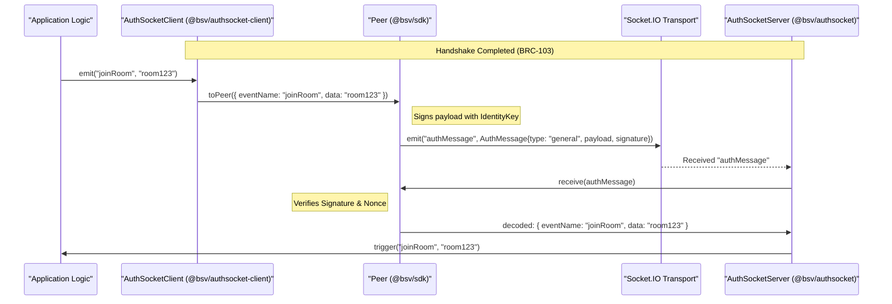
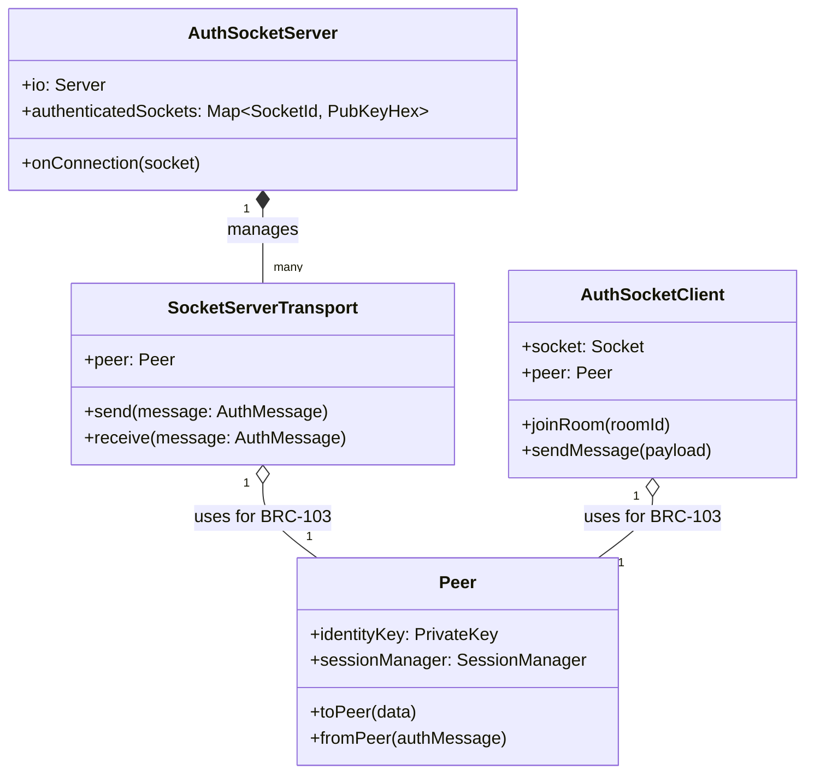

# Page: AuthSocket: Authenticated WebSocket Protocol

# AuthSocket: Authenticated WebSocket Protocol

Relevant source files

The following files were used as context for generating this wiki page:

- [packages/helpers/amountinator/BASELINE.md](packages/helpers/amountinator/BASELINE.md)
- [packages/helpers/bsv-wallet-helper/BASELINE.md](packages/helpers/bsv-wallet-helper/BASELINE.md)
- [packages/helpers/simple/BASELINE.md](packages/helpers/simple/BASELINE.md)
- [packages/helpers/ts-paymail/BASELINE.md](packages/helpers/ts-paymail/BASELINE.md)
- [packages/messaging/authsocket-client/BASELINE.md](packages/messaging/authsocket-client/BASELINE.md)
- [packages/messaging/authsocket-client/package.json](packages/messaging/authsocket-client/package.json)
- [packages/messaging/authsocket/BASELINE.md](packages/messaging/authsocket/BASELINE.md)
- [packages/messaging/authsocket/package.json](packages/messaging/authsocket/package.json)
- [packages/messaging/message-box-client/BASELINE.md](packages/messaging/message-box-client/BASELINE.md)
- [packages/messaging/message-box-client/package.json](packages/messaging/message-box-client/package.json)
- [packages/messaging/messagebox-services/backend/package.json](packages/messaging/messagebox-services/backend/package.json)
- [packages/middleware/auth-express-middleware/package.json](packages/middleware/auth-express-middleware/package.json)
- [packages/middleware/payment-express-middleware/package.json](packages/middleware/payment-express-middleware/package.json)
- [specs/EXCEPTIONS.md](specs/EXCEPTIONS.md)
- [specs/README.md](specs/README.md)
- [specs/auth/brc31-handshake.yaml](specs/auth/brc31-handshake.yaml)
- [specs/messaging/authsocket-asyncapi.yaml](specs/messaging/authsocket-asyncapi.yaml)
- [specs/messaging/message-box-http.yaml](specs/messaging/message-box-http.yaml)

AuthSocket is a specialized WebSocket protocol implementation that provides **BRC-103 mutual authentication** over Socket.IO. It is designed to facilitate secure, identity-verified event exchange between peers, primarily used by the MessageBox system for real-time notifications and message delivery.

The protocol ensures that every connection is tied to a verified secp256k1 public key, and every application-level event is cryptographically signed by the sender and verified by the recipient.

## Protocol Architecture

AuthSocket operates as a layered protocol where the BRC-103 handshake and signing logic sit between the Socket.IO transport and the application logic.

### Layered Structure
1.  **Transport Layer**: Standard Socket.IO (over Engine.io) providing the raw event-emitting interface [specs/messaging/authsocket-asyncapi.yaml:10-15]().
2.  **Authentication Layer (BRC-103)**: Implemented via the `Peer` and `SessionManager` classes from `@bsv/sdk`. This layer handles the two-phase handshake and message signing/verification [specs/auth/brc31-handshake.yaml:18-22]().
3.  **Envelope Layer**: A JSON wrapper `{ eventName, data }` that is serialized into the BRC-103 `general` message payload [specs/messaging/authsocket-asyncapi.yaml:110-116]().
4.  **Application Layer**: The high-level events like `joinRoom`, `sendMessage`, and `message` [specs/messaging/authsocket-asyncapi.yaml:28-34]().

### Data Flow: Secure Event Exchange

The following diagram illustrates the flow from a client emitting an event to a server receiving it through the authenticated stack.

**AuthSocket Event Pipeline**

Sources: [specs/messaging/authsocket-asyncapi.yaml:17-34](), [specs/auth/brc31-handshake.yaml:52-62]()

---

## Handshake and Session Management

AuthSocket uses the **BRC-31 Handshake** (a subset of BRC-103) to establish a secure session.

### Phase 1: Handshake
Before any application data can flow, the peers must exchange `initialRequest` and `initialResponse` messages [specs/auth/brc31-handshake.yaml:24-27]().
-   **Client**: Generates a fresh nonce, signs it with its identity key, and sends it via the `authMessage` event [specs/auth/brc31-handshake.yaml:29-31]().
-   **Server**: Validates the client's signature, generates its own nonce, signs the response, and returns an `initialResponse` [specs/auth/brc31-handshake.yaml:39-41]().

### Phase 2: Authenticated State
Once authenticated, the server maintains an internal mapping of `socket.id` to the verified `identityKey`.
-   **Nonces**: Every message includes a fresh `nonce` and echoes the peer's `yourNonce` to prevent replay attacks [specs/auth/brc31-handshake.yaml:58-61]().
-   **Signatures**: The `payload` field in a `general` message contains the serialized application event, signed by the sender's identity key [specs/messaging/authsocket-asyncapi.yaml:95-104]().

**Entity Mapping: AuthSocket Components**

Sources: [packages/messaging/authsocket/src/AuthSocketServer.ts:37-39](), [packages/messaging/authsocket/src/SocketServerTransport.ts:12-13](), [specs/auth/brc31-handshake.yaml:12-15]()

---

## Room Management and Events

The `AuthSocketServer` provides room-based messaging, typically used to segregate messages by recipient and box type.

### Room Naming Convention
Rooms are identified by the string format: `<recipientKey>-<messageBoxType>` [specs/messaging/authsocket-asyncapi.yaml:156-157]().
Example: `028d37b9...-payment_inbox`

### Core Events
| Event Name | Direction | Payload | Description |
| :--- | :--- | :--- | :--- |
| `joinRoom` | Client -> Server | `string` (Room ID) | Subscribes the socket to a specific message box [specs/messaging/authsocket-asyncapi.yaml:152-157](). |
| `leaveRoom` | Client -> Server | `string` (Room ID) | Unsubscribes from a message box [specs/messaging/authsocket-asyncapi.yaml:173-175](). |
| `sendMessage` | Client -> Server | `WsSendMessagePayload` | Sends a message to a specific room [specs/messaging/authsocket-asyncapi.yaml:192-196](). |
| `message` | Server -> Client | `WsMessagePayload` | Delivered to clients joined in the target room [specs/messaging/authsocket-asyncapi.yaml:220-222](). |

### Message Routing Logic
When a client sends a message via `sendMessage`:
1.  The server verifies the sender's identity via the authenticated socket [specs/messaging/authsocket-asyncapi.yaml:201-203]().
2.  The server extracts the `messageBoxType` from the `roomId` [specs/messaging/authsocket-asyncapi.yaml:201-202]().
3.  The message is broadcast to all sockets currently joined in that `roomId` [specs/messaging/authsocket-asyncapi.yaml:220-222]().

---

## Integration with MessageBox

AuthSocket is the primary real-time transport for `@bsv/message-box-client`. While the MessageBox Server provides REST endpoints for historical message retrieval and persistence, AuthSocket provides the "push" mechanism for incoming payments and notifications.

### Implementation Packages
-   **`@bsv/authsocket`**: Server-side implementation. Wraps `socket.io` and provides the `AuthSocketServer` class [packages/messaging/authsocket/package.json:2-7]().
-   **`@bsv/authsocket-client`**: Client-side implementation. Wraps `socket.io-client` and handles the automated BRC-103 handshake [packages/messaging/authsocket-client/package.json:2-7]().

### Configuration
The server typically listens on port `5001` (default) and shares the same HTTP server as the MessageBox REST API [specs/messaging/authsocket-asyncapi.yaml:54-55]().

Sources:
- [specs/messaging/authsocket-asyncapi.yaml:1-222]()
- [specs/auth/brc31-handshake.yaml:1-101]()
- [packages/messaging/authsocket/package.json:1-76]()
- [packages/messaging/authsocket-client/package.json:1-72]()

---