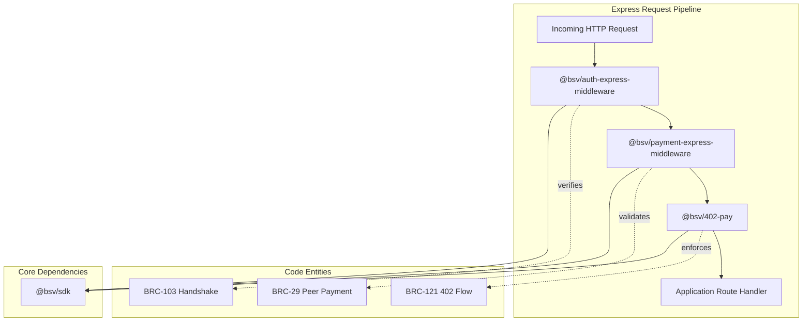
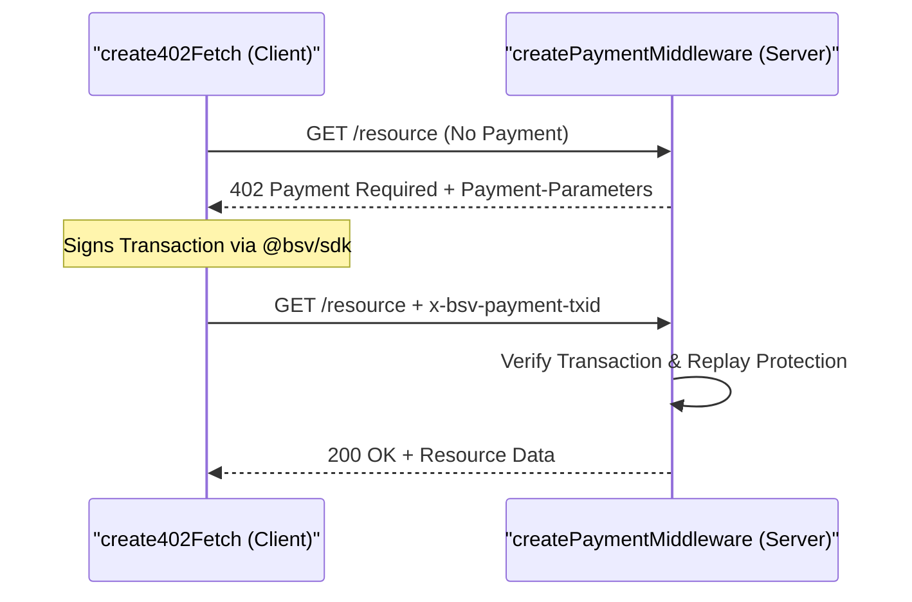

# Page: Middleware

# Middleware

Relevant source files

The following files were used as context for generating this wiki page:

- [packages/messaging/authsocket-client/package.json](packages/messaging/authsocket-client/package.json)
- [packages/messaging/authsocket/package.json](packages/messaging/authsocket/package.json)
- [packages/messaging/message-box-client/package.json](packages/messaging/message-box-client/package.json)
- [packages/messaging/messagebox-services/backend/package.json](packages/messaging/messagebox-services/backend/package.json)
- [packages/middleware/402-pay/package.json](packages/middleware/402-pay/package.json)
- [packages/middleware/auth-express-middleware/package.json](packages/middleware/auth-express-middleware/package.json)
- [packages/middleware/payment-express-middleware/package.json](packages/middleware/payment-express-middleware/package.json)

The **Middleware** layer provides a set of Express-compatible packages designed to handle Bitcoin SV-specific networking concerns. These packages implement standardized BRC protocols for mutual authentication, peer-to-peer payment validation, and HTTP-native micropayments. By abstracting these protocols into middleware, developers can secure and monetize their APIs using BSV primitives without manually implementing the underlying handshake or validation logic.

### Middleware Overview

The middleware domain is divided into three primary functional areas:
1.  **Identity & Auth**: Mutual authentication using BRC-103/104.
2.  **P2P Payments**: Validation of BRC-29 peer-to-peer transaction delivery.
3.  **Micropayments**: Native HTTP `402 Payment Required` workflows via BRC-121.

### Relationship Between Middleware Packages

The following diagram illustrates how the middleware packages sit between the raw Express request and the application logic, leveraging the `@bsv/sdk` for cryptographic operations.

**Middleware Code Entity Map**

Sources: [packages/middleware/auth-express-middleware/package.json:66-68](), [packages/middleware/payment-express-middleware/package.json:60-62](), [packages/middleware/402-pay/package.json:46-48]()

---

### Auth & Payment Middleware (BRC-103 & BRC-29)

The `@bsv/auth-express-middleware` package implements the **BRC-103** mutual authentication protocol. It allows servers to verify the identity of a client (and vice versa) through a cryptographic handshake, populating the request object with authenticated user information via `x-bsv-auth-*` headers.

Complementing this, `@bsv/payment-express-middleware` implements **BRC-29**, which facilitates the validation of peer-to-peer payments sent directly to the service provider. This is commonly used in environments where a user must prove they have paid for a specific action or resource before the request is processed.

**Key Features:**
- **Mutual Auth**: Secure session establishment without passwords.
- **Certificate Exchange**: Support for BRC-104 selective disclosure of identity attributes.
- **Payment Validation**: Real-time checking of BEEF or transaction data against service requirements.

For details, see [Auth & Payment Express Middleware](#6.1).

Sources: [packages/middleware/auth-express-middleware/package.json:4-4](), [packages/middleware/payment-express-middleware/package.json:4-4]()

---

### 402-Pay: HTTP Micropayments (BRC-121)

The `@bsv/402-pay` package provides a specialized implementation of the **BRC-121** protocol. It leverages the standard HTTP `402 Payment Required` status code to create a seamless micropayment experience for web services.

This package includes both server-side middleware and a client-side fetch wrapper. The server can reject requests that lack a valid payment, providing the client with the necessary parameters (amount, script, etc.) to fulfill the payment and retry the request automatically.

**Middleware Flow:**

**Key Features:**
- **Replay Protection**: Uses timestamp freshness and `txid` tracking to prevent double-processing of payments.
- **Client Wrapper**: `create402Fetch` handles the 402-retry logic transparently for the user.
- **Statelessness**: Designed to work across distributed systems using standard HTTP headers.

For details, see [402-Pay: HTTP Micropayment Middleware (BRC-121)](#6.2).

Sources: [packages/middleware/402-pay/package.json:4-4](), [packages/middleware/402-pay/package.json:13-20]()

---

### Summary Table

| Package | Protocol | Purpose | Primary Export |
| :--- | :--- | :--- | :--- |
| `@bsv/auth-express-middleware` | BRC-103 | Mutual Authentication | `authMiddleware` |
| `@bsv/payment-express-middleware` | BRC-29 | Peer Payment Validation | `paymentMiddleware` |
| `@bsv/402-pay` | BRC-121 | HTTP Micropayments | `createPaymentMiddleware` |

Sources: [packages/middleware/auth-express-middleware/package.json:2-4](), [packages/middleware/payment-express-middleware/package.json:2-4](), [packages/middleware/402-pay/package.json:2-4]()

---