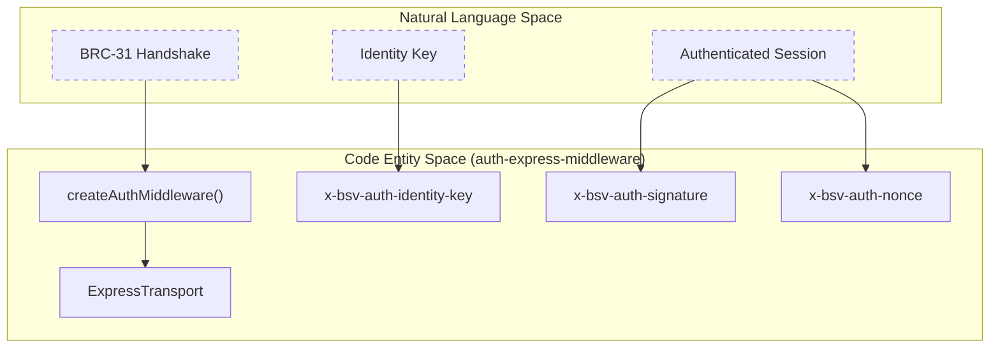
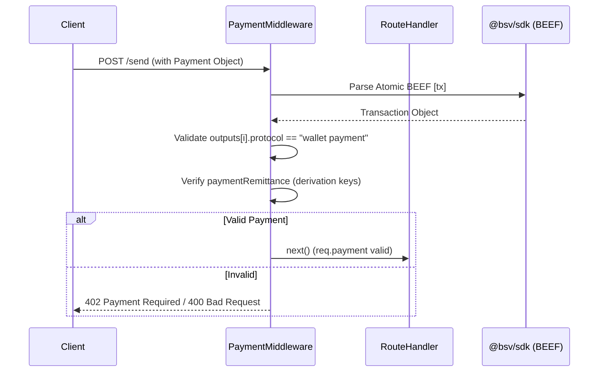

# Page: Auth & Payment Express Middleware

# Auth & Payment Express Middleware

Relevant source files

The following files were used as context for generating this wiki page:

- [packages/middleware/402-pay/package.json](https://github.com/bsv-blockchain/ts-stack/blob/main/packages/middleware/402-pay/package.json)
- [specs/EXCEPTIONS.md](https://github.com/bsv-blockchain/ts-stack/blob/main/specs/EXCEPTIONS.md)
- [specs/README.md](https://github.com/bsv-blockchain/ts-stack/blob/main/specs/README.md)
- [specs/auth/brc31-handshake.yaml](https://github.com/bsv-blockchain/ts-stack/blob/main/specs/auth/brc31-handshake.yaml)
- [specs/messaging/authsocket-asyncapi.yaml](https://github.com/bsv-blockchain/ts-stack/blob/main/specs/messaging/authsocket-asyncapi.yaml)
- [specs/messaging/message-box-http.yaml](https://github.com/bsv-blockchain/ts-stack/blob/main/specs/messaging/message-box-http.yaml)

This section documents the two primary Express middleware packages used for secure communication and peer-to-peer payments within the BSV ecosystem: `@bsv/auth-express-middleware` and `@bsv/payment-express-middleware`. These packages implement the BRC-103 (Mutual Authentication) and BRC-29 (Peer-to-Peer Payment) standards, respectively.

## Auth Middleware (@bsv/auth-express-middleware)

The auth middleware implements **BRC-103**, a protocol for mutual authentication between a client and a server using ECDSA signatures. It establishes a forward-secret session without relying on traditional Certificate Authorities (CAs).

### Protocol Flow (BRC-31 / BRC-103)

The authentication process consists of two phases: an initial handshake to establish session keys and a general phase for authenticated application requests.

1.  **Phase 1: Initial Handshake**: The client calls `POST /.well-known/auth`.
    *   **Client Request**: Sends an `initialRequest` containing a fresh nonce signed by the client's identity key [specs/auth/brc31-handshake.yaml:29-37](https://github.com/bsv-blockchain/ts-stack/blob/main/specs/auth/brc31-handshake.yaml#L29-L37).
    *   **Server Response**: Validates the client, generates its own nonce, signs the response, and returns an `initialResponse`. It may also include a `requestedCertificates` field for BRC-52 selective disclosure [specs/auth/brc31-handshake.yaml:39-50](https://github.com/bsv-blockchain/ts-stack/blob/main/specs/auth/brc31-handshake.yaml#L39-L50).
2.  **Phase 2: Authenticated Requests**: Subsequent requests carry `x-bsv-auth-*` headers.
    *   The client signs the request metadata (method, path, headers, body) and the server's previous nonce [specs/auth/brc31-handshake.yaml:54-65](https://github.com/bsv-blockchain/ts-stack/blob/main/specs/auth/brc31-handshake.yaml#L54-L65).
    *   The server responds with its own signature over the response metadata, allowing the client to authenticate the server [specs/auth/brc31-handshake.yaml:67-78](https://github.com/bsv-blockchain/ts-stack/blob/main/specs/auth/brc31-handshake.yaml#L67-L78).

### Code-to-System Mapping: Auth Handshake

This diagram maps the BRC-31 specification entities to the implementation classes and headers used in the `auth-express-middleware`.

**Auth Entity Mapping**

Sources: [specs/auth/brc31-handshake.yaml:10-15](https://github.com/bsv-blockchain/ts-stack/blob/main/specs/auth/brc31-handshake.yaml#L10-L15), [specs/messaging/message-box-http.yaml:7-13](https://github.com/bsv-blockchain/ts-stack/blob/main/specs/messaging/message-box-http.yaml#L7-L13)

### Key Implementation Details
*   **Response Interception**: The `ExpressTransport` intercepts standard Express response methods (`res.json`, `res.send`, `res.status`) to buffer the response. This allows the middleware to sign the final outgoing payload before it is sent to the client [specs/auth/brc31-handshake.yaml:95-98](https://github.com/bsv-blockchain/ts-stack/blob/main/specs/auth/brc31-handshake.yaml#L95-L98).
*   **Replay Protection**: The `SessionManager` (within the SDK) tracks seen nonces. Nonces are single-use; if a nonce is reused, the request is rejected [specs/auth/brc31-handshake.yaml:100-101](https://github.com/bsv-blockchain/ts-stack/blob/main/specs/auth/brc31-handshake.yaml#L100-L101).
*   **Unauthenticated Pass-through**: If `allowUnauthenticated: true` is configured, requests without headers proceed but are assigned an identity key of `'unknown'` [specs/auth/brc31-handshake.yaml:90-91](https://github.com/bsv-blockchain/ts-stack/blob/main/specs/auth/brc31-handshake.yaml#L90-L91).

Sources: [specs/auth/brc31-handshake.yaml:90-101](https://github.com/bsv-blockchain/ts-stack/blob/main/specs/auth/brc31-handshake.yaml#L90-L101)

## Payment Middleware (@bsv/payment-express-middleware)

The payment middleware implements **BRC-29**, facilitating peer-to-peer payment validation directly within Express routes. This is primarily used by the `message-box-server` to handle payments for message delivery and storage.

### Data Flow: Peer Payment Validation

When a client sends a message that requires a fee (e.g., `recipientFee` or `deliveryFee`), it attaches a `Payment` object [specs/messaging/message-box-http.yaml:184-190](https://github.com/bsv-blockchain/ts-stack/blob/main/specs/messaging/message-box-http.yaml#L184-L190).

**Payment Validation Flow**

Sources: [specs/messaging/message-box-http.yaml:139-167](https://github.com/bsv-blockchain/ts-stack/blob/main/specs/messaging/message-box-http.yaml#L139-L167), [specs/messaging/message-box-http.yaml:184-200](https://github.com/bsv-blockchain/ts-stack/blob/main/specs/messaging/message-box-http.yaml#L184-L200)

### Key Components
*   **Atomic BEEF**: Payments are transmitted using the Background Evaluation Extended Format (BEEF). This allows the server to validate the transaction's provenance without querying a centralized indexer [specs/messaging/message-box-http.yaml:61-67](https://github.com/bsv-blockchain/ts-stack/blob/main/specs/messaging/message-box-http.yaml#L61-L67).
*   **Remittance Metadata**: Each payment output includes a `paymentRemittance` object containing `derivationPrefix` and `derivationSuffix`. These are used by the receiver to derive the specific public key used for the output, following BRC-42 [specs/messaging/message-box-http.yaml:151-161](https://github.com/bsv-blockchain/ts-stack/blob/main/specs/messaging/message-box-http.yaml#L151-L161).
*   **Routing Instructions**: The middleware can parse `customInstructions` within the remittance. If a `recipientIdentityKey` is present, the payment is routed to that specific recipient in multi-party scenarios [specs/messaging/message-box-http.yaml:162-167](https://github.com/bsv-blockchain/ts-stack/blob/main/specs/messaging/message-box-http.yaml#L162-L167).

Sources: [specs/messaging/message-box-http.yaml:139-200](https://github.com/bsv-blockchain/ts-stack/blob/main/specs/messaging/message-box-http.yaml#L139-L200), [specs/payments/brc29-payment-protocol.yaml:76-77](https://github.com/bsv-blockchain/ts-stack/blob/main/specs/payments/brc29-payment-protocol.yaml#L76-L77)

## Integration in MessageBox

The `message-box-server` serves as the primary reference implementation for both middlewares.

| Feature | Middleware | Header / Field |
| :--- | :--- | :--- |
| **Authentication** | `@bsv/auth-express-middleware` | `x-bsv-auth-identity-key` [specs/messaging/message-box-http.yaml:35](https://github.com/bsv-blockchain/ts-stack/blob/main/specs/messaging/message-box-http.yaml#L35) |
| **Message Delivery** | N/A | `POST /sendMessage` [specs/messaging/message-box-http.yaml:237](https://github.com/bsv-blockchain/ts-stack/blob/main/specs/messaging/message-box-http.yaml#L237) |
| **Payment** | `@bsv/payment-express-middleware` | `Payment` object in body [specs/messaging/message-box-http.yaml:184](https://github.com/bsv-blockchain/ts-stack/blob/main/specs/messaging/message-box-http.yaml#L184) |

Sources: [specs/messaging/message-box-http.yaml:7-15](https://github.com/bsv-blockchain/ts-stack/blob/main/specs/messaging/message-box-http.yaml#L7-L15), [specs/messaging/message-box-http.yaml:32-41](https://github.com/bsv-blockchain/ts-stack/blob/main/specs/messaging/message-box-http.yaml#L32-L41)

---