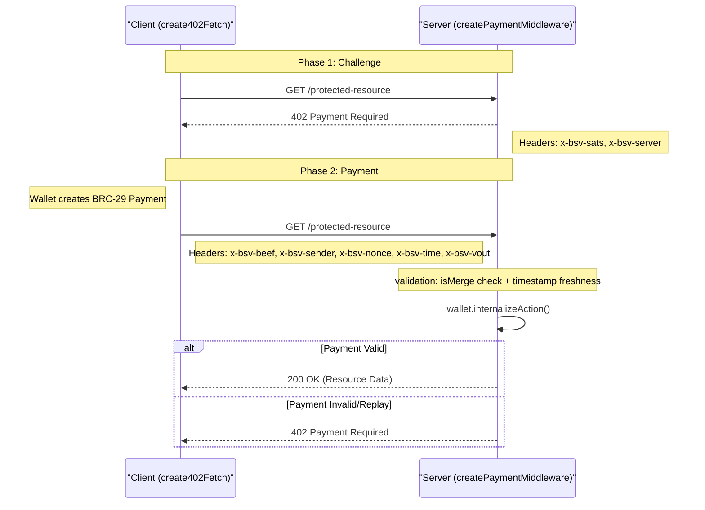
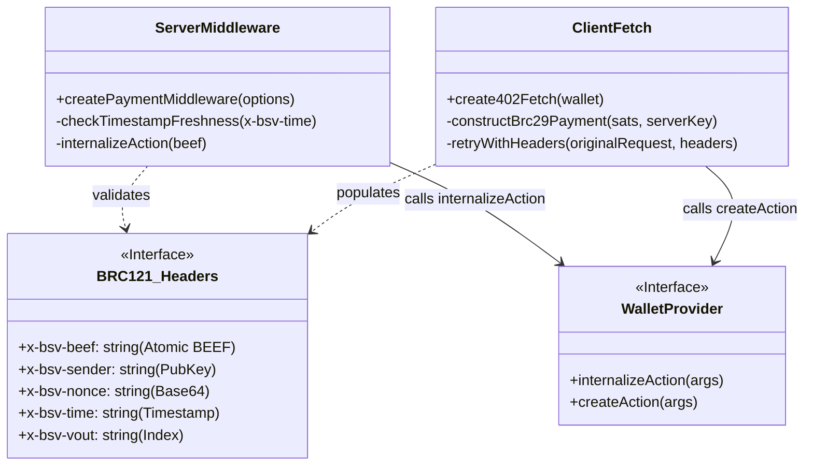

# Page: 402-Pay: HTTP Micropayment Middleware (BRC-121)

# 402-Pay: HTTP Micropayment Middleware (BRC-121)

<details>
<summary>Relevant source files</summary>

The following files were used as context for generating this wiki page:

- [packages/middleware/402-pay/package.json](https://github.com/bsv-blockchain/ts-stack/blob/main/packages/middleware/402-pay/package.json)
- [specs/merkle/merkle-service-http.yaml](https://github.com/bsv-blockchain/ts-stack/blob/main/specs/merkle/merkle-service-http.yaml)
- [specs/payments/brc121.yaml](https://github.com/bsv-blockchain/ts-stack/blob/main/specs/payments/brc121.yaml)
- [specs/payments/brc29-payment-protocol.yaml](https://github.com/bsv-blockchain/ts-stack/blob/main/specs/payments/brc29-payment-protocol.yaml)
- [specs/storage/uhrp-http.yaml](https://github.com/bsv-blockchain/ts-stack/blob/main/specs/storage/uhrp-http.yaml)
- [specs/sync/gasp-asyncapi.yaml](https://github.com/bsv-blockchain/ts-stack/blob/main/specs/sync/gasp-asyncapi.yaml)
- [specs/wallet/storage-adapter.yaml](https://github.com/bsv-blockchain/ts-stack/blob/main/specs/wallet/storage-adapter.yaml)

</details>


The `@bsv/402-pay` package provides a standardized implementation of **BRC-121 Simple 402 Payments**. It enables HTTP resources to be monetized using a single round-trip negotiation where the server requests payment via a `402 Payment Required` response, and the client fulfills it using a BRC-29 P2PKH transaction delivered via custom HTTP headers.

## Overview and Protocol Flow

BRC-121 monetizes resources by leveraging the HTTP 402 status code and a set of `x-bsv-*` headers to facilitate peer-to-peer BSV payments between a client and a server [specs/payments/brc121.yaml:9-17](https://github.com/bsv-blockchain/ts-stack/blob/main/specs/payments/brc121.yaml#L9-L17).

### The Negotiation Cycle

1.  **Initial Request**: The client requests a protected resource without payment headers.
2.  **Challenge**: The server responds with `402 Payment Required`, including `x-bsv-sats` (price) and `x-bsv-server` (server identity public key) [specs/payments/brc121.yaml:11-12](https://github.com/bsv-blockchain/ts-stack/blob/main/specs/payments/brc121.yaml#L11-L12).
3.  **Payment Construction**: The client uses the server's identity key to derive a P2PKH locking script (via BRC-42/BRC-29) and constructs an Atomic BEEF (BRC-95) transaction [specs/payments/brc121.yaml:13-14](https://github.com/bsv-blockchain/ts-stack/blob/main/specs/payments/brc121.yaml#L13-L14).
4.  **Paid Request**: The client re-sends the original request with five `x-bsv-*` headers containing the BEEF transaction and derivation metadata [specs/payments/brc121.yaml:14-15](https://github.com/bsv-blockchain/ts-stack/blob/main/specs/payments/brc121.yaml#L14-L15).
5.  **Validation & Service**: The server validates the transaction, checks for replays, and if valid, serves the resource (200 OK) [specs/payments/brc121.yaml:16-17](https://github.com/bsv-blockchain/ts-stack/blob/main/specs/payments/brc121.yaml#L16-L17).

### Data Flow Diagram: BRC-121 Negotiation

The following diagram maps the protocol flow to the code entities provided by `@bsv/402-pay`.


Sources: [specs/payments/brc121.yaml:9-18](https://github.com/bsv-blockchain/ts-stack/blob/main/specs/payments/brc121.yaml#L9-L18), [packages/middleware/402-pay/package.json:13-20](https://github.com/bsv-blockchain/ts-stack/blob/main/packages/middleware/402-pay/package.json#L13-L20)

## Key Implementation Components

The package is split into two primary entry points: `/server` and `/client` [packages/middleware/402-pay/package.json:13-20](https://github.com/bsv-blockchain/ts-stack/blob/main/packages/middleware/402-pay/package.json#L13-L20).

### Server Middleware: `createPaymentMiddleware`

The server-side implementation is an Express-compatible middleware that intercepts requests to protected routes. It performs the following logic:

*   **Payment Verification**: If the `x-bsv-beef` header is present, it extracts the transaction and calls `internalizeAction` on the server's wallet [specs/payments/brc121.yaml:16-17](https://github.com/bsv-blockchain/ts-stack/blob/main/specs/payments/brc121.yaml#L16-L17).
*   **Replay Protection**:
    *   **Timestamp Freshness**: It checks the `x-bsv-time` header. The request is rejected if the timestamp is more than ±30 seconds from the server's current time [specs/payments/brc121.yaml:33-34](https://github.com/bsv-blockchain/ts-stack/blob/main/specs/payments/brc121.yaml#L33-L34).
    *   **TXID Tracking**: It relies on the wallet's `isMerge` check. If `internalizeAction` returns `isMerge: true`, it indicates the transaction has been seen before, and the middleware returns 402 [specs/payments/brc121.yaml:35-36](https://github.com/bsv-blockchain/ts-stack/blob/main/specs/payments/brc121.yaml#L35-L36).
*   **Challenge Generation**: If no payment is present or valid, it attaches the required headers (`x-bsv-sats`, `x-bsv-server`) and sends the 402 response [specs/payments/brc121.yaml:11-12](https://github.com/bsv-blockchain/ts-stack/blob/main/specs/payments/brc121.yaml#L11-L12).

### Client Wrapper: `create402Fetch`

The client-side provides a wrapper around the standard `fetch` API.

*   **Automatic Retries**: If a request returns 402, the wrapper automatically handles the BRC-29 payment construction using the provided wallet instance and retries the request with the correct headers [specs/payments/brc121.yaml:13-15](https://github.com/bsv-blockchain/ts-stack/blob/main/specs/payments/brc121.yaml#L13-L15).
*   **Header Management**: It populates the following headers for the paid request:
    *   `x-bsv-beef`: The base64-encoded Atomic BEEF transaction [specs/payments/brc121.yaml:111-120](https://github.com/bsv-blockchain/ts-stack/blob/main/specs/payments/brc121.yaml#L111-L120).
    *   `x-bsv-sender`: The client's identity public key [specs/payments/brc121.yaml:122-132](https://github.com/bsv-blockchain/ts-stack/blob/main/specs/payments/brc121.yaml#L122-L132).
    *   `x-bsv-nonce`: The BRC-29 derivation prefix [specs/payments/brc121.yaml:134-143](https://github.com/bsv-blockchain/ts-stack/blob/main/specs/payments/brc121.yaml#L134-L143).
    *   `x-bsv-time`: The millisecond Unix timestamp [specs/payments/brc121.yaml:145-159](https://github.com/bsv-blockchain/ts-stack/blob/main/specs/payments/brc121.yaml#L145-L159).
    *   `x-bsv-vout`: The index of the payment output in the BEEF transaction [specs/payments/brc121.yaml:161-171](https://github.com/bsv-blockchain/ts-stack/blob/main/specs/payments/brc121.yaml#L161-L171).

## Key Derivation (BRC-29 & BRC-42)

Payments in BRC-121 use a specific BRC-42 invoice number format to derive the recipient's P2PKH locking script [specs/payments/brc121.yaml:21-25](https://github.com/bsv-blockchain/ts-stack/blob/main/specs/payments/brc121.yaml#L21-L25):

```
2-3241645161d8-<x-bsv-nonce> <base64(x-bsv-time)>
```

| Component | Description | Source |
| :--- | :--- | :--- |
| `2` | Security level (BRC-43) | [specs/payments/brc29-payment-protocol.yaml:169](https://github.com/bsv-blockchain/ts-stack/blob/main/specs/payments/brc29-payment-protocol.yaml#L169) |
| `3241645161d8` | BRC-29 Protocol Magic Number | [specs/payments/brc29-payment-protocol.yaml:170](https://github.com/bsv-blockchain/ts-stack/blob/main/specs/payments/brc29-payment-protocol.yaml#L170) |
| `x-bsv-nonce` | Derivation Prefix (Random per payment) | [specs/payments/brc121.yaml:24](https://github.com/bsv-blockchain/ts-stack/blob/main/specs/payments/brc121.yaml#L24) |
| `x-bsv-time` | Derivation Suffix (Base64 encoded timestamp) | [specs/payments/brc121.yaml:24](https://github.com/bsv-blockchain/ts-stack/blob/main/specs/payments/brc121.yaml#L24) |

## Code Entity Map

The following diagram maps the BRC-121 protocol requirements to the specific code structures and headers defined in the specifications.


Sources: [specs/payments/brc121.yaml:106-171](https://github.com/bsv-blockchain/ts-stack/blob/main/specs/payments/brc121.yaml#L106-L171), [specs/wallet/storage-adapter.yaml:120-151](https://github.com/bsv-blockchain/ts-stack/blob/main/specs/wallet/storage-adapter.yaml#L120-L151), [packages/middleware/402-pay/package.json:8-21](https://github.com/bsv-blockchain/ts-stack/blob/main/packages/middleware/402-pay/package.json#L8-L21)

## Summary of Replay Protection Mechanisms

| Mechanism | Implementation | Requirement |
| :--- | :--- | :--- |
| **Timestamp Freshness** | Server checks `\|serverTime - x-bsv-time\|` | Must be < 30 seconds [specs/payments/brc121.yaml:33-34](https://github.com/bsv-blockchain/ts-stack/blob/main/specs/payments/brc121.yaml#L33-L34) |
| **Double Spend / Replay** | Wallet `internalizeAction` checks `isMerge` | Must be `false` (new transaction) [specs/payments/brc121.yaml:35-36](https://github.com/bsv-blockchain/ts-stack/blob/main/specs/payments/brc121.yaml#L35-L36) |
| **Uniqueness** | `x-bsv-nonce` + `x-bsv-time` | Forms a unique BRC-42 derivation path [specs/payments/brc121.yaml:21-28](https://github.com/bsv-blockchain/ts-stack/blob/main/specs/payments/brc121.yaml#L21-L28) |

Sources: [specs/payments/brc121.yaml:30-37](https://github.com/bsv-blockchain/ts-stack/blob/main/specs/payments/brc121.yaml#L30-L37)

---