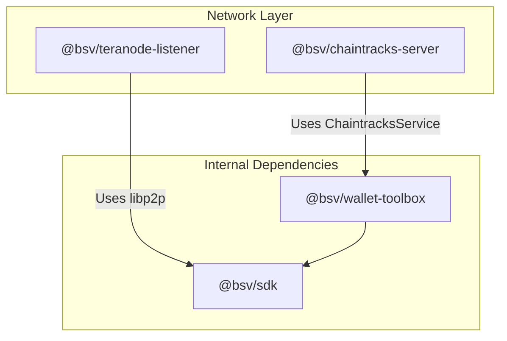
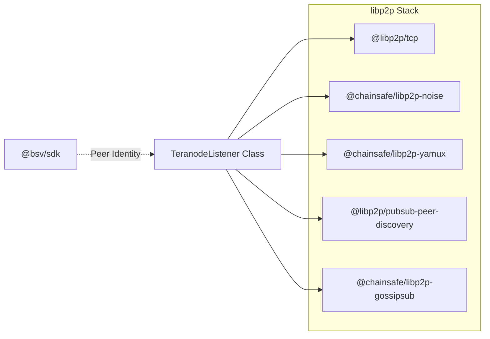
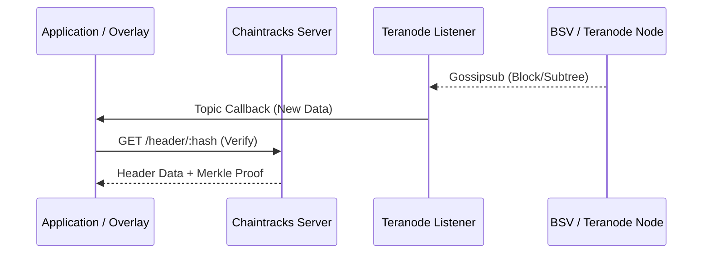

# Page: Network Layer

# Network Layer

Relevant source files

The following files were used as context for generating this wiki page:

- [packages/helpers/amountinator/tsconfig.json](https://github.com/bsv-blockchain/ts-stack/blob/main/packages/helpers/amountinator/tsconfig.json)
- [packages/helpers/bsv-wallet-helper/src/script-templates/ordlock.ts](https://github.com/bsv-blockchain/ts-stack/blob/main/packages/helpers/bsv-wallet-helper/src/script-templates/ordlock.ts)
- [packages/helpers/bsv-wallet-helper/src/script-templates/p2pkh.ts](https://github.com/bsv-blockchain/ts-stack/blob/main/packages/helpers/bsv-wallet-helper/src/script-templates/p2pkh.ts)
- [packages/helpers/bsv-wallet-helper/src/utils/derivation.ts](https://github.com/bsv-blockchain/ts-stack/blob/main/packages/helpers/bsv-wallet-helper/src/utils/derivation.ts)
- [packages/messaging/message-box-client/tsconfig.base.json](https://github.com/bsv-blockchain/ts-stack/blob/main/packages/messaging/message-box-client/tsconfig.base.json)
- [packages/messaging/message-box-server/src/swagger.ts](https://github.com/bsv-blockchain/ts-stack/blob/main/packages/messaging/message-box-server/src/swagger.ts)
- [packages/messaging/messagebox-services/backend/tsconfig.base.json](https://github.com/bsv-blockchain/ts-stack/blob/main/packages/messaging/messagebox-services/backend/tsconfig.base.json)
- [packages/network/chaintracks-server/package.json](https://github.com/bsv-blockchain/ts-stack/blob/main/packages/network/chaintracks-server/package.json)
- [packages/network/ts-p2p/package.json](https://github.com/bsv-blockchain/ts-stack/blob/main/packages/network/ts-p2p/package.json)
- [packages/overlays/overlay-express/package.json](https://github.com/bsv-blockchain/ts-stack/blob/main/packages/overlays/overlay-express/package.json)
- [packages/wallet/wab/package.json](https://github.com/bsv-blockchain/ts-stack/blob/main/packages/wallet/wab/package.json)
- [packages/wallet/wallet-toolbox/package.json](https://github.com/bsv-blockchain/ts-stack/blob/main/packages/wallet/wallet-toolbox/package.json)

The Network Layer provides the infrastructure for interacting with the Bitcoin SV peer-to-peer network and tracking the state of the blockchain. It consists of two primary components: **Chaintracks**, which handles high-performance header tracking and validation, and the **Teranode P2P Listener**, which enables participation in private libp2p-based DHT networks for real-time data subscription.

### Domain Architecture

The network domain bridges the gap between raw network protocols and the application-level services (like wallets and overlays). While the SDK handles individual transaction primitives, the Network Layer provides the context of the chain (headers) and the delivery mechanism for network-wide events.

Sources: [@bsv/chaintracks-server:29-33](https://github.com/bsv-blockchain/ts-stack/tree/main/packages/network/chaintracks-server), [@bsv/teranode-listener:16-32](https://github.com/bsv-blockchain/ts-stack/tree/main/packages/network/teranode-listener)

---

## 7.1 Chaintracks Server

The `@bsv/chaintracks-server` is a TypeScript Express application that wraps the `ChaintracksService` from the wallet-toolbox. Its primary role is to maintain an up-to-date view of the blockchain header chain, providing proof of work validation and block height information to other services.

The server supports multiple entry points and configuration modes via the `CHAIN` environment variable to toggle between `mainnet` and `testnet` environments.

| Feature | Implementation |
| --- | --- |
| **Core Logic** | `ChaintracksService` from `@bsv/wallet-toolbox` |
| **API Framework** | Express with `body-parser` |
| **Network Modes** | Mainnet, Testnet (via `CHAIN` env) |
| **Entry Points** | `server.ts`, `server-custom.ts`, `server-with-prefix.ts` |

For details, see [Chaintracks Server](25-Chaintracks-Server.md).

**Sources:** [@bsv/chaintracks-server:1-42](https://github.com/bsv-blockchain/ts-stack/tree/main/packages/network/chaintracks-server), [@bsv/chaintracks-server:5-6](https://github.com/bsv-blockchain/ts-stack/tree/main/packages/network/chaintracks-server), [@bsv/chaintracks-server:11-13](https://github.com/bsv-blockchain/ts-stack/tree/main/packages/network/chaintracks-server)

---

## 7.2 Teranode P2P Listener

The `@bsv/teranode-listener` (also known as `ts-p2p`) is a specialized package designed to interface with Teranode's private DHT network. It utilizes `libp2p` to subscribe to specific gossipsub topics, such as block headers and UTXO subtrees.

This package is essential for high-throughput applications that require real-time notifications from Teranode nodes without relying on traditional polling mechanisms.

### Code-to-Entity Mapping

The following diagram maps the logical P2P components to the specific `libp2p` modules and dependencies used in the implementation.

| Component | Package / Entity |
| --- | --- |
| **Listener Class** | `TeranodeListener` |
| **Gossip Protocol** | `@chainsafe/libp2p-gossipsub` |
| **Private Network** | `@libp2p/pnet` (PSK-based access) |
| **Peer Discovery** | `@libp2p/bootstrap` & `@libp2p/pubsub-peer-discovery` |

For details, see [Teranode P2P Listener](26-Teranode-P2P-Listener.md).

**Sources:** [@bsv/teranode-listener:1-60](https://github.com/bsv-blockchain/ts-stack/tree/main/packages/network/teranode-listener), [@bsv/teranode-listener:18-32](https://github.com/bsv-blockchain/ts-stack/tree/main/packages/network/teranode-listener), [@bsv/teranode-listener:39-45](https://github.com/bsv-blockchain/ts-stack/tree/main/packages/network/teranode-listener)

---

## Network Component Interaction

The Network Layer components interact with the rest of the stack by providing the "Ground Truth" for the blockchain.

**Sources:** [@bsv/chaintracks-server:5-6](https://github.com/bsv-blockchain/ts-stack/tree/main/packages/network/chaintracks-server), [@bsv/teranode-listener:39-44](https://github.com/bsv-blockchain/ts-stack/tree/main/packages/network/teranode-listener)

---