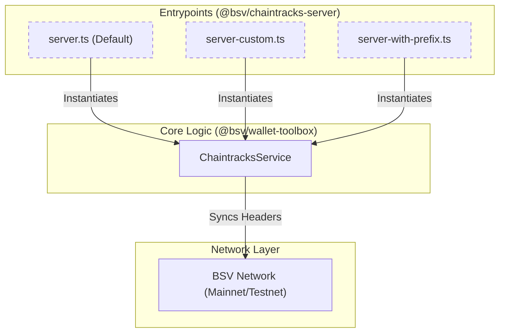
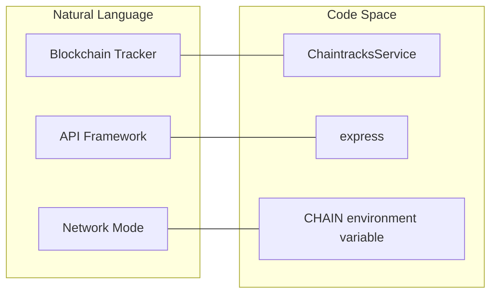

# Page: Chaintracks Server

# Chaintracks Server

Relevant source files

The following files were used as context for generating this wiki page:

- [packages/network/chaintracks-server/package.json](packages/network/chaintracks-server/package.json)
- [packages/overlays/overlay-express/package.json](packages/overlays/overlay-express/package.json)
- [packages/wallet/wab/package.json](packages/wallet/wab/package.json)
- [packages/wallet/wallet-toolbox/package.json](packages/wallet/wallet-toolbox/package.json)

The `Chaintracks Server` is a specialized network service designed to track blockchain headers and provide proof-of-work validation for the Bitcoin SV (BSV) network. It is implemented as a TypeScript Express server that wraps the `ChaintracksService` from the `@bsv/wallet-toolbox` package.

## Overview and Purpose

The primary role of the `@bsv/chaintracks-server` is to maintain an up-to-date view of the blockchain's longest chain. It serves as a lightweight alternative to running a full node for applications that only require header verification, such as Simple Payment Verification (SPV) clients and overlay services.

### Key Capabilities
- **Header Tracking**: Synchronizes and validates block headers from the BSV network.
- **Network Support**: Configurable for both `mainnet` and `testnet` via environment variables.
- **Express API**: Provides a RESTful interface for external applications to query the current chain state.
- **Modular Entrypoints**: Supports standard, custom, and prefixed routing configurations.

Sources: [packages/network/chaintracks-server/package.json:5-13](), [packages/network/chaintracks-server/package.json:29-34]()

---

## Architecture and Data Flow

The server acts as a bridge between the raw blockchain network and high-level applications. It utilizes the `ChaintracksService` for the underlying logic of header management and synchronization.

### System Components Diagram

This diagram illustrates the relationship between the server entrypoints and the core logic classes.

"Chaintracks Server Architecture"

Sources: [packages/network/chaintracks-server/package.json:5-15](), [packages/wallet/wallet-toolbox/package.json:41-44]()

---

## Configuration and Environment

The server behavior is primarily controlled through environment variables, allowing it to switch between different BSV networks.

| Variable | Description | Default |
| :--- | :--- | :--- |
| `CHAIN` | Determines the network to track (`main` or `test`). | `main` |
| `PORT` | The port on which the Express server listens. | (Implementation dependent) |

### Start Scripts
The `package.json` defines several scripts for different deployment scenarios:
- `npm run start`: Starts the server on the default network (Mainnet).
- `npm run start:test`: Sets `CHAIN=test` and starts the server for Testnet.
- `npm run start:custom`: Uses the `server-custom.ts` entrypoint for specialized configurations.
- `npm run start:prefix`: Uses `server-with-prefix.ts` to host the API under a specific URL path.

Sources: [packages/network/chaintracks-server/package.json:8-15]()

---

## Entrypoints and Implementation

The server provides three distinct entrypoints to cater to different integration requirements. All entrypoints leverage `express` and `body-parser` to handle incoming HTTP requests.

### 1. Standard Server (`src/server.ts`)
The default entrypoint providing the standard API surface for header tracking. It initializes the `ChaintracksService` and mounts the routes directly to the root of the Express application.

### 2. Custom Server (`src/server-custom.ts`)
Allows for manual configuration of the `ChaintracksService` parameters, such as specific storage backends or initial synchronization checkpoints.

### 3. Prefixed Server (`src/server-with-prefix.ts`)
Useful when the Chaintracks API needs to be co-hosted with other services. It mounts the `ChaintracksService` routes under a specific path prefix (e.g., `/api/v1/chaintracks`).

### Entity Mapping Diagram

This diagram maps the natural language concepts to the specific code entities used in the implementation.

"Code Entity Mapping"

Sources: [packages/network/chaintracks-server/package.json:5-6](), [packages/network/chaintracks-server/package.json:29-34](), [packages/wallet/wallet-toolbox/package.json:46-46]()

---

## Dependencies

The `chaintracks-server` is a "leaf" package in the network domain, depending on the wallet and SDK layers.

- **@bsv/wallet-toolbox**: Provides the `ChaintracksService` which contains the logic for validating block headers and maintaining the chain state.
- **@bsv/sdk**: Indirectly used for cryptographic primitives and transaction/header serialization.
- **express**: The web framework used to expose the service over HTTP.
- **dotenv**: Used to load configuration from `.env` files.

Sources: [packages/network/chaintracks-server/package.json:29-34](), [packages/wallet/wallet-toolbox/package.json:41-44]()

---