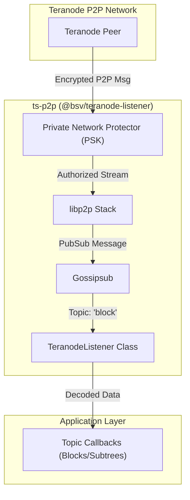
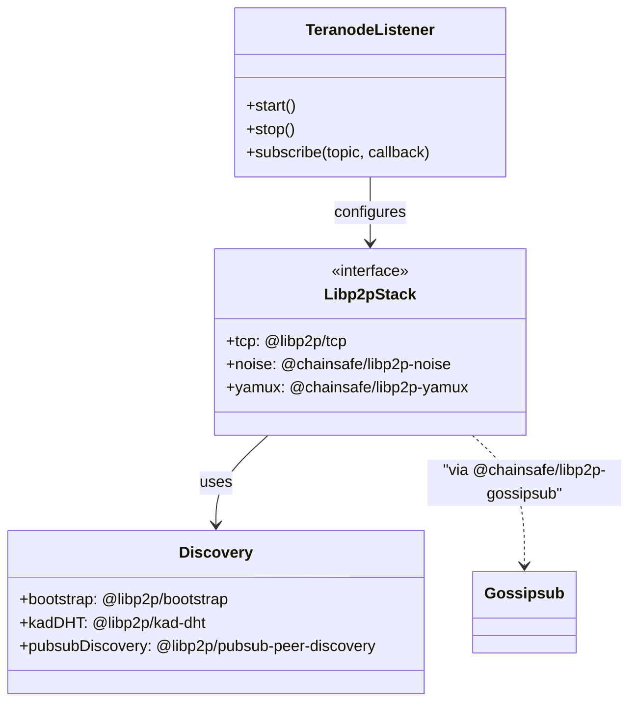

# Page: Teranode P2P Listener

# Teranode P2P Listener

Relevant source files

The following files were used as context for generating this wiki page:

- [packages/helpers/amountinator/tsconfig.json](packages/helpers/amountinator/tsconfig.json)
- [packages/helpers/bsv-wallet-helper/src/script-templates/ordlock.ts](packages/helpers/bsv-wallet-helper/src/script-templates/ordlock.ts)
- [packages/helpers/bsv-wallet-helper/src/script-templates/p2pkh.ts](packages/helpers/bsv-wallet-helper/src/script-templates/p2pkh.ts)
- [packages/helpers/bsv-wallet-helper/src/utils/derivation.ts](packages/helpers/bsv-wallet-helper/src/utils/derivation.ts)
- [packages/messaging/message-box-client/tsconfig.base.json](packages/messaging/message-box-client/tsconfig.base.json)
- [packages/messaging/message-box-server/src/swagger.ts](packages/messaging/message-box-server/src/swagger.ts)
- [packages/messaging/messagebox-services/backend/tsconfig.base.json](packages/messaging/messagebox-services/backend/tsconfig.base.json)
- [packages/network/ts-p2p/package.json](packages/network/ts-p2p/package.json)

The `@bsv/teranode-listener` (also known as `ts-p2p`) package provides a specialized interface for subscribing to Teranode P2P topics within a private DHT network. It leverages `libp2p` to facilitate secure communication, peer discovery, and message propagation (PubSub) specifically for BSV blockchain events such as new blocks and transaction subtrees.

## Overview and Purpose

The primary role of the Teranode P2P Listener is to allow services to receive real-time updates from Teranode instances. Unlike public Bitcoin P2P protocols, this listener is designed for a **private network** environment using a Pre-Shared Key (PSK) for network-level access control.

Key capabilities include:
*   **Private DHT Network**: Access is restricted via a 32-byte PSK [packages/network/ts-p2p/package.json:28-28]().
*   **Gossipsub Support**: Uses `@chainsafe/libp2p-gossipsub` for efficient message routing [packages/network/ts-p2p/package.json:18-18]().
*   **Topic Subscriptions**: Specialized handlers for blockchain-specific topics like blocks and subtrees.
*   **Peer Discovery**: Implements bootstrap nodes and PubSub-based peer discovery [packages/network/ts-p2p/package.json:21-29]().

## System Architecture

The listener operates as a node within a `libp2p` stack, configured with specific security and transport layers suitable for high-performance blockchain data.

### Data Flow Diagram
This diagram illustrates the flow of a message from the Teranode network through the `TeranodeListener` to application callbacks.

Title: Teranode Listener Data Flow

Sources: [packages/network/ts-p2p/package.json:18-32]()

## Code Entity Map

The following diagram maps the logical components of the P2P listener to the specific libraries and types used in the implementation.

Title: Code Entity Relationship Map

Sources: [packages/network/ts-p2p/package.json:16-33]()

## Implementation Details

### Dependency Stack
The listener relies on a modern `libp2p` configuration:
*   **Transport**: TCP (`@libp2p/tcp`) [packages/network/ts-p2p/package.json:30-30]().
*   **Security**: Noise encryption (`@chainsafe/libp2p-noise`) [packages/network/ts-p2p/package.json:19-19]().
*   **Multiplexing**: Yamux (`@chainsafe/libp2p-yamux`) [packages/network/ts-p2p/package.json:20-20]().
*   **Private Networking**: PNET using a PSK (`@libp2p/pnet`) [packages/network/ts-p2p/package.json:28-28]().
*   **Peer ID**: Uses `@libp2p/peer-id` for node identity [packages/network/ts-p2p/package.json:26-26]().

### Peer Discovery and DHT
To maintain connectivity in the private network, the listener employs multiple discovery strategies:
1.  **Bootstrap Nodes**: Initial entry points into the network defined during initialization [packages/network/ts-p2p/package.json:21-21]().
2.  **Kademlia DHT**: Used for routing and finding peers in the private DHT (`@libp2p/kad-dht`) [packages/network/ts-p2p/package.json:25-25]().
3.  **PubSub Discovery**: Peers can discover each other via dedicated PubSub channels [packages/network/ts-p2p/package.json:29-29]().

### Topic Subscriptions
The `TeranodeListener` class provides a high-level abstraction over the Gossipsub implementation. It typically handles:
*   **Blocks**: Subscription to full block announcements.
*   **Subtrees**: Subscription to Merkle subtree data, often used for partial validation or SPV clients.

## Deployment

### Docker Integration
The package is designed to be containerized, allowing it to run alongside other BSV infrastructure components. It requires environment variables for:
*   `LISTEN_ADDRESSES`: Multiaddrs for the node to listen on.
*   `BOOTSTRAP_NODES`: List of initial peers.
*   `NETWORK_PSK`: The 32-byte hex-encoded private network key.

### Configuration Example
While the internal implementation is encapsulated, the listener configuration follows the `libp2p` options pattern:

| Feature | Code Entity / Package |
| :--- | :--- |
| **Gossipsub** | `@chainsafe/libp2p-gossipsub` |
| **Identity** | `@libp2p/identify` |
| **Ping** | `@libp2p/ping` |
| **Addressing** | `@multiformats/multiaddr` |

Sources: [packages/network/ts-p2p/package.json:18-32]()

---