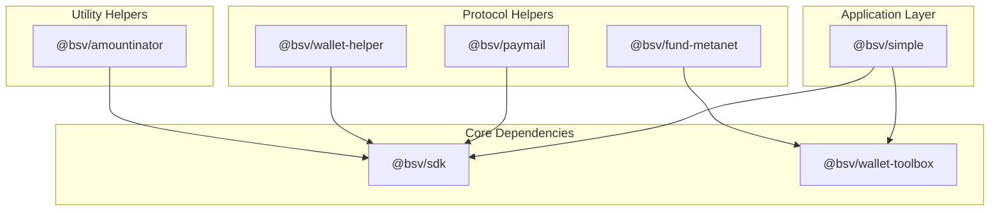
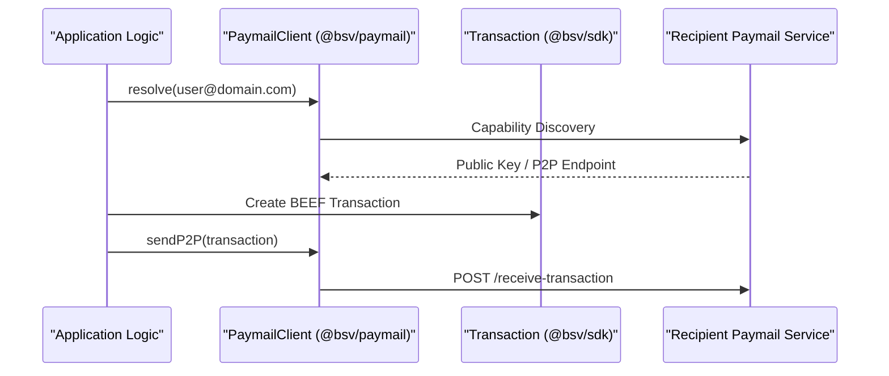

# Page: Helper Packages

# Helper Packages

Relevant source files

The following files were used as context for generating this wiki page:

- [packages/helpers/amountinator/package.json](packages/helpers/amountinator/package.json)
- [packages/helpers/bsv-wallet-helper/package.json](packages/helpers/bsv-wallet-helper/package.json)
- [packages/helpers/fund-metanet/BASELINE.md](packages/helpers/fund-metanet/BASELINE.md)
- [packages/helpers/fund-metanet/package.json](packages/helpers/fund-metanet/package.json)
- [packages/helpers/simple/package.json](packages/helpers/simple/package.json)
- [packages/helpers/ts-paymail/package.json](packages/helpers/ts-paymail/package.json)

The Helper Packages domain provides high-level abstractions, specialized protocol implementations, and utility tools that sit atop the Core SDK and Wallet layers. These packages are designed to simplify application development by providing "batteries-included" APIs for common tasks such as identity management, peer-to-peer payments, and currency conversion.

### Helper Domain Architecture

The helpers range from `@bsv/simple`, which acts as a primary entry point for application developers, to specialized utilities like `@bsv/amountinator`.

#### Helper Dependency Mapping

Sources: [packages/helpers/simple/package.json:45-50](), [packages/helpers/ts-paymail/package.json:104-105](), [packages/helpers/bsv-wallet-helper/package.json:34-37](), [packages/helpers/amountinator/package.json:34-37](), [packages/helpers/fund-metanet/package.json:20-22]()

---

### @bsv/simple: High-Level Application API

`@bsv/simple` is the recommended high-level wrapper for developers who want to interact with the BSV blockchain without managing low-level transaction plumbing. It provides a unified `wallet` interface that handles:

*   **Payments & Tokens**: Simplified `wallet.pay()` and `wallet.createToken()` methods.
*   **Inscriptions**: High-level `wallet.inscribeText()` for Ordinal-style data.
*   **Identity**: Built-in support for DID generation and Verifiable Credential (VC) issuance.
*   **Environment Switching**: Specific entry points for `browser` and `server` environments [packages/helpers/simple/package.json:11-24]().

For details on the high-level API, see [@bsv/simple: High-Level Application API](#8.1).

---

### Paymail, Wallet Helper & Utility Packages

This sub-domain contains the protocol-specific implementations and mathematical utilities required for production-grade wallets and services.

#### Key Packages

| Package | Purpose | Primary Features |
|:---|:---|:---|
| `@bsv/paymail` | Identity & P2P | PKI lookups, P2P transaction delivery, and BEEF-based `sendP2P` [packages/helpers/ts-paymail/package.json:81-83](). |
| `@bsv/wallet-helper` | Script Templates | Pre-defined templates for P2PKH and OrdLock scripts [packages/helpers/bsv-wallet-helper/package.json:2-5](). |
| `@bsv/amountinator` | Conversion | Mathematical utilities for converting between satoshis and various fiat/unit representations [packages/helpers/amountinator/package.json:2-4](). |
| `@bsv/fund-metanet` | CLI Utility | A Tier-3 developer tool for funding Metanet-compatible wallets with BSV [packages/helpers/fund-metanet/BASELINE.md:12-13](). |

#### Protocol Interaction Flow

Sources: [packages/helpers/ts-paymail/package.json:29-48](), [packages/helpers/ts-paymail/package.json:83-84]()

For detailed documentation on these utilities and the Paymail client, see [Paymail, Wallet Helper & Utility Packages](#8.2).

---

### Package Criticality and Reliability

The helper domain contains a mix of production-critical libraries and internal developer tools.

| Package | Criticality | Reliability | Build Tool |
|:---|:---|:---|:---|
| `@bsv/simple` | Tier 1 | RL1 | `tsc` |
| `@bsv/paymail` | Tier 1 | RL1 | `tsc` + Dual Package |
| `@bsv/amountinator` | Tier 2 | RL1 | `tsc` |
| `@bsv/fund-metanet` | Tier 3 | RL0 | `tsc` |

Sources: [packages/helpers/fund-metanet/BASELINE.md:11-13](), [packages/helpers/ts-paymail/package.json:77-77](), [packages/helpers/bsv-wallet-helper/package.json:28-28]()

---