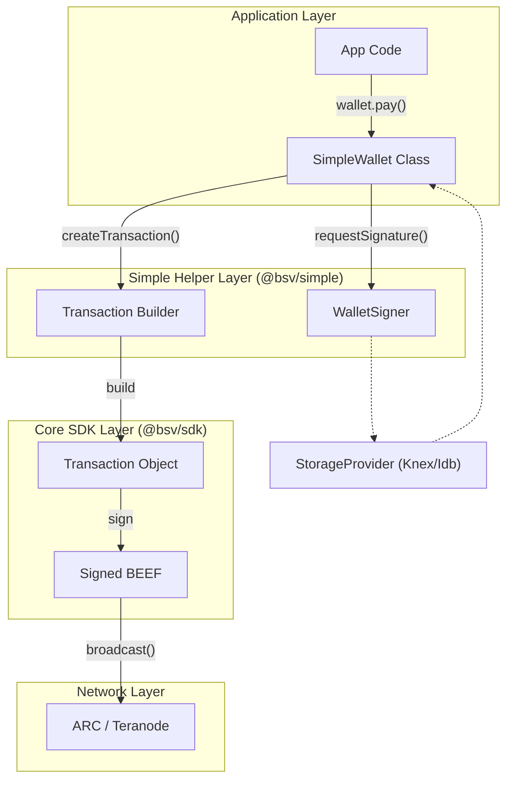
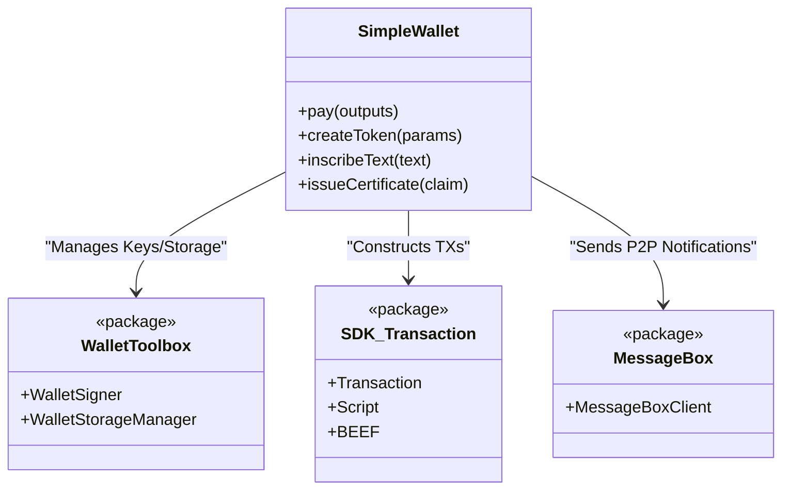

# Page: @bsv/simple: High-Level Application API

# @bsv/simple: High-Level Application API

Relevant source files

The following files were used as context for generating this wiki page:

- [packages/helpers/amountinator/package.json](https://github.com/bsv-blockchain/ts-stack/blob/main/packages/helpers/amountinator/package.json)
- [packages/helpers/bsv-wallet-helper/package.json](https://github.com/bsv-blockchain/ts-stack/blob/main/packages/helpers/bsv-wallet-helper/package.json)
- [packages/helpers/simple/package.json](https://github.com/bsv-blockchain/ts-stack/blob/main/packages/helpers/simple/package.json)
- [packages/helpers/ts-paymail/package.json](https://github.com/bsv-blockchain/ts-stack/blob/main/packages/helpers/ts-paymail/package.json)

The `@bsv/simple` package serves as the primary high-level entry point for developers building applications on the BSV blockchain. It abstracts the complexities of the `@bsv/sdk` and the `@bsv/wallet-toolbox` into a simplified API, providing pre-configured workflows for common tasks such as making payments, creating tokens, inscribing data, and managing decentralized identities (DIDs).

### Purpose and Scope
`@bsv/simple` is designed to minimize boilerplate by wrapping lower-level primitives into a "Wallet" object that handles state, key management, and network interactions. It provides specific entry points for browser and server environments to ensure compatibility with different storage and networking constraints.

---

## Architecture & Entry Points

The package uses a modular structure with environment-specific exports. This allows the same API surface to be used in a Node.js backend or a web browser while swapping the underlying storage and transport implementations.

### Environment-Specific Exports
The package defines three primary entry points in its `package.json`:
1.  **General (`.`):** Default export for common utilities [packages/helpers/simple/package.json:12-15](https://github.com/bsv-blockchain/ts-stack/blob/main/packages/helpers/simple/package.json#L12-L15).
2.  **Browser (`./browser`):** Optimized for client-side environments, likely utilizing `StorageIdb` (IndexedDB) from the toolbox [packages/helpers/simple/package.json:16-19](https://github.com/bsv-blockchain/ts-stack/blob/main/packages/helpers/simple/package.json#L16-L19).
3.  **Server (`./server`):** Optimized for Node.js, supporting filesystem or database-backed storage like `StorageKnex` [packages/helpers/simple/package.json:20-23](https://github.com/bsv-blockchain/ts-stack/blob/main/packages/helpers/simple/package.json#L20-L23).

### Dependency Hierarchy
`@bsv/simple` acts as a glue layer for several core domains:
*   **@bsv/sdk:** For transaction construction, script templates, and cryptographic primitives [packages/helpers/simple/package.json:47](https://github.com/bsv-blockchain/ts-stack/blob/main/packages/helpers/simple/package.json#L47).
*   **@bsv/wallet-toolbox:** For wallet state management, UTXO tracking, and storage [packages/helpers/simple/package.json:48](https://github.com/bsv-blockchain/ts-stack/blob/main/packages/helpers/simple/package.json#L48).
*   **@bsv/message-box-client:** For peer-to-peer communication and notification handling [packages/helpers/simple/package.json:46](https://github.com/bsv-blockchain/ts-stack/blob/main/packages/helpers/simple/package.json#L46).

### Data Flow: Application to Blockchain
The following diagram illustrates how a call to a high-level function in `@bsv/simple` flows through the underlying stack.

**Simple API Execution Flow**

Sources: [packages/helpers/simple/package.json:45-50](https://github.com/bsv-blockchain/ts-stack/blob/main/packages/helpers/simple/package.json#L45-L50), [packages/helpers/simple/package.json:11-24](https://github.com/bsv-blockchain/ts-stack/blob/main/packages/helpers/simple/package.json#L11-L24)

---

## Key Functionality

The `@bsv/simple` API focuses on several high-level "modules" that encapsulate complex blockchain operations.

### Wallet and Payments
The `wallet.pay()` function simplifies the process of sending BSV. It internally handles:
*   UTXO selection via the `WalletStorageManager`.
*   Output creation using P2PKH or other script templates.
*   Fee calculation.
*   Broadcasting the transaction to the network.

### Tokens and Inscriptions
The API provides simplified methods for BRC-20 style inscriptions and token management:
*   **`wallet.inscribeText()`**: Creates an inscription (typically using `PushDrop` or similar templates) containing UTF-8 text.
*   **`wallet.createToken()`**: Orchestrates the creation of a new token supply, integrating with the BTMS (Basic Token Management System) logic found in the wallet layer.

### Identity and Certificates
`@bsv/simple` provides built-in support for decentralized identity (DID) and Verifiable Credentials (VC):
*   **DID Generation:** Automatically derives identity keys using BRC-42 derivation paths.
*   **VC Issuance:** Wraps the process of signing identity claims to issue certificates that can be stored in the `certmap` or `identity` overlay topics.

### Overlay Integration
The library facilitates broadcasting transactions to specific overlays. When an action is performed (like creating a token), `@bsv/simple` can automatically route the resulting transaction to the relevant overlay services (e.g., `utility-tokens` or `kvstore`) to ensure the data is indexed and discoverable.

---

## System Integration Map

This diagram maps the high-level methods in `@bsv/simple` to the internal classes and packages they orchestrate.

**Simple API Component Mapping**

Sources: [packages/helpers/simple/package.json:45-50](https://github.com/bsv-blockchain/ts-stack/blob/main/packages/helpers/simple/package.json#L45-L50), [packages/helpers/simple/package.json:33-42](https://github.com/bsv-blockchain/ts-stack/blob/main/packages/helpers/simple/package.json#L33-L42)

---

## Utility Packages Integration

`@bsv/simple` often works in tandem with other helper packages in the `packages/helpers/` directory to provide a full application suite.

| Package | Integration Role |
| :--- | :--- |
| **@bsv/paymail** | Used for looking up public keys and delivery targets via human-readable handles during `wallet.pay()` [packages/helpers/ts-paymail/package.json:2-4](https://github.com/bsv-blockchain/ts-stack/blob/main/packages/helpers/ts-paymail/package.json#L2-L4). |
| **@bsv/amountinator** | Used for converting fiat values to Satoshis before passing them to the wallet API [packages/helpers/amountinator/package.json:2-4](https://github.com/bsv-blockchain/ts-stack/blob/main/packages/helpers/amountinator/package.json#L2-L4). |
| **@bsv/wallet-helper** | Provides specific script templates (like `OrdLock`) used for inscriptions [packages/helpers/bsv-wallet-helper/package.json:2-3](https://github.com/bsv-blockchain/ts-stack/blob/main/packages/helpers/bsv-wallet-helper/package.json#L2-L3). |

Sources: [packages/helpers/ts-paymail/package.json:104-105](https://github.com/bsv-blockchain/ts-stack/blob/main/packages/helpers/ts-paymail/package.json#L104-L105), [packages/helpers/amountinator/package.json:34-36](https://github.com/bsv-blockchain/ts-stack/blob/main/packages/helpers/amountinator/package.json#L34-L36), [packages/helpers/bsv-wallet-helper/package.json:34-36](https://github.com/bsv-blockchain/ts-stack/blob/main/packages/helpers/bsv-wallet-helper/package.json#L34-L36)

---