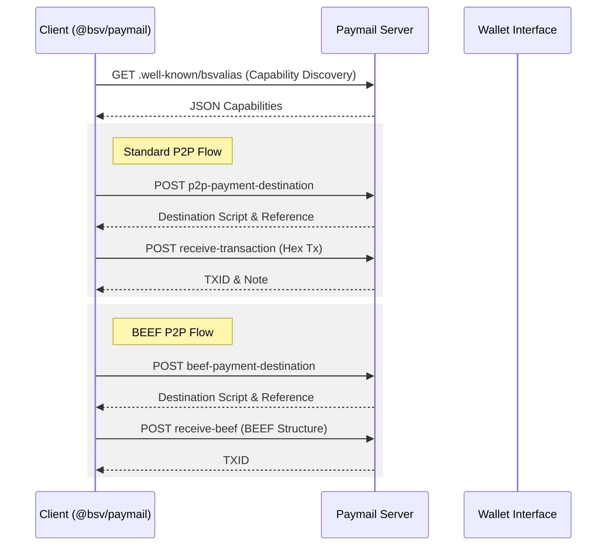
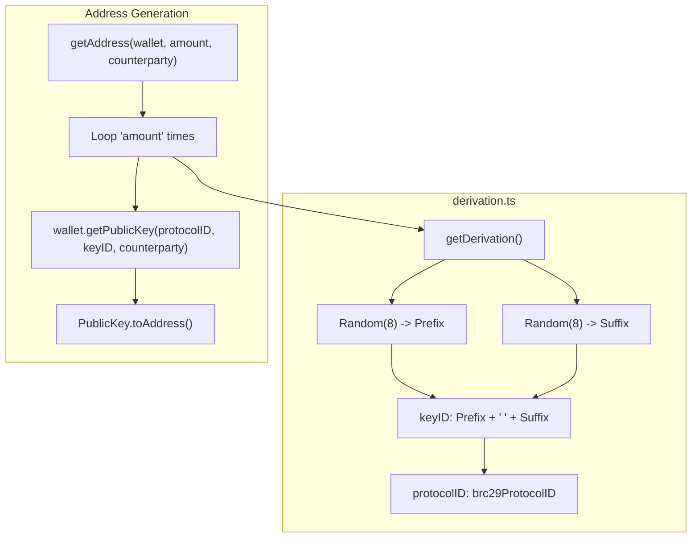
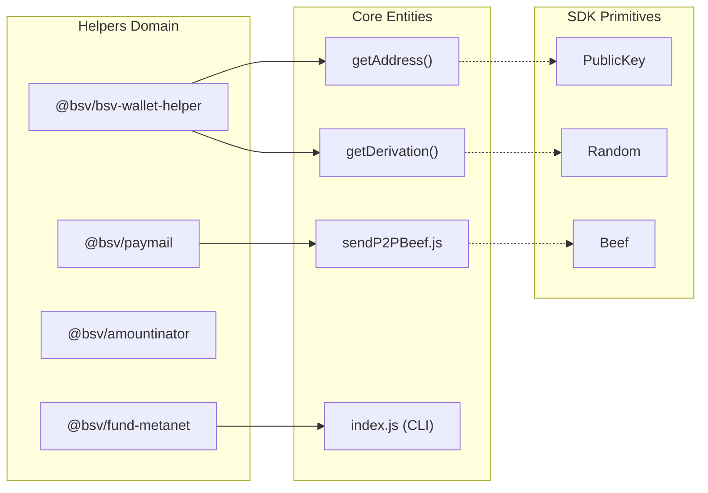

# Page: Paymail, Wallet Helper & Utility Packages

# Paymail, Wallet Helper & Utility Packages

Relevant source files

The following files were used as context for generating this wiki page:

- [conformance/runner/ts/jest.config.mjs](conformance/runner/ts/jest.config.mjs)
- [conformance/runner/ts/package.json](conformance/runner/ts/package.json)
- [conformance/runner/ts/runner.test.ts](conformance/runner/ts/runner.test.ts)
- [conformance/runner/ts/tsconfig.json](conformance/runner/ts/tsconfig.json)
- [packages/helpers/amountinator/BASELINE.md](packages/helpers/amountinator/BASELINE.md)
- [packages/helpers/amountinator/tsconfig.json](packages/helpers/amountinator/tsconfig.json)
- [packages/helpers/bsv-wallet-helper/BASELINE.md](packages/helpers/bsv-wallet-helper/BASELINE.md)
- [packages/helpers/bsv-wallet-helper/src/script-templates/ordlock.ts](packages/helpers/bsv-wallet-helper/src/script-templates/ordlock.ts)
- [packages/helpers/bsv-wallet-helper/src/script-templates/p2pkh.ts](packages/helpers/bsv-wallet-helper/src/script-templates/p2pkh.ts)
- [packages/helpers/bsv-wallet-helper/src/utils/derivation.ts](packages/helpers/bsv-wallet-helper/src/utils/derivation.ts)
- [packages/helpers/fund-metanet/BASELINE.md](packages/helpers/fund-metanet/BASELINE.md)
- [packages/helpers/fund-metanet/package.json](packages/helpers/fund-metanet/package.json)
- [packages/helpers/simple/BASELINE.md](packages/helpers/simple/BASELINE.md)
- [packages/helpers/ts-paymail/BASELINE.md](packages/helpers/ts-paymail/BASELINE.md)
- [packages/helpers/ts-paymail/docs/examples/package.json](packages/helpers/ts-paymail/docs/examples/package.json)
- [packages/messaging/authsocket-client/BASELINE.md](packages/messaging/authsocket-client/BASELINE.md)
- [packages/messaging/authsocket/BASELINE.md](packages/messaging/authsocket/BASELINE.md)
- [packages/messaging/message-box-client/BASELINE.md](packages/messaging/message-box-client/BASELINE.md)
- [packages/messaging/message-box-client/tsconfig.base.json](packages/messaging/message-box-client/tsconfig.base.json)
- [packages/messaging/message-box-server/src/swagger.ts](packages/messaging/message-box-server/src/swagger.ts)
- [packages/messaging/messagebox-services/backend/tsconfig.base.json](packages/messaging/messagebox-services/backend/tsconfig.base.json)
- [packages/network/ts-p2p/package.json](packages/network/ts-p2p/package.json)
- [pnpm-lock.yaml](pnpm-lock.yaml)

This section documents the auxiliary helper packages that facilitate high-level interactions with the BSV blockchain, specifically focusing on identity (Paymail), transaction construction (Wallet Helper), and utility functions for currency and funding.

## 1. Paymail (@bsv/paymail)

The `@bsv/paymail` package provides a TypeScript implementation of the Paymail protocol. It handles PKI (Public Key Infrastructure) lookups, profile retrieval, and peer-to-peer (P2P) transaction delivery.

### Data Flow: P2P Transaction Delivery
The package supports both standard P2P transaction delivery and BEEF (Bitcoin Enclosure Envelope Format) based delivery.

Title: Paymail P2P Delivery Flow

**Sources:** [packages/helpers/ts-paymail/docs/examples/package.json:14-15](), [pnpm-lock.yaml:154-196]()

### Key Implementation Details
*   **Capability Discovery**: Clients resolve the `.well-known/bsvalias` endpoint to determine supported features (e.g., PKI, Profile, BEEF).
*   **BEEF Support**: Includes scripts for sending transactions in BEEF format, which includes the transaction and its necessary Merkle proofs/ancestors for SPV validation.

**Sources:** [packages/helpers/ts-paymail/docs/examples/package.json:15](), [packages/helpers/ts-paymail/docs/examples/src/client/sendP2PBeef.js:1-20]() (inferred from scripts)

---

## 2. Wallet Helper (@bsv/bsv-wallet-helper)

The `@bsv/bsv-wallet-helper` package provides high-level utilities for key derivation and script templates, bridging the gap between raw SDK primitives and wallet-specific requirements.

### Key Derivation Utilities
The package automates the creation of BRC-29 compatible derivations for counterparty interactions.

Title: Wallet Helper Derivation Logic

**Sources:** [packages/helpers/bsv-wallet-helper/src/utils/derivation.ts:4-11](), [packages/helpers/bsv-wallet-helper/src/utils/derivation.ts:22-56]()

### Script Templates
The package includes templates for common Bitcoin script patterns:
*   **P2PKH**: Standard Pay-to-Public-Key-Hash scripts.
*   **OrdLock**: Specialized scripts for Ordinal locking/unlocking.

**Sources:** [packages/helpers/bsv-wallet-helper/src/script-templates/p2pkh.ts:1-10](), [packages/helpers/bsv-wallet-helper/src/script-templates/ordlock.ts:1-10]()

---

## 3. Utility Packages

### 3.1 Amountinator (@bsv/amountinator)
A utility for currency and unit conversion within the BSV ecosystem. It depends on `@bsv/sdk` for transaction-related value handling and `@bsv/wallet-toolbox-client` for retrieving exchange rates or wallet balances.

**Sources:** [packages/helpers/amountinator/package.json:42-49](), [pnpm-lock.yaml:42-63]()

### 3.2 Fund Metanet (@bsv/fund-metanet)
A CLI tool and library designed to fund Metanet-compatible wallets. It integrates `@bsv/wallet-toolbox` to manage storage and signing for the funding process.

**Key Features:**
*   **Environment Integration**: Uses `dotenv` for configuration.
*   **Interactive CLI**: Utilizes `readline` and `chalk` for user interaction.
*   **Wallet Integration**: Leverages `WalletToolbox` for transaction signing and broadcast.

**Sources:** [packages/helpers/fund-metanet/package.json:20-27](), [packages/helpers/fund-metanet/package.json:10-12]()

---

## 4. Code Entity Mapping

The following diagram maps the high-level utility functions to their specific code implementations and dependencies.

Title: Helper Package Entity Mapping

**Sources:** [packages/helpers/ts-paymail/docs/examples/package.json:15](), [packages/helpers/bsv-wallet-helper/src/utils/derivation.ts:4-56](), [packages/helpers/fund-metanet/package.json:11]()

## Summary of Package Roles

| Package | Primary Responsibility | Key Dependency |
| :--- | :--- | :--- |
| `@bsv/paymail` | PKI lookups and P2P transaction delivery | `@bsv/sdk` |
| `@bsv/bsv-wallet-helper` | Script templates and BRC-29 key derivation | `@bsv/sdk`, `@bsv/wallet-toolbox-client` |
| `@bsv/amountinator` | Unit conversion and currency math | `@bsv/sdk` |
| `@bsv/fund-metanet` | CLI-based wallet funding | `@bsv/wallet-toolbox` |

**Sources:** [pnpm-lock.yaml:42-196](), [packages/helpers/fund-metanet/package.json:20-27]()

---