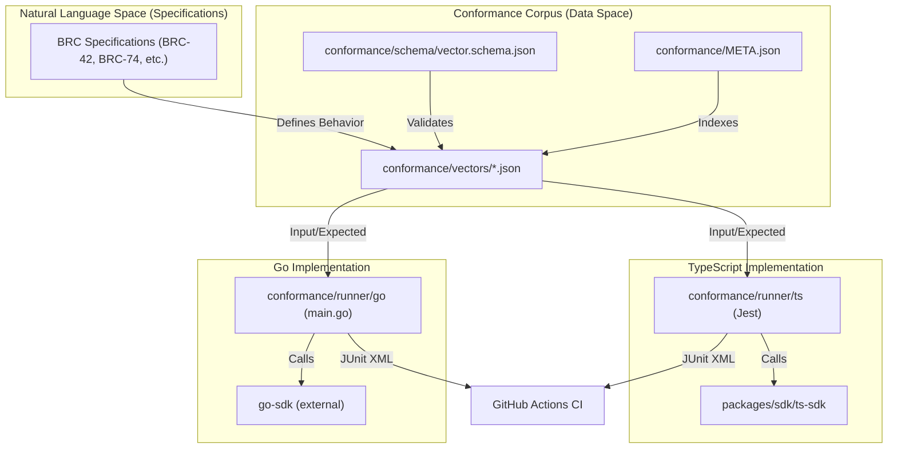
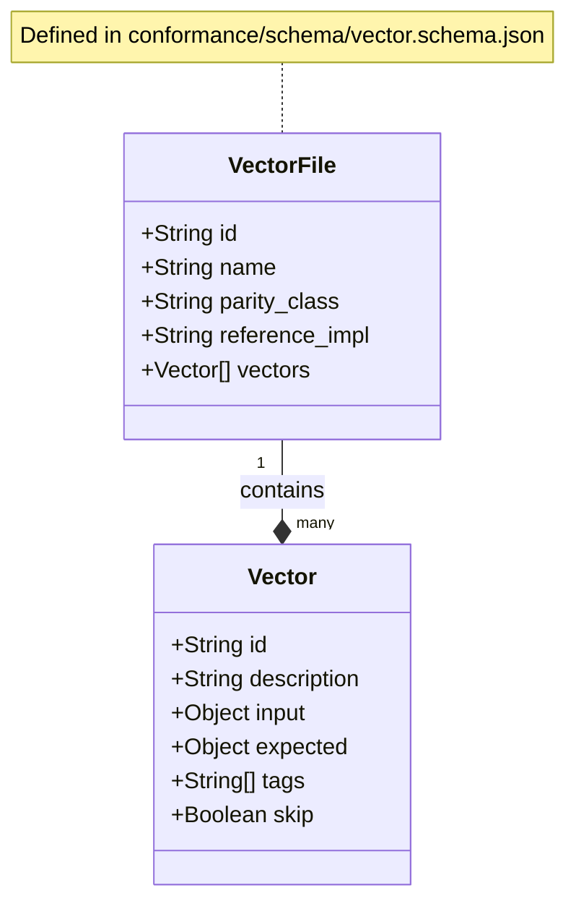

# Page: Conformance & Testing Framework

# Conformance & Testing Framework

Relevant source files

The following files were used as context for generating this wiki page:

- [conformance/META.json](https://github.com/bsv-blockchain/ts-stack/blob/main/conformance/META.json)
- [conformance/VECTOR-FORMAT.md](https://github.com/bsv-blockchain/ts-stack/blob/main/conformance/VECTOR-FORMAT.md)
- [conformance/runner/package.json](https://github.com/bsv-blockchain/ts-stack/blob/main/conformance/runner/package.json)
- [conformance/runner/src/runner.js](https://github.com/bsv-blockchain/ts-stack/blob/main/conformance/runner/src/runner.js)
- [conformance/schema/vector.schema.json](https://github.com/bsv-blockchain/ts-stack/blob/main/conformance/schema/vector.schema.json)
- [conformance/vectors/sdk/crypto/ecdsa.json](https://github.com/bsv-blockchain/ts-stack/blob/main/conformance/vectors/sdk/crypto/ecdsa.json)
- [conformance/vectors/sdk/crypto/ecies.json](https://github.com/bsv-blockchain/ts-stack/blob/main/conformance/vectors/sdk/crypto/ecies.json)
- [conformance/vectors/sdk/crypto/hmac.json](https://github.com/bsv-blockchain/ts-stack/blob/main/conformance/vectors/sdk/crypto/hmac.json)

The **Conformance & Testing Framework** is a language-neutral system designed to ensure that all BSV SDK implementations (TypeScript, Go, and others) behave identically. It provides a single source of truth for expected behavior, moving beyond unit tests into a cross-language verification pipeline.

The framework consists of a centralized **Vector Corpus**, standardized **JSON Schemas**, and per-language **Runners** that execute these vectors against their respective SDK implementations.

### System Architecture

The following diagram illustrates the relationship between the language-neutral vector corpus and the language-specific implementations.

**Cross-Language Conformance Flow**

**Sources:** [conformance/VECTOR-FORMAT.md:1-150](https://github.com/bsv-blockchain/ts-stack/blob/main/conformance/VECTOR-FORMAT.md#L1-L150), [conformance/META.json:1-32](https://github.com/bsv-blockchain/ts-stack/blob/main/conformance/META.json#L1-L32)

---

### Core Components

#### 1. Conformance Vector Corpus
The corpus is a collection of 27 JSON files containing 238+ test vectors [conformance/META.json:14-15](https://github.com/bsv-blockchain/ts-stack/blob/main/conformance/META.json#L14-L15). These vectors cover critical cryptographic and protocol logic, including:
*   **sdk.crypto**: AES, ECDSA, ECIES, HMAC, SHA256, RIPEMD160.
*   **sdk.keys**: BRC-42 key derivation, Private/Public key operations.
*   **sdk.transactions**: Merkle Path (BRC-74) and serialization.
*   **sdk.compat**: BSM (Bitcoin Signed Messages).

For details on the vector format and coverage, see [Conformance Vector Corpus](31-Conformance-Vector-Corpus.md).

#### 2. The Regression Queue
The framework tracks known cross-language bugs and edge cases via the `regression_index` in `conformance/META.json` [conformance/META.json:18-31](https://github.com/bsv-blockchain/ts-stack/blob/main/conformance/META.json#L18-L31). Each entry maps a specific vector ID to a GitHub issue (e.g., `beef-v2-txid-panic` mapping to `go-sdk#306`). This ensures that once a bug is fixed in one language, it never regresses in another.

#### 3. Conformance Runners
Runners are responsible for loading the JSON vectors, dispatching the `input` to the local SDK functions, and asserting that the output matches the `expected` field.
*   **TypeScript Runner**: Integrated into the monorepo using Jest; it uses dispatch functions to map vector IDs to `ts-sdk` classes like `ECDSA` [conformance/vectors/sdk/crypto/ecdsa.json:7](https://github.com/bsv-blockchain/ts-stack/blob/main/conformance/vectors/sdk/crypto/ecdsa.json#L7) or `ECIES`.
*   **Go Runner**: A standalone CLI tool that generates JUnit XML reports for CI consumption.

For details on runner implementation, see [TypeScript & Go Conformance Runners](32-TypeScript---Go-Conformance-Runners.md).

---

### Data Structures & Validation

Every vector file must adhere to a strict JSON Schema to ensure compatibility across different language runners.

**Vector Entity Mapping**

| Field | Purpose | Example |
| :--- | :--- | :--- |
| `id` | Stable dot-separated identifier | `sdk.crypto.hmac` |
| `parity_class` | Requirement level for implementations | `required`, `best-effort` |
| `reference_impl` | The SDK version used to generate the vector | `ts-sdk@2.0.14` |
| `input` | Domain-specific arguments (hex encoded) | `privkey_hex`, `message_hex` |
| `expected` | Expected result or behavior | `verify: true`, `hmac: "..."` |

**Sources:** [conformance/schema/vector.schema.json:1-52](https://github.com/bsv-blockchain/ts-stack/blob/main/conformance/schema/vector.schema.json#L1-L52), [conformance/VECTOR-FORMAT.md:80-132](https://github.com/bsv-blockchain/ts-stack/blob/main/conformance/VECTOR-FORMAT.md#L80-L132)

---

### CI Integration & Codegen

The conformance suite is executed on every Pull Request. The `conformance/runner/src/runner.js` script provides a reference implementation for validating the corpus structure [conformance/runner/src/runner.js:1-15](https://github.com/bsv-blockchain/ts-stack/blob/main/conformance/runner/src/runner.js#L1-L15).

*   **Validation**: The runner checks for required fields like `id`, `input`, and `expected` [conformance/runner/src/runner.js:80-117](https://github.com/bsv-blockchain/ts-stack/blob/main/conformance/runner/src/runner.js#L80-L117).
*   **Reporting**: Runners emit JUnit XML [conformance/runner/src/runner.js:141-173](https://github.com/bsv-blockchain/ts-stack/blob/main/conformance/runner/src/runner.js#L141-L173) which is parsed by GitHub Actions to provide a dashboard of cross-language compatibility.
*   **Codegen**: While vectors provide behavioral truth, service boundaries (OpenAPI/AsyncAPI) are used to generate the boilerplate code that these runners eventually test.

**Sources:** [conformance/runner/package.json:7-11](https://github.com/bsv-blockchain/ts-stack/blob/main/conformance/runner/package.json#L7-L11), [conformance/runner/src/runner.js:179-220](https://github.com/bsv-blockchain/ts-stack/blob/main/conformance/runner/src/runner.js#L179-L220)

---