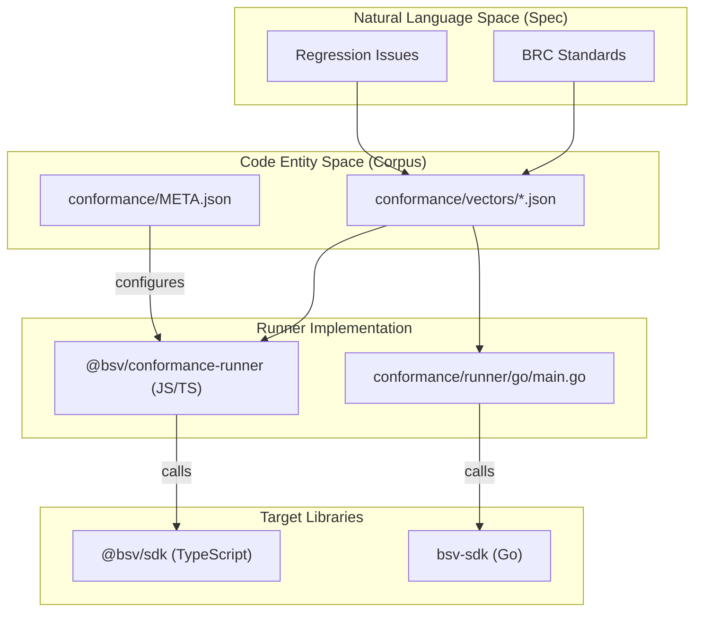
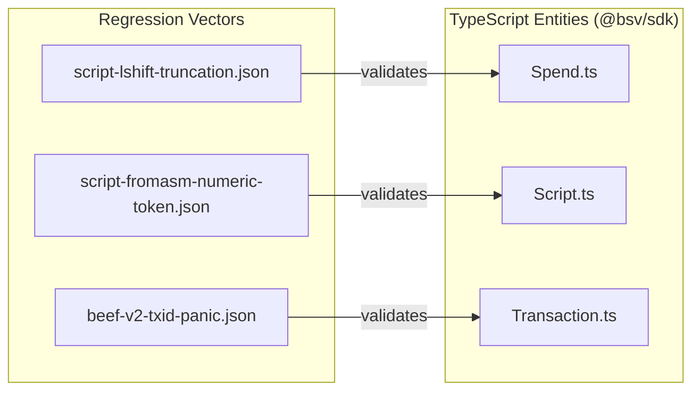

# Page: Conformance Vector Corpus

# Conformance Vector Corpus

<details>
<summary>Relevant source files</summary>

The following files were used as context for generating this wiki page:

- [conformance/META.json](conformance/META.json)
- [conformance/REGRESSION_QUEUE.md](conformance/REGRESSION_QUEUE.md)
- [conformance/VECTOR-FORMAT.md](conformance/VECTOR-FORMAT.md)
- [conformance/runner/package.json](conformance/runner/package.json)
- [conformance/runner/src/runner.js](conformance/runner/src/runner.js)
- [conformance/schema/vector.schema.json](conformance/schema/vector.schema.json)
- [conformance/vectors/regressions/beef-isvalid-hydration.json](conformance/vectors/regressions/beef-isvalid-hydration.json)
- [conformance/vectors/regressions/beef-v2-txid-panic.json](conformance/vectors/regressions/beef-v2-txid-panic.json)
- [conformance/vectors/regressions/bip276-hex-decode.json](conformance/vectors/regressions/bip276-hex-decode.json)
- [conformance/vectors/regressions/fee-model-mismatch.json](conformance/vectors/regressions/fee-model-mismatch.json)
- [conformance/vectors/regressions/merkle-path-odd-node.json](conformance/vectors/regressions/merkle-path-odd-node.json)
- [conformance/vectors/regressions/privatekey-modular-reduction.json](conformance/vectors/regressions/privatekey-modular-reduction.json)
- [conformance/vectors/regressions/script-fromasm-numeric-token.json](conformance/vectors/regressions/script-fromasm-numeric-token.json)
- [conformance/vectors/regressions/script-lshift-truncation.json](conformance/vectors/regressions/script-lshift-truncation.json)
- [conformance/vectors/regressions/script-shift-endianness.json](conformance/vectors/regressions/script-shift-endianness.json)
- [conformance/vectors/regressions/script-writebin-empty.json](conformance/vectors/regressions/script-writebin-empty.json)
- [conformance/vectors/regressions/tx-sequence-zero-sighash.json](conformance/vectors/regressions/tx-sequence-zero-sighash.json)
- [conformance/vectors/regressions/uhrp-url-parity.json](conformance/vectors/regressions/uhrp-url-parity.json)
- [conformance/vectors/sdk/crypto/aes.json](conformance/vectors/sdk/crypto/aes.json)
- [conformance/vectors/sdk/crypto/ecdsa.json](conformance/vectors/sdk/crypto/ecdsa.json)
- [conformance/vectors/sdk/crypto/ecies.json](conformance/vectors/sdk/crypto/ecies.json)
- [conformance/vectors/sdk/crypto/hash160.json](conformance/vectors/sdk/crypto/hash160.json)
- [conformance/vectors/sdk/crypto/hmac.json](conformance/vectors/sdk/crypto/hmac.json)
- [conformance/vectors/sdk/crypto/ripemd160.json](conformance/vectors/sdk/crypto/ripemd160.json)
- [conformance/vectors/sdk/crypto/sha256.json](conformance/vectors/sdk/crypto/sha256.json)
- [conformance/vectors/sdk/scripts/evaluation.json](conformance/vectors/sdk/scripts/evaluation.json)

</details>


The **Conformance Vector Corpus** is a language-agnostic collection of test vectors designed to ensure functional parity across different implementations of the BSV blockchain stack (primarily TypeScript and Go). It provides a single source of truth for cryptographic operations, transaction serialization, and script evaluation, alongside a dedicated regression suite for documented bugs.

The corpus is located in the `conformance/vectors/` directory and is governed by a strict JSON schema to facilitate automated parsing by multiple language runners [conformance/META.json:1-4]().

## Vector File Schema

Each vector file follows a standardized structure defined in the `vector.schema.json`. This ensures that runners can predictably dispatch tests based on the `id` and `parity_class`.

### Top-Level Envelope
A standard vector file contains metadata and an array of individual test cases [conformance/runner/src/runner.js:78-80]():
*   `id`: A unique dot-notated string (e.g., `sdk.crypto.sha256`).
*   `name`: Human-readable title of the test suite.
*   `brc`: Associated BRC standards (e.g., `BRC-42`, `BRC-74`) [conformance/META.json:5-12]().
*   `parity_class`: Categorization for runners to filter tests (e.g., `required`, `scripts`, `optional`).
*   `vectors`: An array of objects containing the actual test data.

### Individual Vector Structure
Each entry in the `vectors` array must contain [conformance/runner/src/runner.js:119-127]():
*   `id`: Unique identifier for the specific case (e.g., `sdk.crypto.sha256.1`).
*   `input`: An object containing the parameters for the function under test.
*   `expected`: The anticipated result, typically hex-encoded strings or boolean flags.

### Vector Data Flow
The following diagram illustrates how the JSON corpus is consumed by the various language runners to validate the SDK implementations.

**Vector Execution Pipeline**

Sources: [conformance/META.json:1-31](), [conformance/runner/src/runner.js:1-15](), [conformance/runner/package.json:1-10]()

## Corpus Coverage

The corpus is divided into domains and categories reflecting the `ts-stack` architecture [conformance/META.json:4]().

### Cryptographic Primitives (`sdk.crypto`)
These vectors cover foundational hashing and encryption algorithms used throughout the stack.

| Category | Vector File | Description |
| :--- | :--- | :--- |
| **AES** | `sdk/crypto/aes.json` | AES-GCM 128/192/256 encryption/decryption based on NIST FIPS 197 [conformance/vectors/sdk/crypto/aes.json:1-42](). |
| **SHA256** | `sdk/crypto/sha256.json` | Single and Double SHA-256 (hash256) of strings and binary data [conformance/vectors/sdk/crypto/sha256.json:1-51](). |
| **RIPEMD160** | `sdk/crypto/ripemd160.json` | RIPEMD-160 hashing for address generation [conformance/vectors/sdk/crypto/ripemd160.json:1-23](). |
| **Hash160** | `sdk/crypto/hash160.json` | SHA-256 followed by RIPEMD-160, covering P2PKH pubkey hashes [conformance/vectors/sdk/crypto/hash160.json:1-19](). |
| **ECDSA** | `sdk/crypto/ecdsa.json` | Secp256k1 signing and verification. |
| **ECIES** | `sdk/crypto/ecies.json` | Integrated Encryption Scheme for public-key encryption. |
| **HMAC** | `sdk/crypto/hmac.json` | Keyed-hash message authentication codes. |

### Keys and Signatures (`sdk.keys`)
Covers the lifecycle of cryptographic keys and hierarchical derivation.
*   **Private/Public Keys**: Validation of WIF, Hex, and DER formats.
*   **Key Derivation**: BRC-42 hierarchical derivation vectors [conformance/META.json:6]().
*   **BSM**: Bitcoin Signed Message (BRC-77) compatibility [conformance/META.json:8]().

### Transactions and Scripts (`sdk.transactions`, `sdk.scripts`)
Covers the complex logic of transaction serialization and the Bitcoin script engine.
*   **Serialization**: Transaction hex encoding and decoding.
*   **Merkle Path**: BRC-74 Merkle path validation and BUMP (Bitcoin Universal Merkle Path) formats [conformance/META.json:7]().
*   **Evaluation**: Script opcode parsing (e.g., `OP_0`, `OP_CHECKMULTISIG`) and P2PKH template generation [conformance/vectors/sdk/scripts/evaluation.json:10-64]().

## Regression Suite

The `conformance/vectors/regressions/` directory contains vectors specifically designed to prevent the reintroduction of known bugs. Each regression vector includes a `regression` metadata block referencing the original issue [conformance/vectors/regressions/beef-v2-txid-panic.json:6-11]().

### Key Regression Vectors

| Issue ID | Domain | Symptom | Fix Version |
| :--- | :--- | :--- | :--- |
| `go-sdk#306` | Transactions | Panic when calling `TxID()` on parsed BEEF_V2 data [conformance/vectors/regressions/beef-v2-txid-panic.json:7-10](). | Go v1.2.21 |
| `ts-sdk#493` | Script | `OP_LSHIFT` failed to truncate results to original byte length [conformance/vectors/regressions/script-lshift-truncation.json:7-11](). | TS v2.0.6 |
| `ts-sdk#377` | Script | Endianness swap during `OP_RSHIFT` and `OP_LSHIFT` operations [conformance/vectors/regressions/script-shift-endianness.json:7-10](). | TS v1.1.0 |
| `ts-sdk#42` | Script | `Script.fromASM()` misidentified hex strings as opcodes (e.g., '76' as `OP_DUP`) [conformance/vectors/regressions/script-fromasm-numeric-token.json:7-11](). | TS v1.0.0 |

### Regression Logic Association
This diagram maps the regression vectors to the specific code entities they protect.

**Regression Mapping**

Sources: [conformance/vectors/regressions/script-lshift-truncation.json:10-11](), [conformance/vectors/regressions/script-fromasm-numeric-token.json:7-8](), [conformance/vectors/regressions/beef-v2-txid-panic.json:5-10]()

## Validation and Reporting

The `conformance/runner/src/runner.js` script is the primary tool for validating the integrity of the corpus. It performs the following tasks:
1.  **Discovery**: Recursively finds all `.json` files in the `vectors/` directory [conformance/runner/src/runner.js:54-72]().
2.  **Schema Validation**: Ensures all required fields (`id`, `input`, `expected`) are present in every vector [conformance/runner/src/runner.js:119-127]().
3.  **JUnit Generation**: Emits reports in JUnit XML format for integration with CI/CD pipelines [conformance/runner/src/runner.js:141-173]().

Usage:
```bash
# Run validation and generate report
npm run report -- --report ./conformance/reports/results.xml
```
Sources: [conformance/runner/package.json:7-10](), [conformance/runner/src/runner.js:1-15]()

---