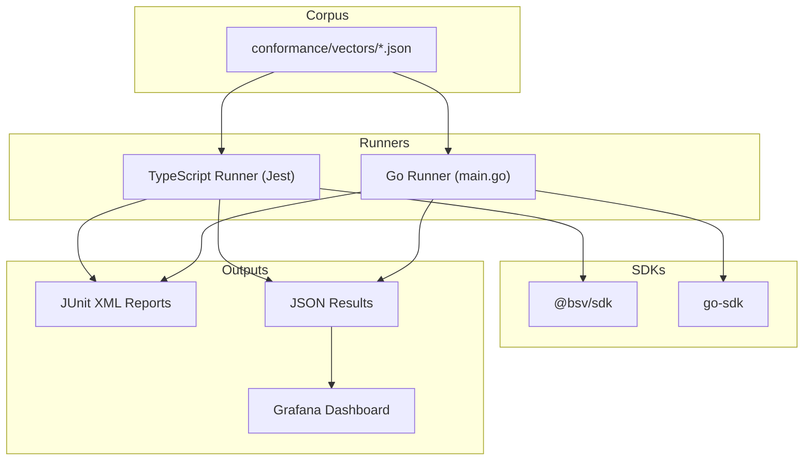
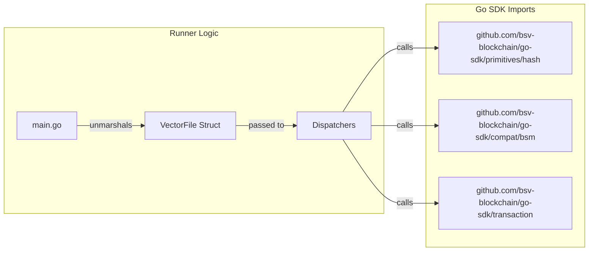
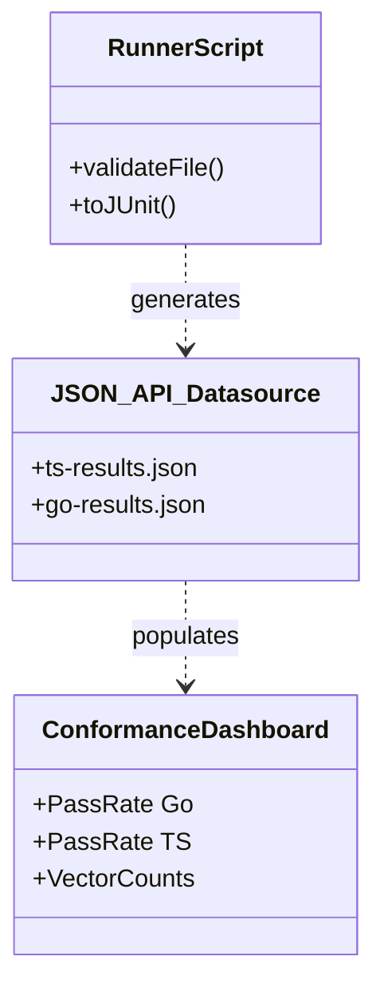

# Page: TypeScript & Go Conformance Runners

# TypeScript & Go Conformance Runners

Relevant source files

The following files were used as context for generating this wiki page:

- [conformance/GO_PLAN.md](conformance/GO_PLAN.md)
- [conformance/runner/go/go.mod](conformance/runner/go/go.mod)
- [conformance/runner/go/go.sum](conformance/runner/go/go.sum)
- [conformance/runner/go/main.go](conformance/runner/go/main.go)
- [conformance/runner/package.json](conformance/runner/package.json)
- [conformance/runner/scripts/dashboard.mjs](conformance/runner/scripts/dashboard.mjs)
- [conformance/runner/src/runner.js](conformance/runner/src/runner.js)
- [conformance/runner/ts/jest.config.mjs](conformance/runner/ts/jest.config.mjs)
- [conformance/runner/ts/package.json](conformance/runner/ts/package.json)
- [conformance/runner/ts/runner.test.ts](conformance/runner/ts/runner.test.ts)
- [conformance/runner/ts/tsconfig.json](conformance/runner/ts/tsconfig.json)
- [conformance/vectors/sdk/crypto/ecdsa.json](conformance/vectors/sdk/crypto/ecdsa.json)
- [conformance/vectors/sdk/crypto/ecies.json](conformance/vectors/sdk/crypto/ecies.json)
- [conformance/vectors/sdk/crypto/hmac.json](conformance/vectors/sdk/crypto/hmac.json)
- [packages/helpers/ts-paymail/docs/examples/package.json](packages/helpers/ts-paymail/docs/examples/package.json)
- [pnpm-lock.yaml](pnpm-lock.yaml)
- [specs/observability/conformance-dashboard.json](specs/observability/conformance-dashboard.json)

This page documents the multi-language conformance testing infrastructure used to ensure parity between the TypeScript and Go SDK implementations. The system relies on a shared vector corpus and language-specific runners that execute these vectors against their respective SDKs.

## Overview

The conformance system consists of three main components:
1.  **Vector Corpus**: A collection of JSON files containing test vectors (inputs and expected outputs) for various cryptographic and protocol functions.
2.  **TypeScript Runner**: A Jest-based test suite that executes vectors against the `@bsv/sdk` package.
3.  **Go Runner**: A CLI application that executes vectors against the `go-sdk` package and generates standardized reports.

### Data Flow & Reporting
The runners ingest JSON vectors and produce reports in JUnit XML and JSON formats. These reports are then consumed by a dashboard script to visualize the cross-language parity status.

Title: Conformance System Data Flow

Sources: [conformance/runner/src/runner.js:1-15](), [conformance/runner/ts/runner.test.ts:1-13](), [conformance/runner/go/main.go:31-61]()

---

## TypeScript Runner

The TypeScript runner is implemented as a Jest test suite located in `conformance/runner/ts`. It dynamically generates tests by crawling the vector corpus.

### Implementation Details
The runner uses `readdirSync` to recursively find all JSON files in the `conformance/vectors` directory [conformance/runner/ts/runner.test.ts:94-105](). For each file, it creates a Jest `describe` block, and for each vector within that file, it creates a `test` block [conformance/runner/ts/runner.test.ts:4-7]().

### Dispatch Pattern
The runner uses a dispatch pattern where vectors are routed to specific handler functions based on the filename or category:
*   **SHA256**: `dispatchSHA256` [conformance/runner/ts/runner.test.ts:113-125]()
*   **RIPEMD160**: `dispatchRIPEMD160` [conformance/runner/ts/runner.test.ts:127-136]()
*   **HMAC**: `dispatchHMAC` [conformance/runner/ts/runner.test.ts:155-180]()
*   **ECDSA**: `dispatchECDSA` [conformance/runner/ts/runner.test.ts:182-243]()

### Skip Logic
The runner implements specific logic to handle gaps in implementation or vectors intended for other languages:
*   **Parity Class**: If `parity_class` is set to `"intended"`, the test is skipped as it represents a documented gap rather than a bug [conformance/runner/ts/runner.test.ts:9]().
*   **Explicit Skip**: Vectors with `skip: true` are bypassed [conformance/runner/ts/runner.test.ts:10]().
*   **Unimplemented Features**: If a category or SDK function is not recognized, the test passes vacuously to avoid breaking CI on new vector additions [conformance/runner/ts/runner.test.ts:11-12]().

Sources: [conformance/runner/ts/runner.test.ts:1-243](), [conformance/runner/ts/package.json:1-16]()

---

## Go Runner

The Go runner is a standalone CLI tool located in `conformance/runner/go`. Unlike the Jest-based TS runner, it is a custom implementation designed to bridge the `ts-stack` repository with the external `go-sdk`.

### CLI Configuration
The runner supports several flags for execution:
*   `--vectors`: Path to the vector directory.
*   `--report-xml`: Path to output JUnit XML.
*   `--report-json`: Path to output JSON summary.

### Result Types
The Go runner explicitly tracks implementation status using a `Status` type:
*   `StatusPass`: Test succeeded.
*   `StatusFail`: Test failed (mismatch or error).
*   `StatusSkip`: Test was explicitly skipped.
*   `StatusNotImplemented`: The Go SDK lacks the required feature [conformance/runner/go/main.go:48-53]().

### Dispatcher Mapping
The `main.go` file contains a suite of dispatch functions that map JSON vector inputs to `go-sdk` primitives:

| Function | Go SDK Entity |
| :--- | :--- |
| `dispatchSHA256` | `primhash.Sha256`, `primhash.Sha256d` [conformance/runner/go/main.go:200-223]() |
| `dispatchRIPEMD160` | `primhash.Ripemd160` [conformance/runner/go/main.go:226-243]() |
| `dispatchHMAC` | `primhash.Sha256hmac`, `primhash.Sha512hmac` [conformance/runner/go/main.go:271-301]() |
| `dispatchAESGCM` | `primaesgcm.Encrypt`, `primaesgcm.Decrypt` [conformance/runner/go/main.go:304-350]() |
| `dispatchBSM` | `gobsm.VerifyMessage`, `gobsm.SignMessage` [conformance/runner/go/main.go:577-620]() |

Title: Go Runner Entity Mapping

Sources: [conformance/runner/go/main.go:1-620](), [conformance/runner/go/go.mod:1-16]()

---

## Reporting & Dashboard

The conformance system produces standardized outputs to allow for cross-language comparison.

### JUnit XML Schema
Both runners generate JUnit-compatible XML, allowing integration with standard CI tools like GitHub Actions. The Go runner implements this via `JUnitSuites`, `JUnitSuite`, and `JUnitCase` structs [conformance/runner/go/main.go:65-94]().

### JSON Reports
In addition to XML, the runners generate JSON summaries used for the Grafana dashboard. These summaries include:
*   `pass_rate`: Percentage of passing vectors [specs/observability/conformance-dashboard.json:117]().
*   `total`/`passed`/`failed`/`skipped`: Raw counts [specs/observability/conformance-dashboard.json:160-164]().

### Dashboard Script
The `conformance/runner/src/runner.js` script serves as a general-purpose utility for:
1.  **Validation**: Checking that vector files follow the required schema (requiring `id`, `input`, and `expected` fields) [conformance/runner/src/runner.js:80-117]().
2.  **Report Aggregation**: Combining results into the final output directory [conformance/runner/src/runner.js:29]().

Title: Dashboard Integration

Sources: [conformance/runner/src/runner.js:132-173](), [specs/observability/conformance-dashboard.json:1-124]()

---

## CI Integration

The runners are executed as part of the GitHub Actions CI pipeline. 
*   The TypeScript runner is triggered via `pnpm test` in the `conformance/runner/ts` directory [conformance/runner/ts/package.json:6]().
*   The Go runner is executed using `go run main.go` with appropriate flags to point at the shared `conformance/vectors` directory [conformance/runner/go/main.go:9-15]().

Failure in any conformance vector (that is not marked as `skip` or `intended` parity gap) results in a non-zero exit code, blocking the PR [conformance/runner/src/runner.js:12-15]().

Sources: [conformance/runner/package.json:7-11](), [conformance/runner/ts/package.json:5-7](), [conformance/runner/src/runner.js:179-225]()

---