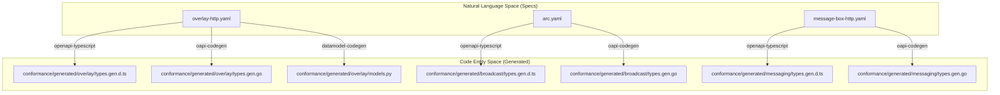
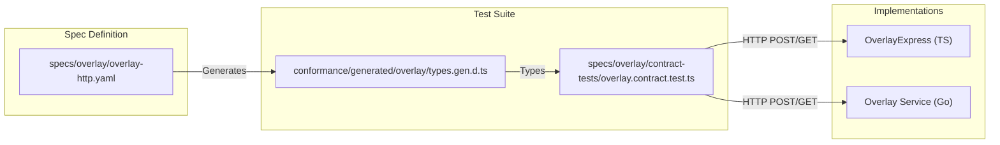

# Page: API Specifications & Code Generation

# API Specifications & Code Generation

Relevant source files

The following files were used as context for generating this wiki page:

- [.github/workflows/codegen.yml](https://github.com/bsv-blockchain/ts-stack/blob/main/.github/workflows/codegen.yml)
- [conformance/generated/broadcast/types.rs.TODO](https://github.com/bsv-blockchain/ts-stack/blob/main/conformance/generated/broadcast/types.rs.TODO)
- [conformance/generated/messaging/types.rs.TODO](https://github.com/bsv-blockchain/ts-stack/blob/main/conformance/generated/messaging/types.rs.TODO)
- [conformance/generated/overlay/types.rs.TODO](https://github.com/bsv-blockchain/ts-stack/blob/main/conformance/generated/overlay/types.rs.TODO)
- [specs/EXCEPTIONS.md](https://github.com/bsv-blockchain/ts-stack/blob/main/specs/EXCEPTIONS.md)
- [specs/README.md](https://github.com/bsv-blockchain/ts-stack/blob/main/specs/README.md)
- [specs/auth/brc31-handshake.yaml](https://github.com/bsv-blockchain/ts-stack/blob/main/specs/auth/brc31-handshake.yaml)
- [specs/messaging/authsocket-asyncapi.yaml](https://github.com/bsv-blockchain/ts-stack/blob/main/specs/messaging/authsocket-asyncapi.yaml)
- [specs/messaging/message-box-http.yaml](https://github.com/bsv-blockchain/ts-stack/blob/main/specs/messaging/message-box-http.yaml)

This section documents the machine-readable contracts that define the service boundaries for the BSV Distributed Applications Stack. The `specs/` directory serves as the single source of truth for all Tier-1 interfaces [specs/README.md:1-5](https://github.com/bsv-blockchain/ts-stack/blob/main/specs/README.md#L1-L5). By using formal specifications (OpenAPI, AsyncAPI, and JSON Schema), the repository enforces cross-language consistency and enables an automated pipeline for code generation and contract testing [specs/README.md:12-18](https://github.com/bsv-blockchain/ts-stack/blob/main/specs/README.md#L12-L18).

## Service Boundary Specifications

The `specs/` directory contains the definitions for all critical system boundaries. These specifications move the codebase away from "read the source" documentation toward stable, explicit contracts [specs/README.md:14](https://github.com/bsv-blockchain/ts-stack/blob/main/specs/README.md#L14).

### Core Specification Inventory

| Domain | Spec File | Format | Boundary Description |
|:-------|:----------|:-------|:---------------------|
| **Wallet** | `sdk/brc-100-wallet.json` | JSON Schema | BRC-100 wallet interface methods [specs/README.md:68](https://github.com/bsv-blockchain/ts-stack/blob/main/specs/README.md#L68). |
| **Overlay** | `overlay/overlay-http.yaml` | OpenAPI 3.1 | Submit, lookup, discovery, and admin [specs/README.md:69](https://github.com/bsv-blockchain/ts-stack/blob/main/specs/README.md#L69). |
| **Broadcast** | `broadcast/arc.yaml` | OpenAPI 3.1 | ARC submit, status, batch, and callback [specs/README.md:70](https://github.com/bsv-blockchain/ts-stack/blob/main/specs/README.md#L70). |
| **Messaging** | `messaging/message-box-http.yaml` | OpenAPI 3.1 | REST endpoints for message-box-server [specs/README.md:73](https://github.com/bsv-blockchain/ts-stack/blob/main/specs/README.md#L73). |
| **Auth** | `auth/brc31-handshake.yaml` | AsyncAPI 3.0 | BRC-31 mutual auth handshake [specs/README.md:75](https://github.com/bsv-blockchain/ts-stack/blob/main/specs/README.md#L75). |
| **Payments** | `payments/brc121.yaml` | OpenAPI 3.1 | BRC-121 HTTP 402 payment middleware [specs/README.md:77](https://github.com/bsv-blockchain/ts-stack/blob/main/specs/README.md#L77). |
| **Sync** | `sync/gasp-asyncapi.yaml` | AsyncAPI 3.0 | GASP cross-node sync protocol [specs/README.md:78](https://github.com/bsv-blockchain/ts-stack/blob/main/specs/README.md#L78). |

For a full list of all 13+ specifications and the error taxonomy, see **[Service Boundary Specifications](34-Service-Boundary-Specifications.md)**.

**Sources:** [specs/README.md:21-60](https://github.com/bsv-blockchain/ts-stack/blob/main/specs/README.md#L21-L60), [specs/README.md:66-81](https://github.com/bsv-blockchain/ts-stack/blob/main/specs/README.md#L66-L81), [specs/EXCEPTIONS.md:22-30](https://github.com/bsv-blockchain/ts-stack/blob/main/specs/EXCEPTIONS.md#L22-L30)

---

## Automated Code Generation

The repository utilizes a GitHub Actions workflow defined in `.github/workflows/codegen.yml` to ensure that types across TypeScript, Go, and Python remain synchronized with the specifications [codegen.yml:1-5](https://github.com/bsv-blockchain/ts-stack/blob/main/codegen.yml#L1-L5).

### Codegen Pipeline Architecture

The pipeline follows a strict rule: **hand-rolled types for spec-defined shapes are a CI failure** [specs/README.md:7-8](https://github.com/bsv-blockchain/ts-stack/blob/main/specs/README.md#L7-L8). When a specification changes, the following tools are invoked:

*   **TypeScript:** `openapi-typescript` generates definition files (`.d.ts`) [codegen.yml:53-54](https://github.com/bsv-blockchain/ts-stack/blob/main/codegen.yml#L53-L54).
*   **Go:** `oapi-codegen` generates type structures and package-level definitions [codegen.yml:22-24](https://github.com/bsv-blockchain/ts-stack/blob/main/codegen.yml#L22-L24).
*   **Python:** `datamodel-code-generator` produces Pydantic v2 models [codegen.yml:82-86](https://github.com/bsv-blockchain/ts-stack/blob/main/codegen.yml#L82-L86).

### Code Entity Mapping

The following diagram illustrates how the natural language specifications are transformed into specific code entities within the `conformance/generated/` directory.

**Specification to Code Entity Mapping**

**Sources:** [codegen.yml:19-36](https://github.com/bsv-blockchain/ts-stack/blob/main/codegen.yml#L19-L36), [codegen.yml:50-64](https://github.com/bsv-blockchain/ts-stack/blob/main/codegen.yml#L50-L64), [codegen.yml:79-102](https://github.com/bsv-blockchain/ts-stack/blob/main/codegen.yml#L79-L102), [specs/README.md:137-142](https://github.com/bsv-blockchain/ts-stack/blob/main/specs/README.md#L137-L142)

---

## Contract Testing

Contract tests verify that a running implementation (regardless of the language it is written in) conforms to the published specification [specs/README.md:160-162](https://github.com/bsv-blockchain/ts-stack/blob/main/specs/README.md#L160-L162). These tests are written in TypeScript using Vitest and can be pointed at local or remote endpoints [specs/README.md:165-168](https://github.com/bsv-blockchain/ts-stack/blob/main/specs/README.md#L165-L168).

### Testing Flow

The following diagram shows the relationship between the `specs/` definitions, the generated types used in tests, and the target service implementations.

**Contract Testing Workflow**

For details on running these suites and the `schemathesis` integration, see **[Automated Code Generation & Contract Tests](35-Automated-Code-Generation---Contract-Tests.md)**.

**Sources:** [specs/README.md:158-183](https://github.com/bsv-blockchain/ts-stack/blob/main/specs/README.md#L158-L183), [codegen.yml:52-54](https://github.com/bsv-blockchain/ts-stack/blob/main/codegen.yml#L52-L54), [specs/overlay/overlay-http.yaml:1-10](https://github.com/bsv-blockchain/ts-stack/blob/main/specs/overlay/overlay-http.yaml#L1-L10)

---