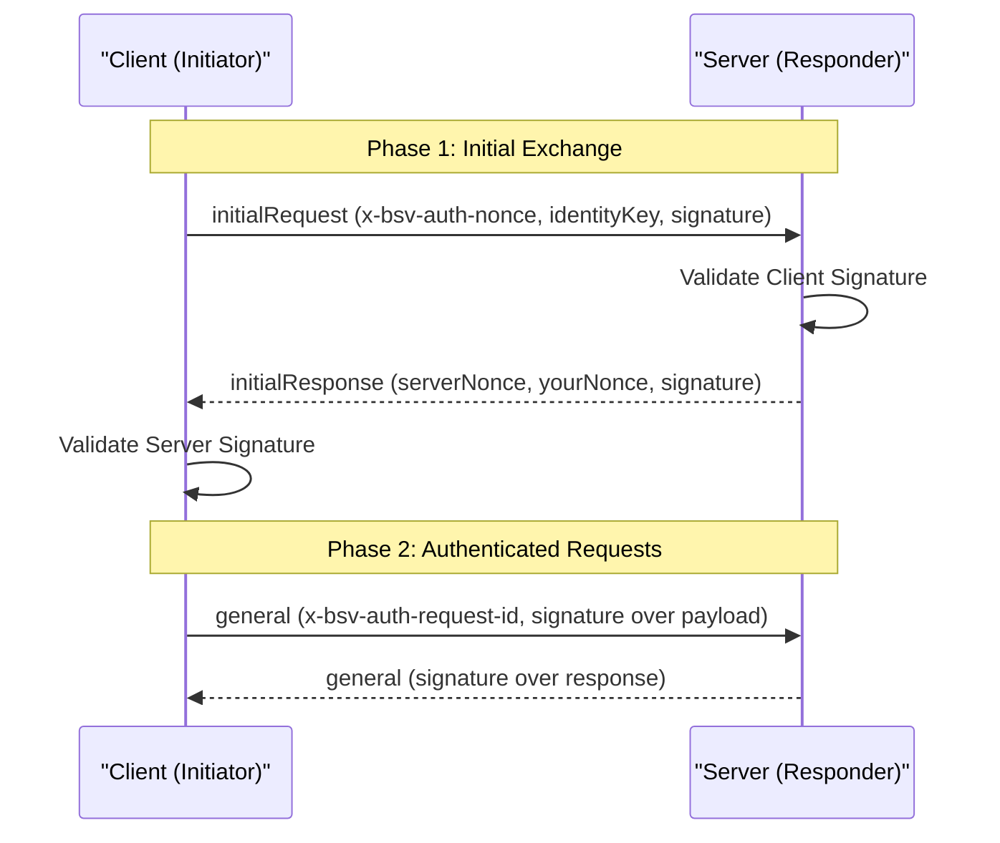
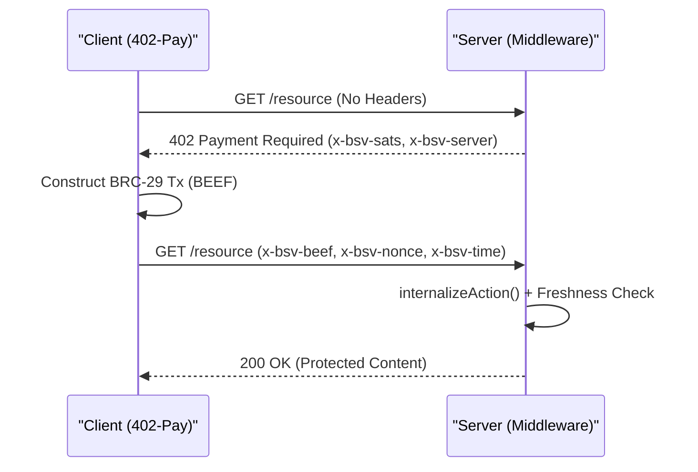
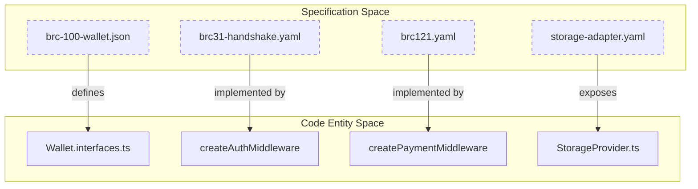

# Page: Service Boundary Specifications

# Service Boundary Specifications

Relevant source files

The following files were used as context for generating this wiki page:

- [specs/EXCEPTIONS.md](specs/EXCEPTIONS.md)
- [specs/README.md](specs/README.md)
- [specs/auth/brc31-handshake.yaml](specs/auth/brc31-handshake.yaml)
- [specs/broadcast/arc.yaml](specs/broadcast/arc.yaml)
- [specs/errors.md](specs/errors.md)
- [specs/merkle/merkle-service-http.yaml](specs/merkle/merkle-service-http.yaml)
- [specs/messaging/authsocket-asyncapi.yaml](specs/messaging/authsocket-asyncapi.yaml)
- [specs/messaging/message-box-http.yaml](specs/messaging/message-box-http.yaml)
- [specs/overlay/overlay-http.yaml](specs/overlay/overlay-http.yaml)
- [specs/payments/brc121.yaml](specs/payments/brc121.yaml)
- [specs/payments/brc29-payment-protocol.yaml](specs/payments/brc29-payment-protocol.yaml)
- [specs/sdk/brc-100-wallet.json](specs/sdk/brc-100-wallet.json)
- [specs/storage/uhrp-http.yaml](specs/storage/uhrp-http.yaml)
- [specs/sync/gasp-asyncapi.yaml](specs/sync/gasp-asyncapi.yaml)
- [specs/wallet/storage-adapter.yaml](specs/wallet/storage-adapter.yaml)

This page documents the machine-readable contracts for every Tier 1 service boundary in the BSV Distributed Applications Stack. These specifications serve as the single source of truth for the repository; all language-specific types (TypeScript, Go, Python, Rust) and client stubs are derived from these files via automated codegen pipelines [specs/README.md:1-9]().

## Overview of Specification Types

The stack utilizes three primary formats to define boundaries based on the communication pattern:

| Pattern | Specification Format | Primary Use Cases |
| :--- | :--- | :--- |
| **HTTP / REST** | OpenAPI 3.1 | Overlay Services, ARC, MessageBox, UHRP, Merkle Service |
| **WebSocket / Events** | AsyncAPI 3.0 | AuthSocket, BRC-31 Handshake, GASP Sync, BRC-29 Payments |
| **Language Interfaces** | JSON Schema (2020-12) | BRC-100 Wallet Interface |

Sources: [specs/README.md:64-81](), [specs/README.md:87-110]()

## Core Wallet & Identity Specs

### BRC-100 Wallet Interface
The `brc-100-wallet.json` schema defines the standard API surface for a BSV wallet. It uses `$defs` to specify request and response pairs for methods like `createAction`, `listActions`, and `encrypt`.

*   **Key Primitives**: Defines `TXIDHexString` (64 chars), `PubKeyHex` (66 chars), and `SatoshiValue` (max 2.1 quadrillion) [specs/sdk/brc-100-wallet.json:14-46]().
*   **Security Levels**: Implements BRC-43 security levels: `0` (Silent), `1` (App), and `2` (Counterparty) [specs/sdk/brc-100-wallet.json:117-121]().

### BRC-31 Mutual Authentication Handshake
Defined in `brc31-handshake.yaml`, this protocol establishes a shared, forward-secret session between two parties using ECDH-derived keys [specs/auth/brc31-handshake.yaml:18-20]().

**Handshake Flow Diagram**

Sources: [specs/auth/brc31-handshake.yaml:22-78]()

## Messaging & Communication

### MessageBox & AuthSocket
The Messaging layer is split between a RESTful store-and-forward API and a real-time WebSocket layer.

*   **MessageBox HTTP**: 9 endpoints for sending and retrieving messages. All require `x-bsv-auth-*` headers [specs/messaging/message-box-http.yaml:7-13]().
*   **AuthSocket**: An AsyncAPI spec for the `AuthSocketServer`. It wraps Socket.IO events (like `joinRoom`, `sendMessage`, and `message`) inside BRC-103 `general` envelopes for end-to-end authentication [specs/messaging/authsocket-asyncapi.yaml:19-34]().

### GASP Sync Protocol
The Graph Aware Sync Protocol (`gasp-asyncapi.yaml`) facilitates cross-node UTXO synchronization. It uses a request/response pattern to walk the transaction graph, ensuring nodes only transfer missing data [specs/sync/gasp-asyncapi.yaml:11-15]().

Sources: [specs/sync/gasp-asyncapi.yaml:19-34](), [specs/messaging/authsocket-asyncapi.yaml:152-205]()

## Payment Protocols

### BRC-29 & BRC-121
These specs define how payments are negotiated and delivered between peers.

*   **BRC-29**: Defines the `PaymentMessage` containing Atomic BEEF (BRC-95) and BRC-42 key derivation parameters (`derivationPrefix` and `derivationSuffix`) [specs/payments/brc29-payment-protocol.yaml:74-79]().
*   **BRC-121 (HTTP 402)**: Monetizes HTTP resources. If a request lacks payment, the server returns `402 Payment Required` with `x-bsv-sats` and `x-bsv-server` headers [specs/payments/brc121.yaml:9-18]().

**BRC-121 Payment Flow**

Sources: [specs/payments/brc121.yaml:9-36]()

## Storage & Merkle Infrastructure

### Wallet Storage Adapter
Documents the HTTP boundary between `wallet-toolbox` and a remote storage provider. It maps the `StorageProvider` TypeScript interface to REST endpoints like `/actions`, `/migrate`, and `/settings` [specs/wallet/storage-adapter.yaml:12-33]().

### UHRP & Merkle Service
*   **UHRP (BRC-26)**: Content-addressed storage resolution. Resolves `uhrp://` URLs (Base58Check SHA-256 hashes) to download URLs via the `ls_uhrp` lookup service [specs/storage/uhrp-http.yaml:13-30]().
*   **Merkle Service**: A Go microservice that monitors `txids` and POSTs BUMP proofs to a `callbackUrl` upon confirmation [specs/merkle/merkle-service-http.yaml:9-12]().

## Code Entity Mapping

The following diagram bridges the high-level specifications to the specific classes and files that implement them within the `ts-stack`.

**Specification to Implementation Mapping**

Sources: [specs/auth/brc31-handshake.yaml:10-15](), [specs/wallet/storage-adapter.yaml:28-32](), [specs/payments/brc121.yaml:38-40]()

## Error Taxonomy
The `errors.md` file (referenced by all OpenAPI/AsyncAPI specs) provides the canonical error taxonomy. Implementations are required to use these machine-readable codes (e.g., `ERR_AUTH_REQUIRED`) rather than ad-hoc strings to ensure cross-language consistency [specs/README.md:187-194]().

Sources: [specs/README.md:26](), [specs/messaging/message-box-http.yaml:79-83]()

---