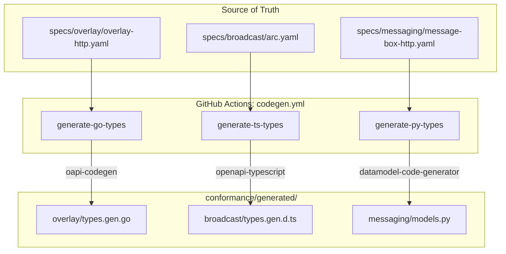
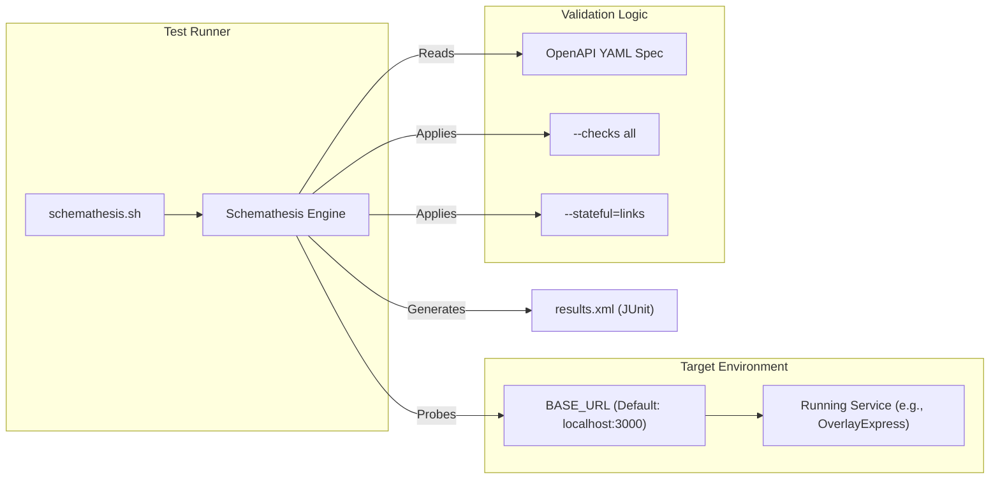

# Page: Automated Code Generation & Contract Tests

# Automated Code Generation & Contract Tests

<details>
<summary>Relevant source files</summary>

The following files were used as context for generating this wiki page:

- [.github/workflows/codegen.yml](.github/workflows/codegen.yml)
- [conformance/generated/.gitkeep](conformance/generated/.gitkeep)
- [conformance/generated/README.md](conformance/generated/README.md)
- [conformance/generated/broadcast/types.rs.TODO](conformance/generated/broadcast/types.rs.TODO)
- [conformance/generated/messaging/types.rs.TODO](conformance/generated/messaging/types.rs.TODO)
- [conformance/generated/overlay/types.rs.TODO](conformance/generated/overlay/types.rs.TODO)
- [specs/broadcast/contract-tests/README.md](specs/broadcast/contract-tests/README.md)
- [specs/broadcast/contract-tests/schemathesis.sh](specs/broadcast/contract-tests/schemathesis.sh)
- [specs/messaging/contract-tests/README.md](specs/messaging/contract-tests/README.md)
- [specs/messaging/contract-tests/schemathesis.sh](specs/messaging/contract-tests/schemathesis.sh)
- [specs/overlay/contract-tests/README.md](specs/overlay/contract-tests/README.md)
- [specs/overlay/contract-tests/schemathesis.sh](specs/overlay/contract-tests/schemathesis.sh)
- [specs/reliability/README.md](specs/reliability/README.md)
- [specs/reliability/arc.md](specs/reliability/arc.md)
- [specs/reliability/go-sdk.md](specs/reliability/go-sdk.md)
- [specs/reliability/message-box-server.md](specs/reliability/message-box-server.md)
- [specs/reliability/overlay-express.md](specs/reliability/overlay-express.md)
- [specs/reliability/ts-sdk.md](specs/reliability/ts-sdk.md)
- [specs/reliability/wallet-toolbox.md](specs/reliability/wallet-toolbox.md)

</details>


This page documents the automated pipeline for maintaining consistency between the service boundary specifications and the multi-language implementations within the TS-Stack. The repository utilizes a central source-of-truth in the `specs/` directory to drive type generation for Go, TypeScript, and Python, while ensuring implementation compliance via property-based contract testing.

## Automated Codegen Workflow

The repository employs a GitHub Actions workflow, `codegen.yml`, which monitors changes to OpenAPI specifications and automatically regenerates type definitions across supported languages [.github/workflows/codegen.yml:1-7](). This ensures that the `conformance/generated/` directory always reflects the latest service definitions.

### Multi-Language Implementation
The workflow is divided into jobs for each target language:

| Language | Tooling | Output Format | Target Path |
| :--- | :--- | :--- | :--- |
| **Go** | `oapi-codegen` | Go Structs | `conformance/generated/**/types.gen.go` |
| **TypeScript** | `openapi-typescript` | Ambient Definitions | `conformance/generated/**/types.gen.d.ts` |
| **Python** | `datamodel-codegen` | Pydantic v2 Models | `conformance/generated/**/models.py` |
| **Rust** | `typify` (Manual) | Rust Types | `conformance/generated/**/types.rs.TODO` |

### Data Flow Diagram: Spec to Code
The following diagram illustrates how a change in a specification file propagates through the codegen pipeline to the generated outputs.

**Codegen Propagation Path**

**Sources:** [.github/workflows/codegen.yml:10-106](), [conformance/generated/README.md:1-15]()

---

## Output Structure

Generated code is organized by domain within the `conformance/generated/` directory. This directory acts as a shared resource for conformance runners and cross-language validation [.github/workflows/codegen.yml:41]().

### Domain Mappings
The pipeline targets three primary service domains:

1.  **Overlay**: Based on `specs/overlay/overlay-http.yaml` [.github/workflows/codegen.yml:23]().
2.  **Broadcast (ARC)**: Based on `specs/broadcast/arc.yaml` [.github/workflows/codegen.yml:29]().
3.  **Messaging**: Based on `specs/messaging/message-box-http.yaml` [.github/workflows/codegen.yml:35]().

### Rust Generation
Rust support is currently handled via placeholders due to the requirement for a `Cargo` workspace context. The workflow creates `.TODO` files containing the necessary `typify` commands for manual execution within a Rust project [.github/workflows/codegen.yml:112-137]().

**Sources:** [conformance/generated/overlay/types.rs.TODO:1-4](), [conformance/generated/broadcast/types.rs.TODO:1-4](), [conformance/generated/messaging/types.rs.TODO:1-4]()

---

## Schemathesis Contract Testing

To ensure that running services (Overlay, Messaging, ARC) strictly adhere to their OpenAPI specifications, the repository includes a suite of property-based contract tests powered by **Schemathesis**.

### Testing Strategy
The contract tests perform the following actions:
*   **Spec Validation**: Reads the local `.yaml` specification file [specs/overlay/contract-tests/schemathesis.sh:7]().
*   **Property-Based Fuzzing**: Generates a wide range of valid and invalid inputs to test edge cases (`--checks all`) [specs/messaging/contract-tests/schemathesis.sh:9]().
*   **Stateful Testing**: Follows OpenAPI response links to verify state transitions across multiple requests (`--stateful=links`) [specs/broadcast/contract-tests/schemathesis.sh:10]().
*   **Reporting**: Outputs JUnit-compatible XML results for CI integration [specs/overlay/contract-tests/schemathesis.sh:11]().

### Contract Test Execution
The tests are executed via `schemathesis.sh` scripts located in the `contract-tests` subdirectory of each domain.

**System Entity Association**


**Usage Example:**
To run contract tests against a local Messaging server:
```bash
BASE_URL=http://localhost:3001 bash specs/messaging/contract-tests/schemathesis.sh
```

**Sources:** [specs/overlay/contract-tests/README.md:1-27](), [specs/messaging/contract-tests/schemathesis.sh:1-12](), [specs/broadcast/contract-tests/schemathesis.sh:1-12]()

---