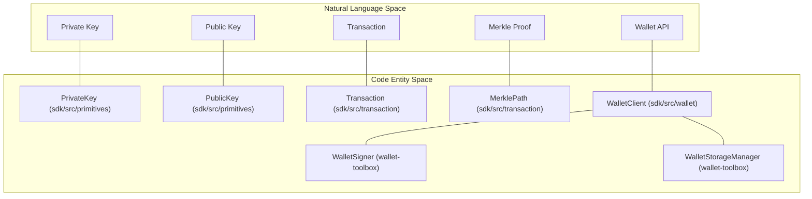
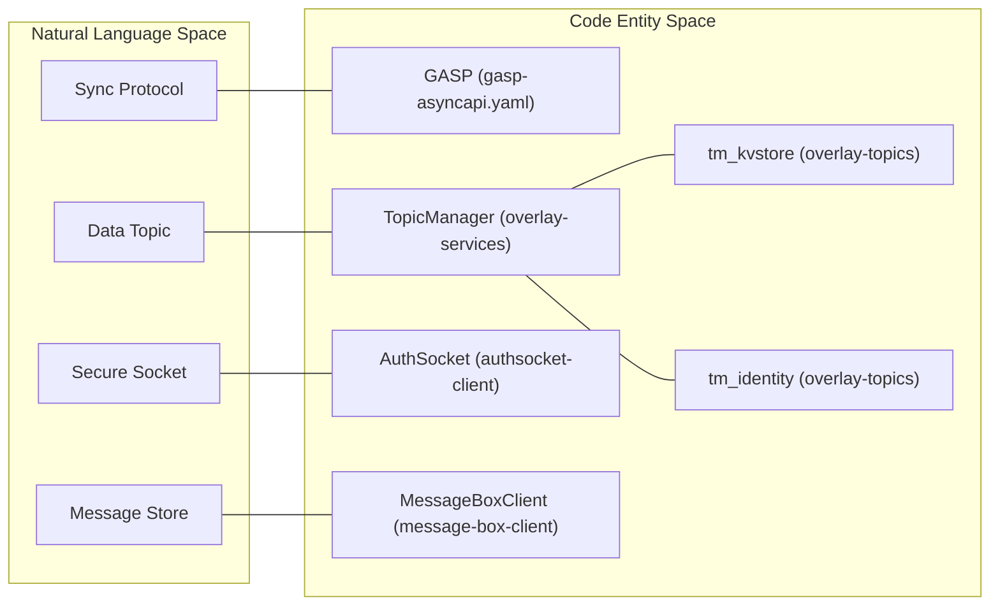

# Page: Glossary

# Glossary

Relevant source files

The following files were used as context for generating this wiki page:

- [.editorconfig](.editorconfig)
- [.gitignore](.gitignore)
- [.npmrc](.npmrc)
- [README.md](README.md)
- [conformance/runner/go/go.mod](conformance/runner/go/go.mod)
- [conformance/runner/go/go.sum](conformance/runner/go/go.sum)
- [conformance/runner/go/main.go](conformance/runner/go/main.go)
- [conformance/runner/package.json](conformance/runner/package.json)
- [conformance/runner/src/runner.js](conformance/runner/src/runner.js)
- [conformance/vectors/README.md](conformance/vectors/README.md)
- [conformance/vectors/sdk/crypto/ecdsa.json](conformance/vectors/sdk/crypto/ecdsa.json)
- [conformance/vectors/sdk/crypto/ecies.json](conformance/vectors/sdk/crypto/ecies.json)
- [conformance/vectors/sdk/crypto/hmac.json](conformance/vectors/sdk/crypto/hmac.json)
- [package.json](package.json)
- [packages/messaging/message-box-server/package.json](packages/messaging/message-box-server/package.json)
- [packages/overlays/topics/BASELINE.md](packages/overlays/topics/BASELINE.md)
- [packages/overlays/topics/src/__tests__/desktopintegrity.test.ts](packages/overlays/topics/src/__tests__/desktopintegrity.test.ts)
- [packages/overlays/topics/src/__tests__/monsterbattle.test.ts](packages/overlays/topics/src/__tests__/monsterbattle.test.ts)
- [packages/overlays/topics/src/__tests__/utility-tokens.test.ts](packages/overlays/topics/src/__tests__/utility-tokens.test.ts)
- [packages/wallet/btms/README.md](packages/wallet/btms/README.md)
- [packages/wallet/btms/index.ts](packages/wallet/btms/index.ts)
- [packages/wallet/btms/jest.config.js](packages/wallet/btms/jest.config.js)
- [packages/wallet/btms/package-lock.json](packages/wallet/btms/package-lock.json)
- [packages/wallet/btms/package.json](packages/wallet/btms/package.json)
- [packages/wallet/btms/src/BTMS.ts](packages/wallet/btms/src/BTMS.ts)
- [packages/wallet/btms/src/BTMSAdvanced.ts](packages/wallet/btms/src/BTMSAdvanced.ts)
- [specs/EXCEPTIONS.md](specs/EXCEPTIONS.md)
- [specs/README.md](specs/README.md)
- [specs/auth/brc31-handshake.yaml](specs/auth/brc31-handshake.yaml)
- [specs/messaging/authsocket-asyncapi.yaml](specs/messaging/authsocket-asyncapi.yaml)
- [specs/messaging/message-box-http.yaml](specs/messaging/message-box-http.yaml)
- [tsconfig.base.json](tsconfig.base.json)

This page provides a comprehensive glossary of domain-specific terms, Bitcoin Request for Comment (BRC) standards, and protocol acronyms used throughout the `@bsv/ts-stack`. It maps natural language concepts to their specific implementations and definitions within the codebase.

## Core Protocol Concepts

### BEEF (Bitcoin Enveloped Evidence Format)
A serialized format for Bitcoin transactions that includes all necessary Merkle paths and ancestor transactions required for autonomous verification by a recipient without querying a centralized indexer.
*   **Implementation:** `Beef` and `BeefTx` classes in the SDK.
*   **Code Pointer:** [packages/sdk/ts-sdk/src/transaction/Beef.ts]()

### BUMP (BSV Unified Merkle Path)
A standardized format for representing Merkle proofs, allowing a transaction to be proven against a block header. BUMPs are more efficient than traditional Merkle proofs and support batching.
*   **Implementation:** `MerklePath` class in the SDK.
*   **Code Pointer:** [packages/sdk/ts-sdk/src/transaction/MerklePath.ts]()

### Script Template
A high-level abstraction over Bitcoin Script that simplifies the creation and unlocking of common UTXO patterns (e.g., P2PKH, PushDrop).
*   **Implementation:** `ScriptTemplate` abstract class.
*   **Code Pointer:** [packages/sdk/ts-sdk/src/templates/ScriptTemplate.ts]()

---

## BRC Standards Mapping

The following table defines the BRC (Bitcoin Request for Comment) standards implemented across the stack.

| Standard | Name | Description | Primary Code Entity |
| :--- | :--- | :--- | :--- |
| **BRC-29** | Peer Payment Protocol | Protocol for direct peer-to-peer transaction delivery and validation. | `payment-express-middleware` |
| **BRC-31** | Mutual Auth Handshake | A WebSocket-based handshake for establishing identity between two parties. | `brc31-handshake.yaml` |
| **BRC-42** | Key Derivation | A method for deriving shared keys between two parties using ECDH. | `KeyDeriver` in SDK |
| **BRC-100** | Wallet Interface | The standard API surface for BSV wallets. | `WalletClient` interface |
| **BRC-103** | AuthSocket | Authenticated WebSocket protocol for secure event exchange. | `AuthSocketServer` |
| **BRC-121** | HTTP 402 Payments | Middleware for handling "Payment Required" responses and tx-based access. | `402-pay` package |

**Sources:** [specs/README.md:66-81](), [README.md:82-84]()

---

## Overlay & Storage Terms

### GASP (Graph-based Asynchronous Sync Protocol)
A protocol used by Overlay Services to synchronize transaction graphs between nodes, ensuring that all participants in a specific topic have a consistent view of the data.
*   **Implementation:** `OverlayGASPStorage`, `OverlayGASPRemote`.
*   **Spec:** [specs/sync/gasp-asyncapi.yaml]()

### Topic Manager (TM)
A component responsible for validating incoming transactions for a specific overlay topic. It determines if a transaction "belongs" to the topic and satisfies its business logic.
*   **Implementation:** `TopicManager` interface.
*   **Code Pointer:** [packages/overlays/overlay-services/src/TopicManager.ts]()

### Lookup Service (LS)
A query engine that provides an interface to retrieve data from an overlay's indexed storage.
*   **Implementation:** `LookupService` interface.
*   **Code Pointer:** [packages/overlays/overlay-services/src/LookupService.ts]()

### UHRP (Universal Hash Resolution Protocol)
A content-addressable storage protocol used for locating and retrieving data based on its hash rather than its location.
*   **Implementation:** `uhrp-storage-server`, `tm_uhrp`.
*   **Sources:** [packages/overlays/topics/BASELINE.md:44-44](), [README.md:57-57]()

---

## System Architecture Diagrams

### From Concept to Code: SDK & Wallet
The following diagram bridges natural language concepts (like "Transaction" or "Key") to the specific classes and interfaces in the `@bsv/sdk` and `@bsv/wallet-toolbox`.

**Sources:** [README.md:29-35](), [specs/README.md:68-68]()

### From Concept to Code: Overlays & Messaging
This diagram associates overlay and messaging concepts with their respective service implementations and specifications.

**Sources:** [packages/overlays/topics/BASELINE.md:27-47](), [specs/README.md:73-78]()

---

## Domain Glossary Table

| Term | Domain | Definition |
| :--- | :--- | :--- |
| **BTMS** | Wallet | Basic Token Management System. Handles UTXO-based tokens using PushDrop scripts. [packages/wallet/btms/src/BTMS.ts]() |
| **Chaintracks** | Network | A service for tracking blockchain headers and verifying Merkle proofs against the longest chain. [packages/network/chaintracks-server]() |
| **WAB** | Wallet | Wallet Authentication Backend. Manages user sessions, MFA, and identity linking. [packages/wallet/wab]() |
| **PushDrop** | SDK | A script template pattern used to "push" data into a locking script and "drop" it during unlocking. |
| **AuthSocket** | Messaging | A WebSocket implementation using BRC-103 for mutual authentication. [packages/messaging/authsocket]() |
| **Teranode Listener** | Network | A P2P listener that subscribes to Teranode topics (blocks, subtrees) over a private DHT. [packages/network/ts-p2p]() |

**Sources:** [README.md:39-47](), [specs/README.md:74-74]()