# Page: Overview

# Overview

<details>
<summary>Relevant source files</summary>

The following files were used as context for generating this wiki page:

- [.github/CODEOWNERS](https://github.com/bsv-blockchain/ts-stack/blob/main/.github/CODEOWNERS)
- [.gitignore](https://github.com/bsv-blockchain/ts-stack/blob/main/.gitignore)
- [README.md](https://github.com/bsv-blockchain/ts-stack/blob/main/README.md)
- [RELIABILITY.md](https://github.com/bsv-blockchain/ts-stack/blob/main/RELIABILITY.md)
- [package.json](https://github.com/bsv-blockchain/ts-stack/blob/main/package.json)
- [pnpm-workspace.yaml](https://github.com/bsv-blockchain/ts-stack/blob/main/pnpm-workspace.yaml)
- [tsconfig.base.json](https://github.com/bsv-blockchain/ts-stack/blob/main/tsconfig.base.json)

</details>


The `@bsv/ts-stack` is a comprehensive TypeScript monorepo containing the production-grade software stack for the BSV blockchain. It spans the entire lifecycle of blockchain interaction, from low-level cryptographic primitives and transaction construction to high-level wallet services, overlay networks, and authenticated messaging protocols [README.md:1-4](https://github.com/bsv-blockchain/ts-stack/blob/main/README.md#L1-L4).

The repository is organized into seven functional domains, comprising over 40 packages [README.md:7-20](https://github.com/bsv-blockchain/ts-stack/blob/main/README.md#L7-L20). It utilizes a strictly enforced inward dependency flow to ensure architectural stability and modularity.

### Domain Architecture

The stack is structured hierarchically. Packages in higher-level domains depend on lower-level domains, with the Core SDK serving as the foundational layer for the entire ecosystem.

| Domain | Purpose | Key Packages |
|--------|---------|--------------|
| **SDK** | Foundational primitives, transactions, and scripts. | `@bsv/sdk`, `@bsv/templates` |
| **Network** | Blockchain synchronization and P2P networking. | `@bsv/teranode-listener`, `@bsv/chaintracks-server` |
| **Wallet** | Identity, key management, and token logic. | `@bsv/wallet-toolbox`, `@bsv/btms`, `@bsv/wab-server` |
| **Overlays** | Specialized data indexing and lookup services. | `@bsv/overlay`, `@bsv/gasp`, `@bsv/overlay-topics` |
| **Messaging** | Store-and-forward and real-time communication. | `@bsv/message-box-client`, `@bsv/authsocket` |
| **Middleware** | Express.js integrations for auth and payments. | `@bsv/auth-express-middleware`, `@bsv/402-pay` |
| **Helpers** | High-level application APIs and utilities. | `@bsv/simple`, `@bsv/paymail` |

**Sources:** [README.md:7-94](https://github.com/bsv-blockchain/ts-stack/blob/main/README.md#L7-L94), [README.md:152-162](https://github.com/bsv-blockchain/ts-stack/blob/main/README.md#L152-L162)

### Dependency Hierarchy

The following diagram illustrates the "Code Entity Space" mapping of packages to their architectural layers and the directional flow of dependencies.

**System Dependency Flow**
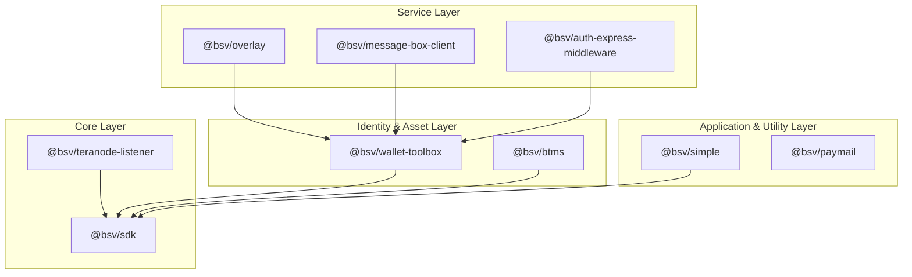
```mermaid
graph TD
  subgraph "Application & Utility Layer"
    SIMPLE["@bsv/simple"]
    PAYMAIL["@bsv/paymail"]
  end

  subgraph "Service Layer"
    OVERLAY["@bsv/overlay"]
    MSGBOX["@bsv/message-box-client"]
    MIDDLEWARE["@bsv/auth-express-middleware"]
  end

  subgraph "Identity & Asset Layer"
    WT["@bsv/wallet-toolbox"]
    BTMS["@bsv/btms"]
  end

  subgraph "Core Layer"
    SDK["@bsv/sdk"]
    NET["@bsv/teranode-listener"]
  end

  SIMPLE --> SDK
  OVERLAY --> WT
  MSGBOX --> WT
  MIDDLEWARE --> WT
  WT --> SDK
  NET --> SDK
  BTMS --> SDK
```
**Sources:** [README.md:154-162](https://github.com/bsv-blockchain/ts-stack/blob/main/README.md#L154-L162)

### Criticality Tiers & Reliability

The monorepo classifies packages into **Criticality Tiers** to prioritize engineering investment and reliability guarantees [RELIABILITY.md:14-16](https://github.com/bsv-blockchain/ts-stack/blob/main/RELIABILITY.md#L14-L16).

*   **Tier 0 (Core Protocol):** Failure breaks the entire stack. Example: `@bsv/sdk` [RELIABILITY.md:20](https://github.com/bsv-blockchain/ts-stack/blob/main/RELIABILITY.md#L20).
*   **Tier 1 (Critical Services):** Failure breaks multiple consumers. Examples: `@bsv/wallet-toolbox`, `@bsv/overlay-services` [RELIABILITY.md:21](https://github.com/bsv-blockchain/ts-stack/blob/main/RELIABILITY.md#L21).
*   **Tier 2 (Important):** Failure degrades a single domain. Example: `@bsv/message-box-server` [RELIABILITY.md:22](https://github.com/bsv-blockchain/ts-stack/blob/main/RELIABILITY.md#L22).

Each package tracks its state via **Reliability Levels (RL)**, ranging from RL0 (Untested) to RL5 (Hardened) [RELIABILITY.md:5-12](https://github.com/bsv-blockchain/ts-stack/blob/main/RELIABILITY.md#L5-L12).

### Monorepo Management

The stack uses `pnpm` workspaces to manage cross-package dependencies and shared configuration [pnpm-workspace.yaml:1-7](https://github.com/bsv-blockchain/ts-stack/blob/main/pnpm-workspace.yaml#L1-L7).

*   **Build System:** Uses a shared `tsconfig.base.json` for consistent compilation across ESM and CJS targets [tsconfig.base.json:1-21](https://github.com/bsv-blockchain/ts-stack/blob/main/tsconfig.base.json#L1-L21).
*   **Version Alignment:** Custom scripts `sync-versions.mjs` and `check-versions.mjs` ensure that internal dependencies remain synchronized across the 40+ packages [package.json:10-11](https://github.com/bsv-blockchain/ts-stack/blob/main/package.json#L10-L11).
*   **Conformance:** A cross-language conformance suite (TypeScript and Go) validates the SDK against a shared vector corpus [package.json:12](https://github.com/bsv-blockchain/ts-stack/blob/main/package.json#L12).

For details on the workspace layout and dependency flow, see [Repository Structure & Monorepo Setup](02-Repository-Structure---Monorepo-Setup.md).

### CI/CD and Release Pipeline

The repository implements a robust CI/CD pipeline via GitHub Actions:
1.  **Continuous Integration:** Validates every PR with build, lint, and test jobs across the entire workspace [package.json:6-8](https://github.com/bsv-blockchain/ts-stack/blob/main/package.json#L6-L8).
2.  **Conformance Testing:** Runs the `@bsv/sdk` against cryptographic and transaction vectors [package.json:12](https://github.com/bsv-blockchain/ts-stack/blob/main/package.json#L12).
3.  **Automated Releases:** Publishes packages to npm using OIDC-based authentication triggered by git tags.

For details on the automation workflows, see [CI/CD, Release & Versioning](03-CI-CD--Release---Versioning.md).

### Code-to-Domain Mapping

This diagram bridges the natural language domains to specific entry-point packages and directories within the codebase.

**Domain to Code Entity Mapping**
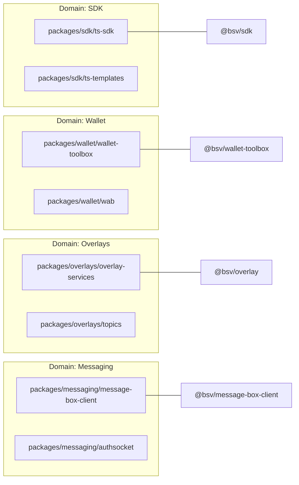
```mermaid
graph LR
  subgraph "Domain: SDK"
    SDK_DIR["packages/sdk/ts-sdk"]
    TEMPLATES_DIR["packages/sdk/ts-templates"]
  end

  subgraph "Domain: Wallet"
    WT_DIR["packages/wallet/wallet-toolbox"]
    WAB_DIR["packages/wallet/wab"]
  end

  subgraph "Domain: Overlays"
    OV_DIR["packages/overlays/overlay-services"]
    TOPICS_DIR["packages/overlays/topics"]
  end

  subgraph "Domain: Messaging"
    MB_DIR["packages/messaging/message-box-client"]
    AS_DIR["packages/messaging/authsocket"]
  end

  SDK_DIR --- SDK_PKG["@bsv/sdk"]
  WT_DIR --- WT_PKG["@bsv/wallet-toolbox"]
  OV_DIR --- OV_PKG["@bsv/overlay"]
  MB_DIR --- MB_PKG["@bsv/message-box-client"]
```
**Sources:** [README.md:26-78](https://github.com/bsv-blockchain/ts-stack/blob/main/README.md#L26-L78)

---

# Page: Repository Structure & Monorepo Setup

# Repository Structure & Monorepo Setup

<details>
<summary>Relevant source files</summary>

The following files were used as context for generating this wiki page:

- [.editorconfig](https://github.com/bsv-blockchain/ts-stack/blob/main/.editorconfig)
- [.gitignore](https://github.com/bsv-blockchain/ts-stack/blob/main/.gitignore)
- [.npmrc](https://github.com/bsv-blockchain/ts-stack/blob/main/.npmrc)
- [README.md](https://github.com/bsv-blockchain/ts-stack/blob/main/README.md)
- [conformance/vectors/README.md](https://github.com/bsv-blockchain/ts-stack/blob/main/conformance/vectors/README.md)
- [package.json](https://github.com/bsv-blockchain/ts-stack/blob/main/package.json)
- [packages/messaging/message-box-server/package.json](https://github.com/bsv-blockchain/ts-stack/blob/main/packages/messaging/message-box-server/package.json)
- [packages/wallet/btms/package.json](https://github.com/bsv-blockchain/ts-stack/blob/main/packages/wallet/btms/package.json)
- [pnpm-workspace.yaml](https://github.com/bsv-blockchain/ts-stack/blob/main/pnpm-workspace.yaml)
- [scripts/check-versions.mjs](https://github.com/bsv-blockchain/ts-stack/blob/main/scripts/check-versions.mjs)
- [scripts/sync-versions.mjs](https://github.com/bsv-blockchain/ts-stack/blob/main/scripts/sync-versions.mjs)
- [tsconfig.base.json](https://github.com/bsv-blockchain/ts-stack/blob/main/tsconfig.base.json)

</details>


The `ts-stack` repository is a unified monorepo containing all production TypeScript packages for the BSV blockchain stack. It is organized into seven functional domains, utilizing `pnpm` workspaces to manage a dependency graph that flows inward toward the core SDK.

### Monorepo Layout & Workspaces

The repository uses a `pnpm` workspace configuration to manage 41 packages plus a conformance runner. The workspace boundaries are defined in `pnpm-workspace.yaml`, which includes all subdirectories under `packages/` while excluding build artifacts like `dist` or `out` [pnpm-workspace.yaml:1-7](https://github.com/bsv-blockchain/ts-stack/blob/main/pnpm-workspace.yaml#L1-L7).

#### Workspace Configuration
- **Package Manager**: `pnpm` version 9.0.0 is required, enforced via `package.json` [package.json:16-18](https://github.com/bsv-blockchain/ts-stack/blob/main/package.json#L16-L18).
- **Node Version**: Minimum requirement of Node.js 20 [package.json:15](https://github.com/bsv-blockchain/ts-stack/blob/main/package.json#L15).
- **Dependency Overrides**: The root `package.json` forces specific versions of `jest-environment-node` and `jest-mock` to ensure testing consistency across all packages [package.json:19-24](https://github.com/bsv-blockchain/ts-stack/blob/main/package.json#L19-L24).

### Functional Domains

The codebase is partitioned into seven domains, each residing in its own subdirectory under `packages/`.

| Domain | Path | Description |
|--------|------|-------------|
| **SDK** | `packages/sdk/` | Foundational primitives and transaction logic. |
| **Wallet** | `packages/wallet/` | Wallet logic, storage, and authentication backends. |
| **Network** | `packages/network/` | Blockchain header tracking and P2P networking. |
| **Overlays** | `packages/overlays/` | Overlay service engines and canonical topic implementations. |
| **Messaging** | `packages/messaging/` | Peer-to-peer messaging and authenticated sockets. |
| **Middleware** | `packages/middleware/` | Express.js middleware for auth and payments. |
| **Helpers** | `packages/helpers/` | High-level APIs and utility packages. |

**Sources:** [README.md:7-18](https://github.com/bsv-blockchain/ts-stack/blob/main/README.md#L7-L18), [README.md:26-94](https://github.com/bsv-blockchain/ts-stack/blob/main/README.md#L26-L94)

### Dependency Hierarchy

The architecture enforces a strict inward dependency flow. Higher-level services (Overlays, Messaging, Middleware) depend on the Wallet layer, which depends on the Network and SDK layers.

#### Inward Flow Diagram
This diagram illustrates the directional flow of dependencies across the monorepo domains.

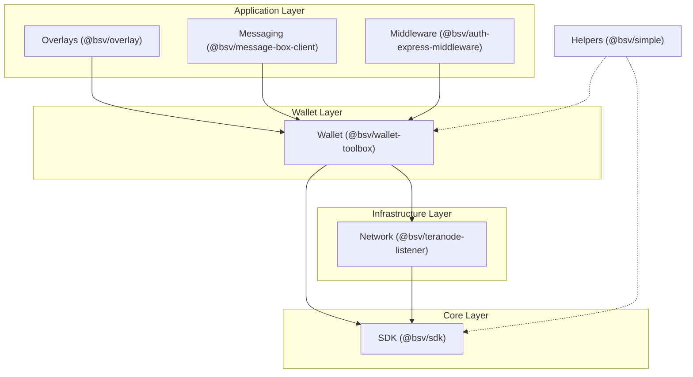
```mermaid
graph TD
  subgraph "Application Layer"
    Overlay["Overlays (@bsv/overlay)"]
    Messaging["Messaging (@bsv/message-box-client)"]
    Middleware["Middleware (@bsv/auth-express-middleware)"]
  end

  subgraph "Wallet Layer"
    Wallet["Wallet (@bsv/wallet-toolbox)"]
  end

  subgraph "Infrastructure Layer"
    Network["Network (@bsv/teranode-listener)"]
  end

  subgraph "Core Layer"
    SDK["SDK (@bsv/sdk)"]
  end

  Overlay --> Wallet
  Messaging --> Wallet
  Middleware --> Wallet
  Wallet --> Network
  Wallet --> SDK
  Network --> SDK
  
  Helpers["Helpers (@bsv/simple)"] -.-> SDK
  Helpers -.-> Wallet
```
**Sources:** [README.md:150-162](https://github.com/bsv-blockchain/ts-stack/blob/main/README.md#L150-L162)

### Shared Configuration & Tooling

The monorepo maintains consistency through shared configuration files and centralized scripts.

#### TypeScript Configuration
A root `tsconfig.base.json` provides the foundation for all package-specific TypeScript configurations. It defines:
- **Module System**: `NodeNext` for modern ESM support [tsconfig.base.json:4-6](https://github.com/bsv-blockchain/ts-stack/blob/main/tsconfig.base.json#L4-L6).
- **Target**: `esnext` for modern JavaScript features [tsconfig.base.json:5](https://github.com/bsv-blockchain/ts-stack/blob/main/tsconfig.base.json#L5).
- **Strictness**: `strict` is set to `false` at the base level, though individual packages may override this [tsconfig.base.json:8](https://github.com/bsv-blockchain/ts-stack/blob/main/tsconfig.base.json#L8).
- **Features**: Enables `sourceMap`, `experimentalDecorators`, and `emitDecoratorMetadata` for advanced SDK and Wallet features [tsconfig.base.json:15-17](https://github.com/bsv-blockchain/ts-stack/blob/main/tsconfig.base.json#L15-L17).

#### Version Management
Because packages are often released together, maintaining version alignment is critical. Two scripts manage this:
- **`check-versions.mjs`**: Iterates through all packages and identifies cross-package dependencies that do not match the current workspace versions [scripts/check-versions.mjs:42-53](https://github.com/bsv-blockchain/ts-stack/blob/main/scripts/check-versions.mjs#L42-L53).
- **`sync-versions.mjs`**: Automatically updates `package.json` files to align cross-references to the latest versions found in the workspace [scripts/sync-versions.mjs:54-67](https://github.com/bsv-blockchain/ts-stack/blob/main/scripts/sync-versions.mjs#L54-L67).

**Sources:** [tsconfig.base.json:1-21](https://github.com/bsv-blockchain/ts-stack/blob/main/tsconfig.base.json#L1-L21), [package.json:10-11](https://github.com/bsv-blockchain/ts-stack/blob/main/package.json#L10-L11), [scripts/check-versions.mjs:1-62](https://github.com/bsv-blockchain/ts-stack/blob/main/scripts/check-versions.mjs#L1-L62), [scripts/sync-versions.mjs:1-75](https://github.com/bsv-blockchain/ts-stack/blob/main/scripts/sync-versions.mjs#L1-L75)

### Development Lifecycle

The monorepo provides a unified interface for standard development tasks from the root directory.

#### Common Commands
| Task | Command | Implementation |
|------|---------|----------------|
| **Install** | `pnpm install` | Installs all workspace dependencies [README.md:107-108](https://github.com/bsv-blockchain/ts-stack/blob/main/README.md#L107-L108). |
| **Build** | `pnpm run build` | Runs `pnpm -r run build` across all packages [package.json:6](https://github.com/bsv-blockchain/ts-stack/blob/main/package.json#L6). |
| **Test** | `pnpm run test` | Executes tests in all packages using Jest [package.json:7](https://github.com/bsv-blockchain/ts-stack/blob/main/package.json#L7). |
| **Lint** | `pnpm run lint` | Runs `ts-standard` across the repo [package.json:8](https://github.com/bsv-blockchain/ts-stack/blob/main/package.json#L8). |
| **Conformance** | `pnpm conformance` | Runs the cross-language conformance runner [package.json:12](https://github.com/bsv-blockchain/ts-stack/blob/main/package.json#L12). |

#### Building and Testing Entity Space
This diagram maps high-level developer actions to the specific scripts and tools utilized in the monorepo.

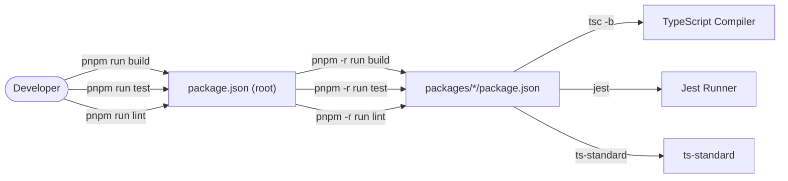
```mermaid
graph LR
  User([Developer]) -->|pnpm run build| RootPkg["package.json (root)"]
  RootPkg -->|pnpm -r run build| SubPkg["packages/*/package.json"]
  SubPkg -->|tsc -b| TS["TypeScript Compiler"]

  User -->|pnpm run test| RootPkg
  RootPkg -->|pnpm -r run test| SubPkg
  SubPkg -->|jest| Jest["Jest Runner"]

  User -->|pnpm run lint| RootPkg
  RootPkg -->|pnpm -r run lint| SubPkg
  SubPkg -->|ts-standard| Lint["ts-standard"]
```
**Sources:** [package.json:5-13](https://github.com/bsv-blockchain/ts-stack/blob/main/package.json#L5-L13), [packages/wallet/btms/package.json:20-25](https://github.com/bsv-blockchain/ts-stack/blob/main/packages/wallet/btms/package.json#L20-L25), [packages/messaging/message-box-server/package.json:7-18](https://github.com/bsv-blockchain/ts-stack/blob/main/packages/messaging/message-box-server/package.json#L7-L18)

### Package Metadata & Exports
Each package within the monorepo typically follows a standard structure for exports and builds, favoring ESM. For example, `@bsv/btms` defines its entry point in `dist/esm/src/index.js` and provides types in `dist/types/src/index.d.ts` [packages/wallet/btms/package.json:6-7](https://github.com/bsv-blockchain/ts-stack/blob/main/packages/wallet/btms/package.json#L6-L7).

**Sources:** [packages/wallet/btms/package.json:1-55](https://github.com/bsv-blockchain/ts-stack/blob/main/packages/wallet/btms/package.json#L1-L55)

---

# Page: CI/CD, Release & Versioning

# CI/CD, Release & Versioning

<details>
<summary>Relevant source files</summary>

The following files were used as context for generating this wiki page:

- [.github/dependabot.yml](https://github.com/bsv-blockchain/ts-stack/blob/main/.github/dependabot.yml)
- [.github/workflows/ci.yml](https://github.com/bsv-blockchain/ts-stack/blob/main/.github/workflows/ci.yml)
- [.github/workflows/conformance.yml](https://github.com/bsv-blockchain/ts-stack/blob/main/.github/workflows/conformance.yml)
- [.github/workflows/release.yml](https://github.com/bsv-blockchain/ts-stack/blob/main/.github/workflows/release.yml)
- [scripts/check-versions.mjs](https://github.com/bsv-blockchain/ts-stack/blob/main/scripts/check-versions.mjs)
- [scripts/sync-versions.mjs](https://github.com/bsv-blockchain/ts-stack/blob/main/scripts/sync-versions.mjs)

</details>


This page documents the automation pipelines, version management strategies, and release procedures for the `@bsv/ts-stack` monorepo. The repository utilizes GitHub Actions for continuous integration, a custom conformance testing suite to ensure cross-language parity, and OIDC-based npm publishing for secure releases.

## Continuous Integration (CI)

The CI pipeline is triggered on every push to `main` and on all pull requests targeting `main` [.github/workflows/ci.yml:3-7](https://github.com/bsv-blockchain/ts-stack/blob/main/.github/workflows/ci.yml#L3-L7). It ensures code quality through a sequence of validation, building, and testing across the entire workspace.

### Build and Test Workflow
The `build-and-test` job executes on `ubuntu-latest` using Node.js 20.x [.github/workflows/ci.yml:10-15](https://github.com/bsv-blockchain/ts-stack/blob/main/.github/workflows/ci.yml#L10-L15).

1.  **Dependency Installation**: Uses `pnpm install --frozen-lockfile` to ensure reproducible builds [.github/workflows/ci.yml:29](https://github.com/bsv-blockchain/ts-stack/blob/main/.github/workflows/ci.yml#L29).
2.  **Version Consistency**: Runs `node scripts/check-versions.mjs` to verify that internal workspace dependencies are correctly synchronized [.github/workflows/ci.yml:32](https://github.com/bsv-blockchain/ts-stack/blob/main/.github/workflows/ci.yml#L32).
3.  **Monorepo Build**: Builds all packages in the workspace, specifically excluding non-production or specialized deployment packages like `@bsv/messagebox-services` and `example-paymail` [.github/workflows/ci.yml:37](https://github.com/bsv-blockchain/ts-stack/blob/main/.github/workflows/ci.yml#L37).
4.  **Linting**: Executes `pnpm -r run lint` across all packages [.github/workflows/ci.yml:41](https://github.com/bsv-blockchain/ts-stack/blob/main/.github/workflows/ci.yml#L41).
5.  **Unit Testing**: Runs `pnpm -r run test` to execute Jest/Vitest suites in every package [.github/workflows/ci.yml:44](https://github.com/bsv-blockchain/ts-stack/blob/main/.github/workflows/ci.yml#L44).

### CI Process Flow

The following diagram illustrates the data flow and execution order of the CI pipeline.

**CI Pipeline Execution Flow**
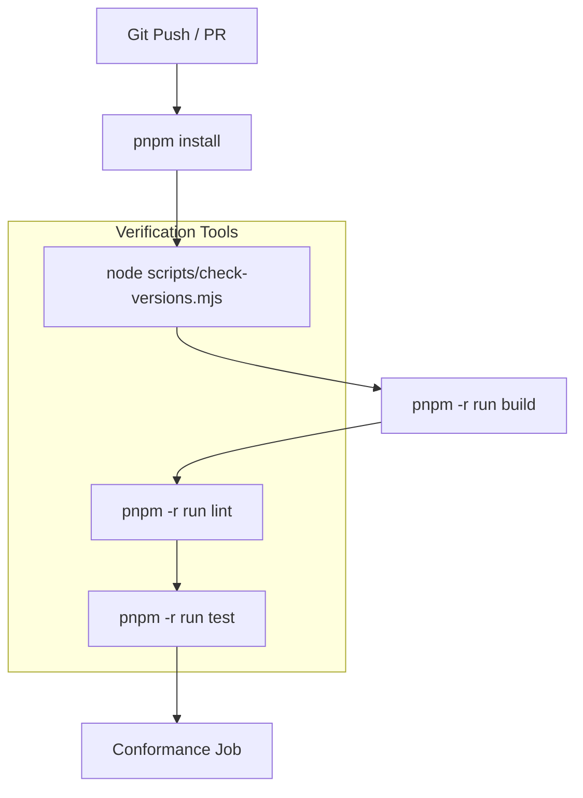
```mermaid
graph TD
    Trigger["Git Push / PR"] --> Install["pnpm install"]
    Install --> VersionCheck["node scripts/check-versions.mjs"]
    VersionCheck --> Build["pnpm -r run build"]
    Build --> Lint["pnpm -r run lint"]
    Lint --> Test["pnpm -r run test"]
    Test --> Conformance["Conformance Job"]
    
    subgraph "Verification Tools"
        VersionCheck
        Lint
        Test
    end
```
Sources: [.github/workflows/ci.yml:1-45](https://github.com/bsv-blockchain/ts-stack/blob/main/.github/workflows/ci.yml#L1-L45), [scripts/check-versions.mjs:1-10](https://github.com/bsv-blockchain/ts-stack/blob/main/scripts/check-versions.mjs#L1-L10)

## Conformance Testing

The conformance suite ensures that the TypeScript implementation of cryptographic and transaction primitives remains compatible with other SDK implementations (e.g., Go).

### Conformance Job Structure
The conformance job runs after `build-and-test` completes [.github/workflows/ci.yml:46-49](https://github.com/bsv-blockchain/ts-stack/blob/main/.github/workflows/ci.yml#L46-L49). It uses a specialized runner located in `conformance/runner` [.github/workflows/ci.yml:62](https://github.com/bsv-blockchain/ts-stack/blob/main/.github/workflows/ci.yml#L62).

*   **Validation**: Validates the JSON structure of the conformance vectors [.github/workflows/ci.yml:62](https://github.com/bsv-blockchain/ts-stack/blob/main/.github/workflows/ci.yml#L62).
*   **Execution**: Runs the vectors against the TS SDK and generates a JUnit-style XML report (`ts-report.xml`) [.github/workflows/ci.yml:65](https://github.com/bsv-blockchain/ts-stack/blob/main/.github/workflows/ci.yml#L65).
*   **Artifacts**: Publishes the `conformance-vectors` to GitHub Artifacts for 90 days, allowing downstream SDKs to fetch the latest vectors for their own CI [.github/workflows/ci.yml:77-83](https://github.com/bsv-blockchain/ts-stack/blob/main/.github/workflows/ci.yml#L77-L83).

**Conformance System Architecture**
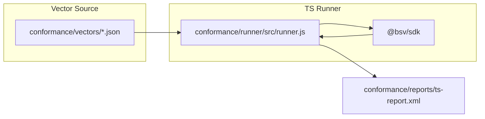
```mermaid
graph LR
    subgraph "Vector Source"
        Vectors["conformance/vectors/*.json"]
    end

    subgraph "TS Runner"
        Runner["conformance/runner/src/runner.js"]
        SDK["@bsv/sdk"]
    end

    Vectors --> Runner
    Runner --> SDK
    SDK --> Runner
    Runner --> Report["conformance/reports/ts-report.xml"]
```
Sources: [.github/workflows/ci.yml:46-84](https://github.com/bsv-blockchain/ts-stack/blob/main/.github/workflows/ci.yml#L46-L84), [.github/workflows/conformance.yml:24-30](https://github.com/bsv-blockchain/ts-stack/blob/main/.github/workflows/conformance.yml#L24-L30)

## Release Pipeline

Releases are triggered by Git tags following the pattern `*/v*` (for specific package releases) or `v*` (for monorepo-wide releases) [.github/workflows/release.yml:4-7](https://github.com/bsv-blockchain/ts-stack/blob/main/.github/workflows/release.yml#L4-L7).

### OIDC-Based Publishing
The release workflow uses GitHub's OpenID Connect (OIDC) to authenticate with npm, eliminating the need for long-lived `NPM_TOKEN` secrets [.github/workflows/release.yml:34-36](https://github.com/bsv-blockchain/ts-stack/blob/main/.github/workflows/release.yml#L34-L36).

1.  **Permissions**: The job requires `id-token: write` to generate the OIDC token and `contents: read` to access the source [.github/workflows/release.yml:12-14](https://github.com/bsv-blockchain/ts-stack/blob/main/.github/workflows/release.yml#L12-L14).
2.  **Filtering**: It uses `pnpm -r --filter='...[origin/main]' publish` to identify and publish only the packages that have changed relative to the `main` branch [.github/workflows/release.yml:41](https://github.com/bsv-blockchain/ts-stack/blob/main/.github/workflows/release.yml#L41).
3.  **Provenance**: The `--provenance` flag is used during publishing to provide a verifiable link between the npm package and the GitHub Actions run that created it [.github/workflows/release.yml:41](https://github.com/bsv-blockchain/ts-stack/blob/main/.github/workflows/release.yml#L41).

Sources: [.github/workflows/release.yml:1-42](https://github.com/bsv-blockchain/ts-stack/blob/main/.github/workflows/release.yml#L1-L42)

## Versioning & Dependency Management

The monorepo maintains internal consistency through a set of scripts that manage cross-package version references.

### Version Synchronization Scripts
Because Dependabot is configured to ignore `@bsv/*` workspace packages to avoid noise [.github/dependabot.yml:12-13](https://github.com/bsv-blockchain/ts-stack/blob/main/.github/dependabot.yml#L12-L13), [21-39](https://github.com/bsv-blockchain/ts-stack/blob/main/.github/dependabot.yml#L21-L39), version synchronization is handled manually or via CI checks.

| Script | File Path | Purpose |
| :--- | :--- | :--- |
| `check-versions` | `scripts/check-versions.mjs` | Scans all `package.json` files and exits with code 1 if an internal dependency range (e.g., `^1.0.0`) does not match the actual version of the package in the workspace [scripts/check-versions.mjs:32-61](https://github.com/bsv-blockchain/ts-stack/blob/main/scripts/check-versions.mjs#L32-L61). |
| `sync-versions` | `scripts/sync-versions.mjs` | Automatically updates all internal `dependencies`, `devDependencies`, and `peerDependencies` to match the current workspace versions [scripts/sync-versions.mjs:54-72](https://github.com/bsv-blockchain/ts-stack/blob/main/scripts/sync-versions.mjs#L54-L72). |

### Version Management Logic
The `sync-versions.mjs` script performs the following operations:
1.  Executes `pnpm -r ls --json` to build a map of package names to their current versions [scripts/sync-versions.mjs:26-35](https://github.com/bsv-blockchain/ts-stack/blob/main/scripts/sync-versions.mjs#L26-L35).
2.  Iterates through every `package.json` in the workspace [scripts/sync-versions.mjs:42-51](https://github.com/bsv-blockchain/ts-stack/blob/main/scripts/sync-versions.mjs#L42-L51).
3.  Updates version ranges to `^${currentVersion}` unless the range is explicitly set to `workspace:*` [scripts/sync-versions.mjs:59-67](https://github.com/bsv-blockchain/ts-stack/blob/main/scripts/sync-versions.mjs#L59-L67).

**Versioning Utility Flow**
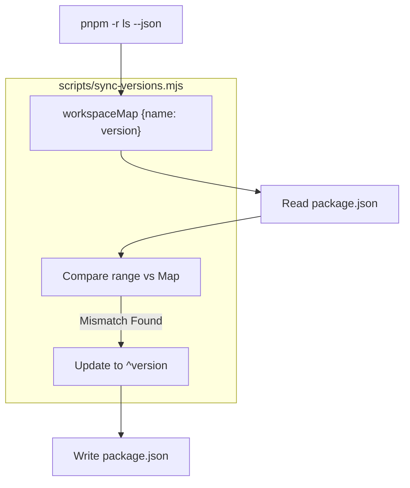
```mermaid
graph TD
    PNPM["pnpm -r ls --json"] --> Map["workspaceMap {name: version}"]
    Map --> ReadJSON["Read package.json"]
    ReadJSON --> Compare["Compare range vs Map"]
    Compare -- "Mismatch Found" --> Update["Update to ^version"]
    Update --> WriteJSON["Write package.json"]
    
    subgraph "scripts/sync-versions.mjs"
        Map
        Compare
        Update
    end
```
Sources: [scripts/check-versions.mjs:1-62](https://github.com/bsv-blockchain/ts-stack/blob/main/scripts/check-versions.mjs#L1-L62), [scripts/sync-versions.mjs:1-75](https://github.com/bsv-blockchain/ts-stack/blob/main/scripts/sync-versions.mjs#L1-L75), [.github/dependabot.yml:1-44](https://github.com/bsv-blockchain/ts-stack/blob/main/.github/dependabot.yml#L1-L44)

---

# Page: Core SDK (@bsv/sdk)

# Core SDK (@bsv/sdk)

<details>
<summary>Relevant source files</summary>

The following files were used as context for generating this wiki page:

- [packages/middleware/auth-express-middleware/BASELINE.md](https://github.com/bsv-blockchain/ts-stack/blob/main/packages/middleware/auth-express-middleware/BASELINE.md)
- [packages/overlays/overlay-services/BASELINE.md](https://github.com/bsv-blockchain/ts-stack/blob/main/packages/overlays/overlay-services/BASELINE.md)
- [packages/sdk/ts-sdk/BASELINE.md](https://github.com/bsv-blockchain/ts-stack/blob/main/packages/sdk/ts-sdk/BASELINE.md)
- [packages/sdk/ts-sdk/BENCHMARK.md](https://github.com/bsv-blockchain/ts-stack/blob/main/packages/sdk/ts-sdk/BENCHMARK.md)
- [packages/sdk/ts-templates/package.json](https://github.com/bsv-blockchain/ts-stack/blob/main/packages/sdk/ts-templates/package.json)
- [packages/wallet/wallet-toolbox/BASELINE.md](https://github.com/bsv-blockchain/ts-stack/blob/main/packages/wallet/wallet-toolbox/BASELINE.md)

</details>


The `@bsv/sdk` package is the **Tier-0** foundational library for the entire TS-Stack. It provides the core protocol implementation, cryptographic primitives, and transaction handling logic that all other packages depend on. It is designed with zero production dependencies to ensure maximum portability and security.

[packages/sdk/ts-sdk/BASELINE.md:13-13](https://github.com/bsv-blockchain/ts-stack/blob/main/packages/sdk/ts-sdk/BASELINE.md#L13-L13)
[packages/sdk/ts-sdk/BASELINE.md:52-52](https://github.com/bsv-blockchain/ts-stack/blob/main/packages/sdk/ts-sdk/BASELINE.md#L52-L52)

### System Architecture Overview

The SDK is organized into several specialized subsystems that handle different layers of the Bitcoin SV protocol. The following diagram illustrates how these subsystems relate to one another and their primary code entities.

**SDK Subsystem Mapping**
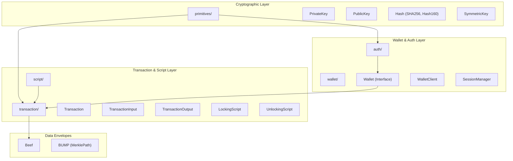
```mermaid
graph TD
    subgraph "Cryptographic Layer"
        PR["primitives/"]
        PK["PrivateKey"]
        PUB["PublicKey"]
        H["Hash (SHA256, Hash160)"]
        S["SymmetricKey"]
    end

    subgraph "Transaction & Script Layer"
        TX["transaction/"]
        T["Transaction"]
        TI["TransactionInput"]
        TO["TransactionOutput"]
        SC["script/"]
        LS["LockingScript"]
        US["UnlockingScript"]
    end

    subgraph "Data Envelopes"
        BEEF["Beef"]
        BUMP["BUMP (MerklePath)"]
    end

    subgraph "Wallet & Auth Layer"
        WI["wallet/"]
        WINT["Wallet (Interface)"]
        WC["WalletClient"]
        AUTH["auth/"]
        SM["SessionManager"]
    end

    PR --> TX
    PR --> AUTH
    TX --> BEEF
    SC --> TX
    WINT --> TX
    AUTH --> WINT
```
Sources: [packages/sdk/ts-sdk/BENCHMARK.md:12-29](https://github.com/bsv-blockchain/ts-stack/blob/main/packages/sdk/ts-sdk/BENCHMARK.md#L12-L29), [packages/sdk/ts-sdk/BASELINE.md:9-13](https://github.com/bsv-blockchain/ts-stack/blob/main/packages/sdk/ts-sdk/BASELINE.md#L9-L13)

---

## Cryptographic Primitives
The `src/primitives` directory contains the low-level building blocks for all Bitcoin operations. This includes elliptic curve cryptography (ECDSA and Schnorr), hashing algorithms, and key management.

*   **Key Management**: Classes for `PrivateKey` and `PublicKey` management, including BRC-42 child key derivation.
*   **Hashing**: Optimized implementations of `SHA256`, `RIPEMD160`, and `Hash160`.
*   **Signatures**: `ECDSA` for standard transactions and `Schnorr` for authentication protocols.

For details, see [Cryptographic Primitives](05-Cryptographic-Primitives.md).

Sources: [packages/sdk/ts-sdk/BENCHMARK.md:12-17](https://github.com/bsv-blockchain/ts-stack/blob/main/packages/sdk/ts-sdk/BENCHMARK.md#L12-L17), [packages/sdk/ts-sdk/BENCHMARK.md:27-29](https://github.com/bsv-blockchain/ts-stack/blob/main/packages/sdk/ts-sdk/BENCHMARK.md#L27-L29)

---

## Transactions, Scripts & BEEF
This subsystem handles the construction, serialization, and validation of Bitcoin transactions. It introduces the `Beef` (Bitcoin Envelope Entity Format) for simplified SPV proof propagation.

*   **Transaction Engine**: The `Transaction` class handles serialization (`toBinary`, `toHex`) and ID computation.
*   **Scripting**: Support for `LockingScript` and `UnlockingScript` assembly and evaluation via the `Spend` class.
*   **SPV Proofs**: `MerklePath` and `BUMP` formats for verifying transaction inclusion without a full node.

For details, see [Transactions, Scripts & BEEF](06-Transactions--Scripts---BEEF.md).

Sources: [packages/sdk/ts-sdk/BENCHMARK.md:18-21](https://github.com/bsv-blockchain/ts-stack/blob/main/packages/sdk/ts-sdk/BENCHMARK.md#L18-L21), [packages/sdk/ts-sdk/BENCHMARK.md:24-26](https://github.com/bsv-blockchain/ts-stack/blob/main/packages/sdk/ts-sdk/BENCHMARK.md#L24-L26)

---

## Wallet Interface & Auth Layer
The SDK defines the standard interface for wallets (BRC-100) and the mutual authentication protocols (BRC-103) used by the stack.

*   **Wallet Interfaces**: Defines the `Wallet` and `WalletClient` interfaces that higher-level packages like `@bsv/wallet-toolbox` implement.
*   **Authentication**: The `SessionManager` and `Peer` classes in `src/auth` handle the BRC-103 handshake for secure service communication.

For details, see [Wallet Interface & Auth Layer (BRC-100 / BRC-103)](07-Wallet-Interface---Auth-Layer--BRC-100---BRC-103.md).

Sources: [packages/wallet/wallet-toolbox/BASELINE.md:50-50](https://github.com/bsv-blockchain/ts-stack/blob/main/packages/wallet/wallet-toolbox/BASELINE.md#L50-L50), [packages/middleware/auth-express-middleware/BASELINE.md:11-13](https://github.com/bsv-blockchain/ts-stack/blob/main/packages/middleware/auth-express-middleware/BASELINE.md#L11-L13)

---

## Script Templates & Compat Layer
While the core SDK provides raw script capabilities, complex templates and legacy compatibility are handled through specialized modules and the `@bsv/templates` package.

*   **Standard Templates**: P2PKH, PushDrop, and other common script patterns.
*   **Compatibility**: Support for Bitcoin Signed Messages (BSM) and ECIES encryption via the compat layer.
*   **Overlay Tools**: Utilities for integrating scripts with overlay services and KV stores.

For details, see [Script Templates & Compat Layer](08-Script-Templates---Compat-Layer.md).

Sources: [packages/sdk/ts-templates/package.json:2-5](https://github.com/bsv-blockchain/ts-stack/blob/main/packages/sdk/ts-templates/package.json#L2-L5), [packages/sdk/ts-sdk/BENCHMARK.md:22-23](https://github.com/bsv-blockchain/ts-stack/blob/main/packages/sdk/ts-sdk/BENCHMARK.md#L22-L23)

---

## Performance Baselines
As a Tier-0 package, performance is critical. The SDK monitors "Hot Paths" to prevent regressions in core operations.

| Operation | Code Entity | Path |
| :--- | :--- | :--- |
| **Signing** | `ECDSA.sign` | [src/primitives/ECDSA.ts](https://github.com/bsv-blockchain/ts-stack/blob/main/src/primitives/ECDSA.ts) |
| **Key Derivation** | `PrivateKey.deriveChild` | [src/primitives/PrivateKey.ts](https://github.com/bsv-blockchain/ts-stack/blob/main/src/primitives/PrivateKey.ts) |
| **Serialization** | `Transaction.toBinary` | [src/transaction/Transaction.ts](https://github.com/bsv-blockchain/ts-stack/blob/main/src/transaction/Transaction.ts) |
| **Validation** | `Spend.validate` | [src/script/Spend.ts](https://github.com/bsv-blockchain/ts-stack/blob/main/src/script/Spend.ts) |
| **Hashing** | `sha256` | [src/primitives/Hash.ts](https://github.com/bsv-blockchain/ts-stack/blob/main/src/primitives/Hash.ts) |

Sources: [packages/sdk/ts-sdk/BENCHMARK.md:10-29](https://github.com/bsv-blockchain/ts-stack/blob/main/packages/sdk/ts-sdk/BENCHMARK.md#L10-L29)

---

# Page: Cryptographic Primitives

# Cryptographic Primitives

<details>
<summary>Relevant source files</summary>

The following files were used as context for generating this wiki page:

- [conformance/runner/go/.gitignore](https://github.com/bsv-blockchain/ts-stack/blob/main/conformance/runner/go/.gitignore)
- [conformance/runner/go/README.md](https://github.com/bsv-blockchain/ts-stack/blob/main/conformance/runner/go/README.md)
- [conformance/runner/package.json](https://github.com/bsv-blockchain/ts-stack/blob/main/conformance/runner/package.json)
- [conformance/runner/src/runner.js](https://github.com/bsv-blockchain/ts-stack/blob/main/conformance/runner/src/runner.js)
- [conformance/vectors/sdk/compat/bsm.json](https://github.com/bsv-blockchain/ts-stack/blob/main/conformance/vectors/sdk/compat/bsm.json)
- [conformance/vectors/sdk/crypto/aes.json](https://github.com/bsv-blockchain/ts-stack/blob/main/conformance/vectors/sdk/crypto/aes.json)
- [conformance/vectors/sdk/crypto/ecdsa.json](https://github.com/bsv-blockchain/ts-stack/blob/main/conformance/vectors/sdk/crypto/ecdsa.json)
- [conformance/vectors/sdk/crypto/ecies.json](https://github.com/bsv-blockchain/ts-stack/blob/main/conformance/vectors/sdk/crypto/ecies.json)
- [conformance/vectors/sdk/crypto/hash160.json](https://github.com/bsv-blockchain/ts-stack/blob/main/conformance/vectors/sdk/crypto/hash160.json)
- [conformance/vectors/sdk/crypto/hmac.json](https://github.com/bsv-blockchain/ts-stack/blob/main/conformance/vectors/sdk/crypto/hmac.json)
- [conformance/vectors/sdk/crypto/ripemd160.json](https://github.com/bsv-blockchain/ts-stack/blob/main/conformance/vectors/sdk/crypto/ripemd160.json)
- [conformance/vectors/sdk/crypto/sha256.json](https://github.com/bsv-blockchain/ts-stack/blob/main/conformance/vectors/sdk/crypto/sha256.json)
- [conformance/vectors/sdk/crypto/signature.json](https://github.com/bsv-blockchain/ts-stack/blob/main/conformance/vectors/sdk/crypto/signature.json)
- [conformance/vectors/sdk/keys/key-derivation.json](https://github.com/bsv-blockchain/ts-stack/blob/main/conformance/vectors/sdk/keys/key-derivation.json)
- [conformance/vectors/sdk/keys/private-key.json](https://github.com/bsv-blockchain/ts-stack/blob/main/conformance/vectors/sdk/keys/private-key.json)
- [conformance/vectors/sdk/keys/public-key.json](https://github.com/bsv-blockchain/ts-stack/blob/main/conformance/vectors/sdk/keys/public-key.json)

</details>


The cryptographic primitives in the `@bsv/sdk` provide the foundational building blocks for Bitcoin SV operations, including elliptic curve cryptography (ECDSA and Schnorr), hashing, symmetric encryption, and secure key derivation. These primitives are implemented in `packages/sdk/ts-sdk/src/primitives` and are designed to be constant-time where applicable, conforming to strict security standards.

## Core Entities and Data Flow

The cryptographic system bridges mathematical concepts (scalars, points) with Bitcoin-specific encodings (WIF, DER, Compact Signatures).

### Entity Mapping
The following diagram maps natural language cryptographic concepts to the specific TypeScript classes and files within the SDK.

**Diagram: Cryptographic Entity Mapping**
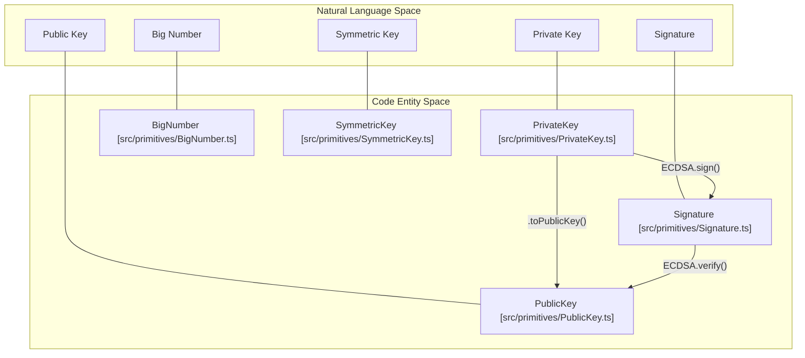
```mermaid
graph TD
    subgraph "Natural Language Space"
        A["Private Key"]
        B["Public Key"]
        C["Signature"]
        D["Big Number"]
        E["Symmetric Key"]
    end

    subgraph "Code Entity Space"
        A --- AE["PrivateKey"]
        B --- BE["PublicKey"]
        C --- CE["Signature"]
        D --- DE["BigNumber"]
        E --- EE["SymmetricKey"]
        
        AE["PrivateKey [src/primitives/PrivateKey.ts]"]
        BE["PublicKey [src/primitives/PublicKey.ts]"]
        CE["Signature [src/primitives/Signature.ts]"]
        DE["BigNumber [src/primitives/BigNumber.ts]"]
        EE["SymmetricKey [src/primitives/SymmetricKey.ts]"]
    end

    AE -->|".toPublicKey()"| BE
    AE -->|"ECDSA.sign()"| CE
    CE -->|"ECDSA.verify()"| BE
```
**Sources:** [conformance/vectors/sdk/keys/private-key.json:7-7](https://github.com/bsv-blockchain/ts-stack/blob/main/conformance/vectors/sdk/keys/private-key.json#L7-L7), [conformance/vectors/sdk/keys/public-key.json:7-7](https://github.com/bsv-blockchain/ts-stack/blob/main/conformance/vectors/sdk/keys/public-key.json#L7-L7), [conformance/vectors/sdk/crypto/ecdsa.json:7-7](https://github.com/bsv-blockchain/ts-stack/blob/main/conformance/vectors/sdk/crypto/ecdsa.json#L7-L7)

---

## BigNumber and Arithmetic
The `BigNumber` class provides arbitrary-precision integer arithmetic required for elliptic curve operations. It handles modular reduction and scalar operations essential for `secp256k1`.

*   **Implementation:** Used extensively in `ECDSA` and `Schnorr` for scalar multiplication and signature generation.
*   **Boundary Cases:** Includes support for zero and values up to the curve order $n$.

**Sources:** [conformance/vectors/sdk/crypto/ecdsa.json:115-140](https://github.com/bsv-blockchain/ts-stack/blob/main/conformance/vectors/sdk/crypto/ecdsa.json#L115-L140)

---

## Hashing Primitives
The SDK provides several hashing algorithms commonly used in the Bitcoin protocol.

| Algorithm | Description | Common Usage |
| :--- | :--- | :--- |
| `SHA256` | Single SHA-256 hash. | Transaction hashing, Merkle trees. |
| `Hash256` | Double SHA-256 (`SHA256(SHA256(m))`). | TxID calculation, Block headers. |
| `RIPEMD160` | 160-bit hash. | Address generation. |
| `Hash160` | `RIPEMD160(SHA256(m))`. | P2PKH locking scripts. |
| `HMAC` | Hash-based Message Authentication Code. | Key derivation (BIP-32), BRC-42. |

**Sources:** [conformance/vectors/sdk/crypto/sha256.json:3-8](https://github.com/bsv-blockchain/ts-stack/blob/main/conformance/vectors/sdk/crypto/sha256.json#L3-L8), [conformance/vectors/sdk/crypto/ripemd160.json:3-8](https://github.com/bsv-blockchain/ts-stack/blob/main/conformance/vectors/sdk/crypto/ripemd160.json#L3-L8), [conformance/vectors/sdk/crypto/hash160.json:3-8](https://github.com/bsv-blockchain/ts-stack/blob/main/conformance/vectors/sdk/crypto/hash160.json#L3-L8), [conformance/vectors/sdk/crypto/hmac.json:3-8](https://github.com/bsv-blockchain/ts-stack/blob/main/conformance/vectors/sdk/crypto/hmac.json#L3-L8)

---

## Elliptic Curve Cryptography (secp256k1)

### ECDSA (Elliptic Curve Digital Signature Algorithm)
The `ECDSA` implementation supports signing and verification with the following features:
*   **Deterministic DRBG:** Uses RFC 6979 for deterministic $k$ generation to prevent nonce reuse [conformance/vectors/sdk/crypto/ecdsa.json:12-24](https://github.com/bsv-blockchain/ts-stack/blob/main/conformance/vectors/sdk/crypto/ecdsa.json#L12-L24).
*   **Low-S Normalization:** Ensures signatures use the lower $s$ value to prevent malleability [conformance/vectors/sdk/crypto/ecdsa.json:71-84](https://github.com/bsv-blockchain/ts-stack/blob/main/conformance/vectors/sdk/crypto/ecdsa.json#L71-L84).
*   **Point at Infinity Protection:** Explicitly rejects the point at infinity as a valid public key [conformance/vectors/sdk/crypto/ecdsa.json:185-197](https://github.com/bsv-blockchain/ts-stack/blob/main/conformance/vectors/sdk/crypto/ecdsa.json#L185-L197).

### Schnorr Signatures
Implemented for use in modern BSV smart contracts and BRC-standardized authentication.

### Key Management
*   **PrivateKey:** Supports WIF (Wallet Import Format) decoding and encoding [conformance/vectors/sdk/keys/private-key.json:59-69](https://github.com/bsv-blockchain/ts-stack/blob/main/conformance/vectors/sdk/keys/private-key.json#L59-L69).
*   **PublicKey:** Supports both compressed (33 bytes) and uncompressed (65 bytes) formats [conformance/vectors/sdk/keys/public-key.json:10-40](https://github.com/bsv-blockchain/ts-stack/blob/main/conformance/vectors/sdk/keys/public-key.json#L10-L40).

**Sources:** [conformance/vectors/sdk/crypto/ecdsa.json:1-10](https://github.com/bsv-blockchain/ts-stack/blob/main/conformance/vectors/sdk/crypto/ecdsa.json#L1-L10), [conformance/vectors/sdk/keys/private-key.json:1-9](https://github.com/bsv-blockchain/ts-stack/blob/main/conformance/vectors/sdk/keys/private-key.json#L1-L9)

---

## Symmetric Encryption (AES-GCM)
The `AESGCM` and `SymmetricKey` classes provide authenticated encryption.
*   **Algorithm:** AES-GCM (Galois/Counter Mode).
*   **Key Sizes:** Supports 128-bit, 192-bit, and 256-bit keys [conformance/vectors/sdk/crypto/aes.json:11-42](https://github.com/bsv-blockchain/ts-stack/blob/main/conformance/vectors/sdk/crypto/aes.json#L11-L42).
*   **Authentication:** Produces a 16-byte authentication tag to ensure data integrity [conformance/vectors/sdk/crypto/aes.json:52-55](https://github.com/bsv-blockchain/ts-stack/blob/main/conformance/vectors/sdk/crypto/aes.json#L52-L55).

**Sources:** [conformance/vectors/sdk/crypto/aes.json:1-9](https://github.com/bsv-blockchain/ts-stack/blob/main/conformance/vectors/sdk/crypto/aes.json#L1-L9)

---

## Key Derivation (BRC-42)
BRC-42 defines a method for deriving child keys for specific invoices or payments without exposing the master private key.

**Data Flow: BRC-42 Child Key Derivation**
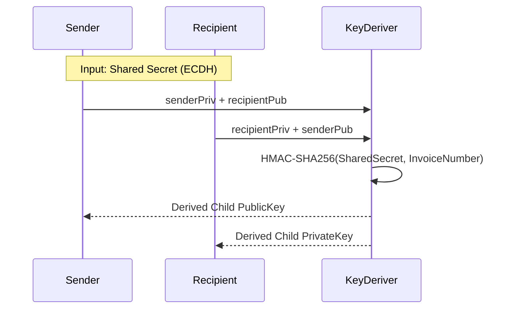
```mermaid
sequenceDiagram
    participant S as Sender
    participant R as Recipient
    participant K as KeyDeriver
    
    Note over S,R: Input: Shared Secret (ECDH)
    S->>K: senderPriv + recipientPub
    R->>K: recipientPriv + senderPub
    K->>K: HMAC-SHA256(SharedSecret, InvoiceNumber)
    K-->>S: Derived Child PublicKey
    K-->>R: Derived Child PrivateKey
```

The derivation uses the recipient's private key, the sender's public key, and an `invoiceNumber` (string or buffer) to produce a unique child key [conformance/vectors/sdk/keys/private-key.json:83-146](https://github.com/bsv-blockchain/ts-stack/blob/main/conformance/vectors/sdk/keys/private-key.json#L83-L146).

**Sources:** [conformance/vectors/sdk/keys/private-key.json:83-89](https://github.com/bsv-blockchain/ts-stack/blob/main/conformance/vectors/sdk/keys/private-key.json#L83-L89), [conformance/vectors/sdk/keys/key-derivation.json:1-10](https://github.com/bsv-blockchain/ts-stack/blob/main/conformance/vectors/sdk/keys/key-derivation.json#L1-L10)

---

## Conformance and Verification
All cryptographic primitives are validated against a cross-language conformance suite. This ensures that the TypeScript implementation matches the behavior of reference implementations (e.g., NIST vectors, RFC vectors).

*   **Vector Runner:** The `conformance-runner` executes tests against JSON-defined vectors [conformance/runner/src/runner.js:1-15](https://github.com/bsv-blockchain/ts-stack/blob/main/conformance/runner/src/runner.js#L1-L15).
*   **Parity Classes:** Tests are categorized as `required`, `crypto`, or `best-effort` to ensure core functionality is never compromised [conformance/vectors/sdk/crypto/ecdsa.json:8-8](https://github.com/bsv-blockchain/ts-stack/blob/main/conformance/vectors/sdk/crypto/ecdsa.json#L8-L8).

**Sources:** [conformance/runner/package.json:1-10](https://github.com/bsv-blockchain/ts-stack/blob/main/conformance/runner/package.json#L1-L10), [conformance/runner/src/runner.js:78-81](https://github.com/bsv-blockchain/ts-stack/blob/main/conformance/runner/src/runner.js#L78-L81)

---

# Page: Transactions, Scripts & BEEF

# Transactions, Scripts & BEEF

<details>
<summary>Relevant source files</summary>

The following files were used as context for generating this wiki page:

- [conformance/REGRESSION_QUEUE.md](https://github.com/bsv-blockchain/ts-stack/blob/main/conformance/REGRESSION_QUEUE.md)
- [conformance/vectors/regressions/beef-isvalid-hydration.json](https://github.com/bsv-blockchain/ts-stack/blob/main/conformance/vectors/regressions/beef-isvalid-hydration.json)
- [conformance/vectors/regressions/beef-v2-txid-panic.json](https://github.com/bsv-blockchain/ts-stack/blob/main/conformance/vectors/regressions/beef-v2-txid-panic.json)
- [conformance/vectors/regressions/bip276-hex-decode.json](https://github.com/bsv-blockchain/ts-stack/blob/main/conformance/vectors/regressions/bip276-hex-decode.json)
- [conformance/vectors/regressions/fee-model-mismatch.json](https://github.com/bsv-blockchain/ts-stack/blob/main/conformance/vectors/regressions/fee-model-mismatch.json)
- [conformance/vectors/regressions/merkle-path-odd-node.json](https://github.com/bsv-blockchain/ts-stack/blob/main/conformance/vectors/regressions/merkle-path-odd-node.json)
- [conformance/vectors/regressions/privatekey-modular-reduction.json](https://github.com/bsv-blockchain/ts-stack/blob/main/conformance/vectors/regressions/privatekey-modular-reduction.json)
- [conformance/vectors/regressions/script-fromasm-numeric-token.json](https://github.com/bsv-blockchain/ts-stack/blob/main/conformance/vectors/regressions/script-fromasm-numeric-token.json)
- [conformance/vectors/regressions/script-lshift-truncation.json](https://github.com/bsv-blockchain/ts-stack/blob/main/conformance/vectors/regressions/script-lshift-truncation.json)
- [conformance/vectors/regressions/script-shift-endianness.json](https://github.com/bsv-blockchain/ts-stack/blob/main/conformance/vectors/regressions/script-shift-endianness.json)
- [conformance/vectors/regressions/script-writebin-empty.json](https://github.com/bsv-blockchain/ts-stack/blob/main/conformance/vectors/regressions/script-writebin-empty.json)
- [conformance/vectors/regressions/tx-sequence-zero-sighash.json](https://github.com/bsv-blockchain/ts-stack/blob/main/conformance/vectors/regressions/tx-sequence-zero-sighash.json)
- [conformance/vectors/regressions/uhrp-url-parity.json](https://github.com/bsv-blockchain/ts-stack/blob/main/conformance/vectors/regressions/uhrp-url-parity.json)
- [conformance/vectors/sdk/scripts/evaluation.json](https://github.com/bsv-blockchain/ts-stack/blob/main/conformance/vectors/sdk/scripts/evaluation.json)
- [conformance/vectors/sdk/transactions/merkle-path.json](https://github.com/bsv-blockchain/ts-stack/blob/main/conformance/vectors/sdk/transactions/merkle-path.json)
- [conformance/vectors/sdk/transactions/serialization.json](https://github.com/bsv-blockchain/ts-stack/blob/main/conformance/vectors/sdk/transactions/serialization.json)

</details>


This page documents the core transaction and script primitives within the `@bsv/sdk`. It covers the lifecycle of a Bitcoin transaction from construction and script evaluation to advanced SPV (Simplified Payment Verification) formats like BEEF and BUMP.

## Transaction Architecture

The SDK represents Bitcoin transactions through a hierarchy of classes that manage serialization, hashing, and validation. A `Transaction` is composed of `TransactionInput` and `TransactionOutput` objects.

### Core Classes

| Class | Responsibility | Key Methods |
| :--- | :--- | :--- |
| `Transaction` | Top-level container for version, inputs, outputs, and locktime. | `toBinary()`, `hash()`, `id()`, `fee()`, `verify()` |
| `TransactionInput` | References a UTXO and contains the unlocking script. | `toBinary()`, `setUnlockingScript()` |
| `TransactionOutput` | Defines the value (satoshis) and the locking script. | `toBinary()`, `setLockingScript()` |

### Data Flow: Transaction Construction to Broadcast

The following diagram illustrates how a transaction is built, signed, and validated before being converted into a BEEF (Background Evaluation Extended Format) structure for efficient propagation.

**Transaction & BEEF Data Flow**

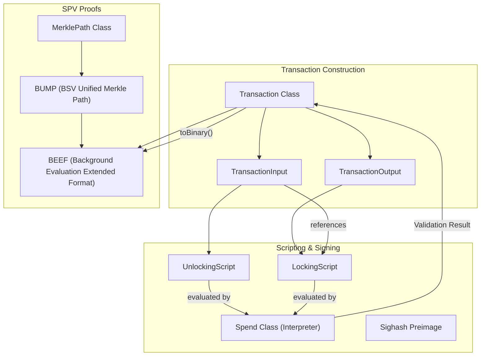
```mermaid
graph TD
    subgraph "Transaction Construction"
        TX["Transaction Class"]
        TXI["TransactionInput"]
        TXO["TransactionOutput"]
        TX --> TXI
        TX --> TXO
    end

    subgraph "Scripting & Signing"
        LS["LockingScript"]
        US["UnlockingScript"]
        SP["Spend Class (Interpreter)"]
        SIG["Sighash Preimage"]
        
        TXO --> LS
        TXI --> US
        TXI -- "references" --> LS
        US -- "evaluated by" --> SP
        LS -- "evaluated by" --> SP
    end

    subgraph "SPV Proofs"
        BUMP["BUMP (BSV Unified Merkle Path)"]
        MP["MerklePath Class"]
        BEEF["BEEF (Background Evaluation Extended Format)"]
        
        MP --> BUMP
        TX --> BEEF
        BUMP --> BEEF
    end

    SP -- "Validation Result" --> TX
    TX -- "toBinary()" --> BEEF
```
Sources: `conformance/vectors/sdk/transactions/serialization.json:1-10`(), `conformance/vectors/sdk/transactions/merkle-path.json:1-10`()

## Script Engine

The SDK includes a comprehensive Bitcoin Script implementation, featuring a parser, encoder, and an off-chain execution interpreter (`Spend`).

### Script Components
*   **LockingScript / UnlockingScript**: Specialized subclasses of `Script` that handle the logic for securing and redeeming satoshis.
*   **ScriptTemplate**: An abstraction (e.g., P2PKH) used to generate standard scripts and estimate their sizes for fee calculation.
*   **Spend**: The off-chain interpreter used to verify that an `UnlockingScript` satisfies a `LockingScript`.

### Script Evaluation & Regression Fixes
The interpreter ensures parity with BSV node behavior, including specific handling for edge cases identified through regression testing:
*   **Shift Operations**: `OP_LSHIFT` and `OP_RSHIFT` must truncate results to the original byte length and preserve input endianness [conformance/vectors/regressions/script-lshift-truncation.json:5-11](https://github.com/bsv-blockchain/ts-stack/blob/main/conformance/vectors/regressions/script-lshift-truncation.json#L5-L11), [conformance/vectors/regressions/script-shift-endianness.json:5-11](https://github.com/bsv-blockchain/ts-stack/blob/main/conformance/vectors/regressions/script-shift-endianness.json#L5-L11).
*   **ASM Parsing**: `Script.fromASM()` treats bare hex strings (like '76') as data pushes rather than opcodes when they appear in a data context [conformance/vectors/regressions/script-fromasm-numeric-token.json:5-11](https://github.com/bsv-blockchain/ts-stack/blob/main/conformance/vectors/regressions/script-fromasm-numeric-token.json#L5-L11).
*   **Empty Pushes**: `writeBin([])` correctly produces an `OP_0` (0x00) rather than an empty string [conformance/vectors/regressions/script-writebin-empty.json:5-11](https://github.com/bsv-blockchain/ts-stack/blob/main/conformance/vectors/regressions/script-writebin-empty.json#L5-L11).

Sources: `conformance/vectors/sdk/scripts/evaluation.json:7-19`(), `conformance/vectors/regressions/script-lshift-truncation.json:12-27`(), `conformance/vectors/regressions/script-fromasm-numeric-token.json:12-25`()

## BEEF & BUMP Formats

BEEF (Background Evaluation Extended Format) is the standard for passing transactions along with their full provenance and SPV proofs.

### BUMP (BSV Unified Merkle Path)
BUMP provides a compact way to represent Merkle paths. The `MerklePath` class handles the computation of missing hashes, especially in trees with an odd number of nodes where duplication logic is critical [conformance/vectors/regressions/merkle-path-odd-node.json:5-11](https://github.com/bsv-blockchain/ts-stack/blob/main/conformance/vectors/regressions/merkle-path-odd-node.json#L5-L11).

### BEEF Structure
A BEEF payload typically contains:
1.  **Version/Magic Number**: Identifies the BEEF version (e.g., `BEEF_V1`, `BEEF_V2`).
2.  **BUMPs**: A list of Merkle proofs for transactions in the graph.
3.  **Transactions**: The actual transaction data.

**BEEF Class Logic**
The `Beef` class manages the hydration of source transactions. When `Beef.IsValid(true)` is called, it must back-link `input.SourceTransaction` pointers from its internal transactions map to ensure the full graph can be validated [conformance/vectors/regressions/beef-isvalid-hydration.json:5-11](https://github.com/bsv-blockchain/ts-stack/blob/main/conformance/vectors/regressions/beef-isvalid-hydration.json#L5-L11).

| Feature | BEEF V1 | BEEF V2 |
| :--- | :--- | :--- |
| Magic Number | `0x0100beef` | `0x0200beef` |
| Primary Use | Standard SPV propagation | Advanced transaction graphs |
| Implementation | `Beef.ts` | `Beef.ts` |

Sources: `conformance/vectors/regressions/beef-v2-txid-panic.json:17-26`(), `conformance/vectors/regressions/beef-isvalid-hydration.json:12-26`(), `conformance/vectors/regressions/merkle-path-odd-node.json:12-25`()

## Fees, Broadcasters & Trackers

### Fee Models
The SDK implements the standard BSV node fee formula:
`fee = floor(size_bytes * satoshis_per_kb / 1000)`
A minimum of 1 satoshi is applied for any non-zero transaction size when the rate is positive [conformance/vectors/regressions/fee-model-mismatch.json:5-11](https://github.com/bsv-blockchain/ts-stack/blob/main/conformance/vectors/regressions/fee-model-mismatch.json#L5-L11).

### Broadcasters & Chain Trackers
*   **Broadcasters**: Interfaces (like ARC) used to submit transactions to the network.
*   **Chain Trackers**: Components (like `Chaintracks`) that monitor the blockchain for header updates and transaction inclusions to maintain the validity of SPV proofs.

### Sequence Numbers & Sighash
A critical fix in the SDK ensures that if an input is constructed with `sequence = 0`, the `Sighash` preimage correctly uses `0x00000000` rather than defaulting to `0xFFFFFFFF`, which would invalidate the signature [conformance/vectors/regressions/tx-sequence-zero-sighash.json:5-11](https://github.com/bsv-blockchain/ts-stack/blob/main/conformance/vectors/regressions/tx-sequence-zero-sighash.json#L5-L11).

Sources: `conformance/vectors/regressions/fee-model-mismatch.json:13-27`(), `conformance/vectors/regressions/tx-sequence-zero-sighash.json:12-28`()

---

# Page: Wallet Interface & Auth Layer (BRC-100 / BRC-103)

# Wallet Interface & Auth Layer (BRC-100 / BRC-103)

<details>
<summary>Relevant source files</summary>

The following files were used as context for generating this wiki page:

- [packages/middleware/auth-express-middleware/BASELINE.md](https://github.com/bsv-blockchain/ts-stack/blob/main/packages/middleware/auth-express-middleware/BASELINE.md)
- [packages/overlays/overlay-services/BASELINE.md](https://github.com/bsv-blockchain/ts-stack/blob/main/packages/overlays/overlay-services/BASELINE.md)
- [packages/sdk/ts-sdk/BASELINE.md](https://github.com/bsv-blockchain/ts-stack/blob/main/packages/sdk/ts-sdk/BASELINE.md)
- [packages/sdk/ts-sdk/BENCHMARK.md](https://github.com/bsv-blockchain/ts-stack/blob/main/packages/sdk/ts-sdk/BENCHMARK.md)
- [packages/wallet/wallet-toolbox/BASELINE.md](https://github.com/bsv-blockchain/ts-stack/blob/main/packages/wallet/wallet-toolbox/BASELINE.md)
- [specs/broadcast/arc.yaml](https://github.com/bsv-blockchain/ts-stack/blob/main/specs/broadcast/arc.yaml)
- [specs/errors.md](https://github.com/bsv-blockchain/ts-stack/blob/main/specs/errors.md)
- [specs/overlay/overlay-http.yaml](https://github.com/bsv-blockchain/ts-stack/blob/main/specs/overlay/overlay-http.yaml)
- [specs/sdk/brc-100-wallet.json](https://github.com/bsv-blockchain/ts-stack/blob/main/specs/sdk/brc-100-wallet.json)

</details>


This page documents the standard interface for BSV wallets and the mutual authentication layer used for peer-to-peer communication. The architecture centers on **BRC-100**, which defines the programmatic API surface for wallets, and **BRC-103**, which establishes a cryptographic handshake for authenticated sessions.

## BRC-100 Wallet Interface

The BRC-100 standard provides a consistent API for applications to interact with wallets, regardless of whether the wallet is a browser extension, a remote server, or a local library. In the `@bsv/sdk`, this is primarily defined through TypeScript interfaces and implemented by classes like `ProtoWallet`.

### Key Interface Components
The interface is structured around several core operations:
- **Action Management**: Creating, signing, and broadcasting transactions (Actions).
- **Key Management**: Deriving keys for specific protocols and counterparties using BRC-42.
- **Identity & Certificates**: Managing BRC-103 certificates and selective disclosure.
- **Output Management**: Listing and relinquishing UTXOs.

### BRC-100 Entity Relationship
The following diagram illustrates how the code entities within the SDK implement the BRC-100 specification.

"BRC-100 Entity Mapping"
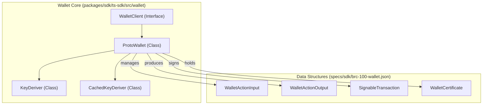
```mermaid
graph TD
    subgraph "Wallet Core (packages/sdk/ts-sdk/src/wallet)"
        A["WalletClient (Interface)"] --> B["ProtoWallet (Class)"]
        B --> C["KeyDeriver (Class)"]
        B --> D["CachedKeyDeriver (Class)"]
    end

    subgraph "Data Structures (specs/sdk/brc-100-wallet.json)"
        E["WalletActionInput"]
        F["WalletActionOutput"]
        G["SignableTransaction"]
        H["WalletCertificate"]
    end

    B -- "manages" --> E
    B -- "produces" --> F
    B -- "signs" --> G
    B -- "holds" --> H
```
Sources: [specs/sdk/brc-100-wallet.json:1-216](https://github.com/bsv-blockchain/ts-stack/blob/main/specs/sdk/brc-100-wallet.json#L1-L216), [packages/sdk/ts-sdk/src/wallet/ProtoWallet.ts:1-50](https://github.com/bsv-blockchain/ts-stack/blob/main/packages/sdk/ts-sdk/src/wallet/ProtoWallet.ts#L1-L50).

### Implementation Details: ProtoWallet
`ProtoWallet` serves as the primary implementation of the `WalletClient` interface. It leverages `KeyDeriver` for BRC-42 hierarchical derivation and handles the state of in-progress "Actions".

- **KeyDeriver**: Handles the mathematical derivation of private and public keys based on a root seed and a protocol/counterparty path [packages/sdk/ts-sdk/src/primitives/PrivateKey.ts:16-17](https://github.com/bsv-blockchain/ts-stack/blob/main/packages/sdk/ts-sdk/src/primitives/PrivateKey.ts#L16-L17).
- **CachedKeyDeriver**: A wrapper that provides memoization for derivation operations to improve performance in high-frequency environments like transaction signing [packages/sdk/ts-sdk/BENCHMARK.md:16-17](https://github.com/bsv-blockchain/ts-stack/blob/main/packages/sdk/ts-sdk/BENCHMARK.md#L16-L17).

## BRC-103 Mutual Authentication

BRC-103 defines a protocol for two peers to establish a cryptographically authenticated session without relying on centralized Certificate Authorities. It uses **Schnorr signatures** and **BRC-42 key derivation** to prove identity.

### Session Management & Transports
The authentication layer is implemented in `src/auth` and utilized by middleware packages to protect service boundaries.

- **Peer**: Represents a remote entity with a validated identity.
- **SessionManager**: Tracks active authenticated sessions, handling token expiration and rotation.
- **Transports**: BRC-103 can be carried over various transports, including HTTP (via headers) and WebSockets (via `AuthSocket`).

### BRC-103 Authentication Flow
The flow typically involves a challenge-response handshake where the client proves possession of a private key corresponding to a specific `identityKey`.

"BRC-103 Auth Flow & Code Entities"
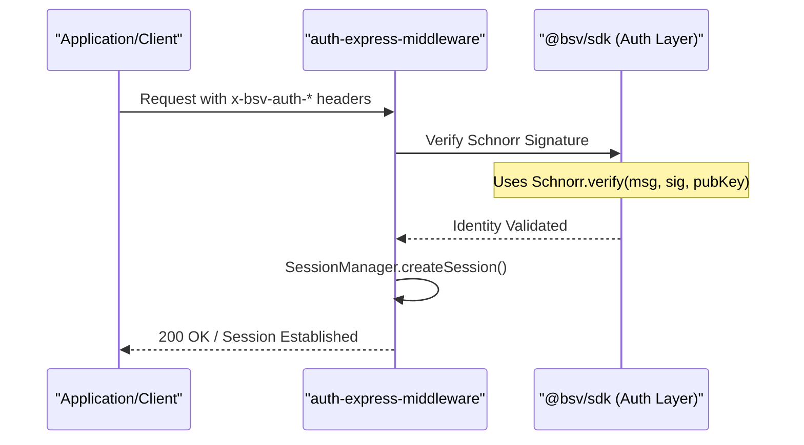
```mermaid
sequenceDiagram
    participant App as "Application/Client"
    participant MW as "auth-express-middleware"
    participant SDK as "@bsv/sdk (Auth Layer)"

    App->>MW: Request with x-bsv-auth-* headers
    MW->>SDK: Verify Schnorr Signature
    Note over SDK: Uses Schnorr.verify(msg, sig, pubKey)
    SDK-->>MW: Identity Validated
    MW->>MW: SessionManager.createSession()
    MW-->>App: 200 OK / Session Established
```
Sources: [packages/middleware/auth-express-middleware/BASELINE.md:1-15](https://github.com/bsv-blockchain/ts-stack/blob/main/packages/middleware/auth-express-middleware/BASELINE.md#L1-L15), [packages/sdk/ts-sdk/BENCHMARK.md:14-15](https://github.com/bsv-blockchain/ts-stack/blob/main/packages/sdk/ts-sdk/BENCHMARK.md#L14-L15).

## Error Handling (Error Taxonomy)

Wallet and Auth operations follow a strict error taxonomy defined in `specs/errors.md`. This ensures that errors crossing the boundary between a wallet and an application are machine-readable.

| Category | Example Code | Description |
| :--- | :--- | :--- |
| **Crypto** | `ERR_CRYPTO_KEY_DERIVATION_FAILED` | Failed BRC-42 derivation (e.g. point at infinity) [specs/errors.md:86-86](https://github.com/bsv-blockchain/ts-stack/blob/main/specs/errors.md#L86-L86). |
| **Transaction** | `ERR_TX_CONSTRUCTION_INSUFFICIENT_FUNDS` | Wallet cannot fund the requested outputs [specs/errors.md:99-99](https://github.com/bsv-blockchain/ts-stack/blob/main/specs/errors.md#L99-L99). |
| **Serialization** | `ERR_SERIALIZATION_INVALID_BEEF` | BEEF bytes fail validation during internalization [specs/errors.md:64-64](https://github.com/bsv-blockchain/ts-stack/blob/main/specs/errors.md#L64-L64). |
| **Auth** | `ERR_CRYPTO_INVALID_CERTIFICATE_SIGNATURE` | BRC-103 certificate signature mismatch [specs/errors.md:89-89](https://github.com/bsv-blockchain/ts-stack/blob/main/specs/errors.md#L89-L89). |

Sources: [specs/errors.md:1-140](https://github.com/bsv-blockchain/ts-stack/blob/main/specs/errors.md#L1-L140).

## Performance & Benchmarks

Critical paths in the Wallet and Auth layers are monitored for performance regressions. Key "Hot Paths" include:

1.  **Schnorr Sign/Verify**: Used in every BRC-103 handshake [packages/sdk/ts-sdk/BENCHMARK.md:14-15](https://github.com/bsv-blockchain/ts-stack/blob/main/packages/sdk/ts-sdk/BENCHMARK.md#L14-L15).
2.  **BRC-42 Key Derivation**: Performed for every transaction output and identity proof [packages/sdk/ts-sdk/BENCHMARK.md:16-17](https://github.com/bsv-blockchain/ts-stack/blob/main/packages/sdk/ts-sdk/BENCHMARK.md#L16-L17).
3.  **BEEF Encode/Decode**: The standard envelope format for BRC-100 `createAction` and `submit` operations [packages/sdk/ts-sdk/BENCHMARK.md:24-25](https://github.com/bsv-blockchain/ts-stack/blob/main/packages/sdk/ts-sdk/BENCHMARK.md#L24-L25).

Sources: [packages/sdk/ts-sdk/BENCHMARK.md:8-30](https://github.com/bsv-blockchain/ts-stack/blob/main/packages/sdk/ts-sdk/BENCHMARK.md#L8-L30).

---

# Page: Script Templates & Compat Layer

# Script Templates & Compat Layer

<details>
<summary>Relevant source files</summary>

The following files were used as context for generating this wiki page:

- [conformance/runner/go/.gitignore](https://github.com/bsv-blockchain/ts-stack/blob/main/conformance/runner/go/.gitignore)
- [conformance/runner/go/README.md](https://github.com/bsv-blockchain/ts-stack/blob/main/conformance/runner/go/README.md)
- [conformance/vectors/sdk/compat/bsm.json](https://github.com/bsv-blockchain/ts-stack/blob/main/conformance/vectors/sdk/compat/bsm.json)
- [conformance/vectors/sdk/crypto/signature.json](https://github.com/bsv-blockchain/ts-stack/blob/main/conformance/vectors/sdk/crypto/signature.json)
- [conformance/vectors/sdk/keys/private-key.json](https://github.com/bsv-blockchain/ts-stack/blob/main/conformance/vectors/sdk/keys/private-key.json)
- [packages/sdk/ts-templates/package.json](https://github.com/bsv-blockchain/ts-stack/blob/main/packages/sdk/ts-templates/package.json)

</details>


This section covers the higher-level script abstractions and compatibility modules within the BSV SDK ecosystem. It focuses on `@bsv/templates` for standard script patterns, the `compat` layer for legacy standards (BSM, ECIES, BIP276), and specialized SDK modules for identity and data storage.

## Script Templates (@bsv/templates)

The `@bsv/templates` package provides concrete implementations of the `ScriptTemplate` interface defined in the core SDK [packages/sdk/ts-sdk/src/transaction/ScriptTemplate.ts](https://github.com/bsv-blockchain/ts-stack/blob/main/packages/sdk/ts-sdk/src/transaction/ScriptTemplate.ts). These templates simplify the creation of complex locking and unlocking scripts by abstracting opcode sequences into functional classes.

### P2PKH (Pay-to-PublicKey-Hash)
The most common script template, implementing the standard Bitcoin payment pattern. It handles the generation of the locking script from an address or public key and the creation of the unlocking script using a private key signature.

### PushDrop
A specialized template used for data embedding and token protocols (like BTMS). It allows "pushing" data onto the stack and "dropping" it before executing a standard P2PKH or other spend condition.

### Data Flow: Script Generation
The following diagram illustrates how a `ScriptTemplate` interacts with the `Transaction` builder to produce valid scripts.

**Script Template Entity Mapping**
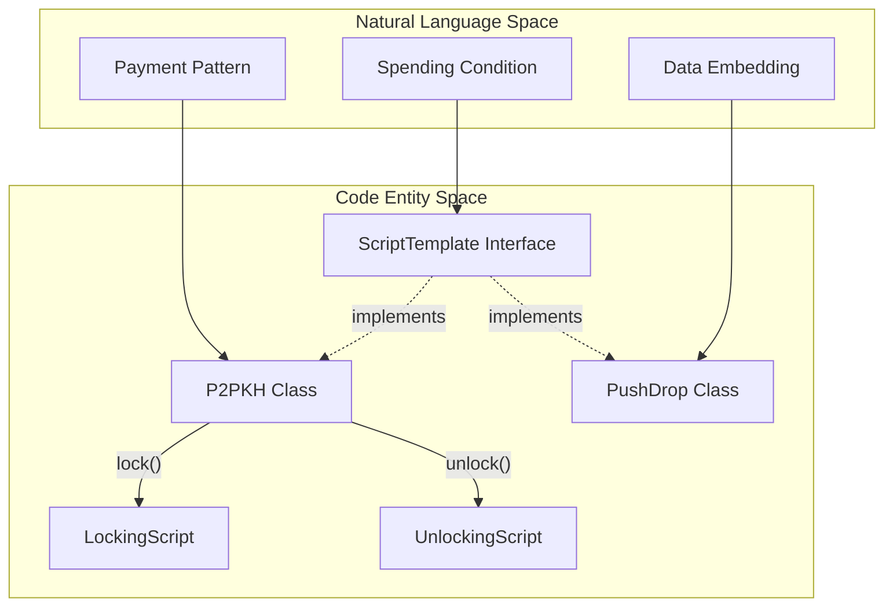
```mermaid
graph TD
    subgraph "Natural Language Space"
        A["Payment Pattern"]
        B["Spending Condition"]
        C["Data Embedding"]
    end

    subgraph "Code Entity Space"
        D["P2PKH Class"]
        E["PushDrop Class"]
        F["ScriptTemplate Interface"]
        G["LockingScript"]
        H["UnlockingScript"]
    end

    A --> D
    B --> F
    C --> E
    D -- "lock()" --> G
    D -- "unlock()" --> H
    F -. "implements" .-> D
    F -. "implements" .-> E
```
Sources: [packages/sdk/ts-templates/package.json:2-5](https://github.com/bsv-blockchain/ts-stack/blob/main/packages/sdk/ts-templates/package.json#L2-L5), [packages/sdk/ts-templates/package.json:63-65](https://github.com/bsv-blockchain/ts-stack/blob/main/packages/sdk/ts-templates/package.json#L63-L65)

---

## Compatibility Layer

The `compat` directory in the SDK provides implementations for legacy or cross-platform standards that do not strictly follow the core BRC-42 derivation or BEEF transaction formats but are essential for interoperability.

### Bitcoin Signed Messages (BSM)
BSM (BRC-77) is used for proving ownership of a private key by signing a human-readable string.
- **Key Function:** `BSM.sign(message, privKey)` creates a compact signature [conformance/vectors/sdk/compat/bsm.json:59-73](https://github.com/bsv-blockchain/ts-stack/blob/main/conformance/vectors/sdk/compat/bsm.json#L59-L73).
- **Verification:** `BSM.verify(message, signature, pubKey)` validates the signature against the message [conformance/vectors/sdk/compat/bsm.json:91-103](https://github.com/bsv-blockchain/ts-stack/blob/main/conformance/vectors/sdk/compat/bsm.json#L91-L103).
- **Magic Hash:** BSM prepends a specific prefix (`"\x18Bitcoin Signed Message:\n"`) to prevent "signature reuse" attacks where a message signature could be mistaken for a transaction signature [conformance/vectors/sdk/compat/bsm.json:11-21](https://github.com/bsv-blockchain/ts-stack/blob/main/conformance/vectors/sdk/compat/bsm.json#L11-L21).

### ECIES (Elliptic Curve Integrated Encryption Scheme)
Used for asymmetric encryption. It allows a sender to encrypt data using a recipient's public key, which only the recipient can decrypt with their private key.

### BIP276
A standard for prefixing and checksumming arbitrary data (like scripts or signatures) for human-readable transport, often used for sharing templates or specialized transaction data.

**Compatibility Layer Implementation**
| Standard | Implementation Class | Primary Purpose | Vector Reference |
| :--- | :--- | :--- | :--- |
| BRC-77 | `BSM` | Message Signing | `sdk.compat.bsm` |
| ECIES | `ECIES` | Asymmetric Encryption | N/A |
| BIP276 | `BIP276` | Data Encoding | N/A |

Sources: [conformance/vectors/sdk/compat/bsm.json:1-8](https://github.com/bsv-blockchain/ts-stack/blob/main/conformance/vectors/sdk/compat/bsm.json#L1-L8), [conformance/vectors/sdk/compat/bsm.json:121-135](https://github.com/bsv-blockchain/ts-stack/blob/main/conformance/vectors/sdk/compat/bsm.json#L121-L135)

---

## SDK Overlay Tools & Specialized Modules

Beyond transactions, the SDK contains modules for managing identity, registries, and key-value stores within the BSV ecosystem.

### Identity & Registry
- **Identity:** Manages BRC-42 based identities and their association with public keys.
- **Registry:** Provides mechanisms for looking up service endpoints or metadata associated with an identity.

### KVStore (Key-Value Store)
A simplified interface for persisting data to the blockchain using script-based storage patterns. It abstracts the process of creating transactions that represent "Put" or "Delete" operations on a decentralized key-value map.

### Data Flow: Identity and Keys
This diagram shows the relationship between cryptographic primitives and high-level identity modules.

**Identity System Mapping**
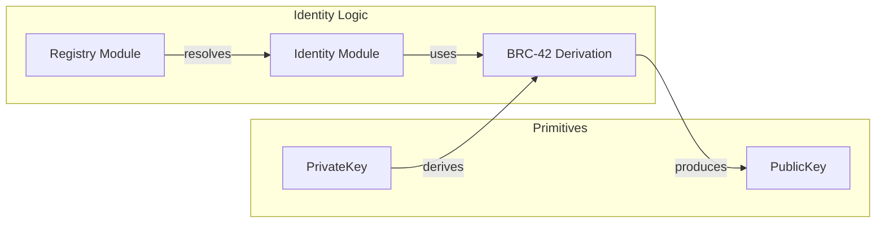
```mermaid
graph LR
    subgraph "Primitives"
        PK["PrivateKey"]
        PUB["PublicKey"]
    end

    subgraph "Identity Logic"
        ID["Identity Module"]
        REG["Registry Module"]
        BRC42["BRC-42 Derivation"]
    end

    PK -- "derives" --> BRC42
    BRC42 -- "produces" --> PUB
    ID -- "uses" --> BRC42
    REG -- "resolves" --> ID
```
Sources: [conformance/vectors/sdk/keys/private-key.json:83-94](https://github.com/bsv-blockchain/ts-stack/blob/main/conformance/vectors/sdk/keys/private-key.json#L83-L94), [conformance/vectors/sdk/keys/private-key.json:1-7](https://github.com/bsv-blockchain/ts-stack/blob/main/conformance/vectors/sdk/keys/private-key.json#L1-L7)

---

## Conformance & Validation

The `compat` and `template` layers are validated through the conformance suite to ensure parity between TypeScript and other implementations (like Go).

- **Signature Encodings:** Validates DER and Compact signature formats used by BSM and transaction templates [conformance/vectors/sdk/crypto/signature.json:1-8](https://github.com/bsv-blockchain/ts-stack/blob/main/conformance/vectors/sdk/crypto/signature.json#L1-L8).
- **Key Derivation:** Ensures that BRC-42 child keys are derived consistently across environments, which is critical for identity and registry modules [conformance/vectors/sdk/keys/private-key.json:83-146](https://github.com/bsv-blockchain/ts-stack/blob/main/conformance/vectors/sdk/keys/private-key.json#L83-L146).

Sources: [conformance/vectors/sdk/crypto/signature.json:9-25](https://github.com/bsv-blockchain/ts-stack/blob/main/conformance/vectors/sdk/crypto/signature.json#L9-L25), [conformance/vectors/sdk/compat/bsm.json:121-135](https://github.com/bsv-blockchain/ts-stack/blob/main/conformance/vectors/sdk/compat/bsm.json#L121-L135)

---

# Page: Wallet Layer

# Wallet Layer

<details>
<summary>Relevant source files</summary>

The following files were used as context for generating this wiki page:

- [packages/network/chaintracks-server/package.json](https://github.com/bsv-blockchain/ts-stack/blob/main/packages/network/chaintracks-server/package.json)
- [packages/overlays/overlay-express/package.json](https://github.com/bsv-blockchain/ts-stack/blob/main/packages/overlays/overlay-express/package.json)
- [packages/wallet/btms/README.md](https://github.com/bsv-blockchain/ts-stack/blob/main/packages/wallet/btms/README.md)
- [packages/wallet/btms/index.ts](https://github.com/bsv-blockchain/ts-stack/blob/main/packages/wallet/btms/index.ts)
- [packages/wallet/btms/jest.config.js](https://github.com/bsv-blockchain/ts-stack/blob/main/packages/wallet/btms/jest.config.js)
- [packages/wallet/btms/package-lock.json](https://github.com/bsv-blockchain/ts-stack/blob/main/packages/wallet/btms/package-lock.json)
- [packages/wallet/btms/src/BTMS.ts](https://github.com/bsv-blockchain/ts-stack/blob/main/packages/wallet/btms/src/BTMS.ts)
- [packages/wallet/btms/src/BTMSAdvanced.ts](https://github.com/bsv-blockchain/ts-stack/blob/main/packages/wallet/btms/src/BTMSAdvanced.ts)
- [packages/wallet/ts-wallet-relay/package.json](https://github.com/bsv-blockchain/ts-stack/blob/main/packages/wallet/ts-wallet-relay/package.json)
- [packages/wallet/wab/package.json](https://github.com/bsv-blockchain/ts-stack/blob/main/packages/wallet/wab/package.json)
- [packages/wallet/wallet-toolbox/package.json](https://github.com/bsv-blockchain/ts-stack/blob/main/packages/wallet/wallet-toolbox/package.json)

</details>


The Wallet Layer provides a comprehensive suite of packages for building, managing, and authenticating BSV wallets. It implements the **BRC-100** standard for wallet interfaces and provides reference implementations for storage, signing, and specialized token management.

## System Architecture

The Wallet Layer bridges the low-level cryptographic primitives of the SDK with high-level application requirements like mobile pairing, multi-factor authentication, and UTXO-based token lifecycles.

### Code Entity Mapping
The following diagram illustrates the relationship between key classes and their roles in the Wallet Layer.

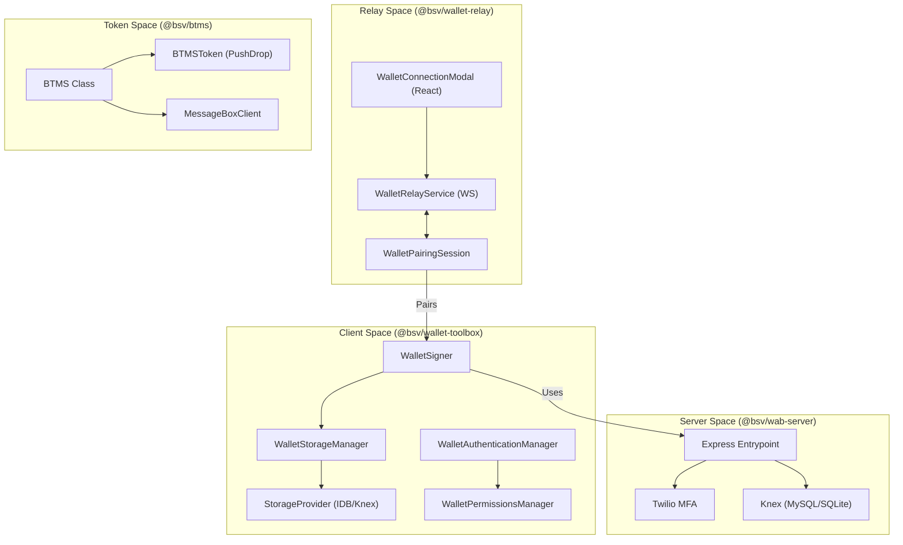
```mermaid
graph TD
    subgraph "Client Space (@bsv/wallet-toolbox)"
        A["WalletSigner"] --> B["WalletStorageManager"]
        B --> C["StorageProvider (IDB/Knex)"]
        D["WalletAuthenticationManager"] --> E["WalletPermissionsManager"]
    end

    subgraph "Server Space (@bsv/wab-server)"
        F["Express Entrypoint"] --> G["Twilio MFA"]
        F --> H["Knex (MySQL/SQLite)"]
    end

    subgraph "Relay Space (@bsv/wallet-relay)"
        I["WalletRelayService (WS)"] <--> J["WalletPairingSession"]
        K["WalletConnectionModal (React)"] --> I
    end

    subgraph "Token Space (@bsv/btms)"
        L["BTMS Class"] --> M["BTMSToken (PushDrop)"]
        L --> N["MessageBoxClient"]
    end

    A -- "Uses" --> F
    J -- "Pairs" --> A
```
Sources: [packages/wallet/wallet-toolbox/package.json:2-4](https://github.com/bsv-blockchain/ts-stack/blob/main/packages/wallet/wallet-toolbox/package.json#L2-L4), [packages/wallet/wab/package.json:2-5](https://github.com/bsv-blockchain/ts-stack/blob/main/packages/wallet/wab/package.json#L2-L5), [packages/wallet/ts-wallet-relay/package.json:2-4](https://github.com/bsv-blockchain/ts-stack/blob/main/packages/wallet/ts-wallet-relay/package.json#L2-L4), [packages/wallet/btms/src/BTMS.ts:98-120](https://github.com/bsv-blockchain/ts-stack/blob/main/packages/wallet/btms/src/BTMS.ts#L98-L120)

---

## Component Overview

### [wallet-toolbox: Storage, Signer & Wallet Manager](10-wallet-toolbox--Storage--Signer---Wallet-Manager.md)
The `@bsv/wallet-toolbox` package is the core implementation of a BRC-100 conforming wallet. It provides the `WalletSigner` for transaction signing and `WalletStorageManager` for managing keys and UTXOs. It supports multiple storage backends via `StorageKnex` (server/desktop) and `StorageIdb` (browser).

*   **Key Entities:** `WalletSigner`, `WalletStorageManager`, `WalletAuthenticationManager`.
*   **Build Targets:** Optimized builds for web, mobile, and server environments.
*   **For details, see [wallet-toolbox: Storage, Signer & Wallet Manager](10-wallet-toolbox--Storage--Signer---Wallet-Manager.md).**

Sources: [packages/wallet/wallet-toolbox/package.json:41-52](https://github.com/bsv-blockchain/ts-stack/blob/main/packages/wallet/wallet-toolbox/package.json#L41-L52), [packages/wallet/wallet-toolbox/package.json:2-4](https://github.com/bsv-blockchain/ts-stack/blob/main/packages/wallet/wallet-toolbox/package.json#L2-L4)

### [WAB: Wallet Authentication Backend](11-WAB--Wallet-Authentication-Backend.md)
The `@bsv/wab-server` (Wallet Authentication Backend) provides a secure Express-based environment for identity verification. It integrates with Twilio for multi-factor authentication (MFA) and uses Knex for flexible persistence across MySQL and SQLite.

*   **Key Entities:** Express server entrypoint, MFA handlers, Knex migrations.
*   **Integration:** Works alongside `wallet-toolbox` to verify user identities.
*   **For details, see [WAB: Wallet Authentication Backend](11-WAB--Wallet-Authentication-Backend.md).**

Sources: [packages/wallet/wab/package.json:15-26](https://github.com/bsv-blockchain/ts-stack/blob/main/packages/wallet/wab/package.json#L15-L26), [packages/wallet/wab/package.json:2-5](https://github.com/bsv-blockchain/ts-stack/blob/main/packages/wallet/wab/package.json#L2-L5)

### [Wallet Relay & Mobile Pairing](12-Wallet-Relay---Mobile-Pairing.md)
The `@bsv/wallet-relay` package facilitates secure, encrypted communication between a desktop/web application and a mobile wallet. It uses a WebSocket-based relay to handle QR-code pairing and session management.

*   **Key Entities:** `WalletRelayService`, `WalletPairingSession`, `useWalletRelayClient`.
*   **Frontend:** Includes a `WalletConnectionModal` React component for easy integration.
*   **For details, see [Wallet Relay & Mobile Pairing](12-Wallet-Relay---Mobile-Pairing.md).**

Sources: [packages/wallet/ts-wallet-relay/package.json:6-22](https://github.com/bsv-blockchain/ts-stack/blob/main/packages/wallet/ts-wallet-relay/package.json#L6-L22), [packages/wallet/ts-wallet-relay/package.json:40-46](https://github.com/bsv-blockchain/ts-stack/blob/main/packages/wallet/ts-wallet-relay/package.json#L40-L46)

### [BTMS: Token Management System](13-BTMS--Token-Management-System.md)
The `@bsv/btms` (Basic Token Management System) provides a high-level API for managing UTXO-based tokens. It uses **PushDrop** scripts to encode token metadata and amounts directly into transaction outputs.

*   **Key Entities:** `BTMS` class, `BTMSToken` (low-level encoding), `BTMSAdvanced` (privacy features).
*   **Protocol:** Implements a 3-field PushDrop format (Asset ID, Amount, Metadata).
*   **For details, see [BTMS: Token Management System](13-BTMS--Token-Management-System.md).**

Sources: [packages/wallet/btms/src/BTMS.ts:98-134](https://github.com/bsv-blockchain/ts-stack/blob/main/packages/wallet/btms/src/BTMS.ts#L98-L134), [packages/wallet/btms/README.md:78-87](https://github.com/bsv-blockchain/ts-stack/blob/main/packages/wallet/btms/README.md#L78-L87)

---

## Supporting Services

The Wallet Layer is supported by specialized network services that provide blockchain context and message delivery.

| Package | Purpose | Code Pointer |
| :--- | :--- | :--- |
| `@bsv/chaintracks-server` | Tracks blockchain headers for SPV validation. | [packages/network/chaintracks-server/package.json:5-6](https://github.com/bsv-blockchain/ts-stack/blob/main/packages/network/chaintracks-server/package.json#L5-L6) |
| `@bsv/message-box-client` | Asynchronous delivery of tokens and payment requests. | [packages/wallet/btms/src/BTMS.ts:38-43](https://github.com/bsv-blockchain/ts-stack/blob/main/packages/wallet/btms/src/BTMS.ts#L38-L43) |
| `@bsv/auth-express-middleware` | BRC-103 mutual authentication for wallet services. | [packages/wallet/wallet-toolbox/package.json:42](https://github.com/bsv-blockchain/ts-stack/blob/main/packages/wallet/wallet-toolbox/package.json#L42) |

### Service Interaction Diagram
This diagram shows how the `BTMS` class interacts with other services to issue and send tokens.

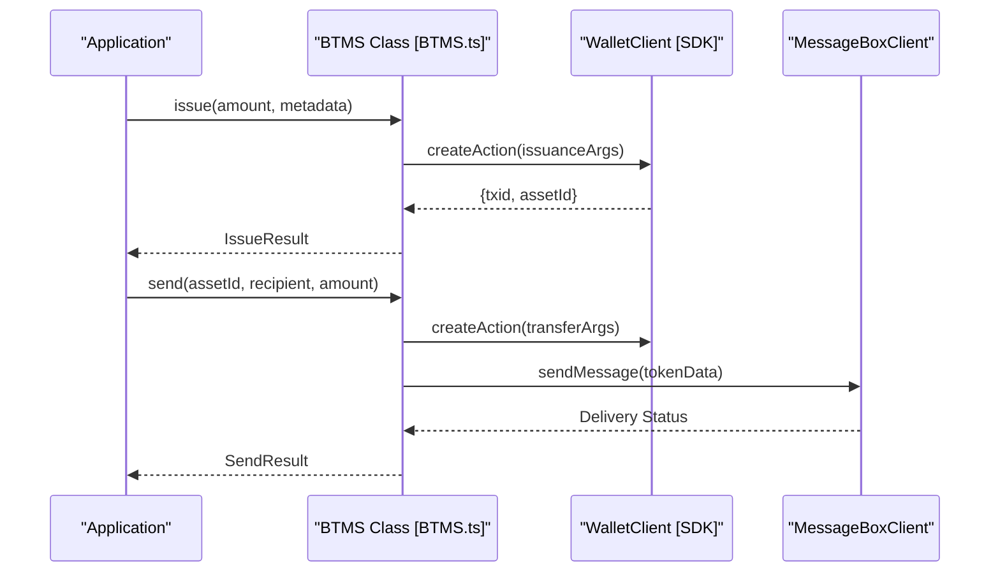
```mermaid
sequenceDiagram
    participant App as "Application"
    participant BTMS as "BTMS Class [BTMS.ts]"
    participant Wallet as "WalletClient [SDK]"
    participant MB as "MessageBoxClient"

    App->>BTMS: issue(amount, metadata)
    BTMS->>Wallet: createAction(issuanceArgs)
    Wallet-->>BTMS: {txid, assetId}
    BTMS-->>App: IssueResult

    App->>BTMS: send(assetId, recipient, amount)
    BTMS->>Wallet: createAction(transferArgs)
    BTMS->>MB: sendMessage(tokenData)
    MB-->>BTMS: Delivery Status
    BTMS-->>App: SendResult
```
Sources: [packages/wallet/btms/src/BTMS.ts:161-230](https://github.com/bsv-blockchain/ts-stack/blob/main/packages/wallet/btms/src/BTMS.ts#L161-L230), [packages/wallet/btms/README.md:57-61](https://github.com/bsv-blockchain/ts-stack/blob/main/packages/wallet/btms/README.md#L57-L61)

---

# Page: wallet-toolbox: Storage, Signer & Wallet Manager

# wallet-toolbox: Storage, Signer & Wallet Manager

<details>
<summary>Relevant source files</summary>

The following files were used as context for generating this wiki page:

- [packages/network/chaintracks-server/package.json](https://github.com/bsv-blockchain/ts-stack/blob/main/packages/network/chaintracks-server/package.json)
- [packages/overlays/overlay-express-examples/package.json](https://github.com/bsv-blockchain/ts-stack/blob/main/packages/overlays/overlay-express-examples/package.json)
- [packages/overlays/overlay-express/package.json](https://github.com/bsv-blockchain/ts-stack/blob/main/packages/overlays/overlay-express/package.json)
- [packages/wallet/wab/package.json](https://github.com/bsv-blockchain/ts-stack/blob/main/packages/wallet/wab/package.json)
- [packages/wallet/wallet-infra/package.json](https://github.com/bsv-blockchain/ts-stack/blob/main/packages/wallet/wallet-infra/package.json)
- [packages/wallet/wallet-toolbox-examples/package.json](https://github.com/bsv-blockchain/ts-stack/blob/main/packages/wallet/wallet-toolbox-examples/package.json)
- [packages/wallet/wallet-toolbox-examples/src/internalizeWalletPayment.ts](https://github.com/bsv-blockchain/ts-stack/blob/main/packages/wallet/wallet-toolbox-examples/src/internalizeWalletPayment.ts)
- [packages/wallet/wallet-toolbox-examples/src/janitor.ts](https://github.com/bsv-blockchain/ts-stack/blob/main/packages/wallet/wallet-toolbox-examples/src/janitor.ts)
- [packages/wallet/wallet-toolbox-examples/src/listChange.ts](https://github.com/bsv-blockchain/ts-stack/blob/main/packages/wallet/wallet-toolbox-examples/src/listChange.ts)
- [packages/wallet/wallet-toolbox/client/package.json](https://github.com/bsv-blockchain/ts-stack/blob/main/packages/wallet/wallet-toolbox/client/package.json)
- [packages/wallet/wallet-toolbox/mobile/package.json](https://github.com/bsv-blockchain/ts-stack/blob/main/packages/wallet/wallet-toolbox/mobile/package.json)
- [packages/wallet/wallet-toolbox/package.json](https://github.com/bsv-blockchain/ts-stack/blob/main/packages/wallet/wallet-toolbox/package.json)
- [packages/wallet/wallet-toolbox/src/storage/schema/entities/__tests/CertificateFieldTests.test.ts](https://github.com/bsv-blockchain/ts-stack/blob/main/packages/wallet/wallet-toolbox/src/storage/schema/entities/__tests/CertificateFieldTests.test.ts)
- [packages/wallet/wallet-toolbox/src/storage/schema/entities/__tests/usersTests.test.ts](https://github.com/bsv-blockchain/ts-stack/blob/main/packages/wallet/wallet-toolbox/src/storage/schema/entities/__tests/usersTests.test.ts)

</details>


The `@bsv/wallet-toolbox` package provides a high-performance, BRC-100 conforming implementation of a Bitcoin SV wallet. It serves as the reference implementation for wallet logic within the TS-Stack, handling the complexities of UTXO management, transaction signing, and persistent storage across multiple environments (Server, Browser, and Mobile).

## Overview & Multi-Target Builds

The toolbox is designed to be environment-agnostic while providing specialized entry points for different platforms. It leverages a modular architecture where storage and signing logic are decoupled from the core wallet state management.

| Target | Package / Entry Point | Primary Technologies |
| :--- | :--- | :--- |
| **All (Server)** | `@bsv/wallet-toolbox` | Node.js, Knex, MySQL, SQLite [packages/wallet/wallet-toolbox/package.json:2-52](https://github.com/bsv-blockchain/ts-stack/blob/main/packages/wallet/wallet-toolbox/package.json#L2-L52) |
| **Client (Web)** | `@bsv/wallet-toolbox-client` | IndexedDB (idb), Web Crypto [packages/overlays/overlay-express/package.json:73-73](https://github.com/bsv-blockchain/ts-stack/blob/main/packages/overlays/overlay-express/package.json#L73-L73) |
| **Mobile** | `@bsv/wallet-toolbox-mobile` | React Native / SQLite [packages/wallet/wallet-toolbox/mobile/package.json:1-10](https://github.com/bsv-blockchain/ts-stack/blob/main/packages/wallet/wallet-toolbox/mobile/package.json#L1-L10) |

Sources: [packages/wallet/wallet-toolbox/package.json:1-73](https://github.com/bsv-blockchain/ts-stack/blob/main/packages/wallet/wallet-toolbox/package.json#L1-L73), [packages/overlays/overlay-express/package.json:68-80](https://github.com/bsv-blockchain/ts-stack/blob/main/packages/overlays/overlay-express/package.json#L68-L80)

## Core Architecture & Data Flow

The system revolves around three primary pillars: `WalletSigner`, `WalletStorageManager`, and the `Wallet` itself.

### Wallet System Interaction Diagram
This diagram illustrates how the toolbox components interact to process a transaction.

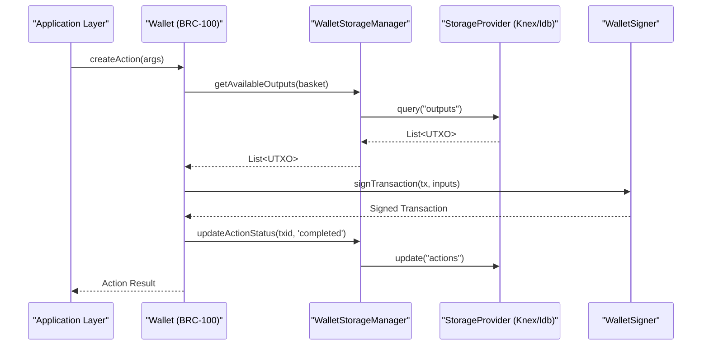
```mermaid
sequenceDiagram
    participant App as "Application Layer"
    participant W as "Wallet (BRC-100)"
    participant SM as "WalletStorageManager"
    participant DB as "StorageProvider (Knex/Idb)"
    participant S as "WalletSigner"

    App->>W: createAction(args)
    W->>SM: getAvailableOutputs(basket)
    SM->>DB: query("outputs")
    DB-->>SM: List<UTXO>
    SM-->>W: List<UTXO>
    W->>S: signTransaction(tx, inputs)
    S-->>W: Signed Transaction
    W->>SM: updateActionStatus(txid, 'completed')
    SM->>DB: update("actions")
    W-->>App: Action Result
```
Sources: [packages/wallet/wallet-toolbox/src/storage/schema/entities/__tests/usersTests.test.ts:84-113](https://github.com/bsv-blockchain/ts-stack/blob/main/packages/wallet/wallet-toolbox/src/storage/schema/entities/__tests/usersTests.test.ts#L84-L113), [packages/wallet/wallet-toolbox-examples/src/internalizeWalletPayment.ts:45-64](https://github.com/bsv-blockchain/ts-stack/blob/main/packages/wallet/wallet-toolbox-examples/src/internalizeWalletPayment.ts#L45-L64)

## WalletStorageManager & Storage Providers

The `WalletStorageManager` abstracts the underlying database. It supports multiple `StorageProvider` implementations, allowing the same wallet logic to run on a server using MySQL or in a browser using IndexedDB.

### Key Entities
The storage layer manages several BRC-100 compliant entities:
- **EntityUser**: Manages identity keys and user-specific settings [packages/wallet/wallet-toolbox/src/storage/schema/entities/__tests/usersTests.test.ts:33-42](https://github.com/bsv-blockchain/ts-stack/blob/main/packages/wallet/wallet-toolbox/src/storage/schema/entities/__tests/usersTests.test.ts#L33-L42).
- **EntityCertificate**: Stores BRC-116/BRC-117 identity certificates [packages/wallet/wallet-toolbox/src/storage/schema/entities/__tests/CertificateFieldTests.test.ts:35-47](https://github.com/bsv-blockchain/ts-stack/blob/main/packages/wallet/wallet-toolbox/src/storage/schema/entities/__tests/CertificateFieldTests.test.ts#L35-L47).
- **EntityCertificateField**: Individual fields within a certificate, supporting master key encryption [packages/wallet/wallet-toolbox/src/storage/schema/entities/__tests/CertificateFieldTests.test.ts:52-61](https://github.com/bsv-blockchain/ts-stack/blob/main/packages/wallet/wallet-toolbox/src/storage/schema/entities/__tests/CertificateFieldTests.test.ts#L52-L61).

### Implementation Details
- **StorageKnex**: Uses the Knex.js query builder to support PostgreSQL, MySQL, and SQLite. Used primarily in `@bsv/wallet-infra` and `@bsv/wab-server` [packages/wallet/wallet-infra/package.json:38-47](https://github.com/bsv-blockchain/ts-stack/blob/main/packages/wallet/wallet-infra/package.json#L38-L47).
- **StorageIdb**: A browser-based provider utilizing the `idb` wrapper for IndexedDB [packages/wallet/wallet-toolbox/package.json:48-48](https://github.com/bsv-blockchain/ts-stack/blob/main/packages/wallet/wallet-toolbox/package.json#L48-L48).
- **Sync Layer**: The `SyncMap` and `createSyncMap` functions allow for reconciling data between different storage instances, essential for multi-device synchronization [packages/wallet/wallet-toolbox/src/storage/schema/entities/__tests/usersTests.test.ts:107-110](https://github.com/bsv-blockchain/ts-stack/blob/main/packages/wallet/wallet-toolbox/src/storage/schema/entities/__tests/usersTests.test.ts#L107-L110).

Sources: [packages/wallet/wallet-toolbox/src/storage/schema/entities/__tests/usersTests.test.ts:1-208](https://github.com/bsv-blockchain/ts-stack/blob/main/packages/wallet/wallet-toolbox/src/storage/schema/entities/__tests/usersTests.test.ts#L1-L208), [packages/wallet/wallet-toolbox/src/storage/schema/entities/__tests/CertificateFieldTests.test.ts:1-154](https://github.com/bsv-blockchain/ts-stack/blob/main/packages/wallet/wallet-toolbox/src/storage/schema/entities/__tests/CertificateFieldTests.test.ts#L1-L154), [packages/wallet/wallet-infra/package.json:38-47](https://github.com/bsv-blockchain/ts-stack/blob/main/packages/wallet/wallet-infra/package.json#L38-L47)

## WalletSigner & Authentication

The `WalletSigner` is responsible for all cryptographic operations. It handles BRC-42 key derivation and transaction signing without exposing the root private key to the rest of the application.

- **Internalization**: The `internalizeAction` function allows a wallet to ingest external outputs (like BRC-29 payments) by deriving the correct keys from a `paymentRemittance` [packages/wallet/wallet-toolbox-examples/src/internalizeWalletPayment.ts:49-64](https://github.com/bsv-blockchain/ts-stack/blob/main/packages/wallet/wallet-toolbox-examples/src/internalizeWalletPayment.ts#L49-L64).
- **WalletAuthenticationManager**: Manages BRC-103 mutual authentication sessions, ensuring that only authorized peers can request signatures or view balances.

Sources: [packages/wallet/wallet-toolbox-examples/src/internalizeWalletPayment.ts:33-69](https://github.com/bsv-blockchain/ts-stack/blob/main/packages/wallet/wallet-toolbox-examples/src/internalizeWalletPayment.ts#L33-L69), [packages/wallet/wallet-toolbox/package.json:42-44](https://github.com/bsv-blockchain/ts-stack/blob/main/packages/wallet/wallet-toolbox/package.json#L42-L44)

## Wallet-Infra Reference Deployment

The `@bsv/wallet-infra` package is a reference implementation of a UTXO Management Server. It combines the `wallet-toolbox` with Express middleware to provide a scalable wallet backend.

### Component Association Diagram
This diagram maps the high-level infrastructure components to their specific code entities.

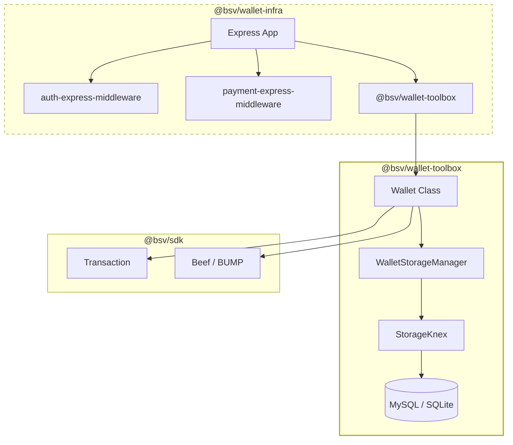
```mermaid
graph TD
    subgraph Server ["@bsv/wallet-infra"]
        E["Express App"] --> AM["auth-express-middleware"]
        E --> PM["payment-express-middleware"]
        E --> WT["@bsv/wallet-toolbox"]
    end

    subgraph Toolbox ["@bsv/wallet-toolbox"]
        WT --> W["Wallet Class"]
        W --> SM["WalletStorageManager"]
        SM --> SK["StorageKnex"]
        SK --> DB[("MySQL / SQLite")]
    end

    subgraph SDK ["@bsv/sdk"]
        W --> TX["Transaction"]
        W --> BF["Beef / BUMP"]
    end

    style Server stroke-dasharray: 5 5
    style Toolbox stroke-width: 2px
```
Sources: [packages/wallet/wallet-infra/package.json:38-47](https://github.com/bsv-blockchain/ts-stack/blob/main/packages/wallet/wallet-infra/package.json#L38-L47), [packages/wallet/wallet-toolbox/package.json:42-49](https://github.com/bsv-blockchain/ts-stack/blob/main/packages/wallet/wallet-toolbox/package.json#L42-L49)

### Key Features in Infrastructure
- **ChaintracksService**: A service within the toolbox used by `@bsv/chaintracks-server` to monitor blockchain headers and validate Merkle paths [packages/network/chaintracks-server/package.json:5-33](https://github.com/bsv-blockchain/ts-stack/blob/main/packages/network/chaintracks-server/package.json#L5-L33).
- **Janitor & Maintenance**: Tools like `janitorOnIdentity` are used to find and release unspendable or invalid change outputs, ensuring the UTXO set remains clean [packages/wallet/wallet-toolbox-examples/src/janitor.ts:15-50](https://github.com/bsv-blockchain/ts-stack/blob/main/packages/wallet/wallet-toolbox-examples/src/janitor.ts#L15-L50).
- **Output Listing**: Advanced filtering via `listOutputs` allows applications to query specific "baskets" of UTXOs (e.g., `specOpInvalidChange`) [packages/wallet/wallet-toolbox-examples/src/janitor.ts:25-25](https://github.com/bsv-blockchain/ts-stack/blob/main/packages/wallet/wallet-toolbox-examples/src/janitor.ts#L25-L25).

Sources: [packages/network/chaintracks-server/package.json:1-42](https://github.com/bsv-blockchain/ts-stack/blob/main/packages/network/chaintracks-server/package.json#L1-L42), [packages/wallet/wallet-toolbox-examples/src/janitor.ts:1-172](https://github.com/bsv-blockchain/ts-stack/blob/main/packages/wallet/wallet-toolbox-examples/src/janitor.ts#L1-L172), [packages/wallet/wallet-toolbox-examples/src/listChange.ts:14-47](https://github.com/bsv-blockchain/ts-stack/blob/main/packages/wallet/wallet-toolbox-examples/src/listChange.ts#L14-L47)

---

# Page: WAB: Wallet Authentication Backend

# WAB: Wallet Authentication Backend

<details>
<summary>Relevant source files</summary>

The following files were used as context for generating this wiki page:

- [packages/network/chaintracks-server/package.json](https://github.com/bsv-blockchain/ts-stack/blob/main/packages/network/chaintracks-server/package.json)
- [packages/overlays/overlay-express/package.json](https://github.com/bsv-blockchain/ts-stack/blob/main/packages/overlays/overlay-express/package.json)
- [packages/wallet/wab/package.json](https://github.com/bsv-blockchain/ts-stack/blob/main/packages/wallet/wab/package.json)
- [packages/wallet/wallet-toolbox/package.json](https://github.com/bsv-blockchain/ts-stack/blob/main/packages/wallet/wallet-toolbox/package.json)

</details>


The Wallet Authentication Backend (WAB) is a specialized Express-based service within the `@bsv/ts-stack` designed to facilitate secure identity verification and multi-factor authentication (MFA) for Bitcoin SV wallets. It serves as the bridge between a user's physical identity (via SMS/Twilio) and their cryptographic identity managed by the `wallet-toolbox`.

## Overview and Purpose

WAB provides a centralized service for managing user authentication state, rate limiting, and MFA challenges. It integrates deeply with the `wallet-toolbox` to handle identity verification logic while providing a robust server-side implementation for production environments.

### Key Capabilities:
*   **Multi-Factor Authentication:** Built-in support for Twilio-based SMS verification codes [packages/wallet/wab/package.json:25-25](https://github.com/bsv-blockchain/ts-stack/blob/main/packages/wallet/wab/package.json#L25-L25).
*   **Database Persistence:** Flexible storage using Knex.js, supporting MySQL and SQLite for managing sessions and migration state [packages/wallet/wab/package.json:22-24](https://github.com/bsv-blockchain/ts-stack/blob/main/packages/wallet/wab/package.json#L22-L24).
*   **Rate Limiting:** Integrated protection against brute-force attacks on MFA endpoints [packages/wallet/wab/package.json:20-20](https://github.com/bsv-blockchain/ts-stack/blob/main/packages/wallet/wab/package.json#L20-L20).
*   **Wallet Integration:** Direct dependency on `@bsv/wallet-toolbox` for BRC-100 compliant wallet operations [packages/wallet/wab/package.json:17-17](https://github.com/bsv-blockchain/ts-stack/blob/main/packages/wallet/wab/package.json#L17-L17).

---

## System Architecture

WAB operates as a middleware-heavy Express server. It sits between the client-side wallet applications and the broader BSV ecosystem services.

### Logic Flow: Code to Entity Mapping

The following diagram illustrates how the WAB server components interact to process authentication requests.

**WAB Authentication Data Flow**
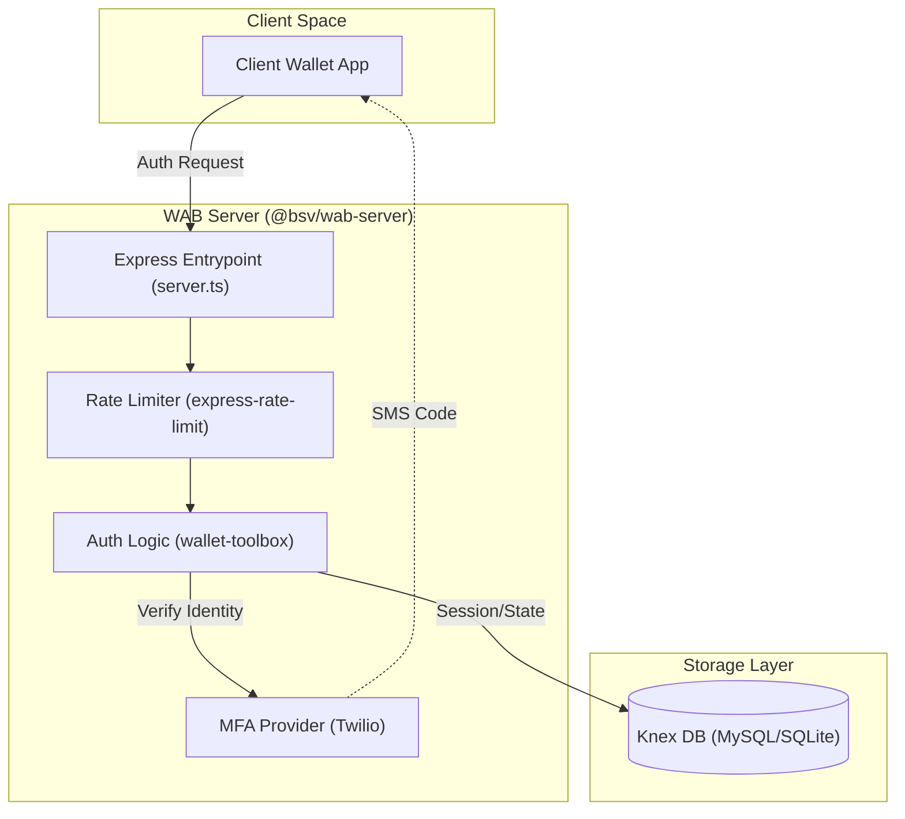
```mermaid
graph TD
    subgraph "Client Space"
        A["Client Wallet App"]
    end

    subgraph "WAB Server (@bsv/wab-server)"
        B["Express Entrypoint (server.ts)"]
        C["Rate Limiter (express-rate-limit)"]
        D["Auth Logic (wallet-toolbox)"]
        E["MFA Provider (Twilio)"]
    end

    subgraph "Storage Layer"
        F[("Knex DB (MySQL/SQLite)")]
    end

    A -->|"Auth Request"| B
    B --> C
    C --> D
    D -->|"Verify Identity"| E
    D -->|"Session/State"| F
    E -.->|"SMS Code"| A
```
Sources: [packages/wallet/wab/package.json:5-26](https://github.com/bsv-blockchain/ts-stack/blob/main/packages/wallet/wab/package.json#L5-L26), [packages/wallet/wab/package.json:8-9](https://github.com/bsv-blockchain/ts-stack/blob/main/packages/wallet/wab/package.json#L8-L9)

---

## Implementation Details

### Server Entrypoint and Middleware
The WAB server is initialized via `src/server.ts` [packages/wallet/wab/package.json:9-9](https://github.com/bsv-blockchain/ts-stack/blob/main/packages/wallet/wab/package.json#L9-L9). It utilizes `body-parser` for JSON payload handling and `dotenv` for environment configuration.

| Component | Package / Tool | Purpose |
| :--- | :--- | :--- |
| **Server Framework** | `express` | Handles HTTP routing and lifecycle [packages/wallet/wab/package.json:19-19](https://github.com/bsv-blockchain/ts-stack/blob/main/packages/wallet/wab/package.json#L19-L19) |
| **Security** | `express-rate-limit` | Prevents credential stuffing and MFA exhaustion [packages/wallet/wab/package.json:20-20](https://github.com/bsv-blockchain/ts-stack/blob/main/packages/wallet/wab/package.json#L20-L20) |
| **Data Integrity** | `json-stable-stringify` | Ensures consistent hashing of identity objects [packages/wallet/wab/package.json:21-21](https://github.com/bsv-blockchain/ts-stack/blob/main/packages/wallet/wab/package.json#L21-L21) |

### Persistence and Migrations
WAB uses `knex` to manage its relational schema. This allows for seamless transitions between development (SQLite) and production (MySQL) environments.

*   **Migrations:** Managed via `knexfile.ts` using the `migrate:latest` command [packages/wallet/wab/package.json:11-11](https://github.com/bsv-blockchain/ts-stack/blob/main/packages/wallet/wab/package.json#L11-L11).
*   **Drivers:** Supports `mysql2` for high-concurrency production deployments and `sqlite3` for local testing or lightweight instances [packages/wallet/wab/package.json:23-24](https://github.com/bsv-blockchain/ts-stack/blob/main/packages/wallet/wab/package.json#L23-L24).

### Integration with Wallet Toolbox
WAB is not a standalone wallet; it is a backend for the `@bsv/wallet-toolbox`. It specifically leverages the `WalletAuthenticationManager` and `StorageKnex` components from the toolbox to enforce BRC-100 standards.

**Component Interaction**
```mermaid
graph LR
    subgraph "WAB (@bsv/wab-server)"
        Entry["server.ts"]
    end

    subgraph "Wallet Toolbox (@bsv/wallet-toolbox)"
        AuthMan["WalletAuthenticationManager"]
        KnexStore["StorageKnex"]
    end

    Entry --> AuthMan
    AuthMan --> KnexStore
    KnexStore -->|"SQL Queries"| DB[("Database")]
```
Sources: [packages/wallet/wab/package.json:17-17](https://github.com/bsv-blockchain/ts-stack/blob/main/packages/wallet/wab/package.json#L17-L17), [packages/wallet/wallet-toolbox/package.json:4-4](https://github.com/bsv-blockchain/ts-stack/blob/main/packages/wallet/wallet-toolbox/package.json#L4-L4), [packages/wallet/wallet-toolbox/package.json:49-50](https://github.com/bsv-blockchain/ts-stack/blob/main/packages/wallet/wallet-toolbox/package.json#L49-L50)

---

## Development and Deployment

### Scripts
The package defines several lifecycle scripts for development and production:

*   **`npm run dev`**: Starts the server using `ts-node-dev` with hot-reloading [packages/wallet/wab/package.json:9-9](https://github.com/bsv-blockchain/ts-stack/blob/main/packages/wallet/wab/package.json#L9-L9).
*   **`npm run build`**: Compiles TypeScript source to the `dist/` directory [packages/wallet/wab/package.json:10-10](https://github.com/bsv-blockchain/ts-stack/blob/main/packages/wallet/wab/package.json#L10-L10).
*   **`npm run migrate`**: Runs database schema updates [packages/wallet/wab/package.json:11-11](https://github.com/bsv-blockchain/ts-stack/blob/main/packages/wallet/wab/package.json#L11-L11).
*   **`npm run test`**: Executes the Jest test suite [packages/wallet/wab/package.json:12-12](https://github.com/bsv-blockchain/ts-stack/blob/main/packages/wallet/wab/package.json#L12-L12).

### Configuration
Environment variables (via `.env`) are used to configure:
1.  **Twilio Credentials**: SID, Auth Token, and Verify Service ID for SMS MFA.
2.  **Database Connection**: Connection strings for MySQL or file paths for SQLite.
3.  **Rate Limits**: Thresholds for API request throttling.

Sources: [packages/wallet/wab/package.json:7-14](https://github.com/bsv-blockchain/ts-stack/blob/main/packages/wallet/wab/package.json#L7-L14), [packages/wallet/wab/package.json:18-18](https://github.com/bsv-blockchain/ts-stack/blob/main/packages/wallet/wab/package.json#L18-L18)

---

# Page: Wallet Relay & Mobile Pairing

# Wallet Relay & Mobile Pairing

<details>
<summary>Relevant source files</summary>

The following files were used as context for generating this wiki page:

- [packages/messaging/messagebox-services/backend/package-lock.json](https://github.com/bsv-blockchain/ts-stack/blob/main/packages/messaging/messagebox-services/backend/package-lock.json)
- [packages/wallet/ts-wallet-relay/dist/client.cjs.map](https://github.com/bsv-blockchain/ts-stack/blob/main/packages/wallet/ts-wallet-relay/dist/client.cjs.map)
- [packages/wallet/ts-wallet-relay/dist/client.js.map](https://github.com/bsv-blockchain/ts-stack/blob/main/packages/wallet/ts-wallet-relay/dist/client.js.map)
- [packages/wallet/ts-wallet-relay/dist/index.cjs.map](https://github.com/bsv-blockchain/ts-stack/blob/main/packages/wallet/ts-wallet-relay/dist/index.cjs.map)
- [packages/wallet/ts-wallet-relay/dist/index.js.map](https://github.com/bsv-blockchain/ts-stack/blob/main/packages/wallet/ts-wallet-relay/dist/index.js.map)
- [packages/wallet/ts-wallet-relay/dist/react.cjs.map](https://github.com/bsv-blockchain/ts-stack/blob/main/packages/wallet/ts-wallet-relay/dist/react.cjs.map)
- [packages/wallet/ts-wallet-relay/dist/react.js.map](https://github.com/bsv-blockchain/ts-stack/blob/main/packages/wallet/ts-wallet-relay/dist/react.js.map)
- [packages/wallet/ts-wallet-relay/package.json](https://github.com/bsv-blockchain/ts-stack/blob/main/packages/wallet/ts-wallet-relay/package.json)

</details>


The `@bsv/wallet-relay` package provides a secure, encrypted communication bridge between a desktop application (the "Client") and a mobile wallet (the "Peer"). It enables mobile-first wallet interaction on desktop sites using QR-code-based pairing and encrypted WebSocket communication.

## System Architecture

The system consists of three primary components:
1.  **WalletRelayService (Backend):** A Node.js service that manages sessions and provides a WebSocket relay.
2.  **WalletRelayClient (Desktop/Web):** A client library (with React hooks) for desktop applications to request a session and send RPC commands.
3.  **WalletPairingSession (Mobile):** A client library for mobile wallets to connect to the relay, decrypt requests, and provide responses.

### Data Flow & Encryption
All communication between the desktop and mobile is end-to-end encrypted using the `@bsv/sdk` encryption primitives. The relay server acts as a blind mailbox; it routes `WireEnvelope` objects but cannot read the `ciphertext` inside them.

Title: Wallet Relay Communication Flow
```mermaid
sequenceDiagram
    participant D as Desktop (WalletRelayClient)
    participant R as Relay (WebSocketRelay)
    participant M as Mobile (WalletPairingSession)

    Note over D,M: Session Creation (HTTP)
    D->>R: POST /session
    R-->>D: { topic, pairingUri, qrDataUrl }

    Note over D,M: WebSocket Handshake
    D->>R: ws://relay/ws?topic=XYZ&role=desktop
    M->>R: ws://relay/ws?topic=XYZ&role=mobile

    Note over D,M: Encrypted RPC Exchange
    D->>R: WireEnvelope (Encrypted RpcRequest)
    R->>M: WireEnvelope (Forwarded)
    M->>M: Decrypt & Process
    M->>R: WireEnvelope (Encrypted RpcResponse)
    R->>D: WireEnvelope (Forwarded)
```
Sources: `[packages/wallet/ts-wallet-relay/dist/index.js.map:1-1](https://github.com/bsv-blockchain/ts-stack/blob/main/packages/wallet/ts-wallet-relay/dist/index.js.map#L1-L1)`, `[packages/wallet/ts-wallet-relay/dist/client.js.map:1-1](https://github.com/bsv-blockchain/ts-stack/blob/main/packages/wallet/ts-wallet-relay/dist/client.js.map#L1-L1)`

---

## Backend: WalletRelayService

The `WalletRelayService` is the entry point for the server-side implementation. It coordinates session management via `QRSessionManager` and message routing via `WebSocketRelay`.

### Key Components
-   **`WebSocketRelay`**: Manages raw WebSocket connections, heartbeats, and message buffering for disconnected clients `[packages/wallet/ts-wallet-relay/dist/index.js.map:39-40](https://github.com/bsv-blockchain/ts-stack/blob/main/packages/wallet/ts-wallet-relay/dist/index.js.map#L39-L40)`.
-   **`QRSessionManager`**: Handles the lifecycle of pairing sessions, including generating the `pairingUri` and QR codes `[packages/wallet/ts-wallet-relay/dist/index.js.map:1-1](https://github.com/bsv-blockchain/ts-stack/blob/main/packages/wallet/ts-wallet-relay/dist/index.js.map#L1-L1)`.
-   **`WalletRequestHandler`**: An Express-compatible handler for the `/session` and `/session/:topic` HTTP endpoints `[packages/wallet/ts-wallet-relay/dist/index.js.map:1-1](https://github.com/bsv-blockchain/ts-stack/blob/main/packages/wallet/ts-wallet-relay/dist/index.js.map#L1-L1)`.

### WebSocket Relay Logic
The relay uses a `TopicEntry` to track the two halves of a pairing. If one side is disconnected when a message arrives, the relay buffers the message (up to `BUFFER_MAX_PER_TOPIC`) for `BUFFER_TTL_MS` (60 seconds) `[packages/wallet/ts-wallet-relay/dist/index.js.map:5-7](https://github.com/bsv-blockchain/ts-stack/blob/main/packages/wallet/ts-wallet-relay/dist/index.js.map#L5-L7)`.

| Feature | Implementation Detail |
| :--- | :--- |
| **Heartbeat** | Every 30s (`HEARTBEAT_INTERVAL_MS`) to keep connections alive `[packages/wallet/ts-wallet-relay/dist/index.js.map:5-5](https://github.com/bsv-blockchain/ts-stack/blob/main/packages/wallet/ts-wallet-relay/dist/index.js.map#L5-L5)`. |
| **Role Validation** | Rejects connections missing `topic` or `role` (desktop/mobile) `[packages/wallet/ts-wallet-relay/dist/index.js.map:135-145](https://github.com/bsv-blockchain/ts-stack/blob/main/packages/wallet/ts-wallet-relay/dist/index.js.map#L135-L145)`. |
| **Origin Security** | Validates `Origin` headers for `role=desktop` browser clients `[packages/wallet/ts-wallet-relay/dist/index.js.map:150-155](https://github.com/bsv-blockchain/ts-stack/blob/main/packages/wallet/ts-wallet-relay/dist/index.js.map#L150-L155)`. |

Sources: `[packages/wallet/ts-wallet-relay/dist/index.js.map:1-170](https://github.com/bsv-blockchain/ts-stack/blob/main/packages/wallet/ts-wallet-relay/dist/index.js.map#L1-L170)`

---

## Mobile: WalletPairingSession

The `WalletPairingSession` class is used by mobile wallets to fulfill requests from a paired desktop client. It manages the mobile-side WebSocket connection and handles the decryption of RPC requests.

### Implementation Details
-   **`connect()`**: Establishes the WebSocket connection with `role=mobile` `[packages/wallet/ts-wallet-relay/dist/client.js.map:84-84](https://github.com/bsv-blockchain/ts-stack/blob/main/packages/wallet/ts-wallet-relay/dist/client.js.map#L84-L84)`.
-   **`onRequest(handler)`**: Registers a callback to process decrypted RPC methods (e.g., `getPublicKey`, `signAction`) `[packages/wallet/ts-wallet-relay/dist/client.js.map:127-130](https://github.com/bsv-blockchain/ts-stack/blob/main/packages/wallet/ts-wallet-relay/dist/client.js.map#L127-L130)`.
-   **Replay Protection**: Tracks a sequence number (`_lastSeq`) to prevent message replay attacks `[packages/wallet/ts-wallet-relay/dist/client.js.map:87-87](https://github.com/bsv-blockchain/ts-stack/blob/main/packages/wallet/ts-wallet-relay/dist/client.js.map#L87-L87)`.

### Method Handling
The session distinguishes between methods that require user interaction and those that can be auto-approved:
-   **`DEFAULT_IMPLEMENTED_METHODS`**: The standard set of BRC-100 methods supported by the BSV mobile ecosystem `[packages/wallet/ts-wallet-relay/dist/client.js.map:11-16](https://github.com/bsv-blockchain/ts-stack/blob/main/packages/wallet/ts-wallet-relay/dist/client.js.map#L11-L16)`.
-   **`DEFAULT_AUTO_APPROVE_METHODS`**: Includes `getPublicKey` by default `[packages/wallet/ts-wallet-relay/dist/client.js.map:22-22](https://github.com/bsv-blockchain/ts-stack/blob/main/packages/wallet/ts-wallet-relay/dist/client.js.map#L22-L22)`.

Sources: `[packages/wallet/ts-wallet-relay/dist/client.js.map:1-135](https://github.com/bsv-blockchain/ts-stack/blob/main/packages/wallet/ts-wallet-relay/dist/client.js.map#L1-L135)`

---

## Frontend: React Integration

For web applications, the package provides high-level React hooks and components to manage the pairing UI and client state.

### useWalletRelayClient
This hook manages the `WalletRelayClient` instance and exposes the session state.

-   **`session`**: Contains the current connection status (`idle`, `connecting`, `connected`, `disconnected`) and pairing metadata `[packages/wallet/ts-wallet-relay/dist/react.js.map:30-30](https://github.com/bsv-blockchain/ts-stack/blob/main/packages/wallet/ts-wallet-relay/dist/react.js.map#L30-L30)`.
-   **`sendRequest(method, params)`**: Sends an encrypted RPC request to the mobile wallet `[packages/wallet/ts-wallet-relay/dist/react.js.map:61-64](https://github.com/bsv-blockchain/ts-stack/blob/main/packages/wallet/ts-wallet-relay/dist/react.js.map#L61-L64)`.
-   **`wallet`**: A proxy object that implements the `WalletInterface`, allowing the app to call `wallet.getPublicKey()` directly when connected `[packages/wallet/ts-wallet-relay/dist/react.js.map:85-87](https://github.com/bsv-blockchain/ts-stack/blob/main/packages/wallet/ts-wallet-relay/dist/react.js.map#L85-L87)`.

### UI Components
-   **`WalletConnectionModal`**: A pre-built modal that displays the QR code and connection status `[packages/wallet/ts-wallet-relay/dist/react.cjs.map:15-16](https://github.com/bsv-blockchain/ts-stack/blob/main/packages/wallet/ts-wallet-relay/dist/react.cjs.map#L15-L16)`.
-   **`QRPairingCode`**: A tappable QR code component. On mobile browsers, tapping it triggers the `wallet://pair` deeplink `[packages/wallet/ts-wallet-relay/dist/react.js.map:32-38](https://github.com/bsv-blockchain/ts-stack/blob/main/packages/wallet/ts-wallet-relay/dist/react.js.map#L32-L38)`.

Title: React Component to Code Entity Mapping
```mermaid
classDiagram
    class useWalletRelayClient {
        +session SessionInfo
        +wallet WalletInterface
        +sendRequest(method, params)
    }
    class WalletRelayClient {
        +apiUrl string
        +createSession()
        +resumeSession()
    }
    class QRPairingCode {
        +qrDataUrl string
        +pairingUri string
    }
    class useQRPairing {
        +open()
        +pairingUri string
    }

    useWalletRelayClient --> WalletRelayClient : manages
    QRPairingCode --> useQRPairing : uses
```
Sources: `[packages/wallet/ts-wallet-relay/dist/react.js.map:1-90](https://github.com/bsv-blockchain/ts-stack/blob/main/packages/wallet/ts-wallet-relay/dist/react.js.map#L1-L90)`, `[packages/wallet/ts-wallet-relay/dist/react.cjs.map:1-75](https://github.com/bsv-blockchain/ts-stack/blob/main/packages/wallet/ts-wallet-relay/dist/react.cjs.map#L1-L75)`

---

## Session Lifecycle

The session lifecycle ensures that connections can be resumed after network interruptions without re-scanning a QR code.

1.  **Initialization**: Desktop calls `createSession()` on the relay. The relay returns a `topic` and a `token`.
2.  **Pairing**: Mobile scans the QR code containing the `pairingUri` (which includes the topic and encryption parameters).
3.  **Connection**: Both sides connect to the WebSocket relay.
4.  **Persistence**: The `WalletRelayClient` can persist session tokens in `localStorage` `[packages/wallet/ts-wallet-relay/dist/react.js.map:42-51](https://github.com/bsv-blockchain/ts-stack/blob/main/packages/wallet/ts-wallet-relay/dist/react.js.map#L42-L51)`.
5.  **Resumption**: Upon page reload, `resumeSession()` attempts to reconnect to the existing topic using the stored token `[packages/wallet/ts-wallet-relay/dist/react.js.map:73-76](https://github.com/bsv-blockchain/ts-stack/blob/main/packages/wallet/ts-wallet-relay/dist/react.js.map#L73-L76)`.

### Wire Envelope Structure
Messages sent over the relay are wrapped in a `WireEnvelope`:
-   `topic`: The session identifier.
-   `ciphertext`: The encrypted `RpcRequest` or `RpcResponse`.
-   `seq`: Sequence number for ordering and replay protection.

Sources: `[packages/wallet/ts-wallet-relay/dist/index.js.map:1-25](https://github.com/bsv-blockchain/ts-stack/blob/main/packages/wallet/ts-wallet-relay/dist/index.js.map#L1-L25)`, `[packages/wallet/ts-wallet-relay/dist/react.js.map:70-80](https://github.com/bsv-blockchain/ts-stack/blob/main/packages/wallet/ts-wallet-relay/dist/react.js.map#L70-L80)`

---

# Page: BTMS: Token Management System

# BTMS: Token Management System

<details>
<summary>Relevant source files</summary>

The following files were used as context for generating this wiki page:

- [.editorconfig](https://github.com/bsv-blockchain/ts-stack/blob/main/.editorconfig)
- [.npmrc](https://github.com/bsv-blockchain/ts-stack/blob/main/.npmrc)
- [conformance/vectors/README.md](https://github.com/bsv-blockchain/ts-stack/blob/main/conformance/vectors/README.md)
- [packages/messaging/message-box-server/package.json](https://github.com/bsv-blockchain/ts-stack/blob/main/packages/messaging/message-box-server/package.json)
- [packages/overlays/btms-backend/package.json](https://github.com/bsv-blockchain/ts-stack/blob/main/packages/overlays/btms-backend/package.json)
- [packages/wallet/btms-permission-module/package.json](https://github.com/bsv-blockchain/ts-stack/blob/main/packages/wallet/btms-permission-module/package.json)
- [packages/wallet/btms/README.md](https://github.com/bsv-blockchain/ts-stack/blob/main/packages/wallet/btms/README.md)
- [packages/wallet/btms/index.ts](https://github.com/bsv-blockchain/ts-stack/blob/main/packages/wallet/btms/index.ts)
- [packages/wallet/btms/jest.config.js](https://github.com/bsv-blockchain/ts-stack/blob/main/packages/wallet/btms/jest.config.js)
- [packages/wallet/btms/package-lock.json](https://github.com/bsv-blockchain/ts-stack/blob/main/packages/wallet/btms/package-lock.json)
- [packages/wallet/btms/package.json](https://github.com/bsv-blockchain/ts-stack/blob/main/packages/wallet/btms/package.json)
- [packages/wallet/btms/src/BTMS.ts](https://github.com/bsv-blockchain/ts-stack/blob/main/packages/wallet/btms/src/BTMS.ts)
- [packages/wallet/btms/src/BTMSAdvanced.ts](https://github.com/bsv-blockchain/ts-stack/blob/main/packages/wallet/btms/src/BTMSAdvanced.ts)

</details>


The **Basic Token Management System (BTMS)** is a modular, UTXO-based token protocol designed for the Bitcoin SV (BSV) blockchain. It provides a standardized way to issue, transfer, and manage fungible tokens using **PushDrop** scripts and overlay networks. BTMS is architected to integrate seamlessly with BRC-100 compliant wallets and uses a 3-field script format that aligns with specialized overlay topic managers for validation.

## Architecture & Data Flow

BTMS operates by embedding token logic within Bitcoin transaction outputs. The system is divided into high-level management classes, low-level script templates, and backend overlay services for state tracking.

### BTMS Component Relationships

The following diagram illustrates how the BTMS classes interact with the core SDK and external messaging layers.

**BTMS Entity Mapping**
```mermaid
graph TD
    subgraph "Application Space"
        App["App Logic"]
    end

    subgraph "BTMS Domain (@bsv/btms)"
        BTMS["BTMS Class"]
        BTMSAdv["BTMSAdvanced Class"]
        BTMSToken["BTMSToken (Script Template)"]
    end

    subgraph "Wallet & SDK Layer"
        WI["WalletInterface (BRC-100)"]
        WC["WalletClient"]
        TX["Transaction (SDK)"]
    end

    subgraph "Overlay & Comms"
        MB["MessageBoxClient"]
        BTMSTopic["BTMSTopicManager (Backend)"]
    end

    App --> BTMS
    BTMS --> BTMSToken
    BTMS --> WI
    BTMSAdv -- "Inherits" --> BTMS
    WI -- "Implemented by" --> WC
    WC --> TX
    BTMS -- "Uses" --> MB
    TX -- "Validated by" --> BTMSTopic
```
**Sources:** [packages/wallet/btms/src/BTMS.ts:98-120](https://github.com/bsv-blockchain/ts-stack/blob/main/packages/wallet/btms/src/BTMS.ts#L98-L120), [packages/wallet/btms/README.md:34-43](https://github.com/bsv-blockchain/ts-stack/blob/main/packages/wallet/btms/README.md#L34-L43), [packages/wallet/btms/package.json:51-53](https://github.com/bsv-blockchain/ts-stack/blob/main/packages/wallet/btms/package.json#L51-L53)

## Core Classes

### BTMS Class
The `BTMS` class is the primary entry point for developers. It provides high-level methods for token lifecycle management, abstracting away the complexities of UTXO selection and script construction [packages/wallet/btms/src/BTMS.ts:4-9](https://github.com/bsv-blockchain/ts-stack/blob/main/packages/wallet/btms/src/BTMS.ts#L4-L9).

*   **`issue(amount, metadata)`**: Creates a new token. It uses a random derivation key for privacy and marks the output with an `ISSUE` marker [packages/wallet/btms/src/BTMS.ts:161-212](https://github.com/bsv-blockchain/ts-stack/blob/main/packages/wallet/btms/src/BTMS.ts#L161-L212).
*   **`send(assetId, recipient, amount)`**: Handles UTXO selection from the wallet's BTMS basket, constructs the transfer transaction, and optionally delivers the BEEF (Bitcoin Envelope Entity Format) to the recipient via a `CommsLayer` [packages/wallet/btms/README.md:143-161](https://github.com/bsv-blockchain/ts-stack/blob/main/packages/wallet/btms/README.md#L143-L161).
*   **`accept(payment)`**: Processes incoming tokens received via messaging layers and internalizes them into the wallet's local storage [packages/wallet/btms/README.md:163-174](https://github.com/bsv-blockchain/ts-stack/blob/main/packages/wallet/btms/README.md#L163-L174).
*   **`getBalance(assetId)`**: Aggregates UTXOs in the specific asset's basket to return a total balance [packages/wallet/btms/README.md:195-202](https://github.com/bsv-blockchain/ts-stack/blob/main/packages/wallet/btms/README.md#L195-L202).

**Sources:** [packages/wallet/btms/src/BTMS.ts:98-223](https://github.com/bsv-blockchain/ts-stack/blob/main/packages/wallet/btms/src/BTMS.ts#L98-L223), [packages/wallet/btms/README.md:100-211](https://github.com/bsv-blockchain/ts-stack/blob/main/packages/wallet/btms/README.md#L100-L211)

### BTMSToken (Script Template)
This class handles the encoding and decoding of the 3-field PushDrop script used by BTMS.

| Field | Description | Code Reference |
| :--- | :--- | :--- |
| **0: Asset ID** | The canonical ID (`txid.vout`) or `"ISSUE"` marker. | [packages/wallet/btms/README.md:80-84](https://github.com/bsv-blockchain/ts-stack/blob/main/packages/wallet/btms/README.md#L80-L84) |
| **1: Amount** | UTF-8 string representing a positive integer. | [packages/wallet/btms/README.md:85](https://github.com/bsv-blockchain/ts-stack/blob/main/packages/wallet/btms/README.md#L85) |
| **2: Metadata** | Optional JSON string containing token details (name, symbol, icon). | [packages/wallet/btms/README.md:86](https://github.com/bsv-blockchain/ts-stack/blob/main/packages/wallet/btms/README.md#L86) |

**Sources:** [packages/wallet/btms/src/BTMSToken.js:1-50](https://github.com/bsv-blockchain/ts-stack/blob/main/packages/wallet/btms/src/BTMSToken.js#L1-L50), [packages/wallet/btms/README.md:78-87](https://github.com/bsv-blockchain/ts-stack/blob/main/packages/wallet/btms/README.md#L78-L87)

## Token Lifecycle Logic

The lifecycle of a BTMS token is governed by the `BTMSTopicManager` in the overlay backend. This manager ensures that tokens cannot be "minted" out of thin air after the initial issuance.

**Token Transaction Flow**
```mermaid
sequenceDiagram
    participant User as "BTMS Class"
    participant Wallet as "WalletClient"
    participant Overlay as "btms-backend"
    
    Note over User, Overlay: Token Issuance
    User->>Wallet: createAction (type: issue)
    Wallet-->>User: txid.0 (Asset ID)
    User->>Overlay: Broadcast via TopicBroadcaster
    
    Note over User, Overlay: Token Transfer
    User->>Wallet: listOutputs (basket: btms_assetId)
    User->>Wallet: createAction (type: send)
    Wallet-->>User: Transaction (BEEF)
    User->>Overlay: LookupResolver.lookup(txid)
    Overlay->>Overlay: Validate Input Sum >= Output Sum
```
**Sources:** [packages/wallet/btms/src/BTMS.ts:161-225](https://github.com/bsv-blockchain/ts-stack/blob/main/packages/wallet/btms/src/BTMS.ts#L161-L225), [packages/wallet/btms/README.md:88-97](https://github.com/bsv-blockchain/ts-stack/blob/main/packages/wallet/btms/README.md#L88-L97)

## Integration Modules

### btms-permission-module
The `@bsv/btms-permission-module` is a specialized package for integrating BTMS into BRC-100 wallets (like the `wallet-toolbox`). It allows the wallet to handle BTMS-specific requests while maintaining security boundaries [packages/wallet/btms-permission-module/package.json:2-4](https://github.com/bsv-blockchain/ts-stack/blob/main/packages/wallet/btms-permission-module/package.json#L2-L4).

*   **Dependencies**: Requires `@bsv/sdk`, `@bsv/btms`, and `@bsv/wallet-toolbox-client` [packages/wallet/btms-permission-module/package.json:26-30](https://github.com/bsv-blockchain/ts-stack/blob/main/packages/wallet/btms-permission-module/package.json#L26-L30).

### btms-backend (Overlay)
The `@bsv/btms-backend` package implements the server-side logic for the BTMS overlay. It uses the `@bsv/overlay` engine to track the state of every BTMS UTXO [packages/overlays/btms-backend/package.json:2-6](https://github.com/bsv-blockchain/ts-stack/blob/main/packages/overlays/btms-backend/package.json#L2-L6).

*   **Topic Manager**: Implements validation rules (e.g., ensuring metadata consistency across transfers) [packages/wallet/btms/README.md:93-97](https://github.com/bsv-blockchain/ts-stack/blob/main/packages/wallet/btms/README.md#L93-L97).
*   **Storage**: Typically uses MongoDB to index token outputs for fast lookup by `assetId` or owner [packages/overlays/btms-backend/package.json:52](https://github.com/bsv-blockchain/ts-stack/blob/main/packages/overlays/btms-backend/package.json#L52).

**Sources:** [packages/wallet/btms-permission-module/package.json:1-37](https://github.com/bsv-blockchain/ts-stack/blob/main/packages/wallet/btms-permission-module/package.json#L1-L37), [packages/overlays/btms-backend/package.json:1-54](https://github.com/bsv-blockchain/ts-stack/blob/main/packages/overlays/btms-backend/package.json#L1-L54)

## Implementation Details

### Asset ID Computation
The canonical Asset ID is derived from the transaction ID and output index of the issuance transaction.
*   **Function**: `BTMSToken.computeAssetId(txid, vout)`
*   **Format**: `<32-byte-hex-txid>.<output-index>` (e.g., `abc123...def.0`)

**Sources:** [packages/wallet/btms/src/BTMS.ts:222](https://github.com/bsv-blockchain/ts-stack/blob/main/packages/wallet/btms/src/BTMS.ts#L222), [packages/wallet/btms/README.md:241-244](https://github.com/bsv-blockchain/ts-stack/blob/main/packages/wallet/btms/README.md#L241-L244)

### Basket Management
BTMS uses the `wallet-toolbox` basket system to organize UTXOs.
*   **Basket Name**: `p btms <assetId>`
*   **Labels**: BTMS transactions are tagged with labels such as `btms_type_issue`, `btms_direction_incoming`, and `btms_counterparty_<pubkey>` for efficient filtering in the UI [packages/wallet/btms/src/BTMS.ts:183-205](https://github.com/bsv-blockchain/ts-stack/blob/main/packages/wallet/btms/src/BTMS.ts#L183-L205).

**Sources:** [packages/wallet/btms/src/BTMS.ts:161-225](https://github.com/bsv-blockchain/ts-stack/blob/main/packages/wallet/btms/src/BTMS.ts#L161-L225)

---

# Page: Overlay Services

# Overlay Services

<details>
<summary>Relevant source files</summary>

The following files were used as context for generating this wiki page:

- [packages/overlays/gasp-core/package.json](https://github.com/bsv-blockchain/ts-stack/blob/main/packages/overlays/gasp-core/package.json)
- [packages/overlays/overlay-discovery-services/package.json](https://github.com/bsv-blockchain/ts-stack/blob/main/packages/overlays/overlay-discovery-services/package.json)
- [packages/overlays/overlay-services/package.json](https://github.com/bsv-blockchain/ts-stack/blob/main/packages/overlays/overlay-services/package.json)

</details>


Overlay Services provide a decentralized, topic-based indexing and storage layer for the BSV blockchain. While the base blockchain layer handles transaction validation and ordering, Overlay Services allow applications to define custom data schemas (topics) and synchronization rules. This domain encompasses the core engine for processing transactions, the Graph Aware Sync Protocol (GASP) for peer-to-peer data exchange, and a framework for deploying these services as web applications.

### System Overview

The overlay architecture is built on a modular pattern where a central **Engine** coordinates between transaction storage, topic-specific logic (**TopicManagers**), and external data lookups (**LookupServices**).

| Component | Package | Role |
|-----------|---------|------|
| **Core Engine** | `@bsv/overlay` | Orchestrates transaction ingestion, validation, and storage. |
| **Sync Protocol** | `@bsv/gasp` | Handles peer-to-peer synchronization of transaction graphs. |
| **Deployment** | `@bsv/overlay-express` | Express.js framework for hosting overlay services. |
| **Topics** | `@bsv/overlay-topics` | Canonical library of predefined topic implementations (e.g., Identity, UHRP). |
| **Discovery** | `@bsv/overlay-discovery-services` | Services for locating and advertising overlay nodes. |

### Core Architecture: Engine & GASP

The `Engine` class in `@bsv/overlay` is the primary entry point for overlay operations. It manages the lifecycle of transactions as they are submitted to the network, ensuring they are stored and passed to the relevant `TopicManager` for indexing. The system utilizes GASP (Graph Aware Sync Protocol) to synchronize state between nodes without requiring a central coordinator.

For details, see [Overlay Services Engine & GASP Sync](15-Overlay-Services-Engine---GASP-Sync.md).

#### Logic Flow Diagram
This diagram illustrates the relationship between the core `Engine` and its supporting interfaces.

```mermaid
graph TD
    subgraph "@bsv/overlay [Engine Space]"
        E["Engine [src/engine/Engine.ts]"]
        S["Storage [src/storage/Storage.ts]"]
        TM["TopicManager Interface [src/interfaces/TopicManager.ts]"]
        LS["LookupService Interface [src/interfaces/LookupService.ts]"]
    end

    subgraph "@bsv/gasp [Sync Space]"
        G["GASP [src/mod.ts]"]
        OGS["OverlayGASPStorage [src/storage/OverlayGASPStorage.ts]"]
    end

    E --> S
    E --> TM
    E --> LS
    E --> OGS
    OGS --> G
```
**Sources:** [packages/overlays/overlay-services/package.json:1-81](https://github.com/bsv-blockchain/ts-stack/blob/main/packages/overlays/overlay-services/package.json#L1-L81), [packages/overlays/gasp-core/package.json:1-66](https://github.com/bsv-blockchain/ts-stack/blob/main/packages/overlays/gasp-core/package.json#L1-L66)

---

### Overlay Express & Deployment Framework

`@bsv/overlay-express` provides a standardized way to deploy overlay services as HTTP servers. It includes helpers to configure database backends (Knex for SQL or MongoDB) and automatically wires up the Engine with Express routes. This allows developers to focus on topic logic while the framework handles the boilerplate of networking and persistence.

For details, see [Overlay Express & Deployment](16-Overlay-Express---Deployment.md).

#### Deployment Components
The framework bridges high-level configuration to the underlying Engine.

```mermaid
graph LR
    subgraph "OverlayExpress App"
        OE["OverlayExpress Class"]
        CK["configureKnex"]
        CM["configureMongo"]
        CTM["configureTopicManager"]
    end

    subgraph "Core Service"
        Engine["Engine [@bsv/overlay]"]
    end

    OE --> CTM
    CTM --> Engine
    CK -.-> OE
    CM -.-> OE
```
**Sources:** [packages/overlays/overlay-services/package.json:75-79](https://github.com/bsv-blockchain/ts-stack/blob/main/packages/overlays/overlay-services/package.json#L75-L79)

---

### Canonical Topic Library (@bsv/overlay-topics)

The `@bsv/overlay-topics` package contains the "standard library" of BSV overlay topics. Each topic defines how specific transaction types should be parsed and indexed. Notable topics include:

*   **UHRP (Universal Hash Registry Protocol):** A storage server implementation for content-addressed data.
*   **Identity & DID:** Topics for managing BRC-42 based identities and decentralized identifiers.
*   **KVStore:** A simple key-value store built on top of the blockchain.
*   **Basketmap/Protomap:** Advanced mapping topics for complex data structures.

Each topic implementation typically follows a pattern of providing a `TopicManager` for validation and a `LookupService` for querying the indexed data.

For details, see [Canonical Topic Library (@bsv/overlay-topics)](17-Canonical-Topic-Library---bsv-overlay-topics.md).

---

### Discovery and Storage
The ecosystem is rounded out by `@bsv/overlay-discovery-services`, which facilitates node discovery via SHIP (Service Host Identity Protocol) and SLAP (Service Location Advertisement Protocol). This ensures that overlay nodes can find peers interested in the same topics.

| Feature | Description |
|---------|-------------|
| **SHIP/SLAP** | Protocols used by the Engine to advertise its presence and the topics it supports. |
| **UHRP Storage** | Specialized storage handling for large blobs associated with overlay transactions. |
| **Multi-DB Support** | Storage abstractions allowing the use of Knex (Postgres/SQLite/MySQL) or MongoDB. |

**Sources:** [packages/overlays/overlay-discovery-services/package.json:1-71](https://github.com/bsv-blockchain/ts-stack/blob/main/packages/overlays/overlay-discovery-services/package.json#L1-L71), [packages/overlays/overlay-services/package.json:27-36](https://github.com/bsv-blockchain/ts-stack/blob/main/packages/overlays/overlay-services/package.json#L27-L36)

---

# Page: Overlay Services Engine & GASP Sync

# Overlay Services Engine & GASP Sync

<details>
<summary>Relevant source files</summary>

The following files were used as context for generating this wiki page:

- [packages/overlays/gasp-core/package.json](https://github.com/bsv-blockchain/ts-stack/blob/main/packages/overlays/gasp-core/package.json)
- [packages/overlays/overlay-discovery-services/package.json](https://github.com/bsv-blockchain/ts-stack/blob/main/packages/overlays/overlay-discovery-services/package.json)
- [packages/overlays/overlay-services/package.json](https://github.com/bsv-blockchain/ts-stack/blob/main/packages/overlays/overlay-services/package.json)
- [specs/merkle/merkle-service-http.yaml](https://github.com/bsv-blockchain/ts-stack/blob/main/specs/merkle/merkle-service-http.yaml)
- [specs/payments/brc121.yaml](https://github.com/bsv-blockchain/ts-stack/blob/main/specs/payments/brc121.yaml)
- [specs/payments/brc29-payment-protocol.yaml](https://github.com/bsv-blockchain/ts-stack/blob/main/specs/payments/brc29-payment-protocol.yaml)
- [specs/storage/uhrp-http.yaml](https://github.com/bsv-blockchain/ts-stack/blob/main/specs/storage/uhrp-http.yaml)
- [specs/sync/gasp-asyncapi.yaml](https://github.com/bsv-blockchain/ts-stack/blob/main/specs/sync/gasp-asyncapi.yaml)
- [specs/wallet/storage-adapter.yaml](https://github.com/bsv-blockchain/ts-stack/blob/main/specs/wallet/storage-adapter.yaml)

</details>


The Overlay Services domain provides the infrastructure for building and operating BSV overlay networks. At its core is the `@bsv/overlay` package, which implements a generic **Engine** for processing Bitcoin transactions as state-transition messages. This system utilizes the **Graph Aware Sync Protocol (GASP)** for peer-to-peer UTXO synchronization and provides standardized interfaces for topic management and data lookup.

## Core Architecture & Engine

The `Engine` class is the central orchestrator of an overlay node. It is responsible for receiving transactions, validating them against topic-specific rules, and persisting the resulting state.

### The Processing Pipeline
The Engine manages the lifecycle of a transaction through several stages:
1.  **Ingestion**: Transactions are received via the `submit` method.
2.  **Validation**: The Engine uses a `TopicManager` to determine if the transaction belongs to a specific topic and satisfies its constraints.
3.  **Persistence**: Validated state transitions are stored using a `Storage` abstraction.
4.  **Sync**: New UTXOs are made available to peers via the GASP protocol.

### Key Interfaces
The system is built around three primary abstractions:
*   **TopicManager**: Defines the business logic for a specific overlay topic (e.g., identity, tokens).
*   **LookupService**: Provides query capabilities to retrieve state from the overlay.
*   **Storage**: An abstraction layer over databases (Knex/SQL or MongoDB) for persisting transaction graphs and topic state.

### Entity Mapping: Engine Components
The following diagram maps the logical components of the overlay system to their respective code entities.

**Overlay Engine Entity Map**

```mermaid
graph TD
    subgraph "@bsv/overlay"
        Engine["Engine (src/Engine.ts)"]
        ITM["TopicManager (src/interfaces/TopicManager.ts)"]
        ILS["LookupService (src/interfaces/LookupService.ts)"]
        IStore["Storage (src/storage/index.ts)"]
    end

    subgraph "Sync Layer"
        GASP["GASP (packages/overlays/gasp-core/src/GASP.ts)"]
        GASPRemote["OverlayGASPRemote (src/sync/OverlayGASPRemote.ts)"]
    end

    Engine --> ITM
    Engine --> IStore
    Engine --> GASPRemote
    GASPRemote --> GASP
```

Sources: [packages/overlays/overlay-services/package.json:1-81](https://github.com/bsv-blockchain/ts-stack/blob/main/packages/overlays/overlay-services/package.json#L1-L81), [specs/sync/gasp-asyncapi.yaml:1-36](https://github.com/bsv-blockchain/ts-stack/blob/main/specs/sync/gasp-asyncapi.yaml#L1-L36)

## GASP: Graph Aware Sync Protocol

GASP is a bidirectional gossip and synchronization protocol designed for overlay nodes to exchange UTXO lists and walk transaction graphs. It ensures that a node has all the necessary lineage (ancestor transactions) to validate a specific UTXO.

### Protocol Flow
GASP operates in two phases:
1.  **Initial Exchange**: Nodes exchange `GASPInitialRequest` and `GASPInitialResponse` to identify which UTXOs the counterparty is missing since their last sync.
2.  **Graph Walking**: Nodes use `requestNode` and `submitNode` to transfer the actual transaction data and BUMP proofs.

### GASP Integration in Overlay
The `@bsv/overlay` package integrates GASP through two specialized classes:
*   **OverlayGASPRemote**: Implements the remote side of the GASP protocol, handling incoming sync requests.
*   **OverlayGASPStorage**: Adapts the internal `Storage` interface to meet the requirements of the GASP protocol, allowing the sync engine to query for missing transactions and outputs.

**GASP Sync Flow**

```mermaid
sequenceDiagram
    participant I as Initiator (Engine)
    participant R as Responder (Remote Peer)

    I->>R: GASPInitialRequest (since: timestamp)
    Note over R: Check local Storage for UTXOs
    R-->>I: GASPInitialResponse (UTXO list)
    
    loop For each missing UTXO
        I->>R: requestNode(txid, vout)
        R-->>I: GASPNode (Raw Tx + BUMP)
    end
    
    Note over I: Engine.submit(GASPNode)
```

Sources: [specs/sync/gasp-asyncapi.yaml:1-110](https://github.com/bsv-blockchain/ts-stack/blob/main/specs/sync/gasp-asyncapi.yaml#L1-L110), [packages/overlays/gasp-core/package.json:1-67](https://github.com/bsv-blockchain/ts-stack/blob/main/packages/overlays/gasp-core/package.json#L1-L67)

## Storage & Persistence

The overlay engine supports multiple storage backends through a unified `Storage` interface. This allows deployments to choose between relational and document-oriented databases.

### Supported Adapters
*   **Knex (SQL)**: Uses the `knex` library to support PostgreSQL, MySQL, and SQLite. This is the standard for structured topic data.
*   **MongoDB**: Supported via the `@bsv/overlay-discovery-services` package, often used for high-volume discovery and lookup services.

### Storage Responsibilities
The storage layer must track:
*   **Transactions**: Raw hex and metadata.
*   **Outputs (UTXOs)**: Topic-specific outputs that are currently spendable.
*   **Sync State**: Timestamps of the last successful sync with various peers.

Sources: [packages/overlays/overlay-services/package.json:75-79](https://github.com/bsv-blockchain/ts-stack/blob/main/packages/overlays/overlay-services/package.json#L75-L79), [packages/overlays/overlay-discovery-services/package.json:65-69](https://github.com/bsv-blockchain/ts-stack/blob/main/packages/overlays/overlay-discovery-services/package.json#L65-L69)

## Discovery & Advertisement (SHIP/SLAP)

Overlay nodes use the **Simple Host Introduction Protocol (SHIP)** and **Simple Location Advertisement Protocol (SLAP)** to discover peers and services.

### Overlay Discovery Services
The `@bsv/overlay-discovery-services` package provides specialized implementations for:
*   **Peer Discovery**: Finding other nodes that support specific topics.
*   **Service Advertisement**: Broadcasting the availability of `LookupService` endpoints for specific topics.

This package extends the base engine to provide a "Discovery Node" capability, which aggregates advertisements from across the network to provide a global view of available overlay resources.

### UHRP Integration
The **Universal Hash Resolution Protocol (UHRP)** (BRC-26) is often used alongside overlays for content-addressed storage. Overlay nodes may host advertisement tokens on the `tm_uhrp` topic, which record file hashes and download URLs.

**UHRP Resolution Flow**

```mermaid
graph LR
    Client["Client"]
    LS["LookupService (ls_uhrp)"]
    Storage["UHRP Storage Server"]
    
    Client -- "1. Resolve uhrp://<hash>" --> LS
    LS -- "2. Return Advertisement (URL)" --> Client
    Client -- "3. GET /download" --> Storage
```

Sources: [specs/storage/uhrp-http.yaml:1-40](https://github.com/bsv-blockchain/ts-stack/blob/main/specs/storage/uhrp-http.yaml#L1-L40), [packages/overlays/overlay-discovery-services/package.json:1-71](https://github.com/bsv-blockchain/ts-stack/blob/main/packages/overlays/overlay-discovery-services/package.json#L1-L71)

## Key Implementation Files

| Component | File Path | Description |
| :--- | :--- | :--- |
| **Engine** | `packages/overlays/overlay-services/src/Engine.ts` | Main entry point for overlay logic. |
| **GASP Protocol** | `packages/overlays/gasp-core/src/GASP.ts` | Core sync protocol implementation. |
| **GASP Remote** | `packages/overlays/overlay-services/src/sync/OverlayGASPRemote.ts` | GASP integration for the Overlay Engine. |
| **Storage Interface** | `packages/overlays/overlay-services/src/storage/index.ts` | Base storage abstraction. |
| **Topic Manager** | `packages/overlays/overlay-services/src/interfaces/TopicManager.ts` | Interface for topic-specific validation logic. |

Sources: [packages/overlays/overlay-services/package.json:23-36](https://github.com/bsv-blockchain/ts-stack/blob/main/packages/overlays/overlay-services/package.json#L23-L36), [packages/overlays/gasp-core/package.json:14-34](https://github.com/bsv-blockchain/ts-stack/blob/main/packages/overlays/gasp-core/package.json#L14-L34)

---

# Page: Overlay Express & Deployment

# Overlay Express & Deployment

<details>
<summary>Relevant source files</summary>

The following files were used as context for generating this wiki page:

- [packages/network/chaintracks-server/package.json](https://github.com/bsv-blockchain/ts-stack/blob/main/packages/network/chaintracks-server/package.json)
- [packages/overlays/lite-storage-server/package.json](https://github.com/bsv-blockchain/ts-stack/blob/main/packages/overlays/lite-storage-server/package.json)
- [packages/overlays/overlay-express-examples/package.json](https://github.com/bsv-blockchain/ts-stack/blob/main/packages/overlays/overlay-express-examples/package.json)
- [packages/overlays/overlay-express/package.json](https://github.com/bsv-blockchain/ts-stack/blob/main/packages/overlays/overlay-express/package.json)
- [packages/overlays/storage-server/package.json](https://github.com/bsv-blockchain/ts-stack/blob/main/packages/overlays/storage-server/package.json)
- [packages/wallet/wab/package.json](https://github.com/bsv-blockchain/ts-stack/blob/main/packages/wallet/wab/package.json)
- [packages/wallet/wallet-infra/package.json](https://github.com/bsv-blockchain/ts-stack/blob/main/packages/wallet/wallet-infra/package.json)
- [packages/wallet/wallet-toolbox/package.json](https://github.com/bsv-blockchain/ts-stack/blob/main/packages/wallet/wallet-toolbox/package.json)

</details>


The `@bsv/overlay-express` package provides the production-ready server implementation for BSV Overlay Services. It wraps the core `@bsv/overlay` engine in an Express.js framework, providing standardized HTTP endpoints, database configuration helpers, and authentication middleware. This package is designed to facilitate the deployment of overlay nodes that can handle topic-specific validation, storage, and discovery.

### Server Implementation

The core of the deployment is the `OverlayExpress` server class. It integrates several components from the TS-stack to provide a complete overlay node environment.

#### Data Flow and Component Architecture

The `OverlayExpress` server manages the lifecycle of the overlay engine and exposes it via a RESTful API. It utilizes `knex` or `mongodb` for persistence and integrates with `@bsv/auth-express-middleware` to ensure that only authorized users can submit or query data.

Title: Overlay Express Server Architecture
```mermaid
graph TD
  subgraph "OverlayExpress Server"
    Express_App[Express App] -- "uses" --> Auth_MW[auth-express-middleware]
    Express_App -- "routes to" --> Overlay_Engine["Engine (@bsv/overlay)"]
    Overlay_Engine -- "manages" --> Topic_Mgr[TopicManager]
    Overlay_Engine -- "persists via" --> Storage_Adapters[Storage Adapters]
  end

  Client -- "HTTP/REST" --> Express_App
  Storage_Adapters -- "SQL Queries" --> Knex_DB[("Knex / MySQL / SQLite")]
  Storage_Adapters -- "NoSQL" --> Mongo_DB[(MongoDB)]
  Topic_Mgr -- "validates" --> Topic_Logic["Topic Logic (@bsv/overlay-topics)"]
```
Sources: [packages/overlays/overlay-express/package.json:68-80](https://github.com/bsv-blockchain/ts-stack/blob/main/packages/overlays/overlay-express/package.json#L68-L80), [packages/overlays/overlay-express/package.json:2-3](https://github.com/bsv-blockchain/ts-stack/blob/main/packages/overlays/overlay-express/package.json#L2-L3)

### Configuration Helpers

To simplify deployment across different environments, `@bsv/overlay-express` provides several helper functions to configure database connections and topic management.

| Helper Function | Purpose | Supported Drivers/Types |
| :--- | :--- | :--- |
| `configureKnex` | Initializes a Knex.js instance for SQL-based storage. | MySQL2, SQLite3 [packages/overlays/overlay-express/package.json:77-77](https://github.com/bsv-blockchain/ts-stack/blob/main/packages/overlays/overlay-express/package.json#L77-L77), [packages/wallet/wallet-toolbox/package.json:49-50](https://github.com/bsv-blockchain/ts-stack/blob/main/packages/wallet/wallet-toolbox/package.json#L49-L50) |
| `configureMongo` | Initializes a MongoDB client for NoSQL-based storage. | MongoDB Driver [packages/overlays/overlay-express/package.json:78-78](https://github.com/bsv-blockchain/ts-stack/blob/main/packages/overlays/overlay-express/package.json#L78-L78) |
| `configureTopicManager` | Sets up the `TopicManager` with specific validation and lookup logic. | Topic-specific implementations [packages/overlays/overlay-express-examples/package.json:31-31](https://github.com/bsv-blockchain/ts-stack/blob/main/packages/overlays/overlay-express-examples/package.json#L31-L31) |

Sources: [packages/overlays/overlay-express/package.json:77-78](https://github.com/bsv-blockchain/ts-stack/blob/main/packages/overlays/overlay-express/package.json#L77-L78), [packages/overlays/overlay-express-examples/package.json:27-36](https://github.com/bsv-blockchain/ts-stack/blob/main/packages/overlays/overlay-express-examples/package.json#L27-L36)

### Deployment Reference: overlay-express-examples

The `@bsv/overlay-express-examples` package serves as the reference implementation for deploying a production overlay node. It demonstrates how to combine the express server with the canonical topic library.

*   **Entrypoint**: The main server logic is typically found in `src/index.ts` [packages/overlays/overlay-express-examples/package.json:21-21](https://github.com/bsv-blockchain/ts-stack/blob/main/packages/overlays/overlay-express-examples/package.json#L21-L21).
*   **Environment Integration**: Uses `dotenv` for managing database credentials and network settings [packages/overlays/overlay-express-examples/package.json:33-33](https://github.com/bsv-blockchain/ts-stack/blob/main/packages/overlays/overlay-express-examples/package.json#L33-L33).
*   **Topic Integration**: Imports `@bsv/overlay-topics` to provide validation for standard protocols like `identity`, `kvstore`, and `uhrp` [packages/overlays/overlay-express-examples/package.json:31-31](https://github.com/bsv-blockchain/ts-stack/blob/main/packages/overlays/overlay-express-examples/package.json#L31-L31).

Title: Code Entity Mapping for Deployment
```mermaid
sequenceDiagram
  participant "index.ts (@bsv/overlay-express-examples)" as Entry
  participant "OverlayExpress (@bsv/overlay-express)" as Server
  participant "Engine (@bsv/overlay)" as Engine
  participant "Knex/Mongo" as DB

  Entry->>Server: "new OverlayExpress(config)"
  Server->>Engine: "initialize Engine"
  Entry->>Server: "configureKnex() / configureMongo()"
  Server->>DB: "establish connection"
  Entry->>Server: "listen(port)"
  Note over Server: "Exposes POST /submit, GET /lookup, etc."
```
Sources: [packages/overlays/overlay-express-examples/package.json:16-22](https://github.com/bsv-blockchain/ts-stack/blob/main/packages/overlays/overlay-express-examples/package.json#L16-L22), [packages/overlays/overlay-express/package.json:2-8](https://github.com/bsv-blockchain/ts-stack/blob/main/packages/overlays/overlay-express/package.json#L2-L8)

### Build and Distribution

The package supports a dual-module system to ensure compatibility across various Node.js environments:
*   **CJS Build**: Located at `dist/cjs/mod.js` for legacy CommonJS support [packages/overlays/overlay-express/package.json:6-6](https://github.com/bsv-blockchain/ts-stack/blob/main/packages/overlays/overlay-express/package.json#L6-L6).
*   **ESM Build**: Located at `dist/esm/mod.js` for modern ECMAScript Module support [packages/overlays/overlay-express/package.json:7-7](https://github.com/bsv-blockchain/ts-stack/blob/main/packages/overlays/overlay-express/package.json#L7-L7).
*   **Types**: Type definitions are exported from `dist/types/mod.d.ts` [packages/overlays/overlay-express/package.json:8-8](https://github.com/bsv-blockchain/ts-stack/blob/main/packages/overlays/overlay-express/package.json#L8-L8).

The build process uses `tsconfig-to-dual-package` to automate the generation of these two formats [packages/overlays/overlay-express/package.json:65-65](https://github.com/bsv-blockchain/ts-stack/blob/main/packages/overlays/overlay-express/package.json#L65-L65).

### Supporting Infrastructure

Deployment of an overlay often requires auxiliary services provided within the ts-stack:

1.  **UHRP Storage Server**: `@bsv/uhrp-storage-server` or `@bsv/uhrp-lite` provides the content-addressable storage layer for large data blobs referenced in overlay transactions [packages/overlays/storage-server/package.json:2-2](https://github.com/bsv-blockchain/ts-stack/blob/main/packages/overlays/storage-server/package.json#L2-L2), [packages/overlays/lite-storage-server/package.json:2-2](https://github.com/bsv-blockchain/ts-stack/blob/main/packages/overlays/lite-storage-server/package.json#L2-L2).
2.  **Chaintracks**: `@bsv/chaintracks-server` provides the blockchain header synchronization required for verifying transaction inclusion and Merkle paths [packages/network/chaintracks-server/package.json:2-5](https://github.com/bsv-blockchain/ts-stack/blob/main/packages/network/chaintracks-server/package.json#L2-L5).
3.  **Wallet Infra**: `@bsv/wallet-infra` provides UTXO management for the server's own funding and signing requirements [packages/wallet/wallet-infra/package.json:2-6](https://github.com/bsv-blockchain/ts-stack/blob/main/packages/wallet/wallet-infra/package.json#L2-L6).

Sources: [packages/overlays/storage-server/package.json:1-5](https://github.com/bsv-blockchain/ts-stack/blob/main/packages/overlays/storage-server/package.json#L1-L5), [packages/network/chaintracks-server/package.json:1-5](https://github.com/bsv-blockchain/ts-stack/blob/main/packages/network/chaintracks-server/package.json#L1-L5), [packages/wallet/wallet-infra/package.json:1-6](https://github.com/bsv-blockchain/ts-stack/blob/main/packages/wallet/wallet-infra/package.json#L1-L6)

---

# Page: Canonical Topic Library (@bsv/overlay-topics)

# Canonical Topic Library (@bsv/overlay-topics)

<details>
<summary>Relevant source files</summary>

The following files were used as context for generating this wiki page:

- [packages/overlays/did-client/package.json](https://github.com/bsv-blockchain/ts-stack/blob/main/packages/overlays/did-client/package.json)
- [packages/overlays/topics/BASELINE.md](https://github.com/bsv-blockchain/ts-stack/blob/main/packages/overlays/topics/BASELINE.md)
- [packages/overlays/topics/jest.config.js](https://github.com/bsv-blockchain/ts-stack/blob/main/packages/overlays/topics/jest.config.js)
- [packages/overlays/topics/package.json](https://github.com/bsv-blockchain/ts-stack/blob/main/packages/overlays/topics/package.json)
- [packages/overlays/topics/src/__tests__/any.test.ts](https://github.com/bsv-blockchain/ts-stack/blob/main/packages/overlays/topics/src/__tests__/any.test.ts)
- [packages/overlays/topics/src/__tests__/apps.test.ts](https://github.com/bsv-blockchain/ts-stack/blob/main/packages/overlays/topics/src/__tests__/apps.test.ts)
- [packages/overlays/topics/src/__tests__/basketmap.test.ts](https://github.com/bsv-blockchain/ts-stack/blob/main/packages/overlays/topics/src/__tests__/basketmap.test.ts)
- [packages/overlays/topics/src/__tests__/certmap.test.ts](https://github.com/bsv-blockchain/ts-stack/blob/main/packages/overlays/topics/src/__tests__/certmap.test.ts)
- [packages/overlays/topics/src/__tests__/desktopintegrity.test.ts](https://github.com/bsv-blockchain/ts-stack/blob/main/packages/overlays/topics/src/__tests__/desktopintegrity.test.ts)
- [packages/overlays/topics/src/__tests__/did.test.ts](https://github.com/bsv-blockchain/ts-stack/blob/main/packages/overlays/topics/src/__tests__/did.test.ts)
- [packages/overlays/topics/src/__tests__/fractionalize.test.ts](https://github.com/bsv-blockchain/ts-stack/blob/main/packages/overlays/topics/src/__tests__/fractionalize.test.ts)
- [packages/overlays/topics/src/__tests__/hello.test.ts](https://github.com/bsv-blockchain/ts-stack/blob/main/packages/overlays/topics/src/__tests__/hello.test.ts)
- [packages/overlays/topics/src/__tests__/identity.test.ts](https://github.com/bsv-blockchain/ts-stack/blob/main/packages/overlays/topics/src/__tests__/identity.test.ts)
- [packages/overlays/topics/src/__tests__/kvstore.test.ts](https://github.com/bsv-blockchain/ts-stack/blob/main/packages/overlays/topics/src/__tests__/kvstore.test.ts)
- [packages/overlays/topics/src/__tests__/message-box.test.ts](https://github.com/bsv-blockchain/ts-stack/blob/main/packages/overlays/topics/src/__tests__/message-box.test.ts)
- [packages/overlays/topics/src/__tests__/monsterbattle.test.ts](https://github.com/bsv-blockchain/ts-stack/blob/main/packages/overlays/topics/src/__tests__/monsterbattle.test.ts)
- [packages/overlays/topics/src/__tests__/protomap.test.ts](https://github.com/bsv-blockchain/ts-stack/blob/main/packages/overlays/topics/src/__tests__/protomap.test.ts)
- [packages/overlays/topics/src/__tests__/slackthreads.test.ts](https://github.com/bsv-blockchain/ts-stack/blob/main/packages/overlays/topics/src/__tests__/slackthreads.test.ts)
- [packages/overlays/topics/src/__tests__/supplychain.test.ts](https://github.com/bsv-blockchain/ts-stack/blob/main/packages/overlays/topics/src/__tests__/supplychain.test.ts)
- [packages/overlays/topics/src/__tests__/uhrp.test.ts](https://github.com/bsv-blockchain/ts-stack/blob/main/packages/overlays/topics/src/__tests__/uhrp.test.ts)
- [packages/overlays/topics/src/__tests__/ump.test.ts](https://github.com/bsv-blockchain/ts-stack/blob/main/packages/overlays/topics/src/__tests__/ump.test.ts)
- [packages/overlays/topics/src/__tests__/utility-tokens.test.ts](https://github.com/bsv-blockchain/ts-stack/blob/main/packages/overlays/topics/src/__tests__/utility-tokens.test.ts)
- [packages/overlays/topics/src/__tests__/walletconfig.test.ts](https://github.com/bsv-blockchain/ts-stack/blob/main/packages/overlays/topics/src/__tests__/walletconfig.test.ts)
- [packages/overlays/topics/src/any/AnyLookupService.ts](https://github.com/bsv-blockchain/ts-stack/blob/main/packages/overlays/topics/src/any/AnyLookupService.ts)
- [packages/overlays/topics/src/any/AnyStorage.ts](https://github.com/bsv-blockchain/ts-stack/blob/main/packages/overlays/topics/src/any/AnyStorage.ts)
- [packages/overlays/topics/src/any/AnyTopicManager.ts](https://github.com/bsv-blockchain/ts-stack/blob/main/packages/overlays/topics/src/any/AnyTopicManager.ts)
- [packages/overlays/topics/src/any/types.ts](https://github.com/bsv-blockchain/ts-stack/blob/main/packages/overlays/topics/src/any/types.ts)
- [packages/overlays/topics/src/apps/AppsLookupService.ts](https://github.com/bsv-blockchain/ts-stack/blob/main/packages/overlays/topics/src/apps/AppsLookupService.ts)
- [packages/overlays/topics/src/apps/AppsStorageManager.ts](https://github.com/bsv-blockchain/ts-stack/blob/main/packages/overlays/topics/src/apps/AppsStorageManager.ts)
- [packages/overlays/topics/src/apps/AppsTopicManager.ts](https://github.com/bsv-blockchain/ts-stack/blob/main/packages/overlays/topics/src/apps/AppsTopicManager.ts)
- [packages/overlays/topics/src/apps/isTokenSignatureCorrectlyLinked.ts](https://github.com/bsv-blockchain/ts-stack/blob/main/packages/overlays/topics/src/apps/isTokenSignatureCorrectlyLinked.ts)
- [packages/overlays/topics/src/apps/types.ts](https://github.com/bsv-blockchain/ts-stack/blob/main/packages/overlays/topics/src/apps/types.ts)
- [packages/overlays/topics/src/basketmap/BasketMapLookupService.ts](https://github.com/bsv-blockchain/ts-stack/blob/main/packages/overlays/topics/src/basketmap/BasketMapLookupService.ts)
- [packages/overlays/topics/src/index.ts](https://github.com/bsv-blockchain/ts-stack/blob/main/packages/overlays/topics/src/index.ts)

</details>


The `@bsv/overlay-topics` package serves as the central repository for canonical topic definitions within the BSV Overlay Network ecosystem [packages/overlays/topics/BASELINE.md:1-4](https://github.com/bsv-blockchain/ts-stack/blob/main/packages/overlays/topics/BASELINE.md#L1-L4). It provides 19 standardized topic pairs, each consisting of a `TopicManager` for transaction validation and admission, and a `LookupService` for querying the resulting data [packages/overlays/topics/BASELINE.md:27-47](https://github.com/bsv-blockchain/ts-stack/blob/main/packages/overlays/topics/BASELINE.md#L27-L47).

This library implements the Tier-2 overlay infrastructure, ensuring that different overlay nodes can agree on the validity rules for specific application domains, such as identity, digital identifiers (DIDs), or token systems [packages/overlays/topics/BASELINE.md:3-4](https://github.com/bsv-blockchain/ts-stack/blob/main/packages/overlays/topics/BASELINE.md#L3-L4).

## System Architecture

The package follows a strict architectural pattern where each topic is encapsulated into three primary components:
1.  **TopicManager (TM):** Responsible for parsing BEEF transactions and identifying which outputs meet the topic's specific script or data requirements [packages/overlays/topics/src/any/AnyTopicManager.ts:1-10](https://github.com/bsv-blockchain/ts-stack/blob/main/packages/overlays/topics/src/any/AnyTopicManager.ts#L1-L10).
2.  **LookupService (LS):** Provides an interface for applications to query the data indexed from admitted outputs [packages/overlays/topics/src/any/AnyLookupService.ts:1-15](https://github.com/bsv-blockchain/ts-stack/blob/main/packages/overlays/topics/src/any/AnyLookupService.ts#L1-L15).
3.  **Storage/StorageManager:** Handles the persistence layer, typically using MongoDB, to store admitted records and metadata [packages/overlays/topics/src/any/AnyStorage.ts:1-10](https://github.com/bsv-blockchain/ts-stack/blob/main/packages/overlays/topics/src/any/AnyStorage.ts#L1-L10).

### Data Flow and Entity Mapping

The following diagram illustrates how a transaction moves from raw BEEF format into a queryable state via the Topic Library components.

**Transaction Admission to Lookup Flow**
```mermaid
graph TD
    BEEF["BEEF Transaction"] --> TM["TopicManager (e.g., AppsTopicManager)"]
    TM -- "identifyAdmissibleOutputs()" --> V["Validation Logic"]
    V -- "outputsToAdmit" --> Engine["Overlay Engine"]
    Engine -- "outputAdmittedByTopic()" --> LS["LookupService (e.g., AppsLookupService)"]
    LS --> SM["StorageManager / Storage"]
    SM --> DB[("MongoDB (anyRecords/appRecords)")]
    
    User["Query Client"] -- "lookup(LookupQuestion)" --> LS
    LS -- "find / query" --> SM
```
*Sources: [packages/overlays/topics/src/__tests__/any.test.ts:106-131](https://github.com/bsv-blockchain/ts-stack/blob/main/packages/overlays/topics/src/__tests__/any.test.ts#L106-L131), [packages/overlays/topics/src/any/AnyTopicManager.ts:1-20](https://github.com/bsv-blockchain/ts-stack/blob/main/packages/overlays/topics/src/any/AnyTopicManager.ts#L1-L20)*

## Canonical Topics Reference

The library provides the following 19 built-in topics. Each topic is identified by a unique ID for both its Manager and its Lookup Service [packages/overlays/topics/BASELINE.md:27-47](https://github.com/bsv-blockchain/ts-stack/blob/main/packages/overlays/topics/BASELINE.md#L27-L47).

| Topic | TopicManager ID | LookupService ID | Validation Pattern |
| :--- | :--- | :--- | :--- |
| **any** | `tm_anytx` | `ls_anytx` | Admits every output from any valid transaction [packages/overlays/topics/src/__tests__/any.test.ts:4-5](https://github.com/bsv-blockchain/ts-stack/blob/main/packages/overlays/topics/src/__tests__/any.test.ts#L4-L5). |
| **apps** | `tm_apps` | `ls_apps` | Validates Metanet App metadata signed by a publisher [packages/overlays/topics/src/__tests__/apps.test.ts:4-10](https://github.com/bsv-blockchain/ts-stack/blob/main/packages/overlays/topics/src/__tests__/apps.test.ts#L4-L10). |
| **did** | `tm_did` | `ls_did` | Validates BRC-42 DIDs (serialNumber + signature) [packages/overlays/topics/src/__tests__/did.test.ts:4-9](https://github.com/bsv-blockchain/ts-stack/blob/main/packages/overlays/topics/src/__tests__/did.test.ts#L4-L9). |
| **identity** | `tm_identity` | `ls_identity` | Manages identity-services records [packages/overlays/topics/BASELINE.md:53](https://github.com/bsv-blockchain/ts-stack/blob/main/packages/overlays/topics/BASELINE.md#L53). |
| **kvstore** | `tm_kvstore` | `ls_kvstore` | Key-Value store with history/pagination [packages/overlays/topics/BASELINE.md:56](https://github.com/bsv-blockchain/ts-stack/blob/main/packages/overlays/topics/BASELINE.md#L56). |
| **uhrp** | `tm_uhrp` | `ls_uhrp` | Universal Hash Resolution Protocol records [packages/overlays/topics/BASELINE.md:44](https://github.com/bsv-blockchain/ts-stack/blob/main/packages/overlays/topics/BASELINE.md#L44). |
| **ump** | `tm_users` | `ls_users` | User Management Protocol (v3 token support) [packages/overlays/topics/src/__tests__/ump.test.ts:4-11](https://github.com/bsv-blockchain/ts-stack/blob/main/packages/overlays/topics/src/__tests__/ump.test.ts#L4-L11). |
| **hello** | `tm_helloworld` | `ls_helloworld` | PushDrop message (min 2 chars) + signature [packages/overlays/topics/src/__tests__/hello.test.ts:4-7](https://github.com/bsv-blockchain/ts-stack/blob/main/packages/overlays/topics/src/__tests__/hello.test.ts#L4-L7). |
| **utility-tokens** | `tm_tokendemo` | `ls_tokendemo` | PushDrop-based token minting and transfers [packages/overlays/topics/src/__tests__/utility-tokens.test.ts:4-9](https://github.com/bsv-blockchain/ts-stack/blob/main/packages/overlays/topics/src/__tests__/utility-tokens.test.ts#L4-L9). |

*Sources: [packages/overlays/topics/BASELINE.md:27-47](https://github.com/bsv-blockchain/ts-stack/blob/main/packages/overlays/topics/BASELINE.md#L27-L47), [packages/overlays/topics/src/__tests__/any.test.ts:4-5](https://github.com/bsv-blockchain/ts-stack/blob/main/packages/overlays/topics/src/__tests__/any.test.ts#L4-L5), [packages/overlays/topics/src/__tests__/apps.test.ts:4-10](https://github.com/bsv-blockchain/ts-stack/blob/main/packages/overlays/topics/src/__tests__/apps.test.ts#L4-L10)*

## Implementation Details

### TopicManager Pattern
Every TopicManager must implement `identifyAdmissibleOutputs`. For example, `DesktopIntegrityTopicManager` validates that an output is a bare data carrier (OP_FALSE OP_RETURN) [packages/overlays/topics/src/__tests__/desktopintegrity.test.ts:4-10](https://github.com/bsv-blockchain/ts-stack/blob/main/packages/overlays/topics/src/__tests__/desktopintegrity.test.ts#L4-L10).

```typescript
// Conceptual logic for DesktopIntegrityTopicManager
// chunks.length === 2 && chunks[0].op === 0x00 && chunks[1].op === 0x6a
```
*Sources: [packages/overlays/topics/src/__tests__/desktopintegrity.test.ts:4-11](https://github.com/bsv-blockchain/ts-stack/blob/main/packages/overlays/topics/src/__tests__/desktopintegrity.test.ts#L4-L11)*

### Validation Strategies

The library employs several validation strategies depending on the topic:

1.  **Simple Script Matching:** `DesktopIntegrity` checks for specific opcodes [packages/overlays/topics/src/__tests__/desktopintegrity.test.ts:44-49](https://github.com/bsv-blockchain/ts-stack/blob/main/packages/overlays/topics/src/__tests__/desktopintegrity.test.ts#L44-L49).
2.  **PushDrop Decoding:** `DIDTopicManager` and `AppsTopicManager` use `PushDrop.decode` to extract fields and verify cryptographic signatures [packages/overlays/topics/src/__tests__/did.test.ts:4-7](https://github.com/bsv-blockchain/ts-stack/blob/main/packages/overlays/topics/src/__tests__/did.test.ts#L4-L7), [packages/overlays/topics/src/__tests__/apps.test.ts:4-10](https://github.com/bsv-blockchain/ts-stack/blob/main/packages/overlays/topics/src/__tests__/apps.test.ts#L4-L10).
3.  **JSON Schema Validation:** `AppsTopicManager` parses a data field as JSON and ensures required fields (version, name, domain, etc.) are present [packages/overlays/topics/src/__tests__/apps.test.ts:7-9](https://github.com/bsv-blockchain/ts-stack/blob/main/packages/overlays/topics/src/__tests__/apps.test.ts#L7-L9).
4.  **Complex State Machines:** `TokenDemoTopicManager` (utility-tokens) tracks `tokenId` and ensures balance consistency for transfers, while allowing `___mint___` operations to bypass balance checks [packages/overlays/topics/src/__tests__/utility-tokens.test.ts:11-21](https://github.com/bsv-blockchain/ts-stack/blob/main/packages/overlays/topics/src/__tests__/utility-tokens.test.ts#L11-L21).

**Validation Complexity Mapping**
```mermaid
graph LR
    subgraph "Validation Level"
        L1["Script Pattern (Any/Desktop)"]
        L2["Data Extraction (Hello/DID)"]
        L3["Crypto Verification (Apps/UMP)"]
        L4["Stateful Validation (Tokens)"]
    end

    TM_Any["AnyTopicManager"] --> L1
    TM_DI["DesktopIntegrityTopicManager"] --> L1
    TM_DID["DIDTopicManager"] --> L2
    TM_Apps["AppsTopicManager"] --> L3
    TM_Token["TokenDemoTopicManager"] --> L4
```
*Sources: [packages/overlays/topics/src/__tests__/any.test.ts:4-5](https://github.com/bsv-blockchain/ts-stack/blob/main/packages/overlays/topics/src/__tests__/any.test.ts#L4-L5), [packages/overlays/topics/src/__tests__/apps.test.ts:4-10](https://github.com/bsv-blockchain/ts-stack/blob/main/packages/overlays/topics/src/__tests__/apps.test.ts#L4-L10), [packages/overlays/topics/src/__tests__/utility-tokens.test.ts:4-21](https://github.com/bsv-blockchain/ts-stack/blob/main/packages/overlays/topics/src/__tests__/utility-tokens.test.ts#L4-L21)*

### Storage and Lookup
Most lookup services utilize a `Storage` class that interacts with a MongoDB collection. For example, `AnyLookupService` uses `AnyStorage` to manage `anyRecords` [packages/overlays/topics/src/__tests__/any.test.ts:94-103](https://github.com/bsv-blockchain/ts-stack/blob/main/packages/overlays/topics/src/__tests__/any.test.ts#L94-L103).

*   **outputAdmittedByTopic:** Triggered by the engine when a transaction is finalized. It persists the output data [packages/overlays/topics/src/__tests__/any.test.ts:116-117](https://github.com/bsv-blockchain/ts-stack/blob/main/packages/overlays/topics/src/__tests__/any.test.ts#L116-L117).
*   **outputEvicted:** Handles reorganizations or double-spends by removing records [packages/overlays/topics/src/__tests__/any.test.ts:172](https://github.com/bsv-blockchain/ts-stack/blob/main/packages/overlays/topics/src/__tests__/any.test.ts#L172).
*   **lookup:** Executes queries against the underlying MongoDB collection based on a `LookupQuestion` [packages/overlays/topics/src/__tests__/any.test.ts:118-122](https://github.com/bsv-blockchain/ts-stack/blob/main/packages/overlays/topics/src/__tests__/any.test.ts#L118-L122).

## Integration and Testing
The package includes an extensive test suite using `mongodb-memory-server` to verify that each `LookupService` correctly indexes and retrieves data [packages/overlays/topics/src/__tests__/any.test.ts:9-10](https://github.com/bsv-blockchain/ts-stack/blob/main/packages/overlays/topics/src/__tests__/any.test.ts#L9-L10), [packages/overlays/topics/src/__tests__/hello.test.ts:18-19](https://github.com/bsv-blockchain/ts-stack/blob/main/packages/overlays/topics/src/__tests__/hello.test.ts#L18-L19).

*   **Test Suites:** 19 passing suites covering all canonical topic pairs [packages/overlays/topics/BASELINE.md:13](https://github.com/bsv-blockchain/ts-stack/blob/main/packages/overlays/topics/BASELINE.md#L13).
*   **Coverage:** Includes TopicManager admission rules and LookupService query logic [packages/overlays/topics/BASELINE.md:17-23](https://github.com/bsv-blockchain/ts-stack/blob/main/packages/overlays/topics/BASELINE.md#L17-L23).

*Sources: [packages/overlays/topics/package.json:20-32](https://github.com/bsv-blockchain/ts-stack/blob/main/packages/overlays/topics/package.json#L20-L32), [packages/overlays/topics/BASELINE.md:13-23](https://github.com/bsv-blockchain/ts-stack/blob/main/packages/overlays/topics/BASELINE.md#L13-L23)*

---

# Page: Messaging Layer

# Messaging Layer

<details>
<summary>Relevant source files</summary>

The following files were used as context for generating this wiki page:

- [.editorconfig](https://github.com/bsv-blockchain/ts-stack/blob/main/.editorconfig)
- [.npmrc](https://github.com/bsv-blockchain/ts-stack/blob/main/.npmrc)
- [conformance/vectors/README.md](https://github.com/bsv-blockchain/ts-stack/blob/main/conformance/vectors/README.md)
- [packages/messaging/authsocket-client/package.json](https://github.com/bsv-blockchain/ts-stack/blob/main/packages/messaging/authsocket-client/package.json)
- [packages/messaging/authsocket/package.json](https://github.com/bsv-blockchain/ts-stack/blob/main/packages/messaging/authsocket/package.json)
- [packages/messaging/message-box-client/package.json](https://github.com/bsv-blockchain/ts-stack/blob/main/packages/messaging/message-box-client/package.json)
- [packages/messaging/message-box-server/package.json](https://github.com/bsv-blockchain/ts-stack/blob/main/packages/messaging/message-box-server/package.json)
- [packages/messaging/messagebox-services/backend/package.json](https://github.com/bsv-blockchain/ts-stack/blob/main/packages/messaging/messagebox-services/backend/package.json)
- [packages/middleware/auth-express-middleware/package.json](https://github.com/bsv-blockchain/ts-stack/blob/main/packages/middleware/auth-express-middleware/package.json)
- [packages/middleware/payment-express-middleware/package.json](https://github.com/bsv-blockchain/ts-stack/blob/main/packages/middleware/payment-express-middleware/package.json)
- [packages/wallet/btms/package.json](https://github.com/bsv-blockchain/ts-stack/blob/main/packages/wallet/btms/package.json)

</details>


The Messaging Layer provides the infrastructure for secure, peer-to-peer communication and store-and-forward message delivery within the BSV ecosystem. It consists of the **MessageBox** system for asynchronous delivery and **AuthSocket** for real-time, mutually authenticated communication.

## System Overview

The messaging domain is divided into client-side SDKs, server-side implementations, and deployment-ready services. These components facilitate BRC-103 authenticated handshakes and encrypted message exchange between users, wallets, and overlay services.

### Messaging Domain Components

| Component | Package | Role |
|-----------|---------|------|
| **MessageBox Client** | `@bsv/message-box-client` | Client SDK for interacting with MessageBox servers and PeerPay. |
| **MessageBox Server** | `@bsv/messagebox-server` | Express-based server providing store-and-forward logic and notifications. |
| **AuthSocket Server** | `@bsv/authsocket` | Server-side implementation of mutually authenticated WebSockets. |
| **AuthSocket Client** | `@bsv/authsocket-client` | Client-side implementation for real-time authenticated events. |
| **Backend Service** | `messagebox-services/backend` | Reference deployment for application-specific messaging logic. |

### Messaging Architecture

The following diagram illustrates the relationship between the core messaging entities and their implementation in the codebase.

**Diagram: Messaging Entity Mapping**
```mermaid
graph TD
    subgraph "Client Space"
        C["MessageBoxClient"] -- "uses" --> ASC["AuthSocketClient"]
        PPC["PeerPayClient"] -- "extends" --> C
    end

    subgraph "Server Space"
        MBS["Express API (@bsv/messagebox-server)"] -- "persists to" --> DB["Knex / MongoDB"]
        MBS -- "triggers" --> WPN["Web-Push / FCM"]
        ASS["AuthSocketServer"] -- "manages" --> R["Rooms / Events"]
    end

    C -- "REST (9 Endpoints)" --> MBS
    ASC -- "BRC-103 Auth" --> ASS

    style C stroke-width:2px
    style MBS stroke-width:2px
    style ASS stroke-width:2px
```
Sources: [`packages/messaging/message-box-client/package.json:2-87`](https://github.com/bsv-blockchain/ts-stack/blob/main/packages/messaging/message-box-client/package.json#L2-L87), [`packages/messaging/message-box-server/package.json:2-80`](https://github.com/bsv-blockchain/ts-stack/blob/main/packages/messaging/message-box-server/package.json#L2-L80), [`packages/messaging/authsocket/package.json:2-59`](https://github.com/bsv-blockchain/ts-stack/blob/main/packages/messaging/authsocket/package.json#L2-L59)

---

## MessageBox: Store-and-Forward System

MessageBox is a reliable messaging system designed for scenarios where the recipient may be offline. It follows a "mailbox" metaphor where messages are stored on a server until retrieved by the authenticated owner.

### MessageBox Client & Server
The `@bsv/message-box-client` provides the `MessageBoxClient` class for interacting with the 9 standard REST endpoints defined in the message-box specification [`packages/messaging/message-box-client/package.json:15-15`](https://github.com/bsv-blockchain/ts-stack/blob/main/packages/messaging/message-box-client/package.json#L15). It includes `PeerPayClient` for handling payment-related messaging workflows.

The `@bsv/messagebox-server` is a reference implementation using Express [`packages/messaging/message-box-server/package.json:71-71`](https://github.com/bsv-blockchain/ts-stack/blob/main/packages/messaging/message-box-server/package.json#L71). It supports multiple persistence layers via Knex (SQL) or MongoDB [`packages/messaging/message-box-server/package.json:73-74`](https://github.com/bsv-blockchain/ts-stack/blob/main/packages/messaging/message-box-server/package.json#L73-L74) and integrates Firebase Cloud Messaging (FCM) or Web-Push for real-time notifications to mobile or web clients [`packages/messaging/message-box-server/package.json:72-79`](https://github.com/bsv-blockchain/ts-stack/blob/main/packages/messaging/message-box-server/package.json#L72-L79).

For details, see [MessageBox Client & Server](19-MessageBox-Client---Server.md).

---

## AuthSocket: Authenticated WebSockets

AuthSocket implements the BRC-103 protocol over Socket.IO to provide a mutually authenticated, real-time communication channel.

### Mutual Authentication
Unlike standard WebSockets, AuthSocket requires both the client and server to prove possession of private keys during the connection handshake. This is handled by the `AuthSocketServer` in `@bsv/authsocket` [`packages/messaging/authsocket/package.json:7-7`](https://github.com/bsv-blockchain/ts-stack/blob/main/packages/messaging/authsocket/package.json#L7) and the corresponding client in `@bsv/authsocket-client` [`packages/messaging/authsocket-client/package.json:7-7`](https://github.com/bsv-blockchain/ts-stack/blob/main/packages/messaging/authsocket-client/package.json#L7).

### Event Exchange
Once authenticated, the protocol allows for:
- **Room Management**: Organizing connections into secure groups.
- **Signed Events**: Every event exchanged can be cryptographically verified using the `@bsv/sdk` primitives [`packages/messaging/authsocket/package.json:57-57`](https://github.com/bsv-blockchain/ts-stack/blob/main/packages/messaging/authsocket/package.json#L57).
- **Integration**: Works seamlessly with the BRC-31 handshake for initial session establishment.

For details, see [AuthSocket: Authenticated WebSocket Protocol](20-AuthSocket--Authenticated-WebSocket-Protocol.md).

---

## Integration and Deployment

The `messagebox-services` directory contains reference implementations for deploying these messaging components in production environments.

**Diagram: Messaging Interaction Flow**
```mermaid
sequenceDiagram
    participant W as Wallet (@bsv/sdk)
    participant C as MessageBoxClient
    participant S as MessageBoxServer
    participant AS as AuthSocketServer

    W->>C: signMessage(payload)
    C->>S: POST /messages (Encrypted/Signed)
    S-->>S: storeMessage(Knex/Mongo)
    S->>AS: notifyRecipient(pubkey)
    AS->>C: emit("new_message")
```
Sources: [`packages/messaging/messagebox-services/backend/package.json:47-51`](https://github.com/bsv-blockchain/ts-stack/blob/main/packages/messaging/messagebox-services/backend/package.json#L47-L51)

### Backend Services
The `@bsv/backend` package within `messagebox-services` acts as a coordinator, integrating the messaging layer with the `@bsv/overlay` services [`packages/messaging/messagebox-services/backend/package.json:47-47`](https://github.com/bsv-blockchain/ts-stack/blob/main/packages/messaging/messagebox-services/backend/package.json#L47). It utilizes Knex for relational data management and the BSV SDK for signature verification [`packages/messaging/messagebox-services/backend/package.json:48-49`](https://github.com/bsv-blockchain/ts-stack/blob/main/packages/messaging/messagebox-services/backend/package.json#L48-L49).

Sources: [`packages/messaging/messagebox-services/backend/package.json:2-51`](https://github.com/bsv-blockchain/ts-stack/blob/main/packages/messaging/messagebox-services/backend/package.json#L2-L51)

---

# Page: MessageBox Client & Server

# MessageBox Client & Server

<details>
<summary>Relevant source files</summary>

The following files were used as context for generating this wiki page:

- [.editorconfig](https://github.com/bsv-blockchain/ts-stack/blob/main/.editorconfig)
- [.npmrc](https://github.com/bsv-blockchain/ts-stack/blob/main/.npmrc)
- [conformance/vectors/README.md](https://github.com/bsv-blockchain/ts-stack/blob/main/conformance/vectors/README.md)
- [packages/messaging/authsocket-client/package.json](https://github.com/bsv-blockchain/ts-stack/blob/main/packages/messaging/authsocket-client/package.json)
- [packages/messaging/authsocket/package.json](https://github.com/bsv-blockchain/ts-stack/blob/main/packages/messaging/authsocket/package.json)
- [packages/messaging/message-box-client/package.json](https://github.com/bsv-blockchain/ts-stack/blob/main/packages/messaging/message-box-client/package.json)
- [packages/messaging/message-box-server/package.json](https://github.com/bsv-blockchain/ts-stack/blob/main/packages/messaging/message-box-server/package.json)
- [packages/messaging/messagebox-services/backend/package.json](https://github.com/bsv-blockchain/ts-stack/blob/main/packages/messaging/messagebox-services/backend/package.json)
- [packages/middleware/auth-express-middleware/package.json](https://github.com/bsv-blockchain/ts-stack/blob/main/packages/middleware/auth-express-middleware/package.json)
- [packages/middleware/payment-express-middleware/package.json](https://github.com/bsv-blockchain/ts-stack/blob/main/packages/middleware/payment-express-middleware/package.json)
- [packages/wallet/btms/package.json](https://github.com/bsv-blockchain/ts-stack/blob/main/packages/wallet/btms/package.json)
- [specs/EXCEPTIONS.md](https://github.com/bsv-blockchain/ts-stack/blob/main/specs/EXCEPTIONS.md)
- [specs/README.md](https://github.com/bsv-blockchain/ts-stack/blob/main/specs/README.md)
- [specs/auth/brc31-handshake.yaml](https://github.com/bsv-blockchain/ts-stack/blob/main/specs/auth/brc31-handshake.yaml)
- [specs/messaging/authsocket-asyncapi.yaml](https://github.com/bsv-blockchain/ts-stack/blob/main/specs/messaging/authsocket-asyncapi.yaml)
- [specs/messaging/message-box-http.yaml](https://github.com/bsv-blockchain/ts-stack/blob/main/specs/messaging/message-box-http.yaml)

</details>


The MessageBox system provides a store-and-forward messaging architecture for the BSV ecosystem. It enables asynchronous communication between users (via identity keys) and applications, supporting message delivery, push notifications, and integrated peer payments. The system is composed of the `@bsv/message-box-client` for application integration and `@bsv/messagebox-server` for the backend infrastructure.

## System Architecture

The MessageBox architecture relies on BRC-31 mutual authentication for all interactions. Clients connect to the server via REST for management and message retrieval, or via WebSockets (AuthSocket) for real-time delivery.

### Code-to-Entity Mapping: Messaging Components
The following diagram maps high-level messaging concepts to their specific implementations in the codebase.

| Concept | Code Entity | Package |
| --- | --- | --- |
| **Client API** | `MessageBoxClient` | `@bsv/message-box-client` |
| **Peer Payments** | `PeerPayClient` | `@bsv/message-box-client` |
| **WebSocket Server** | `AuthSocketServer` | `@bsv/authsocket` |
| **REST API Server** | `Express` app in `src/index.ts` | `@bsv/messagebox-server` |
| **Auth Middleware** | `createAuthMiddleware` | `@bsv/auth-express-middleware` |
| **Payment Validation** | `paymentMiddleware` | `@bsv/payment-express-middleware` |

### Data Flow Overview
This diagram illustrates the flow of a message from a sender to a recipient through the MessageBox Server.

```mermaid
graph TD
    subgraph "Sender Space"
        A["MessageBoxClient"]
    end

    subgraph "MessageBox Server [@bsv/messagebox-server]"
        B["Auth Middleware [BRC-31]"]
        C["Payment Middleware [BRC-29]"]
        D["Route Handlers [src/routes/]"]
        E[("Persistence [Knex/MongoDB]")]
        F["AuthSocketServer [WebSocket]"]
    end

    subgraph "Recipient Space"
        G["AuthSocketClient"]
        H["Web Push / FCM"]
    end

    A -- "POST /sendMessage" --> B
    B -- "Validate Identity" --> C
    C -- "Validate Fee (if any)" --> D
    D -- "Store Message" --> E
    D -- "Trigger Notification" --> H
    E -. "Real-time Emit" .-> F
    F -- "authMessage (general)" --> G
```
Sources: [specs/messaging/message-box-http.yaml:7-13](https://github.com/bsv-blockchain/ts-stack/blob/main/specs/messaging/message-box-http.yaml#L7-L13), [packages/messaging/message-box-server/package.json:64-68](https://github.com/bsv-blockchain/ts-stack/blob/main/packages/messaging/message-box-server/package.json#L64-L68), [specs/messaging/authsocket-asyncapi.yaml:19-27](https://github.com/bsv-blockchain/ts-stack/blob/main/specs/messaging/authsocket-asyncapi.yaml#L19-L27)

---

## MessageBox Server

The `@bsv/messagebox-server` is an Express-based implementation of the MessageBox specification. It manages message persistence, recipient discovery, and notification dispatch.

### REST Endpoints
The server implements 9 core REST endpoints defined in the specification [specs/messaging/message-box-http.yaml:73-73](https://github.com/bsv-blockchain/ts-stack/blob/main/specs/messaging/message-box-http.yaml#L73-L73).

| Method | Endpoint | Description |
| --- | --- | --- |
| `POST` | `/sendMessage` | Sends a message to one or more recipients. Supports optional BEEF payments [specs/messaging/message-box-http.yaml:91-138](https://github.com/bsv-blockchain/ts-stack/blob/main/specs/messaging/message-box-http.yaml#L91-L138). |
| `GET` | `/listMessages` | Retrieves a list of messages for the authenticated user, filtered by `messageBox`. |
| `POST` | `/acknowledgeMessages` | Marks messages as read/received so they are no longer returned in `listMessages`. |
| `GET` | `/listMessageBoxes` | Lists all active message boxes (e.g., `payment_inbox`) for the user. |
| `POST` | `/registerPushNotification` | Registers a Web-Push or FCM token for the authenticated identity. |
| `GET` | `/getNotificationsStatus` | Checks if notifications are enabled for the current user. |
| `POST` | `/setNotificationsStatus` | Enables or disables notifications. |
| `GET` | `/getRecipientReceipt` | (Admin/Internal) Retrieves proof of delivery for a message. |
| `GET` | `/getRecipientRequest` | (Admin/Internal) Retrieves the original request metadata. |

### Persistence & Notifications
The server supports multiple persistence layers via Knex (SQL) or MongoDB [packages/messaging/message-box-server/package.json:73-75](https://github.com/bsv-blockchain/ts-stack/blob/main/packages/messaging/message-box-server/package.json#L73-L75).
- **Knex:** Used for structured message storage and metadata.
- **MongoDB:** Supported for high-volume message bodies.
- **Notifications:** Integrated with `web-push` for browser notifications and `firebase-admin` (FCM) for mobile push [packages/messaging/message-box-server/package.json:72-79](https://github.com/bsv-blockchain/ts-stack/blob/main/packages/messaging/message-box-server/package.json#L72-L79).

Sources: [packages/messaging/message-box-server/package.json:69-80](https://github.com/bsv-blockchain/ts-stack/blob/main/packages/messaging/message-box-server/package.json#L69-L80), [specs/messaging/message-box-http.yaml:15-16](https://github.com/bsv-blockchain/ts-stack/blob/main/specs/messaging/message-box-http.yaml#L15-L16)

---

## AuthSocket: Real-time Messaging

Real-time delivery is handled by the `@bsv/authsocket` protocol, which layers BRC-103 mutual authentication over Socket.IO [specs/messaging/authsocket-asyncapi.yaml:7-15](https://github.com/bsv-blockchain/ts-stack/blob/main/specs/messaging/authsocket-asyncapi.yaml#L7-L15).

### Connection Handshake
Every WebSocket connection must complete a BRC-31 handshake before application events can be exchanged. This is performed via the `authMessage` event [specs/messaging/authsocket-asyncapi.yaml:19-22](https://github.com/bsv-blockchain/ts-stack/blob/main/specs/messaging/authsocket-asyncapi.yaml#L19-L22).

```mermaid
sequenceDiagram
    participant C as AuthSocketClient
    participant S as AuthSocketServer
    Note over C,S: Socket.IO Connection Established
    C->>S: authMessage (initialRequest + clientNonce)
    S->>C: authMessage (initialResponse + serverNonce + signature)
    Note over C,S: Session Established (Identity Verified)
    C->>S: authMessage (general: joinRoom "recipient-inbox")
    S->>C: authMessage (general: joinedRoom)
```
Sources: [specs/auth/brc31-handshake.yaml:24-51](https://github.com/bsv-blockchain/ts-stack/blob/main/specs/auth/brc31-handshake.yaml#L24-L51), [specs/messaging/authsocket-asyncapi.yaml:152-165](https://github.com/bsv-blockchain/ts-stack/blob/main/specs/messaging/authsocket-asyncapi.yaml#L152-L165)

### Key Classes
- `AuthSocketServer`: Wraps the Socket.IO server and manages authenticated rooms [specs/messaging/authsocket-asyncapi.yaml:7-8](https://github.com/bsv-blockchain/ts-stack/blob/main/specs/messaging/authsocket-asyncapi.yaml#L7-L8).
- `SocketServerTransport`: Implements the `Transport` interface from `@bsv/sdk` to handle signing and verification of WebSocket payloads [specs/messaging/authsocket-asyncapi.yaml:38-39](https://github.com/bsv-blockchain/ts-stack/blob/main/specs/messaging/authsocket-asyncapi.yaml#L38-L39).

---

## MessageBox Client

The `@bsv/message-box-client` provides high-level abstractions for interacting with the server.

### MessageBoxClient
The primary class for standard messaging. It handles:
- **Authentication:** Automatically attaches BRC-31 headers using the provided `KeyDeriver`.
- **Message Management:** Methods for `sendMessage`, `listMessages`, and `acknowledgeMessages`.
- **Push Registration:** Simplifies the exchange of VAPID keys and subscription tokens.

### PeerPayClient
A specialized client for BRC-29 peer payments. It facilitates the delivery of BEEF transactions to a recipient's `payment_inbox` while ensuring the sender satisfies any required `recipientFee` [specs/messaging/message-box-http.yaml:184-190](https://github.com/bsv-blockchain/ts-stack/blob/main/specs/messaging/message-box-http.yaml#L184-L190).

Sources: [packages/messaging/message-box-client/package.json:2-5](https://github.com/bsv-blockchain/ts-stack/blob/main/packages/messaging/message-box-client/package.json#L2-L5), [specs/messaging/message-box-http.yaml:139-183](https://github.com/bsv-blockchain/ts-stack/blob/main/specs/messaging/message-box-http.yaml#L139-L183)

---

## Implementation Details

### Message Envelope
Messages are stored and transmitted using a standard `MessageObject` [specs/messaging/message-box-http.yaml:91-98](https://github.com/bsv-blockchain/ts-stack/blob/main/specs/messaging/message-box-http.yaml#L91-L98).

```typescript
interface MessageObject {
  recipient: string | string[]; // Identity Key(s)
  messageBox: string;           // e.g., "payment_inbox"
  messageId: string | string[]; // Unique identifier (HMAC)
  body: string | object;        // Encrypted or plaintext payload
}
```

### Payment Integration (BRC-29)
When a message requires a payment (delivery fee), the `Payment` object is attached to the request. The `payment-express-middleware` validates that the BEEF transaction in the `tx` field contains the correct outputs and satisfies the required amount [specs/messaging/message-box-http.yaml:184-205](https://github.com/bsv-blockchain/ts-stack/blob/main/specs/messaging/message-box-http.yaml#L184-L205).

Sources: [specs/messaging/message-box-http.yaml:91-138](https://github.com/bsv-blockchain/ts-stack/blob/main/specs/messaging/message-box-http.yaml#L91-L138), [packages/messaging/message-box-server/package.json:66-66](https://github.com/bsv-blockchain/ts-stack/blob/main/packages/messaging/message-box-server/package.json#L66-L66)

---

# Page: AuthSocket: Authenticated WebSocket Protocol

# AuthSocket: Authenticated WebSocket Protocol

<details>
<summary>Relevant source files</summary>

The following files were used as context for generating this wiki page:

- [packages/helpers/amountinator/BASELINE.md](https://github.com/bsv-blockchain/ts-stack/blob/main/packages/helpers/amountinator/BASELINE.md)
- [packages/helpers/bsv-wallet-helper/BASELINE.md](https://github.com/bsv-blockchain/ts-stack/blob/main/packages/helpers/bsv-wallet-helper/BASELINE.md)
- [packages/helpers/simple/BASELINE.md](https://github.com/bsv-blockchain/ts-stack/blob/main/packages/helpers/simple/BASELINE.md)
- [packages/helpers/ts-paymail/BASELINE.md](https://github.com/bsv-blockchain/ts-stack/blob/main/packages/helpers/ts-paymail/BASELINE.md)
- [packages/messaging/authsocket-client/BASELINE.md](https://github.com/bsv-blockchain/ts-stack/blob/main/packages/messaging/authsocket-client/BASELINE.md)
- [packages/messaging/authsocket-client/package.json](https://github.com/bsv-blockchain/ts-stack/blob/main/packages/messaging/authsocket-client/package.json)
- [packages/messaging/authsocket/BASELINE.md](https://github.com/bsv-blockchain/ts-stack/blob/main/packages/messaging/authsocket/BASELINE.md)
- [packages/messaging/authsocket/package.json](https://github.com/bsv-blockchain/ts-stack/blob/main/packages/messaging/authsocket/package.json)
- [packages/messaging/message-box-client/BASELINE.md](https://github.com/bsv-blockchain/ts-stack/blob/main/packages/messaging/message-box-client/BASELINE.md)
- [packages/messaging/message-box-client/package.json](https://github.com/bsv-blockchain/ts-stack/blob/main/packages/messaging/message-box-client/package.json)
- [packages/messaging/messagebox-services/backend/package.json](https://github.com/bsv-blockchain/ts-stack/blob/main/packages/messaging/messagebox-services/backend/package.json)
- [packages/middleware/auth-express-middleware/package.json](https://github.com/bsv-blockchain/ts-stack/blob/main/packages/middleware/auth-express-middleware/package.json)
- [packages/middleware/payment-express-middleware/package.json](https://github.com/bsv-blockchain/ts-stack/blob/main/packages/middleware/payment-express-middleware/package.json)
- [specs/EXCEPTIONS.md](https://github.com/bsv-blockchain/ts-stack/blob/main/specs/EXCEPTIONS.md)
- [specs/README.md](https://github.com/bsv-blockchain/ts-stack/blob/main/specs/README.md)
- [specs/auth/brc31-handshake.yaml](https://github.com/bsv-blockchain/ts-stack/blob/main/specs/auth/brc31-handshake.yaml)
- [specs/messaging/authsocket-asyncapi.yaml](https://github.com/bsv-blockchain/ts-stack/blob/main/specs/messaging/authsocket-asyncapi.yaml)
- [specs/messaging/message-box-http.yaml](https://github.com/bsv-blockchain/ts-stack/blob/main/specs/messaging/message-box-http.yaml)

</details>


AuthSocket is a specialized WebSocket protocol implementation that provides **BRC-103 mutual authentication** over Socket.IO. It is designed to facilitate secure, identity-verified event exchange between peers, primarily used by the MessageBox system for real-time notifications and message delivery.

The protocol ensures that every connection is tied to a verified secp256k1 public key, and every application-level event is cryptographically signed by the sender and verified by the recipient.

## Protocol Architecture

AuthSocket operates as a layered protocol where the BRC-103 handshake and signing logic sit between the Socket.IO transport and the application logic.

### Layered Structure
1.  **Transport Layer**: Standard Socket.IO (over Engine.io) providing the raw event-emitting interface [specs/messaging/authsocket-asyncapi.yaml:10-15](https://github.com/bsv-blockchain/ts-stack/blob/main/specs/messaging/authsocket-asyncapi.yaml#L10-L15).
2.  **Authentication Layer (BRC-103)**: Implemented via the `Peer` and `SessionManager` classes from `@bsv/sdk`. This layer handles the two-phase handshake and message signing/verification [specs/auth/brc31-handshake.yaml:18-22](https://github.com/bsv-blockchain/ts-stack/blob/main/specs/auth/brc31-handshake.yaml#L18-L22).
3.  **Envelope Layer**: A JSON wrapper `{ eventName, data }` that is serialized into the BRC-103 `general` message payload [specs/messaging/authsocket-asyncapi.yaml:110-116](https://github.com/bsv-blockchain/ts-stack/blob/main/specs/messaging/authsocket-asyncapi.yaml#L110-L116).
4.  **Application Layer**: The high-level events like `joinRoom`, `sendMessage`, and `message` [specs/messaging/authsocket-asyncapi.yaml:28-34](https://github.com/bsv-blockchain/ts-stack/blob/main/specs/messaging/authsocket-asyncapi.yaml#L28-L34).

### Data Flow: Secure Event Exchange

The following diagram illustrates the flow from a client emitting an event to a server receiving it through the authenticated stack.

**AuthSocket Event Pipeline**
```mermaid
sequenceDiagram
    participant App as "Application Logic"
    participant Client as "AuthSocketClient (@bsv/authsocket-client)"
    participant Peer as "Peer (@bsv/sdk)"
    participant SIO as "Socket.IO Transport"
    participant Srv as "AuthSocketServer (@bsv/authsocket)"

    Note over Client, Srv: Handshake Completed (BRC-103)
    
    App->>Client: emit("joinRoom", "room123")
    Client->>Peer: toPeer({ eventName: "joinRoom", data: "room123" })
    Note right of Peer: Signs payload with IdentityKey
    Peer->>SIO: emit("authMessage", AuthMessage{type: "general", payload, signature})
    SIO-->>Srv: Received "authMessage"
    Srv->>Peer: receive(authMessage)
    Note left of Peer: Verifies Signature & Nonce
    Peer->>Srv: decoded: { eventName: "joinRoom", data: "room123" }
    Srv->>App: trigger("joinRoom", "room123")
```
Sources: [specs/messaging/authsocket-asyncapi.yaml:17-34](https://github.com/bsv-blockchain/ts-stack/blob/main/specs/messaging/authsocket-asyncapi.yaml#L17-L34), [specs/auth/brc31-handshake.yaml:52-62](https://github.com/bsv-blockchain/ts-stack/blob/main/specs/auth/brc31-handshake.yaml#L52-L62)

---

## Handshake and Session Management

AuthSocket uses the **BRC-31 Handshake** (a subset of BRC-103) to establish a secure session.

### Phase 1: Handshake
Before any application data can flow, the peers must exchange `initialRequest` and `initialResponse` messages [specs/auth/brc31-handshake.yaml:24-27](https://github.com/bsv-blockchain/ts-stack/blob/main/specs/auth/brc31-handshake.yaml#L24-L27).
-   **Client**: Generates a fresh nonce, signs it with its identity key, and sends it via the `authMessage` event [specs/auth/brc31-handshake.yaml:29-31](https://github.com/bsv-blockchain/ts-stack/blob/main/specs/auth/brc31-handshake.yaml#L29-L31).
-   **Server**: Validates the client's signature, generates its own nonce, signs the response, and returns an `initialResponse` [specs/auth/brc31-handshake.yaml:39-41](https://github.com/bsv-blockchain/ts-stack/blob/main/specs/auth/brc31-handshake.yaml#L39-L41).

### Phase 2: Authenticated State
Once authenticated, the server maintains an internal mapping of `socket.id` to the verified `identityKey`.
-   **Nonces**: Every message includes a fresh `nonce` and echoes the peer's `yourNonce` to prevent replay attacks [specs/auth/brc31-handshake.yaml:58-61](https://github.com/bsv-blockchain/ts-stack/blob/main/specs/auth/brc31-handshake.yaml#L58-L61).
-   **Signatures**: The `payload` field in a `general` message contains the serialized application event, signed by the sender's identity key [specs/messaging/authsocket-asyncapi.yaml:95-104](https://github.com/bsv-blockchain/ts-stack/blob/main/specs/messaging/authsocket-asyncapi.yaml#L95-L104).

**Entity Mapping: AuthSocket Components**
```mermaid
classDiagram
    class AuthSocketServer {
        +io: Server
        +authenticatedSockets: Map~SocketId, PubKeyHex~
        +onConnection(socket)
    }
    class SocketServerTransport {
        +peer: Peer
        +send(message: AuthMessage)
        +receive(message: AuthMessage)
    }
    class AuthSocketClient {
        +socket: Socket
        +peer: Peer
        +joinRoom(roomId)
        +sendMessage(payload)
    }
    class Peer {
        +identityKey: PrivateKey
        +sessionManager: SessionManager
        +toPeer(data)
        +fromPeer(authMessage)
    }

    AuthSocketServer "1" *-- "many" SocketServerTransport : manages
    SocketServerTransport "1" o-- "1" Peer : uses for BRC-103
    AuthSocketClient "1" o-- "1" Peer : uses for BRC-103
```
Sources: [packages/messaging/authsocket/src/AuthSocketServer.ts:37-39](https://github.com/bsv-blockchain/ts-stack/blob/main/packages/messaging/authsocket/src/AuthSocketServer.ts#L37-L39), [packages/messaging/authsocket/src/SocketServerTransport.ts:12-13](https://github.com/bsv-blockchain/ts-stack/blob/main/packages/messaging/authsocket/src/SocketServerTransport.ts#L12-L13), [specs/auth/brc31-handshake.yaml:12-15](https://github.com/bsv-blockchain/ts-stack/blob/main/specs/auth/brc31-handshake.yaml#L12-L15)

---

## Room Management and Events

The `AuthSocketServer` provides room-based messaging, typically used to segregate messages by recipient and box type.

### Room Naming Convention
Rooms are identified by the string format: `<recipientKey>-<messageBoxType>` [specs/messaging/authsocket-asyncapi.yaml:156-157](https://github.com/bsv-blockchain/ts-stack/blob/main/specs/messaging/authsocket-asyncapi.yaml#L156-L157).
Example: `028d37b9...-payment_inbox`

### Core Events
| Event Name | Direction | Payload | Description |
| :--- | :--- | :--- | :--- |
| `joinRoom` | Client -> Server | `string` (Room ID) | Subscribes the socket to a specific message box [specs/messaging/authsocket-asyncapi.yaml:152-157](https://github.com/bsv-blockchain/ts-stack/blob/main/specs/messaging/authsocket-asyncapi.yaml#L152-L157). |
| `leaveRoom` | Client -> Server | `string` (Room ID) | Unsubscribes from a message box [specs/messaging/authsocket-asyncapi.yaml:173-175](https://github.com/bsv-blockchain/ts-stack/blob/main/specs/messaging/authsocket-asyncapi.yaml#L173-L175). |
| `sendMessage` | Client -> Server | `WsSendMessagePayload` | Sends a message to a specific room [specs/messaging/authsocket-asyncapi.yaml:192-196](https://github.com/bsv-blockchain/ts-stack/blob/main/specs/messaging/authsocket-asyncapi.yaml#L192-L196). |
| `message` | Server -> Client | `WsMessagePayload` | Delivered to clients joined in the target room [specs/messaging/authsocket-asyncapi.yaml:220-222](https://github.com/bsv-blockchain/ts-stack/blob/main/specs/messaging/authsocket-asyncapi.yaml#L220-L222). |

### Message Routing Logic
When a client sends a message via `sendMessage`:
1.  The server verifies the sender's identity via the authenticated socket [specs/messaging/authsocket-asyncapi.yaml:201-203](https://github.com/bsv-blockchain/ts-stack/blob/main/specs/messaging/authsocket-asyncapi.yaml#L201-L203).
2.  The server extracts the `messageBoxType` from the `roomId` [specs/messaging/authsocket-asyncapi.yaml:201-202](https://github.com/bsv-blockchain/ts-stack/blob/main/specs/messaging/authsocket-asyncapi.yaml#L201-L202).
3.  The message is broadcast to all sockets currently joined in that `roomId` [specs/messaging/authsocket-asyncapi.yaml:220-222](https://github.com/bsv-blockchain/ts-stack/blob/main/specs/messaging/authsocket-asyncapi.yaml#L220-L222).

---

## Integration with MessageBox

AuthSocket is the primary real-time transport for `@bsv/message-box-client`. While the MessageBox Server provides REST endpoints for historical message retrieval and persistence, AuthSocket provides the "push" mechanism for incoming payments and notifications.

### Implementation Packages
-   **`@bsv/authsocket`**: Server-side implementation. Wraps `socket.io` and provides the `AuthSocketServer` class [packages/messaging/authsocket/package.json:2-7](https://github.com/bsv-blockchain/ts-stack/blob/main/packages/messaging/authsocket/package.json#L2-L7).
-   **`@bsv/authsocket-client`**: Client-side implementation. Wraps `socket.io-client` and handles the automated BRC-103 handshake [packages/messaging/authsocket-client/package.json:2-7](https://github.com/bsv-blockchain/ts-stack/blob/main/packages/messaging/authsocket-client/package.json#L2-L7).

### Configuration
The server typically listens on port `5001` (default) and shares the same HTTP server as the MessageBox REST API [specs/messaging/authsocket-asyncapi.yaml:54-55](https://github.com/bsv-blockchain/ts-stack/blob/main/specs/messaging/authsocket-asyncapi.yaml#L54-L55).

Sources:
- [specs/messaging/authsocket-asyncapi.yaml:1-222](https://github.com/bsv-blockchain/ts-stack/blob/main/specs/messaging/authsocket-asyncapi.yaml#L1-L222)
- [specs/auth/brc31-handshake.yaml:1-101](https://github.com/bsv-blockchain/ts-stack/blob/main/specs/auth/brc31-handshake.yaml#L1-L101)
- [packages/messaging/authsocket/package.json:1-76](https://github.com/bsv-blockchain/ts-stack/blob/main/packages/messaging/authsocket/package.json#L1-L76)
- [packages/messaging/authsocket-client/package.json:1-72](https://github.com/bsv-blockchain/ts-stack/blob/main/packages/messaging/authsocket-client/package.json#L1-L72)

---

# Page: Middleware

# Middleware

<details>
<summary>Relevant source files</summary>

The following files were used as context for generating this wiki page:

- [packages/messaging/authsocket-client/package.json](https://github.com/bsv-blockchain/ts-stack/blob/main/packages/messaging/authsocket-client/package.json)
- [packages/messaging/authsocket/package.json](https://github.com/bsv-blockchain/ts-stack/blob/main/packages/messaging/authsocket/package.json)
- [packages/messaging/message-box-client/package.json](https://github.com/bsv-blockchain/ts-stack/blob/main/packages/messaging/message-box-client/package.json)
- [packages/messaging/messagebox-services/backend/package.json](https://github.com/bsv-blockchain/ts-stack/blob/main/packages/messaging/messagebox-services/backend/package.json)
- [packages/middleware/402-pay/package.json](https://github.com/bsv-blockchain/ts-stack/blob/main/packages/middleware/402-pay/package.json)
- [packages/middleware/auth-express-middleware/package.json](https://github.com/bsv-blockchain/ts-stack/blob/main/packages/middleware/auth-express-middleware/package.json)
- [packages/middleware/payment-express-middleware/package.json](https://github.com/bsv-blockchain/ts-stack/blob/main/packages/middleware/payment-express-middleware/package.json)

</details>


The **Middleware** layer provides a set of Express-compatible packages designed to handle Bitcoin SV-specific networking concerns. These packages implement standardized BRC protocols for mutual authentication, peer-to-peer payment validation, and HTTP-native micropayments. By abstracting these protocols into middleware, developers can secure and monetize their APIs using BSV primitives without manually implementing the underlying handshake or validation logic.

### Middleware Overview

The middleware domain is divided into three primary functional areas:
1.  **Identity & Auth**: Mutual authentication using BRC-103/104.
2.  **P2P Payments**: Validation of BRC-29 peer-to-peer transaction delivery.
3.  **Micropayments**: Native HTTP `402 Payment Required` workflows via BRC-121.

### Relationship Between Middleware Packages

The following diagram illustrates how the middleware packages sit between the raw Express request and the application logic, leveraging the `@bsv/sdk` for cryptographic operations.

**Middleware Code Entity Map**
```mermaid
graph TD
    subgraph "Express Request Pipeline"
        REQ["Incoming HTTP Request"] --> AUTH["@bsv/auth-express-middleware"]
        AUTH --> PAY["@bsv/payment-express-middleware"]
        PAY --> P402["@bsv/402-pay"]
        P402 --> APP["Application Route Handler"]
    end

    subgraph "Code Entities"
        AUTH -.-> |"verifies"| BRC103["BRC-103 Handshake"]
        PAY -.-> |"validates"| BRC29["BRC-29 Peer Payment"]
        P402 -.-> |"enforces"| BRC121["BRC-121 402 Flow"]
    end

    subgraph "Core Dependencies"
        AUTH & PAY & P402 --> SDK["@bsv/sdk"]
    end
```
Sources: [packages/middleware/auth-express-middleware/package.json:66-68](https://github.com/bsv-blockchain/ts-stack/blob/main/packages/middleware/auth-express-middleware/package.json#L66-L68), [packages/middleware/payment-express-middleware/package.json:60-62](https://github.com/bsv-blockchain/ts-stack/blob/main/packages/middleware/payment-express-middleware/package.json#L60-L62), [packages/middleware/402-pay/package.json:46-48](https://github.com/bsv-blockchain/ts-stack/blob/main/packages/middleware/402-pay/package.json#L46-L48)

---

### Auth & Payment Middleware (BRC-103 & BRC-29)

The `@bsv/auth-express-middleware` package implements the **BRC-103** mutual authentication protocol. It allows servers to verify the identity of a client (and vice versa) through a cryptographic handshake, populating the request object with authenticated user information via `x-bsv-auth-*` headers.

Complementing this, `@bsv/payment-express-middleware` implements **BRC-29**, which facilitates the validation of peer-to-peer payments sent directly to the service provider. This is commonly used in environments where a user must prove they have paid for a specific action or resource before the request is processed.

**Key Features:**
- **Mutual Auth**: Secure session establishment without passwords.
- **Certificate Exchange**: Support for BRC-104 selective disclosure of identity attributes.
- **Payment Validation**: Real-time checking of BEEF or transaction data against service requirements.

For details, see [Auth & Payment Express Middleware](22-Auth---Payment-Express-Middleware.md).

Sources: [packages/middleware/auth-express-middleware/package.json:4-4](https://github.com/bsv-blockchain/ts-stack/blob/main/packages/middleware/auth-express-middleware/package.json#L4-L4), [packages/middleware/payment-express-middleware/package.json:4-4](https://github.com/bsv-blockchain/ts-stack/blob/main/packages/middleware/payment-express-middleware/package.json#L4-L4)

---

### 402-Pay: HTTP Micropayments (BRC-121)

The `@bsv/402-pay` package provides a specialized implementation of the **BRC-121** protocol. It leverages the standard HTTP `402 Payment Required` status code to create a seamless micropayment experience for web services.

This package includes both server-side middleware and a client-side fetch wrapper. The server can reject requests that lack a valid payment, providing the client with the necessary parameters (amount, script, etc.) to fulfill the payment and retry the request automatically.

**Middleware Flow:**
```mermaid
sequenceDiagram
    participant Client as "create402Fetch (Client)"
    participant Server as "createPaymentMiddleware (Server)"
    
    Client->>Server: GET /resource (No Payment)
    Server-->>Client: 402 Payment Required + Payment-Parameters
    Note over Client: Signs Transaction via @bsv/sdk
    Client->>Server: GET /resource + x-bsv-payment-txid
    Server->>Server: Verify Transaction & Replay Protection
    Server-->>Client: 200 OK + Resource Data
```

**Key Features:**
- **Replay Protection**: Uses timestamp freshness and `txid` tracking to prevent double-processing of payments.
- **Client Wrapper**: `create402Fetch` handles the 402-retry logic transparently for the user.
- **Statelessness**: Designed to work across distributed systems using standard HTTP headers.

For details, see [402-Pay: HTTP Micropayment Middleware (BRC-121)](23-402-Pay--HTTP-Micropayment-Middleware--BRC-121.md).

Sources: [packages/middleware/402-pay/package.json:4-4](https://github.com/bsv-blockchain/ts-stack/blob/main/packages/middleware/402-pay/package.json#L4-L4), [packages/middleware/402-pay/package.json:13-20](https://github.com/bsv-blockchain/ts-stack/blob/main/packages/middleware/402-pay/package.json#L13-L20)

---

### Summary Table

| Package | Protocol | Purpose | Primary Export |
| :--- | :--- | :--- | :--- |
| `@bsv/auth-express-middleware` | BRC-103 | Mutual Authentication | `authMiddleware` |
| `@bsv/payment-express-middleware` | BRC-29 | Peer Payment Validation | `paymentMiddleware` |
| `@bsv/402-pay` | BRC-121 | HTTP Micropayments | `createPaymentMiddleware` |

Sources: [packages/middleware/auth-express-middleware/package.json:2-4](https://github.com/bsv-blockchain/ts-stack/blob/main/packages/middleware/auth-express-middleware/package.json#L2-L4), [packages/middleware/payment-express-middleware/package.json:2-4](https://github.com/bsv-blockchain/ts-stack/blob/main/packages/middleware/payment-express-middleware/package.json#L2-L4), [packages/middleware/402-pay/package.json:2-4](https://github.com/bsv-blockchain/ts-stack/blob/main/packages/middleware/402-pay/package.json#L2-L4)

---

# Page: Auth & Payment Express Middleware

# Auth & Payment Express Middleware

<details>
<summary>Relevant source files</summary>

The following files were used as context for generating this wiki page:

- [packages/middleware/402-pay/package.json](https://github.com/bsv-blockchain/ts-stack/blob/main/packages/middleware/402-pay/package.json)
- [specs/EXCEPTIONS.md](https://github.com/bsv-blockchain/ts-stack/blob/main/specs/EXCEPTIONS.md)
- [specs/README.md](https://github.com/bsv-blockchain/ts-stack/blob/main/specs/README.md)
- [specs/auth/brc31-handshake.yaml](https://github.com/bsv-blockchain/ts-stack/blob/main/specs/auth/brc31-handshake.yaml)
- [specs/messaging/authsocket-asyncapi.yaml](https://github.com/bsv-blockchain/ts-stack/blob/main/specs/messaging/authsocket-asyncapi.yaml)
- [specs/messaging/message-box-http.yaml](https://github.com/bsv-blockchain/ts-stack/blob/main/specs/messaging/message-box-http.yaml)

</details>


This section documents the two primary Express middleware packages used for secure communication and peer-to-peer payments within the BSV ecosystem: `@bsv/auth-express-middleware` and `@bsv/payment-express-middleware`. These packages implement the BRC-103 (Mutual Authentication) and BRC-29 (Peer-to-Peer Payment) standards, respectively.

## Auth Middleware (@bsv/auth-express-middleware)

The auth middleware implements **BRC-103**, a protocol for mutual authentication between a client and a server using ECDSA signatures. It establishes a forward-secret session without relying on traditional Certificate Authorities (CAs).

### Protocol Flow (BRC-31 / BRC-103)

The authentication process consists of two phases: an initial handshake to establish session keys and a general phase for authenticated application requests.

1.  **Phase 1: Initial Handshake**: The client calls `POST /.well-known/auth`.
    *   **Client Request**: Sends an `initialRequest` containing a fresh nonce signed by the client's identity key [specs/auth/brc31-handshake.yaml:29-37](https://github.com/bsv-blockchain/ts-stack/blob/main/specs/auth/brc31-handshake.yaml#L29-L37).
    *   **Server Response**: Validates the client, generates its own nonce, signs the response, and returns an `initialResponse`. It may also include a `requestedCertificates` field for BRC-52 selective disclosure [specs/auth/brc31-handshake.yaml:39-50](https://github.com/bsv-blockchain/ts-stack/blob/main/specs/auth/brc31-handshake.yaml#L39-L50).
2.  **Phase 2: Authenticated Requests**: Subsequent requests carry `x-bsv-auth-*` headers.
    *   The client signs the request metadata (method, path, headers, body) and the server's previous nonce [specs/auth/brc31-handshake.yaml:54-65](https://github.com/bsv-blockchain/ts-stack/blob/main/specs/auth/brc31-handshake.yaml#L54-L65).
    *   The server responds with its own signature over the response metadata, allowing the client to authenticate the server [specs/auth/brc31-handshake.yaml:67-78](https://github.com/bsv-blockchain/ts-stack/blob/main/specs/auth/brc31-handshake.yaml#L67-L78).

### Code-to-System Mapping: Auth Handshake

This diagram maps the BRC-31 specification entities to the implementation classes and headers used in the `auth-express-middleware`.

**Auth Entity Mapping**
```mermaid
graph TD
    subgraph "Natural Language Space"
        Handshake["BRC-31 Handshake"]
        Identity["Identity Key"]
        Session["Authenticated Session"]
    end

    subgraph "Code Entity Space (auth-express-middleware)"
        Middleware["createAuthMiddleware()"]
        Transport["ExpressTransport"]
        Headers["x-bsv-auth-identity-key"]
        Headers2["x-bsv-auth-signature"]
        Headers3["x-bsv-auth-nonce"]
    end

    Handshake --> Middleware
    Middleware --> Transport
    Identity --> Headers
    Session --> Headers2
    Session --> Headers3
    
    style Handshake stroke-dasharray: 5 5
    style Identity stroke-dasharray: 5 5
    style Session stroke-dasharray: 5 5
```
Sources: [specs/auth/brc31-handshake.yaml:10-15](https://github.com/bsv-blockchain/ts-stack/blob/main/specs/auth/brc31-handshake.yaml#L10-L15), [specs/messaging/message-box-http.yaml:7-13](https://github.com/bsv-blockchain/ts-stack/blob/main/specs/messaging/message-box-http.yaml#L7-L13)

### Key Implementation Details
*   **Response Interception**: The `ExpressTransport` intercepts standard Express response methods (`res.json`, `res.send`, `res.status`) to buffer the response. This allows the middleware to sign the final outgoing payload before it is sent to the client [specs/auth/brc31-handshake.yaml:95-98](https://github.com/bsv-blockchain/ts-stack/blob/main/specs/auth/brc31-handshake.yaml#L95-L98).
*   **Replay Protection**: The `SessionManager` (within the SDK) tracks seen nonces. Nonces are single-use; if a nonce is reused, the request is rejected [specs/auth/brc31-handshake.yaml:100-101](https://github.com/bsv-blockchain/ts-stack/blob/main/specs/auth/brc31-handshake.yaml#L100-L101).
*   **Unauthenticated Pass-through**: If `allowUnauthenticated: true` is configured, requests without headers proceed but are assigned an identity key of `'unknown'` [specs/auth/brc31-handshake.yaml:90-91](https://github.com/bsv-blockchain/ts-stack/blob/main/specs/auth/brc31-handshake.yaml#L90-L91).

Sources: [specs/auth/brc31-handshake.yaml:90-101](https://github.com/bsv-blockchain/ts-stack/blob/main/specs/auth/brc31-handshake.yaml#L90-L101)

## Payment Middleware (@bsv/payment-express-middleware)

The payment middleware implements **BRC-29**, facilitating peer-to-peer payment validation directly within Express routes. This is primarily used by the `message-box-server` to handle payments for message delivery and storage.

### Data Flow: Peer Payment Validation

When a client sends a message that requires a fee (e.g., `recipientFee` or `deliveryFee`), it attaches a `Payment` object [specs/messaging/message-box-http.yaml:184-190](https://github.com/bsv-blockchain/ts-stack/blob/main/specs/messaging/message-box-http.yaml#L184-L190).

**Payment Validation Flow**
```mermaid
sequenceDiagram
    participant Client
    participant Middleware as PaymentMiddleware
    participant Route as RouteHandler
    participant SDK as @bsv/sdk (BEEF)

    Client->>Middleware: POST /send (with Payment Object)
    Middleware->>SDK: Parse Atomic BEEF [tx]
    SDK-->>Middleware: Transaction Object
    Middleware->>Middleware: Validate outputs[i].protocol == "wallet payment"
    Middleware->>Middleware: Verify paymentRemittance (derivation keys)
    alt Valid Payment
        Middleware->>Route: next() (req.payment valid)
    else Invalid
        Middleware-->>Client: 402 Payment Required / 400 Bad Request
    end
```
Sources: [specs/messaging/message-box-http.yaml:139-167](https://github.com/bsv-blockchain/ts-stack/blob/main/specs/messaging/message-box-http.yaml#L139-L167), [specs/messaging/message-box-http.yaml:184-200](https://github.com/bsv-blockchain/ts-stack/blob/main/specs/messaging/message-box-http.yaml#L184-L200)

### Key Components
*   **Atomic BEEF**: Payments are transmitted using the Background Evaluation Extended Format (BEEF). This allows the server to validate the transaction's provenance without querying a centralized indexer [specs/messaging/message-box-http.yaml:61-67](https://github.com/bsv-blockchain/ts-stack/blob/main/specs/messaging/message-box-http.yaml#L61-L67).
*   **Remittance Metadata**: Each payment output includes a `paymentRemittance` object containing `derivationPrefix` and `derivationSuffix`. These are used by the receiver to derive the specific public key used for the output, following BRC-42 [specs/messaging/message-box-http.yaml:151-161](https://github.com/bsv-blockchain/ts-stack/blob/main/specs/messaging/message-box-http.yaml#L151-L161).
*   **Routing Instructions**: The middleware can parse `customInstructions` within the remittance. If a `recipientIdentityKey` is present, the payment is routed to that specific recipient in multi-party scenarios [specs/messaging/message-box-http.yaml:162-167](https://github.com/bsv-blockchain/ts-stack/blob/main/specs/messaging/message-box-http.yaml#L162-L167).

Sources: [specs/messaging/message-box-http.yaml:139-200](https://github.com/bsv-blockchain/ts-stack/blob/main/specs/messaging/message-box-http.yaml#L139-L200), [specs/payments/brc29-payment-protocol.yaml:76-77](https://github.com/bsv-blockchain/ts-stack/blob/main/specs/payments/brc29-payment-protocol.yaml#L76-L77)

## Integration in MessageBox

The `message-box-server` serves as the primary reference implementation for both middlewares.

| Feature | Middleware | Header / Field |
| :--- | :--- | :--- |
| **Authentication** | `@bsv/auth-express-middleware` | `x-bsv-auth-identity-key` [specs/messaging/message-box-http.yaml:35](https://github.com/bsv-blockchain/ts-stack/blob/main/specs/messaging/message-box-http.yaml#L35) |
| **Message Delivery** | N/A | `POST /sendMessage` [specs/messaging/message-box-http.yaml:237](https://github.com/bsv-blockchain/ts-stack/blob/main/specs/messaging/message-box-http.yaml#L237) |
| **Payment** | `@bsv/payment-express-middleware` | `Payment` object in body [specs/messaging/message-box-http.yaml:184](https://github.com/bsv-blockchain/ts-stack/blob/main/specs/messaging/message-box-http.yaml#L184) |

Sources: [specs/messaging/message-box-http.yaml:7-15](https://github.com/bsv-blockchain/ts-stack/blob/main/specs/messaging/message-box-http.yaml#L7-L15), [specs/messaging/message-box-http.yaml:32-41](https://github.com/bsv-blockchain/ts-stack/blob/main/specs/messaging/message-box-http.yaml#L32-L41)

---

# Page: 402-Pay: HTTP Micropayment Middleware (BRC-121)

# 402-Pay: HTTP Micropayment Middleware (BRC-121)

<details>
<summary>Relevant source files</summary>

The following files were used as context for generating this wiki page:

- [packages/middleware/402-pay/package.json](https://github.com/bsv-blockchain/ts-stack/blob/main/packages/middleware/402-pay/package.json)
- [specs/merkle/merkle-service-http.yaml](https://github.com/bsv-blockchain/ts-stack/blob/main/specs/merkle/merkle-service-http.yaml)
- [specs/payments/brc121.yaml](https://github.com/bsv-blockchain/ts-stack/blob/main/specs/payments/brc121.yaml)
- [specs/payments/brc29-payment-protocol.yaml](https://github.com/bsv-blockchain/ts-stack/blob/main/specs/payments/brc29-payment-protocol.yaml)
- [specs/storage/uhrp-http.yaml](https://github.com/bsv-blockchain/ts-stack/blob/main/specs/storage/uhrp-http.yaml)
- [specs/sync/gasp-asyncapi.yaml](https://github.com/bsv-blockchain/ts-stack/blob/main/specs/sync/gasp-asyncapi.yaml)
- [specs/wallet/storage-adapter.yaml](https://github.com/bsv-blockchain/ts-stack/blob/main/specs/wallet/storage-adapter.yaml)

</details>


The `@bsv/402-pay` package provides a standardized implementation of **BRC-121 Simple 402 Payments**. It enables HTTP resources to be monetized using a single round-trip negotiation where the server requests payment via a `402 Payment Required` response, and the client fulfills it using a BRC-29 P2PKH transaction delivered via custom HTTP headers.

## Overview and Protocol Flow

BRC-121 monetizes resources by leveraging the HTTP 402 status code and a set of `x-bsv-*` headers to facilitate peer-to-peer BSV payments between a client and a server [specs/payments/brc121.yaml:9-17](https://github.com/bsv-blockchain/ts-stack/blob/main/specs/payments/brc121.yaml#L9-L17).

### The Negotiation Cycle

1.  **Initial Request**: The client requests a protected resource without payment headers.
2.  **Challenge**: The server responds with `402 Payment Required`, including `x-bsv-sats` (price) and `x-bsv-server` (server identity public key) [specs/payments/brc121.yaml:11-12](https://github.com/bsv-blockchain/ts-stack/blob/main/specs/payments/brc121.yaml#L11-L12).
3.  **Payment Construction**: The client uses the server's identity key to derive a P2PKH locking script (via BRC-42/BRC-29) and constructs an Atomic BEEF (BRC-95) transaction [specs/payments/brc121.yaml:13-14](https://github.com/bsv-blockchain/ts-stack/blob/main/specs/payments/brc121.yaml#L13-L14).
4.  **Paid Request**: The client re-sends the original request with five `x-bsv-*` headers containing the BEEF transaction and derivation metadata [specs/payments/brc121.yaml:14-15](https://github.com/bsv-blockchain/ts-stack/blob/main/specs/payments/brc121.yaml#L14-L15).
5.  **Validation & Service**: The server validates the transaction, checks for replays, and if valid, serves the resource (200 OK) [specs/payments/brc121.yaml:16-17](https://github.com/bsv-blockchain/ts-stack/blob/main/specs/payments/brc121.yaml#L16-L17).

### Data Flow Diagram: BRC-121 Negotiation

The following diagram maps the protocol flow to the code entities provided by `@bsv/402-pay`.

```mermaid
sequenceDiagram
    participant C as "Client (create402Fetch)"
    participant S as "Server (createPaymentMiddleware)"
    
    Note over C, S: Phase 1: Challenge
    C->>S: GET /protected-resource
    S-->>C: 402 Payment Required
    Note right of S: Headers: x-bsv-sats, x-bsv-server

    Note over C, S: Phase 2: Payment
    Note left of C: Wallet creates BRC-29 Payment
    C->>S: GET /protected-resource
    Note right of C: Headers: x-bsv-beef, x-bsv-sender, x-bsv-nonce, x-bsv-time, x-bsv-vout

    Note over S: validation: isMerge check + timestamp freshness
    S->>S: wallet.internalizeAction()
    
    alt Payment Valid
        S-->>C: 200 OK (Resource Data)
    else Payment Invalid/Replay
        S-->>C: 402 Payment Required
    end
```
Sources: [specs/payments/brc121.yaml:9-18](https://github.com/bsv-blockchain/ts-stack/blob/main/specs/payments/brc121.yaml#L9-L18), [packages/middleware/402-pay/package.json:13-20](https://github.com/bsv-blockchain/ts-stack/blob/main/packages/middleware/402-pay/package.json#L13-L20)

## Key Implementation Components

The package is split into two primary entry points: `/server` and `/client` [packages/middleware/402-pay/package.json:13-20](https://github.com/bsv-blockchain/ts-stack/blob/main/packages/middleware/402-pay/package.json#L13-L20).

### Server Middleware: `createPaymentMiddleware`

The server-side implementation is an Express-compatible middleware that intercepts requests to protected routes. It performs the following logic:

*   **Payment Verification**: If the `x-bsv-beef` header is present, it extracts the transaction and calls `internalizeAction` on the server's wallet [specs/payments/brc121.yaml:16-17](https://github.com/bsv-blockchain/ts-stack/blob/main/specs/payments/brc121.yaml#L16-L17).
*   **Replay Protection**:
    *   **Timestamp Freshness**: It checks the `x-bsv-time` header. The request is rejected if the timestamp is more than ±30 seconds from the server's current time [specs/payments/brc121.yaml:33-34](https://github.com/bsv-blockchain/ts-stack/blob/main/specs/payments/brc121.yaml#L33-L34).
    *   **TXID Tracking**: It relies on the wallet's `isMerge` check. If `internalizeAction` returns `isMerge: true`, it indicates the transaction has been seen before, and the middleware returns 402 [specs/payments/brc121.yaml:35-36](https://github.com/bsv-blockchain/ts-stack/blob/main/specs/payments/brc121.yaml#L35-L36).
*   **Challenge Generation**: If no payment is present or valid, it attaches the required headers (`x-bsv-sats`, `x-bsv-server`) and sends the 402 response [specs/payments/brc121.yaml:11-12](https://github.com/bsv-blockchain/ts-stack/blob/main/specs/payments/brc121.yaml#L11-L12).

### Client Wrapper: `create402Fetch`

The client-side provides a wrapper around the standard `fetch` API.

*   **Automatic Retries**: If a request returns 402, the wrapper automatically handles the BRC-29 payment construction using the provided wallet instance and retries the request with the correct headers [specs/payments/brc121.yaml:13-15](https://github.com/bsv-blockchain/ts-stack/blob/main/specs/payments/brc121.yaml#L13-L15).
*   **Header Management**: It populates the following headers for the paid request:
    *   `x-bsv-beef`: The base64-encoded Atomic BEEF transaction [specs/payments/brc121.yaml:111-120](https://github.com/bsv-blockchain/ts-stack/blob/main/specs/payments/brc121.yaml#L111-L120).
    *   `x-bsv-sender`: The client's identity public key [specs/payments/brc121.yaml:122-132](https://github.com/bsv-blockchain/ts-stack/blob/main/specs/payments/brc121.yaml#L122-L132).
    *   `x-bsv-nonce`: The BRC-29 derivation prefix [specs/payments/brc121.yaml:134-143](https://github.com/bsv-blockchain/ts-stack/blob/main/specs/payments/brc121.yaml#L134-L143).
    *   `x-bsv-time`: The millisecond Unix timestamp [specs/payments/brc121.yaml:145-159](https://github.com/bsv-blockchain/ts-stack/blob/main/specs/payments/brc121.yaml#L145-L159).
    *   `x-bsv-vout`: The index of the payment output in the BEEF transaction [specs/payments/brc121.yaml:161-171](https://github.com/bsv-blockchain/ts-stack/blob/main/specs/payments/brc121.yaml#L161-L171).

## Key Derivation (BRC-29 & BRC-42)

Payments in BRC-121 use a specific BRC-42 invoice number format to derive the recipient's P2PKH locking script [specs/payments/brc121.yaml:21-25](https://github.com/bsv-blockchain/ts-stack/blob/main/specs/payments/brc121.yaml#L21-L25):

```
2-3241645161d8-<x-bsv-nonce> <base64(x-bsv-time)>
```

| Component | Description | Source |
| :--- | :--- | :--- |
| `2` | Security level (BRC-43) | [specs/payments/brc29-payment-protocol.yaml:169](https://github.com/bsv-blockchain/ts-stack/blob/main/specs/payments/brc29-payment-protocol.yaml#L169) |
| `3241645161d8` | BRC-29 Protocol Magic Number | [specs/payments/brc29-payment-protocol.yaml:170](https://github.com/bsv-blockchain/ts-stack/blob/main/specs/payments/brc29-payment-protocol.yaml#L170) |
| `x-bsv-nonce` | Derivation Prefix (Random per payment) | [specs/payments/brc121.yaml:24](https://github.com/bsv-blockchain/ts-stack/blob/main/specs/payments/brc121.yaml#L24) |
| `x-bsv-time` | Derivation Suffix (Base64 encoded timestamp) | [specs/payments/brc121.yaml:24](https://github.com/bsv-blockchain/ts-stack/blob/main/specs/payments/brc121.yaml#L24) |

## Code Entity Map

The following diagram maps the BRC-121 protocol requirements to the specific code structures and headers defined in the specifications.

```mermaid
classDiagram
    class BRC121_Headers {
        <<Interface>>
        +x-bsv-beef: string (Atomic BEEF)
        +x-bsv-sender: string (PubKey)
        +x-bsv-nonce: string (Base64)
        +x-bsv-time: string (Timestamp)
        +x-bsv-vout: string (Index)
    }

    class ServerMiddleware {
        +createPaymentMiddleware(options)
        -checkTimestampFreshness(x-bsv-time)
        -internalizeAction(beef)
    }

    class ClientFetch {
        +create402Fetch(wallet)
        -constructBrc29Payment(sats, serverKey)
        -retryWithHeaders(originalRequest, headers)
    }

    class WalletProvider {
        <<Interface>>
        +internalizeAction(args)
        +createAction(args)
    }

    ServerMiddleware ..> BRC121_Headers : validates
    ClientFetch ..> BRC121_Headers : populates
    ServerMiddleware --> WalletProvider : calls internalizeAction
    ClientFetch --> WalletProvider : calls createAction
```
Sources: [specs/payments/brc121.yaml:106-171](https://github.com/bsv-blockchain/ts-stack/blob/main/specs/payments/brc121.yaml#L106-L171), [specs/wallet/storage-adapter.yaml:120-151](https://github.com/bsv-blockchain/ts-stack/blob/main/specs/wallet/storage-adapter.yaml#L120-L151), [packages/middleware/402-pay/package.json:8-21](https://github.com/bsv-blockchain/ts-stack/blob/main/packages/middleware/402-pay/package.json#L8-L21)

## Summary of Replay Protection Mechanisms

| Mechanism | Implementation | Requirement |
| :--- | :--- | :--- |
| **Timestamp Freshness** | Server checks `\|serverTime - x-bsv-time\|` | Must be < 30 seconds [specs/payments/brc121.yaml:33-34](https://github.com/bsv-blockchain/ts-stack/blob/main/specs/payments/brc121.yaml#L33-L34) |
| **Double Spend / Replay** | Wallet `internalizeAction` checks `isMerge` | Must be `false` (new transaction) [specs/payments/brc121.yaml:35-36](https://github.com/bsv-blockchain/ts-stack/blob/main/specs/payments/brc121.yaml#L35-L36) |
| **Uniqueness** | `x-bsv-nonce` + `x-bsv-time` | Forms a unique BRC-42 derivation path [specs/payments/brc121.yaml:21-28](https://github.com/bsv-blockchain/ts-stack/blob/main/specs/payments/brc121.yaml#L21-L28) |

Sources: [specs/payments/brc121.yaml:30-37](https://github.com/bsv-blockchain/ts-stack/blob/main/specs/payments/brc121.yaml#L30-L37)

---

# Page: Network Layer

# Network Layer

<details>
<summary>Relevant source files</summary>

The following files were used as context for generating this wiki page:

- [packages/helpers/amountinator/tsconfig.json](https://github.com/bsv-blockchain/ts-stack/blob/main/packages/helpers/amountinator/tsconfig.json)
- [packages/helpers/bsv-wallet-helper/src/script-templates/ordlock.ts](https://github.com/bsv-blockchain/ts-stack/blob/main/packages/helpers/bsv-wallet-helper/src/script-templates/ordlock.ts)
- [packages/helpers/bsv-wallet-helper/src/script-templates/p2pkh.ts](https://github.com/bsv-blockchain/ts-stack/blob/main/packages/helpers/bsv-wallet-helper/src/script-templates/p2pkh.ts)
- [packages/helpers/bsv-wallet-helper/src/utils/derivation.ts](https://github.com/bsv-blockchain/ts-stack/blob/main/packages/helpers/bsv-wallet-helper/src/utils/derivation.ts)
- [packages/messaging/message-box-client/tsconfig.base.json](https://github.com/bsv-blockchain/ts-stack/blob/main/packages/messaging/message-box-client/tsconfig.base.json)
- [packages/messaging/message-box-server/src/swagger.ts](https://github.com/bsv-blockchain/ts-stack/blob/main/packages/messaging/message-box-server/src/swagger.ts)
- [packages/messaging/messagebox-services/backend/tsconfig.base.json](https://github.com/bsv-blockchain/ts-stack/blob/main/packages/messaging/messagebox-services/backend/tsconfig.base.json)
- [packages/network/chaintracks-server/package.json](https://github.com/bsv-blockchain/ts-stack/blob/main/packages/network/chaintracks-server/package.json)
- [packages/network/ts-p2p/package.json](https://github.com/bsv-blockchain/ts-stack/blob/main/packages/network/ts-p2p/package.json)
- [packages/overlays/overlay-express/package.json](https://github.com/bsv-blockchain/ts-stack/blob/main/packages/overlays/overlay-express/package.json)
- [packages/wallet/wab/package.json](https://github.com/bsv-blockchain/ts-stack/blob/main/packages/wallet/wab/package.json)
- [packages/wallet/wallet-toolbox/package.json](https://github.com/bsv-blockchain/ts-stack/blob/main/packages/wallet/wallet-toolbox/package.json)

</details>


The Network Layer provides the infrastructure for interacting with the Bitcoin SV peer-to-peer network and tracking the state of the blockchain. It consists of two primary components: **Chaintracks**, which handles high-performance header tracking and validation, and the **Teranode P2P Listener**, which enables participation in private libp2p-based DHT networks for real-time data subscription.

### Domain Architecture

The network domain bridges the gap between raw network protocols and the application-level services (like wallets and overlays). While the SDK handles individual transaction primitives, the Network Layer provides the context of the chain (headers) and the delivery mechanism for network-wide events.

```mermaid
graph TD
    subgraph "Network Layer"
        CT["@bsv/chaintracks-server"]
        TL["@bsv/teranode-listener"]
    end

    subgraph "Internal Dependencies"
        WT["@bsv/wallet-toolbox"]
        SDK["@bsv/sdk"]
    end

    CT -->|Uses ChaintracksService| WT
    TL -->|Uses libp2p| SDK
    WT --> SDK
```
Sources: [@bsv/chaintracks-server](https://github.com/bsv-blockchain/ts-stack/tree/main/packages/network/chaintracks-server), [@bsv/teranode-listener](https://github.com/bsv-blockchain/ts-stack/tree/main/packages/network/teranode-listener)

---

## 7.1 Chaintracks Server

The `@bsv/chaintracks-server` is a TypeScript Express application that wraps the `ChaintracksService` from the wallet-toolbox. Its primary role is to maintain an up-to-date view of the blockchain header chain, providing proof of work validation and block height information to other services.

The server supports multiple entry points and configuration modes via the `CHAIN` environment variable to toggle between `mainnet` and `testnet` environments.

| Feature | Implementation |
| --- | --- |
| **Core Logic** | `ChaintracksService` from `@bsv/wallet-toolbox` |
| **API Framework** | Express with `body-parser` |
| **Network Modes** | Mainnet, Testnet (via `CHAIN` env) |
| **Entry Points** | `server.ts`, `server-custom.ts`, `server-with-prefix.ts` |

For details, see [Chaintracks Server](25-Chaintracks-Server.md).

**Sources:** [@bsv/chaintracks-server](https://github.com/bsv-blockchain/ts-stack/tree/main/packages/network/chaintracks-server), [@bsv/chaintracks-server](https://github.com/bsv-blockchain/ts-stack/tree/main/packages/network/chaintracks-server), [@bsv/chaintracks-server](https://github.com/bsv-blockchain/ts-stack/tree/main/packages/network/chaintracks-server)

---

## 7.2 Teranode P2P Listener

The `@bsv/teranode-listener` (also known as `ts-p2p`) is a specialized package designed to interface with Teranode's private DHT network. It utilizes `libp2p` to subscribe to specific gossipsub topics, such as block headers and UTXO subtrees.

This package is essential for high-throughput applications that require real-time notifications from Teranode nodes without relying on traditional polling mechanisms.

### Code-to-Entity Mapping

The following diagram maps the logical P2P components to the specific `libp2p` modules and dependencies used in the implementation.

```mermaid
graph LR
    subgraph "libp2p Stack"
        Transport["@libp2p/tcp"]
        Security["@chainsafe/libp2p-noise"]
        Muxer["@chainsafe/libp2p-yamux"]
        Discovery["@libp2p/pubsub-peer-discovery"]
        PubSub["@chainsafe/libp2p-gossipsub"]
    end

    TL["TeranodeListener Class"] --> Transport
    TL --> Security
    TL --> Muxer
    TL --> Discovery
    TL --> PubSub

    SDK["@bsv/sdk"] -.->|Peer Identity| TL
```

| Component | Package / Entity |
| --- | --- |
| **Listener Class** | `TeranodeListener` |
| **Gossip Protocol** | `@chainsafe/libp2p-gossipsub` |
| **Private Network** | `@libp2p/pnet` (PSK-based access) |
| **Peer Discovery** | `@libp2p/bootstrap` & `@libp2p/pubsub-peer-discovery` |

For details, see [Teranode P2P Listener](26-Teranode-P2P-Listener.md).

**Sources:** [@bsv/teranode-listener](https://github.com/bsv-blockchain/ts-stack/tree/main/packages/network/teranode-listener), [@bsv/teranode-listener](https://github.com/bsv-blockchain/ts-stack/tree/main/packages/network/teranode-listener), [@bsv/teranode-listener](https://github.com/bsv-blockchain/ts-stack/tree/main/packages/network/teranode-listener)

---

## Network Component Interaction

The Network Layer components interact with the rest of the stack by providing the "Ground Truth" for the blockchain.

```mermaid
sequenceDiagram
    participant App as Application / Overlay
    participant CT as Chaintracks Server
    participant TL as Teranode Listener
    participant Node as BSV / Teranode Node

    Node-->>TL: Gossipsub (Block/Subtree)
    TL->>App: Topic Callback (New Data)
    App->>CT: GET /header/:hash (Verify)
    CT-->>App: Header Data + Merkle Proof
```

**Sources:** [@bsv/chaintracks-server](https://github.com/bsv-blockchain/ts-stack/tree/main/packages/network/chaintracks-server), [@bsv/teranode-listener](https://github.com/bsv-blockchain/ts-stack/tree/main/packages/network/teranode-listener)

---

# Page: Chaintracks Server

# Chaintracks Server

<details>
<summary>Relevant source files</summary>

The following files were used as context for generating this wiki page:

- [packages/network/chaintracks-server/package.json](https://github.com/bsv-blockchain/ts-stack/blob/main/packages/network/chaintracks-server/package.json)
- [packages/overlays/overlay-express/package.json](https://github.com/bsv-blockchain/ts-stack/blob/main/packages/overlays/overlay-express/package.json)
- [packages/wallet/wab/package.json](https://github.com/bsv-blockchain/ts-stack/blob/main/packages/wallet/wab/package.json)
- [packages/wallet/wallet-toolbox/package.json](https://github.com/bsv-blockchain/ts-stack/blob/main/packages/wallet/wallet-toolbox/package.json)

</details>


The `Chaintracks Server` is a specialized network service designed to track blockchain headers and provide proof-of-work validation for the Bitcoin SV (BSV) network. It is implemented as a TypeScript Express server that wraps the `ChaintracksService` from the `@bsv/wallet-toolbox` package.

## Overview and Purpose

The primary role of the `@bsv/chaintracks-server` is to maintain an up-to-date view of the blockchain's longest chain. It serves as a lightweight alternative to running a full node for applications that only require header verification, such as Simple Payment Verification (SPV) clients and overlay services.

### Key Capabilities
- **Header Tracking**: Synchronizes and validates block headers from the BSV network.
- **Network Support**: Configurable for both `mainnet` and `testnet` via environment variables.
- **Express API**: Provides a RESTful interface for external applications to query the current chain state.
- **Modular Entrypoints**: Supports standard, custom, and prefixed routing configurations.

Sources: [packages/network/chaintracks-server/package.json:5-13](https://github.com/bsv-blockchain/ts-stack/blob/main/packages/network/chaintracks-server/package.json#L5-L13), [packages/network/chaintracks-server/package.json:29-34](https://github.com/bsv-blockchain/ts-stack/blob/main/packages/network/chaintracks-server/package.json#L29-L34)

---

## Architecture and Data Flow

The server acts as a bridge between the raw blockchain network and high-level applications. It utilizes the `ChaintracksService` for the underlying logic of header management and synchronization.

### System Components Diagram

This diagram illustrates the relationship between the server entrypoints and the core logic classes.

"Chaintracks Server Architecture"
```mermaid
graph TD
    subgraph "Entrypoints (@bsv/chaintracks-server)"
        S1["server.ts (Default)"]
        S2["server-custom.ts"]
        S3["server-with-prefix.ts"]
    end

    subgraph "Core Logic (@bsv/wallet-toolbox)"
        CTS["ChaintracksService"]
    end

    subgraph "Network Layer"
        BSV["BSV Network (Mainnet/Testnet)"]
    end

    S1 -->|Instantiates| CTS
    S2 -->|Instantiates| CTS
    S3 -->|Instantiates| CTS
    CTS -->|Syncs Headers| BSV
    
    style S1 stroke-dasharray: 5 5
    style S2 stroke-dasharray: 5 5
    style S3 stroke-dasharray: 5 5
```
Sources: [packages/network/chaintracks-server/package.json:5-15](https://github.com/bsv-blockchain/ts-stack/blob/main/packages/network/chaintracks-server/package.json#L5-L15), [packages/wallet/wallet-toolbox/package.json:41-44](https://github.com/bsv-blockchain/ts-stack/blob/main/packages/wallet/wallet-toolbox/package.json#L41-L44)

---

## Configuration and Environment

The server behavior is primarily controlled through environment variables, allowing it to switch between different BSV networks.

| Variable | Description | Default |
| :--- | :--- | :--- |
| `CHAIN` | Determines the network to track (`main` or `test`). | `main` |
| `PORT` | The port on which the Express server listens. | (Implementation dependent) |

### Start Scripts
The `package.json` defines several scripts for different deployment scenarios:
- `npm run start`: Starts the server on the default network (Mainnet).
- `npm run start:test`: Sets `CHAIN=test` and starts the server for Testnet.
- `npm run start:custom`: Uses the `server-custom.ts` entrypoint for specialized configurations.
- `npm run start:prefix`: Uses `server-with-prefix.ts` to host the API under a specific URL path.

Sources: [packages/network/chaintracks-server/package.json:8-15](https://github.com/bsv-blockchain/ts-stack/blob/main/packages/network/chaintracks-server/package.json#L8-L15)

---

## Entrypoints and Implementation

The server provides three distinct entrypoints to cater to different integration requirements. All entrypoints leverage `express` and `body-parser` to handle incoming HTTP requests.

### 1. Standard Server (`src/server.ts`)
The default entrypoint providing the standard API surface for header tracking. It initializes the `ChaintracksService` and mounts the routes directly to the root of the Express application.

### 2. Custom Server (`src/server-custom.ts`)
Allows for manual configuration of the `ChaintracksService` parameters, such as specific storage backends or initial synchronization checkpoints.

### 3. Prefixed Server (`src/server-with-prefix.ts`)
Useful when the Chaintracks API needs to be co-hosted with other services. It mounts the `ChaintracksService` routes under a specific path prefix (e.g., `/api/v1/chaintracks`).

### Entity Mapping Diagram

This diagram maps the natural language concepts to the specific code entities used in the implementation.

"Code Entity Mapping"
```mermaid
graph LR
    subgraph "Natural Language"
        A["Blockchain Tracker"]
        B["API Framework"]
        C["Network Mode"]
    end

    subgraph "Code Space"
        A1["ChaintracksService"]
        B1["express"]
        C1["CHAIN environment variable"]
    end

    A --- A1
    B --- B1
    C --- C1
```
Sources: [packages/network/chaintracks-server/package.json:5-6](https://github.com/bsv-blockchain/ts-stack/blob/main/packages/network/chaintracks-server/package.json#L5-L6), [packages/network/chaintracks-server/package.json:29-34](https://github.com/bsv-blockchain/ts-stack/blob/main/packages/network/chaintracks-server/package.json#L29-L34), [packages/wallet/wallet-toolbox/package.json:46-46](https://github.com/bsv-blockchain/ts-stack/blob/main/packages/wallet/wallet-toolbox/package.json#L46-L46)

---

## Dependencies

The `chaintracks-server` is a "leaf" package in the network domain, depending on the wallet and SDK layers.

- **@bsv/wallet-toolbox**: Provides the `ChaintracksService` which contains the logic for validating block headers and maintaining the chain state.
- **@bsv/sdk**: Indirectly used for cryptographic primitives and transaction/header serialization.
- **express**: The web framework used to expose the service over HTTP.
- **dotenv**: Used to load configuration from `.env` files.

Sources: [packages/network/chaintracks-server/package.json:29-34](https://github.com/bsv-blockchain/ts-stack/blob/main/packages/network/chaintracks-server/package.json#L29-L34), [packages/wallet/wallet-toolbox/package.json:41-44](https://github.com/bsv-blockchain/ts-stack/blob/main/packages/wallet/wallet-toolbox/package.json#L41-L44)

---

# Page: Teranode P2P Listener

# Teranode P2P Listener

<details>
<summary>Relevant source files</summary>

The following files were used as context for generating this wiki page:

- [packages/helpers/amountinator/tsconfig.json](https://github.com/bsv-blockchain/ts-stack/blob/main/packages/helpers/amountinator/tsconfig.json)
- [packages/helpers/bsv-wallet-helper/src/script-templates/ordlock.ts](https://github.com/bsv-blockchain/ts-stack/blob/main/packages/helpers/bsv-wallet-helper/src/script-templates/ordlock.ts)
- [packages/helpers/bsv-wallet-helper/src/script-templates/p2pkh.ts](https://github.com/bsv-blockchain/ts-stack/blob/main/packages/helpers/bsv-wallet-helper/src/script-templates/p2pkh.ts)
- [packages/helpers/bsv-wallet-helper/src/utils/derivation.ts](https://github.com/bsv-blockchain/ts-stack/blob/main/packages/helpers/bsv-wallet-helper/src/utils/derivation.ts)
- [packages/messaging/message-box-client/tsconfig.base.json](https://github.com/bsv-blockchain/ts-stack/blob/main/packages/messaging/message-box-client/tsconfig.base.json)
- [packages/messaging/message-box-server/src/swagger.ts](https://github.com/bsv-blockchain/ts-stack/blob/main/packages/messaging/message-box-server/src/swagger.ts)
- [packages/messaging/messagebox-services/backend/tsconfig.base.json](https://github.com/bsv-blockchain/ts-stack/blob/main/packages/messaging/messagebox-services/backend/tsconfig.base.json)
- [packages/network/ts-p2p/package.json](https://github.com/bsv-blockchain/ts-stack/blob/main/packages/network/ts-p2p/package.json)

</details>


The `@bsv/teranode-listener` (also known as `ts-p2p`) package provides a specialized interface for subscribing to Teranode P2P topics within a private DHT network. It leverages `libp2p` to facilitate secure communication, peer discovery, and message propagation (PubSub) specifically for BSV blockchain events such as new blocks and transaction subtrees.

## Overview and Purpose

The primary role of the Teranode P2P Listener is to allow services to receive real-time updates from Teranode instances. Unlike public Bitcoin P2P protocols, this listener is designed for a **private network** environment using a Pre-Shared Key (PSK) for network-level access control.

Key capabilities include:
*   **Private DHT Network**: Access is restricted via a 32-byte PSK [packages/network/ts-p2p/package.json:28-28](https://github.com/bsv-blockchain/ts-stack/blob/main/packages/network/ts-p2p/package.json#L28-L28).
*   **Gossipsub Support**: Uses `@chainsafe/libp2p-gossipsub` for efficient message routing [packages/network/ts-p2p/package.json:18-18](https://github.com/bsv-blockchain/ts-stack/blob/main/packages/network/ts-p2p/package.json#L18-L18).
*   **Topic Subscriptions**: Specialized handlers for blockchain-specific topics like blocks and subtrees.
*   **Peer Discovery**: Implements bootstrap nodes and PubSub-based peer discovery [packages/network/ts-p2p/package.json:21-29](https://github.com/bsv-blockchain/ts-stack/blob/main/packages/network/ts-p2p/package.json#L21-L29).

## System Architecture

The listener operates as a node within a `libp2p` stack, configured with specific security and transport layers suitable for high-performance blockchain data.

### Data Flow Diagram
This diagram illustrates the flow of a message from the Teranode network through the `TeranodeListener` to application callbacks.

Title: Teranode Listener Data Flow
```mermaid
graph TD
    subgraph "Teranode P2P Network"
        TN["Teranode Peer"]
    end

    subgraph "ts-p2p (@bsv/teranode-listener)"
        LP2P["libp2p Stack"]
        PNET["Private Network Protector (PSK)"]
        GS["Gossipsub"]
        TL["TeranodeListener Class"]
    end

    subgraph "Application Layer"
        CB["Topic Callbacks (Blocks/Subtrees)"]
    end

    TN -- "Encrypted P2P Msg" --> PNET
    PNET -- "Authorized Stream" --> LP2P
    LP2P -- "PubSub Message" --> GS
    GS -- "Topic: 'block'" --> TL
    TL -- "Decoded Data" --> CB
```
Sources: [packages/network/ts-p2p/package.json:18-32](https://github.com/bsv-blockchain/ts-stack/blob/main/packages/network/ts-p2p/package.json#L18-L32)

## Code Entity Map

The following diagram maps the logical components of the P2P listener to the specific libraries and types used in the implementation.

Title: Code Entity Relationship Map
```mermaid
classDiagram
    class TeranodeListener {
        +start()
        +stop()
        +subscribe(topic, callback)
    }

    class Libp2pStack {
        <<interface>>
        +tcp: @libp2p/tcp
        +noise: @chainsafe/libp2p-noise
        +yamux: @chainsafe/libp2p-yamux
    }

    class Discovery {
        +bootstrap: @libp2p/bootstrap
        +kadDHT: @libp2p/kad-dht
        +pubsubDiscovery: @libp2p/pubsub-peer-discovery
    }

    TeranodeListener --> Libp2pStack : configures
    Libp2pStack --> Discovery : uses
    Libp2pStack ..> Gossipsub : "via @chainsafe/libp2p-gossipsub"
```
Sources: [packages/network/ts-p2p/package.json:16-33](https://github.com/bsv-blockchain/ts-stack/blob/main/packages/network/ts-p2p/package.json#L16-L33)

## Implementation Details

### Dependency Stack
The listener relies on a modern `libp2p` configuration:
*   **Transport**: TCP (`@libp2p/tcp`) [packages/network/ts-p2p/package.json:30-30](https://github.com/bsv-blockchain/ts-stack/blob/main/packages/network/ts-p2p/package.json#L30-L30).
*   **Security**: Noise encryption (`@chainsafe/libp2p-noise`) [packages/network/ts-p2p/package.json:19-19](https://github.com/bsv-blockchain/ts-stack/blob/main/packages/network/ts-p2p/package.json#L19-L19).
*   **Multiplexing**: Yamux (`@chainsafe/libp2p-yamux`) [packages/network/ts-p2p/package.json:20-20](https://github.com/bsv-blockchain/ts-stack/blob/main/packages/network/ts-p2p/package.json#L20-L20).
*   **Private Networking**: PNET using a PSK (`@libp2p/pnet`) [packages/network/ts-p2p/package.json:28-28](https://github.com/bsv-blockchain/ts-stack/blob/main/packages/network/ts-p2p/package.json#L28-L28).
*   **Peer ID**: Uses `@libp2p/peer-id` for node identity [packages/network/ts-p2p/package.json:26-26](https://github.com/bsv-blockchain/ts-stack/blob/main/packages/network/ts-p2p/package.json#L26-L26).

### Peer Discovery and DHT
To maintain connectivity in the private network, the listener employs multiple discovery strategies:
1.  **Bootstrap Nodes**: Initial entry points into the network defined during initialization [packages/network/ts-p2p/package.json:21-21](https://github.com/bsv-blockchain/ts-stack/blob/main/packages/network/ts-p2p/package.json#L21-L21).
2.  **Kademlia DHT**: Used for routing and finding peers in the private DHT (`@libp2p/kad-dht`) [packages/network/ts-p2p/package.json:25-25](https://github.com/bsv-blockchain/ts-stack/blob/main/packages/network/ts-p2p/package.json#L25-L25).
3.  **PubSub Discovery**: Peers can discover each other via dedicated PubSub channels [packages/network/ts-p2p/package.json:29-29](https://github.com/bsv-blockchain/ts-stack/blob/main/packages/network/ts-p2p/package.json#L29-L29).

### Topic Subscriptions
The `TeranodeListener` class provides a high-level abstraction over the Gossipsub implementation. It typically handles:
*   **Blocks**: Subscription to full block announcements.
*   **Subtrees**: Subscription to Merkle subtree data, often used for partial validation or SPV clients.

## Deployment

### Docker Integration
The package is designed to be containerized, allowing it to run alongside other BSV infrastructure components. It requires environment variables for:
*   `LISTEN_ADDRESSES`: Multiaddrs for the node to listen on.
*   `BOOTSTRAP_NODES`: List of initial peers.
*   `NETWORK_PSK`: The 32-byte hex-encoded private network key.

### Configuration Example
While the internal implementation is encapsulated, the listener configuration follows the `libp2p` options pattern:

| Feature | Code Entity / Package |
| :--- | :--- |
| **Gossipsub** | `@chainsafe/libp2p-gossipsub` |
| **Identity** | `@libp2p/identify` |
| **Ping** | `@libp2p/ping` |
| **Addressing** | `@multiformats/multiaddr` |

Sources: [packages/network/ts-p2p/package.json:18-32](https://github.com/bsv-blockchain/ts-stack/blob/main/packages/network/ts-p2p/package.json#L18-L32)

---

# Page: Helper Packages

# Helper Packages

<details>
<summary>Relevant source files</summary>

The following files were used as context for generating this wiki page:

- [packages/helpers/amountinator/package.json](https://github.com/bsv-blockchain/ts-stack/blob/main/packages/helpers/amountinator/package.json)
- [packages/helpers/bsv-wallet-helper/package.json](https://github.com/bsv-blockchain/ts-stack/blob/main/packages/helpers/bsv-wallet-helper/package.json)
- [packages/helpers/fund-metanet/BASELINE.md](https://github.com/bsv-blockchain/ts-stack/blob/main/packages/helpers/fund-metanet/BASELINE.md)
- [packages/helpers/fund-metanet/package.json](https://github.com/bsv-blockchain/ts-stack/blob/main/packages/helpers/fund-metanet/package.json)
- [packages/helpers/simple/package.json](https://github.com/bsv-blockchain/ts-stack/blob/main/packages/helpers/simple/package.json)
- [packages/helpers/ts-paymail/package.json](https://github.com/bsv-blockchain/ts-stack/blob/main/packages/helpers/ts-paymail/package.json)

</details>


The Helper Packages domain provides high-level abstractions, specialized protocol implementations, and utility tools that sit atop the Core SDK and Wallet layers. These packages are designed to simplify application development by providing "batteries-included" APIs for common tasks such as identity management, peer-to-peer payments, and currency conversion.

### Helper Domain Architecture

The helpers range from `@bsv/simple`, which acts as a primary entry point for application developers, to specialized utilities like `@bsv/amountinator`.

#### Helper Dependency Mapping
```mermaid
graph TD
  subgraph "Application Layer"
    Simple["@bsv/simple"]
  end

  subgraph "Protocol Helpers"
    Paymail["@bsv/paymail"]
    WalletHelper["@bsv/wallet-helper"]
    FundMetanet["@bsv/fund-metanet"]
  end

  subgraph "Utility Helpers"
    Amountinator["@bsv/amountinator"]
  end

  subgraph "Core Dependencies"
    SDK["@bsv/sdk"]
    Toolbox["@bsv/wallet-toolbox"]
  end

  Simple --> SDK
  Simple --> Toolbox
  Paymail --> SDK
  WalletHelper --> SDK
  Amountinator --> SDK
  FundMetanet --> Toolbox
```
Sources: [packages/helpers/simple/package.json:45-50](https://github.com/bsv-blockchain/ts-stack/blob/main/packages/helpers/simple/package.json#L45-L50), [packages/helpers/ts-paymail/package.json:104-105](https://github.com/bsv-blockchain/ts-stack/blob/main/packages/helpers/ts-paymail/package.json#L104-L105), [packages/helpers/bsv-wallet-helper/package.json:34-37](https://github.com/bsv-blockchain/ts-stack/blob/main/packages/helpers/bsv-wallet-helper/package.json#L34-L37), [packages/helpers/amountinator/package.json:34-37](https://github.com/bsv-blockchain/ts-stack/blob/main/packages/helpers/amountinator/package.json#L34-L37), [packages/helpers/fund-metanet/package.json:20-22](https://github.com/bsv-blockchain/ts-stack/blob/main/packages/helpers/fund-metanet/package.json#L20-L22)

---

### @bsv/simple: High-Level Application API

`@bsv/simple` is the recommended high-level wrapper for developers who want to interact with the BSV blockchain without managing low-level transaction plumbing. It provides a unified `wallet` interface that handles:

*   **Payments & Tokens**: Simplified `wallet.pay()` and `wallet.createToken()` methods.
*   **Inscriptions**: High-level `wallet.inscribeText()` for Ordinal-style data.
*   **Identity**: Built-in support for DID generation and Verifiable Credential (VC) issuance.
*   **Environment Switching**: Specific entry points for `browser` and `server` environments [packages/helpers/simple/package.json:11-24](https://github.com/bsv-blockchain/ts-stack/blob/main/packages/helpers/simple/package.json#L11-L24).

For details on the high-level API, see [@bsv/simple: High-Level Application API](28-bsv-simple--High-Level-Application-API.md).

---

### Paymail, Wallet Helper & Utility Packages

This sub-domain contains the protocol-specific implementations and mathematical utilities required for production-grade wallets and services.

#### Key Packages

| Package | Purpose | Primary Features |
|:---|:---|:---|
| `@bsv/paymail` | Identity & P2P | PKI lookups, P2P transaction delivery, and BEEF-based `sendP2P` [packages/helpers/ts-paymail/package.json:81-83](https://github.com/bsv-blockchain/ts-stack/blob/main/packages/helpers/ts-paymail/package.json#L81-L83). |
| `@bsv/wallet-helper` | Script Templates | Pre-defined templates for P2PKH and OrdLock scripts [packages/helpers/bsv-wallet-helper/package.json:2-5](https://github.com/bsv-blockchain/ts-stack/blob/main/packages/helpers/bsv-wallet-helper/package.json#L2-L5). |
| `@bsv/amountinator` | Conversion | Mathematical utilities for converting between satoshis and various fiat/unit representations [packages/helpers/amountinator/package.json:2-4](https://github.com/bsv-blockchain/ts-stack/blob/main/packages/helpers/amountinator/package.json#L2-L4). |
| `@bsv/fund-metanet` | CLI Utility | A Tier-3 developer tool for funding Metanet-compatible wallets with BSV [packages/helpers/fund-metanet/BASELINE.md:12-13](https://github.com/bsv-blockchain/ts-stack/blob/main/packages/helpers/fund-metanet/BASELINE.md#L12-L13). |

#### Protocol Interaction Flow
```mermaid
sequenceDiagram
    participant App as "Application Logic"
    participant Paymail as "PaymailClient (@bsv/paymail)"
    participant SDK as "Transaction (@bsv/sdk)"
    participant Remote as "Recipient Paymail Service"

    App->>Paymail: resolve(user@domain.com)
    Paymail->>Remote: Capability Discovery
    Remote-->>Paymail: Public Key / P2P Endpoint
    App->>SDK: Create BEEF Transaction
    App->>Paymail: sendP2P(transaction)
    Paymail->>Remote: POST /receive-transaction
```
Sources: [packages/helpers/ts-paymail/package.json:29-48](https://github.com/bsv-blockchain/ts-stack/blob/main/packages/helpers/ts-paymail/package.json#L29-L48), [packages/helpers/ts-paymail/package.json:83-84](https://github.com/bsv-blockchain/ts-stack/blob/main/packages/helpers/ts-paymail/package.json#L83-L84)

For detailed documentation on these utilities and the Paymail client, see [Paymail, Wallet Helper & Utility Packages](29-Paymail--Wallet-Helper---Utility-Packages.md).

---

### Package Criticality and Reliability

The helper domain contains a mix of production-critical libraries and internal developer tools.

| Package | Criticality | Reliability | Build Tool |
|:---|:---|:---|:---|
| `@bsv/simple` | Tier 1 | RL1 | `tsc` |
| `@bsv/paymail` | Tier 1 | RL1 | `tsc` + Dual Package |
| `@bsv/amountinator` | Tier 2 | RL1 | `tsc` |
| `@bsv/fund-metanet` | Tier 3 | RL0 | `tsc` |

Sources: [packages/helpers/fund-metanet/BASELINE.md:11-13](https://github.com/bsv-blockchain/ts-stack/blob/main/packages/helpers/fund-metanet/BASELINE.md#L11-L13), [packages/helpers/ts-paymail/package.json:77-77](https://github.com/bsv-blockchain/ts-stack/blob/main/packages/helpers/ts-paymail/package.json#L77-L77), [packages/helpers/bsv-wallet-helper/package.json:28-28](https://github.com/bsv-blockchain/ts-stack/blob/main/packages/helpers/bsv-wallet-helper/package.json#L28-L28)

---

# Page: @bsv/simple: High-Level Application API

# @bsv/simple: High-Level Application API

<details>
<summary>Relevant source files</summary>

The following files were used as context for generating this wiki page:

- [packages/helpers/amountinator/package.json](https://github.com/bsv-blockchain/ts-stack/blob/main/packages/helpers/amountinator/package.json)
- [packages/helpers/bsv-wallet-helper/package.json](https://github.com/bsv-blockchain/ts-stack/blob/main/packages/helpers/bsv-wallet-helper/package.json)
- [packages/helpers/simple/package.json](https://github.com/bsv-blockchain/ts-stack/blob/main/packages/helpers/simple/package.json)
- [packages/helpers/ts-paymail/package.json](https://github.com/bsv-blockchain/ts-stack/blob/main/packages/helpers/ts-paymail/package.json)

</details>


The `@bsv/simple` package serves as the primary high-level entry point for developers building applications on the BSV blockchain. It abstracts the complexities of the `@bsv/sdk` and the `@bsv/wallet-toolbox` into a simplified API, providing pre-configured workflows for common tasks such as making payments, creating tokens, inscribing data, and managing decentralized identities (DIDs).

### Purpose and Scope
`@bsv/simple` is designed to minimize boilerplate by wrapping lower-level primitives into a "Wallet" object that handles state, key management, and network interactions. It provides specific entry points for browser and server environments to ensure compatibility with different storage and networking constraints.

---

## Architecture & Entry Points

The package uses a modular structure with environment-specific exports. This allows the same API surface to be used in a Node.js backend or a web browser while swapping the underlying storage and transport implementations.

### Environment-Specific Exports
The package defines three primary entry points in its `package.json`:
1.  **General (`.`):** Default export for common utilities [packages/helpers/simple/package.json:12-15](https://github.com/bsv-blockchain/ts-stack/blob/main/packages/helpers/simple/package.json#L12-L15).
2.  **Browser (`./browser`):** Optimized for client-side environments, likely utilizing `StorageIdb` (IndexedDB) from the toolbox [packages/helpers/simple/package.json:16-19](https://github.com/bsv-blockchain/ts-stack/blob/main/packages/helpers/simple/package.json#L16-L19).
3.  **Server (`./server`):** Optimized for Node.js, supporting filesystem or database-backed storage like `StorageKnex` [packages/helpers/simple/package.json:20-23](https://github.com/bsv-blockchain/ts-stack/blob/main/packages/helpers/simple/package.json#L20-L23).

### Dependency Hierarchy
`@bsv/simple` acts as a glue layer for several core domains:
*   **@bsv/sdk:** For transaction construction, script templates, and cryptographic primitives [packages/helpers/simple/package.json:47](https://github.com/bsv-blockchain/ts-stack/blob/main/packages/helpers/simple/package.json#L47).
*   **@bsv/wallet-toolbox:** For wallet state management, UTXO tracking, and storage [packages/helpers/simple/package.json:48](https://github.com/bsv-blockchain/ts-stack/blob/main/packages/helpers/simple/package.json#L48).
*   **@bsv/message-box-client:** For peer-to-peer communication and notification handling [packages/helpers/simple/package.json:46](https://github.com/bsv-blockchain/ts-stack/blob/main/packages/helpers/simple/package.json#L46).

### Data Flow: Application to Blockchain
The following diagram illustrates how a call to a high-level function in `@bsv/simple` flows through the underlying stack.

**Simple API Execution Flow**
```mermaid
graph TD
    subgraph "Application Layer"
        A["App Code"] -- "wallet.pay()" --> B["SimpleWallet Class"]
    end

    subgraph "Simple Helper Layer (@bsv/simple)"
        B -- "requestSignature()" --> C["WalletSigner"]
        B -- "createTransaction()" --> D["Transaction Builder"]
    end

    subgraph "Core SDK Layer (@bsv/sdk)"
        D -- "build" --> E["Transaction Object"]
        E -- "sign" --> F["Signed BEEF"]
    end

    subgraph "Network Layer"
        F -- "broadcast()" --> G["ARC / Teranode"]
    end

    C -.-> H["StorageProvider (Knex/Idb)"]
    H -.-> B
```
Sources: [packages/helpers/simple/package.json:45-50](https://github.com/bsv-blockchain/ts-stack/blob/main/packages/helpers/simple/package.json#L45-L50), [packages/helpers/simple/package.json:11-24](https://github.com/bsv-blockchain/ts-stack/blob/main/packages/helpers/simple/package.json#L11-L24)

---

## Key Functionality

The `@bsv/simple` API focuses on several high-level "modules" that encapsulate complex blockchain operations.

### Wallet and Payments
The `wallet.pay()` function simplifies the process of sending BSV. It internally handles:
*   UTXO selection via the `WalletStorageManager`.
*   Output creation using P2PKH or other script templates.
*   Fee calculation.
*   Broadcasting the transaction to the network.

### Tokens and Inscriptions
The API provides simplified methods for BRC-20 style inscriptions and token management:
*   **`wallet.inscribeText()`**: Creates an inscription (typically using `PushDrop` or similar templates) containing UTF-8 text.
*   **`wallet.createToken()`**: Orchestrates the creation of a new token supply, integrating with the BTMS (Basic Token Management System) logic found in the wallet layer.

### Identity and Certificates
`@bsv/simple` provides built-in support for decentralized identity (DID) and Verifiable Credentials (VC):
*   **DID Generation:** Automatically derives identity keys using BRC-42 derivation paths.
*   **VC Issuance:** Wraps the process of signing identity claims to issue certificates that can be stored in the `certmap` or `identity` overlay topics.

### Overlay Integration
The library facilitates broadcasting transactions to specific overlays. When an action is performed (like creating a token), `@bsv/simple` can automatically route the resulting transaction to the relevant overlay services (e.g., `utility-tokens` or `kvstore`) to ensure the data is indexed and discoverable.

---

## System Integration Map

This diagram maps the high-level methods in `@bsv/simple` to the internal classes and packages they orchestrate.

**Simple API Component Mapping**
```mermaid
classDiagram
    class SimpleWallet {
        +pay(outputs)
        +createToken(params)
        +inscribeText(text)
        +issueCertificate(claim)
    }

    class WalletToolbox {
        <<package>>
        +WalletSigner
        +WalletStorageManager
    }

    class SDK_Transaction {
        <<package>>
        +Transaction
        +Script
        +BEEF
    }

    class MessageBox {
        <<package>>
        +MessageBoxClient
    }

    SimpleWallet --> WalletToolbox : "Manages Keys/Storage"
    SimpleWallet --> SDK_Transaction : "Constructs TXs"
    SimpleWallet --> MessageBox : "Sends P2P Notifications"
```
Sources: [packages/helpers/simple/package.json:45-50](https://github.com/bsv-blockchain/ts-stack/blob/main/packages/helpers/simple/package.json#L45-L50), [packages/helpers/simple/package.json:33-42](https://github.com/bsv-blockchain/ts-stack/blob/main/packages/helpers/simple/package.json#L33-L42)

---

## Utility Packages Integration

`@bsv/simple` often works in tandem with other helper packages in the `packages/helpers/` directory to provide a full application suite.

| Package | Integration Role |
| :--- | :--- |
| **@bsv/paymail** | Used for looking up public keys and delivery targets via human-readable handles during `wallet.pay()` [packages/helpers/ts-paymail/package.json:2-4](https://github.com/bsv-blockchain/ts-stack/blob/main/packages/helpers/ts-paymail/package.json#L2-L4). |
| **@bsv/amountinator** | Used for converting fiat values to Satoshis before passing them to the wallet API [packages/helpers/amountinator/package.json:2-4](https://github.com/bsv-blockchain/ts-stack/blob/main/packages/helpers/amountinator/package.json#L2-L4). |
| **@bsv/wallet-helper** | Provides specific script templates (like `OrdLock`) used for inscriptions [packages/helpers/bsv-wallet-helper/package.json:2-3](https://github.com/bsv-blockchain/ts-stack/blob/main/packages/helpers/bsv-wallet-helper/package.json#L2-L3). |

Sources: [packages/helpers/ts-paymail/package.json:104-105](https://github.com/bsv-blockchain/ts-stack/blob/main/packages/helpers/ts-paymail/package.json#L104-L105), [packages/helpers/amountinator/package.json:34-36](https://github.com/bsv-blockchain/ts-stack/blob/main/packages/helpers/amountinator/package.json#L34-L36), [packages/helpers/bsv-wallet-helper/package.json:34-36](https://github.com/bsv-blockchain/ts-stack/blob/main/packages/helpers/bsv-wallet-helper/package.json#L34-L36)

---

# Page: Paymail, Wallet Helper & Utility Packages

# Paymail, Wallet Helper & Utility Packages

<details>
<summary>Relevant source files</summary>

The following files were used as context for generating this wiki page:

- [conformance/runner/ts/jest.config.mjs](https://github.com/bsv-blockchain/ts-stack/blob/main/conformance/runner/ts/jest.config.mjs)
- [conformance/runner/ts/package.json](https://github.com/bsv-blockchain/ts-stack/blob/main/conformance/runner/ts/package.json)
- [conformance/runner/ts/runner.test.ts](https://github.com/bsv-blockchain/ts-stack/blob/main/conformance/runner/ts/runner.test.ts)
- [conformance/runner/ts/tsconfig.json](https://github.com/bsv-blockchain/ts-stack/blob/main/conformance/runner/ts/tsconfig.json)
- [packages/helpers/amountinator/BASELINE.md](https://github.com/bsv-blockchain/ts-stack/blob/main/packages/helpers/amountinator/BASELINE.md)
- [packages/helpers/amountinator/tsconfig.json](https://github.com/bsv-blockchain/ts-stack/blob/main/packages/helpers/amountinator/tsconfig.json)
- [packages/helpers/bsv-wallet-helper/BASELINE.md](https://github.com/bsv-blockchain/ts-stack/blob/main/packages/helpers/bsv-wallet-helper/BASELINE.md)
- [packages/helpers/bsv-wallet-helper/src/script-templates/ordlock.ts](https://github.com/bsv-blockchain/ts-stack/blob/main/packages/helpers/bsv-wallet-helper/src/script-templates/ordlock.ts)
- [packages/helpers/bsv-wallet-helper/src/script-templates/p2pkh.ts](https://github.com/bsv-blockchain/ts-stack/blob/main/packages/helpers/bsv-wallet-helper/src/script-templates/p2pkh.ts)
- [packages/helpers/bsv-wallet-helper/src/utils/derivation.ts](https://github.com/bsv-blockchain/ts-stack/blob/main/packages/helpers/bsv-wallet-helper/src/utils/derivation.ts)
- [packages/helpers/fund-metanet/BASELINE.md](https://github.com/bsv-blockchain/ts-stack/blob/main/packages/helpers/fund-metanet/BASELINE.md)
- [packages/helpers/fund-metanet/package.json](https://github.com/bsv-blockchain/ts-stack/blob/main/packages/helpers/fund-metanet/package.json)
- [packages/helpers/simple/BASELINE.md](https://github.com/bsv-blockchain/ts-stack/blob/main/packages/helpers/simple/BASELINE.md)
- [packages/helpers/ts-paymail/BASELINE.md](https://github.com/bsv-blockchain/ts-stack/blob/main/packages/helpers/ts-paymail/BASELINE.md)
- [packages/helpers/ts-paymail/docs/examples/package.json](https://github.com/bsv-blockchain/ts-stack/blob/main/packages/helpers/ts-paymail/docs/examples/package.json)
- [packages/messaging/authsocket-client/BASELINE.md](https://github.com/bsv-blockchain/ts-stack/blob/main/packages/messaging/authsocket-client/BASELINE.md)
- [packages/messaging/authsocket/BASELINE.md](https://github.com/bsv-blockchain/ts-stack/blob/main/packages/messaging/authsocket/BASELINE.md)
- [packages/messaging/message-box-client/BASELINE.md](https://github.com/bsv-blockchain/ts-stack/blob/main/packages/messaging/message-box-client/BASELINE.md)
- [packages/messaging/message-box-client/tsconfig.base.json](https://github.com/bsv-blockchain/ts-stack/blob/main/packages/messaging/message-box-client/tsconfig.base.json)
- [packages/messaging/message-box-server/src/swagger.ts](https://github.com/bsv-blockchain/ts-stack/blob/main/packages/messaging/message-box-server/src/swagger.ts)
- [packages/messaging/messagebox-services/backend/tsconfig.base.json](https://github.com/bsv-blockchain/ts-stack/blob/main/packages/messaging/messagebox-services/backend/tsconfig.base.json)
- [packages/network/ts-p2p/package.json](https://github.com/bsv-blockchain/ts-stack/blob/main/packages/network/ts-p2p/package.json)
- [pnpm-lock.yaml](https://github.com/bsv-blockchain/ts-stack/blob/main/pnpm-lock.yaml)

</details>


This section documents the auxiliary helper packages that facilitate high-level interactions with the BSV blockchain, specifically focusing on identity (Paymail), transaction construction (Wallet Helper), and utility functions for currency and funding.

## 1. Paymail (@bsv/paymail)

The `@bsv/paymail` package provides a TypeScript implementation of the Paymail protocol. It handles PKI (Public Key Infrastructure) lookups, profile retrieval, and peer-to-peer (P2P) transaction delivery.

### Data Flow: P2P Transaction Delivery
The package supports both standard P2P transaction delivery and BEEF (Bitcoin Enclosure Envelope Format) based delivery.

Title: Paymail P2P Delivery Flow
```mermaid
sequenceDiagram
    participant C as Client (@bsv/paymail)
    participant S as Paymail Server
    participant W as Wallet Interface

    C->>S: GET .well-known/bsvalias (Capability Discovery)
    S-->>C: JSON Capabilities
    
    rect rgb(240, 240, 240)
    note right of C: Standard P2P Flow
    C->>S: POST p2p-payment-destination
    S-->>C: Destination Script & Reference
    C->>S: POST receive-transaction (Hex Tx)
    S-->>C: TXID & Note
    end

    rect rgb(240, 240, 240)
    note right of C: BEEF P2P Flow
    C->>S: POST beef-payment-destination
    S-->>C: Destination Script & Reference
    C->>S: POST receive-beef (BEEF Structure)
    S-->>C: TXID
    end
```
**Sources:** [packages/helpers/ts-paymail/docs/examples/package.json:14-15](https://github.com/bsv-blockchain/ts-stack/blob/main/packages/helpers/ts-paymail/docs/examples/package.json#L14-L15), [pnpm-lock.yaml:154-196](https://github.com/bsv-blockchain/ts-stack/blob/main/pnpm-lock.yaml#L154-L196)

### Key Implementation Details
*   **Capability Discovery**: Clients resolve the `.well-known/bsvalias` endpoint to determine supported features (e.g., PKI, Profile, BEEF).
*   **BEEF Support**: Includes scripts for sending transactions in BEEF format, which includes the transaction and its necessary Merkle proofs/ancestors for SPV validation.

**Sources:** [packages/helpers/ts-paymail/docs/examples/package.json:15](https://github.com/bsv-blockchain/ts-stack/blob/main/packages/helpers/ts-paymail/docs/examples/package.json#L15), [packages/helpers/ts-paymail/docs/examples/src/client/sendP2PBeef.js:1-20](https://github.com/bsv-blockchain/ts-stack/blob/main/packages/helpers/ts-paymail/docs/examples/src/client/sendP2PBeef.js#L1-L20) (inferred from scripts)

---

## 2. Wallet Helper (@bsv/bsv-wallet-helper)

The `@bsv/bsv-wallet-helper` package provides high-level utilities for key derivation and script templates, bridging the gap between raw SDK primitives and wallet-specific requirements.

### Key Derivation Utilities
The package automates the creation of BRC-29 compatible derivations for counterparty interactions.

Title: Wallet Helper Derivation Logic
```mermaid
graph TD
    subgraph "derivation.ts"
        A["getDerivation()"] --> B["Random(8) -> Prefix"]
        A --> C["Random(8) -> Suffix"]
        B & C --> D["keyID: Prefix + ' ' + Suffix"]
        D --> E["protocolID: brc29ProtocolID"]
    end

    subgraph "Address Generation"
        F["getAddress(wallet, amount, counterparty)"] --> G["Loop 'amount' times"]
        G --> A
        G --> H["wallet.getPublicKey(protocolID, keyID, counterparty)"]
        H --> I["PublicKey.toAddress()"]
    end
```
**Sources:** [packages/helpers/bsv-wallet-helper/src/utils/derivation.ts:4-11](https://github.com/bsv-blockchain/ts-stack/blob/main/packages/helpers/bsv-wallet-helper/src/utils/derivation.ts#L4-L11), [packages/helpers/bsv-wallet-helper/src/utils/derivation.ts:22-56](https://github.com/bsv-blockchain/ts-stack/blob/main/packages/helpers/bsv-wallet-helper/src/utils/derivation.ts#L22-L56)

### Script Templates
The package includes templates for common Bitcoin script patterns:
*   **P2PKH**: Standard Pay-to-Public-Key-Hash scripts.
*   **OrdLock**: Specialized scripts for Ordinal locking/unlocking.

**Sources:** [packages/helpers/bsv-wallet-helper/src/script-templates/p2pkh.ts:1-10](https://github.com/bsv-blockchain/ts-stack/blob/main/packages/helpers/bsv-wallet-helper/src/script-templates/p2pkh.ts#L1-L10), [packages/helpers/bsv-wallet-helper/src/script-templates/ordlock.ts:1-10](https://github.com/bsv-blockchain/ts-stack/blob/main/packages/helpers/bsv-wallet-helper/src/script-templates/ordlock.ts#L1-L10)

---

## 3. Utility Packages

### 3.1 Amountinator (@bsv/amountinator)
A utility for currency and unit conversion within the BSV ecosystem. It depends on `@bsv/sdk` for transaction-related value handling and `@bsv/wallet-toolbox-client` for retrieving exchange rates or wallet balances.

**Sources:** [packages/helpers/amountinator/package.json:42-49](https://github.com/bsv-blockchain/ts-stack/blob/main/packages/helpers/amountinator/package.json#L42-L49), [pnpm-lock.yaml:42-63](https://github.com/bsv-blockchain/ts-stack/blob/main/pnpm-lock.yaml#L42-L63)

### 3.2 Fund Metanet (@bsv/fund-metanet)
A CLI tool and library designed to fund Metanet-compatible wallets. It integrates `@bsv/wallet-toolbox` to manage storage and signing for the funding process.

**Key Features:**
*   **Environment Integration**: Uses `dotenv` for configuration.
*   **Interactive CLI**: Utilizes `readline` and `chalk` for user interaction.
*   **Wallet Integration**: Leverages `WalletToolbox` for transaction signing and broadcast.

**Sources:** [packages/helpers/fund-metanet/package.json:20-27](https://github.com/bsv-blockchain/ts-stack/blob/main/packages/helpers/fund-metanet/package.json#L20-L27), [packages/helpers/fund-metanet/package.json:10-12](https://github.com/bsv-blockchain/ts-stack/blob/main/packages/helpers/fund-metanet/package.json#L10-L12)

---

## 4. Code Entity Mapping

The following diagram maps the high-level utility functions to their specific code implementations and dependencies.

Title: Helper Package Entity Mapping
```mermaid
graph LR
    subgraph "Helpers Domain"
        PAY["@bsv/paymail"]
        WHELP["@bsv/bsv-wallet-helper"]
        AMT["@bsv/amountinator"]
        FUND["@bsv/fund-metanet"]
    end

    subgraph "Core Entities"
        PAY_C["sendP2PBeef.js"]
        WHELP_D["getDerivation()"]
        WHELP_A["getAddress()"]
        FUND_I["index.js (CLI)"]
    end

    subgraph "SDK Primitives"
        SDK_P["PublicKey"]
        SDK_R["Random"]
        SDK_B["Beef"]
    end

    PAY --> PAY_C
    PAY_C -.-> SDK_B
    
    WHELP --> WHELP_D
    WHELP --> WHELP_A
    WHELP_D -.-> SDK_R
    WHELP_A -.-> SDK_P

    FUND --> FUND_I
```
**Sources:** [packages/helpers/ts-paymail/docs/examples/package.json:15](https://github.com/bsv-blockchain/ts-stack/blob/main/packages/helpers/ts-paymail/docs/examples/package.json#L15), [packages/helpers/bsv-wallet-helper/src/utils/derivation.ts:4-56](https://github.com/bsv-blockchain/ts-stack/blob/main/packages/helpers/bsv-wallet-helper/src/utils/derivation.ts#L4-L56), [packages/helpers/fund-metanet/package.json:11](https://github.com/bsv-blockchain/ts-stack/blob/main/packages/helpers/fund-metanet/package.json#L11)

## Summary of Package Roles

| Package | Primary Responsibility | Key Dependency |
| :--- | :--- | :--- |
| `@bsv/paymail` | PKI lookups and P2P transaction delivery | `@bsv/sdk` |
| `@bsv/bsv-wallet-helper` | Script templates and BRC-29 key derivation | `@bsv/sdk`, `@bsv/wallet-toolbox-client` |
| `@bsv/amountinator` | Unit conversion and currency math | `@bsv/sdk` |
| `@bsv/fund-metanet` | CLI-based wallet funding | `@bsv/wallet-toolbox` |

**Sources:** [pnpm-lock.yaml:42-196](https://github.com/bsv-blockchain/ts-stack/blob/main/pnpm-lock.yaml#L42-L196), [packages/helpers/fund-metanet/package.json:20-27](https://github.com/bsv-blockchain/ts-stack/blob/main/packages/helpers/fund-metanet/package.json#L20-L27)

---

# Page: Conformance & Testing Framework

# Conformance & Testing Framework

<details>
<summary>Relevant source files</summary>

The following files were used as context for generating this wiki page:

- [conformance/META.json](https://github.com/bsv-blockchain/ts-stack/blob/main/conformance/META.json)
- [conformance/VECTOR-FORMAT.md](https://github.com/bsv-blockchain/ts-stack/blob/main/conformance/VECTOR-FORMAT.md)
- [conformance/runner/package.json](https://github.com/bsv-blockchain/ts-stack/blob/main/conformance/runner/package.json)
- [conformance/runner/src/runner.js](https://github.com/bsv-blockchain/ts-stack/blob/main/conformance/runner/src/runner.js)
- [conformance/schema/vector.schema.json](https://github.com/bsv-blockchain/ts-stack/blob/main/conformance/schema/vector.schema.json)
- [conformance/vectors/sdk/crypto/ecdsa.json](https://github.com/bsv-blockchain/ts-stack/blob/main/conformance/vectors/sdk/crypto/ecdsa.json)
- [conformance/vectors/sdk/crypto/ecies.json](https://github.com/bsv-blockchain/ts-stack/blob/main/conformance/vectors/sdk/crypto/ecies.json)
- [conformance/vectors/sdk/crypto/hmac.json](https://github.com/bsv-blockchain/ts-stack/blob/main/conformance/vectors/sdk/crypto/hmac.json)

</details>


The **Conformance & Testing Framework** is a language-neutral system designed to ensure that all BSV SDK implementations (TypeScript, Go, and others) behave identically. It provides a single source of truth for expected behavior, moving beyond unit tests into a cross-language verification pipeline.

The framework consists of a centralized **Vector Corpus**, standardized **JSON Schemas**, and per-language **Runners** that execute these vectors against their respective SDK implementations.

### System Architecture

The following diagram illustrates the relationship between the language-neutral vector corpus and the language-specific implementations.

**Cross-Language Conformance Flow**
```mermaid
graph TD
    subgraph "Natural Language Space (Specifications)"
        BRC["BRC Specifications (BRC-42, BRC-74, etc.)"]
    end

    subgraph "Conformance Corpus (Data Space)"
        VECTORS["conformance/vectors/*.json"]
        SCHEMA["conformance/schema/vector.schema.json"]
        META["conformance/META.json"]
    end

    subgraph "TypeScript Implementation"
        TSRunner["conformance/runner/ts (Jest)"]
        TSSDK["packages/sdk/ts-sdk"]
    end

    subgraph "Go Implementation"
        GoRunner["conformance/runner/go (main.go)"]
        GoSDK["go-sdk (external)"]
    end

    BRC -->|Defines Behavior| VECTORS
    SCHEMA -->|Validates| VECTORS
    META -->|Indexes| VECTORS

    VECTORS -->|Input/Expected| TSRunner
    TSRunner -->|Calls| TSSDK
    
    VECTORS -->|Input/Expected| GoRunner
    GoRunner -->|Calls| GoSDK

    TSRunner -->|JUnit XML| CI["GitHub Actions CI"]
    GoRunner -->|JUnit XML| CI
```
**Sources:** [conformance/VECTOR-FORMAT.md:1-150](https://github.com/bsv-blockchain/ts-stack/blob/main/conformance/VECTOR-FORMAT.md#L1-L150), [conformance/META.json:1-32](https://github.com/bsv-blockchain/ts-stack/blob/main/conformance/META.json#L1-L32)

---

### Core Components

#### 1. Conformance Vector Corpus
The corpus is a collection of 27 JSON files containing 238+ test vectors [conformance/META.json:14-15](https://github.com/bsv-blockchain/ts-stack/blob/main/conformance/META.json#L14-L15). These vectors cover critical cryptographic and protocol logic, including:
*   **sdk.crypto**: AES, ECDSA, ECIES, HMAC, SHA256, RIPEMD160.
*   **sdk.keys**: BRC-42 key derivation, Private/Public key operations.
*   **sdk.transactions**: Merkle Path (BRC-74) and serialization.
*   **sdk.compat**: BSM (Bitcoin Signed Messages).

For details on the vector format and coverage, see [Conformance Vector Corpus](31-Conformance-Vector-Corpus.md).

#### 2. The Regression Queue
The framework tracks known cross-language bugs and edge cases via the `regression_index` in `conformance/META.json` [conformance/META.json:18-31](https://github.com/bsv-blockchain/ts-stack/blob/main/conformance/META.json#L18-L31). Each entry maps a specific vector ID to a GitHub issue (e.g., `beef-v2-txid-panic` mapping to `go-sdk#306`). This ensures that once a bug is fixed in one language, it never regresses in another.

#### 3. Conformance Runners
Runners are responsible for loading the JSON vectors, dispatching the `input` to the local SDK functions, and asserting that the output matches the `expected` field.
*   **TypeScript Runner**: Integrated into the monorepo using Jest; it uses dispatch functions to map vector IDs to `ts-sdk` classes like `ECDSA` [conformance/vectors/sdk/crypto/ecdsa.json:7](https://github.com/bsv-blockchain/ts-stack/blob/main/conformance/vectors/sdk/crypto/ecdsa.json#L7) or `ECIES`.
*   **Go Runner**: A standalone CLI tool that generates JUnit XML reports for CI consumption.

For details on runner implementation, see [TypeScript & Go Conformance Runners](32-TypeScript---Go-Conformance-Runners.md).

---

### Data Structures & Validation

Every vector file must adhere to a strict JSON Schema to ensure compatibility across different language runners.

**Vector Entity Mapping**
```mermaid
classDiagram
    class VectorFile {
        +String id
        +String name
        +String parity_class
        +String reference_impl
        +Vector[] vectors
    }
    class Vector {
        +String id
        +String description
        +Object input
        +Object expected
        +String[] tags
        +Boolean skip
    }
    VectorFile "1" --* "many" Vector : contains
    
    note for VectorFile "Defined in conformance/schema/vector.schema.json"
```

| Field | Purpose | Example |
| :--- | :--- | :--- |
| `id` | Stable dot-separated identifier | `sdk.crypto.hmac` |
| `parity_class` | Requirement level for implementations | `required`, `best-effort` |
| `reference_impl` | The SDK version used to generate the vector | `ts-sdk@2.0.14` |
| `input` | Domain-specific arguments (hex encoded) | `privkey_hex`, `message_hex` |
| `expected` | Expected result or behavior | `verify: true`, `hmac: "..."` |

**Sources:** [conformance/schema/vector.schema.json:1-52](https://github.com/bsv-blockchain/ts-stack/blob/main/conformance/schema/vector.schema.json#L1-L52), [conformance/VECTOR-FORMAT.md:80-132](https://github.com/bsv-blockchain/ts-stack/blob/main/conformance/VECTOR-FORMAT.md#L80-L132)

---

### CI Integration & Codegen

The conformance suite is executed on every Pull Request. The `conformance/runner/src/runner.js` script provides a reference implementation for validating the corpus structure [conformance/runner/src/runner.js:1-15](https://github.com/bsv-blockchain/ts-stack/blob/main/conformance/runner/src/runner.js#L1-L15).

*   **Validation**: The runner checks for required fields like `id`, `input`, and `expected` [conformance/runner/src/runner.js:80-117](https://github.com/bsv-blockchain/ts-stack/blob/main/conformance/runner/src/runner.js#L80-L117).
*   **Reporting**: Runners emit JUnit XML [conformance/runner/src/runner.js:141-173](https://github.com/bsv-blockchain/ts-stack/blob/main/conformance/runner/src/runner.js#L141-L173) which is parsed by GitHub Actions to provide a dashboard of cross-language compatibility.
*   **Codegen**: While vectors provide behavioral truth, service boundaries (OpenAPI/AsyncAPI) are used to generate the boilerplate code that these runners eventually test.

**Sources:** [conformance/runner/package.json:7-11](https://github.com/bsv-blockchain/ts-stack/blob/main/conformance/runner/package.json#L7-L11), [conformance/runner/src/runner.js:179-220](https://github.com/bsv-blockchain/ts-stack/blob/main/conformance/runner/src/runner.js#L179-L220)

---

# Page: Conformance Vector Corpus

# Conformance Vector Corpus

<details>
<summary>Relevant source files</summary>

The following files were used as context for generating this wiki page:

- [conformance/META.json](https://github.com/bsv-blockchain/ts-stack/blob/main/conformance/META.json)
- [conformance/REGRESSION_QUEUE.md](https://github.com/bsv-blockchain/ts-stack/blob/main/conformance/REGRESSION_QUEUE.md)
- [conformance/VECTOR-FORMAT.md](https://github.com/bsv-blockchain/ts-stack/blob/main/conformance/VECTOR-FORMAT.md)
- [conformance/runner/package.json](https://github.com/bsv-blockchain/ts-stack/blob/main/conformance/runner/package.json)
- [conformance/runner/src/runner.js](https://github.com/bsv-blockchain/ts-stack/blob/main/conformance/runner/src/runner.js)
- [conformance/schema/vector.schema.json](https://github.com/bsv-blockchain/ts-stack/blob/main/conformance/schema/vector.schema.json)
- [conformance/vectors/regressions/beef-isvalid-hydration.json](https://github.com/bsv-blockchain/ts-stack/blob/main/conformance/vectors/regressions/beef-isvalid-hydration.json)
- [conformance/vectors/regressions/beef-v2-txid-panic.json](https://github.com/bsv-blockchain/ts-stack/blob/main/conformance/vectors/regressions/beef-v2-txid-panic.json)
- [conformance/vectors/regressions/bip276-hex-decode.json](https://github.com/bsv-blockchain/ts-stack/blob/main/conformance/vectors/regressions/bip276-hex-decode.json)
- [conformance/vectors/regressions/fee-model-mismatch.json](https://github.com/bsv-blockchain/ts-stack/blob/main/conformance/vectors/regressions/fee-model-mismatch.json)
- [conformance/vectors/regressions/merkle-path-odd-node.json](https://github.com/bsv-blockchain/ts-stack/blob/main/conformance/vectors/regressions/merkle-path-odd-node.json)
- [conformance/vectors/regressions/privatekey-modular-reduction.json](https://github.com/bsv-blockchain/ts-stack/blob/main/conformance/vectors/regressions/privatekey-modular-reduction.json)
- [conformance/vectors/regressions/script-fromasm-numeric-token.json](https://github.com/bsv-blockchain/ts-stack/blob/main/conformance/vectors/regressions/script-fromasm-numeric-token.json)
- [conformance/vectors/regressions/script-lshift-truncation.json](https://github.com/bsv-blockchain/ts-stack/blob/main/conformance/vectors/regressions/script-lshift-truncation.json)
- [conformance/vectors/regressions/script-shift-endianness.json](https://github.com/bsv-blockchain/ts-stack/blob/main/conformance/vectors/regressions/script-shift-endianness.json)
- [conformance/vectors/regressions/script-writebin-empty.json](https://github.com/bsv-blockchain/ts-stack/blob/main/conformance/vectors/regressions/script-writebin-empty.json)
- [conformance/vectors/regressions/tx-sequence-zero-sighash.json](https://github.com/bsv-blockchain/ts-stack/blob/main/conformance/vectors/regressions/tx-sequence-zero-sighash.json)
- [conformance/vectors/regressions/uhrp-url-parity.json](https://github.com/bsv-blockchain/ts-stack/blob/main/conformance/vectors/regressions/uhrp-url-parity.json)
- [conformance/vectors/sdk/crypto/aes.json](https://github.com/bsv-blockchain/ts-stack/blob/main/conformance/vectors/sdk/crypto/aes.json)
- [conformance/vectors/sdk/crypto/ecdsa.json](https://github.com/bsv-blockchain/ts-stack/blob/main/conformance/vectors/sdk/crypto/ecdsa.json)
- [conformance/vectors/sdk/crypto/ecies.json](https://github.com/bsv-blockchain/ts-stack/blob/main/conformance/vectors/sdk/crypto/ecies.json)
- [conformance/vectors/sdk/crypto/hash160.json](https://github.com/bsv-blockchain/ts-stack/blob/main/conformance/vectors/sdk/crypto/hash160.json)
- [conformance/vectors/sdk/crypto/hmac.json](https://github.com/bsv-blockchain/ts-stack/blob/main/conformance/vectors/sdk/crypto/hmac.json)
- [conformance/vectors/sdk/crypto/ripemd160.json](https://github.com/bsv-blockchain/ts-stack/blob/main/conformance/vectors/sdk/crypto/ripemd160.json)
- [conformance/vectors/sdk/crypto/sha256.json](https://github.com/bsv-blockchain/ts-stack/blob/main/conformance/vectors/sdk/crypto/sha256.json)
- [conformance/vectors/sdk/scripts/evaluation.json](https://github.com/bsv-blockchain/ts-stack/blob/main/conformance/vectors/sdk/scripts/evaluation.json)

</details>


The **Conformance Vector Corpus** is a language-agnostic collection of test vectors designed to ensure functional parity across different implementations of the BSV blockchain stack (primarily TypeScript and Go). It provides a single source of truth for cryptographic operations, transaction serialization, and script evaluation, alongside a dedicated regression suite for documented bugs.

The corpus is located in the `conformance/vectors/` directory and is governed by a strict JSON schema to facilitate automated parsing by multiple language runners [conformance/META.json:1-4](https://github.com/bsv-blockchain/ts-stack/blob/main/conformance/META.json#L1-L4).

## Vector File Schema

Each vector file follows a standardized structure defined in the `vector.schema.json`. This ensures that runners can predictably dispatch tests based on the `id` and `parity_class`.

### Top-Level Envelope
A standard vector file contains metadata and an array of individual test cases [conformance/runner/src/runner.js:78-80](https://github.com/bsv-blockchain/ts-stack/blob/main/conformance/runner/src/runner.js#L78-L80):
*   `id`: A unique dot-notated string (e.g., `sdk.crypto.sha256`).
*   `name`: Human-readable title of the test suite.
*   `brc`: Associated BRC standards (e.g., `BRC-42`, `BRC-74`) [conformance/META.json:5-12](https://github.com/bsv-blockchain/ts-stack/blob/main/conformance/META.json#L5-L12).
*   `parity_class`: Categorization for runners to filter tests (e.g., `required`, `scripts`, `optional`).
*   `vectors`: An array of objects containing the actual test data.

### Individual Vector Structure
Each entry in the `vectors` array must contain [conformance/runner/src/runner.js:119-127](https://github.com/bsv-blockchain/ts-stack/blob/main/conformance/runner/src/runner.js#L119-L127):
*   `id`: Unique identifier for the specific case (e.g., `sdk.crypto.sha256.1`).
*   `input`: An object containing the parameters for the function under test.
*   `expected`: The anticipated result, typically hex-encoded strings or boolean flags.

### Vector Data Flow
The following diagram illustrates how the JSON corpus is consumed by the various language runners to validate the SDK implementations.

**Vector Execution Pipeline**
```mermaid
graph TD
    subgraph "Natural Language Space (Spec)"
        BRC["BRC Standards"]
        RE["Regression Issues"]
    end

    subgraph "Code Entity Space (Corpus)"
        JSON["conformance/vectors/*.json"]
        META["conformance/META.json"]
    end

    subgraph "Runner Implementation"
        TSRunner["@bsv/conformance-runner (JS/TS)"]
        GoRunner["conformance/runner/go/main.go"]
    end

    subgraph "Target Libraries"
        TSSDK["@bsv/sdk (TypeScript)"]
        GoSDK["bsv-sdk (Go)"]
    end

    BRC --> JSON
    RE --> JSON
    JSON --> TSRunner
    JSON --> GoRunner
    TSRunner -- "calls" --> TSSDK
    GoRunner -- "calls" --> GoSDK
    META -- "configures" --> TSRunner
```
Sources: [conformance/META.json:1-31](https://github.com/bsv-blockchain/ts-stack/blob/main/conformance/META.json#L1-L31), [conformance/runner/src/runner.js:1-15](https://github.com/bsv-blockchain/ts-stack/blob/main/conformance/runner/src/runner.js#L1-L15), [conformance/runner/package.json:1-10](https://github.com/bsv-blockchain/ts-stack/blob/main/conformance/runner/package.json#L1-L10)

## Corpus Coverage

The corpus is divided into domains and categories reflecting the `ts-stack` architecture [conformance/META.json:4](https://github.com/bsv-blockchain/ts-stack/blob/main/conformance/META.json#L4).

### Cryptographic Primitives (`sdk.crypto`)
These vectors cover foundational hashing and encryption algorithms used throughout the stack.

| Category | Vector File | Description |
| :--- | :--- | :--- |
| **AES** | `sdk/crypto/aes.json` | AES-GCM 128/192/256 encryption/decryption based on NIST FIPS 197 [conformance/vectors/sdk/crypto/aes.json:1-42](https://github.com/bsv-blockchain/ts-stack/blob/main/conformance/vectors/sdk/crypto/aes.json#L1-L42). |
| **SHA256** | `sdk/crypto/sha256.json` | Single and Double SHA-256 (hash256) of strings and binary data [conformance/vectors/sdk/crypto/sha256.json:1-51](https://github.com/bsv-blockchain/ts-stack/blob/main/conformance/vectors/sdk/crypto/sha256.json#L1-L51). |
| **RIPEMD160** | `sdk/crypto/ripemd160.json` | RIPEMD-160 hashing for address generation [conformance/vectors/sdk/crypto/ripemd160.json:1-23](https://github.com/bsv-blockchain/ts-stack/blob/main/conformance/vectors/sdk/crypto/ripemd160.json#L1-L23). |
| **Hash160** | `sdk/crypto/hash160.json` | SHA-256 followed by RIPEMD-160, covering P2PKH pubkey hashes [conformance/vectors/sdk/crypto/hash160.json:1-19](https://github.com/bsv-blockchain/ts-stack/blob/main/conformance/vectors/sdk/crypto/hash160.json#L1-L19). |
| **ECDSA** | `sdk/crypto/ecdsa.json` | Secp256k1 signing and verification. |
| **ECIES** | `sdk/crypto/ecies.json` | Integrated Encryption Scheme for public-key encryption. |
| **HMAC** | `sdk/crypto/hmac.json` | Keyed-hash message authentication codes. |

### Keys and Signatures (`sdk.keys`)
Covers the lifecycle of cryptographic keys and hierarchical derivation.
*   **Private/Public Keys**: Validation of WIF, Hex, and DER formats.
*   **Key Derivation**: BRC-42 hierarchical derivation vectors [conformance/META.json:6](https://github.com/bsv-blockchain/ts-stack/blob/main/conformance/META.json#L6).
*   **BSM**: Bitcoin Signed Message (BRC-77) compatibility [conformance/META.json:8](https://github.com/bsv-blockchain/ts-stack/blob/main/conformance/META.json#L8).

### Transactions and Scripts (`sdk.transactions`, `sdk.scripts`)
Covers the complex logic of transaction serialization and the Bitcoin script engine.
*   **Serialization**: Transaction hex encoding and decoding.
*   **Merkle Path**: BRC-74 Merkle path validation and BUMP (Bitcoin Universal Merkle Path) formats [conformance/META.json:7](https://github.com/bsv-blockchain/ts-stack/blob/main/conformance/META.json#L7).
*   **Evaluation**: Script opcode parsing (e.g., `OP_0`, `OP_CHECKMULTISIG`) and P2PKH template generation [conformance/vectors/sdk/scripts/evaluation.json:10-64](https://github.com/bsv-blockchain/ts-stack/blob/main/conformance/vectors/sdk/scripts/evaluation.json#L10-L64).

## Regression Suite

The `conformance/vectors/regressions/` directory contains vectors specifically designed to prevent the reintroduction of known bugs. Each regression vector includes a `regression` metadata block referencing the original issue [conformance/vectors/regressions/beef-v2-txid-panic.json:6-11](https://github.com/bsv-blockchain/ts-stack/blob/main/conformance/vectors/regressions/beef-v2-txid-panic.json#L6-L11).

### Key Regression Vectors

| Issue ID | Domain | Symptom | Fix Version |
| :--- | :--- | :--- | :--- |
| `go-sdk#306` | Transactions | Panic when calling `TxID()` on parsed BEEF_V2 data [conformance/vectors/regressions/beef-v2-txid-panic.json:7-10](https://github.com/bsv-blockchain/ts-stack/blob/main/conformance/vectors/regressions/beef-v2-txid-panic.json#L7-L10). | Go v1.2.21 |
| `ts-sdk#493` | Script | `OP_LSHIFT` failed to truncate results to original byte length [conformance/vectors/regressions/script-lshift-truncation.json:7-11](https://github.com/bsv-blockchain/ts-stack/blob/main/conformance/vectors/regressions/script-lshift-truncation.json#L7-L11). | TS v2.0.6 |
| `ts-sdk#377` | Script | Endianness swap during `OP_RSHIFT` and `OP_LSHIFT` operations [conformance/vectors/regressions/script-shift-endianness.json:7-10](https://github.com/bsv-blockchain/ts-stack/blob/main/conformance/vectors/regressions/script-shift-endianness.json#L7-L10). | TS v1.1.0 |
| `ts-sdk#42` | Script | `Script.fromASM()` misidentified hex strings as opcodes (e.g., '76' as `OP_DUP`) [conformance/vectors/regressions/script-fromasm-numeric-token.json:7-11](https://github.com/bsv-blockchain/ts-stack/blob/main/conformance/vectors/regressions/script-fromasm-numeric-token.json#L7-L11). | TS v1.0.0 |

### Regression Logic Association
This diagram maps the regression vectors to the specific code entities they protect.

**Regression Mapping**
```mermaid
graph LR
    subgraph "Regression Vectors"
        R_LSHIFT["script-lshift-truncation.json"]
        R_ASM["script-fromasm-numeric-token.json"]
        R_BEEF["beef-v2-txid-panic.json"]
    end

    subgraph "TypeScript Entities (@bsv/sdk)"
        Spend["Spend.ts"]
        Script["Script.ts"]
        Transaction["Transaction.ts"]
    end

    R_LSHIFT -- "validates" --> Spend
    R_ASM -- "validates" --> Script
    R_BEEF -- "validates" --> Transaction
```
Sources: [conformance/vectors/regressions/script-lshift-truncation.json:10-11](https://github.com/bsv-blockchain/ts-stack/blob/main/conformance/vectors/regressions/script-lshift-truncation.json#L10-L11), [conformance/vectors/regressions/script-fromasm-numeric-token.json:7-8](https://github.com/bsv-blockchain/ts-stack/blob/main/conformance/vectors/regressions/script-fromasm-numeric-token.json#L7-L8), [conformance/vectors/regressions/beef-v2-txid-panic.json:5-10](https://github.com/bsv-blockchain/ts-stack/blob/main/conformance/vectors/regressions/beef-v2-txid-panic.json#L5-L10)

## Validation and Reporting

The `conformance/runner/src/runner.js` script is the primary tool for validating the integrity of the corpus. It performs the following tasks:
1.  **Discovery**: Recursively finds all `.json` files in the `vectors/` directory [conformance/runner/src/runner.js:54-72](https://github.com/bsv-blockchain/ts-stack/blob/main/conformance/runner/src/runner.js#L54-L72).
2.  **Schema Validation**: Ensures all required fields (`id`, `input`, `expected`) are present in every vector [conformance/runner/src/runner.js:119-127](https://github.com/bsv-blockchain/ts-stack/blob/main/conformance/runner/src/runner.js#L119-L127).
3.  **JUnit Generation**: Emits reports in JUnit XML format for integration with CI/CD pipelines [conformance/runner/src/runner.js:141-173](https://github.com/bsv-blockchain/ts-stack/blob/main/conformance/runner/src/runner.js#L141-L173).

Usage:
```bash
# Run validation and generate report
npm run report -- --report ./conformance/reports/results.xml
```
Sources: [conformance/runner/package.json:7-10](https://github.com/bsv-blockchain/ts-stack/blob/main/conformance/runner/package.json#L7-L10), [conformance/runner/src/runner.js:1-15](https://github.com/bsv-blockchain/ts-stack/blob/main/conformance/runner/src/runner.js#L1-L15)

---

# Page: TypeScript & Go Conformance Runners

# TypeScript & Go Conformance Runners

<details>
<summary>Relevant source files</summary>

The following files were used as context for generating this wiki page:

- [conformance/GO_PLAN.md](https://github.com/bsv-blockchain/ts-stack/blob/main/conformance/GO_PLAN.md)
- [conformance/runner/go/go.mod](https://github.com/bsv-blockchain/ts-stack/blob/main/conformance/runner/go/go.mod)
- [conformance/runner/go/go.sum](https://github.com/bsv-blockchain/ts-stack/blob/main/conformance/runner/go/go.sum)
- [conformance/runner/go/main.go](https://github.com/bsv-blockchain/ts-stack/blob/main/conformance/runner/go/main.go)
- [conformance/runner/package.json](https://github.com/bsv-blockchain/ts-stack/blob/main/conformance/runner/package.json)
- [conformance/runner/scripts/dashboard.mjs](https://github.com/bsv-blockchain/ts-stack/blob/main/conformance/runner/scripts/dashboard.mjs)
- [conformance/runner/src/runner.js](https://github.com/bsv-blockchain/ts-stack/blob/main/conformance/runner/src/runner.js)
- [conformance/runner/ts/jest.config.mjs](https://github.com/bsv-blockchain/ts-stack/blob/main/conformance/runner/ts/jest.config.mjs)
- [conformance/runner/ts/package.json](https://github.com/bsv-blockchain/ts-stack/blob/main/conformance/runner/ts/package.json)
- [conformance/runner/ts/runner.test.ts](https://github.com/bsv-blockchain/ts-stack/blob/main/conformance/runner/ts/runner.test.ts)
- [conformance/runner/ts/tsconfig.json](https://github.com/bsv-blockchain/ts-stack/blob/main/conformance/runner/ts/tsconfig.json)
- [conformance/vectors/sdk/crypto/ecdsa.json](https://github.com/bsv-blockchain/ts-stack/blob/main/conformance/vectors/sdk/crypto/ecdsa.json)
- [conformance/vectors/sdk/crypto/ecies.json](https://github.com/bsv-blockchain/ts-stack/blob/main/conformance/vectors/sdk/crypto/ecies.json)
- [conformance/vectors/sdk/crypto/hmac.json](https://github.com/bsv-blockchain/ts-stack/blob/main/conformance/vectors/sdk/crypto/hmac.json)
- [packages/helpers/ts-paymail/docs/examples/package.json](https://github.com/bsv-blockchain/ts-stack/blob/main/packages/helpers/ts-paymail/docs/examples/package.json)
- [pnpm-lock.yaml](https://github.com/bsv-blockchain/ts-stack/blob/main/pnpm-lock.yaml)
- [specs/observability/conformance-dashboard.json](https://github.com/bsv-blockchain/ts-stack/blob/main/specs/observability/conformance-dashboard.json)

</details>


This page documents the multi-language conformance testing infrastructure used to ensure parity between the TypeScript and Go SDK implementations. The system relies on a shared vector corpus and language-specific runners that execute these vectors against their respective SDKs.

## Overview

The conformance system consists of three main components:
1.  **Vector Corpus**: A collection of JSON files containing test vectors (inputs and expected outputs) for various cryptographic and protocol functions.
2.  **TypeScript Runner**: A Jest-based test suite that executes vectors against the `@bsv/sdk` package.
3.  **Go Runner**: A CLI application that executes vectors against the `go-sdk` package and generates standardized reports.

### Data Flow & Reporting
The runners ingest JSON vectors and produce reports in JUnit XML and JSON formats. These reports are then consumed by a dashboard script to visualize the cross-language parity status.

Title: Conformance System Data Flow
```mermaid
graph TD
  subgraph "Corpus"
    V["conformance/vectors/*.json"]
  end

  subgraph "Runners"
    TSR["TypeScript Runner (Jest)"]
    GOR["Go Runner (main.go)"]
  end

  subgraph "SDKs"
    TSSDK["@bsv/sdk"]
    GOSDK["go-sdk"]
  end

  subgraph "Outputs"
    XML["JUnit XML Reports"]
    JSN["JSON Results"]
    DSH["Grafana Dashboard"]
  end

  V --> TSR
  V --> GOR
  TSR --> TSSDK
  GOR --> GOSDK
  TSR --> XML
  GOR --> XML
  TSR --> JSN
  GOR --> JSN
  JSN --> DSH
```
Sources: [conformance/runner/src/runner.js:1-15](https://github.com/bsv-blockchain/ts-stack/blob/main/conformance/runner/src/runner.js#L1-L15), [conformance/runner/ts/runner.test.ts:1-13](https://github.com/bsv-blockchain/ts-stack/blob/main/conformance/runner/ts/runner.test.ts#L1-L13), [conformance/runner/go/main.go:31-61](https://github.com/bsv-blockchain/ts-stack/blob/main/conformance/runner/go/main.go#L31-L61)

---

## TypeScript Runner

The TypeScript runner is implemented as a Jest test suite located in `conformance/runner/ts`. It dynamically generates tests by crawling the vector corpus.

### Implementation Details
The runner uses `readdirSync` to recursively find all JSON files in the `conformance/vectors` directory [conformance/runner/ts/runner.test.ts:94-105](https://github.com/bsv-blockchain/ts-stack/blob/main/conformance/runner/ts/runner.test.ts#L94-L105). For each file, it creates a Jest `describe` block, and for each vector within that file, it creates a `test` block [conformance/runner/ts/runner.test.ts:4-7](https://github.com/bsv-blockchain/ts-stack/blob/main/conformance/runner/ts/runner.test.ts#L4-L7).

### Dispatch Pattern
The runner uses a dispatch pattern where vectors are routed to specific handler functions based on the filename or category:
*   **SHA256**: `dispatchSHA256` [conformance/runner/ts/runner.test.ts:113-125](https://github.com/bsv-blockchain/ts-stack/blob/main/conformance/runner/ts/runner.test.ts#L113-L125)
*   **RIPEMD160**: `dispatchRIPEMD160` [conformance/runner/ts/runner.test.ts:127-136](https://github.com/bsv-blockchain/ts-stack/blob/main/conformance/runner/ts/runner.test.ts#L127-L136)
*   **HMAC**: `dispatchHMAC` [conformance/runner/ts/runner.test.ts:155-180](https://github.com/bsv-blockchain/ts-stack/blob/main/conformance/runner/ts/runner.test.ts#L155-L180)
*   **ECDSA**: `dispatchECDSA` [conformance/runner/ts/runner.test.ts:182-243](https://github.com/bsv-blockchain/ts-stack/blob/main/conformance/runner/ts/runner.test.ts#L182-L243)

### Skip Logic
The runner implements specific logic to handle gaps in implementation or vectors intended for other languages:
*   **Parity Class**: If `parity_class` is set to `"intended"`, the test is skipped as it represents a documented gap rather than a bug [conformance/runner/ts/runner.test.ts:9](https://github.com/bsv-blockchain/ts-stack/blob/main/conformance/runner/ts/runner.test.ts#L9).
*   **Explicit Skip**: Vectors with `skip: true` are bypassed [conformance/runner/ts/runner.test.ts:10](https://github.com/bsv-blockchain/ts-stack/blob/main/conformance/runner/ts/runner.test.ts#L10).
*   **Unimplemented Features**: If a category or SDK function is not recognized, the test passes vacuously to avoid breaking CI on new vector additions [conformance/runner/ts/runner.test.ts:11-12](https://github.com/bsv-blockchain/ts-stack/blob/main/conformance/runner/ts/runner.test.ts#L11-L12).

Sources: [conformance/runner/ts/runner.test.ts:1-243](https://github.com/bsv-blockchain/ts-stack/blob/main/conformance/runner/ts/runner.test.ts#L1-L243), [conformance/runner/ts/package.json:1-16](https://github.com/bsv-blockchain/ts-stack/blob/main/conformance/runner/ts/package.json#L1-L16)

---

## Go Runner

The Go runner is a standalone CLI tool located in `conformance/runner/go`. Unlike the Jest-based TS runner, it is a custom implementation designed to bridge the `ts-stack` repository with the external `go-sdk`.

### CLI Configuration
The runner supports several flags for execution:
*   `--vectors`: Path to the vector directory.
*   `--report-xml`: Path to output JUnit XML.
*   `--report-json`: Path to output JSON summary.

### Result Types
The Go runner explicitly tracks implementation status using a `Status` type:
*   `StatusPass`: Test succeeded.
*   `StatusFail`: Test failed (mismatch or error).
*   `StatusSkip`: Test was explicitly skipped.
*   `StatusNotImplemented`: The Go SDK lacks the required feature [conformance/runner/go/main.go:48-53](https://github.com/bsv-blockchain/ts-stack/blob/main/conformance/runner/go/main.go#L48-L53).

### Dispatcher Mapping
The `main.go` file contains a suite of dispatch functions that map JSON vector inputs to `go-sdk` primitives:

| Function | Go SDK Entity |
| :--- | :--- |
| `dispatchSHA256` | `primhash.Sha256`, `primhash.Sha256d` [conformance/runner/go/main.go:200-223](https://github.com/bsv-blockchain/ts-stack/blob/main/conformance/runner/go/main.go#L200-L223) |
| `dispatchRIPEMD160` | `primhash.Ripemd160` [conformance/runner/go/main.go:226-243](https://github.com/bsv-blockchain/ts-stack/blob/main/conformance/runner/go/main.go#L226-L243) |
| `dispatchHMAC` | `primhash.Sha256hmac`, `primhash.Sha512hmac` [conformance/runner/go/main.go:271-301](https://github.com/bsv-blockchain/ts-stack/blob/main/conformance/runner/go/main.go#L271-L301) |
| `dispatchAESGCM` | `primaesgcm.Encrypt`, `primaesgcm.Decrypt` [conformance/runner/go/main.go:304-350](https://github.com/bsv-blockchain/ts-stack/blob/main/conformance/runner/go/main.go#L304-L350) |
| `dispatchBSM` | `gobsm.VerifyMessage`, `gobsm.SignMessage` [conformance/runner/go/main.go:577-620](https://github.com/bsv-blockchain/ts-stack/blob/main/conformance/runner/go/main.go#L577-L620) |

Title: Go Runner Entity Mapping
```mermaid
graph LR
  subgraph "Runner Logic"
    M["main.go"]
    VF["VectorFile Struct"]
    DS["Dispatchers"]
  end

  subgraph "Go SDK Imports"
    G1["github.com/bsv-blockchain/go-sdk/primitives/hash"]
    G2["github.com/bsv-blockchain/go-sdk/compat/bsm"]
    G3["github.com/bsv-blockchain/go-sdk/transaction"]
  end

  M -- "unmarshals" --> VF
  VF -- "passed to" --> DS
  DS -- "calls" --> G1
  DS -- "calls" --> G2
  DS -- "calls" --> G3
```
Sources: [conformance/runner/go/main.go:1-620](https://github.com/bsv-blockchain/ts-stack/blob/main/conformance/runner/go/main.go#L1-L620), [conformance/runner/go/go.mod:1-16](https://github.com/bsv-blockchain/ts-stack/blob/main/conformance/runner/go/go.mod#L1-L16)

---

## Reporting & Dashboard

The conformance system produces standardized outputs to allow for cross-language comparison.

### JUnit XML Schema
Both runners generate JUnit-compatible XML, allowing integration with standard CI tools like GitHub Actions. The Go runner implements this via `JUnitSuites`, `JUnitSuite`, and `JUnitCase` structs [conformance/runner/go/main.go:65-94](https://github.com/bsv-blockchain/ts-stack/blob/main/conformance/runner/go/main.go#L65-L94).

### JSON Reports
In addition to XML, the runners generate JSON summaries used for the Grafana dashboard. These summaries include:
*   `pass_rate`: Percentage of passing vectors [specs/observability/conformance-dashboard.json:117](https://github.com/bsv-blockchain/ts-stack/blob/main/specs/observability/conformance-dashboard.json#L117).
*   `total`/`passed`/`failed`/`skipped`: Raw counts [specs/observability/conformance-dashboard.json:160-164](https://github.com/bsv-blockchain/ts-stack/blob/main/specs/observability/conformance-dashboard.json#L160-L164).

### Dashboard Script
The `conformance/runner/src/runner.js` script serves as a general-purpose utility for:
1.  **Validation**: Checking that vector files follow the required schema (requiring `id`, `input`, and `expected` fields) [conformance/runner/src/runner.js:80-117](https://github.com/bsv-blockchain/ts-stack/blob/main/conformance/runner/src/runner.js#L80-L117).
2.  **Report Aggregation**: Combining results into the final output directory [conformance/runner/src/runner.js:29](https://github.com/bsv-blockchain/ts-stack/blob/main/conformance/runner/src/runner.js#L29).

Title: Dashboard Integration
```mermaid
classDiagram
  class ConformanceDashboard {
    +PassRate Go
    +PassRate TS
    +VectorCounts
  }
  class JSON_API_Datasource {
    +ts-results.json
    +go-results.json
  }
  class RunnerScript {
    +validateFile()
    +toJUnit()
  }
  
  RunnerScript ..> JSON_API_Datasource : generates
  JSON_API_Datasource ..> ConformanceDashboard : populates
```
Sources: [conformance/runner/src/runner.js:132-173](https://github.com/bsv-blockchain/ts-stack/blob/main/conformance/runner/src/runner.js#L132-L173), [specs/observability/conformance-dashboard.json:1-124](https://github.com/bsv-blockchain/ts-stack/blob/main/specs/observability/conformance-dashboard.json#L1-L124)

---

## CI Integration

The runners are executed as part of the GitHub Actions CI pipeline. 
*   The TypeScript runner is triggered via `pnpm test` in the `conformance/runner/ts` directory [conformance/runner/ts/package.json:6](https://github.com/bsv-blockchain/ts-stack/blob/main/conformance/runner/ts/package.json#L6).
*   The Go runner is executed using `go run main.go` with appropriate flags to point at the shared `conformance/vectors` directory [conformance/runner/go/main.go:9-15](https://github.com/bsv-blockchain/ts-stack/blob/main/conformance/runner/go/main.go#L9-L15).

Failure in any conformance vector (that is not marked as `skip` or `intended` parity gap) results in a non-zero exit code, blocking the PR [conformance/runner/src/runner.js:12-15](https://github.com/bsv-blockchain/ts-stack/blob/main/conformance/runner/src/runner.js#L12-L15).

Sources: [conformance/runner/package.json:7-11](https://github.com/bsv-blockchain/ts-stack/blob/main/conformance/runner/package.json#L7-L11), [conformance/runner/ts/package.json:5-7](https://github.com/bsv-blockchain/ts-stack/blob/main/conformance/runner/ts/package.json#L5-L7), [conformance/runner/src/runner.js:179-225](https://github.com/bsv-blockchain/ts-stack/blob/main/conformance/runner/src/runner.js#L179-L225)

---

# Page: API Specifications & Code Generation

# API Specifications & Code Generation

<details>
<summary>Relevant source files</summary>

The following files were used as context for generating this wiki page:

- [.github/workflows/codegen.yml](https://github.com/bsv-blockchain/ts-stack/blob/main/.github/workflows/codegen.yml)
- [conformance/generated/broadcast/types.rs.TODO](https://github.com/bsv-blockchain/ts-stack/blob/main/conformance/generated/broadcast/types.rs.TODO)
- [conformance/generated/messaging/types.rs.TODO](https://github.com/bsv-blockchain/ts-stack/blob/main/conformance/generated/messaging/types.rs.TODO)
- [conformance/generated/overlay/types.rs.TODO](https://github.com/bsv-blockchain/ts-stack/blob/main/conformance/generated/overlay/types.rs.TODO)
- [specs/EXCEPTIONS.md](https://github.com/bsv-blockchain/ts-stack/blob/main/specs/EXCEPTIONS.md)
- [specs/README.md](https://github.com/bsv-blockchain/ts-stack/blob/main/specs/README.md)
- [specs/auth/brc31-handshake.yaml](https://github.com/bsv-blockchain/ts-stack/blob/main/specs/auth/brc31-handshake.yaml)
- [specs/messaging/authsocket-asyncapi.yaml](https://github.com/bsv-blockchain/ts-stack/blob/main/specs/messaging/authsocket-asyncapi.yaml)
- [specs/messaging/message-box-http.yaml](https://github.com/bsv-blockchain/ts-stack/blob/main/specs/messaging/message-box-http.yaml)

</details>


This section documents the machine-readable contracts that define the service boundaries for the BSV Distributed Applications Stack. The `specs/` directory serves as the single source of truth for all Tier-1 interfaces [specs/README.md:1-5](https://github.com/bsv-blockchain/ts-stack/blob/main/specs/README.md#L1-L5). By using formal specifications (OpenAPI, AsyncAPI, and JSON Schema), the repository enforces cross-language consistency and enables an automated pipeline for code generation and contract testing [specs/README.md:12-18](https://github.com/bsv-blockchain/ts-stack/blob/main/specs/README.md#L12-L18).

## Service Boundary Specifications

The `specs/` directory contains the definitions for all critical system boundaries. These specifications move the codebase away from "read the source" documentation toward stable, explicit contracts [specs/README.md:14](https://github.com/bsv-blockchain/ts-stack/blob/main/specs/README.md#L14).

### Core Specification Inventory

| Domain | Spec File | Format | Boundary Description |
|:-------|:----------|:-------|:---------------------|
| **Wallet** | `sdk/brc-100-wallet.json` | JSON Schema | BRC-100 wallet interface methods [specs/README.md:68](https://github.com/bsv-blockchain/ts-stack/blob/main/specs/README.md#L68). |
| **Overlay** | `overlay/overlay-http.yaml` | OpenAPI 3.1 | Submit, lookup, discovery, and admin [specs/README.md:69](https://github.com/bsv-blockchain/ts-stack/blob/main/specs/README.md#L69). |
| **Broadcast** | `broadcast/arc.yaml` | OpenAPI 3.1 | ARC submit, status, batch, and callback [specs/README.md:70](https://github.com/bsv-blockchain/ts-stack/blob/main/specs/README.md#L70). |
| **Messaging** | `messaging/message-box-http.yaml` | OpenAPI 3.1 | REST endpoints for message-box-server [specs/README.md:73](https://github.com/bsv-blockchain/ts-stack/blob/main/specs/README.md#L73). |
| **Auth** | `auth/brc31-handshake.yaml` | AsyncAPI 3.0 | BRC-31 mutual auth handshake [specs/README.md:75](https://github.com/bsv-blockchain/ts-stack/blob/main/specs/README.md#L75). |
| **Payments** | `payments/brc121.yaml` | OpenAPI 3.1 | BRC-121 HTTP 402 payment middleware [specs/README.md:77](https://github.com/bsv-blockchain/ts-stack/blob/main/specs/README.md#L77). |
| **Sync** | `sync/gasp-asyncapi.yaml` | AsyncAPI 3.0 | GASP cross-node sync protocol [specs/README.md:78](https://github.com/bsv-blockchain/ts-stack/blob/main/specs/README.md#L78). |

For a full list of all 13+ specifications and the error taxonomy, see **[Service Boundary Specifications](34-Service-Boundary-Specifications.md)**.

**Sources:** [specs/README.md:21-60](https://github.com/bsv-blockchain/ts-stack/blob/main/specs/README.md#L21-L60), [specs/README.md:66-81](https://github.com/bsv-blockchain/ts-stack/blob/main/specs/README.md#L66-L81), [specs/EXCEPTIONS.md:22-30](https://github.com/bsv-blockchain/ts-stack/blob/main/specs/EXCEPTIONS.md#L22-L30)

---

## Automated Code Generation

The repository utilizes a GitHub Actions workflow defined in `.github/workflows/codegen.yml` to ensure that types across TypeScript, Go, and Python remain synchronized with the specifications [codegen.yml:1-5](https://github.com/bsv-blockchain/ts-stack/blob/main/codegen.yml#L1-L5).

### Codegen Pipeline Architecture

The pipeline follows a strict rule: **hand-rolled types for spec-defined shapes are a CI failure** [specs/README.md:7-8](https://github.com/bsv-blockchain/ts-stack/blob/main/specs/README.md#L7-L8). When a specification changes, the following tools are invoked:

*   **TypeScript:** `openapi-typescript` generates definition files (`.d.ts`) [codegen.yml:53-54](https://github.com/bsv-blockchain/ts-stack/blob/main/codegen.yml#L53-L54).
*   **Go:** `oapi-codegen` generates type structures and package-level definitions [codegen.yml:22-24](https://github.com/bsv-blockchain/ts-stack/blob/main/codegen.yml#L22-L24).
*   **Python:** `datamodel-code-generator` produces Pydantic v2 models [codegen.yml:82-86](https://github.com/bsv-blockchain/ts-stack/blob/main/codegen.yml#L82-L86).

### Code Entity Mapping

The following diagram illustrates how the natural language specifications are transformed into specific code entities within the `conformance/generated/` directory.

**Specification to Code Entity Mapping**
```mermaid
graph TD
    subgraph "Natural Language Space (Specs)"
        A["overlay-http.yaml"]
        B["arc.yaml"]
        C["message-box-http.yaml"]
    end

    subgraph "Code Entity Space (Generated)"
        TS_O["conformance/generated/overlay/types.gen.d.ts"]
        GO_O["conformance/generated/overlay/types.gen.go"]
        PY_O["conformance/generated/overlay/models.py"]

        TS_B["conformance/generated/broadcast/types.gen.d.ts"]
        GO_B["conformance/generated/broadcast/types.gen.go"]
        
        TS_M["conformance/generated/messaging/types.gen.d.ts"]
        GO_M["conformance/generated/messaging/types.gen.go"]
    end

    A -- "openapi-typescript" --> TS_O
    A -- "oapi-codegen" --> GO_O
    A -- "datamodel-codegen" --> PY_O

    B -- "openapi-typescript" --> TS_B
    B -- "oapi-codegen" --> GO_B

    C -- "openapi-typescript" --> TS_M
    C -- "oapi-codegen" --> GO_M
```
**Sources:** [codegen.yml:19-36](https://github.com/bsv-blockchain/ts-stack/blob/main/codegen.yml#L19-L36), [codegen.yml:50-64](https://github.com/bsv-blockchain/ts-stack/blob/main/codegen.yml#L50-L64), [codegen.yml:79-102](https://github.com/bsv-blockchain/ts-stack/blob/main/codegen.yml#L79-L102), [specs/README.md:137-142](https://github.com/bsv-blockchain/ts-stack/blob/main/specs/README.md#L137-L142)

---

## Contract Testing

Contract tests verify that a running implementation (regardless of the language it is written in) conforms to the published specification [specs/README.md:160-162](https://github.com/bsv-blockchain/ts-stack/blob/main/specs/README.md#L160-L162). These tests are written in TypeScript using Vitest and can be pointed at local or remote endpoints [specs/README.md:165-168](https://github.com/bsv-blockchain/ts-stack/blob/main/specs/README.md#L165-L168).

### Testing Flow

The following diagram shows the relationship between the `specs/` definitions, the generated types used in tests, and the target service implementations.

**Contract Testing Workflow**
```mermaid
graph LR
    subgraph "Spec Definition"
        S["specs/overlay/overlay-http.yaml"]
    end

    subgraph "Test Suite"
        T["specs/overlay/contract-tests/overlay.contract.test.ts"]
        G["conformance/generated/overlay/types.gen.d.ts"]
    end

    subgraph "Implementations"
        TS_S["OverlayExpress (TS)"]
        GO_S["Overlay Service (Go)"]
    end

    S -- "Generates" --> G
    G -- "Types" --> T
    T -- "HTTP POST/GET" --> TS_S
    T -- "HTTP POST/GET" --> GO_S
```

For details on running these suites and the `schemathesis` integration, see **[Automated Code Generation & Contract Tests](35-Automated-Code-Generation---Contract-Tests.md)**.

**Sources:** [specs/README.md:158-183](https://github.com/bsv-blockchain/ts-stack/blob/main/specs/README.md#L158-L183), [codegen.yml:52-54](https://github.com/bsv-blockchain/ts-stack/blob/main/codegen.yml#L52-L54), [specs/overlay/overlay-http.yaml:1-10](https://github.com/bsv-blockchain/ts-stack/blob/main/specs/overlay/overlay-http.yaml#L1-L10)

---

# Page: Service Boundary Specifications

# Service Boundary Specifications

<details>
<summary>Relevant source files</summary>

The following files were used as context for generating this wiki page:

- [specs/EXCEPTIONS.md](https://github.com/bsv-blockchain/ts-stack/blob/main/specs/EXCEPTIONS.md)
- [specs/README.md](https://github.com/bsv-blockchain/ts-stack/blob/main/specs/README.md)
- [specs/auth/brc31-handshake.yaml](https://github.com/bsv-blockchain/ts-stack/blob/main/specs/auth/brc31-handshake.yaml)
- [specs/broadcast/arc.yaml](https://github.com/bsv-blockchain/ts-stack/blob/main/specs/broadcast/arc.yaml)
- [specs/errors.md](https://github.com/bsv-blockchain/ts-stack/blob/main/specs/errors.md)
- [specs/merkle/merkle-service-http.yaml](https://github.com/bsv-blockchain/ts-stack/blob/main/specs/merkle/merkle-service-http.yaml)
- [specs/messaging/authsocket-asyncapi.yaml](https://github.com/bsv-blockchain/ts-stack/blob/main/specs/messaging/authsocket-asyncapi.yaml)
- [specs/messaging/message-box-http.yaml](https://github.com/bsv-blockchain/ts-stack/blob/main/specs/messaging/message-box-http.yaml)
- [specs/overlay/overlay-http.yaml](https://github.com/bsv-blockchain/ts-stack/blob/main/specs/overlay/overlay-http.yaml)
- [specs/payments/brc121.yaml](https://github.com/bsv-blockchain/ts-stack/blob/main/specs/payments/brc121.yaml)
- [specs/payments/brc29-payment-protocol.yaml](https://github.com/bsv-blockchain/ts-stack/blob/main/specs/payments/brc29-payment-protocol.yaml)
- [specs/sdk/brc-100-wallet.json](https://github.com/bsv-blockchain/ts-stack/blob/main/specs/sdk/brc-100-wallet.json)
- [specs/storage/uhrp-http.yaml](https://github.com/bsv-blockchain/ts-stack/blob/main/specs/storage/uhrp-http.yaml)
- [specs/sync/gasp-asyncapi.yaml](https://github.com/bsv-blockchain/ts-stack/blob/main/specs/sync/gasp-asyncapi.yaml)
- [specs/wallet/storage-adapter.yaml](https://github.com/bsv-blockchain/ts-stack/blob/main/specs/wallet/storage-adapter.yaml)

</details>


This page documents the machine-readable contracts for every Tier 1 service boundary in the BSV Distributed Applications Stack. These specifications serve as the single source of truth for the repository; all language-specific types (TypeScript, Go, Python, Rust) and client stubs are derived from these files via automated codegen pipelines [specs/README.md:1-9](https://github.com/bsv-blockchain/ts-stack/blob/main/specs/README.md#L1-L9).

## Overview of Specification Types

The stack utilizes three primary formats to define boundaries based on the communication pattern:

| Pattern | Specification Format | Primary Use Cases |
| :--- | :--- | :--- |
| **HTTP / REST** | OpenAPI 3.1 | Overlay Services, ARC, MessageBox, UHRP, Merkle Service |
| **WebSocket / Events** | AsyncAPI 3.0 | AuthSocket, BRC-31 Handshake, GASP Sync, BRC-29 Payments |
| **Language Interfaces** | JSON Schema (2020-12) | BRC-100 Wallet Interface |

Sources: [specs/README.md:64-81](https://github.com/bsv-blockchain/ts-stack/blob/main/specs/README.md#L64-L81), [specs/README.md:87-110](https://github.com/bsv-blockchain/ts-stack/blob/main/specs/README.md#L87-L110)

## Core Wallet & Identity Specs

### BRC-100 Wallet Interface
The `brc-100-wallet.json` schema defines the standard API surface for a BSV wallet. It uses `$defs` to specify request and response pairs for methods like `createAction`, `listActions`, and `encrypt`.

*   **Key Primitives**: Defines `TXIDHexString` (64 chars), `PubKeyHex` (66 chars), and `SatoshiValue` (max 2.1 quadrillion) [specs/sdk/brc-100-wallet.json:14-46](https://github.com/bsv-blockchain/ts-stack/blob/main/specs/sdk/brc-100-wallet.json#L14-L46).
*   **Security Levels**: Implements BRC-43 security levels: `0` (Silent), `1` (App), and `2` (Counterparty) [specs/sdk/brc-100-wallet.json:117-121](https://github.com/bsv-blockchain/ts-stack/blob/main/specs/sdk/brc-100-wallet.json#L117-L121).

### BRC-31 Mutual Authentication Handshake
Defined in `brc31-handshake.yaml`, this protocol establishes a shared, forward-secret session between two parties using ECDH-derived keys [specs/auth/brc31-handshake.yaml:18-20](https://github.com/bsv-blockchain/ts-stack/blob/main/specs/auth/brc31-handshake.yaml#L18-L20).

**Handshake Flow Diagram**
```mermaid
sequenceDiagram
    participant C as "Client (Initiator)"
    participant S as "Server (Responder)"
    
    Note over C,S: Phase 1: Initial Exchange
    C->>S: initialRequest (x-bsv-auth-nonce, identityKey, signature)
    S->>S: Validate Client Signature
    S-->>C: initialResponse (serverNonce, yourNonce, signature)
    C->>C: Validate Server Signature
    
    Note over C,S: Phase 2: Authenticated Requests
    C->>S: general (x-bsv-auth-request-id, signature over payload)
    S-->>C: general (signature over response)
```
Sources: [specs/auth/brc31-handshake.yaml:22-78](https://github.com/bsv-blockchain/ts-stack/blob/main/specs/auth/brc31-handshake.yaml#L22-L78)

## Messaging & Communication

### MessageBox & AuthSocket
The Messaging layer is split between a RESTful store-and-forward API and a real-time WebSocket layer.

*   **MessageBox HTTP**: 9 endpoints for sending and retrieving messages. All require `x-bsv-auth-*` headers [specs/messaging/message-box-http.yaml:7-13](https://github.com/bsv-blockchain/ts-stack/blob/main/specs/messaging/message-box-http.yaml#L7-L13).
*   **AuthSocket**: An AsyncAPI spec for the `AuthSocketServer`. It wraps Socket.IO events (like `joinRoom`, `sendMessage`, and `message`) inside BRC-103 `general` envelopes for end-to-end authentication [specs/messaging/authsocket-asyncapi.yaml:19-34](https://github.com/bsv-blockchain/ts-stack/blob/main/specs/messaging/authsocket-asyncapi.yaml#L19-L34).

### GASP Sync Protocol
The Graph Aware Sync Protocol (`gasp-asyncapi.yaml`) facilitates cross-node UTXO synchronization. It uses a request/response pattern to walk the transaction graph, ensuring nodes only transfer missing data [specs/sync/gasp-asyncapi.yaml:11-15](https://github.com/bsv-blockchain/ts-stack/blob/main/specs/sync/gasp-asyncapi.yaml#L11-L15).

Sources: [specs/sync/gasp-asyncapi.yaml:19-34](https://github.com/bsv-blockchain/ts-stack/blob/main/specs/sync/gasp-asyncapi.yaml#L19-L34), [specs/messaging/authsocket-asyncapi.yaml:152-205](https://github.com/bsv-blockchain/ts-stack/blob/main/specs/messaging/authsocket-asyncapi.yaml#L152-L205)

## Payment Protocols

### BRC-29 & BRC-121
These specs define how payments are negotiated and delivered between peers.

*   **BRC-29**: Defines the `PaymentMessage` containing Atomic BEEF (BRC-95) and BRC-42 key derivation parameters (`derivationPrefix` and `derivationSuffix`) [specs/payments/brc29-payment-protocol.yaml:74-79](https://github.com/bsv-blockchain/ts-stack/blob/main/specs/payments/brc29-payment-protocol.yaml#L74-L79).
*   **BRC-121 (HTTP 402)**: Monetizes HTTP resources. If a request lacks payment, the server returns `402 Payment Required` with `x-bsv-sats` and `x-bsv-server` headers [specs/payments/brc121.yaml:9-18](https://github.com/bsv-blockchain/ts-stack/blob/main/specs/payments/brc121.yaml#L9-L18).

**BRC-121 Payment Flow**
```mermaid
sequenceDiagram
    participant C as "Client (402-Pay)"
    participant S as "Server (Middleware)"
    
    C->>S: GET /resource (No Headers)
    S-->>C: 402 Payment Required (x-bsv-sats, x-bsv-server)
    C->>C: Construct BRC-29 Tx (BEEF)
    C->>S: GET /resource (x-bsv-beef, x-bsv-nonce, x-bsv-time)
    S->>S: internalizeAction() + Freshness Check
    S-->>C: 200 OK (Protected Content)
```
Sources: [specs/payments/brc121.yaml:9-36](https://github.com/bsv-blockchain/ts-stack/blob/main/specs/payments/brc121.yaml#L9-L36)

## Storage & Merkle Infrastructure

### Wallet Storage Adapter
Documents the HTTP boundary between `wallet-toolbox` and a remote storage provider. It maps the `StorageProvider` TypeScript interface to REST endpoints like `/actions`, `/migrate`, and `/settings` [specs/wallet/storage-adapter.yaml:12-33](https://github.com/bsv-blockchain/ts-stack/blob/main/specs/wallet/storage-adapter.yaml#L12-L33).

### UHRP & Merkle Service
*   **UHRP (BRC-26)**: Content-addressed storage resolution. Resolves `uhrp://` URLs (Base58Check SHA-256 hashes) to download URLs via the `ls_uhrp` lookup service [specs/storage/uhrp-http.yaml:13-30](https://github.com/bsv-blockchain/ts-stack/blob/main/specs/storage/uhrp-http.yaml#L13-L30).
*   **Merkle Service**: A Go microservice that monitors `txids` and POSTs BUMP proofs to a `callbackUrl` upon confirmation [specs/merkle/merkle-service-http.yaml:9-12](https://github.com/bsv-blockchain/ts-stack/blob/main/specs/merkle/merkle-service-http.yaml#L9-L12).

## Code Entity Mapping

The following diagram bridges the high-level specifications to the specific classes and files that implement them within the `ts-stack`.

**Specification to Implementation Mapping**
```mermaid
graph TD
    subgraph "Specification Space"
        BRC100["brc-100-wallet.json"]
        BRC31["brc31-handshake.yaml"]
        BRC121["brc121.yaml"]
        STORAGE["storage-adapter.yaml"]
    end

    subgraph "Code Entity Space"
        W_INT["Wallet.interfaces.ts"]
        AUTH_MID["createAuthMiddleware"]
        PAY_MID["createPaymentMiddleware"]
        S_PROV["StorageProvider.ts"]
    end

    BRC100 -->|"defines"| W_INT
    BRC31 -->|"implemented by"| AUTH_MID
    BRC121 -->|"implemented by"| PAY_MID
    STORAGE -->|"exposes"| S_PROV

    style BRC100 stroke-dasharray: 5 5
    style BRC31 stroke-dasharray: 5 5
    style BRC121 stroke-dasharray: 5 5
    style STORAGE stroke-dasharray: 5 5
```
Sources: [specs/auth/brc31-handshake.yaml:10-15](https://github.com/bsv-blockchain/ts-stack/blob/main/specs/auth/brc31-handshake.yaml#L10-L15), [specs/wallet/storage-adapter.yaml:28-32](https://github.com/bsv-blockchain/ts-stack/blob/main/specs/wallet/storage-adapter.yaml#L28-L32), [specs/payments/brc121.yaml:38-40](https://github.com/bsv-blockchain/ts-stack/blob/main/specs/payments/brc121.yaml#L38-L40)

## Error Taxonomy
The `errors.md` file (referenced by all OpenAPI/AsyncAPI specs) provides the canonical error taxonomy. Implementations are required to use these machine-readable codes (e.g., `ERR_AUTH_REQUIRED`) rather than ad-hoc strings to ensure cross-language consistency [specs/README.md:187-194](https://github.com/bsv-blockchain/ts-stack/blob/main/specs/README.md#L187-L194).

Sources: [specs/README.md:26](https://github.com/bsv-blockchain/ts-stack/blob/main/specs/README.md#L26), [specs/messaging/message-box-http.yaml:79-83](https://github.com/bsv-blockchain/ts-stack/blob/main/specs/messaging/message-box-http.yaml#L79-L83)

---

# Page: Automated Code Generation & Contract Tests

# Automated Code Generation & Contract Tests

<details>
<summary>Relevant source files</summary>

The following files were used as context for generating this wiki page:

- [.github/workflows/codegen.yml](https://github.com/bsv-blockchain/ts-stack/blob/main/.github/workflows/codegen.yml)
- [conformance/generated/.gitkeep](https://github.com/bsv-blockchain/ts-stack/blob/main/conformance/generated/.gitkeep)
- [conformance/generated/README.md](https://github.com/bsv-blockchain/ts-stack/blob/main/conformance/generated/README.md)
- [conformance/generated/broadcast/types.rs.TODO](https://github.com/bsv-blockchain/ts-stack/blob/main/conformance/generated/broadcast/types.rs.TODO)
- [conformance/generated/messaging/types.rs.TODO](https://github.com/bsv-blockchain/ts-stack/blob/main/conformance/generated/messaging/types.rs.TODO)
- [conformance/generated/overlay/types.rs.TODO](https://github.com/bsv-blockchain/ts-stack/blob/main/conformance/generated/overlay/types.rs.TODO)
- [specs/broadcast/contract-tests/README.md](https://github.com/bsv-blockchain/ts-stack/blob/main/specs/broadcast/contract-tests/README.md)
- [specs/broadcast/contract-tests/schemathesis.sh](https://github.com/bsv-blockchain/ts-stack/blob/main/specs/broadcast/contract-tests/schemathesis.sh)
- [specs/messaging/contract-tests/README.md](https://github.com/bsv-blockchain/ts-stack/blob/main/specs/messaging/contract-tests/README.md)
- [specs/messaging/contract-tests/schemathesis.sh](https://github.com/bsv-blockchain/ts-stack/blob/main/specs/messaging/contract-tests/schemathesis.sh)
- [specs/overlay/contract-tests/README.md](https://github.com/bsv-blockchain/ts-stack/blob/main/specs/overlay/contract-tests/README.md)
- [specs/overlay/contract-tests/schemathesis.sh](https://github.com/bsv-blockchain/ts-stack/blob/main/specs/overlay/contract-tests/schemathesis.sh)
- [specs/reliability/README.md](https://github.com/bsv-blockchain/ts-stack/blob/main/specs/reliability/README.md)
- [specs/reliability/arc.md](https://github.com/bsv-blockchain/ts-stack/blob/main/specs/reliability/arc.md)
- [specs/reliability/go-sdk.md](https://github.com/bsv-blockchain/ts-stack/blob/main/specs/reliability/go-sdk.md)
- [specs/reliability/message-box-server.md](https://github.com/bsv-blockchain/ts-stack/blob/main/specs/reliability/message-box-server.md)
- [specs/reliability/overlay-express.md](https://github.com/bsv-blockchain/ts-stack/blob/main/specs/reliability/overlay-express.md)
- [specs/reliability/ts-sdk.md](https://github.com/bsv-blockchain/ts-stack/blob/main/specs/reliability/ts-sdk.md)
- [specs/reliability/wallet-toolbox.md](https://github.com/bsv-blockchain/ts-stack/blob/main/specs/reliability/wallet-toolbox.md)

</details>


This page documents the automated pipeline for maintaining consistency between the service boundary specifications and the multi-language implementations within the TS-Stack. The repository utilizes a central source-of-truth in the `specs/` directory to drive type generation for Go, TypeScript, and Python, while ensuring implementation compliance via property-based contract testing.

## Automated Codegen Workflow

The repository employs a GitHub Actions workflow, `codegen.yml`, which monitors changes to OpenAPI specifications and automatically regenerates type definitions across supported languages [.github/workflows/codegen.yml:1-7](https://github.com/bsv-blockchain/ts-stack/blob/main/.github/workflows/codegen.yml#L1-L7). This ensures that the `conformance/generated/` directory always reflects the latest service definitions.

### Multi-Language Implementation
The workflow is divided into jobs for each target language:

| Language | Tooling | Output Format | Target Path |
| :--- | :--- | :--- | :--- |
| **Go** | `oapi-codegen` | Go Structs | `conformance/generated/**/types.gen.go` |
| **TypeScript** | `openapi-typescript` | Ambient Definitions | `conformance/generated/**/types.gen.d.ts` |
| **Python** | `datamodel-codegen` | Pydantic v2 Models | `conformance/generated/**/models.py` |
| **Rust** | `typify` (Manual) | Rust Types | `conformance/generated/**/types.rs.TODO` |

### Data Flow Diagram: Spec to Code
The following diagram illustrates how a change in a specification file propagates through the codegen pipeline to the generated outputs.

**Codegen Propagation Path**
```mermaid
graph TD
    subgraph "Source of Truth"
        SPEC_OVERLAY["specs/overlay/overlay-http.yaml"]
        SPEC_ARC["specs/broadcast/arc.yaml"]
        SPEC_MSG["specs/messaging/message-box-http.yaml"]
    end

    subgraph "GitHub Actions: codegen.yml"
        GO_JOB["generate-go-types"]
        TS_JOB["generate-ts-types"]
        PY_JOB["generate-py-types"]
    end

    subgraph "conformance/generated/"
        GO_OUT["overlay/types.gen.go"]
        TS_OUT["broadcast/types.gen.d.ts"]
        PY_OUT["messaging/models.py"]
    end

    SPEC_OVERLAY --> GO_JOB
    SPEC_ARC --> TS_JOB
    SPEC_MSG --> PY_JOB

    GO_JOB -- "oapi-codegen" --> GO_OUT
    TS_JOB -- "openapi-typescript" --> TS_OUT
    PY_JOB -- "datamodel-code-generator" --> PY_OUT
```
**Sources:** [.github/workflows/codegen.yml:10-106](https://github.com/bsv-blockchain/ts-stack/blob/main/.github/workflows/codegen.yml#L10-L106), [conformance/generated/README.md:1-15](https://github.com/bsv-blockchain/ts-stack/blob/main/conformance/generated/README.md#L1-L15)

---

## Output Structure

Generated code is organized by domain within the `conformance/generated/` directory. This directory acts as a shared resource for conformance runners and cross-language validation [.github/workflows/codegen.yml:41](https://github.com/bsv-blockchain/ts-stack/blob/main/.github/workflows/codegen.yml#L41).

### Domain Mappings
The pipeline targets three primary service domains:

1.  **Overlay**: Based on `specs/overlay/overlay-http.yaml` [.github/workflows/codegen.yml:23](https://github.com/bsv-blockchain/ts-stack/blob/main/.github/workflows/codegen.yml#L23).
2.  **Broadcast (ARC)**: Based on `specs/broadcast/arc.yaml` [.github/workflows/codegen.yml:29](https://github.com/bsv-blockchain/ts-stack/blob/main/.github/workflows/codegen.yml#L29).
3.  **Messaging**: Based on `specs/messaging/message-box-http.yaml` [.github/workflows/codegen.yml:35](https://github.com/bsv-blockchain/ts-stack/blob/main/.github/workflows/codegen.yml#L35).

### Rust Generation
Rust support is currently handled via placeholders due to the requirement for a `Cargo` workspace context. The workflow creates `.TODO` files containing the necessary `typify` commands for manual execution within a Rust project [.github/workflows/codegen.yml:112-137](https://github.com/bsv-blockchain/ts-stack/blob/main/.github/workflows/codegen.yml#L112-L137).

**Sources:** [conformance/generated/overlay/types.rs.TODO:1-4](https://github.com/bsv-blockchain/ts-stack/blob/main/conformance/generated/overlay/types.rs.TODO#L1-L4), [conformance/generated/broadcast/types.rs.TODO:1-4](https://github.com/bsv-blockchain/ts-stack/blob/main/conformance/generated/broadcast/types.rs.TODO#L1-L4), [conformance/generated/messaging/types.rs.TODO:1-4](https://github.com/bsv-blockchain/ts-stack/blob/main/conformance/generated/messaging/types.rs.TODO#L1-L4)

---

## Schemathesis Contract Testing

To ensure that running services (Overlay, Messaging, ARC) strictly adhere to their OpenAPI specifications, the repository includes a suite of property-based contract tests powered by **Schemathesis**.

### Testing Strategy
The contract tests perform the following actions:
*   **Spec Validation**: Reads the local `.yaml` specification file [specs/overlay/contract-tests/schemathesis.sh:7](https://github.com/bsv-blockchain/ts-stack/blob/main/specs/overlay/contract-tests/schemathesis.sh#L7).
*   **Property-Based Fuzzing**: Generates a wide range of valid and invalid inputs to test edge cases (`--checks all`) [specs/messaging/contract-tests/schemathesis.sh:9](https://github.com/bsv-blockchain/ts-stack/blob/main/specs/messaging/contract-tests/schemathesis.sh#L9).
*   **Stateful Testing**: Follows OpenAPI response links to verify state transitions across multiple requests (`--stateful=links`) [specs/broadcast/contract-tests/schemathesis.sh:10](https://github.com/bsv-blockchain/ts-stack/blob/main/specs/broadcast/contract-tests/schemathesis.sh#L10).
*   **Reporting**: Outputs JUnit-compatible XML results for CI integration [specs/overlay/contract-tests/schemathesis.sh:11](https://github.com/bsv-blockchain/ts-stack/blob/main/specs/overlay/contract-tests/schemathesis.sh#L11).

### Contract Test Execution
The tests are executed via `schemathesis.sh` scripts located in the `contract-tests` subdirectory of each domain.

**System Entity Association**
```mermaid
graph LR
    subgraph "Test Runner"
        ST_EXE["schemathesis.sh"]
        ST_LIB["Schemathesis Engine"]
    end

    subgraph "Target Environment"
        BASE_URL["BASE_URL (Default: localhost:3000)"]
        SRV["Running Service (e.g., OverlayExpress)"]
    end

    subgraph "Validation Logic"
        OAPI_SPEC["OpenAPI YAML Spec"]
        CHECKS["--checks all"]
        LINKS["--stateful=links"]
    end

    ST_EXE --> ST_LIB
    ST_LIB -- "Reads" --> OAPI_SPEC
    ST_LIB -- "Probes" --> BASE_URL
    BASE_URL --> SRV
    ST_LIB -- "Applies" --> CHECKS
    ST_LIB -- "Applies" --> LINKS
    ST_LIB -- "Generates" --> RESULTS["results.xml (JUnit)"]
```

**Usage Example:**
To run contract tests against a local Messaging server:
```bash
BASE_URL=http://localhost:3001 bash specs/messaging/contract-tests/schemathesis.sh
```

**Sources:** [specs/overlay/contract-tests/README.md:1-27](https://github.com/bsv-blockchain/ts-stack/blob/main/specs/overlay/contract-tests/README.md#L1-L27), [specs/messaging/contract-tests/schemathesis.sh:1-12](https://github.com/bsv-blockchain/ts-stack/blob/main/specs/messaging/contract-tests/schemathesis.sh#L1-L12), [specs/broadcast/contract-tests/schemathesis.sh:1-12](https://github.com/bsv-blockchain/ts-stack/blob/main/specs/broadcast/contract-tests/schemathesis.sh#L1-L12)

---

# Page: Glossary

# Glossary

<details>
<summary>Relevant source files</summary>

The following files were used as context for generating this wiki page:

- [.editorconfig](https://github.com/bsv-blockchain/ts-stack/blob/main/.editorconfig)
- [.gitignore](https://github.com/bsv-blockchain/ts-stack/blob/main/.gitignore)
- [.npmrc](https://github.com/bsv-blockchain/ts-stack/blob/main/.npmrc)
- [README.md](https://github.com/bsv-blockchain/ts-stack/blob/main/README.md)
- [conformance/runner/go/go.mod](https://github.com/bsv-blockchain/ts-stack/blob/main/conformance/runner/go/go.mod)
- [conformance/runner/go/go.sum](https://github.com/bsv-blockchain/ts-stack/blob/main/conformance/runner/go/go.sum)
- [conformance/runner/go/main.go](https://github.com/bsv-blockchain/ts-stack/blob/main/conformance/runner/go/main.go)
- [conformance/runner/package.json](https://github.com/bsv-blockchain/ts-stack/blob/main/conformance/runner/package.json)
- [conformance/runner/src/runner.js](https://github.com/bsv-blockchain/ts-stack/blob/main/conformance/runner/src/runner.js)
- [conformance/vectors/README.md](https://github.com/bsv-blockchain/ts-stack/blob/main/conformance/vectors/README.md)
- [conformance/vectors/sdk/crypto/ecdsa.json](https://github.com/bsv-blockchain/ts-stack/blob/main/conformance/vectors/sdk/crypto/ecdsa.json)
- [conformance/vectors/sdk/crypto/ecies.json](https://github.com/bsv-blockchain/ts-stack/blob/main/conformance/vectors/sdk/crypto/ecies.json)
- [conformance/vectors/sdk/crypto/hmac.json](https://github.com/bsv-blockchain/ts-stack/blob/main/conformance/vectors/sdk/crypto/hmac.json)
- [package.json](https://github.com/bsv-blockchain/ts-stack/blob/main/package.json)
- [packages/messaging/message-box-server/package.json](https://github.com/bsv-blockchain/ts-stack/blob/main/packages/messaging/message-box-server/package.json)
- [packages/overlays/topics/BASELINE.md](https://github.com/bsv-blockchain/ts-stack/blob/main/packages/overlays/topics/BASELINE.md)
- [packages/overlays/topics/src/__tests__/desktopintegrity.test.ts](https://github.com/bsv-blockchain/ts-stack/blob/main/packages/overlays/topics/src/__tests__/desktopintegrity.test.ts)
- [packages/overlays/topics/src/__tests__/monsterbattle.test.ts](https://github.com/bsv-blockchain/ts-stack/blob/main/packages/overlays/topics/src/__tests__/monsterbattle.test.ts)
- [packages/overlays/topics/src/__tests__/utility-tokens.test.ts](https://github.com/bsv-blockchain/ts-stack/blob/main/packages/overlays/topics/src/__tests__/utility-tokens.test.ts)
- [packages/wallet/btms/README.md](https://github.com/bsv-blockchain/ts-stack/blob/main/packages/wallet/btms/README.md)
- [packages/wallet/btms/index.ts](https://github.com/bsv-blockchain/ts-stack/blob/main/packages/wallet/btms/index.ts)
- [packages/wallet/btms/jest.config.js](https://github.com/bsv-blockchain/ts-stack/blob/main/packages/wallet/btms/jest.config.js)
- [packages/wallet/btms/package-lock.json](https://github.com/bsv-blockchain/ts-stack/blob/main/packages/wallet/btms/package-lock.json)
- [packages/wallet/btms/package.json](https://github.com/bsv-blockchain/ts-stack/blob/main/packages/wallet/btms/package.json)
- [packages/wallet/btms/src/BTMS.ts](https://github.com/bsv-blockchain/ts-stack/blob/main/packages/wallet/btms/src/BTMS.ts)
- [packages/wallet/btms/src/BTMSAdvanced.ts](https://github.com/bsv-blockchain/ts-stack/blob/main/packages/wallet/btms/src/BTMSAdvanced.ts)
- [specs/EXCEPTIONS.md](https://github.com/bsv-blockchain/ts-stack/blob/main/specs/EXCEPTIONS.md)
- [specs/README.md](https://github.com/bsv-blockchain/ts-stack/blob/main/specs/README.md)
- [specs/auth/brc31-handshake.yaml](https://github.com/bsv-blockchain/ts-stack/blob/main/specs/auth/brc31-handshake.yaml)
- [specs/messaging/authsocket-asyncapi.yaml](https://github.com/bsv-blockchain/ts-stack/blob/main/specs/messaging/authsocket-asyncapi.yaml)
- [specs/messaging/message-box-http.yaml](https://github.com/bsv-blockchain/ts-stack/blob/main/specs/messaging/message-box-http.yaml)
- [tsconfig.base.json](https://github.com/bsv-blockchain/ts-stack/blob/main/tsconfig.base.json)

</details>


This page provides a comprehensive glossary of domain-specific terms, Bitcoin Request for Comment (BRC) standards, and protocol acronyms used throughout the `@bsv/ts-stack`. It maps natural language concepts to their specific implementations and definitions within the codebase.

## Core Protocol Concepts

### BEEF (Bitcoin Enveloped Evidence Format)
A serialized format for Bitcoin transactions that includes all necessary Merkle paths and ancestor transactions required for autonomous verification by a recipient without querying a centralized indexer.
*   **Implementation:** `Beef` and `BeefTx` classes in the SDK.
*   **Code Pointer:** [packages/sdk/ts-sdk/src/transaction/Beef.ts](https://github.com/bsv-blockchain/ts-stack/blob/main/packages/sdk/ts-sdk/src/transaction/Beef.ts)

### BUMP (BSV Unified Merkle Path)
A standardized format for representing Merkle proofs, allowing a transaction to be proven against a block header. BUMPs are more efficient than traditional Merkle proofs and support batching.
*   **Implementation:** `MerklePath` class in the SDK.
*   **Code Pointer:** [packages/sdk/ts-sdk/src/transaction/MerklePath.ts](https://github.com/bsv-blockchain/ts-stack/blob/main/packages/sdk/ts-sdk/src/transaction/MerklePath.ts)

### Script Template
A high-level abstraction over Bitcoin Script that simplifies the creation and unlocking of common UTXO patterns (e.g., P2PKH, PushDrop).
*   **Implementation:** `ScriptTemplate` abstract class.
*   **Code Pointer:** [packages/sdk/ts-sdk/src/templates/ScriptTemplate.ts](https://github.com/bsv-blockchain/ts-stack/blob/main/packages/sdk/ts-sdk/src/templates/ScriptTemplate.ts)

---

## BRC Standards Mapping

The following table defines the BRC (Bitcoin Request for Comment) standards implemented across the stack.

| Standard | Name | Description | Primary Code Entity |
| :--- | :--- | :--- | :--- |
| **BRC-29** | Peer Payment Protocol | Protocol for direct peer-to-peer transaction delivery and validation. | `payment-express-middleware` |
| **BRC-31** | Mutual Auth Handshake | A WebSocket-based handshake for establishing identity between two parties. | `brc31-handshake.yaml` |
| **BRC-42** | Key Derivation | A method for deriving shared keys between two parties using ECDH. | `KeyDeriver` in SDK |
| **BRC-100** | Wallet Interface | The standard API surface for BSV wallets. | `WalletClient` interface |
| **BRC-103** | AuthSocket | Authenticated WebSocket protocol for secure event exchange. | `AuthSocketServer` |
| **BRC-121** | HTTP 402 Payments | Middleware for handling "Payment Required" responses and tx-based access. | `402-pay` package |

**Sources:** [specs/README.md:66-81](https://github.com/bsv-blockchain/ts-stack/blob/main/specs/README.md#L66-L81), [README.md:82-84](https://github.com/bsv-blockchain/ts-stack/blob/main/README.md#L82-L84)

---

## Overlay & Storage Terms

### GASP (Graph-based Asynchronous Sync Protocol)
A protocol used by Overlay Services to synchronize transaction graphs between nodes, ensuring that all participants in a specific topic have a consistent view of the data.
*   **Implementation:** `OverlayGASPStorage`, `OverlayGASPRemote`.
*   **Spec:** [specs/sync/gasp-asyncapi.yaml](https://github.com/bsv-blockchain/ts-stack/blob/main/specs/sync/gasp-asyncapi.yaml)

### Topic Manager (TM)
A component responsible for validating incoming transactions for a specific overlay topic. It determines if a transaction "belongs" to the topic and satisfies its business logic.
*   **Implementation:** `TopicManager` interface.
*   **Code Pointer:** [packages/overlays/overlay-services/src/TopicManager.ts](https://github.com/bsv-blockchain/ts-stack/blob/main/packages/overlays/overlay-services/src/TopicManager.ts)

### Lookup Service (LS)
A query engine that provides an interface to retrieve data from an overlay's indexed storage.
*   **Implementation:** `LookupService` interface.
*   **Code Pointer:** [packages/overlays/overlay-services/src/LookupService.ts](https://github.com/bsv-blockchain/ts-stack/blob/main/packages/overlays/overlay-services/src/LookupService.ts)

### UHRP (Universal Hash Resolution Protocol)
A content-addressable storage protocol used for locating and retrieving data based on its hash rather than its location.
*   **Implementation:** `uhrp-storage-server`, `tm_uhrp`.
*   **Sources:** [packages/overlays/topics/BASELINE.md:44-44](https://github.com/bsv-blockchain/ts-stack/blob/main/packages/overlays/topics/BASELINE.md#L44-L44), [README.md:57-57](https://github.com/bsv-blockchain/ts-stack/blob/main/README.md#L57-L57)

---

## System Architecture Diagrams

### From Concept to Code: SDK & Wallet
The following diagram bridges natural language concepts (like "Transaction" or "Key") to the specific classes and interfaces in the `@bsv/sdk` and `@bsv/wallet-toolbox`.

```mermaid
graph TD
    subgraph "Natural Language Space"
        A["Private Key"]
        B["Public Key"]
        C["Transaction"]
        D["Merkle Proof"]
        E["Wallet API"]
    end

    subgraph "Code Entity Space"
        A --- A1["PrivateKey (sdk/src/primitives)"]
        B --- B1["PublicKey (sdk/src/primitives)"]
        C --- C1["Transaction (sdk/src/transaction)"]
        D --- D1["MerklePath (sdk/src/transaction)"]
        E --- E1["WalletClient (sdk/src/wallet)"]
        
        E1 --- F1["WalletSigner (wallet-toolbox)"]
        E1 --- F2["WalletStorageManager (wallet-toolbox)"]
    end
```
**Sources:** [README.md:29-35](https://github.com/bsv-blockchain/ts-stack/blob/main/README.md#L29-L35), [specs/README.md:68-68](https://github.com/bsv-blockchain/ts-stack/blob/main/specs/README.md#L68-L68)

### From Concept to Code: Overlays & Messaging
This diagram associates overlay and messaging concepts with their respective service implementations and specifications.

```mermaid
graph LR
    subgraph "Natural Language Space"
        G["Sync Protocol"]
        H["Data Topic"]
        I["Secure Socket"]
        J["Message Store"]
    end

    subgraph "Code Entity Space"
        G --- G1["GASP (gasp-asyncapi.yaml)"]
        H --- H1["TopicManager (overlay-services)"]
        I --- I1["AuthSocket (authsocket-client)"]
        J --- J1["MessageBoxClient (message-box-client)"]
        
        H1 --- K1["tm_kvstore (overlay-topics)"]
        H1 --- K2["tm_identity (overlay-topics)"]
    end
```
**Sources:** [packages/overlays/topics/BASELINE.md:27-47](https://github.com/bsv-blockchain/ts-stack/blob/main/packages/overlays/topics/BASELINE.md#L27-L47), [specs/README.md:73-78](https://github.com/bsv-blockchain/ts-stack/blob/main/specs/README.md#L73-L78)

---

## Domain Glossary Table

| Term | Domain | Definition |
| :--- | :--- | :--- |
| **BTMS** | Wallet | Basic Token Management System. Handles UTXO-based tokens using PushDrop scripts. [packages/wallet/btms/src/BTMS.ts](https://github.com/bsv-blockchain/ts-stack/blob/main/packages/wallet/btms/src/BTMS.ts) |
| **Chaintracks** | Network | A service for tracking blockchain headers and verifying Merkle proofs against the longest chain. [packages/network/chaintracks-server](https://github.com/bsv-blockchain/ts-stack/tree/main/packages/network/chaintracks-server) |
| **WAB** | Wallet | Wallet Authentication Backend. Manages user sessions, MFA, and identity linking. [packages/wallet/wab](https://github.com/bsv-blockchain/ts-stack/tree/main/packages/wallet/wab) |
| **PushDrop** | SDK | A script template pattern used to "push" data into a locking script and "drop" it during unlocking. |
| **AuthSocket** | Messaging | A WebSocket implementation using BRC-103 for mutual authentication. [packages/messaging/authsocket](https://github.com/bsv-blockchain/ts-stack/tree/main/packages/messaging/authsocket) |
| **Teranode Listener** | Network | A P2P listener that subscribes to Teranode topics (blocks, subtrees) over a private DHT. [packages/network/ts-p2p](https://github.com/bsv-blockchain/ts-stack/tree/main/packages/network/ts-p2p) |

**Sources:** [README.md:39-47](https://github.com/bsv-blockchain/ts-stack/blob/main/README.md#L39-L47), [specs/README.md:74-74](https://github.com/bsv-blockchain/ts-stack/blob/main/specs/README.md#L74-L74)